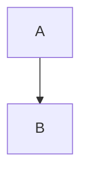

---
# Repo-wide Copilot Instructions
# File: .github/copilot-instructions.md
# Scope: Copilot Chat, Copilot Code Review, Copilot Coding Agent
# Purpose: Generować **dokumentację techniczną** + **zbiory do RAG** z otclient v8 (dev) w sposób bezpieczny i deterministyczny.
---

# otcv8-dev — Agent Contract (RAG‑ready)

## A) Cel i zakres
**Goal:** Agent tworzy i utrzymuje dokumentację (MD) i zbiory danych (CSV/NDJSON) na podstawie **C++/Lua/OTUI** repo oraz źródeł kanonicznych w `docs/reposzablony/*.md`. Artefakty muszą być **RAG‑friendly** (metadane, chunkowanie, stabilne ID).

## B) Polityka IO (czytaj/zapis)
- **WRITE (dozwolone):** `docs/reposzablony/**` *(jedyna ścieżka zapisu)*.
- **READ (dozwolone):** `src/**`, `modules/**`, `mods/**`, `data/**`, `tools/**`, `layouts/**`, `test/**` (tylko do odczytu), opcj. `android/**`, `vc16/**`.
- **DENY (nigdy nie czytaj/nie zapisuj):** `**/backup/**`, `**/backups/**`, `**/tmp/**`, `**/temp/**`, `**/.cache/**`, `**/build/**`, `**/bin/**`, `**/dist/**`, `**/.git/**`, `**/.github/**` *(poza plikami instrukcji)*.
- **Kodowanie/EOL:** UTF‑8 **bez BOM**, EOL = **LF**.

## C) Materializacja treści (źródła → artefakty)
**Źródła:**
1. **Kod repo:** C++ (`.h/.hpp/.hxx`), Lua (`.lua`), OTUI (`.otui`).
2. **Specyfikacje:** `docs/reposzablony/chapter_*.md` (jeśli zawierają bloki „file:” lub code fences z atrybutem `path=`).

**Reguły:**
1) **Code fence z atrybutem `path=` (preferowane)**
````
```lua path=docs/reposzablony/03_modules/examples/foo.lua
-- treść pliku
```
````
→ zapis dokładnie pod `path` (idempotent: tylko gdy różni się treść).

2) **Marker sekcji `### file: <ścieżka>`**
```
### file: docs/reposzablony/04_ui/diagrams/widgets.mmd

```
→ następny fenced block to zawartość pliku docelowego.

3) **Bloki `diff`** – stosuj tylko gdy `+++ b/...` wskazuje `docs/reposzablony/**`.

4) **Brak ścieżki ⇒ brak zapisu** – dopisz notatkę „unmapped code block”.

> **Wyjątek:** Generatory C++/Lua/OTUI mogą pisać **bezpośrednio** pod `docs/reposzablony/**` na podstawie źródeł objętych `applyTo` (patrz §J).

## D) Profil RAG: metadane, chunkowanie, ID
### D1. YAML frontmatter dla **każdego** wygenerowanego MD
Umieszczaj na górze pliku:
```yaml
---
doc_id: "ui:modules/game_healthbars/ui_window"   # stabilne ID dokumentu
source_path: "modules/game_healthbars/window.otui" # relatywna ścieżka źródła
source_sha: "<git-sha1-abbrev>"
last_sync_iso: "${NOW_ISO}"
doc_class: "ui|api|spec|guide"    # do wyboru
language: "pl"
title: "Okno: game_healthbars"
summary: "Struktura widgetów, właściwości, zależności stylów."
tags: ["otui","widgets","ui","healthbars"]
entities:
  - type: "widget"; id: "GameHealthbarsWindow"
  - type: "module"; id: "game_healthbars"
links:
  - label: "Powiązany moduł Lua"
    path: "../03_modules/lua/modules/game_healthbars/init.md"
---
```

### D2. Chunkowanie (embedding‑ready)
- **Cel:** stałe, semantyczne bloki ≤ **1200 tokenów**, z **overlap ~10%**.
- **Granice chunków:** preferuj **nagłówki (H2–H4)**, zachowuj całe fenced code blocks.
- **ID chunku:** `block_id = doc_id + "#" + slug(nagłówka lub sekcji)`. Jeśli brak nagłówka → `block-<n>`.
- **Sekcje tabelaryczne** (np. listy pól/parametrów) nie dziel na środku wiersza.

### D3. Linki i kotwice
- Twórz **relatywne** linki między dokumentami; normalizuj kotwice `kebab-case`.
- Dodawaj *See also* sekcję (krótka lista 3–5 linków powiązanych).

## E) Struktura wyjścia i nazewnictwo
- C++ API → `docs/reposzablony/01_core/api/cpp/<REL_PATH>.md` *(REL_PATH = ścieżka pliku nagłówkowego z `.md`)*
- Lua → `docs/reposzablony/03_modules/lua/<REL_PATH>.md`
- OTUI → `docs/reposzablony/04_ui/otui/<REL_PATH>.md`
- Diagramy/mermaid → `docs/reposzablony/04_ui/diagrams/**`
- Zbiory RAG → `docs/reposzablony/datasets/{api,ui,modules}/**.{csv,ndjson}`

## F) Format treści (skrót)
### F1. C++ (plik MD)
- H1 = pełna ścieżka pliku źródłowego
- Sekcje: **Overview**, **Namespaces**, **Classes/Structs** (public/protected), **Enums**, **Functions**, **Types/Aliases**
- Dla klas: tabelka `member | brief | signature`
- Na końcu: **Mermaid classDiagram** lokalnych typów

### F2. Lua (plik MD)
- Sekcje: **Globals/Exports**, **Functions** (z param/returns), **Events/Callbacks**, **Examples** (gdy są w komentarzach)

### F3. OTUI (plik MD)
- Tabela: `id | class | parent | key props` + zredukowany AST + mały **graph TD** zależności

## G) Walidacje i bramki jakości
- **Frontmatter** wymagany (patrz §D1).
- **Lint linków**: brak martwych linków w obrębie `docs/reposzablony/**`.
- **Idempotencja**: zapisuj tylko, gdy diff ≠ 0.
- **Bez PII**: treści użytkownika zastępuj wskaźnikami (np. `hasMessage: true`).

## H) Dane do RAG — CSV/NDJSON (z próbkami)
### H1. CSV – nagłówki (stałe)
- `api`  → `ts,id,decl,kind,owner,brief,source`
- `ui`   → `ts,id,widgetClass,parent,props,source`
- `mods` → `ts,id,symbol,kind,module,brief,source`

### H2. NDJSON – przykładowe rekordy
**api.ndjson**
```json
{"ts":"${NOW_ISO}","id":"api:Thing@modules/core/thing.hpp","decl":"class Thing","kind":"class","owner":"core","brief":"Encapsulates X.","source":"modules/core/thing.hpp#L12"}
```
**ui.ndjson**
```json
{"ts":"${NOW_ISO}","id":"ui:modules/game_healthbars/GameHealthbarsWindow","widgetClass":"MainWindow","parent":null,"props":{"size":"600 400","anchors":"center"},"source":"modules/game_healthbars/window.otui#1"}
```
**mods.ndjson**
```json
{"ts":"${NOW_ISO}","id":"mod:game_healthbars.show","symbol":"show","kind":"function","module":"game_healthbars","brief":"Open healthbars window.","source":"modules/game_healthbars/init.lua#L42"}
```

### H3. Rotacja plików
- `maxBytes = 50 MB`; po przekroczeniu → przenieś do `datasets/chunks/<base>.<YYYYMMDD-HHMM>.<ext>` i zacznij nowy plik (CSV musi rozpocząć się nagłówkiem).

### H4. Strony statystyk (deterministyczne)
- Top N wg klucza (sort rosnący po kluczu grupującym), sekcje: „Top by module”, „Top by widgetClass”, „API surface by namespace”.

## I) Miejsca wstawek (Agent może edytować **tylko** w tych markerach)
- `<!-- AGENT:INSERT:READING-GUIDE -->`
- `<!-- AGENT:INSERT:MAPPINGS -->`
- `<!-- AGENT:INSERT:LOG-EXAMPLES -->`
- `<!-- AGENT:INSERT:ASSET-EXAMPLES -->`
> Każda wstawka ≤ 50 linii; zachowuj otaczające formatowanie.

## J) Instrukcje per‑obszar (`.github/instructions/*.instructions.md`)
Użyj **YAML frontmatter** z `applyTo` aby ograniczyć zakres. Przykłady:

**`01-cpp-api.instructions.md`**
```md
---
applyTo:
  - "src/**.{h,hpp,hxx}"
  - "modules/**.{h,hpp,hxx}"
---
# Task
Dla każdego pliku nagłówkowego wygeneruj MD (public/protected: klasy, enumy, funkcje). Pomiń prywatne. Wyciągaj komentarze `///` i `/** */`.

# Output
Zapis do: `docs/reposzablony/01_core/api/cpp/<REL_PATH>.md`
```

**`02-ui-lua.instructions.md`**
```md
---
applyTo:
  - "modules/**/*.otui"
  - "modules/**/*.lua"
  - "mods/**/*.lua"
---
# Task
OTUI → lista widgetów (id,class,parent,props) + AST + mały diagram. Lua → exports, funkcje publiczne, eventy.

# Output
OTUI → `docs/reposzablony/04_ui/otui/<REL_PATH>.md`
Lua  → `docs/reposzablony/03_modules/lua/<REL_PATH>.md`
```

## K) Setup (bootstrap minimalny)
- **Workflow** `.github/copilot-setup-steps.yml` z jobem `copilot-setup-steps`:
  - `bash docs/reposzablony/_bootstrap.sh || true`
  - `mkdir -p docs/reposzablony/{01_core/api/cpp,03_modules/lua,04_ui/otui,datasets/{api,ui,modules}}`

## L) Kryteria akceptacji (PR)
- ✅ Zmienione **wyłącznie** pliki w `docs/reposzablony/**`.
- ✅ Każdy MD ma **frontmatter** z §D1; linki działają.
- ✅ CSV mają nagłówki; NDJSON poprawne; rotacja zachowana.
- ✅ Brak arbitralnych zmian formatowania; tylko rzeczywiste różnice.
- ✅ Tytuł PR: `docs(agent): sync tech docs + rag datasets` + krótki opis.

---
## Załącznik A — Sanitizacja ID
- **Token charset:** `[A-Za-z0-9_.-]`.
- Zastąp spacje i „/” na `-` lub `_` zależnie od kontekstu; diakrytyki → ASCII.

## Załącznik B — Utility (kontrakty)
- `nowIso()` → `YYYY-MM-DDTHH:mm:ss.sssZ`.
- `fnv1a(s)` → 32‑bit (Lua: `bit32`/`bit`), hex małe litery.

## Załącznik C — Klasy dokumentów
- `doc_class`: `api`, `ui`, `spec`, `guide` (używaj spójnie dla RAG).

<!-- AGENT:INSERT:READING-GUIDE -->
<!-- AGENT:INSERT:MAPPINGS -->
<!-- AGENT:INSERT:ASSET-EXAMPLES -->
<!-- AGENT:INSERT:LOG-EXAMPLES -->

