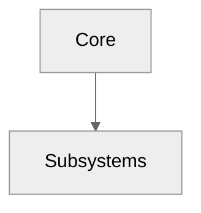

# 1) Datasets to produce

```yaml
datasets:
  - file: "summary.csv"
    desc: "Aggregate counters and coverage for Core C++ API"
    header: ["metric","value","note"]
    rows:
      - ["headers_total","<int>","count of .h/.hpp in src/core"]
      - ["classes_total","<int>","unique public classes found"]
      - ["functions_total","<int>","unique exported functions"]
      - ["namespaces_total","<int>","unique namespaces"]
  - file: "headers.csv"
    desc: "List of header files and basic stats"
    header: ["id","path","include_guard","lines","exports_count"]
  - file: "classes.csv"
    desc: "Public classes (primary types)"
    header: ["id","name","namespace","header","methods_public","signals","notes"]
  - file: "functions.csv"
    desc: "Free/exported functions"
    header: ["id","name","namespace","return","params","header","deprecated","notes"]
  - file: "macros.csv"
    desc: "Common macros detected"
    header: ["name","header","value","notes"]
  - file: "compile_flags.csv"
    desc: "Build flags detected/used for docs (optional)"
    header: ["flag","value","source","notes"]
```

# 2) Diagrams to produce

> NOTE: `click` works in flowchart/graph only (NOT in `sequenceDiagram`)

```yaml
diagrams:
  style:
    mermaid_init: "%%{init: {'theme':'neutral','themeVariables':{'primaryTextColor':'#ddd','lineColor':'#9aa0a6'}}}%%"
    node_ids: "CamelCase(stem)"
    click_rule: "click <NodeId> \"./index.html#facet-01_core.<stem>\" \"Open <stem>\""
    first_line_required: true
  files:
    - file: "architecture.mmd"
      desc: "High-level core component map"
      must_click_anchor: "01_core.architecture"
    - file: "include_graph.mmd"
      desc: "Simplified include graph for top-level headers"
      must_click_anchor: "01_core.include_graph"
```

# 3) Chapter `index.md`

Wymagania:
- Contents (MyST): ```{contents} :local:```
- Min. jeden `{csv-table}` i jeden `{mermaid}`
- Anchory facetów

**Snippet do wklejenia:**
```md
---
title: 01 — Core
---
# 01 — Core

```{contents}
:local:
:depth: 2
```

## Datasets
```{csv-table}
:file: ./datasets/summary.csv
:header-rows: 1
:widths: auto
```

## Diagrams




## Appendix / Facets
<span id="facet-01_core.architecture"></span>
<span id="facet-01_core.include_graph"></span>

# 4) Acceptance checklist (DoD)

- [ ] All CSV exist with the exact headers above  
- [ ] All .mmd start with mermaid_init line as line 1 (in-block, unquoted)  
- [ ] At least 1 Mermaid flowchart with valid `click` anchors  
- [ ] `index.md` renders CSV + Mermaid + Facets  
- [ ] Sphinx build passes under `-W` (no blocking warnings)  
- [ ] Linkcheck/nitpicky passes for internal anchors
