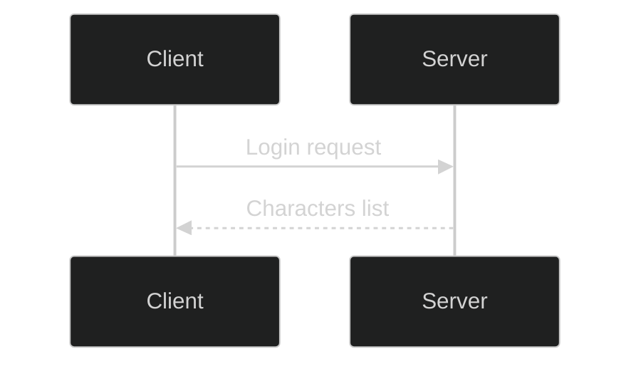

# 04 — Events & Emitters (Authoring Plan)

## Zakres i wyjścia
- Outputs pod: `docs/authoring/02_events/**`
- Używaj MyST: `{csv-table}` i `{mermaid}`

**Artefakty:**
- `datasets/events_matrix.csv`
- `datasets/emitters.csv`
- `datasets/handlers.csv`
- `diagrams/event_flow.mmd`
- `index.md`

## Facety
- `02_events.event_flow`

## Datasets (specyfikacje)
```yaml
datasets:
  - file: events_matrix.csv
    header: ["id","ts","source","event","payload_schema","handlers","notes"]  # handlers = JSON array
    rules:
      - "ts = ISO8601 (e.g. 2025-10-17T12:34:56Z)"
      - "handlers serialized as JSON array"
  - file: emitters.csv
    header: ["emitter","event","args","notes"]  # args = JSON array
    rules:
      - "args serialized as JSON array"
  - file: handlers.csv
    header: ["handler","event","callback","threading","notes"]
```

## Diagrams (Mermaid)
Styl globalny (zalecany w `conf.py`) lub na początku pliku `.mmd`.

```yaml
diagrams:
  style:
    mermaid_init: "%%{init: {'theme':'dark','themeVariables':{'primaryTextColor':'#ddd','lineColor':'#9aa0a6'}}}%%"
    first_line_required: true
  files:
    - file: event_flow.mmd
      desc: "Typical client lifecycle (sequenceDiagram)"
      template: |
        %%{init: {'theme':'dark','themeVariables':{'primaryTextColor':'#ddd','lineColor':'#9aa0a6'}}}%%
        sequenceDiagram
          participant C as Client
          participant S as Server
          C->>S: Login request
          S-->>C: Characters list
```

## Index.md — wymagane embedowania
```yaml
index.must_embed:
  - "datasets/events_matrix.csv via {csv-table}"
  - "diagrams/event_flow.mmd via {mermaid}"
  - 'Appendix/Facets (add <span id="facet-02_events.event_flow"></span>)'
```

### Snippety MyST do wklejenia w `index.md`

## Datasets
```{csv-table}
:header-rows: 1
:file: ./datasets/events_matrix.csv
```

## Diagram



## Appendix / Facets
<span id="facet-02_events.event_flow"></span>


## Akceptacja (DoD)
- [ ] `events_matrix.csv` istnieje i nie jest pusty
- [ ] JSON arrays dla `handlers`/`args`
- [ ] `event_flow.mmd` renderuje (init w 1. linii, ASCII arrows)
- [ ] Anchor facetów w `index.md` (np. `facet-02_events.event_flow`)
