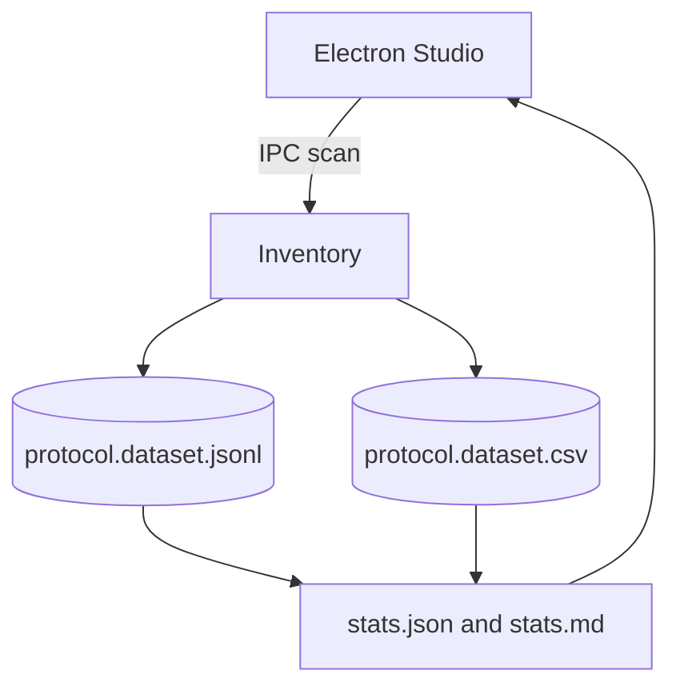
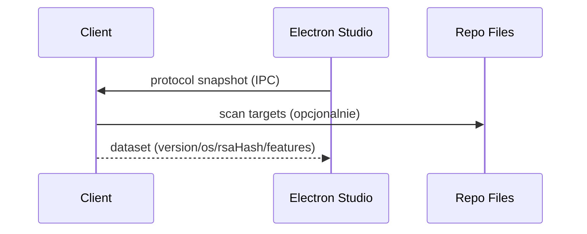

# Chapter 06 - Network

### Professional Pro Template - Agent-Ready - OTClient v8

> Cel: ten rozdzial dokumentuje parametry protokolu klienta (wersja, system/OS, klucz RSA w formie skrótu), opcjonalne cechy (features) i artefakty handshake’u. Generuje rekordy w NDJSON i CSV (append-only), statystyki (JSON/MD) i diagramy (Mermaid). Styl elastyczny i konkretny. Calosc ASCII-only, UTF-8 bez BOM.

---

### 0) Executive summary

- Co: snapshot/y konfiguracji protokolu (clientVersion, customOs, RSA – tylko skrót, bez klucza), zebrane z runtime (jesli API obecne) i/lub z plików repo (skan – wzorce tekstowe).
- Dla kogo: inzynierowie klienta, integratorzy, narzedzia AI/RAG i Studio (Electron/React).
- Output: NDJSON (pelny), CSV (splaszczony), statystyki (JSON/MD), analizy (findings), diagramy (Mermaid), narracja (sekcje merytoryczne).
- Agent-ready: mapa plikow, punkty wstrzykniec (AGENT:INSERT), IO setup, CSV header, IPC hooki Studio, checklist DoD.

---

### 1) Struktura folderu i linkowanie

```bash
06_network/
  README.md                       # narracja + TOC + nawigacja (ten plik)
  meta.json                       # mapa plikow + zadania + tags (machine-readable)
  protocol.schema.json            # walidacja rekordow NDJSON (protocol)
  sections/
    00_network_basics.md          # podstawy protokolu (dla nowych dev)
    01_introduction.md            # po co zrzucac parametry protokolu
    02_protocol_model.md          # slownik pol protokolu + przyklady
    03_collection_methods.md      # jak zbieramy (runtime API + skan plikow)
    04_quality_and_limits.md      # jakosc, ograniczenia, SLO
    05_how_to_read_stats.md       # jak czytac statystyki i korelowac
  datasets/
    protocol.dataset.jsonl        # NDJSON (append-only)
    protocol.dataset.csv          # CSV (naglowek staly)
    chunks/
      README.md                   # polityka dzielenia
  stats/
    stats.json                    # metryki zbiorcze (wersje, OS, RSA-hashy)
    stats.md                      # raport czytelny dla ludzi
  analysis/
    findings.md                   # wnioski z danych + linki do rekordow
    figures/                      # wykresy i tabele eksportowane
  extractors/
    protocol_inventory.lua        # snapshot runtime + skan plikow -> NDJSON+CSV
    protocol_stats.lua            # agregacje -> stats.json + stats.md
  config/
    protocol.targets.txt          # lista sciezek do skanu (regex/patterny)
  diagrams/
    network_flow.mmd              # Mermaid: przeplyw inwentaryzacji
    login_handshake.mmd           # Mermaid: sekwencja (wysoki poziom)
```

> Note: IO setup w README ponizej. Zawsze ASCII-only, UTF-8 bez BOM, LF konce linii.

---

### 2) README - nawigacja i instrukcje (Agent-friendly)

```markdown
---
id: chapter:network
title: Network - Protocol and Handshake
authors: ["docs-export"]
version: 1.0
last_updated: 2025-10-08
status: draft
tags: ["network","protocol","rsa","clientVersion","otclient","agent"]
related:
  - ../01_runtime/README.md
  - ../02_events/README.md
  - ../09_logging/README.md
outputs:
  - ./datasets/protocol.dataset.jsonl
  - ./datasets/protocol.dataset.csv
  - ./stats/stats.json
  - ./stats/stats.md
encoding: UTF-8 (no BOM)
---
Short: rozdzial zbiera parametry protokolu (z runtime jesli API jest dostepne; w przeciwnym razie skan plikow repo wedlug wzorcow) i publikuje znormalizowane rekordy.

Table of contents
- [0. Network basics](./sections/00_network_basics.md)
- [1. Wprowadzenie](./sections/01_introduction.md)
- [2. Model protokolu (slownik)](./sections/02_protocol_model.md)
- [3. Zbieranie (runtime + skan plikow)](./sections/03_collection_methods.md)
- [4. Jakosc i ograniczenia](./sections/04_quality_and_limits.md)
- [5. Jak czytac statystyki](./sections/05_how_to_read_stats.md)
- [Statystyki](./stats/stats.md) - [Datasety](./datasets/) - [Analizy](./analysis/findings.md)

Quick links
- Schema: [protocol.schema.json](./protocol.schema.json)
- NDJSON: [datasets/protocol.dataset.jsonl](./datasets/protocol.dataset.jsonl)
- CSV: [datasets/protocol.dataset.csv](./datasets/protocol.dataset.csv)
- Diagrams: [diagrams/network_flow.mmd](./diagrams/network_flow.mmd), [diagrams/login_handshake.mmd](./diagrams/login_handshake.mmd)

Crosslinks
- Runtime: ../01_runtime/README.md
- Events: ../02_events/README.md
- Logging: ../09_logging/README.md

id,ts,clientVersion,customOs,rsaHash,features_json,source_json

Header jest staly - narzedzia BI moga cachowac schemat.

IO setup
- Default: dofile('../../_shared/lua/docio.lua')
- Isolated: copy to 06_network/_local/docio.lua and use dofile('../_local/docio.lua')

Skad do _shared
| Start location | Path to _shared |
|---|---|
| 06_network/extractors | ../../_shared/lua/docio.lua |
| 06_network | ../_shared/lua/docio.lua |

Chunks aggregation
- Aggregator czyta glowny plik oraz opcjonalny indeks: docs/06_network/datasets/chunks/index.json (JSON array nazw chunkow).

Studio hooks (Electron) - skrot
- IPC: 'studio:network.protocol.scan' -> uruchamia protocol_inventory.lua (jednorazowy snapshot)
- IPC: 'studio:aggregate.network' -> uruchamia protocol_stats.lua
- IPC: 'studio:open.network' {type: 'jsonl'|'csv'} -> otwiera dataset w Studio
- Preload: contextIsolation: true; nodeIntegration: false; eksponuj bezpieczne API
- Sandbox: wszystkie zapisy ida przez docio.lua pod 06_network
- View: podglad stats.md + tabela CSV; linki do rekordow po id w NDJSON
```

---

### 3) Mapa plikow i odpowiedzialnosci (reference for Agents)

| Plik / Katalog | Rola | Kto uzupelnia | Uwagi |
|---|---|---|---|
| protocol.schema.json | walidacja rekordow protokolu | Agent/CI | waliduj linie po linii |
| datasets/*.jsonl | pelne rekordy (append) | inventory | rotacja w chunks/ |
| datasets/*.csv | widok splaszczony | inventory | features_json, source_json jako string |
| stats/*.json\|md | metryki zbiorcze | aggregator | rozklad wersji/os/hashy |
| sections/*.md | narracja i wyjasnienia | Agent/Autor | AGENT:INSERT punkty |
| analysis/* | wnioski i korelacje | Agent/Analityk | linkuj id rekordow |
| extractors/*.lua | zrzut i agregacja | system | nie zmieniaj API zapisu |

---

### 4) Slownik protokolu (data dictionary)

| Pole | Typ | Przyklad | Znaczenie |
|---|---|---|---|
| id | string | proto:1097@2025-10-08T12:00:00Z | Unikat: proto:`<clientVersion>`@`<ISO>` (gdy brak wersji -> proto:unknown@`<ISO>`). |
| type | string | protocol | Stala wartosc: protocol. |
| ts | string | 2025-10-08T12:00:00Z | Czas snapshotu (UTC). |
| clientVersion | number\|string | 1097 | Wersja klienta/protokolu. |
| customOs | string | OTCv8 | Oznaczenie OS/klienta, jesli specyficzne. |
| rsaHash | string | fnv1a32:ab12cd34 | Skrót klucza publicznego (bez ujawniania tresci). |
| features | object | {"bless":true} | Dodatkowe cechy/feature flags (opcjonalne). |
| source | object | {"runtime":true,"files":["/path/..."]} | Skad pozyskano informacje. |
| links[] | string[] | events:..., runtime:... | Powiazania z innymi rozdzialami. |

> Agent tip: w sections/02_protocol_model.md wstaw 3-5 realnych rekordow z NDJSON + komentarz skad pochodza pola (runtime vs skan).

---

### 5) Pipeline danych (odczyt -> zapis -> analiza)

1. Inventory: proba pobrania z runtime (API), jesli brak -> skan plikow z config/protocol.targets.txt; wynik laczony w jeden rekord.
2. Aggregator: liczy rozklady wersji/OS/hashy i zapisuje stats.*.
3. Narracja: sekcje opisowe z przykladami i zrodlami.
4. Analizy: findings i korelacje (np. wersja protokolu vs eventy logowania).
5. Publikacja: sprawdz checklist DoD.

---

### 6) Sekcje merytoryczne - szablony i wprowadzenie do Network

sections/00_network_basics.md

```markdown
# Network basics - dla nowych dev
Protokol klienta obejmuje wersje (clientVersion), system/OS (customOs) oraz kryptografie (klucz publiczny RSA do weryfikacji). W roznych forkach wartosci moga sie roznic.

Pojecia
- clientVersion: numer protokolu-klienta wymagany przez serwer.
- customOs: identyfikator (np. nazwa klienta/OS), jesli stosowany.
- RSA public key: klucz publiczny; **nie zapisujemy tresci** tylko hash (rsaHash).
```

sections/01_introduction.md

```markdown
# Wprowadzenie - po co zbierac parametry protokolu
Aby zapewnic spojnosc builda i zgodnosc z serwerami. Pozwala to rowniez odtwarzac problemy z logowaniem (np. niedopasowana wersja) i ujednolac dokumentacje.

Kiedy uzywac
- audyt builda i zgodnosci,
- analiza regresji po zmianach protokolu,
- wsparcie dla generatora konfiguracji klienta.
```

sections/02_protocol_model.md

```markdown
# Model protokolu - definicje i przyklady
Zobacz slownik w README. Wstaw przyklady z NDJSON i krotkie komentarze o pochodzeniu pol (runtime vs pliki).

<!-- AGENT:INSERT:PROTO-EXAMPLES -->
```

sections/03_collection_methods.md

```markdown
# Zbieranie (runtime + skan plikow)
- Najpierw runtime: proba wywolania API (pcall), bez twardych zaleznosci na funkcje.
- Jesli runtime nie zwroci danych, skanuj pliki z config/protocol.targets.txt regexami.
- Studio: uruchamiaj snapshot przez IPC (patrz README Studio hooks).
```

sections/04_quality_and_limits.md

```markdown
# Jakosc i ograniczenia
- Rozne forki moga miec inne miejsca deklaracji wartosci; skan opiera sie na wzorcach.
- Nie zapisujemy tresci klucza RSA – tylko skrót.
- Wartosci dynamiczne moga wymagac korelacji z eventami logowania.
```

sections/05_how_to_read_stats.md

```markdown
# Jak czytac statystyki
- Sprawdz rozklad wersji i OS – wykryj rozjazdy miedzy buildami.
- Zestaw rsaHash z wersja; nagle zmiany moga wskazywac na rekonfiguracje kluczy.

<!-- AGENT:INSERT:READING-GUIDE -->
```

---

### 7) Polityka dzielenia danych - datasets/chunks/README.md

```markdown
# Chunks - polityka
- Utrzymuj glowne pliki do ok. 50 MB.
- Starsze dane przenos do protocol.dataset.<YYYYMMDD-HHMM>.jsonl oraz .csv.
- Po przeniesieniu chunkow traktuj je jako read-only.
- Zaktualizuj meta.json (datasets.chunksDir) gdy zmieni sie nazwa katalogu.
```

---

### 8) Schema - protocol.schema.json

```json
{
  "$schema": "http://json-schema.org/draft-07/schema#",
  "title": "protocol.record",
  "type": "object",
  "required": ["id","type","ts"],
  "properties": {
    "id": {"type":"string","pattern":"^proto:[A-Za-z0-9_.-]+@[0-9TZ:-]+$"},
    "type": {"type":"string","const":"protocol"},
    "ts": {"type":"string","format":"date-time"},
    "clientVersion": {"oneOf":[{"type":"number"},{"type":"string"}]},
    "customOs": {"type":"string"},
    "rsaHash": {"type":"string"},
    "features": {"type":"object"},
    "source": {"type":"object"},
    "links": {"type":"array","items":{"type":"string"}}
  }
}
```

---

### 9) Extractors (Lua) - gotowe pliki

extractors/protocol_inventory.lua

```lua
-- 06_network/extractors/protocol_inventory.lua
-- Snapshot protokolu: runtime (gdy API obecne) + skan plikow (wzorce) -> JSONL + CSV
-- ASCII-only; UTF-8 bez BOM; LF
local docio = dofile('../../_shared/lua/docio.lua')
local json = require('json')

local CSV_HEADER = { 'id','ts','clientVersion','customOs','rsaHash','features_json','source_json' }
local MAX_BYTES = 50*1024*1024

local function nowIso()
  local t = os.date('!*t')
  return string.format('%04d-%02d-%02dT%02d:%02d:%02dZ', t.year, t.month, t.day, t.hour, t.min, t.sec)
end

local function fnv1a32(s)
  if not s then return '' end
  local hash = 2166136261
  for i = 1, #s do
    hash = hash ~ string.byte(s, i)
    hash = (hash * 16777619) % 4294967296
  end
  return string.format('fnv1a32:%08x', hash)
end

local function trymethod(obj, name)
  local ok, res = pcall(function()
    if obj and type(obj[name]) == 'function' then return obj[name](obj) end
    return nil
  end)
  if ok then return res end
  return nil
end

local function parseCandidates(text, acc)
  acc = acc or {}
  for line in (text or ''):gmatch('[^\r\n]+') do
    -- clientVersion (np. clientVersion = 1097)
    local ver = line:match('[Cc]lient[Vv]ersion%W*[:=]%W*([0-9]+)')
    if ver then acc.clientVersion = tonumber(ver) or ver end
    -- customOs (np. customOs = "OTCv8")
    local osn = line:match('[Cc]ustom[Oo][Ss]%W*[:=]%W*"([^"]+)"')
    if osn then acc.customOs = osn end
    -- RSA (np. RSA.*"LONGKEY..." lub klucz w wielu liniach - bierz wierszowe ciagi)
    local rsa = line:match('RSA[^\"]*"([A-Fa-f0-9%s]+)"') or line:match('RSA[^\"]*"([%+/%=A-Za-z0-9%s]+)"')
    if rsa and #rsa > 32 then
      rsa = rsa:gsub('%s+','')
      acc.rsaHash = fnv1a32(rsa)
    end
    -- features (np. feature.xxx = true/false/123)
    local fkey, fval = line:match('[Ff]eature%.([A-Za-z0-9_]+)%W*[:=]%W*([A-Za-z0-9_]+)')
    if fkey and fval then
      local v = (fval == 'true') and true or (fval == 'false') and false or tonumber(fval) or fval
      acc.features = acc.features or {}
      acc.features[fkey] = v
    end
  end
  return acc
end

local function loadTargets()
  local out = {}
  local cfg = docio.readAll('docs/06_network/config/protocol.targets.txt')
  if cfg and #cfg > 0 then
    for line in cfg:gmatch('[^\r\n]+') do
      local p = line:match('^%s*(.-)%s*$')
      if p ~= '' and not p:match('^#') then out[#out+1] = p end
    end
  end
  return out
end

local function snapshot()
  local s = { ts = nowIso(), source = { runtime = false, files = {} } }
  -- Proby runtime (bezpieczne; brak zaleznosci twardych)
  local gv = trymethod(g_game, 'getClientVersion') or trymethod(g_game, 'getProtocolVersion')
  if gv then s.clientVersion = gv; s.source.runtime = true end
  local osname = trymethod(g_window, 'getPlatform') or trymethod(g_app, 'getName')
  if osname then s.customOs = osname; s.source.runtime = true end
  -- skan plikow
  local targets = loadTargets()
  for _,path in ipairs(targets) do
      if g_resources and g_resources.fileExists and g_resources.fileExists(path) then
      local txt = g_resources.readFileContents(path)
      parseCandidates(txt, s)
      s.source.files[#s.source.files+1] = path
    end
  end
  -- identyfikator i domkniecie pol
  s.id = string.format('proto:%s@%s', tostring(s.clientVersion or 'unknown'), s.ts)
  s.type = 'protocol'
  s.features = s.features or {}
  s.rsaHash = s.rsaHash or ''
  s.links = {}
  return s
end

local function run()
  local rec = snapshot()
  docio.appendJsonl('docs/06_network/datasets/protocol.dataset.jsonl', rec, MAX_BYTES)
  docio.writeCsvHeader('docs/06_network/datasets/protocol.dataset.csv', CSV_HEADER)
  local row = {
    id = rec.id, ts = rec.ts,
    clientVersion = rec.clientVersion, customOs = rec.customOs,
    rsaHash = rec.rsaHash,
    features_json = json.encode(rec.features or {}),
    source_json = json.encode(rec.source or {})
  }
  docio.appendCsvRow('docs/06_network/datasets/protocol.dataset.csv', CSV_HEADER, row, MAX_BYTES)
end

run()
```

extractors/protocol_stats.lua

```lua
-- 06_network/extractors/protocol_stats.lua
-- Agregacja -> stats.json + stats.md (deterministyczny output; sort kluczy)
-- ASCII-only; UTF-8 bez BOM; LF
local docio = dofile('../../_shared/lua/docio.lua')
local json = require('json')

local function parseLines(text)
  local out = {}
  if not text or #text == 0 then return out end
  for line in text:gmatch('[^\r\n]+') do
    local ok, obj = pcall(function() return json.decode(line) end)
    if ok and type(obj) == 'table' then out[#out+1] = obj end
  end
  return out
end

local function loadAllRecords()
  local recs = {}
  local head = docio.readAll('docs/06_network/datasets/protocol.dataset.jsonl')
  local headList = parseLines(head)
  for i=1,#headList do recs[#recs+1] = headList[i] end
  local indexText = docio.readAll('docs/06_network/datasets/chunks/index.json')
  if indexText and #indexText > 0 then
    local ok, list = pcall(function() return json.decode(indexText) end)
    if ok and type(list) == 'table' then
      for _,fname in ipairs(list) do
        local path = fname
        if not tostring(fname):match('^docs/') then
          path = 'docs/06_network/datasets/chunks/' .. tostring(fname)
        end
        local t = docio.readAll(path)
        local more = parseLines(t)
        for i=1,#more do recs[#recs+1] = more[i] end
      end
    end
  end
  return recs
end

local function stats(recs)
  local s = { count = #recs, byVersion = {}, byOs = {}, byRsaHash = {}, features = {} }
  for _,r in ipairs(recs) do
    local v = tostring(r.clientVersion or 'unknown')
    local o = tostring(r.customOs or 'unknown')
    local h = tostring(r.rsaHash or '')
    s.byVersion[v] = (s.byVersion[v] or 0) + 1
    s.byOs[o] = (s.byOs[o] or 0) + 1
    if h ~= '' then s.byRsaHash[h] = (s.byRsaHash[h] or 0) + 1 end
    if type(r.features) == 'table' then
      for fk,fv in pairs(r.features) do
        local key = string.format('%s=%s', fk, tostring(fv))
        s.features[key] = (s.features[key] or 0) + 1
      end
    end
  end
  return s
end

local function writeSection(title, map)
  local lines, keys = {}, {}
  for k,_ in pairs(map) do keys[#keys+1] = k end
  table.sort(keys)
  lines[#lines+1] = title
  for _,k in ipairs(keys) do lines[#lines+1] = string.format('- %s: %d', k, map[k]) end
  lines[#lines+1] = ''
  return table.concat(lines, '\n')
end

local function writeMD(s)
  local md = {}
  md[#md+1] = '# Network - Statystyki\n'
  md[#md+1] = ''
  md[#md+1] = string.format('- Rekordy: %d\n', s.count)
  md[#md+1] = ''
  md[#md+1] = writeSection('## By clientVersion', s.byVersion)
  md[#md+1] = writeSection('## By customOs', s.byOs)
  md[#md+1] = writeSection('## By rsaHash', s.byRsaHash)
  md[#md+1] = writeSection('## Features', s.features)
  md[#md+1] = 'Hint: zmianom wersji lub rsaHash czesto towarzysza zmiany w eventach logowania.\n'
  return table.concat(md)
end

local function run()
  local recs = loadAllRecords()
  local s = stats(recs)
  docio.writeAll('docs/06_network/stats/stats.json', json.encode(s))
  docio.writeAll('docs/06_network/stats/stats.md', writeMD(s))
end

run()
```

---

### 10) Diagramy (Mermaid)

diagrams/network_flow.mmd



diagrams/login_handshake.mmd



---

### 11) Encoding i formatowanie (UTF-8 safe)

- Pliki: UTF-8 bez BOM, ASCII-only w tresci (kreska '-', cudzyslow ", apostrof ').
- Koniec linii: LF. Unikaj znakow specjalnych i dlugich myslnikow.
- Naglowki: H1 (#), pozostale H3 (###) aby Sphinx parsowal lagodniej.

---

### 12) Jakosc, SLO i bezpieczenstwo (krotko)

- NDJSON append-only; przy duzych wolumenach uzyj chunks.
- **Bezpieczenstwo**: nie zapisujemy tresci RSA – tylko skrót (rsaHash).
- Skan plikow to best-effort; trzymaj aktualna liste targetow w config.

---

### 13) DoD Checklist - Agent clickable

- [ ] Zapis do docs/06_network/datasets/protocol.dataset.jsonl i protocol.dataset.csv dziala (>= 1 snapshot; runtime i/lub skan plikow).
- [ ] Wygenerowano stats/stats.json oraz stats/stats.md (deterministyczny output list).
- [ ] Uzupelniono sekcje: 00_network_basics.md, 01_introduction.md, 02_protocol_model.md (z przykladami), 03_collection_methods.md.
- [ ] W analysis/findings.md dodano min. 1 obserwacje (np. roznice miedzy buildami/forkami).
- [ ] Diagramy network_flow.mmd i login_handshake.mmd istnieja i sa logiczne.
- [ ] meta.json ma poprawne crosslinks: ../01_runtime, ../02_events, ../09_logging.
- [ ] Walidacja probki 10 linii NDJSON przeciw protocol.schema.json zakonczona bez bledow.

---

### 14) meta.json - wzorzec z tagami i linkowaniem

```json
{
  "$schemaVersion": 1,
  "chapterId": "chapter:network",
  "title": "Network - Protocol and Handshake",
  "owners": ["docs-export"],
  "tags": ["network","protocol","rsa","clientVersion","otclient","agent"],
  "fileMap": {
    "readme": "./README.md",
    "schema": "./protocol.schema.json",
    "sections": [
      "./sections/00_network_basics.md",
      "./sections/01_introduction.md",
      "./sections/02_protocol_model.md",
      "./sections/03_collection_methods.md",
      "./sections/04_quality_and_limits.md",
      "./sections/05_how_to_read_stats.md"
    ],
    "datasets": {
      "jsonl": "./datasets/protocol.dataset.jsonl",
      "csv": "./datasets/protocol.dataset.csv",
      "chunksDir": "./datasets/chunks"
    },
    "stats": {
      "json": "./stats/stats.json",
      "md": "./stats/stats.md"
    },
    "analysis": {
      "findings": "./analysis/findings.md",
      "figuresDir": "./analysis/figures"
    },
    "extractors": [
      "./extractors/protocol_inventory.lua",
      "./extractors/protocol_stats.lua"
    ],
    "diagrams": [
      "./diagrams/network_flow.mmd",
      "./diagrams/login_handshake.mmd"
    ],
    "config": {
      "targets": "./config/protocol.targets.txt"
    }
  },
  "linking": {
    "recordIdPattern": "proto:<clientVersion>@<ISO8601>",
    "crossChapter": {
      "runtime": "../01_runtime/README.md",
      "events": "../02_events/README.md",
      "logging": "../09_logging/README.md"
    }
  },
  "agent": {
    "tasks": [
      {"id": "inventory", "desc": "Snapshot protokolu (runtime+scan) do JSONL/CSV", "outputs": ["datasets.jsonl", "datasets.csv"]},
      {"id": "aggregate", "desc": "Agregacja do stats.json/stats.md", "outputs": ["stats.json", "stats.md"]},
      {"id": "author", "desc": "Uzupelnienie sekcji i findings + wstrzykniecia danych", "targets": ["sections/*", "analysis/*"]}
    ],
    "insertPoints": {
      "sections/02_protocol_model.md": ["AGENT:INSERT:PROTO-EXAMPLES"],
      "sections/05_how_to_read_stats.md": ["AGENT:INSERT:READING-GUIDE"],
      "analysis/findings.md": ["AGENT:INSERT:FINDINGS"]
    }
  }
}
```
