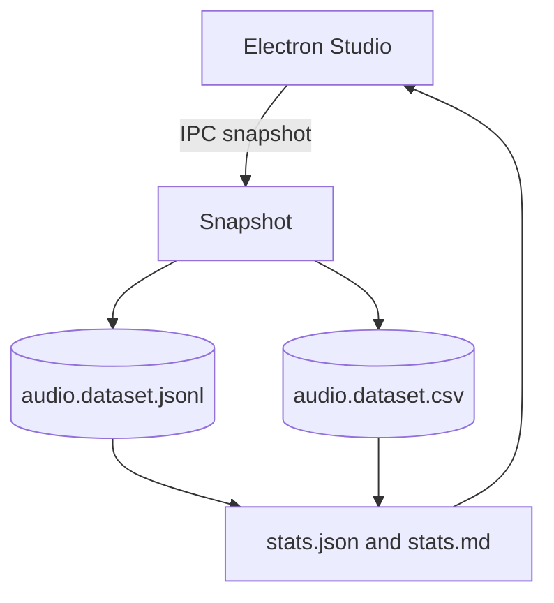

# Chapter 08 - Audio

### Professional Pro Template - Agent-Ready - OTClient v8

> Cel: ten rozdzial zbiera stan warstwy audio (kanaly, odtwarzanie, glosnosci, mute) oraz tworzy znormalizowane rekordy. Dane sluza do audytu konfiguracji, korelacji z wydajnoscia i eventami oraz wsparcia dla Studio (Electron/React). Styl elastyczny i konkretny. Calosc ASCII-only, UTF-8 bez BOM.

---

### 0) Executive summary

- Co: snapshot(y) konfiguracji i stanu audio: masterVolume, per-channel volume, muted, lista grajacych zrodel (jesli API na to pozwala). Best-effort z runtime; fallback do statycznych list kanalow z config.
- Dla kogo: inzynierowie klienta, QA, narzedzia AI/RAG i Studio.
- Output: NDJSON (pelny), CSV (splaszczony), statystyki (JSON/MD), narracja (sekcje merytoryczne), diagram (Mermaid).
- Agent-ready: mapa plikow, punkty wstrzykniec (AGENT:INSERT), IO setup, CSV header, Studio hooks, checklist DoD.

---

### 1) Struktura folderu i linkowanie

```bash
08_audio/
  README.md                      # narracja + TOC + nawigacja (ten plik)
  meta.json                      # mapa plikow + zadania + tags (machine-readable)
  audio.schema.json              # walidacja rekordow NDJSON (audio snapshot per channel)
  sections/
    00_audio_basics.md           # podstawy audio w kliencie (dla nowych dev)
    01_introduction.md           # po co zbierac stan audio
    02_audio_model.md            # slownik pol i przyklady
    03_collection_methods.md     # jak zbieramy (runtime API, fallback config)
    04_quality_and_limits.md     # jakosc, ograniczenia, SLO
    05_how_to_read_stats.md      # jak czytac statystyki i korelowac
  datasets/
    audio.dataset.jsonl          # NDJSON (append-only; po jednym rekordzie na kanal)
    audio.dataset.csv            # CSV (naglowek staly)
    chunks/
      README.md                  # polityka dzielenia
  stats/
    stats.json                   # metryki zbiorcze (mute, rozklady glosnosci)
    stats.md                     # raport czytelny dla ludzi
  analysis/
    findings.md                  # wnioski z danych + linki do rekordow
    correlations.md              # korelacje: audio vs events/runtime
    figures/                     # wykresy i tabele eksportowane
  extractors/
    audio_snapshot.lua           # snapshot z runtime -> NDJSON/CSV
    audio_stats.lua              # agregacje -> stats.json + stats.md
  config/
    audio.channels.txt           # lista kanalow fallback (po jednej nazwie w linii)
  diagrams/
    audio_flow.mmd               # Mermaid: przeplyw danych audio
```

> Note: IO setup w README ponizej. Zawsze ASCII-only, UTF-8 bez BOM, LF konce linii.

---

### 2) README - nawigacja i instrukcje (Agent-friendly)

```markdown
---
id: chapter:audio
title: Audio - Runtime State and Channels
authors: ["docs-export"]
version: 1.0
last_updated: 2025-10-08
status: draft
tags: ["audio","channels","volume","mute","otclient","agent"]
related:
  - ../01_runtime/README.md
  - ../02_events/README.md
  - ../05_assets/README.md
outputs:
  - ./datasets/audio.dataset.jsonl
  - ./datasets/audio.dataset.csv
  - ./stats/stats.json
  - ./stats/stats.md
encoding: UTF-8 (no BOM)
---
Short: rozdzial zbiera stan audio (kanaly, odtwarzanie, glosnosci, mute). Jesli API nie dostepne, korzysta z fallbacku (lista kanalow).

Table of contents
- [0. Audio basics](./sections/00_audio_basics.md)
- [1. Wprowadzenie](./sections/01_introduction.md)
- [2. Model audio (slownik)](./sections/02_audio_model.md)
- [3. Zbieranie (runtime API, fallback)](./sections/03_collection_methods.md)
- [4. Jakosc i ograniczenia](./sections/04_quality_and_limits.md)
- [5. Jak czytac statystyki](./sections/05_how_to_read_stats.md)
- [Statystyki](./stats/stats.md) - [Datasety](./datasets/) - [Analizy](./analysis/findings.md)

Quick links
- Schema: [audio.schema.json](./audio.schema.json)
- NDJSON: [datasets/audio.dataset.jsonl](./datasets/audio.dataset.jsonl)
- CSV: [datasets/audio.dataset.csv](./datasets/audio.dataset.csv)
- Diagrams: [diagrams/audio_flow.mmd](./diagrams/audio_flow.mmd)

Crosslinks
- Runtime: ../01_runtime/README.md
- Events: ../02_events/README.md
- Assets: ../05_assets/README.md

CSV header (audio.dataset.csv)
```

id,ts,channel,playing,masterVolume,channelVolume,muted,state_json

```markdown
Header jest staly - narzedzia BI moga cachowac schemat.

IO setup
- Default: dofile('../../_shared/lua/docio.lua')
- Isolated: copy to 08_audio/_local/docio.lua and use dofile('../_local/docio.lua')

Skad do _shared
| Start location | Path to _shared |
|---|---|
| 08_audio/extractors | ../../_shared/lua/docio.lua |
| 08_audio | ../_shared/lua/docio.lua |

Chunks aggregation
- Aggregator czyta glowny plik oraz opcjonalny indeks: docs/08_audio/datasets/chunks/index.json (JSON array nazw chunkow).

Studio hooks (Electron) - skrot
- IPC: 'studio:audio.snapshot.run' -> uruchamia audio_snapshot.lua
- IPC: 'studio:aggregate.audio' -> uruchamia audio_stats.lua
- IPC: 'studio:open.audio' {type: 'jsonl'|'csv'} -> otwiera dataset w Studio
- Preload: contextIsolation: true; nodeIntegration: false; eksponuj bezpieczne API
- Sandbox: wszystkie zapisy ida przez docio.lua pod 08_audio
- View: podglad stats.md + tabela CSV; linki do rekordow po id w NDJSON
```

---

### 3) Mapa plikow i odpowiedzialnosci (reference for Agents)

| Plik / Katalog | Rola | Kto uzupelnia | Uwagi |
|---|---|---|---|
| audio.schema.json | walidacja rekordow audio | Agent/CI | waliduj linie po linii |
| datasets/*.jsonl | pelne rekordy (append) | snapshot | rotacja w chunks/ |
| datasets/*.csv | widok splaszczony | snapshot | tylko skalary; state_json jako string |
| stats/*.json\|md | metryki zbiorcze | aggregator | rozklad mute, volume bins |
| sections/*.md | narracja i wyjasnienia | Agent/Autor | AGENT:INSERT punkty |
| analysis/* | wnioski i korelacje | Agent/Analityk | linkuj id rekordow |
| extractors/*.lua | zrzut i agregacja | system | nie zmieniaj API zapisu |

---

### 4) Slownik audio (data dictionary)

| Pole | Typ | Przyklad | Znaczenie |
|---|---|---|---|
| id | string | audio:master@2025-10-08T12:00:00Z | Unikat: audio:`<channel>`@`<ISO>`. |
| type | string | audio | Stala wartosc: audio. |
| ts | string | 2025-10-08T12:00:00Z | Czas snapshotu (UTC). |
| channel | string | master | Nazwa kanalu (master, music, sfx, ui, voice itp.). |
| playing | boolean | true | Czy gra cokolwiek na kanale (jesli API dostepne). |
| masterVolume | number | 0.80 | Poziom master (0..1 lub 0..100, ujednolicone do 0..1). |
| channelVolume | number | 0.70 | Poziom kanalu (0..1). |
| muted | boolean | false | Czy kanal wyciszony. |
| state | object | {"sources":2} | Surowe pola zwrocone przez runtime (opcjonalnie). |
| links[] | string[] | res:..., evt:..., runtime:... | Powiazania z innymi rozdzialami.

Agent tip: w sections/02_audio_model.md wstaw 3-5 realnych przykladow z NDJSON i krotki komentarz skad pochodza (runtime vs fallback).

---

### 5) Pipeline danych (odczyt -> zapis -> analiza)

1. Snapshot proboje pobrac stan z runtime (pcall); jesli brak danych, tworzy rekordy dla kanalow z config/audio.channels.txt z polami przyblizonymi (np. playing=false, volume=nil).
2. Aggregator liczy rozklady mute i glosnosci oraz zapisuje stats.*.
3. Narracja: sekcje opisowe z przykladami i zrodlami.
4. Analizy: findings i korelacje (np. mute/volume vs eventy lub spadki FPS).
5. Publikacja: sprawdz checklist DoD i oznacz rozdzial jako ready.

---

### 6) Sekcje merytoryczne - szablony i wprowadzenie do Audio

sections/00_audio_basics.md

```markdown
# Audio basics - dla nowych dev
Warstwa audio jest odpowiedzialna za odtwarzanie efektow i muzyki. Czesci systemu moga korzystac z roznych kanalow (master/music/sfx/ui). API bywa roznorodne w forkach; dlatego snapshot dziala best-effort.

Pojecia
- master volume vs channel volume.
- mute na poziomie master lub kanalu.
- playing: heurystyka (ilosc zrodel grajacych na kanale) jesli API to wspiera.
```

sections/01_introduction.md

```markdown
# Wprowadzenie - po co zbierac stan audio
Aby zrozumiec konfiguracje i sprawdzic wplyw audio na wydajnosc oraz UX (np. glosnosc UI). Dane przydaja sie do testow A/B i audytow.

Kiedy uzywac
- audyt builda,
- sledzenie regresji po zmianach audio,
- wsparcie dla generatora konfiguracji.
```

sections/02_audio_model.md

```markdown
# Model audio - definicje i przyklady
Zobacz slownik w README. Wstaw przyklady z NDJSON oraz komentarz o pochodzeniu pol (runtime vs fallback).

<!-- AGENT:INSERT:AUDIO-EXAMPLES -->
```

sections/03_collection_methods.md

```markdown
# Zbieranie (runtime API, fallback)
- Najpierw runtime: pcall na kandydatach (g_audio, g_sounds, g_sound, g_music) oraz metodach (getMasterVolume, getChannelVolume, isMuted, isAnyPlaying, listPlayingSources...).
- Jesli runtime nie zwroci danych, wczytaj kanaly z config/audio.channels.txt i wypelnij minimalny rekord.
- Studio: uruchamiaj snapshot przez IPC (patrz README Studio hooks).
```

sections/04_quality_and_limits.md

```markdown
# Jakosc i ograniczenia
- API audio moze sie roznic w forkach; snapshot jest best-effort z pcall.
- Volume normalizujemy do 0..1; jesli API zwraca 0..100, dziel przez 100.
- playing jest heurystyka; bez API ustaw na false i odnotuj w state.sources=0.
```

sections/05_how_to_read_stats.md

```markdown
# Jak czytac statystyki
- Sprawdz mute i skrajne glosnosci na master oraz popularnych kanalach (music, sfx, ui).
- Koreluj z eventami i runtime (np. spikes przy duzej liczbie zrodel).

<!-- AGENT:INSERT:READING-GUIDE -->
```

---

### 7) Polityka dzielenia danych - datasets/chunks/README.md

```markdown
# Chunks - polityka
- Utrzymuj glowne pliki do ok. 50 MB.
- Starsze dane przenos do audio.dataset.<YYYYMMDD-HHMM>.jsonl oraz .csv.
- Po przeniesieniu chunkow traktuj je jako read-only.
- Zaktualizuj meta.json (datasets.chunksDir) gdy zmieni sie nazwa katalogu.
```

---

### 8) Schema - audio.schema.json

```json
{
  "$schema": "http://json-schema.org/draft-07/schema#",
  "title": "audio.record",
  "type": "object",
  "required": ["id","type","ts","channel","playing"],
  "properties": {
    "id": {"type":"string","pattern":"^audio:[A-Za-z0-9_.-]+@[0-9TZ:-]+$"},
    "type": {"type":"string","const":"audio"},
    "ts": {"type":"string","format":"date-time"},
    "channel": {"type":"string"},
    "playing": {"type":"boolean"},
    "masterVolume": {"type":"number"},
    "channelVolume": {"type":"number"},
    "muted": {"type":"boolean"},
    "state": {"type":"object"},
    "links": {"type":"array","items":{"type":"string"}}
  }
}
```

---

### 9) Extractors (Lua) - gotowe pliki

extractors/audio_snapshot.lua

```lua
-- 08_audio/extractors/audio_snapshot.lua
-- Snapshot stanu audio -> JSONL + CSV (splaszczone pola)
-- ASCII-only; UTF-8 bez BOM; LF
local docio = dofile('../../_shared/lua/docio.lua')
local json = require('json')

local CSV_HEADER = { 'id','ts','channel','playing','masterVolume','channelVolume','muted','state_json' }
local MAX_BYTES = 50*1024*1024

local function nowIso()
  local t = os.date('!*t')
  return string.format('%04d-%02d-%02dT%02d:%02d:%02dZ', t.year, t.month, t.day, t.hour, t.min, t.sec)
end

local function trymethod(obj, name)
  local ok, res = pcall(function()
    if obj and type(obj[name]) == 'function' then return obj[name](obj) end
    return nil
  end)
  if ok then return res end
  return nil
end

local function trim(s)
  if not s then return '' end
  return (s:gsub('^%s+',''):gsub('%s+$',''))
end

local function sanitizeToken(s)
  s = tostring(s or '')
  return (s:gsub('[^A-Za-z0-9_.-]','_'))
end

local function normalize01(v)
  if v == nil then return nil end
  if v > 1 and v <= 100 then return v / 100 end
  return v
end

local function listChannels()
  -- Fallback: z config/audio.channels.txt
  local list = {}
  local txt = docio.readAll('docs/08_audio/config/audio.channels.txt')
  if txt and #txt > 0 then
    for line in txt:gmatch('[^\r\n]+') do
      local p = trim(line)
      if p ~= '' and not p:match('^#') then list[#list+1] = p end
    end
  end
  if #list == 0 then list = { 'master','music','sfx','ui' } end
  return list
end

local function snapshotChannel(ch)
  local ts = nowIso()
  -- Proby przez znane obiekty: g_audio, g_sounds, g_sound, g_music
  local masterVol = normalize01(trymethod(_G.g_audio or _G.g_sounds, 'getMasterVolume') or 0)
  local chanVol = normalize01(trymethod(_G.g_audio or _G.g_sounds, 'getChannelVolume') or nil)
  local muted = trymethod(_G.g_audio or _G.g_sounds, 'isMuted') or false
  local playing = false
  local sources = trymethod(_G.g_audio or _G.g_sounds, 'listPlayingSources') or {}
  if type(sources) == 'table' and #sources > 0 then playing = true end
  -- Jesli API wspiera per-channel, mozna nadpisac 'chanVol', 'muted', 'playing' dla ch
  -- W wielu forkach nie ma per-channel API; pozostawiamy best-effort.
  return {
    id = string.format('audio:%s@%s', sanitizeToken(ch), ts),
    type = 'audio',
    ts = ts,
    channel = ch,
    playing = playing,
    masterVolume = masterVol,
    channelVolume = chanVol,
    muted = muted,
    state = { sources = (type(sources)=='table' and #sources or 0) }
  }
end

local function run()
  local channels = listChannels()
  for _,ch in ipairs(channels) do
    local rec = snapshotChannel(ch)
    docio.appendJsonl('docs/08_audio/datasets/audio.dataset.jsonl', rec, MAX_BYTES)
    docio.writeCsvHeader('docs/08_audio/datasets/audio.dataset.csv', CSV_HEADER)
    local row = {
      id = rec.id, ts = rec.ts, channel = rec.channel, playing = rec.playing,
      masterVolume = rec.masterVolume, channelVolume = rec.channelVolume,
      muted = rec.muted, state_json = json.encode(rec.state or {})
    }
    docio.appendCsvRow('docs/08_audio/datasets/audio.dataset.csv', CSV_HEADER, row, MAX_BYTES)
  end
end

run()
```

extractors/audio_stats.lua

```lua
-- 08_audio/extractors/audio_stats.lua
-- Agregacja -> stats.json + stats.md (deterministyczny output; sort kluczy)
-- ASCII-only; UTF-8 bez BOM; LF
local docio = dofile('../../_shared/lua/docio.lua')
local json = require('json')

local function parseLines(text)
  local out = {}
  if not text or #text == 0 then return out end
  for line in text:gmatch('[^\r\n]+') do
    local ok, obj = pcall(function() return json.decode(line) end)
    if ok and type(obj) == 'table' then out[#out+1] = obj end
  end
  return out
end

local function loadAllRecords()
  local recs = {}
  local head = docio.readAll('docs/08_audio/datasets/audio.dataset.jsonl')
  local headList = parseLines(head)
  for i=1,#headList do recs[#recs+1] = headList[i] end
  local indexText = docio.readAll('docs/08_audio/datasets/chunks/index.json')
  if indexText and #indexText > 0 then
    local ok, list = pcall(function() return json.decode(indexText) end)
    if ok and type(list) == 'table' then
      for _,fname in ipairs(list) do
        local path = fname
        if not tostring(fname):match('^docs/') then
          path = 'docs/08_audio/datasets/chunks/' .. tostring(fname)
        end
        local t = docio.readAll(path)
        local more = parseLines(t)
        for i=1,#more do recs[#recs+1] = more[i] end
      end
    end
  end
  return recs
end

local function stats(recs)
  local s = { count = #recs, byChannel = {}, muted = {true=0,false=0}, playing = {true=0,false=0}, volumeBins = { low=0, mid=0, high=0 } }
  for _,r in ipairs(recs) do
    s.byChannel[r.channel or 'unknown'] = (s.byChannel[r.channel or 'unknown'] or 0) + 1
    if r.muted then s.muted.true = s.muted.true + 1 else s.muted.false = s.muted.false + 1 end
    if r.playing then s.playing.true = s.playing.true + 1 else s.playing.false = s.playing.false + 1 end
    local mv = tonumber(r.masterVolume or 0)
    if mv < 0.34 then s.volumeBins.low = s.volumeBins.low + 1
    elseif mv < 0.67 then s.volumeBins.mid = s.volumeBins.mid + 1
    else s.volumeBins.high = s.volumeBins.high + 1 end
  end
  return s
end

local function writeSection(title, map)
  local lines, keys = {}, {}
  for k,_ in pairs(map) do keys[#keys+1] = k end
  table.sort(keys)
  lines[#lines+1] = title
  for _,k in ipairs(keys) do lines[#lines+1] = string.format('- %s: %d', k, map[k]) end
  lines[#lines+1] = ''
  return table.concat(lines, '\n')
end

local function writeMD(s)
  local md = {}
  md[#md+1] = '# Audio - Statystyki\n'
  md[#md+1] = ''
  md[#md+1] = string.format('- Rekordy: %d\n', s.count)
  md[#md+1] = string.format('- Muted: true=%d, false=%d\n', s.muted.true, s.muted.false)
  md[#md+1] = string.format('- Playing: true=%d, false=%d\n', s.playing.true, s.playing.false)
  md[#md+1] = ''
  md[#md+1] = writeSection('## By channel', s.byChannel)
  md[#md+1] = writeSection('## Volume bins (master)', s.volumeBins)
  md[#md+1] = 'Hint: sprawdz bin high przy regresjach glosnosci oraz koreluj playing z FPS.\n'
  return table.concat(md)
end

local function run()
  local recs = loadAllRecords()
  local s = stats(recs)
  docio.writeAll('docs/08_audio/stats/stats.json', json.encode(s))
  docio.writeAll('docs/08_audio/stats/stats.md', writeMD(s))
end

run()
```

---

### 10) Diagram (Mermaid)

diagrams/audio_flow.mmd



---

### 11) Encoding i formatowanie (UTF-8 safe)

- Pliki: UTF-8 bez BOM, ASCII-only w tresci (kreska '-', cudzyslow ", apostrof ').
- Koniec linii: LF. Unikaj znakow specjalnych i dlugich myslnikow.
- Naglowki: H1 (#), pozostale H3 (###) aby Sphinx parsowal lagodniej.

---

### 12) Jakosc, SLO i bezpieczenstwo (krotko)

- NDJSON append-only; przy duzych wolumenach uzyj chunks.
- Nie zapisujemy surowych strumieni audio; tylko metadane stanu.
- Per-channel API moze nie istniec; zachowaj best-effort z pcall i fallback.

---

### 13) DoD Checklist - Agent clickable

- [ ] Zapis do docs/08_audio/datasets/audio.dataset.jsonl i audio.dataset.csv dziala (>= 1 snapshot; >= 3 kanaly).
- [ ] Wygenerowano stats/stats.json oraz stats/stats.md (deterministyczny output list).
- [ ] Uzupelniono sekcje: 00_audio_basics.md, 01_introduction.md, 02_audio_model.md (z przykladami), 03_collection_methods.md.
- [ ] W analysis/correlations.md dodano min. 1 korelacje audio -> runtime/events.
- [ ] Diagram audio_flow.mmd istnieje i jest logiczny.
- [ ] meta.json ma poprawne crosslinks: ../01_runtime, ../02_events, ../05_assets.
- [ ] Walidacja probki 10 linii NDJSON przeciw audio.schema.json zakonczona bez bledow.

---

### 14) meta.json - wzorzec z tagami i linkowaniem

```json
{
  "$schemaVersion": 1,
  "chapterId": "chapter:audio",
  "title": "Audio - Runtime State and Channels",
  "owners": ["docs-export"],
  "tags": ["audio","channels","volume","mute","otclient","agent"],
  "fileMap": {
    "readme": "./README.md",
    "schema": "./audio.schema.json",
    "sections": [
      "./sections/00_audio_basics.md",
      "./sections/01_introduction.md",
      "./sections/02_audio_model.md",
      "./sections/03_collection_methods.md",
      "./sections/04_quality_and_limits.md",
      "./sections/05_how_to_read_stats.md"
    ],
    "datasets": {
      "jsonl": "./datasets/audio.dataset.jsonl",
      "csv": "./datasets/audio.dataset.csv",
      "chunksDir": "./datasets/chunks"
    },
    "stats": {
      "json": "./stats/stats.json",
      "md": "./stats/stats.md"
    },
    "analysis": {
      "findings": "./analysis/findings.md",
      "correlations": "./analysis/correlations.md",
      "figuresDir": "./analysis/figures"
    },
    "extractors": [
      "./extractors/audio_snapshot.lua",
      "./extractors/audio_stats.lua"
    ],
    "diagrams": [
      "./diagrams/audio_flow.mmd"
    ],
    "config": {
      "channels": "./config/audio.channels.txt"
    }
  },
  "linking": {
    "recordIdPattern": "audio:<channel>@<ISO8601>",
    "crossChapter": {
      "runtime": "../01_runtime/README.md",
      "events": "../02_events/README.md",
      "assets": "../05_assets/README.md"
    }
  },
  "agent": {
    "tasks": [
      {"id": "snapshot", "desc": "Snapshot stanu audio do JSONL/CSV", "outputs": ["datasets.jsonl", "datasets.csv"]},
      {"id": "aggregate", "desc": "Agregacja do stats.json/stats.md", "outputs": ["stats.json", "stats.md"]},
      {"id": "author", "desc": "Uzupelnienie sekcji i korelacji + wstrzykniecia danych", "targets": ["sections/*", "analysis/*"]}
    ],
    "insertPoints": {
      "sections/02_audio_model.md": ["AGENT:INSERT:AUDIO-EXAMPLES"],
      "sections/05_how_to_read_stats.md": ["AGENT:INSERT:READING-GUIDE"],
      "analysis/findings.md": ["AGENT:INSERT:FINDINGS"],
      "analysis/correlations.md": ["AGENT:INSERT:CORRELATIONS"]
    }
  }
}
```
