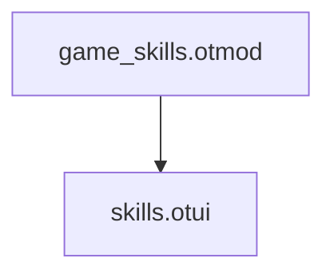
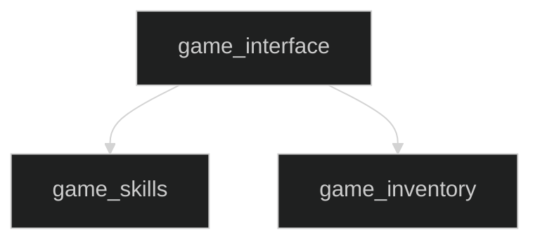
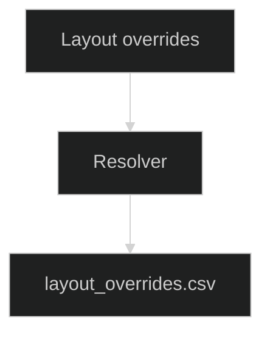

# Diagrams — Instructions (Mermaid, Facets, IPC)

## Cel
Standaryzacja tworzenia i walidacji diagramów **Mermaid** w rozdziałach; kotwice **facet-<chapter>.<stem>**, klikalne odsyłacze i raporty lint.

## Zakres
- Rozdziały: `11_data`, `12_otmod`, `13_layouts`, `14_android`, `15_vc16` (i inne).
- Pliki: `docs/authoring/<chapter>/diagrams/*.mmd`.
- Kotwice facet: muszą istnieć w `index.md` danego rozdziału.

---

## Wejścia
- `diagrams/*.mmd` — źródła Mermaid.
- Datasety CSV (opcjonalnie), np.:
  - `datasets/layout_overrides.csv` → `13_layouts`
  - `datasets/module_ui_links.csv` → `12_otmod`
  - `datasets/ui_asset_usage.csv` → `11_data`
- `index.md` — zawiera kotwice MyST dla każdego **facetu**.

## Wyjścia
- Źródła: `diagrams/*.mmd` (źródło prawdy).
- Raport lint: `docs/authoring/_data/diagram_lint.csv`
  nagłówki: `chapter,file,check,status,details`
- (Opcj.) rendery podglądowe: `diagrams/out/<stem>.svg|png`.

---

## Zasady Mermaid (lint)
1. **Init w 1. linii** bloku:
   ```
   %%{init: {'theme':'dark','securityLevel':'loose'}}%%
   ```
2. **Deterministyczność**: stabilne ID/nazwy węzłów.
3. **Klikalne linki** (gdy istnieje facet o tym samym `stem`):
   ```
   click <NodeId> "./index.html#facet-<chapter>.<stem>" "Open <stem>"
   ```
4. **Rozmiar**: ≤ 500 linii; duże grafy dziel.
5. **Relacje cross-chapter**: etykiety `uses|renders|overrides|calls`.
6. **Sekwencje**: w `sequenceDiagram` **nie** używamy `click`.

**Nagłówek + przykład (bezpieczne etykiety):**



> Uwaga: jeśli w etykiecie potrzebny jest znak `|`, użyj cudzysłowu jak wyżej (albo `\|` / `&#124;`).

---

## Facety (kotwice MyST)
W `index.md` dodaj dla każdego diagramu:

```
(facet-<chapter>.<stem>)=
### Facet: `<chapter>.<stem>`
```

Przykład:
`(facet-13_layouts.resolve_flow)=` + nagłówek „Facet: `13_layouts.resolve_flow`”.

---

## IPC (Studio)
- `studio:diagram.lint` → linter Mermaid + sprawdzanie kotwic.
  **Output:** `_data/diagram_lint.csv`
- `studio:diagram.render {chapter, stem}` → (opcj.) render SVG/PNG
- `studio:diagram.embed {chapter, stem}` → weryfikuje osadzenia `{mermaid}`/linki
- `studio:open.diagram {chapter, stem}` → otwiera `diagrams/<stem>.mmd`

---

## Sanity checklist
- [ ] Linia 1: `%%{init: ...}%%`
- [ ] Kotwica MyST `(facet-...)=` istnieje w `index.md`
- [ ] Jeśli jest dataset o tym `stem` → `click` do facetu
- [ ] Diagram renderuje się bez błędów (lokalnie/CI)
- [ ] Nazwy węzłów spójne z nazwami plików/datasetów

---

## Przykłady

**11_data / `asset_linking.mmd`**

```mermaid
%%{init: {'theme':'dark','securityLevel':'loose'}}%%
graph TD
  OTUI[OTUI property] -->|image-source / icon / font| ASSET["data/** &#124; layouts/**"]
  ASSET --> INDEX["images.csv / fonts.csv"]
  INDEX --> UIUSE["ui_asset_usage.csv"]
  click UIUSE "./index.html#facet-11_data.ui_asset_usage" "Open ui_asset_usage"
```



**12_otmod / `deps.mmd`**



**13_layouts / `resolve_flow.mmd`**



---

## DoD
- [ ] `diagram_lint.csv` bez `FAIL`
- [ ] Każdy diagram ma facet i renderuje się
- [ ] Linki `click` prowadzą do właściwych kotwic
- [ ] Init/tema/securLevel zgodne w całym repo
