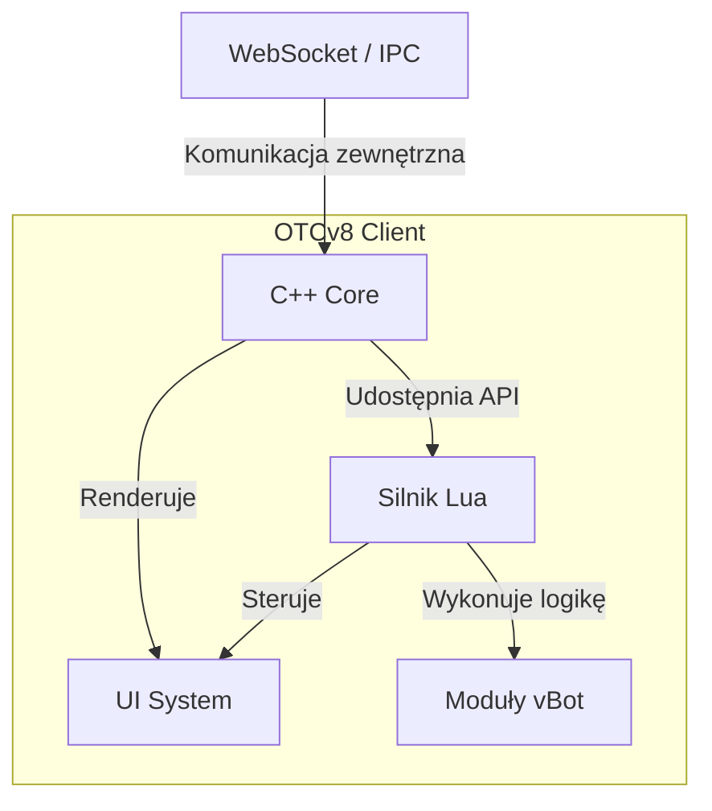

# Architektura (w skrócie)

Poniższy diagram przedstawia kluczowe komponenty i przepływ danych w architekturze OTCv8.

### Opis Warstw

=== "Warstwy"

- **C++ Core** – Niskopoziomowy silnik odpowiedzialny za renderowanie, obsługę sieci, dźwięku i operacje na plikach.
- **Lua** – Warstwa skryptowa, w której działa cała logika gry, moduły i interfejs (np. vBot).
- **OTUI** – Deklaratywny system oparty na składni `yaml`, używany do szybkiego budowania i stylowania interfejsu użytkownika.

=== "Kontrakty"

- **Eventy Lua → UI, IPC/WS, Zasoby** – Logika pisana w Lua reaguje na zdarzenia i komunikuje się z resztą aplikacji, sterując interfejsem, obsługując komunikację i zarządzając zasobami.
