# otclientv8-dev/src/client

> NOTE: Wszystkie pliki w repozytorium są objęte licencją MIT (2010–2017 OTClient, autor Edubart).

## Ogólny opis
Implementacja klasy `AnimatedText`, która odpowiada za renderowanie animowanego tekstu na mapie, takiego jak komunikaty o zadanych obrażeniach, leczeniu czy zdobytych punktach doświadczenia. Plik zawiera logikę animacji, rysowania oraz łączenia podobnych tekstów w jeden.

## Klasa `AnimatedText`
### Opis
Klasa `AnimatedText` dziedziczy po `Thing` i reprezentuje tekst, który pojawia się w określonym miejscu na mapie, a następnie animuje swoje położenie i przezroczystość, by ostatecznie zniknąć.

### Metody
| Nazwa | Opis |
| --- | --- |
| `AnimatedText()` | Konstruktor. Inicjalizuje domyślne właściwości tekstu, takie jak czcionka i wyrównanie. |
| `drawText(const Point& dest, const Rect& visibleRect)` | Rysuje tekst w określonym miejscu, uwzględniając postęp animacji. Animacja obejmuje ruch w górę (i opcjonalnie po przekątnej) oraz stopniowe zanikanie. |
| `onAppear()` | Metoda wywoływana, gdy tekst pojawia się na mapie. Resetuje timer animacji i planuje usunięcie obiektu po zakończeniu animacji. |
| `setColor(int color)` | Ustawia kolor tekstu na podstawie 8-bitowej wartości. |
| `setText(const std::string& text)` | Ustawia treść tekstu. |
| `setFont(const std::string& fontName)` | Ustawia czcionkę tekstu na podstawie nazwy. |
| `merge(const AnimatedTextPtr& other)` | Próbuje połączyć tekst z innym obiektem `AnimatedText`. Łączenie jest możliwe, jeśli oba teksty mają ten sam kolor, czcionkę, a animacja obecnego tekstu nie jest zbyt zaawansowana. Teksty liczbowe są sumowane. |

### Zależności i powiązania
- **`map.h`**: Używa `g_map` do usuwania obiektu `AnimatedText` po zakończeniu animacji.
- **`game.h`**: Używa `g_game` do sprawdzania, czy funkcja `GameDiagonalAnimatedText` jest włączona.
- **`framework/core/clock.h`**: Używa `g_clock` do pomiaru czasu animacji.
- **`framework/core/eventdispatcher.h`**: Używa `g_dispatcher` do planowania usunięcia obiektu.
- **`framework/graphics/graphics.h`**: Używa `g_fonts` do zarządzania czcionkami.

### Przykład użycia
Obiekty `AnimatedText` są tworzone przez `ProtocolGame` w odpowiedzi na komunikaty serwera (np. o obrażeniach) i dodawane do `g_map`, która zarządza ich cyklem życia i rysowaniem.

```cpp
// Przykład tworzenia (logika w ProtocolGame::parseAnimatedText)
AnimatedTextPtr animatedText = AnimatedTextPtr(new AnimatedText);
animatedText->setColor(color);
animatedText->setText(text);
g_map.addThing(animatedText, position);
```
---
# 📄 houses.h
## Ogólny opis
Plik ten definiuje klasy `House` i `HouseManager`, które służą do zarządzania informacjami o domach w grze. Zawiera definicje struktur przechowujących atrybuty domów, takie jak nazwa, ID, wejście, oraz metody do zarządzania nimi.

## Klasa `House`
### Opis
Reprezentuje pojedynczy dom w świecie gry. Przechowuje jego atrybuty, listę przynależnych do niego pól (tiles) oraz drzwi.

### Metody
| Nazwa | Opis |
| --- | --- |
| `House(uint32 hId, ...)` | Konstruktor tworzący dom o zadanym ID, nazwie i pozycji wejściowej. |
| `setTile(const TilePtr& tile)` | Dodaje pole (tile) do domu. |
| `getTile(const Position& pos)` | Zwraca wskaźnik do pola na podanej pozycji, jeśli należy ono do domu. |
| `setName(const std::string& name)` | Ustawia nazwę domu. |
| `getName()` | Zwraca nazwę domu. |
| `setId(uint32 hId)` | Ustawia unikalne ID domu. |
| `getId()` | Zwraca ID domu. |
| `setTownId(uint32 tid)` | Ustawia ID miasta, w którym znajduje się dom. |
| `getTownId()` | Zwraca ID miasta. |
| `setSize(uint32 s)` | Ustawia rozmiar domu. |
| `getSize()` | Zwraca rozmiar domu. |
| `setRent(uint32 r)` | Ustawia cenę wynajmu domu. |
| `getRent()` | Zwraca cenę wynajmu. |
| `setEntry(const Position& p)` | Ustawia pozycję wejścia do domu. |
| `getEntry()` | Zwraca pozycję wejścia. |
| `addDoor(const ItemPtr& door)` | Dodaje drzwi do domu i przypisuje im unikalne ID. |
| `removeDoor(const ItemPtr& door)` | Usuwa drzwi z domu. |
| `removeDoorById(uint32 doorId)` | Usuwa drzwi na podstawie ich ID. |

## Klasa `HouseManager`
### Opis
Singleton (`g_houses`) zarządzający wszystkimi domami w grze. Odpowiada za ich dodawanie, usuwanie, wczytywanie i zapisywanie z plików XML.

### Metody
| Nazwa | Opis |
| --- | --- |
| `addHouse(const HousePtr& house)` | Dodaje nowy dom do listy. |
| `removeHouse(uint32 houseId)` | Usuwa dom o podanym ID. |
| `getHouse(uint32 houseId)` | Zwraca dom o podanym ID. |
| `getHouseByName(std::string name)` | Zwraca dom o podanej nazwie. |
| `load(const std::string& fileName)` | Wczytuje dane o domach z pliku XML. |
| `save(const std::string& fileName)` | Zapisuje dane o domach do pliku XML. |
| `sort()` | Sortuje listę domów alfabetycznie według nazwy. |
| `clear()` | Czyści listę domów. |
| `getHouseList()` | Zwraca listę wszystkich domów. |
| `filterHouses(uint32 townId)` | Zwraca listę domów należących do określonego miasta. |

### Zmienne globalne
- `HouseManager g_houses`: Globalna instancja managera domów.

### Zależności i powiązania
- **`declarations.h`**: Definicje typów wskaźników, takich jak `HousePtr` i `TilePtr`.
- **`tile.h`**: Używa obiektów `Tile` do określenia obszaru domu.
- **`item.h`**: Zarządza drzwiami, które są obiektami typu `Item`.
- **`framework/luaengine/luaobject.h`**: Klasy są eksponowane do Lua.

---
# 📄 animatedtext.h
## Ogólny opis
Plik nagłówkowy dla klasy `AnimatedText`. Definiuje interfejs klasy, która zarządza animowanym tekstem na mapie.

## Klasa `AnimatedText`
### Opis
Dziedziczy po `Thing`. Służy do wyświetlania tekstu, który porusza się i zanika. Jest to obiekt "efemeryczny", który istnieje na mapie tylko przez czas trwania animacji.

### Metody
| Nazwa | Opis |
| --- | --- |
| `AnimatedText()` | Konstruktor. |
| `drawText(const Point& dest, const Rect& visibleRect)` | Rysuje tekst na ekranie z uwzględnieniem animacji. |
| `setColor(int color)` | Ustawia kolor tekstu. |
| `setText(const std::string& text)` | Ustawia treść tekstu. |
| `setOffset(const Point& offset)` | Ustawia przesunięcie (offset) rysowania tekstu, używane do unikania nakładania się tekstów. |
| `setFont(const std::string& fontName)` | Ustawia czcionkę tekstu. |
| `getColor()` | Zwraca kolor tekstu. |
| `getCachedText()` | Zwraca obiekt `CachedText` przechowujący tekst i informacje o renderowaniu. |
| `getOffset()` | Zwraca aktualne przesunięcie tekstu. |
| `getTimer()` | Zwraca timer używany do animacji. |
| `merge(const AnimatedTextPtr& other)` | Funkcja do łączenia z innym `AnimatedText`. |
| `asAnimatedText()` | Rzutuje wskaźnik na `AnimatedTextPtr`. |
| `isAnimatedText()` | Zwraca `true`. |
| `getText()` | Zwraca treść tekstu. |

### Zależności i powiązania
- **`thing.h`**: Klasa bazowa.
- **`framework/graphics/fontmanager.h`**: Zarządzanie czcionkami.
- **`framework/core/timer.h`**: Pomiar czasu animacji.
- **`framework/graphics/cachedtext.h`**: Efektywne renderowanie tekstu.

---
# 📄 animator.h
## Ogólny opis
Plik nagłówkowy dla klasy `Animator`, która zarządza animacjami klatek dla obiektów w grze, takich jak przedmioty czy efekty.

## Klasa `Animator`
### Opis
Klasa `Animator` kontroluje, która klatka animacji powinna być wyświetlona w danym momencie. Obsługuje różne tryby animacji, takie jak pętle, ping-pong, animacje asynchroniczne i losowe.

### Typy wyliczeniowe
- **`AnimationPhase`**: Określa fazę animacji (np. automatyczna, losowa, asynchroniczna).
- **`AnimationDirection`**: Określa kierunek animacji (do przodu, do tyłu).

### Metody
| Nazwa | Opis |
| --- | --- |
| `Animator()` | Konstruktor. |
| `unserialize(int animationPhases, const FileStreamPtr& fin)` | Wczytuje dane animatora ze strumienia. |
| `serialize(const FileStreamPtr& fin)` | Zapisuje dane animatora do strumienia. |
| `setPhase(int phase)` | Ustawia bieżącą fazę animacji. |
| `getPhase()` | Oblicza i zwraca bieżącą fazę animacji na podstawie czasu. |
| `getPhaseAt(Timer& timer, int lastPhase)` | Oblicza fazę animacji w danym momencie czasu (używane przez `Effect` dla niezależnych animacji). |
| `getStartPhase()` | Zwraca początkową fazę animacji. |
| `getAnimationPhases()` | Zwraca całkowitą liczbę faz animacji. |
| `isAsync()` | Zwraca `true`, jeśli animacja jest asynchroniczna. |
| `isComplete()` | Zwraca `true`, jeśli animacja została zakończona. |
| `getTotalDuration()` | Zwraca całkowity czas trwania animacji. |
| `resetAnimation()` | Resetuje stan animacji do początkowego. |

### Zależności i powiązania
- **`declarations.h`**: Definicje typów.
- **`framework/core/timer.h`**: Używane do pomiaru czasu i synchronizacji animacji.

---
# 📄 animator.cpp
## Ogólny opis
Implementacja klasy `Animator`. Zawiera logikę obliczania faz animacji w zależności od czasu i trybu pracy.

## Klasa `Animator`
### Opis
Plik implementuje logikę działania animatora. Obliczenia fazy zależą od tego, czy animacja jest synchroniczna (wszystkie obiekty tego samego typu animują się tak samo) czy asynchroniczna (każdy obiekt animuje się niezależnie).

### Metody
| Nazwa | Opis |
| --- | --- |
| `unserialize(...)` | Wczytuje z pliku binarnego liczbę faz, tryb `async`, liczbę pętli, fazę startową oraz czas trwania każdej klatki (min/max). |
| `serialize(...)` | Zapisuje dane animatora do pliku binarnego. |
| `setPhase(int phase)` | Ustawia aktualną fazę animacji. Dla animacji asynchronicznych resetuje timer i ustawia czas trwania klatki. Dla synchronicznych przelicza fazę na podstawie globalnego zegara. |
| `getPhase()` | Główna metoda aktualizująca. Na podstawie czasu, jaki upłynął od ostatniego wywołania, decyduje, czy należy przejść do następnej klatki animacji. |
| `getPhaseAt(...)` | Metoda używana przez efekty (`Effect`) do uzyskania fazy animacji niezależnie od innych obiektów tego samego typu. Używa własnego timera i pseudolosowego generatora do określenia czasu trwania klatek. |
| `getStartPhase()` | Zwraca fazę startową; jeśli ustawiono na losową, losuje ją z dostępnego zakresu. |
| `resetAnimation()` | Przywraca animator do stanu początkowego. |
| `getPingPongPhase()` | Oblicza następną fazę dla animacji typu "ping-pong" (do przodu i do tyłu). |
| `getLoopPhase()` | Oblicza następną fazę dla animacji w pętli. |
| `getPhaseDuration(int phase)` | Zwraca czas trwania danej klatki animacji (losowy w zakresie min-max). |
| `calculateSynchronous()` | Oblicza bieżącą fazę dla animacji synchronicznej, bazując na globalnym czasie i sumarycznym czasie trwania wszystkich klatek. |
| `getTotalDuration()` | Zwraca sumaryczny czas trwania wszystkich klatek animacji. |

### Zależności i powiązania
- **`framework/core/clock.h`**: Używa `g_clock` do synchronizacji animacji.
- **`framework/core/filestream.h`**: Do operacji serializacji/deserializacji.

---
# 📄 client.cpp
## Ogólny opis
Plik implementuje klasę `Client`, która jest głównym punktem wejścia i zarządzania dla aplikacji klienckiej. Odpowiada za inicjalizację i zamykanie kluczowych modułów gry.

## Klasa `Client`
### Metody
| Nazwa | Opis |
| --- | --- |
| `init(std::vector<std::string>& args)` | Inicjalizuje wszystkie główne moduły klienta w odpowiedniej kolejności: rejestruje funkcje Lua, a następnie inicjalizuje `g_map`, `g_minimap`, `g_game`, `g_shaders`, `g_things`, `g_healthBars`. |
| `terminate()` | Zamyka wszystkie moduły w odwrotnej kolejności do inicjalizacji, zwalniając zasoby. |

### Zmienne globalne
- `Client g_client`: Globalna instancja klasy `Client`.

### Zależności i powiązania
- **`game.h`**: Inicjalizuje i zamyka `g_game`.
- **`map.h`**: Inicjalizuje i zamyka `g_map`.
- **`minimap.h`**: Inicjalizuje i zamyka `g_minimap`.
- **`spritemanager.h`**: Pośrednio zarządza `g_sprites` poprzez `g_things`.
- **`healthbars.h`**: Inicjalizuje i zamyka `g_healthBars`.
- **`framework/core/modulemanager.h`**: Używane do zarządzania modułami.
- **`framework/graphics/shadermanager.h`**: Inicjalizuje i zamyka `g_shaders`.

---
# 📄 client.h
## Ogólny opis
Plik nagłówkowy dla klasy `Client`. Deklaruje interfejs głównej klasy aplikacji klienckiej.

## Klasa `Client`
### Opis
Klasa `Client` jest odpowiedzialna za zarządzanie cyklem życia aplikacji klienckiej.

### Metody
| Nazwa | Opis |
| --- | --- |
| `init(std::vector<std::string>& args)` | Inicjalizuje aplikację. |
| `terminate()` | Kończy działanie aplikacji, zwalniając zasoby. |
| `registerLuaFunctions()` | Rejestruje funkcje C++ dostępne w środowisku Lua. |

### Zmienne globalne
- `Client g_client`: Deklaracja zewnętrznej globalnej instancji klienta.

### Zależności i powiązania
- **`global.h`**: Zawiera podstawowe definicje i stałe używane w kliencie.

---
# 📄 CMakeLists.txt
## Ogólny opis
Plik konfiguracyjny systemu budowania CMake dla modułu klienta. Definiuje on, które pliki źródłowe (`.cpp`, `.h`) zostaną skompilowane i włączone do finalnej aplikacji klienckiej.

## Struktura pliku
### Definicje preprocesora
- `add_definitions(-DCLIENT)`: Dodaje makro `CLIENT` do wszystkich kompilowanych plików, co pozwala na warunkową kompilację kodu specyficznego dla klienta.

### Lista plików źródłowych (`client_SOURCES`)
Plik zawiera jedną długą listę wszystkich plików źródłowych i nagłówkowych, które składają się na moduł klienta. Pliki są pogrupowane w logiczne kategorie za pomocą komentarzy:
- **`# client`**: Główne pliki klienta.
- **`# core`**: Rdzeń logiki gry (mapa, przedmioty, postacie, etc.).
- **`# lua`**: Pliki związane z integracją z silnikiem Lua.
- **`# net`**: Logika sieciowa i protokoły.
- **`# ui`**: Niestandardowe widżety interfejsu użytkownika.
- **`# util`**: Pomocnicze klasy i struktury, jak `Position`.

### Zależności i powiązania
Ten plik jest kluczowy dla procesu budowania i definiuje, które części kodu źródłowego są ze sobą powiązane i tworzą aplikację kliencką. Każdy plik dodany do tej listy staje się częścią projektu.

---
# 📄 const.h
## Ogólny opis
Plik nagłówkowy zawierający globalne stałe i typy wyliczeniowe używane w całej aplikacji klienckiej. Definiuje kluczowe wartości, takie jak flagi rysowania, atrybuty przedmiotów, tryby gry, a także identyfikatory funkcji serwera (`GameFeature`).

## Namespace `Otc`
### Typy wyliczeniowe
- **`enum` (anonimowy)**: Zawiera ogólne stałe, takie jak `MAX_ELEVATION`, `SEA_FLOOR`, `MAX_Z`, czasy trwania animacji (`ANIMATED_TEXT_DURATION`) i inne.
- **`DepthConst`**: Stałe związane z głębokością renderowania.
- **`DrawFlags`**: Flagi określające, które elementy sceny mają być rysowane (np. podłoże, postacie, efekty).
- **`DatOpts`**: Atrybuty przedmiotów wczytywane z plików `.dat`.
- **`InventorySlot`**: Identyfikatory slotów ekwipunku.
- **`Statistic`**: Identyfikatory statystyk gracza (życie, mana, doświadczenie).
- **`Skill`**: Identyfikatory umiejętności gracza.
- **`Direction`**: Kierunki (północ, południe, etc.).
- **`FluidsColor`**, **`FluidsType`**: Kolory i typy płynów.
- **`FightModes`**, **`ChaseModes`**, **`PVPModes`**: Tryby walki, ścigania i PvP.
- **`PlayerSkulls`**: Typy czaszek nad głową gracza.
- **`PlayerShields`**: Typy tarcz imprezowych (party shields).
- **`PlayerEmblems`**: Emblematy gildii.
- **`CreatureIcons`**: Ikony nad postaciami NPC.
- **`PlayerStates`**: Stany gracza (zatrucie, podpalenie, etc.).
- **`MessageMode`**: Tryby wiadomości w grze (say, whisper, yell, etc.).
- **`GameFeature`**: Flagi określające, które funkcje są obsługiwane przez serwer. Jest to kluczowy enum dla zapewnienia kompatybilności z różnymi wersjami serwerów.
- **`PathFindResult`**: Wyniki algorytmu wyszukiwania ścieżki.
- **`PathFindFlags`**: Flagi modyfikujące działanie algorytmu wyszukiwania ścieżki.
- **`AutomapFlags`**: Ikony znaczników na minimapie.
- **`VipState`**: Stany graczy na liście VIP.
- **`SpeedFormula`**: Różne formuły obliczania prędkości postaci.
- **`Blessings`**: Błogosławieństwa.
- **`DeathType`**: Typ śmierci (zwykła, z błogosławieństwem).
- **`StoreProductTypes`**, **`StoreErrorTypes`**, **`StoreStates`**: Typy związane ze sklepem w grze (Store).
- **`Prey...`**: Enumeracje związane z systemem Prey.
- **`MagicEffectsType_t`**: Typy operacji w zaawansowanych efektach magicznych.

### Zależności i powiązania
Ten plik jest fundamentalny i jest dołączany w większości plików projektu, ponieważ definiuje podstawowe "słownictwo" używane w logice gry.

---
# 📄 container.cpp
## Ogólny opis
Implementacja klasy `Container`, która reprezentuje pojemniki w grze, takie jak plecaki. Plik zawiera logikę zarządzania przedmiotami wewnątrz kontenera oraz obsługę zdarzeń z nim związanych.

## Klasa `Container`
### Metody
| Nazwa | Opis |
| --- | --- |
| `Container(...)` | Konstruktor. Inicjalizuje kontener na podstawie danych otrzymanych z serwera. |
| `getItem(int slot)` | Zwraca przedmiot znajdujący się w danym slocie. |
| `onOpen(const ContainerPtr& previousContainer)` | Wywołuje callback Lua `onOpen`, gdy kontener jest otwierany. |
| `onClose()` | Oznacza kontener jako zamknięty i wywołuje callback Lua `onClose`. |
| `onAddItem(const ItemPtr& item, int slot)` | Dodaje przedmiot do kontenera. Jeśli kontener ma strony (`hasPages`), a slot jest poza widocznym zakresem, jedynie aktualizuje rozmiar. W przeciwnym razie dodaje przedmiot do listy i wywołuje callbacki Lua `onSizeChange` i `onAddItem`. |
| `findItemById(uint itemId, int subType)` | Wyszukuje przedmiot w kontenerze po jego ID i opcjonalnie podtypie. |
| `onAddItems(const std::vector<ItemPtr>& items)` | Dodaje wiele przedmiotów naraz (np. przy otwarciu kontenera). |
| `onUpdateItem(int slot, const ItemPtr& item)` | Aktualizuje przedmiot w danym slocie, zastępując stary nowym. |
| `onRemoveItem(int slot, const ItemPtr& lastItem)` | Usuwa przedmiot z danego slota. Jeśli `lastItem` jest podany (dla kontenerów ze stronami), jest on dodawany na końcu widocznej części kontenera. |
| `updateItemsPositions()` | Aktualizuje pozycje wszystkich przedmiotów w kontenerze, aby odzwierciedlały ich sloty. |

### Zależności i powiązania
- **`item.h`**: Zarządza obiektami typu `Item`.
- **`framework/luaengine/luaobject.h`**: Dziedziczy po `LuaObject`, aby umożliwić interakcję z Lua.

---
# 📄 creature.cpp
## Ogólny opis
Implementacja klasy `Creature`, która jest podstawową klasą dla wszystkich żywych istot w grze (graczy, potworów, NPC). Plik ten zawiera złożoną logikę rysowania, animacji, poruszania się, skakania oraz wyświetlania informacji o postaci.

## Klasa `Creature`
### Metody
| Nazwa | Opis |
| --- | --- |
| `draw(...)` | Główna funkcja rysująca. Renderuje postać, jej ubiór, kwadraty oznaczające (np. cel ataku), a także dodaje światło do `LightView`. |
| `drawOutfit(...)` | Rysuje sam ubiór postaci w zadanym prostokącie, używane głównie w interfejsie użytkownika. |
| `drawInformation(...)` | Rysuje pasek życia, many, nazwę, ikony (czaszka, tarcza) nad postacią. |
| `turn(Otc::Direction direction)` | Zmienia kierunek, w którym zwrócona jest postać. |
| `walk(const Position& oldPos, const Position& newPos)` | Inicjuje proces chodzenia z `oldPos` do `newPos`, ustawiając kierunek, timery i rozpoczynając aktualizację animacji. |
| `stopWalk()` | Natychmiastowo przerywa proces chodzenia. |
| `jump(int height, int duration)` | Rozpoczyna animację skoku postaci. |
| `updateJump()` | Aktualizuje wysokość skoku w każdej klatce animacji. |
| `onAppear()` | Obsługuje pojawienie się postaci na ekranie. Decyduje, czy postać przyszła, teleportowała się, czy tylko się obróciła. |
| `onDisappear()` | Obsługuje zniknięcie postaci z ekranu, planując jej ostateczne usunięcie. |
| `onDeath()` | Wywołuje callback Lua `onDeath`. |
| `updateWalkAnimation(...)` | Aktualizuje fazę animacji chodzenia na podstawie czasu i przebytych pikseli. |
| `updateWalkOffset(...)` | Oblicza przesunięcie postaci podczas chodzenia. |
| `updateWalkingTile()` | Aktualizuje, na którym polu (`Tile`) postać jest obecnie rysowana podczas animacji chodzenia. |
| `nextWalkUpdate()` | Planuje następną aktualizację stanu chodzenia. |
| `updateWalk()` | Główna funkcja aktualizująca stan chodzenia, wywoływana cyklicznie. |
| `terminateWalk()` | Kończy proces chodzenia, resetując wszystkie związane z nim zmienne. |
| `setHealthPercent(uint8 healthPercent)` | Ustawia procent życia i aktualizuje kolor paska życia. |
| `setOutfit(const Outfit& outfit)` | Zmienia ubiór postaci. |
| `setSpeed(uint16 speed)` | Ustawia prędkość poruszania się postaci. |
| `getStepDuration(...)` | Oblicza czas trwania jednego kroku w milisekundach na podstawie prędkości postaci, prędkości podłoża i formuł prędkości serwera. |
| `getDisplacement()` | Zwraca przesunięcie rysowania postaci, które centruje ją na polu. |
| `addTopWidget(...)` / `addBottomWidget(...)` | Dodaje widżety, które będą rysowane nad lub pod postacią. |

### Zmienne statyczne
- `m_speedFormula`: Tablica przechowująca współczynniki do zaawansowanego obliczania prędkości.

### Zależności i powiązania
- **`localplayer.h`**: Logika rysowania informacji o pasku many jest specyficzna dla lokalnego gracza.
- **`map.h`**, **`tile.h`**: Interakcje ze światem gry (pobieranie pól, prędkości podłoża).
- **`game.h`**: Dostęp do globalnych ustawień gry i funkcji serwera.
- **`lightview.h`**: Dodawanie dynamicznego światła emitowanego przez postać.
- **`healthbars.h`**: Używa `g_healthBars` do pobierania niestandardowych teł dla pasków życia/many.
- **`spritemanager.h`**: Używa `g_sprites` do pobierania rozmiaru sprite'ów.

---
# 📄 container.h
## Ogólny opis
Plik nagłówkowy dla klasy `Container`. Definiuje interfejs do zarządzania pojemnikami w grze.

## Klasa `Container`
### Opis
Klasa `Container` dziedziczy po `LuaObject`, co pozwala na jej użycie w skryptach Lua. Reprezentuje obiekt w grze, który może przechowywać inne przedmioty, jak plecak czy skrzynka.

### Metody
| Nazwa | Opis |
| --- | --- |
| `getItem(int slot)` | Zwraca wskaźnik do przedmiotu w danym slocie. |
| `getItems()` | Zwraca kolekcję (`std::deque`) wszystkich przedmiotów w kontenerze. |
| `getItemsCount()` | Zwraca liczbę przedmiotów w kontenerze. |
| `getSlotPosition(int slot)` | Zwraca specjalnie zakodowaną pozycję, która identyfikuje slot w tym kontenerze. |
| `getId()` | Zwraca ID kontenera. |
| `getCapacity()` | Zwraca pojemność kontenera. |
| `getContainerItem()` | Zwraca przedmiot, który reprezentuje ten kontener. |
| `getName()` | Zwraca nazwę kontenera. |
| `hasParent()` | Zwraca `true`, jeśli kontener znajduje się w innym kontenerze. |
| `isClosed()` | Zwraca `true`, jeśli kontener został zamknięty. |
| `isUnlocked()` | Zwraca `true`, jeśli można przesuwać w nim przedmioty. |
| `hasPages()` | Zwraca `true`, jeśli kontener obsługuje paginację. |
| `getSize()` | Zwraca całkowitą liczbę przedmiotów w kontenerze (może być większa niż pojemność, jeśli ma strony). |
| `getFirstIndex()` | Zwraca indeks pierwszego przedmiotu na bieżącej stronie. |
| `findItemById(uint itemId, int subType)` | Wyszukuje przedmiot po ID i opcjonalnym podtypie. |

### Zależności i powiązania
- **`declarations.h`**: Definicje typów, np. `ItemPtr`.
- **`item.h`**: Przechowuje obiekty `Item`.
- **`game.h`**: Klasa `Game` jest przyjacielem, co pozwala jej wywoływać chronione metody `onOpen`, `onClose`, etc.

---
# 📄 creature.h
## Ogólny opis
Plik nagłówkowy dla klasy `Creature` oraz jej specjalizacji: `Npc` i `Monster`. Definiuje interfejs dla wszystkich istot w grze.

## Klasa `Creature`
### Opis
Klasa bazowa dla wszystkich postaci w grze. Dziedziczy po `Thing`. Zawiera logikę związaną z wyglądem, ruchem, stanami i interakcjami.

### Typy wyliczeniowe
- **`enum` (anonimowy)**: Definiuje stałe `SHIELD_BLINK_TICKS` i `VOLATILE_SQUARE_DURATION`.

### Metody
| Nazwa | Opis |
| --- | --- |
| `draw(...)` | Rysuje postać w danym miejscu na mapie. |
| `drawOutfit(...)` | Rysuje sam ubiór postaci, używane w UI. |
| `drawInformation(...)` | Rysuje informacje nad postacią (nazwa, paski życia/many, ikony). |
| `setId(uint32 id)` | Ustawia ID postaci. |
| `setName(const std::string& name)` | Ustawia nazwę postaci. |
| `setHealthPercent(uint8 healthPercent)` | Ustawia procent życia. |
| `setDirection(Otc::Direction direction)` | Ustawia kierunek, w którym postać jest zwrócona. |
| `setOutfit(const Outfit& outfit)` | Ustawia ubiór postaci. |
| `setSpeed(uint16 speed)` | Ustawia prędkość poruszania się. |
| `addTimedSquare(uint8 color)` | Wyświetla tymczasowy kolorowy kwadrat pod postacią. |
| `getStepDuration(...)` | Zwraca czas trwania jednego kroku. |
| `walk(const Position& oldPos, const Position& newPos)` | Inicjuje ruch postaci. |
| `stopWalk()` | Przerywa ruch postaci. |
| `isWalking()` | Zwraca `true`, jeśli postać jest w trakcie chodu. |
| `isDead()` | Zwraca `true`, jeśli postać ma 0% życia. |
| `getThingType()` | Zwraca `ThingType` dla aktualnego ubioru postaci. |
| `addTopWidget(...)`, `addBottomWidget(...)` | Dodaje widżety do rysowania nad/pod postacią. |

## Klasa `Npc`
### Opis
Specjalizacja `Creature` dla postaci niezależnych (NPC).

## Klasa `Monster`
### Opis
Specjalizacja `Creature` dla potworów.

### Zależności i powiązania
- **`thing.h`**: Klasa bazowa.
- **`outfit.h`**: Używa `Outfit` do zarządzania wyglądem.
- **`tile.h`**: Interakcje z polami mapy.
- **`mapview.h`**: Używana do rysowania w kontekście widoku mapy.
- **`framework/ui/uiwidget.h`**: Dołączanie widżetów do postaci.

---
# 📄 creatures.h
## Ogólny opis
Plik nagłówkowy definiujący klasy do zarządzania typami stworzeń (`CreatureType`) oraz ich miejscami odradzania (`Spawn`). Jest to część systemu, który prawdopodobnie służy do edycji map lub działania jako serwer, a nie tylko do gry.

## Typy wyliczeniowe
- **`CreatureAttr`**: Atrybuty typu stworzenia (pozycja, nazwa, ubiór, etc.).
- **`CreatureRace`**: Rasa stworzenia (NPC, potwór).
- **`SpawnAttr`**: Atrybuty spawnu (promień, środek).

## Klasa `Spawn`
### Opis
Reprezentuje obszar odradzania się stworzeń (spawn). Przechowuje informacje o środku, promieniu oraz listę potworów/NPC, które się w nim pojawiają.

### Metody
| Nazwa | Opis |
| --- | --- |
| `setRadius(int32 r)` | Ustawia promień spawnu. |
| `getRadius()` | Zwraca promień spawnu. |
| `setCenterPos(const Position& pos)` | Ustawia centralną pozycję spawnu. |
| `getCenterPos()` | Zwraca centralną pozycję spawnu. |
| `getCreatures()` | Zwraca listę typów stworzeń w tym spawnie. |
| `addCreature(const Position& placePos, const CreatureTypePtr& cType)` | Dodaje stworzenie do spawnu w określonym miejscu. |
| `removeCreature(const Position& pos)` | Usuwa stworzenie z danej pozycji. |
| `clear()` | Czyści listę stworzeń. |

## Klasa `CreatureType`
### Opis
Reprezentuje szablon (typ) stworzenia. Przechowuje domyślne właściwości, takie jak nazwa, ubiór czy kierunek, które są używane do tworzenia instancji `Creature`.

### Metody
| Nazwa | Opis |
| --- | --- |
| `setSpawnTime(int32 spawnTime)` | Ustawia czas odradzania. |
| `getSpawnTime()` | Zwraca czas odradzania. |
| `setName(const std::string& name)` | Ustawia nazwę typu. |
| `getName()` | Zwraca nazwę. |
| `setOutfit(const Outfit& o)` | Ustawia domyślny ubiór. |
| `getOutfit()` | Zwraca domyślny ubiór. |
| `cast()` | Tworzy i zwraca instancję `Creature` na podstawie tego typu. |

## Klasa `CreatureManager`
### Opis
Singleton (`g_creatures`) zarządzający wszystkimi typami stworzeń i spawnami. Wczytuje te dane z plików XML.

### Metody
| Nazwa | Opis |
| --- | --- |
| `loadMonsters(const std::string& file)` | Wczytuje dane o potworach z pliku. |
| `loadNpcs(const std::string& folder)` | Wczytuje dane o NPC z folderu. |
| `loadSpawns(const std::string& fileName)` | Wczytuje dane o spawnach. |
| `saveSpawns(const std::string& fileName)` | Zapisuje dane o spawnach. |
| `getCreatureByName(std::string name)` | Zwraca typ stworzenia po nazwie. |
| `getSpawn(const Position& centerPos)` | Zwraca spawn na podstawie jego centralnej pozycji. |
| `addSpawn(...)` | Dodaje nowy spawn. |

### Zmienne globalne
- `CreatureManager g_creatures`: Globalna instancja managera stworzeń.

### Zależności i powiązania
- **`declarations.h`**, **`outfit.h`**: Definicje typów.
- **`creature.h`**: `CreatureType::cast()` tworzy obiekty `Creature`.

---
# 📄 declarations.h
## Ogólny opis
Plik nagłówkowy zawierający deklaracje wyprzedzające (forward declarations) oraz definicje typów wskaźników i kolekcji używanych w całym module klienta. Jego głównym celem jest przełamanie cyklicznych zależności między plikami nagłówkowymi.

## Zawartość
### Deklaracje wyprzedzające
Plik deklaruje istnienie klas bez konieczności dołączania ich pełnych definicji. Obejmuje to klasy z różnych modułów:
- **Core**: `Map`, `Game`, `Tile`, `Thing`, `Item`, `Creature`, `LocalPlayer`, `Effect`, `House`, `Town` itp.
- **Net**: `ProtocolLogin`, `ProtocolGame`.
- **UI**: `UIItem`, `UICreature`, `UIMap`, `UIMinimap` itp.
- **Custom**: `HealthBar`.

### Definicje typów (`typedef`)
Definiuje inteligentne wskaźniki (`shared_object_ptr`) dla większości zadeklarowanych klas, np.:
- `MapViewPtr`
- `TilePtr`
- `ThingPtr`
- `ItemPtr`
- `CreaturePtr`
- `LocalPlayerPtr`

### Definicje kolekcji (`typedef`)
Definiuje standardowe typy kolekcji dla zadeklarowanych obiektów, ułatwiając ich użycie w kodzie:
- `ThingList` (`std::vector<ThingPtr>`)
- `HouseList` (`std::list<HousePtr>`)
- `TileMap` (`std::unordered_map<Position, TilePtr, PositionHasher>`)

### Zależności i powiązania
- **`global.h`**: Dołącza podstawowe definicje.
- Plik ten jest dołączany przez niemal wszystkie inne pliki nagłówkowe w module, aby zapewnić dostęp do definicji typów wskaźników i uniknąć problemów z zależnościami.

---
# 📄 creatures.cpp
## Ogólny opis
Implementacja `CreatureManager` i `Spawn`, odpowiedzialnych za zarządzanie typami stworzeń i ich miejscami odradzania. Plik zawiera logikę wczytywania i zapisywania danych z plików XML oraz zarządzania stworzeniami na mapie.

## Funkcje pomocnicze
- **`isInZone(...)`**: Sprawdza, czy dana pozycja znajduje się w promieniu spawnu.

## Klasa `Spawn`
### Metody
| Nazwa | Opis |
| --- | --- |
| `load(TiXmlElement* node)` | Wczytuje dane spawnu z węzła XML, w tym pozycję centralną, promień oraz listę stworzeń z ich atrybutami. |
| `save(TiXmlElement* node)` | Zapisuje dane spawnu do węzła XML. |
| `addCreature(...)` | Dodaje stworzenie do spawnu. Najpierw tworzy instancję `Creature` na podstawie `CreatureType` za pomocą `cast()`, a następnie dodaje ją na mapę (`g_map.addThing`). |
| `removeCreature(...)` | Usuwa stworzenie ze spawnu i z mapy. |
| `getCreatures()` | Zwraca listę wszystkich typów stworzeń w tym spawnie. |

## Klasa `CreatureType`
### Metody
| Nazwa | Opis |
| --- | --- |
| `cast()` | Tworzy nową instancję `Creature`, ustawia jej nazwę, kierunek i ubiór na podstawie danych z `CreatureType`, a następnie zwraca ją jako `CreaturePtr`. |

## Klasa `CreatureManager`
### Metody
| Nazwa | Opis |
| --- | --- |
| `terminate()` | Czyści wszystkie dane managera. |
| `loadMonsters(const std::string& file)` | Wczytuje główny plik XML z potworami, który zawiera odnośniki do pojedynczych plików XML dla każdego potwora. |
| `loadSingleCreature(const std::string& file)` | Wczytuje dane pojedynczego stworzenia z pliku XML. |
| `loadNpcs(const std::string& folder)` | Wczytuje wszystkie pliki XML z danego folderu jako definicje NPC. |
| `loadSpawns(const std::string& fileName)` | Wczytuje plik XML ze spawnami i umieszcza stworzenia na mapie. |
| `saveSpawns(const std::string& fileName)` | Zapisuje aktualny stan spawnów do pliku XML. |
| `internalLoadCreatureBuffer(...)` | Parsuje bufor XML z definicją stworzenia, tworzy obiekt `CreatureType` i dodaje go do listy. |
| `getCreatureByName(std::string name)` | Wyszukuje typ stworzenia po nazwie (z normalizacją wielkości liter). |
| `getCreatureByLook(int look)` | Wyszukuje typ stworzenia po jego ID wyglądu (outfit ID lub item ID). |
| `getSpawn(...)` / `getSpawnForPlacePos(...)` | Wyszukuje spawn na podstawie pozycji. |
| `addSpawn(...)` | Dodaje nowy spawn lub aktualizuje istniejący. |
| `deleteSpawn(...)` | Usuwa spawn z managera. |

### Zależności i powiązania
- **`map.h`**: Dodaje i usuwa stworzenia z mapy (`g_map`).
- **`creature.h`**: Tworzy instancje `Creature`.
- **`framework/xml/tinyxml.h`**: Używane do parsowania plików XML.
- **`framework/core/resourcemanager.h`**: Do odczytu plików z danymi.

---
# 📄 effect.cpp
## Ogólny opis
Implementacja klasy `Effect`, która odpowiada za renderowanie efektów wizualnych na mapie, takich jak eksplozje, efekty magiczne itp.

## Klasa `Effect`
### Metody
| Nazwa | Opis |
| --- | --- |
| `draw(...)` | Rysuje efekt na ekranie. Oblicza aktualną fazę animacji na podstawie czasu, który upłynął od pojawienia się efektu. Jeśli włączona jest funkcja `GameEnhancedAnimations`, używa `Animator::getPhaseAt` dla płynniejszej, niezależnej animacji. |
| `onAppear()` | Metoda wywoływana, gdy efekt pojawia się na mapie. Resetuje timer animacji i planuje automatyczne usunięcie efektu po zakończeniu jego całkowitego czasu trwania. |
| `setId(uint32 id)` | Ustawia ID efektu, sprawdzając jego poprawność w `g_things`. |
| `getThingType()` / `rawGetThingType()` | Zwracają `ThingType` dla danego efektu. |

### Zależności i powiązania
- **`map.h`**: Używa `g_map` do usunięcia efektu po zakończeniu animacji.
- **`game.h`**: Sprawdza, czy włączona jest funkcja `GameEnhancedAnimations`.
- **`framework/core/eventdispatcher.h`**: Używa `g_dispatcher` do planowania usunięcia.

---
# 📄 global.h
## Ogólny opis
Plik nagłówkowy, który pełni rolę centralnego punktu dołączania najważniejszych plików nagłówkowych używanych w całym projekcie klienta.

## Zawartość
- **`#include <framework/global.h>`**: Dołącza globalne definicje z warstwy frameworka.
- **`#include "const.h"`**: Dołącza stałe i typy wyliczeniowe specyficzne dla klienta gry.
- **`#include "position.h"`**: Dołącza definicję klasy `Position`.

### Cel
Celem tego pliku jest uproszczenie dołączania nagłówków w innych plikach. Zamiast dołączać wiele podstawowych plików, wystarczy dołączyć `global.h`.

---
# 📄 effect.h
## Ogólny opis
Plik nagłówkowy dla klasy `Effect`, definiujący jej interfejs.

## Klasa `Effect`
### Opis
Klasa `Effect` dziedziczy po `Thing` i reprezentuje krótkotrwały efekt wizualny na mapie.

### Stałe
- **`EFFECT_TICKS_PER_FRAME`**: Domyślny czas trwania jednej klatki animacji efektu (75 ms).

### Metody
| Nazwa | Opis |
| --- | --- |
| `draw(...)` | Rysuje efekt w danym miejscu na mapie. |
| `setId(uint32 id)` | Ustawia ID (typ) efektu. |
| `getId()` | Zwraca ID efektu. |
| `asEffect()` | Rzutuje wskaźnik na `EffectPtr`. |
| `isEffect()` | Zwraca `true`. |
| `getThingType()` | Zwraca `ThingType` dla tego efektu. |

### Zależności i powiązania
- **`thing.h`**: Klasa bazowa.
- **`framework/core/timer.h`**: Używa `Timer` do śledzenia postępu animacji.

---
# 📄 healthbars.cpp
## Ogólny opis
Implementacja `HealthBars`, globalnego managera niestandardowych teł dla pasków życia i many. Umożliwia ładowanie i przypisywanie różnych grafik do pasków zdrowia w zależności od ID ubioru postaci.

## Klasa `HealthBars`
### Metody
| Nazwa | Opis |
| --- | --- |
| `init()` | Inicjalizuje wektory na paski życia i many, rezerwując miejsce i dodając `nullptr` jako domyślny pasek (ID 0). |
| `terminate()` | Czyści wszystkie załadowane tła pasków. |
| `addHealthBackground(...)` | Dodaje nowe tło dla paska życia. Tworzy obiekt `HealthBar`, ustawia jego właściwości (ścieżka, tekstura, offsety, wysokość) i dodaje go do wektora `m_healthBars`. |
| `addManaBackground(...)` | Działa analogicznie do `addHealthBackground`, ale dla pasków many. |
| `getHealthBarPath(int id)` | Zwraca ścieżkę do pliku graficznego dla paska życia o danym ID. |
| `getManaBarPath(int id)` | Zwraca ścieżkę do pliku graficznego dla paska many o danym ID. |
| `getHealthBarOffset(int id)` | Zwraca przesunięcie tła dla paska życia. |
| `getManaBarOffset(int id)` | Zwraca przesunięcie tła dla paska many. |
| `getHealthBarOffsetBar(int id)` | Zwraca przesunięcie samego paska (wypełnienia) wewnątrz tła. |
| `getManaBarOffsetBar(int id)` | Działa analogicznie dla paska many. |
| `getHealthBarHeight(int id)` | Zwraca wysokość paska życia. |
| `getManaBarHeight(int id)` | Zwraca wysokość paska many. |

## Klasa `HealthBar`
### Metody
| Nazwa | Opis |
| --- | --- |
| `setTexture(const std::string& path)` | Wczytuje teksturę tła paska z podanej ścieżki za pomocą `g_textures`. |

### Zmienne globalne
- `HealthBars g_healthBars`: Globalna instancja managera.

### Zależności i powiązania
- **`framework/graphics/texturemanager.h`**: Używa `g_textures` do ładowania grafik.
- **`creature.cpp`**: Logika rysowania informacji o postaci (`drawInformation`) używa `g_healthBars` do pobierania niestandardowych teł pasków.

---
# 📄 game.h
## Ogólny opis
Plik nagłówkowy dla klasy `Game`, która jest centralnym punktem zarządzania stanem gry. Definiuje interfejs do obsługi logowania, akcji gracza, komunikacji z serwerem oraz przechowywania stanu gry.

## Klasa `Game`
### Opis
Singleton (`g_game`) pełniący rolę fasady dla całej logiki gry. Zarządza sesją gracza, protokołem sieciowym, stanem lokalnego gracza i interakcjami ze światem gry.

### Struktury
- **`UnjustifiedPoints`**: Przechowuje informacje o punktach za nieuzasadnione zabójstwa w systemie PvP.

### Metody (Publiczne)
| Grupa | Metody | Opis |
| --- | --- | --- |
| **Zarządzanie sesją** | `loginWorld`, `playRecord`, `cancelLogin`, `forceLogout`, `safeLogout` | Logowanie do świata gry, odtwarzanie nagrań, wylogowywanie. |
| **Akcje gracza** | `walk`, `autoWalk`, `turn`, `stop`, `look`, `move`, `use`, `useWith` | Wysyłanie żądań akcji gracza do serwera. |
| **Kontenery** | `open`, `close`, `refreshContainer` | Zarządzanie kontenerami. |
| **Walka** | `attack`, `follow`, `cancelAttackAndFollow` | Zarządzanie atakiem i śledzeniem. |
| **Komunikacja** | `talk`, `talkChannel`, `talkPrivate` | Wysyłanie wiadomości. |
| **Zarządzanie stanem** | `setProtocolVersion`, `setClientVersion`, `enableFeature`, `getFeature` | Konfiguracja klienta i obsługa funkcji serwera. |
| **Gettery** | `isOnline`, `isDead`, `getLocalPlayer`, `getProtocolGame`, `getPing` | Dostęp do aktualnego stanu gry. |

### Metody (Chronione - Handlery Protokołu)
Plik definiuje również liczne metody `process...`, które są wywoływane przez `ProtocolGame` w odpowiedzi na otrzymane pakiety z serwera. Przykłady:
- `processLoginError`, `processEnterGame`
- `processTextMessage`, `processTalk`
- `processOpenContainer`, `processContainerAddItem`
- `processInventoryChange`
- `processWalkCancel`

### Zależności i powiązania
- **`declarations.h`**: Używa wielu zadeklarowanych typów (`ItemPtr`, `CreaturePtr`, etc.).
- **`protocolgame.h`**: Ściśle powiązana z protokołem sieciowym.
- **`localplayer.h`**: Zarządza instancją `LocalPlayer`.
- **`container.h`**: Zarządza kolekcją otwartych kontenerów.

---
# 📄 healthbars.h
## Ogólny opis
Plik nagłówkowy definiujący klasy `HealthBar` i `HealthBars` do zarządzania niestandardowymi tłami pasków życia i many.

## Klasa `HealthBar`
### Opis
Prosta klasa przechowująca informacje o pojedynczym niestandardowym tle paska zdrowia lub many.

### Metody
| Nazwa | Opis |
| --- | --- |
| `setPath(const std::string& path)` | Ustawia ścieżkę do pliku graficznego. |
| `getPath()` | Zwraca ścieżkę. |
| `setTexture(const std::string& path)` | Ładuje teksturę. |
| `getTexture()` | Zwraca wskaźnik do tekstury. |
| `setOffset(int x, int y)` | Ustawia przesunięcie (offset) całego tła względem punktu zaczepienia. |
| `getOffset()` | Zwraca przesunięcie. |
| `setBarOffset(int x, int y)` | Ustawia przesunięcie samego paska (wypełnienia) wewnątrz tła. |
| `getBarOffset()` | Zwraca przesunięcie paska. |
| `setHeight(int height)` | Ustawia wysokość paska. |
| `getHeight()` | Zwraca wysokość. |

## Klasa `HealthBars`
### Opis
Singleton (`g_healthBars`) zarządzający kolekcją obiektów `HealthBar`. Działa jako repozytorium dla wszystkich niestandardowych teł pasków.

### Metody
| Nazwa | Opis |
| --- | --- |
| `init()` | Inicjalizuje managera. |
| `terminate()` | Zwalnia zasoby. |
| `addHealthBackground(...)` | Dodaje nowe tło dla paska życia. |
| `addManaBackground(...)` | Dodaje nowe tło dla paska many. |
| `getHealthBar(int id)` | Zwraca obiekt `HealthBar` dla paska życia o danym ID. |
| `getManaBar(int id)` | Zwraca obiekt `HealthBar` dla paska many o danym ID. |
| `getHealthBarPath(int id)` | Zwraca ścieżkę do grafiki paska życia. |
| `getManaBarPath(int id)` | Zwraca ścieżkę do grafiki paska many. |
| `...` | Gettery dla pozostałych właściwości paska. |

### Zmienne globalne
- `HealthBars g_healthBars`: Deklaracja zewnętrznej instancji managera.

### Zależności i powiązania
- **`declarations.h`**: Podstawowe definicje.
- **`framework/graphics/declarations.h`**: Deklaracje typów graficznych, np. `TexturePtr`.

---
# 📄 houses.cpp
## Ogólny opis
Implementacja klas `House` i `HouseManager`, które zarządzają danymi o domach w grze. Plik zawiera logikę wczytywania i zapisywania danych o domach z/do plików XML oraz zarządzania ich stanem.

## Klasa `House`
### Metody
| Nazwa | Opis |
| --- | --- |
| `setTile(const TilePtr& tile)` | Dodaje pole do domu, ustawiając na nim flagę `TILESTATE_HOUSE` i ID domu. |
| `getTile(const Position& position)` | Zwraca pole na podanej pozycji, jeśli należy ono do domu. |
| `addDoor(const ItemPtr& door)` | Dodaje drzwi do domu, przypisując im unikalne, inkrementowane ID. |
| `removeDoorById(uint32 doorId)` | Usuwa drzwi o podanym ID (ustawia wskaźnik na `nullptr` w wektorze). |
| `load(const TiXmlElement *elem)` | Wczytuje atrybuty domu (nazwa, czynsz, rozmiar, ID miasta, pozycja wejścia) z węzła XML. |
| `save(TiXmlElement* elem)` | Zapisuje atrybuty domu do węzła XML. |

## Klasa `HouseManager`
### Metody
| Nazwa | Opis |
| --- | --- |
| `addHouse(const HousePtr& house)` | Dodaje dom do listy, jeśli jeszcze nie istnieje. |
| `removeHouse(uint32 houseId)` | Usuwa dom o podanym ID. |
| `getHouse(uint32 houseId)` | Wyszukuje i zwraca dom po jego ID. |
| `getHouseByName(std::string name)` | Wyszukuje i zwraca dom po jego nazwie. |
| `load(const std::string& fileName)` | Wczytuje listę domów z pliku XML. Dla każdego domu w pliku, jeśli już istnieje w menedżerze, aktualizuje jego dane; w przeciwnym razie tworzy nowy. |
| `save(const std::string& fileName)` | Zapisuje listę wszystkich domów do pliku XML. |
| `filterHouses(uint32 townId)` | Zwraca listę domów należących do miasta o podanym ID. |
| `findHouse(uint32 houseId)` | Wewnętrzna metoda do wyszukiwania iteratora do domu na liście. |
| `sort()` | Sortuje listę domów alfabetycznie według nazwy. |

### Zmienne globalne
- `HouseManager g_houses`: Globalna instancja managera domów.

### Zależności i powiązania
- **`map.h`**: Interakcje z obiektami `Tile` (`tile->setFlag(...)`).
- **`framework/core/resourcemanager.h`**: Do odczytu plików XML z danymi domów.

---
# 📄 item.cpp
## Ogólny opis
Implementacja klasy `Item`, która reprezentuje przedmioty w grze. Plik zawiera logikę rysowania przedmiotów, obsługę ich atrybutów oraz serializację/deserializację do formatu binarnego (OTBM).

## Klasa `Item`
### Metody
| Nazwa | Opis |
| --- | --- |
| `create(int id, int countOrSubtype)` | Statyczna metoda fabryczna do tworzenia przedmiotu na podstawie jego ID klienta. |
| `createFromOtb(int id)` | Statyczna metoda fabryczna do tworzenia przedmiotu na podstawie jego ID serwera (z plików OTB). |
| `getName()` | Zwraca nazwę przedmiotu na podstawie jego typu. |
| `draw(...)` | Rysuje przedmiot na ekranie. Oblicza fazę animacji oraz wzór (pattern) na podstawie jego właściwości (np. liczba przedmiotów w stosie, typ płynu). |
| `setId(uint32 id)` / `setOtbId(uint16 id)` | Ustawia ID przedmiotu, odpowiednio konwertując między ID klienta a serwera. |
| `unserializeItem(const BinaryTreePtr &in)` | Wczytuje atrybuty przedmiotu z binarnego drzewa (format OTBM). |
| `serializeItem(const OutputBinaryTreePtr& out)` | Zapisuje atrybuty przedmiotu do binarnego drzewa. |
| `getSubType()` | Zwraca podtyp przedmiotu (np. typ płynu). |
| `getCount()` | Zwraca liczbę przedmiotów w stosie (jeśli jest stackable). |
| `clone()` | Tworzy i zwraca głęboką kopię przedmiotu. |
| `calculatePatterns(...)` | Oblicza, który wzór (pattern) sprite'a powinien być użyty, w zależności od typu przedmiotu (stackable, hangable, fluid container). |
| `calculateAnimationPhase(bool animate)` | Oblicza bieżącą klatkę animacji. Obsługuje animacje synchroniczne i asynchroniczne. |
| `getThingType()` / `rawGetThingType()` | Zwracają `ThingType` dla tego przedmiotu. |

### Zależności i powiązania
- **`thingtypemanager.h`**: Używa `g_things` do uzyskiwania informacji o typach przedmiotów.
- **`spritemanager.h`**: Używa `g_sprites` do pobierania danych o sprite'ach.
- **`game.h`**: Używa `g_game` do sprawdzania funkcji serwera (np. `GameNewFluids`).
- **`tile.h`**: Interakcje z polem, na którym leży przedmiot (np. do określenia, jak zawiesić przedmiot).

---
# 📄 itemtype.cpp
## Ogólny opis
Implementacja klasy `ItemType`, która reprezentuje szablon (typ) przedmiotu. Plik zawiera logikę wczytywania definicji typów przedmiotów z binarnego formatu OTB.

## Klasa `ItemType`
### Metody
| Nazwa | Opis |
| --- | --- |
| `unserialize(const BinaryTreePtr& node)` | Deserializuje dane typu przedmiotu z węzła binarnego drzewa. Odczytuje kategorię przedmiotu oraz listę jego atrybutów, takich jak ID serwera, ID klienta, nazwa, czy jest zapisywalny itp. Obsługuje różnice w formacie w zależności od wersji klienta. |

### Logika serializacji
Metoda `unserialize` zawiera logikę dostosowującą wczytywanie atrybutów do różnych wersji klienta Tibii. Na przykład, dla starszych wersji klienta, ID serwera musi być dostosowane, aby poprawnie mapować przedmioty.

> NOTE: Statyczna zmienna `lastId` jest używana do tworzenia "pustych" typów przedmiotów, jeśli w pliku OTB występują luki w numeracji ID serwera. Jest to mechanizm zapewniający spójność indeksowania.

### Zależności i powiązania
- **`thingtypemanager.h`**: Jest ściśle powiązana z `ThingTypeManager`, który zarządza wszystkimi typami przedmiotów i wywołuje `unserialize`.
- **`game.h`**: Używa `g_game` do sprawdzania wersji klienta, co wpływa na logikę parsowania.
- **`framework/core/binarytree.h`**: Używa `BinaryTree` do odczytu danych z formatu OTB.

---
# 📄 item.h
## Ogólny opis
Plik nagłówkowy dla klasy `Item`, która reprezentuje konkretny przedmiot w grze.

## Klasa `Item`
### Opis
Dziedziczy po `Thing`. Reprezentuje instancję przedmiotu, która może znajdować się na mapie, w kontenerze lub w ekwipunku gracza. Posiada właściwości takie jak ID, liczba/podtyp, kolor, a także może zawierać inne przedmioty, jeśli jest kontenerem.

### Typy wyliczeniowe
- **`ItemAttr`**: Definiuje klucze atrybutów, które mogą być przypisane do przedmiotu (np. `ATTR_COUNT`, `ATTR_ACTION_ID`, `ATTR_TEXT`).

### Metody
| Nazwa | Opis |
| --- | --- |
| `create(int id, ...)` | Statyczna metoda fabryczna do tworzenia przedmiotu po ID klienta. |
| `createFromOtb(int id)` | Statyczna metoda fabryczna do tworzenia przedmiotu po ID serwera (OTB). |
| `draw(...)` | Rysuje przedmiot na ekranie. |
| `setId(uint32 id)` | Ustawia ID klienta przedmiotu. |
| `setOtbId(uint16 id)` | Ustawia ID serwera (OTB) przedmiotu. |
| `setCountOrSubType(int value)` | Ustawia liczbę (dla przedmiotów stackowalnych) lub podtyp (dla płynów, etc.). |
| `getCount()` | Zwraca liczbę przedmiotów. |
| `getSubType()` | Zwraca podtyp przedmiotu. |
| `getServerId()` | Zwraca ID serwera. |
| `unserializeItem(...)` | Wczytuje atrybuty przedmiotu z formatu binarnego. |
| `serializeItem(...)` | Zapisuje atrybuty przedmiotu do formatu binarnego. |
| `isContainer()` | Zwraca `true`, jeśli przedmiot jest kontenerem. |
| `clone()` | Tworzy głęboką kopię przedmiotu. |
| `getContainerItems()` | Zwraca listę przedmiotów wewnątrz, jeśli jest kontenerem. |
| `setCustomAttribute(...)` | Ustawia niestandardowy atrybut przedmiotu (funkcja dla serwerów niestandardowych). |

### Zależności i powiązania
- **`thing.h`**: Klasa bazowa.
- **`itemtype.h`**: Każdy `Item` jest instancją jakiegoś `ItemType`.

---
# 📄 itemtype.h
## Ogólny opis
Plik nagłówkowy dla klasy `ItemType`, która reprezentuje szablon (typ) przedmiotu.

## Klasa `ItemType`
### Opis
Przechowuje niezmienne właściwości dla danego typu przedmiotu, wczytywane z plików OTB. Wszystkie instancje `Item` o tym samym ID dzielą jeden obiekt `ItemType`.

### Typy wyliczeniowe
- **`ItemCategory`**: Kategorie przedmiotów (broń, zbroja, pojemnik itp.).
- **`ItemTypeAttr`**: Atrybuty typu przedmiotu wczytywane z OTB.
- **`ClientVersion`**: Wersje klienta, używane do obsługi różnic w formatach plików.

### Metody
| Nazwa | Opis |
| --- | --- |
| `unserialize(const BinaryTreePtr& node)` | Wczytuje dane typu przedmiotu z binarnego formatu OTB. |
| `setServerId(uint16 serverId)` | Ustawia ID serwera. |
| `getServerId()` | Zwraca ID serwera. |
| `setClientId(uint16 clientId)` | Ustawia ID klienta. |
| `getClientId()` | Zwraca ID klienta. |
| `getCategory()` | Zwraca kategorię przedmiotu. |
| `getName()` | Zwraca nazwę przedmiotu. |
| `isWritable()` | Zwraca `true`, jeśli na przedmiocie można pisać. |

### Zależności i powiązania
- **`framework/luaengine/luaobject.h`**: Dziedziczy z `LuaObject`, aby być dostępnym z Lua.
- **`framework/xml/tinyxml.h`**: Używane do parsowania dodatkowych danych z `items.xml`.

---
# 📄 lightview.cpp
## Ogólny opis
Implementacja klasy `LightView`, która zarządza i renderuje dynamiczne oświetlenie na mapie.

## Klasa `LightView`
### Metody
| Nazwa | Opis |
| --- | --- |
| `addLight(const Point& pos, uint8_t color, uint8_t intensity)` | Dodaje nowe źródło światła do sceny. Jeśli w tym samym miejscu istnieje już światło o tym samym kolorze, wybierana jest większa intensywność. |
| `setFieldBrightness(...)` | Ustawia jasność dla danego pola na mapie. Ta metoda nie jest w pełni zaimplementowana i jej rola wydaje się ograniczona. |
| `draw()` | Główna funkcja renderująca. Przebiega przez wszystkie pola widoczne na ekranie i dla każdego piksela oblicza finalny kolor światła, sumując wpływ globalnego oświetlenia i wszystkich pobliskich źródeł światła. Wynik jest zapisywany do bufora, a następnie przesyłany do tekstury (`m_lightTexture`), która jest rysowana na ekranie z trybem mieszania `CompositionMode_Multiply`, aby przyciemnić scenę. |

### Logika renderowania
1.  Tworzony jest bufor pikseli o rozmiarze widocznego obszaru mapy.
2.  Każdy piksel w buforze jest inicjalizowany globalnym światłem otoczenia.
3.  Dla każdego piksela iteruje się przez wszystkie źródła światła.
4.  Obliczana jest odległość piksela od źródła światła, a na jej podstawie intensywność światła w tym punkcie.
5.  Kolor światła jest mieszany z kolorem piksela w buforze (wybierany jest najjaśniejszy kanał R, G, B).
6.  Po przetworzeniu wszystkich pikseli, bufor jest ładowany do tekstury.
7.  Tekstura światła jest rysowana na wierzchu sceny, przyciemniając ją.

### Zależności i powiązania
- **`spritemanager.h`**: Używa `g_sprites.spriteSize()` do obliczeń związanych z rozmiarami pól.
- **`framework/graphics/painter.h`**: Używa `g_painter` do rysowania finalnej tekstury światła.

---
# 📄 lightview.h
## Ogólny opis
Plik nagłówkowy dla klasy `LightView`, która jest odpowiedzialna za system dynamicznego oświetlenia w grze.

## Struktura `TileLight`
### Opis
Prosta struktura przechowująca informacje o świetle dla pojedynczego pola mapy.
- `start`: Indeks początkowy w liście świateł, od którego należy zacząć obliczenia dla tego pola.
- `color`: Kolor światła.

## Klasa `LightView`
### Opis
Dziedziczy po `DrawQueueItem`, co oznacza, że obiekty tej klasy mogą być dodawane do kolejki rysowania. `LightView` agreguje wszystkie źródła światła w widocznym obszarze i renderuje je do jednej tekstury, która następnie jest nakładana na scenę.

### Metody
| Nazwa | Opis |
| --- | --- |
| `LightView(...)` | Konstruktor. Inicjalizuje widok światła z podanym rozmiarem, teksturą docelową, globalnym kolorem i intensywnością światła. |
| `addLight(...)` | Dodaje źródło światła w danej pozycji. |
| `setFieldBrightness(...)` | Ustawia jasność dla danego pola (obecnie nie w pełni wykorzystywane). |
| `size()` | Zwraca liczbę źródeł światła. |
| `draw()` | Metoda renderująca, która wykonuje obliczenia oświetlenia i rysuje finalną teksturę. |

### Zależności i powiązania
- **`declarations.h`**: Definicje typów.
- **`thingtype.h`**: Używa struktury `Light` zdefiniowanej w `thingtype.h`.
- **`framework/graphics/drawqueue.h`**: Jest elementem kolejki rysowania.

---
# 📄 localplayer.cpp
## Ogólny opis
Implementacja klasy `LocalPlayer`, która reprezentuje postać sterowaną przez gracza. Rozszerza klasę `Player` o logikę specyficzną dla lokalnego gracza, taką jak obsługa ruchu inicjowanego przez klienta (pre-walking), blokady chodzenia, auto-walking oraz zarządzanie statystykami.

## Klasa `LocalPlayer`
### Metody
| Nazwa | Opis |
| --- | --- |
| `lockWalk(int millis)` | Blokuje możliwość chodzenia na określony czas, np. po użyciu przedmiotu. |
| `canWalk(Otc::Direction direction, ...)` | Sprawdza, czy gracz może wykonać krok w danym kierunku. Uwzględnia blokady, paraliż, trwający ruch oraz limity "pre-walkingu". |
| `walk(const Position& oldPos, const Position& newPos)` | Obsługuje ruch potwierdzony przez serwer. Jeśli ruch odpowiada wykonanemu "pre-walk", usuwa go z kolejki. Jeśli nie, traktuje to jako ruch wymuszony przez serwer (np. odepchnięcie). |
| `preWalk(Otc::Direction direction)` | Inicjuje "pre-walking" – ruch wykonywany przez klienta przed potwierdzeniem z serwera, aby zniwelować opóźnienie sieciowe. Dodaje nową pozycję do kolejki `m_preWalking`. |
| `cancelNewWalk(Otc::Direction dir)` | Anuluje wszystkie ruchy "pre-walk" w odpowiedzi na pakiet "cancel walk" z serwera. Może próbować ponowić auto-walking. |
| `predictiveCancelWalk(...)` | Anuluje ruchy "pre-walk" na podstawie predykcji, jeśli serwer odrzuci krok w połowie ścieżki. |
| `autoWalk(Position destination, ...)` | Inicjuje automatyczne poruszanie się do celu. Asynchronicznie wyszukuje ścieżkę i wysyła ją do serwera. |
| `stopAutoWalk()` | Przerywa auto-walking. |
| `stopWalk()` | Natychmiastowo zatrzymuje wszelki ruch, czyszcząc kolejkę "pre-walk". |
| `updateWalkOffset(...)` | Specjalna implementacja dla "pre-walk", gdzie offset jest liczony w przeciwnym kierunku niż normalny ruch. |
| `updateWalk()` | Aktualizuje stan chodzenia; kończy krok, gdy upłynie jego czas trwania. |
| `terminateWalk()` | Finalizuje krok, resetuje stan chodzenia i wywołuje callback `onWalkFinish`. |
| `onPositionChange(...)` | Obsługuje zmianę pozycji; jeśli osiągnięto cel auto-walk, zatrzymuje go. |
| `set...(...)` | Szereg metod `set` (np. `setHealth`, `setSkill`, `setExperience`), które aktualizują stan lokalnego gracza i wywołują odpowiednie callbacki Lua, informując o zmianach. |
| `hasSight(const Position& pos)` | Sprawdza, czy dana pozycja jest w zasięgu wzroku gracza. |

### Zależności i powiązania
- **`map.h`**, **`tile.h`**: Do sprawdzania, czy pola są możliwe do przejścia.
- **`game.h`**: Do komunikacji z serwerem i zatrzymywania akcji gry.
- **`framework/core/eventdispatcher.h`**: Do planowania ponownych prób auto-walkingu.

---
# 📄 map.cpp
## Ogólny opis
Implementacja klasy `Map`, która jest centralnym repozytorium dla wszystkich danych o świecie gry. Plik zawiera logikę zarządzania polami (`Tile`), umieszczania na nich obiektów (`Thing`), wyszukiwania ścieżek oraz zarządzania widocznym obszarem mapy.

## Klasa `Map`
### Metody
| Nazwa | Opis |
| --- | --- |
| `init()` / `terminate()` | Inicjalizuje i zwalnia zasoby mapy. |
| `addMapView(...)` / `removeMapView(...)` | Dodaje i usuwa widoki mapy (`MapView`), które będą renderować dane. |
| `notificateTileUpdate(...)` | Powiadamia wszystkie `MapView` o aktualizacji danego pola, co powoduje jego przerysowanie. |
| `clean()` / `cleanDynamicThings()` | Czyści mapę ze wszystkich pól lub tylko z obiektów dynamicznych (stworzenia, efekty). |
| `addThing(...)` | Dodaje obiekt (`Thing`) na mapę w danej pozycji. Obsługuje specjalne przypadki dla pocisków, animowanych i statycznych tekstów (np. łączenie tekstów o obrażeniach). |
| `getThing(...)` / `removeThing(...)` | Pobiera lub usuwa obiekt z mapy. |
| `getOrCreateTile(...)` | Zwraca istniejące pole lub tworzy nowe, jeśli nie istnieje. |
| `getTiles(...)` | Zwraca listę wszystkich pól na danym piętrze lub na całej mapie. |
| `cleanTile(...)` | Usuwa wszystkie obiekty z danego pola. |
| `setCentralPosition(...)` | Ustawia pozycję kamery, co powoduje usunięcie obiektów spoza nowego zasięgu widzenia. |
| `getSpectators(...)` | Zwraca listę stworzeń w zasięgu widzenia. |
| `isAwareOfPosition(...)` | Sprawdza, czy dana pozycja jest w zasięgu widzenia kamery. |
| `findPath(...)` | Implementacja algorytmu wyszukiwania ścieżki A*. |
| `newFindPath(...)` | Nowsza, asynchroniczna implementacja wyszukiwania ścieżki. |
| `findPathAsync(...)` | Uruchamia `newFindPath` w osobnym wątku. |
| `findEveryPath(...)` | Implementacja algorytmu Dijkstry do znalezienia wszystkich możliwych ścieżek w danym zasięgu. |

### Struktura danych
- **`m_tileBlocks`**: Pola mapy są przechowywane w blokach 32x32, co optymalizuje zużycie pamięci. `std::map<uint, TileBlock> m_tileBlocks[Otc::MAX_Z+1]` przechowuje te bloki dla każdego piętra.
- **`m_knownCreatures`**: Mapa znanych stworzeń, indeksowana po ich ID.

### Zależności i powiązania
- **`game.h`**: Dostęp do stanu gry, np. funkcji serwera (`GameFeature`).
- **`localplayer.h`**: Do centrowania kamery i aktualizacji pozycji gracza.
- **`tile.h`**: Zarządza obiektami `Tile`.
- **`mapview.h`**: Powiadamia `MapView` o zmianach.
- **`minimap.h`**: Aktualizuje minimapę przy zmianach na polach.

---
# 📄 luavaluecasts_client.h
## Ogólny opis
Plik nagłówkowy definiujący funkcje do konwersji (rzutowania) niestandardowych typów danych C++ na wartości Lua i z powrotem. Jest to kluczowy element integracji logiki gry z silnikiem skryptowym Lua.

## Funkcje
| Nazwa | Opis |
| --- | --- |
| `push_luavalue(const Outfit& outfit)` | Konwertuje obiekt `Outfit` na tabelę Lua i umieszcza ją na stosie. |
| `luavalue_cast(int index, Outfit& outfit)` | Odczytuje tabelę Lua ze stosu i konwertuje ją na obiekt `Outfit`. |
| `push_luavalue(const Position& pos)` | Konwertuje obiekt `Position` na tabelę Lua (`{x=, y=, z=}`). |
| `luavalue_cast(int index, Position& pos)` | Odczytuje tabelę Lua i konwertuje ją na obiekt `Position`. |
| `push_luavalue(const MarketData& data)` | Konwertuje strukturę `MarketData` na tabelę Lua. |
| `luavalue_cast(int index, MarketData& data)` | Odczytuje tabelę Lua i konwertuje ją na `MarketData`. |
| `push_luavalue(const StoreCategory& category)` | Konwertuje `StoreCategory` na tabelę Lua. |
| `luavalue_cast(int index, StoreCategory& data)` | Konwertuje tabelę Lua na `StoreCategory`. |
| `push_luavalue(const StoreOffer& offer)` | Konwertuje `StoreOffer` na tabelę Lua. |
| `luavalue_cast(int index, StoreOffer& offer)` | Konwertuje tabelę Lua na `StoreOffer`. |
| `push_luavalue(const Imbuement& offer)` | Konwertuje `Imbuement` na tabelę Lua. |
| `push_luavalue(const Light& light)` | Konwertuje `Light` na tabelę Lua. |
| `luavalue_cast(int index, Light& light)` | Konwertuje tabelę Lua na `Light`. |
| `push_luavalue(const UnjustifiedPoints& unjustifiedPoints)` | Konwertuje `UnjustifiedPoints` na tabelę Lua. |
| `luavalue_cast(int index, UnjustifiedPoints& unjustifiedPoints)` | Konwertuje tabelę Lua na `UnjustifiedPoints`. |

### Zależności i powiązania
- **`global.h`**, **`game.h`**, **`outfit.h`**: Zawierają definicje typów, które są konwertowane.
- **`framework/luaengine/declarations.h`**: Deklaracje funkcji z silnika Lua.
- **`luavaluecasts_client.cpp`**: Zawiera implementacje tych funkcji.

---
# 📄 mapio.cpp
## Ogólny opis
Plik ten zawiera implementację metod klasy `Map` odpowiedzialnych za operacje wejścia/wyjścia, czyli wczytywanie i zapisywanie danych mapy w formatach OTBM (OpenTibia Binary Map) i OTCM (OTClient Map).

## Klasa `Map`
### Metody
| Nazwa | Opis |
| --- | --- |
| `loadOtbm(const std::string& fileName)` | Wczytuje mapę z pliku binarnego `.otbm`. Parsuje nagłówek, sprawdza wersję i sygnaturę, a następnie iteruje przez węzły binarnego drzewa, tworząc pola (`Tile`), przedmioty (`Item`) oraz wczytując informacje o miastach, domach i punktach nawigacyjnych (waypoints). |
| `saveOtbm(const std::string& fileName)` | Zapisuje aktualny stan mapy do pliku `.otbm`. Tworzy strukturę binarnego drzewa, zapisuje nagłówek, a następnie serializuje wszystkie pola, przedmioty na nich, a także informacje o miastach, domach i waypointach. |
| `loadOtcm(const std::string& fileName)` | Wczytuje mapę z własnego, prostszego formatu klienta (`.otcm`). Format ten jest mniej rozbudowany niż OTBM i przechowuje głównie informacje o polach i przedmiotach. |
| `saveOtcm(const std::string& fileName)` | Zapisuje mapę do formatu `.otcm`. |

### Logika wczytywania OTBM
1.  Otwiera plik i weryfikuje jego sygnaturę (`OTBM`).
2.  Odczytuje nagłówek, zawierający wymiary mapy i wersje OTB.
3.  Parsuje główny węzeł danych, odczytując atrybuty takie jak opis mapy oraz ścieżki do plików z danymi o spawnach i domach.
4.  Iteruje przez węzły `OTBM_TILE_AREA`, które grupują pola w blokach.
5.  Dla każdego pola (`OTBM_TILE`) odczytuje jego atrybuty (flagi, przedmioty). Przedmioty, które są kontenerami, są parsowane rekurencyjnie.
6.  Wczytuje definicje miast (`OTBM_TOWNS`) i waypointów (`OTBM_WAYPOINTS`).

### Zależności i powiązania
- **`tile.h`**, **`item.h`**: Tworzy obiekty `Tile` i `Item` na podstawie wczytanych danych.
- **`game.h`**: Używa `g_game` do sprawdzania funkcji serwera, które mogą wpływać na sposób parsowania.
- **`houses.h`**, **`towns.h`**: Wypełnia menedżery `g_houses` i `g_towns` danymi z mapy.
- **`framework/core/filestream.h`**, **`framework/core/binarytree.h`**: Narzędzia do obsługi plików binarnych i struktury drzewa binarnego.

---
# 📄 luavaluecasts_client.cpp
## Ogólny opis
Implementacja funkcji do konwersji (rzutowania) niestandardowych typów danych C++ na wartości Lua i z powrotem. Ten plik zawiera logikę "tłumaczenia" złożonych obiektów C++ na tabele Lua i odwrotnie.

## Funkcje
### `push_luavalue`
Te funkcje przyjmują jako argument obiekt C++ i umieszczają jego reprezentację w Lua na stosie. Złożone obiekty są zazwyczaj konwertowane na tabele Lua.
- **`push_luavalue(const Outfit& outfit)`**: Tworzy tabelę Lua z polami `type`, `auxType`, `head`, `body`, `legs`, `feet`, `addons`, `mount` etc. i wypełnia ją danymi z obiektu `Outfit`.
- **`push_luavalue(const Position& pos)`**: Tworzy tabelę `{x, y, z}`.
- **`push_luavalue(const MarketData& data)`**: Tworzy tabelę z danymi rynkowymi.
- **`push_luavalue(const Imbuement& i)`**: Tworzy złożoną, zagnieżdżoną tabelę reprezentującą imbuement, włączając w to listę materiałów.

### `luavalue_cast`
Te funkcje przyjmują jako argument indeks na stosie Lua i referencję do obiektu C++. Odczytują wartość ze stosu (zwykle tabelę) i wypełniają obiekt C++ odpowiednimi danymi.
- **`luavalue_cast(int index, Outfit& outfit)`**: Odczytuje pola z tabeli Lua i ustawia odpowiednie właściwości w obiekcie `Outfit`.
- **`luavalue_cast(int index, Position& pos)`**: Odczytuje pola `x`, `y`, `z` z tabeli.
- **`luavalue_cast(int index, MarketData& data)`**: Wypełnia strukturę `MarketData`.

### Zależności i powiązania
- **`framework/luaengine/luainterface.h`**: Dostęp do funkcji `g_lua` do manipulacji stosem Lua.
- **`game.h`**: Używa `g_game` do sprawdzania, które `GameFeature` są aktywne, co wpływa na to, które pola obiektu `Outfit` są serializowane/deserializowane (np. `GamePlayerMounts`).
- **`luavaluecasts_client.h`**: Deklaracje tych funkcji.

---
# 📄 mapview.cpp
## Ogólny opis
Implementacja klasy `MapView`, która jest odpowiedzialna za renderowanie widoku mapy. Plik zawiera skomplikowaną logikę określania, które pola są widoczne, jak je rysować w odpowiedniej kolejności (z uwzględnieniem pięter i efektu paralaksy) oraz jak zarządzać oświetleniem i tekstami na mapie.

## Klasa `MapView`
### Metody
| Nazwa | Opis |
| --- | --- |
| `drawMapBackground(...)` | Główna funkcja rysująca tło mapy. Przygotowuje bufor ramki (`FrameBuffer`), inicjalizuje `LightView` (jeśli oświetlenie jest włączone) i rysuje wszystkie widoczne piętra, zaczynając od najniższego. |
| `drawFloor(...)` | Rysuje pojedyncze piętro. Iteruje po `m_cachedVisibleTiles` i wywołuje metody `drawGround`, `drawBottom`, `drawCreatures` i `drawTop` dla każdego pola (`Tile`). |
| `drawMapForeground(...)` | Rysuje elementy pierwszego planu, takie jak paski zdrowia, nazwy postaci, teksty (statyczne i animowane) oraz ostatecznie nakłada warstwę oświetlenia. |
| `updateVisibleTilesCache()` | Kluczowa metoda optymalizacyjna. Oblicza, które pola są widoczne dla kamery, i zapisuje je w pamięci podręcznej (`m_cachedVisibleTiles`). Sortuje je w kolejności rysowania (diagonalnie), aby zachować poprawną perspektywę 2.5D. |
| `updateGeometry(...)` | Aktualizuje geometrię widoku, w tym wymiary widoczne i wymiary bufora ramki. |
| `onTileUpdate(...)` / `onMapCenterChange(...)` | Metody wywoływane przez `g_map`, które oznaczają, że pamięć podręczna widocznych pól musi zostać zaktualizowana. |
| `calcFirstVisibleFloor(...)` / `calcLastVisibleFloor(...)` | Oblicza, które piętra są widoczne dla gracza na podstawie jego pozycji i otoczenia (np. dziury w podłodze, okna). |
| `transformPositionTo2D(...)` | Konwertuje pozycję 3D (x, y, z) na współrzędne 2D na ekranie, uwzględniając perspektywę izometryczną. |
| `getCameraPosition()` | Zwraca aktualną pozycję kamery, która albo podąża za stworzeniem (`m_followingCreature`), albo jest ustawiona ręcznie. |

### Zależności i powiązania
- **`map.h`**, **`tile.h`**: Intensywnie korzysta z `g_map` do pobierania danych o polach i obiektach.
- **`game.h`**: Dostęp do `g_game` w celu pobrania lokalnego gracza i sprawdzenia funkcji serwera.
- **`lightview.h`**: Tworzy i zarządza obiektem `LightView` do renderowania oświetlenia.
- **`framework/graphics/framebuffermanager.h`**: Używa buforów ramki do optymalizacji renderowania.

---
# 📄 mapview.h
## Ogólny opis
Plik nagłówkowy dla klasy `MapView`. Definiuje interfejs widoku mapy, który jest głównym komponentem renderującym świat gry.

## Klasa `MapView`
### Opis
Klasa `MapView` zarządza kamerą, widocznym obszarem mapy, a także koordynuje proces rysowania wszystkich elementów świata gry. Może istnieć wiele instancji `MapView`, co pozwala na renderowanie mapy w różnych miejscach interfejsu.

### Metody
| Nazwa | Opis |
| --- | --- |
| `drawMapBackground(...)` | Rysuje tło mapy (pola, obiekty na ziemi). |
| `drawMapForeground(...)` | Rysuje pierwszy plan (postacie, teksty, oświetlenie). |
| `lockFirstVisibleFloor(int floor)` | Wymusza, aby najniższym widocznym piętrem było podane piętro. |
| `unlockFirstVisibleFloor()` | Wyłącza wymuszone piętro. |
| `setVisibleDimension(const Size& dim)` | Ustawia wymiary widocznego obszaru w jednostkach pól (np. 15x11). |
| `followCreature(const CreaturePtr& creature)` | Ustawia kamerę, aby podążała za danym stworzeniem. |
| `setCameraPosition(const Position& pos)` | Ustawia kamerę na stałą pozycję. |
| `getCameraPosition()` | Zwraca aktualną pozycję kamery. |
| `getPosition(const Point& point, ...)` | Konwertuje współrzędne ekranu na pozycję na mapie. |
| `setDrawFlags(Otc::DrawFlags flags)` | Ustawia flagi rysowania, określające, co ma być renderowane. |
| `setAnimated(bool animated)` | Włącza/wyłącza animacje. |
| `setFloorFading(int value)` | Ustawia czas zanikania/pojawiania się pięter. |

### Zależności i powiązania
- **`declarations.h`**: Definicje typów (`Position`, `CreaturePtr`).
- **`lightview.h`**: Używa `LightView` do rysowania świateł.
- **`framework/luaengine/luaobject.h`**: Dziedziczy z `LuaObject`.

---
# 📄 minimap.h
## Ogólny opis
Plik nagłówkowy dla `Minimap` i powiązanych struktur. Definiuje interfejs do zarządzania danymi minimapy i jej renderowania.

## Struktury i stałe
- **`MMBLOCK_SIZE`**: Rozmiar bloku minimapy (64x64 piksele).
- **`MinimapTileFlags`**: Flagi dla kafelka minimapy (np. `MinimapTileWasSeen`, `MinimapTileNotPathable`).
- **`MinimapTile`**: Struktura przechowująca dane pojedynczego piksela minimapy (kolor, flagi, prędkość).

## Klasa `MinimapBlock`
### Opis
Reprezentuje pojedynczy blok (chunk) minimapy o rozmiarze `MMBLOCK_SIZE` x `MMBLOCK_SIZE`. Każdy blok ma własną teksturę, co optymalizuje renderowanie.
- `m_texture`: Tekstura generowana na podstawie danych z `m_tiles`.
- `m_tiles`: Tablica `MinimapTile` przechowująca dane dla każdego piksela w bloku.
- `m_mustUpdate`: Flaga informująca, czy tekstura wymaga ponownego wygenerowania.

## Klasa `Minimap`
### Opis
Singleton (`g_minimap`) zarządzający wszystkimi danymi minimapy. Przechowuje `MinimapBlock` dla każdego piętra i koordynuje ich rysowanie.

### Metody
| Nazwa | Opis |
| --- | --- |
| `init()` / `terminate()` | Inicjalizacja i zamykanie managera. |
| `clean()` | Czyści wszystkie dane minimapy. |
| `draw(...)` | Rysuje minimapę na ekranie w danym prostokącie. |
| `getTilePoint(const Position& pos, ...)` | Konwertuje pozycję na mapie na współrzędne na widżecie minimapy. |
| `getTilePosition(const Point& point, ...)` | Konwertuje współrzędne na widżecie minimapy na pozycję na mapie. |
| `updateTile(const Position& pos, const TilePtr& tile)` | Aktualizuje dane piksela minimapy na podstawie danych z `Tile`. |
| `getTile(const Position& pos)` | Zwraca dane `MinimapTile` dla danej pozycji. |
| `loadImage(...)` | Wczytuje dane minimapy z pliku graficznego (np. PNG). |
| `saveImage(...)` | Zapisuje widoczny obszar minimapy do pliku graficznego. |
| `loadOtmm(...)` / `saveOtmm(...)` | Wczytuje/zapisuje dane minimapy w formacie `.otmm`. |

### Zależności i powiązania
- **`declarations.h`**: Definicje typów.
- **`tile.h`**: `updateTile` pobiera dane z obiektu `Tile`.

---
# 📄 missile.cpp
## Ogólny opis
Implementacja klasy `Missile`, która odpowiada za renderowanie pocisków w grze.

## Klasa `Missile`
### Metody
| Nazwa | Opis |
| --- | --- |
| `draw(...)` | Rysuje pocisk na ekranie. Oblicza jego pozycję na ścieżce lotu na podstawie czasu, który upłynął (`m_animationTimer.ticksElapsed() / m_duration`). Wybiera odpowiedni wzór (pattern) sprite'a na podstawie kierunku lotu. |
| `setPath(const Position& fromPosition, const Position& toPosition)` | Ustawia ścieżkę lotu pocisku od pozycji początkowej do końcowej. Oblicza kierunek, czas trwania lotu i planuje automatyczne usunięcie pocisku po dotarciu do celu. |
| `setId(uint32 id)` | Ustawia ID (typ) pocisku, weryfikując jego poprawność. |
| `getThingType()` / `rawGetThingType()` | Zwracają `ThingType` dla danego pocisku. |

### Logika animacji
Pozycja pocisku jest interpolowana liniowo między punktem startowym a końcowym. Frakcja postępu `fraction` jest obliczana jako stosunek czasu, który upłynął, do całkowitego czasu trwania lotu. Przesunięcie rysowania `m_delta * fraction` jest dodawane do pozycji początkowej.

### Zależności i powiązania
- **`map.h`**: Używa `g_map` do usunięcia pocisku po zakończeniu lotu.
- **`spritemanager.h`**: Używa `g_sprites.spriteSize()` do skalowania przesunięcia.
- **`framework/core/eventdispatcher.h`**: Używa `g_dispatcher` do planowania usunięcia.

---
# 📄 missile.h
## Ogólny opis
Plik nagłówkowy dla klasy `Missile`, która reprezentuje pociski i inne efekty dystansowe.

## Klasa `Missile`
### Opis
Dziedziczy po `Thing`. Reprezentuje obiekt, który przemieszcza się od jednej pozycji do drugiej w określonym czasie.

### Metody
| Nazwa | Opis |
| --- | --- |
| `draw(...)` | Rysuje pocisk w jego aktualnej pozycji na ścieżce. |
| `setId(uint32 id)` | Ustawia ID (typ) pocisku. |
| `setPath(const Position& from, const Position& to)` | Ustawia początek i koniec ścieżki pocisku. |
| `getId()` | Zwraca ID pocisku. |
| `asMissile()` | Rzutuje wskaźnik na `MissilePtr`. |
| `isMissile()` | Zwraca `true`. |
| `getThingType()` | Zwraca `ThingType` dla pocisku. |
| `getSource()` | Zwraca pozycję początkową. |
| `getDestination()` | Zwraca pozycję końcową. |

### Zależności i powiązania
- **`thing.h`**: Klasa bazowa.
- **`framework/core/timer.h`**: Używa `Timer` do animacji ruchu.

---
# 📄 outfit.cpp
## Ogólny opis
Implementacja klasy `Outfit` oraz niestandardowych elementów kolejki rysowania `DrawQueueItemOutfit` i `DrawQueueItemOutfitWithShader`. Plik zawiera złożoną logikę rysowania ubioru postaci, w tym warstw, kolorów, dodatków, wierzchowców, skrzydeł, aury i shaderów.

## Klasa `Outfit`
### Metody
| Nazwa | Opis |
| --- | --- |
| `draw(Point dest, ...)` | Główna funkcja rysująca ubiór. Wykonuje następujące kroki: <br> 1. Koryguje kierunek. <br> 2. Oblicza fazę animacji (chodzenia, bezczynności, UI). <br> 3. Rysuje aurę (tylną warstwę, jeśli dotyczy). <br> 4. Rysuje wierzchowca. <br> 5. Rysuje skrzydła (w zależności od kierunku, przed lub za postacią). <br> 6. Rysuje poszczególne warstwy ubioru (podstawę i dodatki), kolorując je za pomocą specjalnego shadera (`DrawQueueItemOutfit`). <br> 7. Rysuje aurę (przednią warstwę). |
| `draw(const Rect& dest, ...)` | Wersja rysująca ubiór przeskalowany do danego prostokąta, używana w UI. |
| `resetClothes()` | Resetuje wszystkie elementy ubioru (głowa, ciało, etc.) do wartości domyślnych (0). |

## Klasy `DrawQueueItem...`
### Opis
Niestandardowe elementy kolejki rysowania, które pozwalają na zaawansowane renderowanie ubiorów.
- **`DrawQueueItemOutfit`**: Używa specjalnego shadera (`outfit.frag`), który na podstawie 32-bitowej liczby `m_colors` i tekstury z warstwami, koloruje każdą z czterech części ubioru (głowa, ciało, nogi, stopy) na odpowiedni kolor.
- **`DrawQueueItemOutfitWithShader`**: Rozszerza powyższą logikę o dodatkowy, niestandardowy shader (np. efekt "ghost"), który jest nakładany na finalny obraz ubioru.

### Zależności i powiązania
- **`game.h`**: Sprawdza, które `GameFeature` są aktywne, aby decydować, które elementy ubioru rysować (np. wierzchowce, skrzydła).
- **`thingtypemanager.h`**: Używa `g_things` do pobierania `ThingType` dla ubioru, wierzchowca, skrzydeł, aury.
- **`spritemanager.h`**: Używa `g_sprites` do skalowania i pozycjonowania.
- **`framework/graphics/drawqueue.h`**: Dodaje niestandardowe elementy do kolejki rysowania.
- **`framework/graphics/shadermanager.h`**: Zarządza i używa shaderów do kolorowania i efektów.

---
# 📄 outfit.h
## Ogólny opis
Plik nagłówkowy dla klasy `Outfit` oraz powiązanych struktur do rysowania.

## Klasa `Outfit`
### Opis
Reprezentuje wygląd (ubiór) postaci. Przechowuje informacje o ID wyglądu, kolorach poszczególnych części ciała, dodatkach, wierzchowcu, skrzydłach, aurze i niestandardowym shaderze.

### Metody
| Nazwa | Opis |
| --- | --- |
| `draw(...)` | Dwie przeciążone wersje funkcji rysującej ubiór: jedna w punkcie (na mapie), druga w prostokącie (w UI). |
| `setId(int id)` | Ustawia ID ubioru (dla potworów) lub przedmiotu (dla niewidzialności). |
| `setHead(int head)` | Ustawia kolor głowy. |
| `setBody(int body)` | Ustawia kolor torsu. |
| `setLegs(int legs)` | Ustawia kolor nóg. |
| `setFeet(int feet)` | Ustawia kolor stóp. |
| `setAddons(int addons)` | Ustawia dodatki (bitmaska). |
| `setMount(int mount)` | Ustawia ID wierzchowca. |
| `setWings(int wings)` | Ustawia ID skrzydeł. |
| `setAura(int aura)` | Ustawia ID aury. |
| `setShader(const std::string& shader)` | Ustawia nazwę niestandardowego shadera. |

## Struktury `DrawQueueItem...`
### Opis
Definicje niestandardowych elementów kolejki rysowania, które obsługują zaawansowane renderowanie ubiorów.
- **`DrawQueueItemOutfit`**: Renderuje ubiór z dynamicznym kolorowaniem poszczególnych części.
- **`DrawQueueItemOutfitWithShader`**: Dodaje obsługę niestandardowego shadera efektów specjalnych.

### Zależności i powiązania
- **`thingtypemanager.h`**: Używa `ThingCategory` i `ThingType`.
- **`framework/graphics/drawqueue.h`**: Dziedziczą z `DrawQueueItemTexturedRect`.

---
# 📄 player.cpp
## Ogólny opis
Ten plik jest obecnie pusty, co oznacza, że klasa `Player` nie posiada żadnej dodatkowej implementacji poza tym, co dziedziczy z klasy `Creature`.

## Klasa `Player`
### Opis
Klasa `Player` jest specjalizacją `Creature`. Służy do reprezentowania postaci graczy w grze. W przyszłości może zawierać logikę specyficzną tylko dla graczy, która nie dotyczy potworów czy NPC.

### Zależności i powiązania
- **`player.h`**: Plik nagłówkowy dla tej implementacji.

---
# 📄 player.h
## Ogólny opis
Plik nagłówkowy dla klasy `Player`, która jest specjalizacją klasy `Creature`.

## Klasa `Player`
### Opis
Dziedziczy po `Creature`. Reprezentuje postać gracza (niekoniecznie lokalnego). Nie dodaje żadnych nowych pól ani metod, ale służy do rozróżnienia typów stworzeń w systemie typów C++.

### Metody
| Nazwa | Opis |
| --- | --- |
| `asPlayer()` | Rzutuje wskaźnik na `PlayerPtr`. |
| `isPlayer()` | Zwraca `true`. |

### Zależności i powiązania
- **`creature.h`**: Klasa bazowa.

---
# 📄 protocolcodes.cpp
## Ogólny opis
Implementacja funkcji pomocniczych zadeklarowanych w `protocolcodes.h`. Głównym zadaniem tego pliku jest zarządzanie mapowaniem trybów wiadomości (`Otc::MessageMode`) na ich liczbowe odpowiedniki używane w protokole sieciowym, które mogą się różnić w zależności od wersji klienta.

## Namespace `Proto`
### Zmienne globalne
- **`std::map<uint8, uint8> messageModesMap`**: Mapa przechowująca powiązanie między wewnętrznym enumem `Otc::MessageMode` a wartością liczbową wysyłaną/odbieraną z serwera.

### Funkcje
| Nazwa | Opis |
| --- | --- |
| `buildMessageModesMap(int version)` | Wypełnia `messageModesMap` na podstawie podanej wersji protokołu. Zawiera bloki `if/else if` dla różnych zakresów wersji, definiując odpowiednie mapowania. Jest to kluczowe dla zachowania kompatybilności wstecznej. |
| `translateMessageModeFromServer(uint8 mode)` | Tłumaczy liczbowy tryb wiadomości otrzymany z serwera na wewnętrzny enum `Otc::MessageMode`. |
| `translateMessageModeToServer(Otc::MessageMode mode)` | Tłumaczy wewnętrzny enum `Otc::MessageMode` na jego liczbowy odpowiednik, który zostanie wysłany do serwera. |

### Zależności i powiązania
- **`protocolcodes.h`**: Deklaracje funkcji i enumów.
- **`game.cpp`**: `Game::setProtocolVersion` wywołuje `buildMessageModesMap`, aby zaktualizować mapowania po zmianie wersji protokołu.

---
# 📄 minimap.cpp
## Ogólny opis
Implementacja `Minimap` i `MinimapBlock`, które razem tworzą system minimapy w grze. Plik zawiera logikę renderowania, aktualizacji danych, a także wczytywania i zapisywania minimapy w formatach `.otmm` i graficznych.

## Klasa `MinimapBlock`
### Metody
| Nazwa | Opis |
| --- | --- |
| `clean()` | Resetuje wszystkie dane w bloku do stanu początkowego. |
| `update()` | Jeśli blok został zmodyfikowany (`m_mustUpdate`), generuje nową teksturę na podstawie danych z `m_tiles`. Tworzy obiekt `Image`, wypełnia go kolorami pikseli, a następnie tworzy z niego teksturę. |
| `updateTile(...)` | Aktualizuje dane pojedynczego piksela w bloku i ustawia flagę `m_mustUpdate`. |

## Klasa `Minimap`
### Metody
| Nazwa | Opis |
| --- | --- |
| `draw(...)` | Rysuje minimapę na ekranie. Oblicza, które bloki (`MinimapBlock`) są widoczne, aktualizuje ich tekstury (jeśli to konieczne), a następnie rysuje je w odpowiednich pozycjach. |
| `getTilePoint(...)` / `getTilePosition(...)` | Funkcje pomocnicze do konwersji między pozycją na mapie a współrzędnymi na widżecie minimapy. |
| `updateTile(const Position& pos, const TilePtr& tile)` | Pobiera kolor i flagi z `Tile` i aktualizuje odpowiadający mu piksel w `MinimapBlock`. |
| `getTile(const Position& pos)` | Zwraca dane `MinimapTile` dla danej pozycji. |
| `threadGetTile(...)` | Wersja `getTile` bezpieczna dla wątków, używana przez asynchroniczne wyszukiwanie ścieżki. |
| `loadImage(...)` | Wczytuje dane minimapy z pliku graficznego, analizując kolory pikseli w celu określenia właściwości (np. czy pole jest możliwe do przejścia). |
| `saveOtmm(...)` / `loadOtmm(...)` | Obsługuje serializację/deserializację danych minimapy do/z formatu `.otmm`, który używa kompresji zlib dla każdego bloku. |

### Struktura danych
- `m_tileBlocks`: Tablica map `std::unordered_map<uint, MinimapBlock_ptr>`, gdzie każdy element tablicy odpowiada jednemu piętru (`z`). Mapa przechowuje bloki minimapy, indeksowane przez skrót ich pozycji.

### Zależności i powiązania
- **`tile.h`**: Pobiera dane do aktualizacji minimapy z obiektów `Tile`.
- **`game.h`**: Używa `g_game` do sprawdzania funkcji, np. `GameDontCacheFiles`.
- **`framework/graphics/...`**: Używa klas `Image`, `Texture`, `Painter` do operacji graficznych.
- **`framework/core/resourcemanager.h`**: Do operacji na plikach.
- **`zlib.h`**: Do kompresji/dekompresji danych w formacie `.otmm`.

---
# 📄 position.h
## Ogólny opis
Plik nagłówkowy definiujący strukturę `Position` oraz powiązane z nią funkcje pomocnicze. Jest to fundamentalna struktura używana w całym projekcie do reprezentowania współrzędnych w trójwymiarowym świecie gry.

## Struktura `Position`
### Pola
- `int x`, `int y`: Współrzędne na płaszczyźnie poziomej.
- `short z`: Współrzędna piętra.

### Metody
| Nazwa | Opis |
| --- | --- |
| `Position(uint16 x, uint16 y, uint8 z)` | Konstruktor. |
| `translatedToDirection(Otc::Direction direction)` | Zwraca nową pozycję przesuniętą o jedno pole w danym kierunku. |
| `translatedToReverseDirection(...)` | Zwraca nową pozycję przesuniętą w kierunku przeciwnym. |
| `translatedToDirections(...)` | Przetwarza listę kierunków i zwraca listę kolejnych pozycji na ścieżce. |
| `getAngleFromPositions(from, to)` | Statyczna metoda obliczająca kąt (w radianach) między dwiema pozycjami. |
| `getDirectionFromPositions(from, to)` | Statyczna metoda zwracająca kierunek (`Otc::Direction`) z jednej pozycji do drugiej. |
| `isMapPosition()` | Sprawdza, czy pozycja jest poprawną pozycją na mapie. |
| `isValid()` | Sprawdza, czy pozycja jest "ważna" (różna od pozycji specjalnej 65535, 65535, 255). |
| `distance(const Position& pos)` | Oblicza dystans euklidesowy. |
| `manhattanDistance(const Position& pos)` | Oblicza odległość w metryce taksówkowej. |
| `up()`, `down()`, `coveredUp()`, `coveredDown()` | Metody do przemieszczania się między piętrami z uwzględnieniem perspektywy izometrycznej. |
| `toString()` | Zwraca pozycję w formacie "x,y,z". |
| `operator==`, `operator!=`, `operator<` | Operatory porównania. |
| `operator+`, `operator-` | Operatory arytmetyczne. |

## Struktura `PositionHasher`
### Opis
Funktor używany do haszowania obiektów `Position`, co pozwala na używanie ich jako kluczy w kontenerach `std::unordered_map`.

### Zależności i powiązania
- **`const.h`**: Definicje `Otc::Direction` i `Otc::MAX_Z`.
- Plik ten jest dołączany w niemal każdym pliku, który operuje na logice świata gry.

---
# 📄 protocolcodes.h
## Ogólny opis
Plik nagłówkowy definiujący kody operacyjne (opcodes) używane w protokole sieciowym między klientem a serwerem gry. Zawiera również definicje typów stworzeń i mapowanie trybów wiadomości.

## Namespace `Proto`
### Typy wyliczeniowe
- **`LoginServerOpts`**: Kody operacyjne używane podczas komunikacji z serwerem logowania.
- **`ItemOpcode`**: Specjalne ID używane do identyfikacji stworzeń i tekstów w strumieniu danych o polach mapy.
- **`GameServerOpcodes`**: Kody operacyjne dla pakietów wysyłanych z serwera do klienta. Lista jest długa i zawiera kody dla wszystkich akcji w grze, takich jak logowanie, ruch postaci, aktualizacje mapy, wiadomości, handel itp.
- **`ClientOpcodes`**: Kody operacyjne dla pakietów wysyłanych z klienta do serwera.
- **`CreatureType`**: Typy stworzeń (gracz, potwór, NPC).
- **`CreaturesIdRange`**: Zakresy ID dla różnych typów stworzeń.

### Funkcje
- **`buildMessageModesMap(int version)`**: Buduje mapę tłumaczącą wewnętrzne tryby wiadomości na kody protokołu dla danej wersji.
- **`translateMessageModeFromServer(uint8 mode)`**: Konwertuje kod z serwera na `Otc::MessageMode`.
- **`translateMessageModeToServer(Otc::MessageMode mode)`**: Konwertuje `Otc::MessageMode` na kod dla serwera.

> NOTE: Lista opkodów zawiera zarówno standardowe kody z protokołu Tibii, jak i niestandardowe kody specyficzne dla OTClient (`OTClientV8 64-79`) i rozszerzone opkody (`GameServerExtendedOpcode`).

### Zależności i powiązania
- **`global.h`**: Podstawowe definicje.
- Ten plik jest kluczowy dla `ProtocolGame`, który używa tych kodów do identyfikacji i parsowania pakietów sieciowych.

---
# 📄 protocolgame.cpp
## Ogólny opis
Implementacja części klasy `ProtocolGame` odpowiedzialnej za zarządzanie połączeniem i podstawową obsługę zdarzeń sieciowych.

## Klasa `ProtocolGame`
### Metody
| Nazwa | Opis |
| --- | --- |
| `login(...)` | Inicjuje proces logowania, zapisując dane uwierzytelniające i dane świata, a następnie nawiązuje połączenie z serwerem. |
| `onConnect()` | Metoda wywoływana po pomyślnym nawiązaniu połączenia. Włącza odpowiednie funkcje protokołu (np. sumy kontrolne, szyfrowanie, duże pakiety) w zależności od `GameFeature` i wysyła pierwszy pakiet logowania. |
| `onRecv(const InputMessagePtr& inputMessage)` | Główna pętla odbioru danych. Wywoływana za każdym razem, gdy nadejdzie nowy pakiet. Weryfikuje rozmiar wiadomości (jeśli `GameMessageSizeCheck` jest aktywne), a następnie przekazuje pakiet do `parseMessage` w celu przetworzenia. Po przetworzeniu planuje odbiór kolejnego pakietu. |
| `onError(const boost::system::error_code& error)` | Obsługuje błędy połączenia. Powiadamia `g_game` o błędzie i rozłącza klienta. |

### Zależności i powiązania
- **`game.h`**: Ściśle współpracuje z `g_game`, informując go o stanie połączenia i przekazując przetworzone dane.
- **`player.h`**, **`localplayer.h`**: Ustawia instancję `LocalPlayer` na początku połączenia.
- **`framework/net/protocol.h`**: Dziedziczy z `Protocol` i wykorzystuje jego mechanizmy do obsługi połączenia TCP.

---
# 📄 protocolgame.h
## Ogólny opis
Plik nagłówkowy dla klasy `ProtocolGame`. Definiuje interfejs protokołu sieciowego używanego do komunikacji z serwerem gry. Zawiera deklaracje funkcji do wysyłania pakietów oraz parsowania odpowiedzi z serwera.

## Klasa `ProtocolGame`
### Opis
Dziedziczy po `Protocol`. Jest to centralny punkt obsługi komunikacji sieciowej w grze.

### Metody (Wysyłanie)
Plik deklaruje dużą liczbę metod `send...`, z których każda odpowiada za wysłanie konkretnego pakietu do serwera. Przykłady:
- `sendLoginPacket(...)`: Wysyła pakiet logowania.
- `sendWalkNorth()`: Wysyła żądanie ruchu na północ.
- `sendMove(...)`: Wysyła żądanie przesunięcia przedmiotu.
- `sendTalk(...)`: Wysyła wiadomość czatu.
- `sendAttack(...)`: Wysyła żądanie ataku.

### Metody (Parsowanie)
Deklaruje również metody `parse...`, które są wywoływane w `protocolgameparse.cpp` do przetwarzania pakietów przychodzących z serwera. Przykłady:
- `parseMapDescription(...)`: Parsuje pełny opis mapy.
- `parseCreatureHealth(...)`: Parsuje aktualizację życia stworzenia.
- `parseTextMessage(...)`: Parsuje wiadomość tekstową.

### Metody (Pomocnicze)
- `getThing(...)`, `getItem(...)`, `getCreature(...)`, `getPosition(...)`: Funkcje pomocnicze do odczytywania złożonych typów danych ze strumienia `InputMessage`.

### Zależności i powiązania
- **`declarations.h`**: Definicje typów (`Position`, `CreaturePtr`, etc.).
- **`protocolcodes.h`**: Używa kodów operacyjnych zdefiniowanych w tym pliku.
- **`framework/net/protocol.h`**: Klasa bazowa.

---
# 📄 spritemanager.cpp
## Ogólny opis
Implementacja `SpriteManager`, klasy odpowiedzialnej za zarządzanie plikami sprite'ów (`.spr`, `.cwm`). Plik zawiera logikę wczytywania, zapisywania, a także deszyfrowania i dekompresji danych sprite'ów.

## Klasa `SpriteManager`
### Metody
| Nazwa | Opis |
| --- | --- |
| `loadSpr(std::string file)` | Główna funkcja wczytująca. Sprawdza, czy istnieje plik `.cwm` (HD mod) lub `.spr` i wywołuje odpowiednią metodę wczytującą. |
| `saveSpr(...)` / `saveSpr64(...)` | Metody do zapisywania sprite'ów w formacie `.spr` (32x32 lub 64x64). Wymaga `WITH_ENCRYPTION`. |
| `encryptSprites(...)` | Zapisuje sprite'y w niestandardowym, zaszyfrowanym formacie OTV8. |
| `dumpSprites(...)` | Zapisuje wszystkie sprite'y jako pojedyncze pliki PNG do danego folderu (funkcja deweloperska). |
| `unload()` | Zwalnia wszystkie zasoby związane ze sprite'ami. |
| `getSpriteImage(int id)` | Główna metoda do pobierania obrazu sprite'a. Wywołuje odpowiednią implementację w zależności od tego, czy załadowano mod HD (`.cwm`) czy standardowy plik (`.spr`). |
| `loadCasualSpr(...)` | Wczytuje standardowy plik `.spr`. Odczytuje sygnaturę i liczbę sprite'ów. Obsługuje również zaszyfrowany format OTV8. |
| `loadCwmSpr(...)` | Wczytuje plik `.cwm`, który jest zbiorem skompresowanych danych PNG. Używa `PngUnpacker` do rozpakowania wszystkich sprite'ów do pamięci. |
| `getSpriteImageCasual(int id)` | Pobiera obraz sprite'a z pliku `.spr`. Odczytuje adres sprite'a z tablicy offsetów, a następnie dekompresuje dane pikseli, które są zapisane w formacie RLE (run-length encoding) z przezroczystymi i kolorowymi pikselami. |
| `getSpriteImageHd(int id)` | Pobiera obraz sprite'a z pamięci podręcznej wczytanej z pliku `.cwm`. Dekoduje dane PNG dla danego sprite'a. |

### Zależności i powiązania
- **`game.h`**: Używa `g_game` do sprawdzania `GameFeature`, które wpływają na format pliku `.spr`.
- **`framework/core/resourcemanager.h`**: Do operacji na plikach.
- **`framework/graphics/image.h`**: Zwraca obiekty `ImagePtr`.
- **`framework/util/crypt.h`**: Do deszyfrowania formatu OTV8.
- **`framework/util/pngunpacker.h`**: Do rozpakowywania plików `.cwm`.

---
# 📄 protocolgamesend.cpp
## Ogólny opis
Plik ten zawiera implementację metod klasy `ProtocolGame` odpowiedzialnych za **wysyłanie** pakietów do serwera gry. Każda metoda odpowiada za stworzenie i wysłanie konkretnego komunikatu zgodnie z protokołem sieciowym.

## Klasa `ProtocolGame`
### Metody
| Nazwa | Opis |
| --- | --- |
| `send(const OutputMessagePtr& outputMessage, ...)` | Wysyła przygotowany pakiet, sprawdzając uprzednio zabezpieczenia anty-botowe (`g_game.checkBotProtection()`). |
| `sendLoginPacket(...)` | Tworzy i wysyła pakiet logowania. Zawiera logikę szyfrowania RSA, dodawania klucza XTEA, a także wysyłania dodatkowych danych identyfikacyjnych klienta (nazwa użytkownika, CPU, adresy MAC), jeśli serwer to obsługuje. |
| `sendWalkNorth()`, `sendWalkEast()`, etc. | Wysyłają jednobajtowe pakiety z żądaniem ruchu w danym kierunku. |
| `sendAutoWalk(...)` | Wysyła sekwencję kierunków dla automatycznego poruszania się. |
| `sendNewWalk(...)` | Wysyła pakiet dla nowego systemu chodzenia, zawierający ID kroku, ID predykcji, pozycję i ścieżkę. |
| `sendMove(...)` | Wysyła żądanie przesunięcia przedmiotu/stworzenia. |
| `sendUseItem(...)`, `sendUseItemWith(...)` | Wysyłają żądania użycia przedmiotów. |
| `sendTalk(...)` | Wysyła wiadomość czatu. Konstruuje pakiet w zależności od trybu wiadomości (publiczny, prywatny, kanał). |
| `sendAttack(...)`, `sendFollow(...)` | Wysyłają żądania ataku lub śledzenia stworzenia, zawierając sekwencyjny numer identyfikujący akcję. |
| `sendChangeOutfit(...)` | Wysyła nowy ubiór gracza, uwzględniając wszystkie jego elementy (kolory, dodatki, wierzchowiec, etc.) w zależności od wspieranych przez serwer funkcji. |
| `addPosition(const OutputMessagePtr& msg, ...)` | Pomocnicza metoda do dodawania współrzędnych `Position` do pakietu. |

### Logika
Większość funkcji w tym pliku ma prostą strukturę:
1.  Stwórz nowy `OutputMessage`.
2.  Dodaj kod operacyjny (opcode) za pomocą `msg->addU8(...)`.
3.  Dodaj kolejne dane (ID, pozycje, stringi) zgodnie ze specyfikacją protokołu.
4.  Wyślij pakiet za pomocą `send(msg)`.

### Zależności i powiązania
- **`game.h`**: Używa `g_game` do sprawdzania funkcji serwera (`GameFeature`), które determinują format wysyłanych pakietów.
- **`localplayer.h`**: Używa pozycji lokalnego gracza w niektórych pakietach (np. `sendTalk`).
- **`framework/util/crypt.h`**: Używa `g_crypt` do szyfrowania RSA.
- **`framework/platform/platform.h`**: Pobiera informacje o systemie do wysłania w pakiecie logowania.

---
# 📄 localplayer.h
## Ogólny opis
Plik nagłówkowy dla klasy `LocalPlayer`, która reprezentuje postać sterowaną przez gracza. Jest to specjalizacja klasy `Player`.

## Klasa `LocalPlayer`
### Opis
Dziedziczy po `Player`. Dodaje funkcjonalności specyficzne dla gracza, który jest kontrolowany przez klienta, takie jak:
-   **Pre-walking**: Przewidywanie ruchu przed otrzymaniem odpowiedzi z serwera.
-   **Auto-walking**: Automatyczne poruszanie się do celu.
-   **Zarządzanie stanem**: Przechowuje szczegółowe statystyki (życie, mana, umiejętności, etc.).

### Metody
| Nazwa | Opis |
| --- | --- |
| `lockWalk(int millis)` | Blokuje możliwość chodzenia na określony czas. |
| `stopAutoWalk()` | Przerywa auto-walking. |
| `autoWalk(Position destination, ...)` | Rozpoczyna auto-walking do celu. |
| `canWalk(...)` | Sprawdza, czy gracz może się poruszyć. |
| `isPreWalking()` | Zwraca `true`, jeśli gracz wykonuje ruch "pre-walk". |
| `getPrewalkingPosition(...)` | Zwraca pozycję, na której gracz znajdzie się po zakończeniu wszystkich ruchów "pre-walk". |
| `setHealth(...)`, `setMana(...)`, etc. | Metody do ustawiania statystyk gracza. |
| `getHealth()`, `getMana()`, etc. | Metody do pobierania statystyk. |
| `hasSight(const Position& pos)` | Sprawdza, czy pozycja jest w zasięgu wzroku. |

### Zależności i powiązania
- **`player.h`**: Klasa bazowa.
- **`walkmatrix.h`**: Używa `WalkMatrix` do śledzenia predykcji ruchu.

---
# 📄 towns.cpp
## Ogólny opis
Implementacja `Town` i `TownManager`, które służą do zarządzania danymi o miastach w grze.

## Klasa `Town`
### Metody
- **`Town(uint32 tid, ...)`**: Konstruktor, który inicjalizuje miasto z podanym ID, nazwą i pozycją (zwykle świątyni).

## Klasa `TownManager`
### Metody
| Nazwa | Opis |
| --- | --- |
| `addTown(const TownPtr &town)` | Dodaje nowe miasto do listy, jeśli jeszcze nie istnieje. |
| `removeTown(uint32 townId)` | Usuwa miasto o podanym ID. |
| `getTown(uint32 townId)` | Zwraca miasto po jego ID. |
| `getTownByName(std::string name)` | Zwraca miasto po jego nazwie. |
| `findTown(uint32 townId)` | Wewnętrzna metoda do wyszukiwania iteratora do miasta. |
| `sort()` | Sortuje listę miast alfabetycznie według nazwy. |

### Zmienne globalne
- **`TownManager g_towns`**: Globalna instancja managera miast.

### Zależności i powiązania
- **`mapio.cpp`**: Menedżer `g_towns` jest wypełniany danymi podczas wczytywania mapy w formacie OTBM.

---
# 📄 spritemanager.h
## Ogólny opis
Plik nagłówkowy dla `SpriteManager`, singletonu odpowiedzialnego za zarządzanie plikami sprite'ów (`.spr`).

## Klasa `SpriteManager`
### Opis
Centralny punkt dostępu do danych graficznych sprite'ów. Odpowiada za wczytywanie, deszyfrowanie, dekompresję i dostarczanie obrazów poszczególnych sprite'ów.

### Metody
| Nazwa | Opis |
| --- | --- |
| `loadSpr(std::string file)` | Wczytuje plik sprite'ów (automatycznie wykrywa format: `.spr`, `.cwm`, OTV8). |
| `unload()` | Zwalnia wszystkie załadowane dane sprite'ów. |
| `saveSpr(...)` / `encryptSprites(...)` | Metody (dostępne z `WITH_ENCRYPTION`) do zapisywania i szyfrowania plików sprite'ów. |
| `getSignature()` | Zwraca sygnaturę wczytanego pliku `.spr`. |
| `getSpritesCount()` | Zwraca liczbę sprite'ów w pliku. |
| `getSpriteImage(int id)` | Główna metoda do pobierania obrazu sprite'a o danym ID. |
| `isLoaded()` | Zwraca `true`, jeśli plik sprite'ów jest załadowany. |
| `spriteSize()` | Zwraca rozmiar boku pojedynczego sprite'a (np. 32 lub 64 piksele). |
| `getOffsetFactor()` | Zwraca współczynnik skalowania dla przemieszczeń (displacement) w zależności od `spriteSize`. |
| `isHdMod()` | Zwraca `true`, jeśli załadowano modyfikację HD (`.cwm`). |

### Zmienne globalne
- **`SpriteManager g_sprites`**: Globalna instancja managera sprite'ów.

### Zależności i powiązania
- **`framework/core/declarations.h`**: Podstawowe deklaracje.
- **`framework/graphics/declarations.h`**: Deklaracje typów graficznych.
- Niemal każda klasa renderująca obiekty w grze (np. `ThingType`, `Item`, `Creature`) zależy od `SpriteManager`.

---
# 📄 tile.cpp
## Ogólny opis
Implementacja klasy `Tile`, która reprezentuje pojedyncze pole na mapie gry. Plik zawiera logikę rysowania pola i wszystkich znajdujących się na nim obiektów, zarządzania stosem obiektów oraz dostarczania informacji o właściwościach pola.

## Klasa `Tile`
### Metody
#### Rysowanie
| Nazwa | Opis |
| --- | --- |
| `drawGround(...)` | Rysuje podłoże i obiekty na najniższej warstwie. Oblicza `m_drawElevation` (przesunięcie w pionie dla obiektów o wysokości > 1). |
| `drawBottom(...)` | Rysuje przedmioty, które znajdują się na spodzie, ale nad podłożem (np. ściany). |
| `drawCreatures(...)` | Rysuje stworzenia na tym polu oraz stworzenia, które na nie wchodzą. |
| `drawTop(...)` | Rysuje przedmioty na wierzchu, efekty oraz ponownie stworzenia, aby obsłużyć przypadki nakładania się. |
| `drawTexts(...)` | Rysuje tekst przypisany do pola (np. timer). |
| `drawWidget(...)` | Rysuje przypisany do pola widżet. |

#### Zarządzanie obiektami
| Nazwa | Opis |
| --- | --- |
| `addThing(...)` | Dodaje obiekt (`Thing`) na stos w odpowiedniej pozycji, uwzględniając jego priorytet (ziemia, przedmioty, stworzenia). |
| `removeThing(...)` | Usuwa obiekt ze stosu. |
| `addWalkingCreature(...)` | Dodaje stworzenie do listy "przechodzących" przez to pole, które są rysowane osobno. |
| `getThing(...)` | Zwraca obiekt z danej pozycji na stosie. |
| `getTopThing()`, `getTopCreature()`, etc. | Zwracają "najważniejszy" obiekt danego typu na polu, uwzględniając logikę gry (np. na co patrzy gracz, czego używa). |
| `getItems()`, `getCreatures()` | Zwracają listy wszystkich przedmiotów lub stworzeń na polu. |

#### Właściwości
| Nazwa | Opis |
| --- | --- |
| `isWalkable(...)` | Sprawdza, czy po polu można chodzić (czy nie ma blokujących przedmiotów lub stworzeń). |
| `isPathable()` | Sprawdza, czy algorytm wyszukiwania ścieżki może używać tego pola. |
| `isFullGround()` | Sprawdza, czy podłoże całkowicie zakrywa pole pod nim. |
| `getGroundSpeed()` | Zwraca prędkość poruszania się po tym polu. |

### Zależności i powiązania
- **`map.h`**: Używa `g_map` do pobierania sąsiednich pól (np. przy korekcji zwłok).
- **`game.h`**: Dostęp do `g_game` w celu sprawdzania `GameFeature`.
- **`thing.h`**, **`item.h`**, **`creature.h`**: Zarządza tymi obiektami.
- **`lightview.h`**: Przekazuje `LightView` do metod rysujących obiekty, aby mogły dodać swoje światło.

---
# 📄 statictext.h
## Ogólny opis
Plik nagłówkowy dla klasy `StaticText`, która reprezentuje tekst pojawiający się nad głowami stworzeń lub na polach mapy.

## Struktura `StaticTextMessage`
-   **`texts`**: Wektor par `std::string`, gdzie pierwsza to treść, a druga to kolor w formacie hex.
-   **`time`**: Czas (w tickach), po którym wiadomość powinna zniknąć.

## Klasa `StaticText`
### Opis
Dziedziczy po `Thing`. Zarządza kolejką wiadomości, które są wyświetlane jedna po drugiej. Jest używana do mowy postaci, potworów, a także do niestandardowych tekstów na mapie.

### Metody
| Nazwa | Opis |
| --- | --- |
| `drawText(...)` | Rysuje aktualnie wyświetlaną wiadomość. |
| `getName()` | Zwraca nazwę postaci mówiącej. |
| `getText()` | Zwraca aktualnie wyświetlany tekst. |
| `getMessageMode()` | Zwraca tryb wiadomości (np. `Say`, `Yell`). |
| `addMessage(...)` / `addColoredMessage(...)` | Dodaje nową wiadomość do kolejki. Oblicza czas jej wyświetlania na podstawie długości. |
| `setText(...)` / `setFont(...)` | Ustawia surowy tekst i czcionkę (głównie dla niestandardowych tekstów). |
| `isYell()` | Zwraca `true`, jeśli tryb wiadomości to krzyk. |

### Zależności i powiązania
- **`thing.h`**: Klasa bazowa.
- **`framework/graphics/cachedtext.h`**: Używa `CachedText` do efektywnego renderowania tekstu.
- **`framework/core/timer.h`**: Używane do zarządzania czasem życia wiadomości.

---
# 📄 uimapanchorlayout.cpp
## Ogólny opis
Implementacja `UIPositionAnchor` i `UIMapAnchorLayout`, które rozszerzają standardowy system kotwic (`UIAnchorLayout`) o możliwość przypinania widżetów do konkretnych pozycji na minimapie.

## Klasa `UIPositionAnchor`
### Metody
| Nazwa | Opis |
| --- | --- |
| `getHookedPoint(...)` | Kluczowa metoda, która oblicza współrzędną (X lub Y) na ekranie na podstawie `m_hookedPosition`. Pobiera `UIMinimap`, prosi go o prostokąt (`Rect`) odpowiadający danemu polu na mapie (`getTileRect`), a następnie zwraca odpowiednią krawędź tego prostokąta (np. `left`, `top`, `horizontalCenter`). |

## Klasa `UIMapAnchorLayout`
### Metody
| Nazwa | Opis |
| --- | --- |
| `addPositionAnchor(...)` | Tworzy nowy obiekt `UIPositionAnchor` i dodaje go do grupy kotwic dla danego widżetu. |
| `centerInPosition(...)` | Funkcja pomocnicza, która dodaje dwie kotwice (`HorizontalCenter` i `VerticalCenter`), aby wyśrodkować widżet na danym polu mapy. |
| `fillPosition(...)` | Funkcja pomocnicza, która dodaje cztery kotwice (`Left`, `Right`, `Top`, `Bottom`), aby widżet wypełnił obszar danego pola na mapie. |

### Zależności i powiązania
- **`uiminimap.h`**: `UIPositionAnchor` rzutuje widżet-rodzica na `UIMinimap`, aby uzyskać dostęp do metody `getTileRect`.
- **`framework/ui/uiwidget.h`**: Współpracuje z widżetami.
- **`framework/ui/uianchorlayout.h`**: Rozszerza standardowy layout kotwic.

---
# 📄 thing.h
## Ogólny opis
Plik nagłówkowy dla `Thing`, abstrakcyjnej klasy bazowej dla wszystkich obiektów, które mogą pojawić się na mapie w grze.

## Klasa `Thing`
### Opis
Dziedziczy po `LuaObject`. Definiuje wspólny interfejs dla przedmiotów, stworzeń, efektów, pocisków i tekstów. Każdy obiekt `Thing` ma pozycję i należy do określonego typu (`ThingType`).

### Metody
| Nazwa | Opis |
| --- | --- |
| `draw(...)` | Wirtualna metoda do rysowania obiektu. |
| `setPosition(const Position& position)` | Ustawia pozycję obiektu. |
| `getPosition()` | Zwraca pozycję obiektu. |
| `getStackPriority()` | Zwraca priorytet na stosie, który decyduje o kolejności rysowania i interakcji. |
| `getTile()` | Zwraca wskaźnik do pola (`Tile`), na którym znajduje się obiekt. |
| `getStackPos()` | Zwraca pozycję obiektu na stosie wewnątrz pola. |
| `isItem()`, `isCreature()`, etc. | Wirtualne metody do identyfikacji typu obiektu. |
| `getThingType()` / `rawGetThingType()` | Zwracają `ThingType` dla tego obiektu. |
| `getSize()`, `getWidth()`, `getHeight()`, etc. | Metody-skróty do właściwości z `ThingType`. |
| `onPositionChange(...)`, `onAppear()`, `onDisappear()` | Wirtualne metody wywoływane w kluczowych momentach cyklu życia obiektu. |

### Zależności i powiązania
- **`declarations.h`**: Definicje typów, np. `TilePtr`.
- **`thingtype.h`**: Każdy `Thing` ma swój `ThingType`.
- **`framework/luaengine/luaobject.h`**: Klasa bazowa.

---
# 📄 uiitem.h
## Ogólny opis
Plik nagłówkowy dla `UIItem`, widżetu interfejsu użytkownika przeznaczonego do wyświetlania przedmiotów (`Item`).

## Klasa `UIItem`
### Opis
Dziedziczy po `UIWidget`. Służy do renderowania przedmiotów w UI, np. w ekwipunku, kontenerach, oknach handlu.

### Metody
| Nazwa | Opis |
| --- | --- |
| `drawSelf(...)` | Rysuje tło, obraz, a następnie sam przedmiot (`m_item->draw(...)`), liczbę sztuk (jeśli dotyczy) i ramkę. |
| `setItemId(int id)` | Ustawia przedmiot do wyświetlenia na podstawie jego ID. |
| `setItemCount(int count)` | Ustawia liczbę sztuk przedmiotu. |
| `setItem(const ItemPtr& item)` | Ustawia przedmiot do wyświetlenia na podstawie istniejącego obiektu `Item`. |
| `setVirtual(bool virt)` | Oznacza, czy przedmiot jest "wirtualny" (nie jest prawdziwą instancją, tylko reprezentacją wizualną). |
| `setShowCount(bool value)` | Włącza/wyłącza wyświetlanie liczby sztuk. |
| `setItemShader(const std::string& str)` | Ustawia niestandardowy shader dla przedmiotu. |
| `getItem()` | Zwraca obiekt `Item` powiązany z widżetem. |

### Zależności i powiązania
- **`declarations.h`**: Definicje typów.
- **`framework/ui/uiwidget.h`**: Klasa bazowa.
- **`item.h`**: Przechowuje i rysuje obiekt `Item`.

---
# 📄 thing.cpp
## Ogólny opis
Implementacja klasy bazowej `Thing`. Zawiera podstawową logikę wspólną dla wszystkich obiektów na mapie.

## Klasa `Thing`
### Metody
| Nazwa | Opis |
| --- | --- |
| `setPosition(const Position& position)` | Aktualizuje pozycję obiektu i wywołuje wirtualną metodę `onPositionChange`. |
| `getStackPriority()` | Zwraca priorytet obiektu na stosie wewnątrz pola. Kolejność jest ściśle zdefiniowana: ziemia, obramowanie ziemi, obiekty na dole (np. ściany), obiekty na górze (np. dywany), stworzenia, a na końcu zwykłe przedmioty. |
| `getTile()` | Zwraca wskaźnik do pola, na którym znajduje się obiekt, używając `g_map`. |
| `getParentContainer()` | Jeśli obiekt znajduje się w kontenerze, zwraca wskaźnik do tego kontenera. Pozycja w kontenerze jest specjalnie kodowana. |
| `getStackPos()` | Zwraca pozycję na stosie: albo wewnątrz kontenera, albo na polu mapy. |
| `getThingType()` / `rawGetThingType()` | Zwracają domyślny, "pusty" `ThingType`. Muszą być nadpisane przez klasy pochodne. |
| `updatedMarkedColor()` | Aktualizuje kolor i przezroczystość znacznika (jeśli jest ustawiony), tworząc efekt pulsowania. |

### Zależności i powiązania
- **`spritemanager.h`**, **`thingtypemanager.h`**: Podstawowe zależności.
- **`map.h`**: Do pobierania `Tile`.
- **`game.h`**: Do pobierania kontenerów.

---
# 📄 uimap.cpp
## Ogólny opis
Implementacja `UIMap`, widżetu interfejsu użytkownika, który renderuje główny widok mapy gry.

## Klasa `UIMap`
### Metody
| Nazwa | Opis |
| --- | --- |
| `drawSelf(Fw::DrawPane drawPane)` | Główna funkcja rysująca. Jest wywoływana trzykrotnie dla różnych "warstw" (`DrawPane`): <br> 1. `MapBackgroundPane`: Rysuje tło mapy (`m_mapView->drawMapBackground`). <br> 2. `MapForegroundPane`: Rysuje pierwszy plan (`m_mapView->drawMapForeground`). <br> 3. `ForegroundPane`: Rysuje obramowanie wokół mapy. |
| `setZoom(int zoom)` | Ustawia poziom przybliżenia, co wpływa na `m_mapView->setVisibleDimension`. |
| `zoomIn()` / `zoomOut()` | Zmienia poziom przybliżenia o stałą wartość. |
| `setVisibleDimension(...)` | Ustawia widoczny wymiar w `m_mapView` i aktualizuje proporcje. |
| `setKeepAspectRatio(bool enable)` | Włącza/wyłącza zachowanie stałych proporcji widoku mapy. |
| `getPosition(const Point& mousePos)` | Konwertuje pozycję kursora na ekranie na pozycję (`Position`) w świecie gry. |
| `getTile(const Point& mousePos)` | Zwraca pole (`Tile`) pod kursorem, przeszukując widoczne piętra od góry do dołu w poszukiwaniu klikalnego obiektu. |
| `updateVisibleDimension()` | Przelicza i ustawia widoczny wymiar w `m_mapView` na podstawie aktualnego zoomu i proporcji. |
| `updateMapSize()` | Dopasowuje rozmiar i pozycję prostokąta rysowania mapy (`m_mapRect`) do rozmiaru widżetu, zachowując proporcje, jeśli to wymagane. |

### Zależności i powiązania
- **`game.h`**, **`map.h`**: Dostęp do globalnych obiektów gry i mapy.
- **`mapview.h`**: `UIMap` jest "opakowaniem" dla `MapView`, przekazując mu zadania renderowania.
- **`framework/otml/otml.h`**: Parsuje właściwości z plików OTML, takie jak `multifloor` czy `animated`.

---
# 📄 statictext.cpp
## Ogólny opis
Implementacja `StaticText`, klasy odpowiedzialnej za wyświetlanie mowy postaci i innych tekstów na mapie.

## Klasa `StaticText`
### Metody
| Nazwa | Opis |
| --- | --- |
| `drawText(...)` | Rysuje tekst na ekranie, centrując go i dopasowując do prostokąta nadrzędnego. |
| `addMessage(...)` / `addColoredMessage(...)` | Dodaje nową wiadomość do kolejki. Jeśli jest to pierwsza wiadomość, ustawia tryb (np. `Say`, `Yell`) i nazwę mówiącego. Jeśli kolejne wiadomości pasują do poprzednich (ten sam mówiący i tryb), są dodawane do kolejki. Oblicza czas wyświetlania na podstawie długości tekstu. |
| `update()` | Metoda wywoływana po upłynięciu czasu wyświetlania wiadomości. Usuwa najstarszą wiadomość z kolejki. Jeśli kolejka jest pusta, planuje usunięcie całego obiektu `StaticText` z mapy. |
| `scheduleUpdate()` | Planuje wywołanie `update()` po czasie równym czasowi życia najstarszej wiadomości w kolejce. |
| `compose()` | Tworzy sformatowany tekst do wyświetlenia. Łączy wszystkie wiadomości z kolejki, dodaje nagłówki (np. "Player says:"), ustawia kolory i zawija tekst, jeśli jest zbyt długi. |

### Logika działania
`StaticText` działa jak kolejka FIFO dla wiadomości. Każda nowa wiadomość jest dodawana na koniec. `compose` tworzy jeden ciągły, sformatowany tekst ze wszystkich wiadomości w kolejce, który jest następnie rysowany przez `drawText`. `scheduleUpdate` i `update` zapewniają, że wiadomości znikają po określonym czasie, a cały obiekt jest usuwany, gdy nie ma już nic do wyświetlenia.

### Zależności i powiązania
- **`map.h`**: Używa `g_map` do usunięcia obiektu po zakończeniu.
- **`framework/core/eventdispatcher.h`**: Używa `g_dispatcher` do planowania aktualizacji.
- **`framework/graphics/fontmanager.h`**: Używa `g_fonts` do zarządzania czcionkami.

---
# 📄 uiitem.cpp
## Ogólny opis
Implementacja `UIItem`, widżetu do wyświetlania przedmiotów w interfejsie użytkownika.

## Klasa `UIItem`
### Metody
| Nazwa | Opis |
| --- | --- |
| `drawSelf(Fw::DrawPane drawPane)` | Rysuje widżet. Renderuje tło, obraz, a następnie sam przedmiot (`m_item->draw(...)`), używając prostokąta `getPaddingRect()`. Jeśli `m_showCount` jest włączone, rysuje również liczbę przedmiotów w prawym dolnym rogu. |
| `setItemId(int id)` | Tworzy nowy obiekt `Item` (jeśli go nie było) lub aktualizuje ID istniejącego. |
| `setItemCount(int count)` | Ustawia liczbę przedmiotów i aktualizuje tekst licznika. |
| `setItem(const ItemPtr& item)` | Ustawia przedmiot na podstawie gotowego obiektu `ItemPtr`. |
| `setItemShader(const std::string& str)` | Ustawia niestandardowy shader dla renderowanego przedmiotu. |
| `onStyleApply(...)` | Parsuje niestandardowe atrybuty z OTML, takie jak `item-id`, `item-count`, `virtual`. |
| `cacheCountText()` | Formatuje tekst licznika. Dla liczb >= 1000 używa skrótu "k" (np. "1.2k"), jeśli funkcja `GameCountU16` jest aktywna. |

### Zależności i powiązania
- **`spritemanager.h`**: Używany przez `Item` do pobierania sprite'ów.
- **`game.h`**: Sprawdza `GameFeature`, np. `GameCountU16`.
- **`framework/otml/otml.h`**: Do parsowania stylów.
- **`framework/graphics/graphics.h`**: Do operacji rysowania.

---
# 📄 thingstype.h
## Ogólny opis
Plik nagłówkowy dla klasy `ThingsType` (błąd w nazwie, prawdopodobnie powinno być `ThingTypeManager`). Definiuje interfejs singletonu, który zarządza wszystkimi typami obiektów (`ThingType`) w grze, wczytywanymi z plików `.dat`.

> NOTE: Nazwa klasy `ThingsType` jest myląca. W rzeczywistości jest to menedżer, który przechowuje i zarządza obiektami `ThingType`. W innych plikach jest on nazywany `ThingTypeManager`.

## Klasa `ThingsType`
### Typy wyliczeniowe
- **`Categories`**: Kategorie obiektów (Przedmiot, Stworzenie, Efekt, Pocisk).

### Metody
| Nazwa | Opis |
| --- | --- |
| `load(const std::string& file)` | Wczytuje i parsuje plik `.dat`. |
| `unload()` | Zwalnia załadowane dane. |
| `parseThingType(...)` | Parsuje dane pojedynczego typu obiektu ze strumienia pliku. |
| `getEmptyThingType()` | Zwraca pusty, domyślny obiekt `ThingType`. |
| `getThingType(uint16 id, Categories category)` | Zwraca `ThingType` dla danego ID i kategorii. |
| `getSignature()` | Zwraca sygnaturę wczytanego pliku `.dat`. |
| `isLoaded()` | Zwraca `true`, jeśli plik `.dat` jest załadowany. |
| `isValidItemId(int id)` | Sprawdza, czy ID przedmiotu jest w prawidłowym zakresie. |

### Zmienne globalne
- **`ThingsType g_thingsType`**: Globalna instancja managera (później w kodzie używane jest `g_things`).

### Zależności i powiązania
- **`thingtype.h`**: Zarządza obiektami `ThingType`.
- **`framework/core/declarations.h`**: Podstawowe deklaracje.

---
# 📄 uigraph.h
## Ogólny opis
Plik nagłówkowy dla `UIGraph`, widżetu służącego do rysowania prostych wykresów liniowych.

## Klasa `UIGraph`
### Opis
Dziedziczy po `UIWidget`. Przechowuje kolejkę wartości i renderuje je jako wykres liniowy.

### Metody
| Nazwa | Opis |
| --- | --- |
| `drawSelf(...)` | Rysuje wykres. Oblicza skalę, przygotowuje punkty i rysuje linię za pomocą `g_drawQueue->addLine`. |
| `clear()` | Czyści wszystkie wartości z wykresu. |
| `addValue(int value, ...)` | Dodaje nową wartość do wykresu. Jeśli liczba wartości przekroczy pojemność, najstarsza jest usuwana. |
| `setLineWidth(int width)` | Ustawia grubość linii wykresu. |
| `setCapacity(int capacity)` | Ustawia maksymalną liczbę wartości przechowywanych przez wykres. |
| `setTitle(const std::string& title)` | Ustawia tytuł wyświetlany nad wykresem. |
| `setShowLabels(bool value)` | Włącza/wyłącza wyświetlanie etykiet (wartość min, max, aktualna). |

### Zależności i powiązania
- **`framework/ui/uiwidget.h`**: Klasa bazowa.

---
# 📄 uicreature.h
## Ogólny opis
Plik nagłówkowy dla `UICreature`, widżetu interfejsu użytkownika do wyświetlania stworzeń.

## Klasa `UICreature`
### Opis
Dziedziczy po `UIWidget`. Umożliwia renderowanie postaci (jej ubioru) w elementach UI, takich jak okno ekwipunku, battle list, czy okno wyboru stroju.

### Metody
| Nazwa | Opis |
| --- | --- |
| `drawSelf(...)` | Rysuje postać za pomocą `m_creature->drawOutfit(...)`. Obsługuje automatyczne obracanie postaci, jeśli jest włączone. |
| `setCreature(const CreaturePtr& creature)` | Ustawia stworzenie do wyświetlenia. |
| `setFixedCreatureSize(bool fixed)` | Ustawia, czy rozmiar renderowanej postaci ma być stały, czy skalowany do rozmiaru widżetu. |
| `setOutfit(const Outfit& outfit)` | Ustawia ubiór do wyświetlenia. Jeśli nie ma przypisanego stworzenia, tworzy nowe. |
| `setAutoRotating(bool value)` | Włącza/wyłącza automatyczne obracanie się postaci. |
| `setDirection(Otc::Direction direction)` | Ustawia stały kierunek, w którym postać jest zwrócona. |
| `setScale(float scale)` | Ustawia skalę rysowania postaci. |
| `setAnimate(bool value)` | Włącza/wyłącza animację postaci. |
| `setCenter(bool value)` | Włącza/wyłącza centrowanie outfitu. |
| `setOldScaling(bool value)` | Używa starego algorytmu skalowania. |

### Zależności i powiązania
- **`declarations.h`**: Definicje typów.
- **`framework/ui/uiwidget.h`**: Klasa bazowa.
- **`creature.h`**: Przechowuje i rysuje obiekt `Creature`.

---
# 📄 thingtype.cpp
## Ogólny opis
Implementacja klasy `ThingType`, która reprezentuje szablon dla wszystkich obiektów w grze. Plik zawiera logikę serializacji, deserializacji, a przede wszystkim renderowania obiektów danego typu.

## Klasa `ThingType`
### Metody
#### Serializacja / Deserializacja
| Nazwa | Opis |
| --- | --- |
| `serialize(...)` | Zapisuje atrybuty `ThingType` do strumienia binarnego, zgodnie z formatem plików `.dat`. |
| `unserialize(...)` | Wczytuje atrybuty `ThingType` ze strumienia. Zawiera złożoną logikę do obsługi różnic w formatach `.dat` między różnymi wersjami klienta Tibii, mapując stare atrybuty na nowe. |
| `unserializeOtml(...)` | Wczytuje dodatkowe, niestandardowe atrybuty z plików OTML, takie jak przezroczystość czy niestandardowe obrazy. |

#### Rysowanie
| Nazwa | Opis |
| --- | --- |
| `draw(...)` | Główna metoda rysująca. Pobiera teksturę dla danej fazy animacji, oblicza, który jej fragment (`Rect`) odpowiada danemu wzorowi (pattern) i warstwie, a następnie dodaje go do kolejki rysowania. |
| `drawOutfit(...)` | Specjalna wersja do rysowania ubiorów, która zwraca parametry potrzebne do renderowania z dynamicznym kolorowaniem przez `DrawQueueItemOutfit`. |
| `drawWithShader(...)` | Wersja rysująca z użyciem niestandardowego shadera. |

#### Zarządzanie teksturami
| Nazwa | Opis |
| --- | --- |
| `getTexture(int animationPhase)` | Zwraca teksturę dla danej fazy animacji. Jeśli tekstura nie została jeszcze utworzona, generuje ją "w locie": <br> 1. Tworzy duży obraz (atlas). <br> 2. Składa go z pojedynczych sprite'ów pobranych z `g_sprites`. <br> 3. Tworzy z niego obiekt `Texture` i przechowuje go w pamięci podręcznej. <br> 4. Zapisuje również prostokąty (`Rect`) i przesunięcia dla każdej klatki na tej teksturze. |
| `unload()` | Zwalnia wygenerowane tekstury z pamięci, aby oszczędzać zasoby. Są one ponownie generowane przy następnym użyciu. |
| `getBestTextureDimension(...)` | Oblicza optymalny rozmiar tekstury-atlasu, aby pomieścić wszystkie klatki animacji. |

### Zależności i powiązania
- **`spritemanager.h`**: Używa `g_sprites` do pobierania obrazów pojedynczych sprite'ów.
- **`game.h`**: Sprawdza `GameFeature`, co wpływa na logikę deserializacji i animacji.
- **`lightview.h`**: Przekazuje `LightView` do dodawania światła, jeśli obiekt je emituje.
- **`framework/graphics/...`**: Intensywnie korzysta z klas `Texture`, `Image`, `Painter` i `DrawQueue`.

---
# 📄 towns.h
## Ogólny opis
Plik nagłówkowy definiujący klasy `Town` i `TownManager` do zarządzania miastami w grze.

## Klasa `Town`
### Opis
Prosta klasa przechowująca dane o pojedynczym mieście: ID, nazwę i pozycję (zazwyczaj świątyni).

### Metody
| Nazwa | Opis |
| --- | --- |
| `setId(uint32 tid)` | Ustawia ID miasta. |
| `setName(const std::string& name)` | Ustawia nazwę miasta. |
| `setPos(const Position& pos)` | Ustawia pozycję miasta. |
| `getId()` / `getName()` / `getPos()` | Zwracają odpowiednie właściwości. |

## Klasa `TownManager`
### Opis
Singleton (`g_towns`) zarządzający kolekcją wszystkich miast.

### Metody
| Nazwa | Opis |
| --- | --- |
| `addTown(const TownPtr& town)` | Dodaje miasto do listy. |
| `removeTown(uint32 townId)` | Usuwa miasto po ID. |
| `getTown(uint32 townId)` | Zwraca miasto po ID. |
| `getTownByName(std::string name)` | Zwraca miasto po nazwie. |
| `sort()` | Sortuje listę miast alfabetycznie. |
| `getTowns()` | Zwraca listę wszystkich miast. |
| `clear()` | Czyści listę miast. |

### Zmienne globalne
- **`TownManager g_towns`**: Globalna instancja managera miast.

### Zależności i powiązania
- **`declarations.h`**: Definicje typów, np. `TownPtr`, `Position`.

---
# 📄 thingtype.h
## Ogólny opis
Plik nagłówkowy dla klasy `ThingType`, która jest szablonem dla wszystkich obiektów w grze. Definiuje ona ich wspólne, niezmienne właściwości.

## Klasa `ThingType`
### Opis
Dziedziczy po `LuaObject`. Przechowuje dane wczytane z plików `.dat` i `.otml`, takie jak wymiary, wzory, animacje, atrybuty (np. czy jest blokujący, czy świeci). Wszystkie instancje `Thing` o tym samym ID współdzielą jeden obiekt `ThingType`.

### Typy wyliczeniowe
- **`ThingCategory`**: Kategorie obiektów (przedmiot, stworzenie, etc.).
- **`ThingAttr`**: Atrybuty obiektu (np. `ThingAttrGround`, `ThingAttrNotWalkable`).

### Struktury
- **`MarketData`**: Dane rynkowe przedmiotu.
- **`Light`**: Parametry emitowanego światła.
- **`DrawOutfitParams`**: Parametry potrzebne do narysowania ubioru.

### Metody
| Nazwa | Opis |
| --- | --- |
| `unserialize(...)` | Wczytuje dane z binarnego formatu `.dat`. |
| `unserializeOtml(...)` | Wczytuje dodatkowe dane z formatu `.otml`. |
| `draw(...)` | Renderuje obiekt. |
| `drawOutfit(...)` | Specjalna funkcja do renderowania ubiorów. |
| `getId()` | Zwraca ID klienta. |
| `getCategory()` | Zwraca kategorię. |
| `getSize()`, `getWidth()`, `getHeight()` | Zwracają wymiary w jednostkach pól. |
| `getAnimationPhases()` | Zwraca liczbę klatek animacji. |
| `getAnimator()` | Zwraca animator, jeśli jest dostępny. |
| `hasAttr(ThingAttr attr)` | Sprawdza, czy obiekt posiada dany atrybut. |
| `isGround()`, `isNotWalkable()`, etc. | Funkcje pomocnicze sprawdzające konkretne atrybuty. |

### Zależności i powiązania
- **`animator.h`**: Może posiadać `Animator` do zarządzania animacjami.
- **`framework/graphics/...`**: Używa `Texture`, `DrawQueue` do renderowania.
- **`framework/luaengine/luaobject.h`**: Klasa bazowa.

---
# 📄 uicreature.cpp
## Ogólny opis
Implementacja `UICreature`, widżetu do wyświetlania stworzeń w interfejsie użytkownika.

## Klasa `UICreature`
### Metody
| Nazwa | Opis |
| --- | --- |
| `drawSelf(Fw::DrawPane drawPane)` | Rysuje widżet. Jeśli przypisano stworzenie (`m_creature`), wywołuje jego metodę `drawOutfit`, aby narysować jego wygląd w prostokącie widżetu. Obsługuje automatyczne obracanie postaci, jeśli opcja `m_autoRotating` jest włączona. |
| `setOutfit(const Outfit& outfit)` | Ustawia ubiór do wyświetlenia. Jeśli widżet nie ma jeszcze przypisanego obiektu `Creature`, tworzy nową, pustą instancję. |
| `onStyleApply(...)` | Parsuje niestandardowe atrybuty z OTML, takie jak `outfit-id`, `outfit-head`, `outfit-body` itp., i na ich podstawie konfiguruje wyświetlany ubiór. |
| `setCenter(bool value)` | Ustawia flagę centrowania w obiekcie `Outfit`, co wpływa na sposób jego rysowania. |

### Zależności i powiązania
- **`spritemanager.h`**: Używane przez `Creature::drawOutfit`.
- **`framework/otml/otml.h`**: Do parsowania stylów.
- **`framework/graphics/drawqueue.h`**: Do dodawania operacji rysowania.

---
# 📄 thingtypemanager.h
## Ogólny opis
Plik nagłówkowy dla `ThingTypeManager`, singletonu zarządzającego wszystkimi typami obiektów (`ThingType`) i przedmiotów (`ItemType`).

## Klasa `ThingTypeManager`
### Opis
Centralne repozytorium dla definicji wszystkich obiektów w grze. Odpowiada za wczytywanie plików `.dat`, `.otb` i `.xml`, które zawierają te definicje, oraz za dostarczanie ich na żądanie.

### Metody
| Nazwa | Opis |
| --- | --- |
| `init()` / `terminate()` | Inicjalizacja i zamykanie managera. |
| `check()` | Okresowo wywoływana metoda, która zwalnia z pamięci tekstury nieużywanych `ThingType`, aby oszczędzać zasoby. |
| `loadDat(...)`, `loadOtml(...)`, `loadOtb(...)`, `loadXml(...)` | Metody do wczytywania różnych formatów plików z danymi o obiektach. |
| `getThingType(id, category)` | Zwraca `ThingType` dla danego ID klienta i kategorii. |
| `getItemType(id)` | Zwraca `ItemType` dla danego ID serwera (OTB). |
| `findItemTypeByClientId(id)` | Wyszukuje `ItemType` po jego ID klienta. |
| `findItemTypeByName(name)` | Wyszukuje `ItemType` po nazwie. |
| `isDatLoaded()`, `isOtbLoaded()` | Sprawdzają, czy odpowiednie pliki zostały załadowane. |
| `getDatSignature()` | Zwraca sygnaturę pliku `.dat`. |

### Zmienne globalne
- **`ThingTypeManager g_things`**: Globalna instancja managera.

### Zależności i powiązania
- **`thingtype.h`**, **`itemtype.h`**: Zarządza obiektami tych klas.
- Jest to jedna z najbardziej fundamentalnych klas w kliencie, używana przez niemal każdy moduł, który ma do czynienia z obiektami w grze.

---
# 📄 uigraph.cpp
## Ogólny opis
Implementacja `UIGraph`, widżetu do rysowania wykresów liniowych.

## Klasa `UIGraph`
### Metody
| Nazwa | Opis |
| --- | --- |
| `drawSelf(Fw::DrawPane drawPane)` | Rysuje wykres. Oblicza minimalną i maksymalną wartość w widocznym zakresie, aby przeskalować wykres do wysokości widżetu. Następnie tworzy listę punktów i rysuje między nimi linie za pomocą `g_drawQueue->addLine`. Rysuje również tytuł i etykiety (min, max, aktualna wartość), jeśli są włączone. |
| `clear()` | Czyści wszystkie dane z wykresu. |
| `addValue(int value, ...)` | Dodaje nową wartość do kolejki `m_values`. Jeśli kolejka przekroczy pojemność (`m_capacity`), najstarsza wartość jest usuwana. Opcjonalnie ignoruje małe, powtarzające się wartości, aby uniknąć "szumu" na wykresie. |
| `onStyleApply(...)` | Parsuje niestandardowe atrybuty z OTML, takie jak `line-width`, `capacity`, `title`. |

### Zależności i powiązania
- **`framework/graphics/drawqueue.h`**: Do rysowania linii i tekstu.
- **`framework/otml/otml.h`**: Do parsowania stylów.

---
# 📄 uimap.h
## Ogólny opis
Plik nagłówkowy dla `UIMap`, widżetu UI, który jest odpowiedzialny za wyświetlanie mapy gry.

## Klasa `UIMap`
### Opis
Dziedziczy po `UIWidget`. Działa jako "okno" na świat gry, wykorzystując `MapView` do faktycznego renderowania. Umożliwia interakcję z mapą, taką jak przesuwanie, przybliżanie i pobieranie informacji o tym, co znajduje się pod kursorem.

### Metody
| Nazwa | Opis |
| --- | --- |
| `drawSelf(...)` | Rysuje mapę w trzech przejściach (tło, pierwszy plan, interfejs). |
| `movePixels(int x, int y)` | Przesuwa widok kamery o zadaną liczbę pikseli. |
| `setZoom(int zoom)` / `zoomIn()` / `zoomOut()` | Zarządza poziomem przybliżenia mapy. |
| `followCreature(...)` | Ustawia kamerę, aby podążała za stworzeniem. |
| `setCameraPosition(...)` | Ustawia kamerę na stałą pozycję. |
| `getPosition(const Point& mousePos)` | Zwraca pozycję na mapie (`Position`) odpowiadającą danym współrzędnym myszy na widżecie. |
| `getTile(const Point& mousePos)` | Zwraca `Tile` pod kursorem. |
| `setKeepAspectRatio(bool enable)` | Włącza/wyłącza zachowanie stałych proporcji mapy. |
| `setVisibleDimension(...)` | Ustawia rozmiar widocznego obszaru mapy w polach. |

### Zależności i powiązania
- **`mapview.h`**: Używa `MapView` do renderowania.
- **`tile.h`**: Metoda `getTile` zwraca obiekt `Tile`.
- **`framework/ui/uiwidget.h`**: Klasa bazowa.

---
# 📄 uiminimap.cpp
## Ogólny opis
Implementacja `UIMinimap`, widżetu interfejsu użytkownika do wyświetlania minimapy.

## Klasa `UIMinimap`
### Metody
| Nazwa | Opis |
| --- | --- |
| `drawSelf(Fw::DrawPane drawPane)` | Rysuje widżet. Wywołuje `g_minimap.draw`, przekazując prostokąt widżetu, pozycję kamery i skalę, aby narysować odpowiedni fragment minimapy. |
| `setZoom(int zoom)` | Ustawia poziom przybliżenia minimapy. Wartość zoom jest konwertowana na współczynnik skali (`m_scale`). |
| `setCameraPosition(const Position& pos)` | Ustawia centralną pozycję, wokół której rysowana jest minimapa. |
| `floorUp()` / `floorDown()` | Zmienia aktualnie wyświetlane piętro. |
| `getTilePoint(...)` / `getTilePosition(...)` | Konwertują pozycję na mapie na współrzędne na widżecie i odwrotnie. |
| `anchorPosition(...)` / `fillPosition(...)` / `centerInPosition(...)` | Metody do przypinania innych widżetów do konkretnych pozycji na minimapie za pomocą `UIMapAnchorLayout`. |
| `onStyleApply(...)` | Parsuje niestandardowe atrybuty z OTML, takie jak `zoom`, `min-zoom`, `max-zoom`. |

### Zależności i powiązania
- **`minimap.h`**: Używa `g_minimap` do renderowania danych.
- **`uimapanchorlayout.h`**: Posiada `UIMapAnchorLayout` do zarządzania przypiętymi widżetami.
- **`game.h`**: Dostęp do globalnych obiektów.

---
# 📄 uiprogressrect.cpp
## Ogólny opis
Implementacja `UIProgressRect`, niestandardowego widżetu, który wizualizuje postęp za pomocą wypełniającego się okręgu (lub kwadratu) w sposób radialny.

## Klasa `UIProgressRect`
### Metody
| Nazwa | Opis |
| --- | --- |
| `drawSelf(Fw::DrawPane drawPane)` | Rysuje widżet. Zamiast standardowego paska postępu, rysuje serię trójkątów, których wierzchołki rozchodzą się od środka prostokąta, tworząc efekt radialnego wypełnienia. Wypełnienie jest podzielone na 4 ćwiartki, a każda z nich na dwa segmenty, co daje 8 kroków animacji. |
| `setPercent(float percent)` | Ustawia procent wypełnienia (od 0.0 do 100.0). |
| `onStyleApply(...)` | Parsuje atrybut `percent` z OTML. |

### Logika rysowania
Wypełnienie jest realizowane przez rysowanie trójkątów. Każdy trójkąt ma jeden wierzchołek w środku prostokąta, a dwa pozostałe na jego krawędziach. W miarę wzrostu `m_percent`, kolejne trójkąty są rysowane, tworząc iluzję płynnego, okrężnego wypełnienia.

### Zależności i powiązania
- **`framework/otml/otml.h`**: Do parsowania stylów.
- **`framework/graphics/graphics.h`**: Do operacji rysowania.

---
# 📄 uimapanchorlayout.h
## Ogólny opis
Plik nagłówkowy definiujący `UIPositionAnchor` i `UIMapAnchorLayout`. Rozszerzają one standardowy system kotwic o możliwość przypinania widżetów do dynamicznych pozycji na `UIMinimap`.

## Klasa `UIPositionAnchor`
### Opis
Dziedziczy po `UIAnchor`. Zamiast przypinać się do krawędzi innego widżetu, przypina się do pozycji (`Position`) na mapie.
-   `m_hookedPosition`: Pozycja na mapie, do której kotwica jest przypięta.

### Metody
-   **`getHookedPoint(...)`**: Nadpisana metoda, która oblicza pozycję na ekranie, pobierając z `UIMinimap` prostokąt odpowiadający `m_hookedPosition`.

## Klasa `UIMapAnchorLayout`
### Opis
Dziedziczy po `UIAnchorLayout`. Specjalizuje layout kotwic do pracy z `UIMinimap`.

### Metody
-   **`addPositionAnchor(...)`**: Dodaje kotwicę typu `UIPositionAnchor`.
-   **`centerInPosition(...)`**, **`fillPosition(...)`**: Funkcje pomocnicze do łatwego centrowania lub wypełniania obszaru pola na mapie przez inny widżet.

### Zależności i powiązania
- **`framework/ui/uianchorlayout.h`**: Klasa bazowa.
- **`uiminimap.h`**: Layout jest przeznaczony do użycia z `UIMinimap`.

---
# 📄 uiminimap.h
## Ogólny opis
Plik nagłówkowy dla `UIMinimap`, widżetu do wyświetlania minimapy.

## Klasa `UIMinimap`
### Opis
Dziedziczy po `UIWidget`. Renderuje dane z `Minimap` i pozwala na interakcje, takie jak zmiana piętra czy przybliżenia. Posiada również `UIMapAnchorLayout` do pozycjonowania innych widżetów względem pozycji na minimapie.

### Metody
| Nazwa | Opis |
| --- | --- |
| `zoomIn()` / `zoomOut()` / `setZoom(int zoom)` | Zarządzają poziomem przybliżenia. |
| `setCameraPosition(const Position& pos)` | Ustawia pozycję, która ma być w centrum minimapy. |
| `floorUp()` / `floorDown()` | Zmienia wyświetlane piętro. |
| `getTilePoint(...)` / `getTileRect(...)` | Zwracają współrzędne ekranowe dla danego pola na mapie. |
| `getTilePosition(...)` | Konwertuje współrzędne ekranowe na pozycję na mapie. |
| `anchorPosition(...)` | Przypina inny widżet do pozycji na minimapie. |

### Zależności i powiązania
- **`declarations.h`**: Definicje typów.
- **`framework/ui/uiwidget.h`**: Klasa bazowa.

---
# 📄 uiprogressrect.h
## Ogólny opis
Plik nagłówkowy dla `UIProgressRect`, widżetu do wyświetlania paska postępu w formie radialnej.

## Klasa `UIProgressRect`
### Opis
Dziedziczy po `UIWidget`. Zamiast typowego paska, rysuje wypełnienie w sposób okrężny.

### Metody
| Nazwa | Opis |
| --- | --- |
| `drawSelf(...)` | Rysuje widżet. |
| `setPercent(float percent)` | Ustawia procent postępu (0-100). |
| `getPercent()` | Zwraca aktualny procent. |

### Zależności i powiązania
- **`declarations.h`**: Definicje typów.
- **`framework/ui/uiwidget.h`**: Klasa bazowa.

---
# 📄 uisprite.cpp
## Ogólny opis
Implementacja `UISprite`, widżetu do wyświetlania pojedynczego sprite'a z plików `.spr`.

## Klasa `UISprite`
### Metody
| Nazwa | Opis |
| --- | --- |
| `drawSelf(Fw::DrawPane drawPane)` | Rysuje widżet. Jeśli `m_sprite` jest załadowany, rysuje go wewnątrz prostokąta widżetu z uwzględnieniem paddingu. |
| `setSpriteId(uint32 id)` | Ustawia ID sprite'a do wyświetlenia. Pobiera obraz z `g_sprites`, a następnie tworzy z niego teksturę. |
| `onStyleApply(...)` | Parsuje niestandardowe atrybuty z OTML, takie jak `sprite-id`, `sprite-color`. |

### Zależności i powiązania
- **`spritemanager.h`**: Używa `g_sprites` do pobierania obrazów sprite'ów.
- **`framework/otml/otml.h`**: Do parsowania stylów.
- **`framework/graphics/graphics.h`**: Do operacji rysowania i zarządzania teksturami.

---
# 📄 uisprite.h
## Ogólny opis
Plik nagłówkowy dla `UISprite`, widżetu do wyświetlania pojedynczego sprite'a.

## Klasa `UISprite`
### Opis
Dziedziczy po `UIWidget`. Prosty widżet, którego jedynym celem jest wyświetlenie obrazu sprite'a o danym ID.

### Metody
| Nazwa | Opis |
| --- | --- |
| `setSpriteId(uint32 id)` | Ustawia ID sprite'a do wyświetlenia. |
| `getSpriteId()` | Zwraca ID sprite'a. |
| `setSpriteColor(Color color)` | Ustawia kolor, w jakim sprite ma być renderowany. |
| `hasSprite()` | Zwraca `true`, jeśli sprite jest załadowany. |

### Zależności i powiązania
- **`declarations.h`**: Definicje typów.
- **`framework/ui/uiwidget.h`**: Klasa bazowa.

---
# 📄 walkmatrix.h
## Ogólny opis
Plik nagłówkowy definiujący klasę `WalkMatrix`, która jest używana do śledzenia i zarządzania predykcjami kroków lokalnego gracza w nowym systemie chodzenia (`GameNewWalking`).

## Klasa `WalkMatrix`
### Opis
Jest to macierz 7x7, która przechowuje wartości (liczniki lub ID predykcji) dla pól w zasięgu 3x3 wokół aktualnej pozycji gracza. Służy do synchronizacji kroków między klientem a serwerem.

### Metody
| Nazwa | Opis |
| --- | --- |
| `updatePosition(const Position& newPos)` | Aktualizuje wewnętrzną pozycję gracza i przesuwa zawartość macierzy, aby odzwierciedlić ruch. Stare, odległe wartości są zerowane. |
| `inRange(const Position& pos2)` | Sprawdza, czy dana pozycja mieści się w zasięgu macierzy (3x3 wokół gracza). |
| `update(const Position& pos2, int32_t value)` | Ustawia wartość w macierzy dla danej pozycji. Jeśli `value` nie jest podane, używa inkrementowanego licznika. Zwraca ustawioną wartość, która służy jako ID predykcji. |
| `get(const Position& pos2)` | Zwraca wartość z macierzy dla danej pozycji. |
| `clear()` | Zeruje całą macierz. |
| `reset(uint32_t value)` | Wypełnia całą macierz daną wartością. |
| `dump()` | Zwraca tekstową reprezentację macierzy do celów debugowania. |

### Zależności i powiązania
- **`position.h`**: Używa `Position` do operacji na współrzędnych.
- **`localplayer.cpp`**: Obiekt `WalkMatrix` jest polem klasy `LocalPlayer` i jest używany w logice pre-walkingu.

---
# 📄 protocolgameparse.cpp
## Ogólny opis
Plik ten zawiera implementację metod klasy `ProtocolGame` odpowiedzialnych za **parsowanie** pakietów przychodzących z serwera gry. Jest to serce logiki sieciowej po stronie klienta.

## Klasa `ProtocolGame`
### Metody
#### `parseMessage(const InputMessagePtr& msg)`
Główna funkcja-dyspozytor. Odczytuje jednobajtowy kod operacyjny (opcode) z wiadomości, a następnie wywołuje odpowiednią metodę `parse...` do przetworzenia reszty pakietu. Obsługuje również niestandardowe opkody i przekazywanie ich do Lua.

#### Metody `parse...`
Każda metoda `parse...` jest odpowiedzialna za odczytanie danych z `InputMessage` dla konkretnego opkodu i zaktualizowanie stanu gry. Przykłady:
- **`parseMapDescription(...)`**: Parsuje pełny opis widocznego obszaru mapy, tworząc pola i obiekty.
- **`parseTileAddThing(...)`**: Dodaje nowy obiekt na mapę.
- **`parseCreatureMove(...)`**: Aktualizuje pozycję stworzenia na mapie.
- **`parseCreatureHealth(...)`**: Aktualizuje procent życia stworzenia.
- **`parseTalk(...)`**: Przetwarza wiadomość czatu i przekazuje ją do `g_game`.
- **`parseOpenContainer(...)`**: Tworzy nowy kontener i wypełnia go przedmiotami.
- **`parsePlayerStats(...)`**: Aktualizuje statystyki lokalnego gracza.
- **`parseCancelWalk(...)`**: Informuje `g_game` o anulowaniu kroku.

#### Metody pomocnicze `get...`
- **`getThing(...)`**, **`getItem(...)`**, **`getCreature(...)`**, **`getPosition(...)`**: Funkcje pomocnicze, które odczytują złożone typy danych (jak `Item` czy `Creature`) z `InputMessage`, uwzględniając różnice w formacie zależne od `GameFeature`. `getCreature`, na przykład, decyduje, czy stworzyć nowy obiekt `Creature`, czy zaktualizować istniejący.

### Zależności i powiązania
- **`game.h`**, **`map.h`**, **`localplayer.h`**: Ściśle współpracuje z tymi klasami, wywołując ich metody w celu aktualizacji stanu gry.
- **`thingtypemanager.h`**: Używa `g_things` do weryfikacji ID przedmiotów i efektów.
- **`luavaluecasts_client.h`**: Używane do przekazywania złożonych obiektów do Lua.
- **`protocolcodes.h`**: Używa zdefiniowanych tam kodów operacyjnych.

---
# 📑 Spis treści

- [📄 animatedtext.cpp](#-animatedtextcpp)
  - [Klasa `AnimatedText`](#-klasa-animatedtext)
- [📄 houses.h](#-housesh)
  - [Klasa `House`](#-klasa-house)
  - [Klasa `HouseManager`](#-klasa-housemanager)
- [📄 animatedtext.h](#-animatedtexth)
  - [Klasa `AnimatedText`](#-klasa-animatedtext-1)
- [📄 animator.h](#-animatorh)
  - [Klasa `Animator`](#-klasa-animator)
- [📄 animator.cpp](#-animatorcpp)
  - [Klasa `Animator`](#-klasa-animator-1)
- [📄 client.cpp](#-clientcpp)
  - [Klasa `Client`](#-klasa-client)
- [📄 client.h](#-clienth)
  - [Klasa `Client`](#-klasa-client-1)
- [📄 CMakeLists.txt](#-cmakeliststxt)
- [📄 const.h](#-consth)
  - [Namespace `Otc`](#-namespace-otc)
- [📄 container.cpp](#-containercpp)
  - [Klasa `Container`](#-klasa-container)
- [📄 creature.cpp](#-creaturecpp)
  - [Klasa `Creature`](#-klasa-creature)
- [📄 container.h](#-containerh)
  - [Klasa `Container`](#-klasa-container-1)
- [📄 creature.h](#-creatureh)
  - [Klasa `Creature`](#-klasa-creature-1)
  - [Klasa `Npc`](#-klasa-npc)
  - [Klasa `Monster`](#-klasa-monster)
- [📄 creatures.h](#-creaturesh)
  - [Klasa `Spawn`](#-klasa-spawn)
  - [Klasa `CreatureType`](#-klasa-creaturetype)
  - [Klasa `CreatureManager`](#-klasa-creaturemanager)
- [📄 declarations.h](#-declarationsh)
- [📄 creatures.cpp](#-creaturescpp)
  - [Klasa `Spawn`](#-klasa-spawn-1)
  - [Klasa `CreatureType`](#-klasa-creaturetype-1)
  - [Klasa `CreatureManager`](#-klasa-creaturemanager-1)
- [📄 effect.cpp](#-effectcpp)
  - [Klasa `Effect`](#-klasa-effect)
- [📄 global.h](#-globalh)
- [📄 effect.h](#-effecth)
  - [Klasa `Effect`](#-klasa-effect-1)
- [📄 healthbars.cpp](#-healthbarscpp)
  - [Klasa `HealthBars`](#-klasa-healthbars)
  - [Klasa `HealthBar`](#-klasa-healthbar)
- [📄 game.h](#-gameh)
  - [Klasa `Game`](#-klasa-game)
- [📄 healthbars.h](#-healthbarsh)
  - [Klasa `HealthBar`](#-klasa-healthbar-1)
  - [Klasa `HealthBars`](#-klasa-healthbars-1)
- [📄 houses.cpp](#-housescpp)
  - [Klasa `House`](#-klasa-house-1)
  - [Klasa `HouseManager`](#-klasa-housemanager-1)
- [📄 item.cpp](#-itemcpp)
  - [Klasa `Item`](#-klasa-item)
- [📄 itemtype.cpp](#-itemtypecpp)
  - [Klasa `ItemType`](#-klasa-itemtype)
- [📄 item.h](#-itemh)
  - [Klasa `Item`](#-klasa-item-1)
- [📄 itemtype.h](#-itemtypeh)
  - [Klasa `ItemType`](#-klasa-itemtype-1)
- [📄 lightview.cpp](#-lightviewcpp)
  - [Klasa `LightView`](#-klasa-lightview)
- [📄 lightview.h](#-lightviewh)
  - [Klasa `LightView`](#-klasa-lightview-1)
- [📄 localplayer.cpp](#-localplayercpp)
  - [Klasa `LocalPlayer`](#-klasa-localplayer)
- [📄 map.cpp](#-mapcpp)
  - [Klasa `Map`](#-klasa-map)
- [📄 map.h](#-maph)
  - [Klasa `Map`](#-klasa-map-1)
- [📄 luavaluecasts_client.h](#-luavaluecasts_clienth)
- [📄 mapio.cpp](#-mapiocpp)
  - [Klasa `Map`](#-klasa-map-2)
- [📄 luavaluecasts_client.cpp](#-luavaluecasts_clientcpp)
- [📄 mapview.cpp](#-mapviewcpp)
  - [Klasa `MapView`](#-klasa-mapview)
- [📄 mapview.h](#-mapviewh)
  - [Klasa `MapView`](#-klasa-mapview-1)
- [📄 minimap.h](#-minimaph)
  - [Klasa `MinimapBlock`](#-klasa-minimapblock)
  - [Klasa `Minimap`](#-klasa-minimap)
- [📄 missile.cpp](#-missilecpp)
  - [Klasa `Missile`](#-klasa-missile)
- [📄 missile.h](#-missileh)
  - [Klasa `Missile`](#-klasa-missile-1)
- [📄 outfit.cpp](#-outfitcpp)
  - [Klasa `Outfit`](#-klasa-outfit)
- [📄 outfit.h](#-outfith)
  - [Klasa `Outfit`](#-klasa-outfit-1)
- [📄 player.cpp](#-playercpp)
  - [Klasa `Player`](#-klasa-player)
- [📄 player.h](#-playerh)
  - [Klasa `Player`](#-klasa-player-1)
- [📄 protocolcodes.cpp](#-protocolcodescpp)
  - [Namespace `Proto`](#-namespace-proto)
- [📄 minimap.cpp](#-minimapcpp)
  - [Klasa `MinimapBlock`](#-klasa-minimapblock-1)
  - [Klasa `Minimap`](#-klasa-minimap-1)
- [📄 position.h](#-positionh)
  - [Struktura `Position`](#-struktura-position)
  - [Struktura `PositionHasher`](#-struktura-positionhasher)
- [📄 protocolcodes.h](#-protocolcodesh)
  - [Namespace `Proto`](#-namespace-proto-1)
- [📄 protocolgame.cpp](#-protocolgamecpp)
  - [Klasa `ProtocolGame`](#-klasa-protocolgame)
- [📄 protocolgame.h](#-protocolgameh)
  - [Klasa `ProtocolGame`](#-klasa-protocolgame-1)
- [📄 spritemanager.cpp](#-spritemanagercpp)
  - [Klasa `SpriteManager`](#-klasa-spritemanager)
- [📄 protocolgamesend.cpp](#-protocolgamesendcpp)
  - [Klasa `ProtocolGame`](#-klasa-protocolgame-2)
- [📄 localplayer.h](#-localplayerh)
  - [Klasa `LocalPlayer`](#-klasa-localplayer-1)
- [📄 towns.cpp](#-townscpp)
  - [Klasa `Town`](#-klasa-town)
  - [Klasa `TownManager`](#-klasa-townmanager)
- [📄 spritemanager.h](#-spritemanagerh)
  - [Klasa `SpriteManager`](#-klasa-spritemanager-1)
- [📄 tile.cpp](#-tilecpp)
  - [Klasa `Tile`](#-klasa-tile)
- [📄 statictext.h](#-statictexth)
  - [Klasa `StaticText`](#-klasa-statictext)
- [📄 uimapanchorlayout.cpp](#-uimapanchorlayoutcpp)
  - [Klasa `UIPositionAnchor`](#-klasa-uipositionanchor)
  - [Klasa `UIMapAnchorLayout`](#-klasa-uimapanchorlayout)
- [📄 thing.h](#-thingh)
  - [Klasa `Thing`](#-klasa-thing)
- [📄 uiitem.h](#-uiitemh)
  - [Klasa `UIItem`](#-klasa-uiitem)
- [📄 thing.cpp](#-thingcpp)
  - [Klasa `Thing`](#-klasa-thing-1)
- [📄 uimap.cpp](#-uimapcpp)
  - [Klasa `UIMap`](#-klasa-uimap)
- [📄 thingstype.h](#-thingstypeh)
  - [Klasa `ThingsType`](#-klasa-thingstype)
- [📄 uigraph.h](#-uigraphh)
  - [Klasa `UIGraph`](#-klasa-uigraph)
- [📄 uicreature.h](#-uicreatureh)
  - [Klasa `UICreature`](#-klasa-uicreature)
- [📄 thingtype.cpp](#-thingtypecpp)
  - [Klasa `ThingType`](#-klasa-thingtype)
- [📄 towns.h](#-townsh)
  - [Klasa `Town`](#-klasa-town-1)
  - [Klasa `TownManager`](#-klasa-townmanager-1)
- [📄 thingtype.h](#-thingtypeh)
  - [Klasa `ThingType`](#-klasa-thingtype-1)
- [📄 uicreature.cpp](#-uicreaturecpp)
  - [Klasa `UICreature`](#-klasa-uicreature-1)
- [📄 thingtypemanager.h](#-thingtypemanagerh)
  - [Klasa `ThingTypeManager`](#-klasa-thingtypemanager)
- [📄 thingtypemanager.cpp](#-thingtypemanagercpp)
  - [Klasa `ThingTypeManager`](#-klasa-thingtypemanager-1)
- [📄 tile.h](#-tileh)
  - [Klasa `Tile`](#-klasa-tile-1)
- [📄 uimap.h](#-uimaph)
  - [Klasa `UIMap`](#-klasa-uimap-1)
- [📄 uiminimap.cpp](#-uiminimappp)
  - [Klasa `UIMinimap`](#-klasa-uiminimap)
- [📄 uiprogressrect.cpp](#-uiprogressrectcpp)
  - [Klasa `UIProgressRect`](#-klasa-uiprogressrect)
- [📄 uimapanchorlayout.h](#-uimapanchorlayouth)
  - [Klasa `UIPositionAnchor`](#-klasa-uipositionanchor-1)
  - [Klasa `UIMapAnchorLayout`](#-klasa-uimapanchorlayout-1)
- [📄 uiminimap.h](#-uiminimaph)
  - [Klasa `UIMinimap`](#-klasa-uiminimap-1)
- [📄 game.cpp](#-gamecpp)
  - [Klasa `Game`](#-klasa-game-1)
- [📄 uiprogressrect.h](#-uiprogressrecth)
  - [Klasa `UIProgressRect`](#-klasa-uiprogressrect-1)
- [📄 uisprite.cpp](#-uispritecpp)
  - [Klasa `UISprite`](#-klasa-uisprite)
- [📄 uisprite.h](#-uispriteh)
  - [Klasa `UISprite`](#-klasa-uisprite-1)
- [📄 walkmatrix.h](#-walkmatrixh)
  - [Klasa `WalkMatrix`](#-klasa-walkmatrix)
- [📄 protocolgameparse.cpp](#-protocolgameparsecpp)
  - [Klasa `ProtocolGame`](#-klasa-protocolgame-3)
- [📄 luafunctions_client.cpp](#-luafunctions_clientcpp)

# 🔍 Indeks funkcji/metod
- `AnimatedText::AnimatedText()`
- `AnimatedText::drawText(const Point&, const Rect&)`
- `AnimatedText::merge(const AnimatedTextPtr&)`
- `AnimatedText::onAppear()`
- `AnimatedText::setColor(int)`
- `AnimatedText::setFont(const std::string&)`
- `AnimatedText::setText(const std::string&)`
- `Animator::Animator()`
- `Animator::calculateSynchronous()`
- `Animator::getLoopPhase()`
- `Animator::getPhase()`
- `Animator::getPhaseAt(Timer&, int)`
- `Animator::getPhaseDuration(int)`
- `Animator::getPingPongPhase()`
- `Animator::getStartPhase()`
- `Animator::getTotalDuration()`
- `Animator::resetAnimation()`
- `Animator::serialize(const FileStreamPtr&)`
- `Animator::setPhase(int)`
- `Animator::unserialize(int, const FileStreamPtr&)`
- `Client::init(std::vector<std::string>&)`
- `Client::registerLuaFunctions()`
- `Client::terminate()`
- `Container::Container(...)`
- `Container::findItemById(uint, int)`
- `Container::getItem(int)`
- `Container::onAddItem(const ItemPtr&, int)`
- `Container::onAddItems(const std::vector<ItemPtr>&)`
- `Container::onClose()`
- `Container::onOpen(const ContainerPtr&)`
- `Container::onRemoveItem(int, const ItemPtr&)`
- `Container::onUpdateItem(int, const ItemPtr&)`
- `Container::updateItemsPositions()`
- `Creature::addBottomWidget(const UIWidgetPtr&)`
- `Creature::addDirectionalWidget(const UIWidgetPtr&)`
- `Creature::addTopWidget(const UIWidgetPtr&)`
- `Creature::canShoot(int)`
- `Creature::Creature()`
- `Creature::draw(...)`
- `Creature::drawInformation(...)`
- `Creature::drawOutfit(const Rect&, Otc::Direction, const Color&, bool, bool, bool)`
- `Creature::getDisplacement()`
- `Creature::getStepDuration(...)`
- `Creature::getThingType()`
- `Creature::jump(int, int)`
- `Creature::nextWalkUpdate()`
- `Creature::onAppear()`
- `Creature::onDeath()`
- `Creature::onDisappear()`
- `Creature::onPositionChange(const Position&, const Position&)`
- `Creature::rawGetThingType()`
- `Creature::setHealthPercent(uint8)`
- `Creature::setOutfit(const Outfit&)`
- `Creature::setSpeed(uint16)`
- `Creature::stopWalk()`
- `Creature::terminateWalk()`
- `Creature::turn(Otc::Direction)`
- `Creature::updateJump()`
- `Creature::updateWalk()`
- `Creature::updateWalkAnimation(...)`
- `Creature::updateWalkOffset(...)`
- `Creature::updateWalkingTile()`
- `Creature::walk(const Position&, const Position&)`
- `CreatureManager::addSpawn(const Position&, int)`
- `CreatureManager::deleteSpawn(const SpawnPtr&)`
- `CreatureManager::getCreatureByName(std::string)`
- `CreatureManager::getCreatureByLook(int)`
- `CreatureManager::getSpawn(const Position&)`
- `CreatureManager::getSpawnForPlacePos(const Position&)`
- `CreatureManager::internalLoadCreatureBuffer(...)`
- `CreatureManager::loadMonsters(const std::string&)`
- `CreatureManager::loadNpcs(const std::string&)`
- `CreatureManager::loadSingleCreature(const std::string&)`
- `CreatureManager::loadSpawns(const std::string&)`
- `CreatureManager::saveSpawns(const std::string&)`
- `CreatureManager::terminate()`
- `CreatureType::cast()`
- `Effect::draw(...)`
- `Effect::getId()`
- `Effect::onAppear()`
- `Effect::setId(uint32)`
- `Game::autoWalk(const std::vector<Otc::Direction>&, Position)`
- `Game::cancelLogin()`
- `Game::forceLogout()`
- `Game::init()`
- `Game::loginWorld(...)`
- `Game::processAttackCancel(uint)`
- `Game::processCloseContainer(int)`
- `Game::processConnectionError(const boost::system::error_code&)`
- `Game::processContainerAddItem(int, const ItemPtr&, int)`
- `Game::processContainerRemoveItem(int, int, const ItemPtr&)`
- `Game::processContainerUpdateItem(int, int, const ItemPtr&)`
- `Game::processDisconnect()`
- `Game::processEnterGame()`
- `Game::processGameEnd()`
- `Game::processGameStart()`
- `Game::processInventoryChange(int, const ItemPtr&)`
- `Game::processLogin()`
- `Game::processLoginError(const std::string&)`
- `Game::processOpenContainer(...)`
- `Game::processPendingGame()`
- `Game::processPing()`
- `Game::processPingBack()`
- `Game::processTalk(...)`
- `Game::processTextMessage(Otc::MessageMode, const std::string&)`
- `Game::processWalkCancel(Otc::Direction)`
- `Game::resetGameStates()`
- `Game::safeLogout()`
- `Game::setAttackingCreature(const CreaturePtr&)`
- `Game::setFollowingCreature(const CreaturePtr&)`
- `Game::setProtocolVersion(int)`
- `Game::stop()`
- `Game::terminate()`
- `Game::walk(Otc::Direction, bool)`
- `HealthBars::addHealthBackground(...)`
- `HealthBars::addManaBackground(...)`
- `HealthBars::init()`
- `HealthBars::terminate()`
- `House::addDoor(const ItemPtr&)`
- `House::load(const TiXmlElement*)`
- `House::removeDoorById(uint32)`
- `House::save(TiXmlElement*)`
- `House::setTile(const TilePtr&)`
- `HouseManager::addHouse(const HousePtr&)`
- `HouseManager::filterHouses(uint32)`
- `HouseManager::getHouse(uint32)`
- `HouseManager::getHouseByName(std::string)`
- `HouseManager::load(const std::string&)`
- `HouseManager::removeHouse(uint32)`
- `HouseManager::save(const std::string&)`
- `HouseManager::sort()`
- `Item::calculateAnimationPhase(bool)`
- `Item::calculatePatterns(int&, int&, int&)`
- `Item::clone()`
- `Item::create(int, int)`
- `Item::createFromOtb(int)`
- `Item::draw(const Point&, bool, LightView*)`
- `Item::draw(const Rect&, bool)`
- `Item::getCount()`
- `Item::getSubType()`
- `Item::getThingType()`
- `Item::rawGetThingType()`
- `Item::serializeItem(const OutputBinaryTreePtr&)`
- `Item::setId(uint32)`
- `Item::setOtbId(uint16)`
- `Item::unserializeItem(const BinaryTreePtr&)`
- `ItemType::unserialize(const BinaryTreePtr&)`
- `LightView::addLight(const Point&, uint8_t, uint8_t)`
- `LightView::draw()`
- `LocalPlayer::autoWalk(Position, bool)`
- `LocalPlayer::canWalk(Otc::Direction, bool)`
- `LocalPlayer::cancelNewWalk(Otc::Direction)`
- `LocalPlayer::cancelWalk(Otc::Direction)`
- `LocalPlayer::lockWalk(int)`
- `LocalPlayer::onPositionChange(const Position&, const Position&)`
- `LocalPlayer::preWalk(Otc::Direction)`
- `LocalPlayer::predictiveCancelWalk(const Position&, uint32_t, Otc::Direction)`
- `LocalPlayer::setHealth(double, double)`
- `LocalPlayer::stopAutoWalk()`
- `LocalPlayer::stopWalk()`
- `LocalPlayer::terminateWalk()`
- `LocalPlayer::updateWalk()`
- `LocalPlayer::updateWalkOffset(...)`
- `LocalPlayer::walk(const Position&, const Position&)`
- `Map::addThing(const ThingPtr&, const Position&, int)`
- `Map::clean()`
- `Map::cleanDynamicThings()`
- `Map::createTile(const Position&)`
- `Map::findPath(...)`
- `Map::getOrCreateTile(const Position&)`
- `Map::getSpectators(...)`
- `Map::getTile(const Position&)`
- `Map::init()`
- `Map::isAwareOfPosition(const Position&, bool)`
- `Map::loadOtbm(const std::string&)`
- `Map::notificateTileUpdate(const Position&, bool)`
- `Map::removeThing(const ThingPtr&)`
- `Map::saveOtbm(const std::string&)`
- `Map::setCentralPosition(const Position&)`
- `Map::terminate()`
- `MapView::calcFirstVisibleFloor(bool)`
- `MapView::calcLastVisibleFloor()`
- `MapView::drawMapBackground(const Rect&, const TilePtr&)`
- `MapView::drawMapForeground(const Rect&)`
- `MapView::getCameraPosition()`
- `MapView::getPosition(const Point&, const Size&)`
- `MapView::getTile(const Point&)`
- `MapView::onMapCenterChange(const Position&)`
- `MapView::onTileUpdate(const Position&)`
- `MapView::updateVisibleTilesCache()`
- `Minimap::clean()`
- `Minimap::draw(...)`
- `Minimap::getTile(const Position&)`
- `Minimap::loadOtmm(const std::string&)`
- `Minimap::saveOtmm(const std::string&)`
- `Minimap::updateTile(const Position&, const TilePtr&)`
- `MinimapBlock::update()`
- `MinimapBlock::updateTile(int, int, const MinimapTile&)`
- `Missile::draw(const Point&, bool, LightView*)`
- `Missile::setPath(const Position&, const Position&)`
- `Outfit::draw(Point, Otc::Direction, uint, bool, LightView*, bool)`
- `Outfit::draw(const Rect&, Otc::Direction, uint, bool, bool, bool)`
- `Outfit::resetClothes()`
- `Player::isPlayer()`
- `Position::getDirectionFromPositions(const Position&, const Position&)`
- `Position::translatedToDirection(Otc::Direction)`
- `Proto::buildMessageModesMap(int)`
- `Proto::translateMessageModeFromServer(uint8)`
- `Proto::translateMessageModeToServer(Otc::MessageMode)`
- `ProtocolGame::onConnect()`
- `ProtocolGame::onError(const boost::system::error_code&)`
- `ProtocolGame::onRecv(const InputMessagePtr&)`
- `ProtocolGame::parseMessage(const InputMessagePtr&)`
- `ProtocolGame::send(const OutputMessagePtr&, bool)`
- `ProtocolGame::sendLoginPacket(...)`
- `SpriteManager::getSpriteImage(int)`
- `SpriteManager::loadSpr(std::string)`
- `SpriteManager::terminate()`
- `SpriteManager::unload()`
- `StaticText::addMessage(const std::string&, Otc::MessageMode, const std::string&)`
- `StaticText::compose()`
- `StaticText::drawText(const Point&, const Rect&)`
- `StaticText::scheduleUpdate()`
- `StaticText::update()`
- `Thing::getStackPos()`
- `Thing::getStackPriority()`
- `Thing::getTile()`
- `Thing::setPosition(const Position&)`
- `ThingType::draw(const Point&, ...)`
- `ThingType::getTexture(int)`
- `ThingType::serialize(const FileStreamPtr&)`
- `ThingType::unserialize(uint16, ThingCategory, const FileStreamPtr&)`
- `ThingTypeManager::addItemType(const ItemTypePtr&)`
- `ThingTypeManager::check()`
- `ThingTypeManager::findItemTypeByClientId(uint16)`
- `ThingTypeManager::getItemType(uint16)`
- `ThingTypeManager::getThingType(uint16, ThingCategory)`
- `ThingTypeManager::init()`
- `ThingTypeManager::loadDat(std::string)`
- `ThingTypeManager::loadOtb(const std::string&)`
- `ThingTypeManager::loadXml(const std::string&)`
- `ThingTypeManager::parseItemType(uint16, TiXmlElement*)`
- `ThingTypeManager::terminate()`
- `Tile::addThing(const ThingPtr&, int)`
- `Tile::clean()`
- `Tile::drawBottom(const Point&, LightView*)`
- `Tile::drawCreatures(const Point&, LightView*)`
- `Tile::drawGround(const Point&, LightView*)`
- `Tile::drawTop(const Point&, LightView*)`
- `Tile::getGround()`
- `Tile::getItems()`
- `Tile::getTopCreature()`
- `Tile::getTopLookThing()`
- `Tile::getTopUseThing()`
- `Tile::isWalkable(bool)`
- `Tile::removeThing(ThingPtr)`
- `TownManager::addTown(const TownPtr&)`
- `TownManager::getTown(uint32)`
- `TownManager::sort()`
- `UICreature::drawSelf(Fw::DrawPane)`
- `UICreature::setOutfit(const Outfit&)`
- `UIGraph::addValue(int, bool)`
- `UIGraph::drawSelf(Fw::DrawPane)`
- `UIItem::drawSelf(Fw::DrawPane)`
- `UIItem::setItem(const ItemPtr&)`
- `UIItem::setItemId(int)`
- `UIMap::drawSelf(Fw::DrawPane)`
- `UIMap::getPosition(const Point&)`
- `UIMap::getTile(const Point&)`
- `UIMap::setZoom(int)`
- `UIMap::updateVisibleDimension()`
- `UIMapAnchorLayout::addPositionAnchor(...)`
- `UIMinimap::drawSelf(Fw::DrawPane)`
- `UIMinimap::setCameraPosition(const Position&)`
- `UIMinimap::setZoom(int)`
- `UIPositionAnchor::getHookedPoint(const UIWidgetPtr&, const UIWidgetPtr&)`
- `UIProgressRect::drawSelf(Fw::DrawPane)`
- `UIProgressRect::setPercent(float)`
- `UISprite::drawSelf(Fw::DrawPane)`
- `UISprite::setSpriteId(uint32)`
- `WalkMatrix::update(const Position&, int32_t)`
- `WalkMatrix::updatePosition(const Position&)`

# 🧭 Mapa zależności
Poniższy diagram przedstawia główne zależności i przepływ informacji między kluczowymi modułami systemu.

```mermaid
graph TD
    subgraph "Aplikacja i UI"
        Client[Client] -->|inicjalizuje| Game
        Client -->|inicjalizuje| Map
        Client -->|inicjalizuje| ThingTypeManager
        UIMap[UIMap] -->|renderuje| MapView
        MapView -->|odczytuje dane| Map
        UICreature[UICreature] -->|wyświetla| Creature
        UIItem[UIItem] -->|wyświetla| Item
    end

    subgraph "Logika Gry"
        Game[Game] -->|wysyła akcje| ProtocolGame
        Game -->|zarządza| LocalPlayer
        Game -->|zarządza| Map
        LocalPlayer[LocalPlayer] -->|dziedziczy| Player
        Player -->|dziedziczy| Creature
        Creature -->|dziedziczy| Thing
        Item -->|dziedziczy| Thing
        Thing -->|ma| ThingType
    end

    subgraph "Sieć"
        ProtocolGame[ProtocolGame] -->|parsuje pakiety| Game
        ProtocolGame -->|wysyła pakiety| TCPSocket
    end

    subgraph "Dane i Zasoby"
        ThingTypeManager[ThingTypeManager] -->|wczytuje| DAT["things.dat"]
        ThingTypeManager -->|wczytuje| OTB["items.otb"]
        SpriteManager[SpriteManager] -->|wczytuje| SPR["sprites.spr"]
        Map -->|wczytuje| OTBM["map.otbm"]
        Minimap -->|wczytuje| OTMM["minimap.otmm"]
        ThingType -->|używa| SpriteManager
    end

    MapView --> Creature
    MapView --> Item
    Map --> Tile
    Tile --> Thing
```



**Opis zależności:**
-   **Client** jest punktem startowym, który inicjalizuje wszystkie główne moduły (`Game`, `Map`, `ThingTypeManager`).
-   **Game** jest centralnym "mózgiem" aplikacji, zarządzającym stanem gry, lokalnym graczem i komunikacją sieciową poprzez `ProtocolGame`.
-   **ProtocolGame** jest odpowiedzialny za serializację i deserializację danych przesyłanych do i z serwera. Aktualizuje stan `Game` na podstawie otrzymanych pakietów.
-   **Map** przechowuje wszystkie dane o świecie gry, w tym `Tile` (pola) i `Thing` (obiekty).
-   **MapView** jest odpowiedzialny za renderowanie danych z `Map` na ekranie. Jest to warstwa wizualizacyjna dla danych mapy.
-   **ThingTypeManager** i **SpriteManager** to menedżery zasobów, które wczytują dane z plików `.dat`, `.otb` i `.spr`, dostarczając definicje i grafiki dla wszystkich obiektów w grze.
-   Hierarchia dziedziczenia obiektów: `Thing` jest bazą dla `Item` i `Creature`. `Creature` jest bazą dla `Player`, a `Player` dla `LocalPlayer`.
-   Widżety UI (`UIMap`, `UICreature`, `UIItem`) są wyspecjalizowanymi komponentami do wyświetlania odpowiednich elementów logiki gry.

# 🧱 Architektura systemu
System jest zbudowany w oparciu o architekturę warstwową, gdzie każda warstwa ma jasno zdefiniowane obowiązki. Można wyróżnić następujące główne komponenty:

1.  **Framework (Warstwa podstawowa)**
    -   **Core**: Zarządzanie aplikacją, pętlą główną, zdarzeniami (`EventDispatcher`), zasobami (`ResourceManager`), czasem (`Clock`).
    -   **Graphics**: Nisko-poziomowe renderowanie, zarządzanie teksturami (`TextureManager`), shaderami (`ShaderManager`), czcionkami (`FontManager`) i kolejką rysowania (`DrawQueue`).
    -   **UI**: System interfejsu użytkownika oparty na widżetach (`UIWidget`) i stylach OTML.
    -   **LuaEngine**: Integracja z silnikiem skryptowym Lua, umożliwiająca rozszerzanie logiki gry.
    -   **Net**: Nisko-poziomowa obsługa połączeń sieciowych (`Protocol`, `Connection`).

2.  **Client (Warstwa aplikacji)**
    -   **Zarządzanie stanem gry (`Game`)**: Centralny singleton, który zarządza sesją gry, stanem lokalnego gracza, interakcjami i komunikacją z serwerem. Działa jak fasada dla reszty systemu.
    -   **Obsługa protokołu (`ProtocolGame`)**: Implementacja protokołu sieciowego. Tłumaczy akcje gracza na pakiety i pakiety z serwera na zmiany w stanie gry.
    -   **Reprezentacja świata gry (`Map`, `Tile`, `Thing`)**: Obiektowy model świata gry. `Map` przechowuje kolekcję `Tile`, a każdy `Tile` przechowuje stos `Thing` (przedmiotów, stworzeń, etc.).
    -   **Zarządzanie zasobami gry (`ThingTypeManager`, `SpriteManager`)**: Singletony odpowiedzialne za wczytywanie i dostarczanie definicji i grafik dla wszystkich obiektów w grze z plików `.dat`, `.otb`, `.spr`.
    -   **Renderowanie (`MapView`, `Minimap`)**: Klasy odpowiedzialne za wizualizację danych z `Map`. `MapView` renderuje główny widok gry, a `Minimap` - minimapę. Wykorzystują one `DrawQueue` z warstwy frameworka.
    -   **UI klienta (`UIMap`, `UIItem`, `UICreature`)**: Wyspecjalizowane widżety, które łączą dane z logiki gry (np. `Item`, `Creature`) z systemem UI frameworka.

### Przepływ danych i zdarzeń
-   **Wejście użytkownika**: Zdarzenia wejścia (mysz, klawiatura) są przechwytywane przez `UIWidget`. Jeśli akcja dotyczy gry (np. kliknięcie na mapie), wywoływana jest odpowiednia metoda w `Game` (np. `g_game.walk()`).
-   **Wysyłanie danych**: `Game` wywołuje metodę w `ProtocolGame` (np. `sendWalkNorth()`), która tworzy pakiet i wysyła go na serwer.
-   **Odbieranie danych**: `ProtocolGame` odbiera pakiet, `parseMessage` identyfikuje jego typ na podstawie opkodu i wywołuje odpowiednią metodę `parse...`.
-   **Aktualizacja stanu**: Metoda `parse...` (np. `parseCreatureMove`) odczytuje dane z pakietu i wywołuje metody w `Game` lub `Map` (np. `g_map.addThing(...)`), które modyfikują stan gry.
-   **Renderowanie**: W każdej klatce, `UIMap` wywołuje `MapView::drawMapBackground` i `drawMapForeground`. `MapView` pobiera aktualny stan z `g_map` (widoczne `Tile` i `Thing`), a następnie rysuje je na ekranie, używając `ThingTypeManager` i `SpriteManager` do uzyskania odpowiednich grafik.

Ta architektura oddziela logikę gry od renderowania i obsługi sieci, co ułatwia zarządzanie kodem i jego rozbudowę. Użycie Lua pozwala na dynamiczne modyfikowanie zachowań interfejsu i logiki bez potrzeby rekompilacji całego klienta.