# src framework
## Poniżej znajduje się kompletna dokumentacja techniczna dla repozytorium, src/framework
## Opis ogólny

Plik `const.h` pełni rolę centralnego repozytorium dla stałych, makr i typów wyliczeniowych (enum) używanych w całym frameworku. Definiuje on kluczowe wartości, takie jak kody klawiszy, poziomy logowania, flagi wyrównania, przyciski myszy, a także stałe matematyczne i makra kompilacji. Jest to fundamentalny plik nagłówkowy, który zapewnia spójność i czytelność kodu poprzez zdefiniowanie nazwanych stałych zamiast "magicznych liczb".
## Definicje i Makra
## Makra matematyczne

-   `DEG_TO_RAD`: Służy do konwersji stopni na radiany.
```cpp
# define DEG_TO_RAD (acos(-1)/180.0)
```
-   `RAD_TO_DEC`: Służy do konwersji radianów na stopnie.
```cpp
# define RAD_TO_DEC (180.0/acos(-1))
```
## Makra budowania (Build Macros)

Makra te są definiowane podczas kompilacji i dostarczają informacji o wersji i środowisku budowania.

-   `BUILD_COMMIT`: Przechowuje hash commita Git. Domyślnie "dev".
```cpp
# ifndef BUILD_COMMIT
# define BUILD_COMMIT "dev"
# endif
```
-   `BUILD_REVISION`: Przechowuje numer rewizji. Domyślnie 0.
```cpp
# ifndef BUILD_REVISION
# define BUILD_REVISION 0
# endif
```
-   `BUILD_TYPE`: Określa typ budowania (np. "release", "debug"). Domyślnie "unknown".
```cpp
# ifndef BUILD_TYPE
# define BUILD_TYPE "unknown"
# endif
```
-   `BUILD_ARCH`: Określa architekturę procesora (x64, x86). Wykrywane automatycznie, jeśli nie jest zdefiniowane.
```cpp
# ifndef BUILD_ARCH
# if defined(__amd64) || defined(_M_X64)
# define BUILD_ARCH "x64"
# elif defined(__i386) || defined(_M_IX86) || defined(_X86_)
# define BUILD_ARCH "x86"
# else
# define BUILD_ARCH "unknown"
# endif
# endif
```
## Namespace `Fw`

Przestrzeń nazw `Fw` (skrót od Framework) grupuje wszystkie stałe i typy wyliczeniowe, aby uniknąć konfliktów nazw w globalnej przestrzeni nazw.
## Zmienne globalne

-   `pi`: Stała matematyczna przechowująca przybliżoną wartość liczby Pi.
    ```cpp
    static const float pi = 3.14159265;
    ```
-   `MIN_ALPHA`: Minimalna wartość alfa (przezroczystości), poniżej której obiekty mogą być uznawane za w pełni przezroczyste.
    ```cpp
    static const float MIN_ALPHA = 0.003f;
    ```
## Typy wyliczeniowe (Enums)
## `enum Key`

Definiuje kody klawiszy klawiatury. Wartości liczbowe dla klawiszy drukowalnych odpowiadają ich kodom ASCII.

| Nazwa | Wartość | Opis |
| :--- | :--- | :--- |
| `KeyUnknown` | 0 | Nieznany klawisz |
| `KeyEscape` | 1 | Klawisz Escape |
| `KeyTab` | 2 | Klawisz Tab |
| `KeyBackspace` | 3 | Klawisz Backspace |
| `KeyEnter` | 5 | Klawisz Enter/Return |
| ... | ... | ... |
| `KeyNumpad9` | 150 | Klawisz 9 na klawiaturze numerycznej |
## `enum LogLevel`

Definiuje poziomy ważności dla komunikatów w systemie logowania.

| Nazwa | Wartość | Opis |
| :--- | :--- | :--- |
| `LogDebug` | 0 | Wiadomości debugowania |
| `LogInfo` | 1 | Informacje ogólne |
| `LogWarning` | 2 | Ostrzeżenia |
| `LogError` | 3 | Błędy |
| `LogFatal` | 4 | Błędy krytyczne, powodujące zamknięcie aplikacji |
## `enum AspectRatioMode`

Określa, w jaki sposób zachować proporcje obrazu podczas skalowania.

| Nazwa | Opis |
| :--- | :--- |
| `IgnoreAspectRatio` | Ignoruje proporcje, rozciągając obraz do pełnego rozmiaru. |
| `KeepAspectRatio` | Zachowuje proporcje, dopasowując obraz do mniejszego wymiaru. |
| `KeepAspectRatioByExpanding` | Zachowuje proporcje, wypełniając cały obszar (może przyciąć obraz). |
## `enum AlignmentFlag`

Flagi bitowe używane do określania wyrównania tekstu lub widgetów w kontenerze. Można je łączyć za pomocą operatora `|`.

| Nazwa | Wartość | Opis |
| :--- | :--- | :--- |
| `AlignNone` | 0 | Brak wyrównania |
| `AlignLeft` | 1 | Wyrównanie do lewej |
| `AlignRight` | 2 | Wyrównanie do prawej |
| `AlignTop` | 4 | Wyrównanie do góry |
| `AlignBottom` | 8 | Wyrównanie do dołu |
| `AlignHorizontalCenter` | 16 | Wyśrodkowanie w poziomie |
| `AlignVerticalCenter` | 32 | Wyśrodkowanie w pionie |
| `AlignCenter` | 48 | Pełne wyśrodkowanie (kombinacja `HorizontalCenter` i `VerticalCenter`) |
| ... | ... | Inne kombinacje |
## `enum AnchorEdge`

Definiuje krawędzie, do których można "zakotwiczyć" widget w layoucie typu `UIAnchorLayout`.

| Nazwa | Opis |
| :--- | :--- |
| `AnchorNone` | Brak zakotwiczenia |
| `AnchorTop` | Górna krawędź |
| `AnchorBottom` | Dolna krawędź |
| ... | ... |
## `enum FocusReason`

Określa przyczynę, dla której widget otrzymał fokus.

| Nazwa | Opis |
| :--- | :--- |
| `MouseFocusReason` | Fokus uzyskany przez kliknięcie myszą. |
| `KeyboardFocusReason` | Fokus uzyskany przez nawigację klawiaturą (np. Tab). |
| `ActiveFocusReason` | Fokus ustawiony programowo. |
| `OtherFocusReason` | Inna przyczyna. |
## `enum AutoFocusPolicy`

Definiuje, jak widget-rodzic powinien automatycznie ustawiać fokus na swoich dzieciach.

| Nazwa | Opis |
| :--- | :--- |
| `AutoFocusNone` | Brak automatycznego fokusa. |
| `AutoFocusFirst` | Ustawia fokus na pierwszym dziecku, które może go otrzymać. |
| `AutoFocusLast` | Ustawia fokus na ostatnim dziecku, które może go otrzymać. |
## `enum InputEventType`

Definiuje typy zdarzeń wejściowych (klawiatura, mysz).

| Nazwa | Opis |
| :--- | :--- |
| `NoInputEvent` | Brak zdarzenia. |
| `KeyTextInputEvent` | Zdarzenie wprowadzenia tekstu. |
| `KeyDownInputEvent` | Zdarzenie wciśnięcia klawisza. |
| `KeyPressInputEvent` | Zdarzenie przytrzymania klawisza (auto-powtarzanie). |
| ... | ... |
## `enum MouseButton`

Definiuje przyciski myszy oraz dotyk.

| Nazwa | Opis |
| :--- | :--- |
| `MouseNoButton` | Brak przycisku. |
| `MouseLeftButton` | Lewy przycisk myszy. |
| ... | ... |
## `enum MouseWheelDirection`

Definiuje kierunek przewijania kółkiem myszy.

| Nazwa | Opis |
| :--- | :--- |
| `MouseNoWheel` | Brak przewijania. |
| `MouseWheelUp` | Przewijanie w górę. |
| `MouseWheelDown` | Przewijanie w dół. |
## `enum KeyboardModifier`

Flagi bitowe dla klawiszy modyfikujących (Ctrl, Alt, Shift).

| Nazwa | Wartość | Opis |
| :--- | :--- | :--- |
| `KeyboardNoModifier` | 0 | Brak modyfikatora. |
| `KeyboardCtrlModifier` | 1 | Wciśnięty Ctrl. |
| `KeyboardAltModifier` | 2 | Wciśnięty Alt. |
| `KeyboardShiftModifier` | 4 | Wciśnięty Shift. |
## `enum WidgetState`

Flagi bitowe definiujące stan widgetu (np. aktywny, najechany, wciśnięty). Używane do dynamicznego stylowania widgetów.

| Nazwa | Wartość | Opis |
| :--- | :--- | :--- |
| `InvalidState` | -1 | Nieprawidłowy stan. |
| `DefaultState` | 0 | Stan domyślny. |
| `ActiveState` | 1 | Widget jest aktywny. |
| `FocusState` | 2 | Widget ma fokus. |
| `HoverState` | 4 | Kursor myszy jest nad widgetem. |
| ... | ... | ... |
## `enum DrawPane`

Określa warstwę rysowania dla widgetów, co pozwala na kontrolowanie kolejności renderowania.

| Nazwa | Wartość | Opis |
| :--- | :--- | :--- |
| `ForegroundPane` | 1 | Warstwa pierwszoplanowa (interfejs użytkownika). |
| `MapBackgroundPane` | 2 | Tło mapy gry. |
| `MapForegroundPane` | 3 | Pierwszy plan mapy gry (np. efekty nad postaciami). |
## Zależności i powiązania

-   `framework/stdext/compiler.h`: Plik ten dostarcza makr i definicji specyficznych dla kompilatora (np. `BUILD_COMPILER`).

---
# 📄 CMakeLists.txt
## Opis ogólny

Plik `CMakeLists.txt` jest głównym skryptem konfiguracyjnym dla systemu budowania CMake. Jego rolą jest zdefiniowanie, jak projekt `otclient` ma być kompilowany. Określa on flagi kompilatora, zależności od bibliotek zewnętrznych, listę plików źródłowych oraz opcje konfiguracyjne, które pozwalają dostosować proces budowania do różnych platform (Windows, Linux, Apple, WebAssembly) i potrzeb (np. włączenie/wyłączenie obsługi dźwięku, grafiki, sieci).
## Opcje budowania

Skrypt definiuje kilka opcji, które można kontrolować podczas generowania projektu.

| Opcja | Domyślnie | Opis |
| :--- | :--- | :--- |
| `LUAJIT` | `ON` | Używa LuaJIT zamiast standardowej biblioteki Lua. |
| `CRASH_HANDLER` | `ON` (poza Apple) | Włącza generowanie raportów po awarii aplikacji. |
| `USE_STATIC_LIBS`| `ON` (poza Apple) | Linkuje biblioteki statycznie zamiast dynamicznie (DLL). |
| `USE_LIBCPP` | `OFF` (dla Apple `ON`)| Używa `libc++` zamiast `stdc++`. |
| `USE_LTO` | `OFF` | Włącza optymalizacje w czasie linkowania (Link Time Optimizations). |
| `OPENGLES` | `OFF` | Używa OpenGL ES zamiast standardowego OpenGL. Dostępne wersje "1.0", "2.0". |
| `WINDOWS_CONSOLE`| `OFF` | Włącza okno konsoli w systemie Windows. |
## Flagi frameworka

Skrypt używa flag preprocesora do warunkowej kompilacji modułów:
-   `FRAMEWORK_SOUND`: Włącza kompilację modułu dźwięku.
-   `FRAMEWORK_GRAPHICS`: Włącza kompilację modułu grafiki.
-   `FRAMEWORK_NET`: Włącza kompilację modułu sieciowego.
-   `FRAMEWORK_XML`: Włącza kompilację modułu do parsowania XML (TinyXML).
-   `FRAMEWORK_THREAD_SAFE`: Dodaje definicję `THREAD_SAFE`, prawdopodobnie dla kodu wielowątkowego.
## Struktura projektu (pliki źródłowe)

Plik definiuje listę wszystkich plików źródłowych (`.h`, `.cpp`, `.c`) składających się na framework. Są one pogrupowane w logiczne moduły:

-   **Główne pliki**: `const.h`, `global.h`, `pch.h`, `luafunctions.cpp`
-   **`util`**: Narzędzia pomocnicze (kolory, kryptografia, obsługa PNG, struktury danych jak `Rect`, `Point`).
-   **`stdext`**: Rozszerzenia standardowej biblioteki C++ (obsługa stringów, czasu, rzutowania typów, wątków).
-   **`core`**: Rdzeń aplikacji (pętla główna, obsługa zdarzeń, logowanie, zarządzanie modułami i zasobami).
-   **`luaengine`**: Silnik Lua i mechanizmy bindowania C++ do Lua.
-   **`otml`**: Parser i emiter dla języka OTML (OTClient Markup Language).
-   **`platform`**: Kod specyficzny dla platformy (obsługa okien, obsługa awarii).
-   **`graphics` (warunkowo)**: Silnik graficzny (OpenGL, shadery, tekstury, fonty, UI).
-   **`sound` (warunkowo)**: Silnik dźwięku (OpenAL, obsługa OGG Vorbis).
-   **`net` (warunkowo)**: Obsługa sieci (połączenia, protokoły, serwer, proxy).
-   **`xml` (warunkowo)**: Parser TinyXML.
## Zależności i powiązania

Skrypt wyszukuje i linkuje następujące biblioteki zewnętrzne:
-   **Boost** (`system`, `filesystem`): Używane do operacji na systemie plików i innych podstawowych funkcjonalności.
-   **ZLIB, BZip2, LibZip**: Do kompresji i dekompresji danych.
-   **LuaJIT** lub **Lua**: Silnik skryptowy.
-   **PhysFS**: Wirtualny system plików, do obsługi zasobów w archiwach.
-   **OpenSSL**: Do funkcji kryptograficznych (RSA, SHA, MD5).
-   **OpenGL/OpenGLES, EGL**: Do renderowania grafiki.
-   **GLEW**: Do zarządzania rozszerzeniami OpenGL.
-   **OpenAL, Vorbis, Ogg**: Do obsługi dźwięku.
## Konfiguracja dla WebAssembly (WASM)
Specjalny blok `if(WASM)` dostosowuje kompilację dla platformy WebAssembly przy użyciu Emscripten. Ustawia specyficzne flagi (`-s USE_ZLIB=1`, etc.), linkuje prekompilowane biblioteki (`.a`) i dołącza źródła Lua bezpośrednio do projektu, zamiast linkować je jako zewnętrzną bibliotekę.
## Flagi kompilatora
Skrypt ustawia różne flagi kompilatora w zależności od typu budowania (`CMAKE_BUILD_TYPE`):
-   **Debug**: `-O0 -g` (niska optymalizacja, pełne informacje debugowania).
-   **Release**: `-O2` (wysoka optymalizacja, brak informacji debugowania).
-   **RelWithDebInfo**: `-O1 -g` (średnia optymalizacja z informacjami debugowania).
-   **Performance**: `-Ofast -march=native` (najwyższe optymalizacje, specyficzne dla architektury).

---
# 📄 global.h
## Opis ogólny

Plik `global.h` jest jednym z kluczowych plików nagłówkowych w frameworku. Jego głównym zadaniem jest włączenie najważniejszych, globalnie używanych definicji i nagłówków w jednym miejscu. Dzięki temu inne pliki mogą dołączyć tylko ten jeden plik, aby uzyskać dostęp do podstawowych typów danych, stałych, makr i narzędzi.
## Definicje i Makra
## `VALIDATE(expression)`

Jest to makro asercji, które jest aktywne tylko w trybie debugowania (gdy `NDEBUG` nie jest zdefiniowane). Jeśli wyrażenie (expression) jest fałszywe, makro wywołuje funkcję `fatalError`, która przerywa działanie programu i wyświetla komunikat o błędzie zawierający nazwę pliku i numer linii. W trybie wydajnościowym (`NDEBUG` zdefiniowane) makro jest puste i nie generuje żadnego kodu.

```cpp
# if defined(NDEBUG)
# define VALIDATE(expression) ((void)0)
# else
extern void fatalError(const char* error, const char* file, int line);
# define VALIDATE(expression) { if(!(expression)) fatalError(#expression, __FILE__, __LINE__); };
# endif
```
-   **Użycie**: Służy do sprawdzania warunków, które muszą być zawsze prawdziwe w trakcie działania programu, np. sprawdzania, czy wskaźnik nie jest `nullptr`.
## Zależności i powiązania

Plik `global.h` włącza następujące nagłówki, udostępniając ich zawartość wszystkim plikom, które go dołączają:

-   `framework/stdext/compiler.h`: Zawiera definicje specyficzne dla kompilatora.
-   `framework/pch.h`: Prekompilowany nagłówek, który zawiera standardowe biblioteki C/C++ oraz biblioteki firm trzecich, takie jak Boost.
-   `framework/const.h`: Definiuje globalne stałe, makra i typy wyliczeniowe (enumy).
-   `framework/stdext/stdext.h`: Zawiera rozszerzenia standardowej biblioteki C++, takie jak dodatkowe algorytmy.
-   `framework/util/point.h`, `color.h`, `rect.h`, `size.h`, `matrix.h`: Definiują podstawowe struktury danych używane w grafice i logice.
-   `framework/core/logger.h`: Udostępnia globalny obiekt `g_logger` do logowania komunikatów.

Dzięki temu `global.h` działa jako centralny punkt dostępu do najczęściej używanych elementów frameworka.

---
# 📄 pch.h
## Opis ogólny

`pch.h` (Precompiled Header) to plik nagłówkowy, którego celem jest przyspieszenie procesu kompilacji. Zawiera on dyrektywy `#include` dla nagłówków, które są często używane w całym projekcie, ale rzadko się zmieniają. Kompilator może wstępnie przetworzyć ten plik i zapisać jego stan, co pozwala na ponowne wykorzystanie go podczas kompilacji innych plików źródłowych, zamiast parsować te same nagłówki wielokrotnie.
## Zawartość pliku

Plik ten jest podzielony na kilka sekcji, grupujących nagłówki według ich pochodzenia i przeznaczenia.
## Standardowe nagłówki C

Zawiera podstawowe nagłówki z biblioteki standardowej C, takie jak `cstdio`, `cstdlib`, `cstring`, `cmath`.

```cpp
# include <cstdio>
# include <cstdlib>
# include <cstddef>
# include <cstring>
# include <cmath>
```
## Standardowe nagłówki STL (C++)

Włącza najważniejsze i najczęściej używane kontenery, strumienie i algorytmy z biblioteki standardowej C++.

```cpp
# include <iostream>
# include <sstream>
# include <string>
# include <vector>
# include <set>
# include <list>
# include <deque>
# include <map>
# include <algorithm>
# include <functional>
# include <array>
# include <unordered_map>
# include <unordered_set>
# include <tuple>
# include <iomanip>
# include <typeinfo>
```
## Nowoczesne nagłówki C++ (C++11 i nowsze)

Włącza nagłówki związane z wielowątkowością, inteligentnymi wskaźnikami, czasem i losowością, wprowadzone w nowszych standardach C++. Plik `filesystem` jest dołączany warunkowo (poza Androidem).

```cpp
# include <thread>
# include <memory>
# include <functional>
# include <condition_variable>
# include <mutex>
# include <future>
# include <chrono>
# include <random>
# ifndef ANDROID
# include <filesystem>
# endif
```
## Biblioteka Boost

Włącza nagłówki z biblioteki Boost, głównie z modułów **Asio** (do operacji sieciowych) i **Beast** (do obsługi protokołów HTTP i WebSocket).

-   `boost/system/config.hpp`, `error_code.hpp`: Podstawowe elementy systemu Boost.
-   `boost/asio.hpp`, `beast.hpp`: Główne nagłówki dla Asio i Beast.
-   Nagłówki warunkowe dla SSL (`__EMSCRIPTEN__` wyłącza je, ponieważ obsługa SSL w przeglądarce jest inna).
-   `boost/algorithm/hex.hpp`: Do operacji na systemie szesnastkowym.

```cpp
# ifdef ANDROID
# define BOOST_UUID_RANDOM_PROVIDER_FORCE_POSIX
# endif
# include <boost/system/config.hpp>
// ... (inne nagłówki boost)
```
## Zależności i powiązania

Plik `pch.h` jest plikiem "liściem" w hierarchii zależności — sam nie zależy od innych plików projektu. Jednakże, jest on dołączany przez `global.h`, co czyni go pośrednią zależnością dla niemal każdego pliku w projekcie. Zapewnia on dostęp do szerokiej gamy narzędzi z biblioteki standardowej C++ i Boost.

---
# 📄 luafunctions.cpp
## Opis ogólny

Plik `luafunctions.cpp` implementuje metodę `Application::registerLuaFunctions()`, która jest kluczowym elementem integracji silnika C++ z Lua. Funkcja ta jest odpowiedzialna za zarejestrowanie (zbindowanie) klas, funkcji i obiektów singletonowych z C++ w globalnym środowisku Lua. Dzięki temu skrypty Lua mogą wywoływać funkcje C++, tworzyć obiekty C++ (np. widgety UI) i manipulować nimi, co stanowi podstawę modularności i rozszerzalności klienta.
## `Application::registerLuaFunctions()`
## Opis semantyczny

Metoda ta jest wywoływana jednorazowo podczas inicjalizacji aplikacji (`Application::init`). Przechodzi przez wszystkie główne moduły frameworka (takie jak `Platform`, `Application`, `Crypt`, `ResourceManager`, `UIManager` itd.) i udostępnia ich publiczne API w środowisku Lua. Każdy zarejestrowany element staje się dostępny w Lua jako zmienna globalna (np. `g_app`, `g_crypt`) lub jako klasa (np. `UIWidget`).
## Zarejestrowane elementy

Poniżej znajduje się lista zarejestrowanych elementów pogrupowanych według modułów.
## Konwersje i narzędzia globalne

Rejestruje globalne funkcje pomocnicze w Lua do konwersji typów danych między stringami a obiektami C++ oraz inne narzędzia.

| Nazwa w Lua | Funkcja C++ | Opis |
| :--- | :--- | :--- |
| `torect` | `stdext::from_string<Rect>` | Konwertuje string na obiekt `Rect`. |
| `topoint` | `stdext::from_string<Point>` | Konwertuje string na obiekt `Point`. |
| `ucwords` | `stdext::ucwords` | Zamienia pierwszą literę każdego słowa na wielką. |
| `regexMatch` | `lambda` | Wyszukuje dopasowania wyrażeń regularnych w stringu. |
| ... | ... | ... |
## Platform (`g_platform`)

Udostępnia funkcje związane z systemem operacyjnym. Niektóre funkcje są dostępne tylko gdy zdefiniowano `UNSAFE_LUA_FUNCTIONS`.

| Nazwa w Lua | Funkcja C++ | Opis |
| :--- | :--- | :--- |
| `spawnProcess` | `Platform::spawnProcess` | Uruchamia nowy proces (niebezpieczne). |
| `getProcessId` | `Platform::getProcessId` | Zwraca ID bieżącego procesu. |
| `openUrl` | `Platform::openUrl` | Otwiera podany URL w domyślnej przeglądarce. |
| `getOSName` | `Platform::getOSName` | Zwraca nazwę systemu operacyjnego. |
| ... | ... | ... |
## Application (`g_app`)

Udostępnia API do zarządzania głównym obiektem aplikacji.

| Nazwa w Lua | Funkcja C++ | Opis |
| :--- | :--- | :--- |
| `setName` | `Application::setName` | Ustawia nazwę aplikacji. |
| `isRunning` | `Application::isRunning` | Sprawdza, czy aplikacja jest uruchomiona. |
| `exit` | `Application::exit` | Inicjuje proces zamykania aplikacji. |
| `getBuildCompiler`| `Application::getBuildCompiler`| Zwraca nazwę kompilatora użytego do budowy. |
| `isMobile` | `Application::isMobile` | Sprawdza, czy aplikacja działa w trybie mobilnym. |
| ... | ... | ... |
## Crypt (`g_crypt`)

Udostępnia funkcje kryptograficzne.

| Nazwa w Lua | Funkcja C++ | Opis |
| :--- | :--- | :--- |
| `genUUID` | `Crypt::genUUID` | Generuje unikalny identyfikator UUID. |
| `sha1Encode` | `Crypt::sha1Encode` | Koduje string za pomocą SHA1. |
| `rsaGenerateKey`| `Crypt::rsaGenerateKey` | Generuje klucze RSA. |
| ... | ... | ... |
## Clock (`g_clock`)

Udostępnia funkcje związane z czasem i zegarem systemowym.

| Nazwa w Lua | Funkcja C++ | Opis |
| :--- | :--- | :--- |
| `micros` | `Clock::micros` | Zwraca czas w mikrosekundach od uruchomienia aplikacji. |
| `millis` | `Clock::millis` | Zwraca czas w milisekundach. |
| `seconds` | `Clock::seconds` | Zwraca czas w sekundach. |
| ... | ... | ... |
## ConfigManager (`g_configs`)

API do zarządzania plikami konfiguracyjnymi.

| Nazwa w Lua | Funkcja C++ | Opis |
| :--- | :--- | :--- |
| `getSettings` | `ConfigManager::getSettings` | Zwraca główny obiekt konfiguracyjny. |
| `load` | `ConfigManager::load` | Ładuje plik konfiguracyjny. |
| ... | ... | ... |
## Logger (`g_logger`)

API do logowania wiadomości.

| Nazwa w Lua | Funkcja C++ | Opis |
| :--- | :--- | :--- |
| `log` | `Logger::log` | Loguje wiadomość z podanym poziomem. |
| `debug` | `Logger::debug` | Loguje wiadomość na poziomie `LogDebug`. |
| ... | ... | ... |
## ResourceManager (`g_resources`)

Zarządzanie plikami i zasobami.

| Nazwa w Lua | Funkcja C++ | Opis |
| :--- | :--- | :--- |
| `fileExists` | `ResourceManager::fileExists` | Sprawdza, czy plik istnieje. |
| `readFileContents`| `ResourceManager::readFileContentsSafe` | Odczytuje zawartość pliku. |
| `writeFileContents`|`ResourceManager::writeFileContents` | Zapisuje zawartość do pliku. |
| `createArchive` | `ResourceManager::createArchive` | Tworzy archiwum ZIP z podanych plików. |
| ... | ... | ... |
## UI i Grafika (zależne od `FW_GRAPHICS`)

Rejestruje klasy i funkcje związane z interfejsem użytkownika, oknem, grafiką i fontami. To najobszerniejsza sekcja.

-   **`g_app` (metody graficzne)**: `setMaxFps`, `getFps`, `doScreenshot`
-   **`g_window`**: Zarządzanie oknem aplikacji (`move`, `resize`, `setTitle`, `setFullscreen`).
-   **`g_mouse`**: Zarządzanie kursorami myszy.
-   **`g_graphics`**: Informacje o sterowniku graficznym.
-   **`g_textures`**: Zarządzanie teksturami.
-   **`g_shaders`**: Tworzenie i zarządzanie shaderami.
-   **`g_ui`**: Główny menedżer UI (`loadUI`, `createWidget`).
-   **`g_fonts`**: Zarządzanie fontami.
-   **`UIWidget`**: Rejestracja klasy bazowej dla wszystkich widgetów z ogromną liczbą metod (np. `addChild`, `setRect`, `setText`, `setImageSource`).
-   **`UILayout` i pochodne**: Rejestracja klas layoutów (`UIBoxLayout`, `UIVerticalLayout`, `UIGridLayout`, `UIAnchorLayout`).
-   **`UITextEdit`**: Rejestracja widgetu do edycji tekstu.
## Sieć (zależne od `FW_NET`)

Rejestruje klasy do obsługi sieci.

-   **`Server`**: Do tworzenia serwerów nasłuchujących.
-   **`Connection`**: Reprezentuje połączenie TCP.
-   **`Protocol`**: Implementuje protokół komunikacyjny.
-   **`InputMessage` / `OutputMessage`**: Do odczytu i zapisu pakietów.
-   **`g_proxy`**: Menedżer proxy.
-   **`g_http`**: Do zapytań HTTP/HTTPS i WebSocket.
## Dźwięk (zależne od `FW_SOUND`)

Rejestruje klasy i funkcje do obsługi dźwięku.

-   **`g_sounds`**: Menedżer dźwięku (`play`, `stopAll`).
-   **`SoundChannel`**: Kanały dźwiękowe.
-   **`SoundSource`**: Źródła dźwięku.
## Zależności i powiązania

Plik ten jest silnie powiązany z praktycznie każdym modułem frameworka, ponieważ jego zadaniem jest udostępnienie ich funkcjonalności w Lua. Włącza nagłówki z:
-   `framework/core`
-   `framework/luaengine`
-   `framework/otml`
-   `framework/util`
-   `framework/graphics` (jeśli `FW_GRAPHICS` jest zdefiniowane)
-   `framework/sound` (jeśli `FW_SOUND` jest zdefiniowane)
-   `framework/net`
-   `framework/http`
-   `framework/proxy`
-   `framework/input`

Jest to centralny punkt łączący warstwę C++ z warstwą skryptową Lua.

---
# 📄 resourcemanager.h
## Opis ogólny

Plik `resourcemanager.h` deklaruje klasę `ResourceManager`, która jest singletonem (`g_resources`) odpowiedzialnym za zarządzanie wszystkimi zasobami plików w aplikacji. Abstrakcjonuje dostęp do plików, umożliwiając ich odczyt zarówno z fizycznego systemu plików, jak i z wirtualnych archiwów (np. `data.zip`) lub nawet z pamięci (dane wbudowane w plik wykonywalny). Jest to kluczowy element, który umożliwia łatwe zarządzanie zasobami gry, takimi jak grafiki, dźwięki, skrypty i pliki konfiguracyjne.
## Klasa `ResourceManager`
## Opis semantyczny

`ResourceManager` inicjalizuje wirtualny system plików oparty na bibliotece **PhysFS**. Określa on katalogi robocze (`work dir`) i katalogi do zapisu (`write dir`), montuje archiwa z danymi i dostarcza ujednolicony interfejs do operacji na plikach. Klasa ta obsługuje również szyfrowanie i deszyfrowanie plików w locie oraz mechanizmy aktualizacji klienta.
## Metody publiczne

| Metoda | Opis |
| :--- | :--- |
| `init(const char *argv0)` | Inicjalizuje PhysFS i ustawia ścieżkę do pliku binarnego aplikacji. |
| `terminate()` | Deinicjalizuje PhysFS. |
| `launchCorrect(...)` | Sprawdza, czy istnieje nowsza wersja pliku wykonywalnego w katalogu zapisu i ją uruchamia (tylko Windows). |
| `setupWriteDir(...)` | Konfiguruje i montuje katalog zapisu dla danych użytkownika. |
| `setup()` | Wyszukuje i montuje główny katalog roboczy (np. z plikiem `init.lua` lub archiwum `data.zip`). |
| `loadDataFromSelf(...)` | Próbuje załadować dane (archiwum) wbudowane w sam plik wykonywalny. |
| `fileExists(...)` | Sprawdza, czy plik istnieje w wirtualnym systemie plików. |
| `directoryExists(...)` | Sprawdza, czy katalog istnieje. |
| `readFileContents(...)` | Odczytuje zawartość pliku jako string, opcjonalnie deszyfrując go. |
| `writeFileContents(...)` | Zapisuje string do pliku w katalogu zapisu. |
| `openFile(...)` | Otwiera plik i zwraca wskaźnik do `FileStream` do odczytu. |
| `createFile(...)` | Tworzy plik i zwraca wskaźnik do `FileStream` do zapisu. |
| `deleteFile(...)` | Usuwa plik. |
| `makeDir(...)` | Tworzy katalog. |
| `listDirectoryFiles(...)` | Zwraca listę plików w danym katalogu. |
| `resolvePath(...)` | Tłumaczy ścieżkę relatywną (np. względem bieżącego skryptu Lua) na ścieżkę absolutną w wirtualnym systemie plików. |
| `getWorkDir()` | Zwraca główny katalog roboczy (zawsze "/"). |
| `getWriteDir()` | Zwraca ścieżkę do katalogu zapisu. |
| `getBinaryName()` | Zwraca nazwę pliku wykonywalnego aplikacji. |
| `fileChecksum(...)` | Oblicza sumę kontrolną CRC32 dla pliku. |
| `filesChecksums()` | Zwraca mapę sum kontrolnych dla wszystkich plików w zamontowanym archiwum. |
| `selfChecksum()` | Oblicza sumę kontrolną CRC32 dla samego pliku wykonywalnego. |
| `updateData(...)` | Aktualizuje pliki w głównym archiwum `data.zip`. |
| `updateExecutable(...)` | Zastępuje plik wykonywalny nową wersją (np. po aktualizacji). |
| `createArchive(...)` | Tworzy archiwum ZIP w pamięci z podanej mapy plików. |
| `decompressArchive(...)` | Dekompresuje archiwum ZIP (z pliku lub danych w pamięci) i zwraca mapę plików. |
| `encrypt(...)` | (Tylko z `WITH_ENCRYPTION`) Szyfruje pliki w katalogach `data`, `modules` itp. |
| `setLayout(...)` | Ustawia aktywny layout UI, co wpływa na rozwiązywanie ścieżek do zasobów. |
## Zmienne prywatne

-   `m_binaryPath`: Ścieżka do pliku wykonywalnego.
-   `m_writeDir`: Ścieżka do katalogu zapisu.
-   `m_loadedFromMemory`: Flaga wskazująca, czy zasoby zostały załadowane z pamięci.
-   `m_loadedFromArchive`: Flaga wskazująca, czy zasoby zostały załadowane z archiwum.
-   `m_memoryData`: Wskaźnik na dane archiwum w pamięci.
-   `m_customEncryption`: Klucz do niestandardowego szyfrowania.
-   `m_layout`: Nazwa aktywnego layoutu.
## Zależności i powiązania

-   `framework/core/declarations.h`: Definicje podstawowych typów w rdzeniu frameworka.
-   **PhysFS**: Biblioteka do obsługi wirtualnego systemu plików jest kluczową zależnością.
-   **ZLIB, LibZip**: Używane do obsługi archiwów ZIP.
-   `FileStream`: Klasa `ResourceManager` tworzy i zwraca obiekty `FileStream` do operacji na plikach.
-   `Application`: Używane do sprawdzania stanu aplikacji (np. czy jest zamykana).
-   `Logger`: Do logowania błędów i informacji.
-   `Crypt`: Do obliczania sum kontrolnych i (de)szyfrowania.
-   `Http`: Używane w kontekście pobierania plików (`/downloads`).

---
# 📄 adaptiverenderer.cpp
## Opis ogólny

Plik `adaptiverenderer.cpp` zawiera implementację klasy `AdaptiveRenderer`, która jest odpowiedzialna za dynamiczne dostosowywanie jakości i wydajności renderowania grafiki w zależności od aktualnej liczby klatek na sekundę (FPS). Celem tego mechanizmu jest utrzymanie płynności działania aplikacji, zwłaszcza na słabszych komputerach, poprzez redukcję liczby renderowanych obiektów lub obniżenie częstotliwości aktualizacji, gdy FPS spada.
## Zmienne globalne
## `g_adaptiveRenderer`

Globalna instancja klasy `AdaptiveRenderer`, dostępna w całym projekcie.

```cpp
AdaptiveRenderer g_adaptiveRenderer;
```
## Klasa `AdaptiveRenderer`
## `void newFrame()`
## Opis semantyczny
Metoda wywoływana na początku każdej klatki renderowania. Rejestruje czas bieżącej klatki i na podstawie liczby klatek z ostatnich 5 sekund decyduje, czy należy zmienić poziom wydajności (zwiększyć lub zmniejszyć).
## Działanie
1.  Dodaje bieżący czas (w milisekundach) do kolejki `m_frames`.
2.  Usuwa z kolejki klatki starsze niż 5 sekund.
3.  Jeśli poziom wydajności jest narzucony (`m_forcedSpeed`), metoda kończy działanie.
4.  Co 5 sekund (`m_update + 5000 > now`):
    -   Pobiera maksymalny docelowy FPS z `g_app.getMaxFps()`.
    -   Jeśli aktualna liczba klatek jest niższa niż próg, zwiększa poziom `m_speed` (obniża jakość).
    -   Jeśli aktualna liczba klatek jest wyższa niż próg, zmniejsza poziom `m_speed` (zwiększa jakość).
    -   Poziom `m_speed` jest ograniczony do przedziału `[1, RenderSpeeds - 1]`.
## `void refresh()`
## Opis semantyczny
Resetuje czas ostatniej aktualizacji poziomu wydajności, co powoduje, że kolejna ocena FPS nastąpi dopiero za 5 sekund.

```cpp
void AdaptiveRenderer::refresh() {
    m_update = stdext::millis();
}
```
## Metody limitujące
## Opis semantyczny
Grupa metod zwracających limity dla różnych aspektów renderowania w zależności od aktualnego poziomu `m_speed`. Im wyższy `m_speed`, tym niższe limity i większe interwały, co przekłada się na mniejsze obciążenie procesora i karty graficznej.

-   **`effetsLimit()`**: Zwraca maksymalną liczbę efektów do renderowania.
-   **`creaturesLimit()`**: Zwraca maksymalną liczbę stworzeń.
-   **`itemsLimit()`**: Zwraca maksymalną liczbę przedmiotów.
-   **`mapRenderInterval()`**: Zwraca interwał (w milisekundach) ponownego renderowania mapy. `0` oznacza renderowanie w każdej klatce.
-   **`textsLimit()`**: Zwraca maksymalną liczbę tekstów.
-   **`creaturesRenderInterval()`**: Zwraca interwał renderowania stworzeń (obecnie nieużywane).
-   **`allowFading()`**: Zwraca `true`, jeśli dozwolone jest płynne zanikanie/pojawianie się obiektów (tylko na wyższych poziomach jakości).
-   **`foregroundUpdateInterval()`**: Zwraca interwał aktualizacji pierwszego planu.
## `std::string getDebugInfo()`
## Opis semantyczny
Zwraca sformatowany ciąg znaków z informacjami debugowania, takimi jak aktualna liczba klatek, bieżący poziom `m_speed` i narzucony poziom `m_forcedSpeed`.
## Zależności i powiązania

-   `framework/core/graphicalapplication.h`: Używa `g_app.getMaxFps()` do określenia docelowej liczby klatek.
-   `framework/stdext/format.h`: Do formatowania stringa w `getDebugInfo`.
-   `framework/util/extras.h`: Potencjalnie do flag debugowania.
-   `framework/core/logger.h`: Do logowania.

---
# 📄 adaptiverenderer.h
## Opis ogólny

Plik `adaptiverenderer.h` jest plikiem nagłówkowym dla klasy `AdaptiveRenderer`. Deklaruje on interfejs tej klasy, stałe oraz globalną instancję `g_adaptiveRenderer`. Umożliwia to innym częściom systemu odpytywanie o aktualne limity i ustawienia wydajności renderowania.
## Definicje i Makra
## `constexpr int RenderSpeeds`

Definiuje liczbę dostępnych poziomów wydajności renderowania.

```cpp
constexpr int RenderSpeeds = 5;
```
## Klasa `AdaptiveRenderer`
## Opis semantyczny
Klasa `AdaptiveRenderer` zarządza dynamicznym skalowaniem jakości grafiki w celu utrzymania płynności działania aplikacji. Implementuje mechanizm, który na podstawie bieżącej liczby klatek na sekundę (FPS) dostosowuje różne parametry renderowania, takie jak limity renderowanych obiektów czy częstotliwość odświeżania.
## Metody publiczne

| Metoda | Opis |
| :--- | :--- |
| `void newFrame()` | Rejestruje nową klatkę i aktualizuje poziom wydajności, jeśli to konieczne. |
| `void refresh()` | Resetuje zegar aktualizacji, opóźniając następną ocenę wydajności. |
| `int effetsLimit()` | Zwraca limit dla renderowanych efektów. |
| `int creaturesLimit()` | Zwraca limit dla renderowanych stworzeń. |
| `int itemsLimit()` | Zwraca limit dla renderowanych przedmiotów. |
| `int textsLimit()` | Zwraca limit dla renderowanych tekstów. |
| `int mapRenderInterval()` | Zwraca interwał (opóźnienie) ponownego renderowania mapy. |
| `int creaturesRenderInterval()` | Zwraca interwał renderowania stworzeń. |
| `bool allowFading()` | Sprawdza, czy dozwolone jest renderowanie efektów przejścia (fading). |
| `int getLevel()` | Zwraca aktualny poziom wydajności (`m_speed`). |
| `int foregroundUpdateInterval()` | Zwraca interwał aktualizacji pierwszego planu. |
| `std::string getDebugInfo()` | Zwraca informacje debugowania jako string. |
| `void setForcedLevel(int value)` | Umożliwia ręczne ustawienie (narzucenie) poziomu wydajności. |
## Zmienne prywatne

-   `m_forcedSpeed`: Narzucony poziom wydajności (-1 oznacza automatyczny).
-   `m_speed`: Aktualny, automatycznie wyliczony poziom wydajności (od 0 do `RenderSpeeds-1`).
-   `m_update`: Czas ostatniej aktualizacji poziomu wydajności.
-   `m_frames`: Lista czasów ostatnich klatek, używana do obliczania FPS.
## Zmienne globalne

-   `g_adaptiveRenderer`: Globalna instancja klasy `AdaptiveRenderer`.
## Zależności i powiązania

-   Plik włącza `<list>` do przechowywania czasów klatek.
-   Klasa jest używana przez silnik renderujący (np. w `client/mapview.cpp` - niezałączony, ale można się domyślać), aby dynamicznie ograniczać liczbę rysowanych obiektów.

---
# 📄 application.cpp
## Opis ogólny

Plik `application.cpp` zawiera implementację klasy `Application`, która jest bazową klasą dla całej aplikacji. Odpowiada za podstawowy cykl życia programu, w tym inicjalizację, de-inicjalizację, obsługę sygnałów systemowych oraz zarządzanie głównymi komponentami frameworka, takimi jak menedżer zasobów, menedżer modułów, silnik Lua i połączenia sieciowe.
## Funkcje globalne
## `exitSignalHandler(int sig)`

Funkcja obsługująca sygnały systemowe `SIGTERM` i `SIGINT` (np. zamknięcie terminala lub Ctrl+C). Po otrzymaniu sygnału, dodaje do kolejki zdarzeń wywołanie metody `Application::close()`, co pozwala na bezpieczne zamknięcie aplikacji.

```cpp
void exitSignalHandler(int sig)
{
    static bool signaled = false;
    switch(sig) {
        case SIGTERM:
        case SIGINT:
            if(!signaled && !g_app.isStopping() && !g_app.isTerminated()) {
                signaled = true;
                g_dispatcher.addEvent(std::bind(&Application::close, &g_app));
}
            break;
}
}
```
## Klasa `Application`
## `Application::Application()`

Konstruktor, który ustawia domyślne wartości dla nazwy aplikacji, wersji, kodowania znaków oraz flag stanu. Wykrywa również, czy aplikacja działa na platformie mobilnej (Android).
## `void Application::init(std::vector<std::string>& args)`
## Opis semantyczny
Metoda inicjalizująca kluczowe komponenty aplikacji. Jest wywoływana na samym początku działania programu.
## Działanie
1.  Rejestruje `exitSignalHandler` do obsługi sygnałów zamknięcia.
2.  Ustawia globalne locale.
3.  Przetwarza argumenty wiersza poleceń za pomocą `g_platform`.
4.  Inicjalizuje `g_asyncDispatcher` do zadań asynchronicznych.
5.  Zapisuje opcje startowe i sprawdza, czy włączono tryb mobilny (`-mobile`).
6.  Inicjalizuje menedżera konfiguracji (`g_configs`).
7.  Inicjalizuje silnik Lua (`g_lua`) i rejestruje funkcje C++ (`registerLuaFunctions`).
8.  Inicjalizuje menedżera proxy (`g_proxy`).
## `void Application::deinit()`
## Opis semantyczny
Metoda de-inicjalizująca, wywoływana przed zamknięciem aplikacji. Dba o poprawne zwolnienie zasobów w odwrotnej kolejności do inicjalizacji.
## Działanie
1.  Wywołuje lua `g_app.onTerminate`.
2.  Odładowuje wszystkie moduły.
3.  Uruchamia garbage collector Lua, aby zwolnić referencje do obiektów.
4.  Przetwarza pozostałe zdarzenia z kolejki.
5.  Wyłącza `g_dispatcher`.
## `void Application::terminate()`
## Opis semantyczny
Finalny etap zamykania aplikacji. Zwalnia zasoby, które muszą być zwolnione jako ostatnie.
## Działanie
1.  Zamyka wszystkie połączenia sieciowe.
2.  Terminuje menedżera konfiguracji.
3.  Terminuje menedżera zasobów.
4.  Terminuje silnik Lua.
5.  Terminuje menedżera proxy.
6.  Resetuje obsługę sygnałów systemowych do domyślnej.
## `void Application::poll()`
## Opis semantyczny
Przetwarza zdarzenia sieciowe i zdarzenia z głównej kolejki (`g_dispatcher`). Jest to serce pętli zdarzeń aplikacji.
## `void Application::exit()`

Inicjuje proces zamykania aplikacji poprzez ustawienie flagi `m_stopping` i wywołanie lua `g_app.onExit`.
## `void Application::quick_exit()`

Natychmiastowo zamyka aplikację z kodem 0, bez zwalniania zasobów.
## `void Application::close()`

Próbuje zamknąć aplikację, wywołując lua `g_app.onClose`. Jeśli skrypt zwróci `false` (lub nic), wywoływana jest metoda `exit()`.
## `void Application::restart()` i `void Application::restartArgs(const std::vector<std::string>& args)`

Metody do restartowania aplikacji. Uruchamiają nową instancję procesu i natychmiast zamykają bieżącą. Używają `boost::process` do stworzenia nowego procesu. Niedostępne na Androidzie i w wersji `FREE_VERSION`.
## `std::string Application::getOs()`

Zwraca nazwę bieżącego systemu operacyjnego ("android", "windows", "mac", "linux").
## Zależności i powiązania

-   `framework/core/clock.h`: Do operacji na czasie.
-   `framework/core/resourcemanager.h`, `modulemanager.h`, `eventdispatcher.h`, `configmanager.h`: Główne moduły frameworka, którymi zarządza.
-   `asyncdispatcher.h`: Do obsługi zadań w tle.
-   `framework/luaengine/luainterface.h`: Do interakcji z Lua.
-   `framework/platform/platform.h`: Do operacji specyficznych dla platformy.
-   `framework/http/http.h`: Do obsługi HTTP.
-   `framework/net/connection.h`: Do zarządzania połączeniami sieciowymi.
-   `framework/proxy/proxy.h`: Do zarządzania proxy.
-   `boost/process.hpp`: Do restartowania aplikacji.

---
# 📄 application.h
## Opis ogólny

Plik `application.h` jest plikiem nagłówkowym dla klasy `Application`. Deklaruje on interfejs tej klasy, jej składowe oraz zawiera dyrektywy dołączające jedną z dwóch możliwych implementacji aplikacji: `GraphicalApplication` lub `ConsoleApplication`, w zależności od tego, czy zdefiniowano flagę `FW_GRAPHICS`.
## Klasa `Application`
## Opis semantyczny
`Application` jest abstrakcyjną klasą bazową, która definiuje podstawowy interfejs i cykl życia aplikacji. Zawiera metody do inicjalizacji, de-inicjalizacji, zamykania, restartowania oraz dostarcza informacji o samej aplikacji, takich jak nazwa, wersja czy system operacyjny.
## Metody publiczne

| Metoda | Opis |
| :--- | :--- |
| `virtual void init(...)` | Inicjalizuje aplikację. |
| `virtual void deinit()` | Zwalnia zasoby przed zamknięciem. |
| `virtual void terminate()` | Finalizuje zamykanie aplikacji. |
| `virtual void run() = 0` | Czysto wirtualna metoda, która musi być zaimplementowana przez klasy pochodne. Zawiera główną pętlę programu. |
| `virtual void poll()` | Przetwarza zdarzenia. |
| `virtual void exit()` | Rozpoczyna proces zamykania. |
| `virtual void quick_exit()` | Natychmiastowe zamknięcie programu. |
| `virtual void close()` | Próbuje zamknąć program (może być przerwane przez skrypt Lua). |
| `void restart()` | Restartuje aplikację. |
| `void restartArgs(...)` | Restartuje aplikację z nowymi argumentami. |
| `void setName(...)` | Ustawia nazwę aplikacji. |
| `void setCompactName(...)` | Ustawia skróconą nazwę aplikacji. |
| `void setVersion(...)` | Ustawia wersję aplikacji. |
| `bool isRunning()` | Zwraca `true`, jeśli aplikacja jest w głównej pętli. |
| `bool isStopping()` | Zwraca `true`, jeśli trwa proces zamykania. |
| `bool isTerminated()`| Zwraca `true`, jeśli aplikacja została zakończona. |
| `const std::string& getName()` | Zwraca nazwę aplikacji. |
| `std::string getBuildCompiler()` | Zwraca informacje o kompilatorze. |
| `std::string getBuildDate()` | Zwraca datę kompilacji. |
| `std::string getBuildRevision()` | Zwraca numer rewizji. |
| `std::string getBuildCommit()` | Zwraca hash commita Git. |
| `std::string getBuildType()` | Zwraca typ budowania. |
| `std::string getBuildArch()` | Zwraca architekturę. |
| `std::string getAuthor()` | Zwraca autora. |
| `std::string getOs()` | Zwraca nazwę systemu operacyjnego. |
| `std::string getStartupOptions()` | Zwraca opcje startowe. |
| `bool isMobile()` | Zwraca `true`, jeśli aplikacja działa w trybie mobilnym. |
## Metody chronione

-   `void registerLuaFunctions()`: Deklaracja metody odpowiedzialnej za bindowanie funkcji C++ do Lua.
## Zmienne chronione

-   `m_charset`: Kodowanie znaków.
-   `m_appName`, `m_appCompactName`, `m_appVersion`: Informacje o aplikacji.
-   `m_startupOptions`: Opcje startowe.
-   `m_running`, `m_stopping`, `m_terminated`, `m_mobile`: Flagi stanu aplikacji.
## Dołączanie implementacji

W zależności od flagi `FW_GRAPHICS`, dołączany jest jeden z dwóch plików:
-   `graphicalapplication.h`: Jeśli `FW_GRAPHICS` jest zdefiniowane, aplikacja będzie miała interfejs graficzny.
-   `consoleapplication.h`: W przeciwnym razie, będzie to aplikacja konsolowa.

```cpp
# ifdef FW_GRAPHICS
# include "graphicalapplication.h"
# else
# include "consoleapplication.h"
# endif
```
## Zależności i powiązania

-   `framework/global.h`: Zawiera podstawowe definicje i nagłówki używane w całym projekcie.
-   Klasa jest oznaczona adnotacją `@bindsingleton g_app`, co sugeruje, że jej instancja będzie dostępna w Lua pod globalną nazwą `g_app`.

---
# 📄 asyncdispatcher.h
## Opis ogólny

Plik `asyncdispatcher.h` deklaruje klasę `AsyncDispatcher`, która zarządza pulą wątków roboczych do wykonywania zadań asynchronicznie. Jest to kluczowy komponent do odciążenia głównego wątku aplikacji (wątku zdarzeń) z operacji, które mogą zająć dużo czasu, takich jak operacje wejścia/wyjścia na plikach, zapytania sieciowe czy intensywne obliczenia.
## Klasa `AsyncDispatcher`
## Opis semantyczny
`AsyncDispatcher` implementuje prosty model producent-konsument. Zadania (funkcje do wykonania) są dodawane do kolejki, a wątki robocze pobierają je i wykonują. Klasa używa `std::thread`, `std::mutex` i `std::condition_variable` do synchronizacji.
## Metody publiczne

| Metoda | Opis |
| :--- | :--- |
| `void init()` | Inicjalizuje dyspozytor i tworzy pierwszy wątek roboczy. |
| `void terminate()` | Zatrzymuje wszystkie wątki i czyści kolejkę zadań. |
| `void spawn_thread()` | Tworzy i uruchamia nowy wątek roboczy. |
| `void stop()` | Zatrzymuje działanie wszystkich wątków roboczych. |
| `template<class F> schedule(const F& task)` | Planuje wykonanie zadania i zwraca `std::shared_future`, które pozwoli uzyskać wynik zadania w przyszłości. Używa `std::promise` do przekazania wyniku. |
| `void dispatch(std::function<void()> f)` | Dodaje zadanie do kolejki bez oczekiwania na wynik (fire-and-forget). |
## Przykład użycia `schedule`
```cpp
// Wątek główny
auto future = g_asyncDispatcher.schedule([]() -> int {
    // Długotrwała operacja
    std::this_thread::sleep_for(std::chrono::seconds(2));
    return 42;
});

// Później, w wątku głównym
int result = future.get(); // Czeka na zakończenie zadania i pobiera wynik
```
## Przykład użycia `dispatch`
```cpp
// Wątek główny
g_asyncDispatcher.dispatch([]() {
    // Operacja w tle, której wynik nie jest bezpośrednio potrzebny
    save_game_state();
});
```
## Metody chronione

-   `void exec_loop()`: Główna pętla wykonywana przez każdy wątek roboczy. Czeka na zadania w kolejce i wykonuje je.
## Zmienne prywatne

-   `m_tasks`: Lista (kolejka) zadań do wykonania.
-   `m_threads`: Lista wątków roboczych.
-   `m_mutex`: Mutex do ochrony dostępu do `m_tasks`.
-   `m_condition`: Zmienna warunkowa do powiadamiania wątków o nowych zadaniach.
-   `m_running`: Flaga kontrolująca, czy wątki powinny kontynuować pracę.
## Zmienne globalne

-   `g_asyncDispatcher`: Globalna instancja klasy `AsyncDispatcher`.
## Zależności i powiązania

-   `framework/core/declarations.h`: Podstawowe deklaracje frameworka.
-   `framework/stdext/thread.h`: Zawiera nagłówki `<thread>`, `<mutex>`, `<condition_variable>`.
-   Jest używany przez inne moduły do wykonywania operacji w tle, np. `ResourceManager` do zapisu zrzutów ekranu, czy `Http` do zapytań sieciowych (chociaż `Http` używa własnego `io_service` Boost.Asio, `AsyncDispatcher` może być używany do przetwarzania wyników).

---
# 📄 binarytree.cpp
## Opis ogólny

Plik `binarytree.cpp` zawiera implementację klas `BinaryTree` i `OutputBinaryTree`. Te klasy służą do odczytu i zapisu danych w niestandardowym, hierarchicznym formacie binarnym, który przypomina drzewo. Format ten jest używany w kliencie Tibii do przechowywania danych, np. plików map (`.otbm`).
## Klasa `BinaryTree`
## `BinaryTree::BinaryTree(const FileStreamPtr& fin)`

Konstruktor, który przyjmuje wskaźnik do strumienia pliku (`FileStream`) i zapamiętuje pozycję startową, od której zaczyna się węzeł drzewa.
## `void BinaryTree::skipNodes()`

Metoda pomocnicza, która przeskakuje przez zagnieżdżone węzły w strumieniu danych, aby szybko przejść do końca bieżącego węzła bez potrzeby jego pełnego parsowania.
## `void BinaryTree::unserialize()`
## Opis semantyczny
To kluczowa metoda, która odczytuje "płaskie" dane (właściwości) bieżącego węzła ze strumienia pliku i zapisuje je do wewnętrznego bufora (`m_buffer`). Operacja ta jest wykonywana tylko raz (lazy loading), przy pierwszym dostępie do danych węzła. Deserializacja polega na odczytywaniu bajtów aż do napotkania znacznika końca węzła (`BINARYTREE_NODE_END`), z uwzględnieniem znaków specjalnych (`BINARYTREE_ESCAPE_CHAR`).
## `BinaryTreeVec BinaryTree::getChildren()`

Zwraca wektor wskaźników do `BinaryTree`, reprezentujących wszystkie bezpośrednie dzieci bieżącego węzła. Przeszukuje strumień w poszukiwaniu znaczników początku węzła (`BINARYTREE_NODE_START`).
## Metody odczytu danych (`getU8`, `getU16`, `getString`, etc.)

Są to metody do odczytywania konkretnych typów danych z wewnętrznego, zdeserializowanego bufora. Każde wywołanie przesuwa wskaźnik odczytu (`m_pos`). Jeśli bufor nie został jeszcze wypełniony, najpierw wywoływana jest metoda `unserialize()`.
## Klasa `OutputBinaryTree`
## `OutputBinaryTree::OutputBinaryTree(const FileStreamPtr& fin)`

Konstruktor, który przyjmuje strumień pliku do zapisu i natychmiast rozpoczyna nowy węzeł, zapisując znacznik `BINARYTREE_NODE_START`.
## Metody zapisu danych (`addU8`, `addU16`, `addString`, etc.)

Metody te służą do zapisywania danych do strumienia. Używają metody `write`, aby zapewnić poprawne "uciekanie" (escaping) znaków specjalnych (`0xFD`, `0xFE`, `0xFF`).
## `void OutputBinaryTree::startNode(uint8 node)`

Rozpoczyna nowy, zagnieżdżony węzeł wewnątrz bieżącego węzła.
## `void OutputBinaryTree::endNode()`

Kończy bieżący węzeł, zapisując znacznik `BINARYTREE_NODE_END`.
## `void OutputBinaryTree::write(const uint8* data, size_t size)`

Prywatna metoda pomocnicza, która zapisuje surowe dane do strumienia, dodając znak `BINARYTREE_ESCAPE_CHAR` przed każdym bajtem, który jest znakiem specjalnym.
## Zależności i powiązania

-   `framework/core/binarytree.h`: Plik nagłówkowy dla tych klas.
-   `framework/core/filestream.h`: Używa `FileStream` do operacji na plikach.
-   Format danych, który obsługują te klasy, jest specyficzny dla klienta Tibii i jest używany m.in. do parsowania plików `.otbm` (mapy).

---
# 📄 asyncdispatcher.cpp
## Opis ogólny

Plik `asyncdispatcher.cpp` zawiera implementację klasy `AsyncDispatcher`, która zarządza asynchronicznym wykonywaniem zadań w tle. Jest to realizacja mechanizmu puli wątków, który pozwala na odciążenie głównego wątku aplikacji.
## Zmienne globalne
## `g_asyncDispatcher`

Globalna instancja klasy `AsyncDispatcher`, zapewniająca scentralizowany dostęp do puli wątków z dowolnego miejsca w aplikacji.

```cpp
AsyncDispatcher g_asyncDispatcher;
```
## Klasa `AsyncDispatcher`
## `void AsyncDispatcher::init()`
## Opis semantyczny
Inicjalizuje dyspozytor, wywołując `spawn_thread()` w celu utworzenia i uruchomienia pierwszego wątku roboczego.
## `void AsyncDispatcher::terminate()`
## Opis semantyczny
Zamyka dyspozytor. Zatrzymuje wszystkie wątki robocze i czyści kolejkę zadań.
## `void AsyncDispatcher::spawn_thread()`
## Opis semantyczny
Tworzy nowy `std::thread`, który rozpoczyna wykonywanie pętli `exec_loop()`. Wątek jest dodawany do listy `m_threads`. Ustawia flagę `m_running` na `true`.
## `void AsyncDispatcher::stop()`
## Opis semantyczny
Bezpiecznie zatrzymuje wszystkie wątki robocze. Ustawia flagę `m_running` na `false`, powiadamia wszystkie oczekujące wątki za pomocą `m_condition.notify_all()`, a następnie czeka na ich zakończenie za pomocą `thread.join()`.
## `void AsyncDispatcher::exec_loop()`
## Opis semantyczny
Jest to główna funkcja pętli dla każdego wątku roboczego.
## Działanie
1.  Wątek wchodzi w nieskończoną pętlę i blokuje mutex `m_mutex`.
2.  Czeka na zmiennej warunkowej `m_condition`, aż w kolejce `m_tasks` pojawi się zadanie lub flaga `m_running` zostanie ustawiona na `false`.
3.  Gdy zostanie obudzony i flaga `m_running` jest `true`, pobiera pierwsze zadanie z kolejki `m_tasks`.
4.  Odblokowuje mutex, aby inne wątki mogły dodawać lub pobierać zadania.
5.  Wykonuje pobrane zadanie (`task()`).
6.  Ponownie blokuje mutex i wraca na początek pętli.
7.  Jeśli flaga `m_running` jest `false`, wątek kończy działanie.
## Zależności i powiązania

-   `asyncdispatcher.h`: Plik nagłówkowy dla tej klasy.
-   Klasa intensywnie korzysta z narzędzi wielowątkowości z biblioteki standardowej C++ (`<thread>`, `<mutex>`, `<condition_variable>`).
-   Jest używana przez różne moduły, które potrzebują wykonywać operacje w tle, np. `ResourceManager` do zapisu plików, `Http` do przetwarzania pobranych danych.

---
# 📄 clock.h
## Opis ogólny

Plik `clock.h` deklaruje klasę `Clock`, która jest singletonem (`g_clock`) odpowiedzialnym za zarządzanie czasem w aplikacji. Zapewnia buforowany, spójny czas dla jednej klatki oraz dostęp do "rzeczywistego" czasu systemowego.
## Klasa `Clock`
## Opis semantyczny
Klasa `Clock` ma dwa główne zadania:
1.  Dostarczać "buforowany" czas, który jest stały w obrębie jednej iteracji głównej pętli. Metoda `update()` jest wywoływana raz na klatkę, a metody `micros()`, `millis()`, `seconds()` zwracają tę samą, zapisaną wartość czasu przez całą klatkę. Zapewnia to spójność obliczeń zależnych od czasu.
2.  Dostarczać "rzeczywisty" czas systemowy za pomocą metod `realMicros()` i `realMillis()`, które zawsze odczytują aktualny czas systemowy.

Wszystkie składowe przechowujące czas są typu `std::atomic`, co zapewnia bezpieczeństwo wątkowe przy odczycie.
## Metody publiczne

| Metoda | Opis |
| :--- | :--- |
| `Clock()` | Konstruktor, inicjalizuje czas na 0. |
| `void update()` | Aktualizuje buforowany czas (`m_currentMicros`, `m_currentMillis`, `m_currentSeconds`) na podstawie aktualnego czasu systemowego. Powinna być wywoływana raz na klatkę. |
| `ticks_t micros()` | Zwraca buforowany czas w mikrosekundach. |
| `ticks_t millis()` | Zwraca buforowany czas w milisekundach. |
| `float seconds()` | Zwraca buforowany czas w sekundach (jako `float`). |
| `ticks_t realMicros()` | Zwraca aktualny, "rzeczywisty" czas systemowy w mikrosekundach. |
| `ticks_t realMillis()` | Zwraca aktualny, "rzeczywisty" czas systemowy w milisekundach. |
## Zmienne prywatne

-   `m_currentMicros`: Atomowy licznik przechowujący buforowany czas w mikrosekundach.
-   `m_currentMillis`: Atomowy licznik przechowujący buforowany czas w milisekundach.
-   `m_currentSeconds`: Atomowa zmienna przechowująca buforowany czas w sekundach.
## Zmienne globalne

-   `g_clock`: Globalna instancja klasy `Clock`.
## Zależności i powiązania

-   `framework/core/declarations.h`: Definicje podstawowych typów, w tym `ticks_t`.
-   `framework/stdext/time.h`: Używa funkcji `stdext::micros()` i `stdext::millis()` do pobierania czasu systemowego.
-   Klasa jest kluczowa dla całego systemu, szczególnie dla `EventDispatcher` (do planowania zdarzeń), animacji i logiki gry. Metoda `update()` jest wywoływana w głównej pętli aplikacji (w `GraphicalApplication::run()` i `ConsoleApplication::run()`).

---
# 📄 binarytree.h
## Opis ogólny

Plik `binarytree.h` deklaruje interfejsy dla klas `BinaryTree` i `OutputBinaryTree`. Klasy te służą do obsługi niestandardowego, hierarchicznego formatu binarnego, używanego do serializacji danych w strukturze drzewa. Format ten jest charakterystyczny dla plików `.otbm` (OTClient Binary Map).
## Definicje i Makra
## Znaczniki binarne

Zdefiniowano trzy specjalne bajty, które kontrolują strukturę drzewa w strumieniu binarnym:
-   `BINARYTREE_ESCAPE_CHAR` (0xFD): Znak "ucieczki", używany do kodowania bajtów, które mają taką samą wartość jak inne znaki specjalne.
-   `BINARYTREE_NODE_START` (0xFE): Znacznik początku nowego węzła (dziecka).
-   `BINARYTREE_NODE_END` (0xFF): Znacznik końca bieżącego węzła.
## Klasa `BinaryTree`
## Opis semantyczny
Klasa `BinaryTree` reprezentuje pojedynczy węzeł w drzewie danych i służy do **odczytu** danych z tego węzła. Działa na strumieniu `FileStream` i implementuje mechanizm leniwego odczytu (lazy loading) – dane właściwości węzła są deserializowane do wewnętrznego bufora dopiero przy pierwszej próbie dostępu do nich.
## Metody publiczne

| Metoda | Opis |
| :--- | :--- |
| `BinaryTree(const FileStreamPtr& fin)` | Konstruktor, przyjmuje strumień wejściowy. |
| `seek(uint pos)` | Ustawia pozycję odczytu w zdeserializowanym buforze. |
| `skip(uint len)` | Przeskakuje o `len` bajtów w buforze. |
| `tell()` | Zwraca bieżącą pozycję odczytu w buforze. |
| `size()` | Zwraca rozmiar zdeserializowanych danych węzła. |
| `getU8()`, `getU16()`, `getU32()`, `getU64()` | Odczytują liczby całkowite bez znaku. |
| `getString(uint16 len = 0)` | Odczytuje ciąg znaków (długość podana lub odczytana jako U16). |
| `getPoint()` | Odczytuje obiekt `Point`. |
| `getChildren()` | Zwraca wektor `BinaryTreePtr` zawierający wszystkie dzieci bieżącego węzła. |
| `canRead()` | Sprawdza, czy można jeszcze odczytywać dane z bufora. |
## Klasa `OutputBinaryTree`
## Opis semantyczny
Klasa `OutputBinaryTree` jest odpowiednikiem `BinaryTree` do **zapisu** danych w formacie drzewa binarnego. Umożliwia tworzenie węzłów i zapisywanie do nich właściwości, dbając o poprawne formatowanie i "uciekanie" (escaping) znaków specjalnych.
## Metody publiczne

| Metoda | Opis |
| :--- | :--- |
| `OutputBinaryTree(const FileStreamPtr& fin)` | Konstruktor, przyjmuje strumień wyjściowy. |
| `addU8()`, `addU16()`, `addU32()` | Zapisują liczby całkowite bez znaku. |
| `addString(const std::string& v)` | Zapisuje ciąg znaków (z długością). |
| `addPos(uint16 x, uint16 y, uint8 z)` | Zapisuje pozycję (x, y, z). |
| `addPoint(const Point& point)` | Zapisuje obiekt `Point`. |
| `startNode(uint8 node)` | Rozpoczyna nowy zagnieżdżony węzeł z danym typem (atrybutem). |
| `endNode()` | Kończy bieżący węzeł. |
## Zależności i powiązania

-   `framework/core/declarations.h`: Definicje wskaźników, np. `FileStreamPtr`.
-   `framework/util/databuffer.h`: Wewnętrzny bufor w `BinaryTree` jest typu `DataBuffer`.
-   Jest używana przez moduły, które muszą przetwarzać dane w formacie `.otbm`, np. edytor map lub sam klient do wczytywania mapy gry.

---
# 📄 config.cpp
## Opis ogólny

Plik `config.cpp` zawiera implementację klasy `Config`, która jest opakowaniem na dokument OTML (`OTMLDocument`). Służy do zarządzania pojedynczym plikiem konfiguracyjnym, umożliwiając łatwy odczyt, zapis i modyfikację wartości w formacie `key-value` oraz bardziej złożonych struktur zagnieżdżonych.
## Klasa `Config`
## `Config::Config()`

Konstruktor. Inicjalizuje pusty dokument OTML (`m_confsDoc`) i zeruje nazwę pliku (`m_fileName`).
## `bool Config::load(const std::string& file)`
## Opis semantyczny
Ładuje i parsuje plik konfiguracyjny w formacie OTML.
## Działanie
1.  Zapamiętuje nazwę pliku w `m_fileName`.
2.  Sprawdza, czy plik istnieje za pomocą `g_resources.fileExists`.
3.  Jeśli plik istnieje, parsuje go za pomocą `OTMLDocument::parse`.
4.  W przypadku sukcesu, zastępuje wewnętrzny dokument (`m_confsDoc`) nowo sparsowanym.
5.  W przypadku błędu parsowania, loguje błąd i zwraca `false`.
## `bool Config::unload()`

Zwalnia wewnętrzny dokument OTML i resetuje nazwę pliku. Zwraca `true`, jeśli obiekt był załadowany.
## `bool Config::save()`

Zapisuje bieżącą zawartość dokumentu OTML do pliku, którego nazwa jest przechowywana w `m_fileName`. Używa do tego metody `m_confsDoc->save()`.
## `void Config::clear()`

Czyści wszystkie węzły z wewnętrznego dokumentu OTML.
## `void Config::setValue(const std::string& key, const std::string& value)`

Ustawia wartość dla danego klucza. Jeśli wartość jest pusta, klucz jest usuwany. W przeciwnym razie tworzony jest nowy węzeł OTML (`OTMLNode`) i dodawany do dokumentu. Istniejące węzły o tym samym kluczu są nadpisywane.
## `void Config::setList(const std::string& key, const std::vector<std::string>& list)`

Zapisuje wektor stringów jako listę w dokumencie OTML. Tworzy węzeł główny o nazwie `key`, a następnie dodaje każdy element wektora jako jego dziecko bez nazwy.
## `bool Config::exists(const std::string& key)`

Sprawdza, czy w dokumencie istnieje węzeł o podanym kluczu.
## `std::string Config::getValue(const std::string& key)`

Zwraca wartość stringową dla podanego klucza. Jeśli klucz nie istnieje, zwraca pusty string.
## `std::vector<std::string> Config::getList(const std::string& key)`

Odczytuje listę stringów z węzła o podanym kluczu. Zwraca pusty wektor, jeśli klucz nie istnieje.
## `void Config::remove(const std::string& key)`

Usuwa węzeł o podanym kluczu z dokumentu.
## `void Config::setNode(const std::string& key, const OTMLNodePtr& node)`

Zastępuje istniejący węzeł nowym węzłem OTML. Najpierw usuwa stary węzeł, a następnie dodaje sklonowaną wersję nowego.
## `void Config::mergeNode(const std::string& key, const OTMLNodePtr& node)`

Łączy podany węzeł z istniejącym (lub tworzy nowy). Działa podobnie do `setNode`, ale jest używane do dodawania/aktualizowania danych bez usuwania całego węzła.
## `OTMLNodePtr Config::getNode(const std::string& key)`

Zwraca wskaźnik do węzła OTML o podanym kluczu.
## `int Config::getNodeSize(const std::string& key)`

Zwraca liczbę dzieci węzła o podanym kluczu. Zwraca 0, jeśli węzeł nie istnieje.
## `bool Config::isLoaded()`

Zwraca `true`, jeśli obiekt `Config` jest powiązany z plikiem i ma załadowaną zawartość.
## Zależności i powiązania

-   `framework/core/config.h`: Plik nagłówkowy dla tej klasy.
-   `framework/core/resourcemanager.h`: Używany do sprawdzania istnienia plików.
-   `framework/core/configmanager.h`: `ConfigManager` zarządza instancjami klasy `Config`.
-   `framework/otml/otml.h`: Intensywnie korzysta z `OTMLDocument` i `OTMLNode` do przechowywania i manipulowania danymi konfiguracyjnymi.

---
# 📄 configmanager.cpp
## Opis ogólny

Plik `configmanager.cpp` zawiera implementację klasy `ConfigManager`, która jest singletonem (`g_configs`) służącym do zarządzania wieloma plikami konfiguracyjnymi (`Config`) w aplikacji. Umożliwia ładowanie, tworzenie, pobieranie i zwalnianie konfiguracji na żądanie.
## Zmienne globalne
## `g_configs`

Globalna instancja `ConfigManager`, zapewniająca centralny punkt dostępu do wszystkich konfiguracji.

```cpp
ConfigManager g_configs;
```
## Klasa `ConfigManager`
## `void ConfigManager::init()`
## Opis semantyczny
Inicjalizuje menedżera. Tworzy główny obiekt konfiguracyjny, zwany "settings" (`m_settings`), który jest przeznaczony do przechowywania ustawień samej aplikacji.
## `void ConfigManager::terminate()`
## Opis semantyczny
Zwalnia wszystkie zarządzane obiekty `Config`. Zapewnia, że główna konfiguracja (`m_settings`) jest zapisywana przed zamknięciem.
## Działanie
1.  Zapisuje główny plik ustawień (`m_settings->save()`).
2.  Odładowuje (`unload()`) główny obiekt ustawień.
3.  Iteruje po wszystkich pozostałych załadowanych konfiguracjach i je odładowuje.
4.  Czyści listę `m_configs`.
## `ConfigPtr ConfigManager::getSettings()`

Zwraca wskaźnik do głównego obiektu konfiguracyjnego `m_settings`.
## `ConfigPtr ConfigManager::get(const std::string& file)`

Wyszukuje i zwraca wskaźnik do już załadowanego obiektu `Config` na podstawie nazwy pliku. Jeśli konfiguracja nie jest załadowana, zwraca `nullptr`.
## `ConfigPtr ConfigManager::loadSettings(const std::string file)`

Ładuje główny plik ustawień z podanej ścieżki. Zastępuje domyślny, pusty obiekt `m_settings`.
## `ConfigPtr ConfigManager::create(const std::string& file)`

Ładuje plik konfiguracyjny, a jeśli on nie istnieje, tworzy go. Jest to przydatne do tworzenia domyślnych plików konfiguracyjnych przy pierwszym uruchomieniu.
## Działanie
1.  Próbuje załadować plik za pomocą `load(file)`.
2.  Jeśli ładowanie się nie powiedzie (plik nie istnieje), tworzy nowy obiekt `Config`, ładuje go (co tworzy pusty dokument), zapisuje go na dysku (tworząc plik) i dodaje do listy zarządzanych konfiguracji.
## `ConfigPtr ConfigManager::load(const std::string& file)`

Ładuje plik konfiguracyjny. Jeśli plik był już załadowany, zwraca istniejącą instancję. W przeciwnym razie tworzy nowy obiekt `Config`, próbuje załadować plik z dysku i, jeśli się powiedzie, dodaje go do listy zarządzanych konfiguracji.
## `bool ConfigManager::unload(const std::string& file)`

Znajduje obiekt `Config` po nazwie pliku, odładowuje go (zwalniając pamięć) i usuwa z listy zarządzanych konfiguracji.
## `void ConfigManager::remove(const ConfigPtr config)`

Usuwa podany obiekt `Config` z listy `m_configs`.
## Zależności i powiązania

-   `framework/core/configmanager.h`: Plik nagłówkowy dla tej klasy.
-   `framework/core/config.h`: `ConfigManager` zarządza obiektami typu `Config`.
-   `framework/core/logger.h`: Używany do logowania błędów, np. gdy nie można załadować pliku.
-   Jest kluczowym komponentem rdzenia aplikacji, używanym przez moduły do odczytu i zapisu swoich konfiguracji.

---
# 📄 configmanager.h
## Opis ogólny

Plik `configmanager.h` deklaruje interfejs klasy `ConfigManager`, która pełni rolę centralnego menedżera plików konfiguracyjnych w formacie OTML. Umożliwia zarządzanie cyklem życia wielu obiektów `Config`, w tym ich ładowanie, tworzenie i zwalnianie.
## Klasa `ConfigManager`
## Opis semantyczny
`ConfigManager` to klasa singletonowa (`g_configs`), która przechowuje listę wszystkich aktywnych obiektów `Config`. Wyróżnia jeden specjalny obiekt konfiguracyjny, `m_settings`, przeznaczony na główne ustawienia aplikacji. Pozostałe konfiguracje są zarządzane w liście `m_configs` i identyfikowane po nazwie pliku.
## Metody publiczne

| Metoda | Opis |
| :--- | :--- |
| `void init()` | Inicjalizuje menedżera, tworząc domyślny obiekt `m_settings`. |
| `void terminate()` | Zwalnia wszystkie załadowane konfiguracje, zapisując wcześniej `m_settings`. |
| `ConfigPtr getSettings()` | Zwraca wskaźnik do głównego obiektu ustawień aplikacji. |
| `ConfigPtr get(const std::string& file)` | Wyszukuje i zwraca wskaźnik do załadowanej konfiguracji o podanej nazwie pliku. |
| `ConfigPtr create(const std::string& file)` | Ładuje konfigurację z pliku lub tworzy nowy, pusty plik, jeśli nie istnieje. |
| `ConfigPtr loadSettings(const std::string file)` | Ładuje główny plik ustawień aplikacji z podanej ścieżki. |
| `ConfigPtr load(const std::string& file)` | Ładuje dodatkowy plik konfiguracyjny. |
| `bool unload(const std::string& file)` | Zwalnia i usuwa z menedżera konfigurację o podanej nazwie pliku. |
| `void remove(const ConfigPtr config)` | Usuwa podany obiekt `Config` z wewnętrznej listy. |
## Zmienne chronione

-   `m_settings`: Wskaźnik na główny obiekt `Config` przechowujący ustawienia aplikacji.
## Zmienne prywatne

-   `m_configs`: Lista wskaźników na wszystkie dodatkowe załadowane obiekty `Config`.
## Zmienne globalne

-   `g_configs`: Globalna instancja singletonu `ConfigManager`.
## Zależności i powiązania

-   `framework/core/config.h`: Deklaracja klasy `Config`, którą zarządza `ConfigManager`.
-   Jest oznaczona adnotacją `@bindsingleton g_configs`, co oznacza, że jej funkcjonalność jest dostępna w skryptach Lua pod globalną nazwą `g_configs`.
-   Współpracuje z `Application` (która wywołuje `init` i `terminate`) oraz z modułami, które potrzebują dostępu do swoich plików konfiguracyjnych.

---
# 📄 config.h
## Opis ogólny

Plik `config.h` deklaruje klasę `Config`, która jest obiektowym interfejsem do odczytu, zapisu i manipulacji danymi w plikach konfiguracyjnych formatu OTML. Klasa ta dziedziczy po `LuaObject`, co oznacza, że jej instancje mogą być tworzone i używane w skryptach Lua.
## Klasa `Config`
## Opis semantyczny
`Config` działa jako opakowanie (wrapper) na `OTMLDocument`. Każda instancja tej klasy reprezentuje jeden plik konfiguracyjny. Umożliwia operacje takie jak ustawianie wartości (`setValue`), list (`setList`), a także bardziej złożonych struktur (`setNode`, `mergeNode`). Wszystkie dane są przechowywane wewnętrznie jako drzewo węzłów OTML.
## Metody publiczne

| Metoda | Opis |
| :--- | :--- |
| `Config()` | Konstruktor domyślny. |
| `bool load(const std::string& file)` | Ładuje i parsuje konfigurację z pliku OTML. |
| `bool unload()` | Zwalnia załadowaną konfigurację. |
| `bool save()` | Zapisuje bieżący stan konfiguracji do pliku. |
| `void clear()` | Usuwa wszystkie dane z konfiguracji. |
| `void setValue(...)` | Ustawia wartość dla danego klucza. |
| `void setList(...)` | Ustawia listę wartości dla danego klucza. |
| `std::string getValue(...)` | Odczytuje wartość dla danego klucza. |
| `std::vector<std::string> getList(...)` | Odczytuje listę wartości dla danego klucza. |
| `void setNode(...)` | Zastępuje węzeł o danym kluczu nowym węzłem OTML. |
| `void mergeNode(...)` | Łączy (merge) podany węzeł z istniejącym węzłem o danym kluczu. |
| `OTMLNodePtr getNode(...)` | Zwraca wskaźnik do węzła OTML o podanym kluczu. |
| `int getNodeSize(...)` | Zwraca liczbę dzieci węzła o danym kluczu. |
| `bool exists(const std::string& key)` | Sprawdza, czy klucz istnieje. |
| `void remove(const std::string& key)` | Usuwa klucz i jego wartość. |
| `std::string getFileName()` | Zwraca nazwę pliku powiązanego z tą konfiguracją. |
| `bool isLoaded()` | Zwraca `true`, jeśli konfiguracja została załadowana z pliku. |
| `ConfigPtr asConfig()` | Zwraca `shared_ptr` do siebie (`static_self_cast`). |
## Zmienne prywatne

-   `m_fileName`: Nazwa pliku konfiguracyjnego.
-   `m_confsDoc`: Wskaźnik na `OTMLDocument`, który przechowuje dane konfiguracyjne.
## Zależności i powiązania

-   `framework/core/declarations.h`: Deklaracje typów, w tym `ConfigPtr`.
-   `framework/luaengine/luaobject.h`: Dziedziczy z `LuaObject`, aby być dostępną w Lua.
-   `framework/otml/declarations.h`: Używa `OTMLDocumentPtr` i `OTMLNodePtr` do przechowywania danych.
-   Jest oznaczona jako `@bindclass`, co oznacza, że metody tej klasy są dostępne do wywołania z poziomu skryptów Lua na instancjach obiektów `Config`.
-   Instancje tej klasy są tworzone i zarządzane przez `ConfigManager`.

---
# 📄 clock.cpp
## Opis ogólny

Plik `clock.cpp` zawiera implementację metod klasy `Clock`. Odpowiada za dostarczanie mechanizmów pomiaru czasu, które są kluczowe dla pętli głównej aplikacji, planowania zdarzeń i animacji.
## Zmienne globalne
## `g_clock`

Globalna instancja klasy `Clock`, która jest używana w całym frameworku do uzyskiwania spójnych informacji o czasie.

```cpp
Clock g_clock;
```
## Klasa `Clock`
## `Clock::Clock()`

Konstruktor klasy. Inicjalizuje wszystkie liczniki czasu na 0.
## `void Clock::update()`
## Opis semantyczny
Aktualizuje wewnętrzne, "buforowane" liczniki czasu. Ta metoda powinna być wywoływana raz na każdą iterację głównej pętli aplikacji. Dzięki temu wszystkie operacje wewnątrz jednej klatki (np. logika gry, animacje, fizyka) bazują na tej samej wartości czasu, co zapobiega niespójnościom.
## Działanie
1.  Pobiera aktualny czas systemowy w mikrosekundach za pomocą `stdext::micros()`.
2.  Zapisuje tę wartość do atomowej zmiennej `m_currentMicros`.
3.  Oblicza i zapisuje czas w milisekundach (`m_currentMillis`) i sekundach (`m_currentSeconds`).
## `ticks_t Clock::realMicros()`

Zwraca "na żywo" aktualny czas systemowy w mikrosekundach. W przeciwieństwie do `micros()`, ta metoda nie korzysta z buforowanej wartości i przy każdym wywołaniu odpytuje system operacyjny.
## `ticks_t Clock::realMillis()`

Zwraca "na żywo" aktualny czas systemowy w milisekundach. Podobnie jak `realMicros()`, odczytuje aktualny czas.
## Zależności i powiązania

-   `framework/core/clock.h`: Plik nagłówkowy dla tej klasy.
-   `framework/stdext/time.h`: Używa funkcji `stdext::micros()` i `stdext::millis()`, które są opakowaniem na `std::chrono` do pobierania czasu o wysokiej precyzji.
-   Jest używana przez `EventDispatcher` do planowania zdarzeń, `GraphicalApplication` do synchronizacji pętli renderowania oraz przez wiele innych komponentów do mierzenia czasu trwania operacji.

---
# 📄 consoleapplication.h
## Opis ogólny

Plik `consoleapplication.h` deklaruje klasę `ConsoleApplication`, która jest konkretną implementacją klasy `Application` dla aplikacji działającej w trybie konsolowym, bez interfejsu graficznego. Jest używana, gdy flaga `FW_GRAPHICS` nie jest zdefiniowana podczas kompilacji.
## Klasa `ConsoleApplication`
## Opis semantyczny
`ConsoleApplication` dziedziczy po `Application` i implementuje jej czysto wirtualną metodę `run()`. Ta implementacja zawiera prostą pętlę główną, która przetwarza zdarzenia i usypia wątek na krótki czas, aby uniknąć 100% użycia procesora.
## Metody publiczne

| Metoda | Opis |
| :--- | :--- |
| `void run()` | Implementuje główną pętlę aplikacji konsolowej. |
## Zmienne globalne

-   `g_app`: Globalna instancja `ConsoleApplication`, która staje się głównym obiektem aplikacji, gdy kompilacja odbywa się bez wsparcia dla grafiki.
## Zależności i powiązania

-   `framework/core/application.h`: Klasa bazowa, z której dziedziczy `ConsoleApplication`.
-   Jest to jedna z dwóch możliwych implementacji aplikacji, wybierana w `application.h` za pomocą dyrektyw preprocesora.

---
# 📄 declarations.h
## Opis ogólny

Plik `declarations.h` w module `core` jest plikiem nagłówkowym służącym do wczesnych deklaracji (forward declarations) klas i definicji typów wskaźników (`typedef`) dla rdzennych komponentów frameworka. Jego celem jest rozwiązanie problemu zależności cyklicznych między plikami nagłówkowymi oraz zmniejszenie ilości dołączanych nagłówków w plikach, które potrzebują jedynie znać istnienie danego typu, a nie jego pełną definicję.
## Wczesne deklaracje (Forward Declarations)

Plik deklaruje istnienie następujących klas, nie definiując ich zawartości:

-   `ConfigManager`
-   `ModuleManager`
-   `ResourceManager`
-   `Module`
-   `Config`
-   `Event`
-   `ScheduledEvent`
-   `FileStream`
-   `BinaryTree`
-   `OutputBinaryTree`
## Definicje typów (Typedefs)

Na podstawie wczesnych deklaracji, plik definiuje typy inteligentnych wskaźników (`shared_object_ptr`), które są używane w całym frameworku. Upraszcza to składnię i zapewnia spójność.

-   `ModulePtr`: `stdext::shared_object_ptr<Module>`
-   `ConfigPtr`: `stdext::shared_object_ptr<Config>`
-   `EventPtr`: `stdext::shared_object_ptr<Event>`
-   `ScheduledEventPtr`: `stdext::shared_object_ptr<ScheduledEvent>`
-   `FileStreamPtr`: `stdext::shared_object_ptr<FileStream>`
-   `BinaryTreePtr`: `stdext::shared_object_ptr<BinaryTree>`
-   `OutputBinaryTreePtr`: `stdext::shared_object_ptr<OutputBinaryTree>`
-   `BinaryTreeVec`: `std::vector<BinaryTreePtr>`
## Zależności i powiązania

-   `framework/global.h`: Zawiera podstawowe definicje i typy, w tym `stdext::shared_object_ptr`.
-   Ten plik jest dołączany przez wiele innych plików nagłówkowych w module `core` i poza nim, aby umożliwić deklarowanie zmiennych i parametrów funkcji bez konieczności dołączania pełnych definicji klas.

---
# 📄 event.cpp
## Opis ogólny

Plik `event.cpp` zawiera implementację klasy `Event`, która jest podstawowym obiektem reprezentującym jednorazowe, opóźnione lub cykliczne zdarzenie w systemie.
## Klasa `Event`
## `Event::Event(const std::string& function, const std::function<void()>& callback, bool botSafe)`

Konstruktor, który inicjalizuje zdarzenie.

-   **Parametry**:
    -   `function`: Nazwa funkcji (lub opis), używana do celów debugowania i statystyk.
    -   `callback`: Funkcja (lambda lub `std::function`), która zostanie wykonana.
    -   `botSafe`: Flaga określająca, czy zdarzenie może być wywołane przez bota (używane do filtrowania w niektórych kontekstach).
-   **Działanie**: Inicjalizuje flagi `m_canceled` i `m_executed` na `false` oraz przechowuje podane parametry.
## `Event::~Event()`

Destruktor. W trybie debugowania, `VALIDATE(m_callback == nullptr)` sprawdza, czy `callback` został poprawnie zwolniony, aby zapobiec wyciekom pamięci lub wiszącym referencjom.
## `void Event::execute()`
## Opis semantyczny
Wykonuje `callback` powiązany ze zdarzeniem.
## Działanie
1.  Sprawdza, czy zdarzenie nie zostało anulowane (`!m_canceled`) i czy nie zostało już wykonane (`!m_executed`).
2.  Jeśli warunki są spełnione i `callback` istnieje, wywołuje go.
3.  Ustawia flagę `m_executed` na `true`.
4.  Resetuje `m_callback` do `nullptr`, aby zwolnić wszelkie zasoby (np. obiekty przechwycone przez lambdę).
## `void Event::cancel()`
## Opis semantyczny
Anuluje zdarzenie, zapobiegając jego przyszłemu wykonaniu.
## Działanie
1.  Ustawia flagę `m_canceled` na `true`.
2.  Resetuje `m_callback` do `nullptr`, aby natychmiast zwolnić zasoby.
## Zależności i powiązania

-   `framework/core/event.h`: Plik nagłówkowy dla tej klasy.
-   Jest klasą bazową dla `ScheduledEvent`.
-   Jest zarządzana przez `EventDispatcher`, który przechowuje instancje `Event` w kolejce i wywołuje ich metodę `execute()`.

---
# 📄 event.h
## Opis ogólny

Plik `event.h` deklaruje klasę `Event`, która jest podstawową klasą do obsługi zdarzeń w systemie opartym na kolejce zdarzeń. Reprezentuje pojedyncze zadanie, które ma zostać wykonane w przyszłości przez `EventDispatcher`.
## Klasa `Event`
## Opis semantyczny
`Event` to obiekt, który enkapsuluje funkcję zwrotną (`callback`) do wykonania. Dziedziczy po `LuaObject`, co pozwala na przekazywanie go do skryptów Lua. Posiada mechanizmy do wykonania, anulowania i sprawdzania jego stanu.
## Metody publiczne

| Metoda | Opis |
| :--- | :--- |
| `Event(...)` | Konstruktor. |
| `virtual ~Event()` | Destruktor. |
| `virtual void execute()` | Wykonuje `callback`, jeśli zdarzenie nie jest anulowane. |
| `void cancel()` | Anuluje zdarzenie, zapobiegając jego wykonaniu. |
| `bool isCanceled()` | Zwraca `true`, jeśli zdarzenie zostało anulowane. |
| `bool isExecuted()` | Zwraca `true`, jeśli zdarzenie zostało już wykonane. |
| `bool isBotSafe()` | Zwraca `true`, jeśli zdarzenie jest bezpieczne do wykonania w kontekście bota. |
| `const std::string& getFunction()` | Zwraca nazwę/opis funkcji powiązanej ze zdarzeniem. |
## Zmienne chronione

-   `m_function`: `std::string` przechowująca nazwę funkcji dla celów debugowania.
-   `m_callback`: `std::function<void()>` zawierająca kod do wykonania.
-   `m_canceled`: Flaga wskazująca, czy zdarzenie zostało anulowane.
-   `m_executed`: Flaga wskazująza, czy zdarzenie zostało wykonane.
-   `m_botSafe`: Flaga bezpieczeństwa.
## Zależności i powiązania

-   `framework/luaengine/luaobject.h`: Jest klasą pochodną `LuaObject`.
-   Jest używana przez `EventDispatcher` do tworzenia i zarządzania kolejką zdarzeń.
-   Jest klasą bazową dla `ScheduledEvent`.
-   Oznaczona jako `@bindclass`, co oznacza, że jest dostępna w Lua, a jej metody (`cancel`, `execute` itd.) mogą być wywoływane ze skryptów.

---
# 📄 eventdispatcher.cpp
## Opis ogólny

Plik `eventdispatcher.cpp` zawiera implementację klasy `EventDispatcher`, która jest sercem systemu zdarzeń. Odpowiada za zarządzanie kolejką zdarzeń natychmiastowych oraz kolejką priorytetową zdarzeń zaplanowanych w czasie.
## Zmienne globalne

-   `g_dispatcher`: Globalna instancja `EventDispatcher` dla głównego wątku aplikacji (logika gry, sieć).
-   `g_graphicsDispatcher`: Globalna instancja `EventDispatcher` dla wątku graficznego.
-   `g_mainThreadId`, `g_graphicsThreadId`, `g_dispatcherThreadId`: Przechowują identyfikatory wątków w celu weryfikacji, czy dana operacja jest wykonywana w odpowiednim wątku.
## Klasa `EventDispatcher`
## `void EventDispatcher::shutdown()`
## Opis semantyczny
Zamyka dyspozytor, przetwarzając wszystkie pozostałe zdarzenia i anulując zaplanowane.
## Działanie
1.  Przetwarza wszystkie zdarzenia z `m_eventList` za pomocą `poll()`.
2.  Iteruje po wszystkich zdarzeniach w `m_scheduledEventList`, anuluje je i usuwa z kolejki.
3.  Ustawia flagę `m_disabled` na `true`, aby zapobiec dodawaniu nowych zdarzeń.
## `void EventDispatcher::poll()`
## Opis semantyczny
Główna metoda przetwarzająca zdarzenia. Wywoływana regularnie w pętli aplikacji.
## Działanie
1.  **Przetwarzanie zdarzeń zaplanowanych (`m_scheduledEventList`)**:
    -   Sprawdza kolejkę priorytetową i wykonuje wszystkie zdarzenia, dla których minął czas (`remainingTicks() <= 0`).
    -   Jeśli zdarzenie jest cykliczne (`nextCycle()` zwraca `true`), jest ponownie dodawane do kolejki z nowym czasem wykonania.
2.  **Przetwarzanie zdarzeń natychmiastowych (`m_eventList`)**:
    -   Wchodzi w pętlę, która wykonuje wszystkie zdarzenia z `m_eventList`.
    -   Pętla jest powtarzana, jeśli w trakcie wykonywania zdarzeń zostały dodane nowe (np. zdarzenie A dodaje zdarzenie B), aby zapewnić, że wszystkie zdarzenia związane z bieżącą klatką zostaną wykonane przed jej zakończeniem.
    -   Posiada zabezpieczenie przed nieskończoną pętlą (jeśli zdarzenia ciągle dodają nowe zdarzenia).
3.  Zapisuje statystyki dotyczące liczby przetworzonych zdarzeń.
## `ScheduledEventPtr EventDispatcher::scheduleEventEx(...)`

Tworzy i dodaje do kolejki priorytetowej nowe jednorazowe zdarzenie zaplanowane, które zostanie wykonane po upływie `delay` milisekund.
## `ScheduledEventPtr EventDispatcher::cycleEventEx(...)`

Tworzy i dodaje do kolejki priorytetowej nowe cykliczne zdarzenie zaplanowane, które będzie wykonywane co `delay` milisekund.
## `EventPtr EventDispatcher::addEventEx(...)`

Dodaje nowe zdarzenie do kolejki zdarzeń natychmiastowych. Jeśli `pushFront` jest `true`, zdarzenie jest dodawane na początek kolejki, co gwarantuje jego wykonanie w bieżącej iteracji pętli `poll()`.
## Zależności i powiązania

-   `framework/core/eventdispatcher.h`: Plik nagłówkowy.
-   `framework/core/clock.h`: Używa `g_clock` do sprawdzania czasu dla zdarzeń zaplanowanych.
-   `framework/core/graphicalapplication.h`: Używa `g_app.isOnInputEvent()` do oznaczenia, czy zdarzenie zostało wywołane w trakcie obsługi zdarzenia wejściowego.
-   `framework/graphics/graph.h`: Zapisuje statystyki do `g_graphs`.
-   `framework/util/stats.h`: Używa `AutoStat` do profilowania.
-   `framework/core/timer.h`: Używany do zabezpieczenia przed nieskończonymi pętlami.
-   Jest kluczowym komponentem, używanym przez niemal każdą część aplikacji do planowania i wykonywania operacji w sposób asynchroniczny (względem głównej pętli).

---
# 📄 eventdispatcher.h
## Opis ogólny

Plik `eventdispatcher.h` deklaruje interfejs klasy `EventDispatcher` oraz powiązane z nią globalne instancje i makra. Definiuje on publiczne API do zarządzania kolejką zdarzeń w aplikacji.
## Definicje i Makra
## Makra pomocnicze do dodawania zdarzeń

Upraszczają one wywołania metod `...Ex`, automatycznie dodając nazwę bieżącej funkcji (`__FUNCTION__`) jako opis zdarzenia dla celów debugowania.

-   `addEvent(...)`: Opakowanie na `addEventEx(__FUNCTION__, ...)`
-   `scheduleEvent(...)`: Opakowanie na `scheduleEventEx(__FUNCTION__, ...)`
-   `cycleEvent(...)`: Opakowanie na `cycleEventEx(__FUNCTION__, ...)`
## Makra do walidacji wątków

Służą do sprawdzania, czy dana funkcja jest wywoływana w odpowiednim wątku, co jest kluczowe dla bezpieczeństwa w środowisku wielowątkowym.

-   `VALIDATE_GRAPHICS_THREAD()`: Sprawdza, czy bieżący wątek to wątek graficzny.
-   `VALIDATE_DISPATCHER_THREAD()`: Sprawdza, czy bieżący wątek to wątek dyspozytora (główny wątek logiki).
## Klasa `EventDispatcher`
## Opis semantyczny
`EventDispatcher` jest centralnym mechanizmem do zarządzania i wykonywania zadań w sposób asynchroniczny, ale w ramach jednego, określonego wątku. Posiada dwie kolejki: jedną dla zdarzeń natychmiastowych i drugą (priorytetową) dla zdarzeń zaplanowanych w czasie.
## Metody publiczne

| Metoda | Opis |
| :--- | :--- |
| `void shutdown()` | Zamyka dyspozytor, czyszcząc i anulując wszystkie zdarzenia. |
| `void poll()` | Przetwarza zdarzenia, które są gotowe do wykonania. |
| `EventPtr addEventEx(...)` | Dodaje zdarzenie do wykonania w następnej iteracji pętli `poll()`. |
| `ScheduledEventPtr scheduleEventEx(...)` | Planuje jednorazowe wykonanie zdarzenia po określonym czasie. |
| `ScheduledEventPtr cycleEventEx(...)` | Planuje cykliczne wykonywanie zdarzenia co określony czas. |
| `bool isBotSafe()` | Zwraca, czy aktualnie wykonywane zdarzenie jest oznaczone jako "bezpieczne dla bota". |
## Zmienne prywatne

-   `m_eventList`: Lista (`std::list`) zdarzeń do natychmiastowego wykonania.
-   `m_pollEventsSize`: Rozmiar `m_eventList` na początku pętli `poll()`, aby obsłużyć zdarzenia dodane w trakcie.
-   `m_disabled`: Flaga blokująca dodawanie nowych zdarzeń po wywołaniu `shutdown()`.
-   `m_botSafe`: Flaga stanu dla aktualnie wykonywanego zdarzenia.
-   `m_mutex`: Mutex rekurencyjny do ochrony kolejek.
-   `m_scheduledEventList`: Kolejka priorytetowa (`std::priority_queue`) dla zdarzeń zaplanowanych w czasie.
## Zmienne globalne

-   `g_dispatcher`: Globalny dyspozytor dla głównego wątku.
-   `g_graphicsDispatcher`: Globalny dyspozytor dla wątku graficznego.
-   `g_mainThreadId`, `g_dispatcherThreadId`, `g_graphicsThreadId`: Identyfikatory wątków.
## Zależności i powiązania

-   `framework/core/clock.h`: Wymagany do obsługi czasu.
-   `framework/core/scheduledevent.h`: Definicja `ScheduledEvent` i komparatora `lessScheduledEvent`.
-   `<queue>`: Używany do implementacji kolejki priorytetowej.

---
# 📄 filestream.cpp
## Opis ogólny

Plik `filestream.cpp` zawiera implementację klasy `FileStream`, która jest opakowaniem (wrapperem) na operacje plikowe, głównie z wykorzystaniem biblioteki **PhysFS**. Umożliwia zarówno odczyt z plików na dysku, jak i z danych w pamięci (np. z wbudowanego archiwum lub zdekompresowanych danych).
## Klasa `FileStream`
## Konstruktory

-   **`FileStream::FileStream(const std::string& name, PHYSFS_File *fileHandle, bool writeable)`**: Tworzy strumień na podstawie otwartego uchwytu pliku PhysFS.
-   **`FileStream::FileStream(const std::string& name, std::string&& buffer)`**: Tworzy strumień na podstawie bufora danych w pamięci (`std::string`). Próbuje również zdekompresować bufor, jeśli jest on w formacie GZIP.
## `bool FileStream::initFromGzip(const std::string& buffer)`

Prywatna metoda pomocnicza, która sprawdza, czy bufor danych jest skompresowany za pomocą GZIP (na podstawie "magicznych bajtów"). Jeśli tak, dekompresuje go za pomocą biblioteki ZLIB i zapisuje wynik do wewnętrznego bufora `m_data`.
## `FileStream::~FileStream()` i `void FileStream::close()`

Destruktor i metoda `close()` zwalniają zasoby. Jeśli strumień był otwarty z pliku PhysFS, zamyka uchwyt `m_fileHandle`. Czyści również wewnętrzne bufory danych (`m_data`, `m_strData`).
## `void FileStream::flush()`

W przypadku strumienia do zapisu, zapisuje zawartość bufora `m_data` na dysk za pomocą `PHYSFS_writeBytes`.
## `int FileStream::read(void* buffer, uint32 size, uint32 nmemb)`

Odczytuje dane ze strumienia. Jeśli strumień jest oparty na pliku, używa `PHYSFS_readBytes`. Jeśli na buforze w pamięci, kopiuje dane z `m_strData` lub `m_data` i przesuwa wskaźnik odczytu `m_pos`.
## `void FileStream::write(const void *buffer, uint32 count)`

Zapisuje dane do strumienia. Dla plików używa `PHYSFS_writeBytes`, a dla buforów w pamięci dodaje dane do `m_data`.
## `seek`, `skip`, `size`, `tell`, `eof`

Implementacje standardowych operacji na strumieniach, które delegują wywołania do odpowiednich funkcji PhysFS lub operują na wewnętrznym wskaźniku `m_pos` i rozmiarze bufora.
## Metody odczytu typów (`getU8`, `getU16`, `getString`, etc.)

Metody te służą do odczytywania konkretnych typów danych ze strumienia. Działają zarówno na plikach PhysFS, jak i na buforach w pamięci. Wykonują konwersję z porządku bajtów Little Endian.
## `BinaryTreePtr FileStream::getBinaryTree()`

Rozpoczyna odczyt zagnieżdżonej struktury `BinaryTree` ze strumienia, sprawdzając najpierw znacznik początku węzła.
## Metody zapisu typów (`addU8`, `addU16`, `addString`, etc.)

Służą do zapisywania danych do strumienia.
## `void FileStream::throwError(...)`

Metoda pomocnicza do generowania wyjątków z dodatkowymi informacjami o nazwie pliku i błędzie PhysFS.
## Zależności i powiązania

-   `framework/core/filestream.h`: Plik nagłówkowy dla tej klasy.
-   `framework/core/binarytree.h`: Używana do odczytu i zapisu struktur `BinaryTree`.
-   `framework/core/application.h`: Używana do sprawdzania, czy aplikacja jest w trakcie zamykania.
-   **PhysFS**: Kluczowa zależność do operacji na plikach w wirtualnym systemie plików.
-   **ZLIB**: Używana do dekompresji GZIP.
-   Jest tworzona i zarządzana przez `ResourceManager` i używana w całym projekcie do odczytu zasobów.

---
# 📄 filestream.h
## Opis ogólny

Plik `filestream.h` deklaruje klasę `FileStream`, która jest kluczowym elementem systemu zarządzania zasobami. Stanowi ona abstrakcję nad strumieniem danych, który może pochodzić z pliku na dysku (obsługiwanego przez PhysFS) lub bezpośrednio z bufora w pamięci. Klasa dziedziczy po `LuaObject`, dzięki czemu może być używana w skryptach Lua.
## Klasa `FileStream`
## Opis semantyczny
`FileStream` dostarcza interfejs podobny do standardowych strumieni plików, umożliwiając sekwencyjny odczyt i zapis różnych typów danych (liczby całkowite, stringi, dane binarne). Jest to podstawowe narzędzie do parsowania plików binarnych i tekstowych w całym projekcie.
## Metody publiczne

| Metoda | Opis |
| :--- | :--- |
| `FileStream(...)` | Konstruktory tworzące strumień z uchwytu pliku PhysFS lub z bufora w pamięci. |
| `~FileStream()` | Destruktor. |
| `close()` | Zamyka strumień i zwalnia zasoby. |
| `flush()` | Wymusza zapis buforowanych danych do pliku (dla strumieni do zapisu). |
| `write(...)` | Zapisuje blok danych do strumienia. |
| `read(...)` | Odczytuje blok danych ze strumienia. |
| `seek(uint pos)` | Ustawia pozycję wskaźnika w strumieniu. |
| `skip(uint len)` | Przesuwa wskaźnik o `len` bajtów. |
| `size()` | Zwraca całkowity rozmiar strumienia. |
| `tell()` | Zwraca bieżącą pozycję wskaźnika. |
| `eof()` | Zwraca `true`, jeśli osiągnięto koniec strumienia. |
| `name()` | Zwraca nazwę/źródło strumienia. |
| `getU8()`, `getU16()`, `getU32()`, `getU64()` | Odczytują liczby całkowite bez znaku. |
| `get8()`, `get16()`, `get32()`, `get64()` | Odczytują liczby całkowite ze znakiem. |
| `getString()` | Odczytuje string (poprzedzony 2-bajtową długością). |
| `getBinaryTree()` | Odczytuje i zwraca obiekt `BinaryTree`. |
| `startNode(uint8 n)` | Rozpoczyna zapis nowego węzła w formacie `BinaryTree`. |
| `endNode()` | Kończy zapis węzła. |
| `addU8()`, ..., `addString()` | Zapisują różne typy danych do strumienia. |
| `asFileStream()` | Zwraca `shared_ptr` do siebie (`static_self_cast`). |
## Zmienne prywatne

-   `m_name`: Nazwa pliku lub źródła danych.
-   `m_fileHandle`: Wskaźnik na uchwyt pliku PhysFS (jeśli dotyczy).
-   `m_pos`: Bieżąca pozycja odczytu/zapisu w buforze pamięci.
-   `m_writeable`: Flaga wskazująca, czy strumień jest otwarty do zapisu.
-   `m_caching`: Flaga wskazująca, czy strumień operuje na buforze w pamięci.
-   `m_data`: Bufor danych (`DataBuffer<uint8_t>`) dla strumieni w pamięci.
-   `m_strData`: Bufor danych (`std::string`) dla strumieni w pamięci.
## Zależności i powiązania

-   `framework/core/declarations.h`: Definicje typów, np. `BinaryTreePtr`.
-   `framework/luaengine/luaobject.h`: Dziedziczy z `LuaObject`.
-   `framework/util/databuffer.h`: Używa `DataBuffer` do przechowywania danych.
-   `framework/util/point.h`: Do zapisu i odczytu obiektów `Point`.
-   `physfs.h`: Wymagany do deklaracji `PHYSFS_File`.
-   Klasa jest oznaczona jako `@bindclass`, co oznacza, że jest dostępna w Lua. Jest to kluczowe dla modułów, które muszą parsować niestandardowe formaty plików ze skryptów.

---
# 📄 graphicalapplication.cpp
## Opis ogólny

Plik `graphicalapplication.cpp` zawiera implementację klasy `GraphicalApplication`, która jest konkretną implementacją `Application` dla aplikacji z interfejsem graficznym. Odpowiada za inicjalizację, zarządzanie i zamykanie wszystkich podsystemów graficznych, a także za implementację głównej pętli renderowania i logiki.
## Zmienne globalne
## `g_app`

Globalna instancja `GraphicalApplication`, która jest głównym obiektem aplikacji, gdy kompilacja odbywa się z flagą `FW_GRAPHICS`.

```cpp
GraphicalApplication g_app;
```
## Klasa `GraphicalApplication`
## `void GraphicalApplication::init(std::vector<std::string>& args)`
## Opis semantyczny
Inicjalizuje aplikację graficzną. Wywołuje najpierw `Application::init()`, a następnie inicjalizuje wszystkie komponenty związane z grafiką.
## Działanie
1.  Wywołuje `Application::init(args)`.
2.  Inicjalizuje okno platformy (`g_window.init()`).
3.  Ustawia callbacki dla okna: `onResize`, `onInputEvent`, `onClose`.
4.  Inicjalizuje menedżera myszy (`g_mouse.init()`).
5.  Inicjalizuje menedżera UI (`g_ui.init()`).
6.  Inicjalizuje silnik graficzny (`g_graphics.init()`).
7.  Wywołuje pierwsze zdarzenie zmiany rozmiaru.
8.  Inicjalizuje menedżera dźwięku (`g_sounds.init()`), jeśli `FW_SOUND` jest zdefiniowane.
## `void GraphicalApplication::deinit()`

Deinicjalizuje aplikację w odwrotnej kolejności, ukrywając okno i zwalniając zasoby.
## `void GraphicalApplication::terminate()`

Finalizuje zamykanie podsystemów graficznych, w tym `g_ui`, `g_sounds`, `g_mouse` i `g_graphics`.
## `void GraphicalApplication::run()`
## Opis semantyczny
Implementuje główną pętlę aplikacji, która jest podzielona na dwa równoległe wątki:
1.  **Wątek logiki (`worker`)**: Odpowiada za aktualizację stanu gry, przetwarzanie zdarzeń i przygotowywanie kolejek rysowania (`DrawQueue`).
2.  **Wątek renderowania (główny wątek)**: Odpowiada za przetwarzanie zdarzeń okna, renderowanie zawartości przygotowanych kolejek na ekranie i synchronizację klatek.
## Działanie wątku logiki (`worker`)
-   W nieskończonej pętli:
    -   Aktualizuje zegar (`g_clock.update()`).
    -   Przetwarza zdarzenia (`poll()`).
    -   Czeka, jeśli poprzednia klatka nie została jeszcze wyrenderowana.
    -   Renderuje UI do trzech osobnych kolejek: `MapBackgroundPane`, `MapForegroundPane`, `ForegroundPane`.
    -   Przekazuje gotowe kolejki do wątku renderowania za pomocą mutexu.
    -   Usypia na 1ms, jeśli `m_maxFps > 0` lub włączona jest synchronizacja pionowa.
## Działanie wątku renderowania (głównego)
-   W nieskończonej pętli:
    -   Aktualizuje zegar i przetwarza zdarzenia graficzne (`pollGraphics()`).
    -   Czeka na gotowe kolejki rysowania z wątku logiki.
    -   Aktualizuje `AdaptiveRenderer`.
    -   Synchronizuje klatki zgodnie z `m_maxFps`.
    -   Ustawia `FrameBuffer` do renderowania poza ekranem, jeśli skalowanie jest włączone.
    -   Renderuje tło mapy do `m_mapFramebuffer`.
    -   Renderuje właściwą scenę, łącząc tło mapy, pierwszy plan mapy i interfejs użytkownika.
    -   Jeśli włączono skalowanie, rysuje zawartość `m_framebuffer` na ekranie.
    -   Rysuje grafy debugowania.
    -   Zamienia bufory (`g_window.swapBuffers()`).
## `void GraphicalApplication::poll()` i `void GraphicalApplication::pollGraphics()`

Metody pomocnicze wywoływane w odpowiednich wątkach do przetwarzania zdarzeń. `poll()` obsługuje dźwięk i logikę, a `pollGraphics()` obsługuje zdarzenia okna i aktualizację tekstów.
## Inne metody

-   `close()`: Wywoływana przy zamykaniu okna.
-   `resize()`: Wywoływana przy zmianie rozmiaru okna.
-   `inputEvent()`: Przekazuje zdarzenia wejściowe do `UIManager`.
-   `doScreenshot()`: Robi zrzut ekranu i zapisuje go do pliku asynchronicznie.
-   `scaleUp()`, `scaleDown()`, `scale()`: Zarządzają skalowaniem interfejsu.
-   `setSmooth()`: Włącza/wyłącza wygładzanie dla `m_mapFramebuffer`.
-   `doMapScreenshot()`: Robi zrzut ekranu samej mapy.
## Zależności i powiązania

-   Jest to centralna klasa, która integruje prawie wszystkie moduły graficzne i rdzenia.
-   Zależy od `Application`, `PlatformWindow`, `UIManager`, `Graphics`, `TextureManager`, `Painter`, `SoundManager` i innych.
-   Używa `std::thread` i `std::mutex` do implementacji wielowątkowej pętli.

---
# 📄 inputevent.h
## Opis ogólny

Plik `inputevent.h` deklaruje strukturę `InputEvent`, która jest używana do przekazywania informacji o zdarzeniach wejściowych (z klawiatury i myszy) w systemie. Jest to prosta struktura danych, która agreguje wszystkie możliwe parametry zdarzenia.
## Struktura `InputEvent`
## Opis semantyczny
Struktura `InputEvent` jest uniwersalnym kontenerem na dane o zdarzeniach. W zależności od pola `type`, inne pola przechowują odpowiednie informacje. Na przykład, dla zdarzenia klawiatury (`KeyDownInputEvent`), pole `keyCode` będzie miało znaczenie, a dla zdarzenia myszy (`MouseMoveInputEvent`) - `mousePos` i `mouseMoved`.
## Pola struktury

| Pole | Typ | Opis |
| :--- | :--- | :--- |
| `type` | `Fw::InputEventType` | Typ zdarzenia (np. wciśnięcie klawisza, ruch myszy). |
| `wheelDirection` | `Fw::MouseWheelDirection` | Kierunek przewijania kółkiem myszy (`MouseWheelUp` lub `MouseWheelDown`). |
| `mouseButton` | `Fw::MouseButton` | Przycisk myszy, który wywołał zdarzenie. |
| `keyCode` | `Fw::Key` | Kod wciśniętego klawisza. |
| `keyText` | `std::string` | Znak tekstowy odpowiadający wciśniętemu klawiszowi (dla `KeyTextInputEvent`). |
| `keyboardModifiers`| `int` | Flagi bitowe dla klawiszy modyfikujących (Ctrl, Alt, Shift). |
| `mousePos` | `Point` | Aktualna pozycja kursora myszy. |
| `mouseMoved` | `Point` | Wektor przesunięcia kursora myszy od ostatniego zdarzenia. |
| `autoRepeatTicks`| `int` | Czas (w milisekundach), przez jaki klawisz jest przytrzymywany (dla `KeyPressInputEvent`). |
## Metody

-   **`InputEvent()`**: Konstruktor, inicjalizuje strukturę.
-   **`reset(Fw::InputEventType eventType = Fw::NoInputEvent)`**: Resetuje wszystkie pola do wartości domyślnych i ustawia nowy typ zdarzenia.
## Zależności i powiązania

-   `framework/core/declarations.h`: Podstawowe deklaracje.
-   Struktura ta jest tworzona w klasie `PlatformWindow` (np. `win32window.cpp`) na podstawie zdarzeń systemowych, a następnie przekazywana do `GraphicalApplication` i dalej do `UIManager`, który rozsyła je do odpowiednich widgetów.

---
# 📄 graphicalapplication.h
## Opis ogólny

Plik `graphicalapplication.h` deklaruje klasę `GraphicalApplication`, która jest implementacją `Application` dla aplikacji z interfejsem graficznym. Jest to główna klasa zarządzająca pętlą renderowania, zdarzeniami wejściowymi i komponentami graficznymi.
## Klasa `GraphicalApplication`
## Opis semantyczny
Dziedziczy po `Application` i implementuje jej metody wirtualne, dodając funkcjonalność specyficzną dla aplikacji graficznej. Odpowiada za koordynację między oknem (`PlatformWindow`), menedżerem UI (`UIManager`), silnikiem renderującym (`Painter`) i innymi systemami. Implementuje wielowątkową pętlę główną, gdzie logika jest oddzielona od renderowania.
## Metody publiczne

| Metoda | Opis |
| :--- | :--- |
| `void init(...)` | Inicjalizuje podsystemy graficzne. |
| `void deinit()` | Zwalnia zasoby graficzne przed zamknięciem. |
| `void terminate()` | Finalizuje zamykanie podsystemów graficznych. |
| `void run()` | Uruchamia główną, wielowątkową pętlę aplikacji. |
| `void poll()` | Przetwarza zdarzenia logiki i dźwięku. |
| `void pollGraphics()` | Przetwarza zdarzenia okna i grafiki. |
| `void close()` | Obsługuje zdarzenie zamknięcia okna. |
| `bool willRepaint()` | Zwraca `true`, jeśli zaplanowano przemalowanie ekranu. |
| `void repaint()` | Wymusza przemalowanie ekranu w następnej klatce. |
| `void setMaxFps(int maxFps)` | Ustawia maksymalną liczbę klatek na sekundę. |
| `int getMaxFps()` | Zwraca ustawiony limit FPS. |
| `int getFps()` | Zwraca aktualny FPS renderowania. |
| `int getGraphicsFps()` | Zwraca FPS wątku graficznego. |
| `int getProcessingFps()` | Zwraca FPS wątku logiki. |
| `bool isOnInputEvent()` | Zwraca `true`, jeśli aplikacja jest w trakcie przetwarzania zdarzenia wejściowego. |
| `int getIteration()` | Zwraca licznik iteracji głównej pętli. |
| `void doScreenshot(...)` | Robi zrzut całego ekranu. |
| `void scaleUp()` / `scaleDown()` / `scale()` | Zarządzają skalowaniem interfejsu. |
| `void setSmooth(bool value)` | Włącza/wyłącza wygładzanie dla bufora ramki mapy. |
| `void doMapScreenshot(...)` | Robi zrzut ekranu samej mapy gry. |
## Metody chronione

-   `void resize(const Size& size)`: Obsługuje zdarzenie zmiany rozmiaru okna.
-   `void inputEvent(InputEvent event)`: Otrzymuje i przekazuje zdarzenia wejściowe.
## Zmienne prywatne

-   `m_iteration`: Licznik klatek.
-   `m_scaling`, `m_lastScaling`: Aktualne i poprzednie skalowanie UI.
-   `m_maxFps`: Maksymalny limit FPS.
-   `m_onInputEvent`: Flaga aktywna podczas obsługi zdarzenia wejściowego.
-   `m_mustRepaint`: Flaga wymuszająca przemalowanie.
-   `m_framebuffer`, `m_mapFramebuffer`: Bufory ramki do renderowania poza ekranem (off-screen rendering).
-   `m_graphicsFrames`, `m_processingFrames`: Liczniki klatek dla wątku graficznego i logiki.
-   `m_windowPollTimer`: Timer do ograniczania częstotliwości odpytywania okna.
## Zmienne globalne

-   `g_app`: Globalna instancja `GraphicalApplication`.
## Zależności i powiązania

-   `framework/core/application.h`: Klasa bazowa.
-   `framework/graphics/declarations.h`: Deklaracje typów graficznych (np. `FrameBufferPtr`).
-   `framework/core/inputevent.h`: Struktura `InputEvent`.
-   `framework/core/adaptiverenderer.h`: Używa `AdaptiveRenderer` do dynamicznego dostosowywania wydajności.
-   `framework/util/framecounter.h`: Używa `FrameCounter` do śledzenia FPS.

---
# 📄 logger.h
## Opis ogólny

Plik `logger.h` deklaruje klasę `Logger`, która implementuje system logowania dla całej aplikacji. Jest to singleton (`g_logger`) zapewniający scentralizowany i bezpieczny wątkowo mechanizm do zapisywania komunikatów o różnym poziomie ważności (debug, info, warning, error, fatal).
## Struktura `LogMessage`

Prosta struktura przechowująca pojedynczą wiadomość logu.

| Pole | Typ | Opis |
| :--- | :--- | :--- |
| `level` | `Fw::LogLevel` | Poziom ważności wiadomości. |
| `message`| `std::string` | Treść wiadomości. |
| `when` | `std::size_t` | Czas (timestamp) utworzenia wiadomości. |
## Klasa `Logger`
## Opis semantyczny
`Logger` umożliwia logowanie komunikatów do standardowego wyjścia (konsola), opcjonalnego pliku oraz przekazywanie ich do zarejestrowanego `callbacka` (np. w celu wyświetlenia w interfejsie użytkownika). Przechowuje również historię ostatnich `MAX_LOG_HISTORY` wiadomości.
## Metody publiczne

| Metoda | Opis |
| :--- | :--- |
| `void log(...)` | Główna metoda logująca wiadomość z określonym poziomem. |
| `void logFunc(...)` | Loguje wiadomość wraz z informacją o funkcji, z której została wywołana (`__PRETTY_FUNCTION__`). |
| `void debug(..)` | Skrót do `log(Fw::LogDebug, ...)`. |
| `void info(...)` | Skrót do `log(Fw::LogInfo, ...)`. |
| `void warning(...)` | Skrót do `log(Fw::LogWarning, ...)`. |
| `void error(...)` | Skrót do `log(Fw::LogError, ...)`. |
| `void fatal(...)` | Skrót do `log(Fw::LogFatal, ...)`, który dodatkowo powoduje zamknięcie aplikacji. |
| `void fireOldMessages()` | Wywołuje `callback` `m_onLog` dla wszystkich historycznych wiadomości. |
| `void setLogFile(...)` | Ustawia plik, do którego będą zapisywane logi. |
| `void setOnLog(...)` | Rejestruje funkcję zwrotną, która będzie wywoływana dla każdej nowej wiadomości. |
| `std::string getLastLog()` | Zwraca ostatnio zalogowaną wiadomość. |
| `void setTestingMode()` | Ustawia tryb testowy, w którym błędy (`LogError`) działają jak błędy krytyczne (`LogFatal`). |
## Zmienne prywatne

-   `m_logMessages`: Lista ostatnich wiadomości.
-   `m_onLog`: Wskaźnik na funkcję zwrotną.
-   `m_outFile`: Strumień pliku do zapisu logów.
-   `m_mutex`: Mutex rekurencyjny zapewniający bezpieczeństwo wątkowe.
-   `m_lastLog`: Przechowuje ostatnią wiadomość.
-   `m_testingMode`: Flaga trybu testowego.
## Makra pomocnicze

Plik definiuje makra ułatwiające logowanie z dodatkowymi informacjami o kontekście.

-   `trace()`: Loguje nazwę bieżącej funkcji.
-   `traceDebug(a)`, `traceInfo(a)`, ...: Logują wiadomość `a` wraz z nazwą funkcji i śladem stosu.
-   `logTraceCounter()`: Loguje licznik wywołań co sekundę.
-   `logTraceFrameCounter()`: Loguje licznik wywołań co klatkę.
## Zmienne globalne

-   `g_logger`: Globalna instancja `Logger`.
## Zależności i powiązania

-   `framework/global.h`: Podstawowe definicje.
-   `framework/stdext/thread.h`: Zawiera `<mutex>` do synchronizacji.
-   `<fstream>`: Do obsługi zapisu do pliku.
-   Jest używany w całym projekcie do raportowania stanu, błędów i informacji debugowania.

---
# 📄 module.cpp
## Opis ogólny

Plik `module.cpp` zawiera implementację klasy `Module`, która reprezentuje pojedynczy, ładowalny moduł funkcjonalności w aplikacji. Moduły są podstawą architektury wtyczek, pozwalając na dynamiczne ładowanie, odładowywanie i ponowne ładowanie kodu (głównie skryptów Lua) w trakcie działania programu.
## Klasa `Module`
## `Module::Module(const std::string& name)`

Konstruktor. Ustawia nazwę modułu i tworzy dla niego nowe, odizolowane środowisko Lua (piaskownicę - sandbox) za pomocą `g_lua.newSandboxEnv()`.
## `bool Module::load()`
## Opis semantyczny
Główna metoda ładująca moduł. Jest odpowiedzialna za sprawdzenie i załadowanie zależności, a następnie wykonanie skryptów modułu.
## Działanie
1.  Sprawdza, czy moduł nie jest już załadowany.
2.  Definiuje `errorHandler` do obsługi błędów ładowania.
3.  Dodaje środowisko modułu do `package.loaded` w Lua, aby `require` działało poprawnie.
4.  Iteruje po zależnościach (`m_dependencies`):
    -   Sprawdza, czy moduł nie zależy sam od siebie.
    -   Sprawdza, czy zależność istnieje.
    -   Sprawdza, czy nie ma zależności cyklicznych.
    -   Jeśli zależność nie jest załadowana, próbuje ją załadować.
5.  Jeśli moduł jest w piaskownicy (`m_sandboxed`), ustawia jego środowisko jako globalne w Lua.
6.  Wykonuje wszystkie skrypty z listy `m_scripts`.
7.  Wykonuje skrypt z `m_onLoadFunc`, jeśli jest zdefiniowany.
8.  Jeśli wystąpił błąd, wywołuje `errorHandler` i zwraca `false`.
9.  Przywraca globalne środowisko Lua, jeśli było zmienione.
10. Ustawia flagę `m_loaded` na `true` i aktualizuje kolejność ładowania modułów.
11. Ładuje moduły z listy `m_loadLaterModules`.
## `void Module::unload()`
## Opis semantyczny
Odładowuje moduł, wykonując jego skrypt `onUnload` i czyszcząc jego środowisko Lua.
## Działanie
1.  Sprawdza, czy moduł jest załadowany.
2.  Jeśli tak, wykonuje skrypt `onUnload` (`m_onUnloadFunc`).
3.  Czyści całą tabelę środowiska Lua modułu, aby zwolnić wszystkie referencje.
4.  Usuwa moduł z `package.loaded` w Lua.
5.  Ustawia flagę `m_loaded` na `false`.
## `bool Module::reload()`

Odładowuje i ponownie ładuje moduł.
## `bool Module::isDependent()`

Sprawdza, czy jakikolwiek inny załadowany moduł zależy od tego modułu. Jest to używane do określenia, czy moduł można bezpiecznie odładować.
## `bool Module::hasDependency(const std::string& name, bool recursive)`

Sprawdza, czy moduł ma zależność o podanej nazwie. Opcja `recursive` pozwala na sprawdzanie zależności pośrednich.
## `int Module::getSandbox(LuaInterface* lua)`

Zwraca na stos Lua tabelę środowiska (piaskownicę) tego modułu.
## `void Module::discover(const OTMLNodePtr& moduleNode)`

Parsuje węzeł OTML (z pliku `.otmod`) i inicjalizuje pola modułu, takie jak opis, autor, wersja, zależności, lista skryptów, oraz skrypty `onLoad` i `onUnload`.
## Zależności i powiązania

-   `framework/core/module.h`: Plik nagłówkowy.
-   `framework/core/modulemanager.h`: Współpracuje z `ModuleManager` do zarządzania zależnościami i kolejnością ładowania.
-   `framework/core/resourcemanager.h`: Używany do rozwiązywania ścieżek do skryptów.
-   `framework/otml/otml.h`: Używa `OTMLNode` do odczytu metadanych modułu.
-   `framework/luaengine/luainterface.h`: Intensywnie korzysta z `g_lua` do zarządzania środowiskiem i wykonywania skryptów.

---
# 📄 modulemanager.cpp
## Opis ogólny

Plik `modulemanager.cpp` zawiera implementację klasy `ModuleManager`, która jest singletonem (`g_modules`) odpowiedzialnym za zarządzanie wszystkimi modułami w aplikacji. Odpowiada za ich odkrywanie, ładowanie, odładowywanie i ponowne ładowanie, a także za zarządzanie zależnościami między nimi.
## Zmienne globalne
## `g_modules`

Globalna instancja `ModuleManager`.

```cpp
ModuleManager g_modules;
```
## Klasa `ModuleManager`
## `void ModuleManager::clear()`

Czyści wszystkie dane menedżera, usuwając listę modułów i modułów do automatycznego ładowania.
## `void ModuleManager::discoverModules()`
## Opis semantyczny
Przeszukuje wirtualny system plików (katalogi `/modules` i `/mods`) w poszukiwaniu plików `.otmod`, parsuje je i tworzy obiekty `Module` dla każdego znalezionego modułu. Moduły oznaczone jako `autoload` są dodawane do specjalnej listy.
## `void ModuleManager::autoLoadModules(int maxPriority)`

Ładuje wszystkie moduły z listy `m_autoLoadModules`, których priorytet jest mniejszy lub równy `maxPriority`. Moduły są ładowane w kolejności rosnącego priorytetu.
## `ModulePtr ModuleManager::discoverModule(const std::string& moduleFile)`

Parsuje pojedynczy plik `.otmod`, tworzy lub aktualizuje obiekt `Module` i dodaje go do listy `m_modules`.
## `void ModuleManager::ensureModuleLoaded(const std::string& moduleName)`

Sprawdza, czy moduł o podanej nazwie jest załadowany. Jeśli nie, próbuje go załadować. Jeśli ładowanie się nie powiedzie, aplikacja jest zamykana z błędem krytycznym.
## `void ModuleManager::unloadModules()`

Odładowuje wszystkie załadowane moduły. Używa kopii listy modułów, aby uniknąć problemów z iteratorami podczas usuwania.
## `void ModuleManager::reloadModules()`
## Opis semantyczny
Implementuje mechanizm "hot-reloading" modułów.
## Działanie
1.  Tworzy listę modułów do ponownego załadowania (`toLoadList`).
2.  W pętli (do 10 prób) próbuje odładować wszystkie moduły, które mogą być odładowane (`canUnload()`). Moduły są odładowywane w odwrotnej kolejności zależności.
3.  Po odładowaniu, ładuje ponownie moduły z `toLoadList`.
## `ModulePtr ModuleManager::getModule(const std::string& moduleName)`

Wyszukuje i zwraca wskaźnik do modułu o podanej nazwie.
## `void ModuleManager::updateModuleLoadOrder(ModulePtr module)`

Aktualizuje wewnętrzną listę modułów (`m_modules`), aby załadowane moduły znajdowały się na jej początku. Zapewnia to poprawną kolejność odładowywania (odwrotną do ładowania).
## Zależności i powiązania

-   `framework/core/modulemanager.h`: Plik nagłówkowy.
-   `framework/core/resourcemanager.h`: Używany do przeszukiwania katalogów z modułami.
-   `framework/otml/otml.h`: Do parsowania plików `.otmod`.
-   `framework/core/application.h`: Do obsługi błędów krytycznych.
-   Jest centralnym elementem architektury wtyczek i ściśle współpracuje z klasą `Module`.

---
# 📄 logger.cpp
## Opis ogólny

Plik `logger.cpp` zawiera implementację klasy `Logger`, która jest odpowiedzialna za system logowania w aplikacji. Zapewnia mechanizmy do zapisywania komunikatów o różnym poziomie ważności do konsoli, pliku oraz przekazywania ich do zarejestrowanych funkcji zwrotnych (callbacków).
## Zmienne globalne
## `g_logger`

Globalna, jedyna instancja klasy `Logger`.

```cpp
Logger g_logger;
```
## Funkcje globalne
## `void fatalError(const char* error, const char* file, int line)`

Funkcja wywoływana przez makro `VALIDATE`. Loguje błąd krytyczny za pomocą `g_logger.fatal`, zawierający komunikat, plik i numer linii, a następnie przerywa działanie aplikacji.
## Klasa `Logger`
## `void Logger::log(Fw::LogLevel level, const std::string& message)`
## Opis semantyczny
Główna, prywatna metoda logująca. Jest bezpieczna wątkowo dzięki użyciu `std::recursive_mutex`.
## Działanie
1.  Blokuje mutex, aby zapewnić wyłączny dostęp.
2.  W trybie `NDEBUG` (wydajnościowym) ignoruje wiadomości o poziomie `LogDebug`.
3.  Dodaje odpowiedni prefiks do wiadomości (np. "WARNING: ", "ERROR: ").
4.  Wypisuje sformatowaną wiadomość na standardowe wyjście (`std::cout`) lub `__android_log_print` na Androidzie.
5.  Jeśli ustawiono plik logu, zapisuje wiadomość do pliku.
6.  Dodaje wiadomość do wewnętrznej historii `m_logMessages`.
7.  Jeśli zarejestrowano `callback` (`m_onLog`), dodaje zdarzenie do `g_dispatcher`, które wywoła ten `callback` w głównym wątku.
8.  Jeśli poziom to `LogFatal` (lub `LogError` w trybie testowym), wyświetla okno błędu (w wersji graficznej) i natychmiast kończy aplikację.
## `void Logger::logFunc(Fw::LogLevel level, const std::string& message, std::string prettyFunction)`

Metoda pomocnicza, która wzbogaca wiadomość o informacje o funkcji, z której została wywołana, oraz o ślad stosu (traceback) z Lua i C++. Używana przez makra takie jak `traceError`.
## `void Logger::fireOldMessages()`

Wywołuje `callback` `m_onLog` dla wszystkich wiadomości, które zostały zalogowane przed jego zarejestrowaniem. Przydatne do wyświetlania wczesnych logów w UI, gdy UI jest już gotowe.
## `void Logger::setLogFile(const std::string& file)`

Otwiera podany plik do zapisu logów. Przed otwarciem do dopisywania, odczytuje ostatnie 100 KB z istniejącego pliku do `m_lastLog`, aby można było przejrzeć logi z poprzedniej sesji.
## Zależności i powiązania

-   `framework/core/logger.h`: Plik nagłówkowy.
-   `framework/core/eventdispatcher.h`: Używa `g_dispatcher` do bezpiecznego wywoływania `callbacków` w głównym wątku.
-   `framework/core/resourcemanager.h`: Potencjalnie używany do rozwiązywania ścieżek do plików logów.
-   `framework/core/graphicalapplication.h`: W wersji graficznej, `g_window` jest używane do wyświetlania okna błędu krytycznego.
-   `framework/platform/platform.h`: Używa `g_platform` do generowania śladu stosu C++.
-   `framework/luaengine/luainterface.h`: Używa `g_lua` do generowania śladu stosu Lua.

---
# 📄 module.h
## Opis ogólny

Plik `module.h` deklaruje klasę `Module`, która jest podstawowym elementem systemu modularności aplikacji. Każdy moduł reprezentuje logicznie oddzieloną część funkcjonalności (np. interfejs, mini-mapa, bot), która może być dynamicznie ładowana i odładowywana.
## Klasa `Module`
## Opis semantyczny
`Module` enkapsuluje zestaw skryptów Lua, metadane (nazwa, autor, wersja), zależności od innych modułów oraz własne, izolowane środowisko Lua (piaskownicę - sandbox). Dziedziczy po `LuaObject`, dzięki czemu może być zarządzany z poziomu skryptów Lua.
## Metody publiczne

| Metoda | Opis |
| :--- | :--- |
| `Module(const std::string& name)` | Konstruktor. |
| `bool load()` | Ładuje moduł, wykonując jego skrypty i zależności. |
| `void unload()` | Odładowuje moduł, wykonując skrypt `onUnload`. |
| `bool reload()` | Ponownie ładuje moduł. |
| `bool canUnload()` | Zwraca `true`, jeśli moduł jest przeładowywalny i żaden inny moduł od niego nie zależy. |
| `bool canReload()` | Zwraca `true`, jeśli moduł jest przeładowywalny i nie ma zależności. |
| `bool isLoaded()` | Zwraca `true`, jeśli moduł jest załadowany. |
| `bool isReloadable()` | Zwraca `true`, jeśli moduł można przeładować. |
| `bool isDependent()` | Sprawdza, czy inny załadowany moduł zależy od tego modułu. |
| `bool isSandboxed()` | Zwraca `true`, jeśli moduł działa w odizolowanym środowisku Lua. |
| `bool hasDependency(...)` | Sprawdza, czy moduł ma daną zależność (opcjonalnie rekurencyjnie). |
| `int getSandbox(LuaInterface *lua)` | Umieszcza na stosie Lua tabelę środowiska tego modułu. |
| `std::string getDescription()`, `getName()`, `getAuthor()`, `getWebsite()`, `getVersion()` | Zwracają metadane modułu. |
| `bool isAutoLoad()` | Zwraca `true`, jeśli moduł powinien być ładowany automatycznie. |
| `int getAutoLoadPriority()` | Zwraca priorytet automatycznego ładowania. |
## Metody chronione

-   `void discover(const OTMLNodePtr& moduleNode)`: Metoda wywoływana przez `ModuleManager` do wczytania metadanych modułu z pliku `.otmod`.
## Zmienne prywatne

-   `m_loaded`, `m_autoLoad`, `m_reloadable`, `m_sandboxed`: Flagi stanu.
-   `m_autoLoadPriority`: Priorytet ładowania.
-   `m_sandboxEnv`: Referencja do środowiska Lua (piaskownicy).
-   `m_onLoadFunc`, `m_onUnloadFunc`: Przechowują kod skryptów `onLoad` i `onUnload`.
-   `m_name`, `m_description`, ...: Metadane modułu.
-   `m_dependencies`, `m_scripts`, `m_loadLaterModules`: Listy zależności i skryptów.
## Zależności i powiązania

-   `framework/core/declarations.h`: Definicje wskaźników.
-   `framework/otml/declarations.h`: Używa `OTMLNodePtr` do parsowania metadanych.
-   `framework/luaengine/luaobject.h`: Jest klasą pochodną `LuaObject`.
-   Jest oznaczona jako `@bindclass`, co pozwala na interakcję z obiektami `Module` z poziomu Lua.
-   Jest zarządzana przez `ModuleManager`.

---
# 📄 modulemanager.h
## Opis ogólny

Plik `modulemanager.h` deklaruje klasę `ModuleManager`, która jest singletonem (`g_modules`) odpowiedzialnym za zarządzanie cyklem życia wszystkich modułów w aplikacji.
## Klasa `ModuleManager`
## Opis semantyczny
`ModuleManager` pełni rolę centralnego rejestru modułów. Odpowiada za ich odkrywanie (przez skanowanie katalogów w poszukiwaniu plików `.otmod`), ładowanie w odpowiedniej kolejności (z uwzględnieniem zależności i priorytetów), a także za ich odładowywanie i ponowne ładowanie.
## Metody publiczne

| Metoda | Opis |
| :--- | :--- |
| `void clear()` | Czyści listę modułów. |
| `void discoverModules()` | Przeszukuje system plików w poszukiwaniu plików `.otmod` i tworzy dla nich obiekty `Module`. |
| `void autoLoadModules(int maxPriority)` | Ładuje wszystkie moduły, które mają flagę `autoload` i priorytet nie większy niż podany. |
| `ModulePtr discoverModule(...)` | Parsuje pojedynczy plik `.otmod` i tworzy lub aktualizuje obiekt `Module`. |
| `void ensureModuleLoaded(...)` | Upewnia się, że dany moduł jest załadowany; jeśli nie, próbuje go załadować, a w razie porażki kończy aplikację. |
| `void unloadModules()` | Odładowuje wszystkie załadowane moduły. |
| `void reloadModules()` | Próbuje odładować i ponownie załadować wszystkie moduły, które na to pozwalają. |
| `ModulePtr getModule(...)` | Zwraca wskaźnik do modułu o podanej nazwie. |
| `std::deque<ModulePtr> getModules()` | Zwraca listę wszystkich odkrytych modułów. |
## Metody chronione

-   `void updateModuleLoadOrder(ModulePtr module)`: Aktualizuje wewnętrzną kolejkę modułów, aby zachować poprawną kolejność ładowania/odładowywania.
## Zmienne prywatne

-   `m_modules`: Kolejka (`std::deque`) wszystkich odkrytych modułów. Załadowane moduły są na początku.
-   `m_autoLoadModules`: Mapa (`std::multimap`) przechowująca moduły do automatycznego załadowania, posortowane według priorytetu.
## Zmienne globalne

-   `g_modules`: Globalna instancja `ModuleManager`.
## Zależności i powiązania

-   `framework/core/module.h`: Definicja klasy `Module`, którą zarządza `ModuleManager`.
-   Jest oznaczona jako `@bindsingleton g_modules`, co udostępnia jej API w skryptach Lua.
-   Współpracuje z `ResourceManager` do przeszukiwania systemu plików i z `Application` do inicjalizacji i zamykania.

---
# 📄 scheduledevent.cpp
## Opis ogólny

Plik `scheduledevent.cpp` zawiera implementację klasy `ScheduledEvent`, która reprezentuje zdarzenie zaplanowane do wykonania w przyszłości.
## Klasa `ScheduledEvent`
## `ScheduledEvent::ScheduledEvent(...)`

Konstruktor, który dziedziczy po `Event` i dodatkowo inicjalizuje parametry związane z czasem.

-   **Parametry**:
    -   `function`, `callback`, `botSafe`: Przekazywane do konstruktora klasy bazowej `Event`.
    -   `delay`: Czas w milisekundach, po którym zdarzenie ma zostać wykonane po raz pierwszy.
    -   `maxCycles`: Maksymalna liczba wykonań. `0` oznacza nieskończoność.
-   **Działanie**:
    -   Oblicza czas pierwszego wykonania: `m_ticks = g_clock.millis() + delay`.
    -   Zapisuje opóźnienie, maksymalną liczbę cykli i zeruje licznik wykonanych cykli.
## `void ScheduledEvent::execute()`
## Opis semantyczny
Wykonuje `callback` zdarzenia, jeśli warunki są spełnione.
## Działanie
1.  Sprawdza, czy zdarzenie nie jest anulowane, czy `callback` istnieje i czy nie przekroczono `maxCycles`.
2.  Jeśli warunki są spełnione, wykonuje `callback` i ustawia `m_executed` na `true`. W przeciwieństwie do `Event`, nie resetuje `callback`, ponieważ może być on potrzebny w następnym cyklu.
3.  Jeśli warunki nie są spełnione (np. zdarzenie jednorazowe zostało wykonane), resetuje `callback` do `nullptr`.
4.  Inkrementuje licznik `m_cyclesExecuted`.
## `bool ScheduledEvent::nextCycle()`
## Opis semantyczny
Przygotowuje zdarzenie do następnego cyklu. Jest wywoływana przez `EventDispatcher` po wykonaniu zdarzenia.
## Działanie
1.  Sprawdza, czy zdarzenie powinno być wykonane ponownie (nieanulowane, nie przekroczono `maxCycles`).
2.  Jeśli tak, przesuwa czas następnego wykonania o `m_delay`: `m_ticks += m_delay` i zwraca `true`.
3.  Jeśli nie, resetuje `callback` do `nullptr` i zwraca `false`, co powoduje usunięcie zdarzenia z kolejki dyspozytora.
## Zależności i powiązania

-   `framework/core/scheduledevent.h`: Plik nagłówkowy.
-   `framework/core/clock.h`: Używa `g_clock.millis()` do pobierania bieżącego czasu.
-   Jest tworzona i zarządzana przez `EventDispatcher`.

---
# 📄 resourcemanager.cpp
## Opis ogólny

Plik `resourcemanager.cpp` zawiera implementację klasy `ResourceManager`, która jest sercem systemu zarządzania zasobami aplikacji. Implementuje ona logikę wyszukiwania, ładowania, odczytu i zapisu plików, abstrakcjonując źródło danych (dysk, archiwum, pamięć).
## Klasa `ResourceManager`
## `void ResourceManager::init(const char *argv0)`

Inicjalizuje bibliotekę PhysFS i ustala ścieżkę do pliku wykonywalnego aplikacji na podstawie argumentu `argv0`.
## `bool ResourceManager::setupWriteDir(...)`

Konfiguruje katalog zapisu dla aplikacji, używając `PHYSFS_getPrefDir`. Ten katalog jest zazwyczaj zlokalizowany w folderze danych użytkownika (np. `%APPDATA%` na Windows, `~/.local/share` na Linux). Montuje ten katalog i ustawia go jako domyślny katalog do zapisu.
## `bool ResourceManager::setup()`

Kluczowa metoda, która próbuje zlokalizować i zamontować główny katalog roboczy aplikacji. Przeszukuje kilka potencjalnych lokalizacji w następującej kolejności:
1.  Katalogi na dysku (katalog zapisu, bieżący katalog, katalog bazowy).
2.  Archiwum `data.zip` w tych samych lokalizacjach.
3.  Dane wbudowane w sam plik wykonywalny (`loadDataFromSelf`).
## `std::string ResourceManager::getCompactName()`

Metoda próbująca odgadnąć "skróconą nazwę" aplikacji na podstawie zawartości pliku `init.lua`, który powinien zawierać definicję `APP_NAME`. Jest to używane m.in. do tworzenia katalogu zapisu.
## `bool ResourceManager::loadDataFromSelf(...)`

Przeszukuje plik binarny aplikacji w poszukiwaniu sygnatury archiwum ZIP (`PK..`). Jeśli znajdzie, traktuje resztę pliku jako archiwum i montuje je w pamięci za pomocą `PHYSFS_mountMemory`.
## `std::string ResourceManager::readFileContents(...)`

Odczytuje zawartość pliku. Po odczytaniu surowych bajtów, próbuje je zdeszyfrować za pomocą `decryptBuffer`. Obsługuje również specjalny wirtualny katalog `/downloads` do odczytu plików pobranych przez `Http`.
## `bool ResourceManager::decryptBuffer(std::string& buffer)`

Deszyfruje bufor, jeśli jest on zaszyfrowany (rozpoznaje po nagłówku "ENC3"). Proces deszyfracji obejmuje:
1.  Odczytanie metadanych (klucz, rozmiary, suma kontrolna).
2.  Deszyfrację za pomocą algorytmu `bdecrypt` (odmiana TEA/XTEA).
3.  Dekompresję za pomocą ZLIB.
4.  Weryfikację sumy kontrolnej Adler-32.
## `bool ResourceManager::encryptBuffer(...)`

Szyfruje bufor, wykonując operacje odwrotne do `decryptBuffer`: kompresja, szyfrowanie i dodanie nagłówka. Dostępne tylko z flagą `WITH_ENCRYPTION`.
## `std::string ResourceManager::resolvePath(std::string path)`

Konwertuje ścieżkę względną na ścieżkę absolutną w wirtualnym systemie plików. Obsługuje ścieżki względne do bieżącego skryptu Lua oraz specjalne ścieżki dla layoutów UI (np. `/layouts/nazwa_layoutu/...`).
## `updateData(...)` i `updateExecutable(...)`

Metody służące do aktualizacji klienta. `updateData` przebudowuje archiwum `data.zip` na podstawie pobranych plików, a `updateExecutable` zastępuje plik binarny nową wersją.
## `createArchive(...)` i `decompressArchive(...)`

Metody pomocnicze do tworzenia i rozpakowywania archiwów ZIP w pamięci przy użyciu biblioteki `libzip`.
## Zależności i powiązania

-   `framework/core/resourcemanager.h`: Plik nagłówkowy.
-   **PhysFS**: Podstawowa zależność do obsługi wirtualnego systemu plików.
-   **ZLIB, LibZip**: Do obsługi kompresji i archiwów.
-   `framework/platform/platform.h`: Do operacji specyficznych dla systemu, jak pobieranie bieżącego katalogu.
-   `framework/util/crypt.h`: Do szyfrowania, deszyfrowania i obliczania sum kontrolnych.
-   `framework/http/http.h`: Do obsługi wirtualnego katalogu `/downloads`.
-   `boost/process.hpp`: Do uruchamiania nowszej wersji klienta.

---
# 📄 scheduledevent.h
## Opis ogólny

Plik `scheduledevent.h` deklaruje klasę `ScheduledEvent`, która rozszerza funkcjonalność `Event`, dodając możliwość planowania wykonania w czasie, cykliczności oraz obsługi opóźnień.
## Klasa `ScheduledEvent`
## Opis semantyczny
`ScheduledEvent` to zdarzenie, które nie jest wykonywane natychmiast, lecz po upływie określonego czasu (`delay`). Może być jednorazowe lub cykliczne (`maxCycles`). Jest zarządzane przez `EventDispatcher` w kolejce priorytetowej, gdzie priorytetem jest czas wykonania.
## Metody publiczne

| Metoda | Opis |
| :--- | :--- |
| `ScheduledEvent(...)` | Konstruktor, ustawia parametry czasowe zdarzenia. |
| `void execute()` | Wykonuje `callback` i inkrementuje licznik wykonanych cykli. |
| `bool nextCycle()` | Przygotowuje zdarzenie do następnego cyklu, aktualizując czas wykonania. Zwraca `false`, jeśli zdarzenie nie powinno być ponownie wykonane. |
| `int ticks()` | Zwraca absolutny czas (w tickach), w którym zdarzenie ma zostać wykonane. |
| `int remainingTicks()` | Zwraca czas pozostały do wykonania zdarzenia. |
| `int delay()` | Zwraca opóźnienie między cyklami. |
| `int cyclesExecuted()` | Zwraca liczbę dotychczasowych wykonań. |
| `int maxCycles()` | Zwraca maksymalną liczbę wykonań (0 dla nieskończoności). |
## Zmienne prywatne

-   `m_ticks`: Czas (w tickach systemowych), w którym ma nastąpić następne wykonanie.
-   `m_delay`: Opóźnienie między kolejnymi wykonaniami.
-   `m_maxCycles`: Maksymalna liczba wykonań.
-   `m_cyclesExecuted`: Licznik wykonanych cykli.
## Struktura `lessScheduledEvent`

Funktor (obiekt funkcyjny) używany przez `std::priority_queue` w `EventDispatcher` do sortowania zdarzeń. Zapewnia, że zdarzenia z najwcześniejszym czasem wykonania mają najwyższy priorytet.

```cpp
struct lessScheduledEvent {
    bool operator()(const ScheduledEventPtr& a, const ScheduledEventPtr& b) {
        return  b->ticks() < a->ticks();
}
};
```
## Zależności i powiązania

-   `framework/global.h`: Podstawowe definicje.
-   `framework/core/event.h`: Klasa bazowa `Event`.
-   `framework/core/clock.h`: Używa `g_clock` do pobierania bieżącego czasu.
-   Jest tworzona przez `EventDispatcher` i zarządzana w jego kolejce priorytetowej.
-   Oznaczona jako `@bindclass`, co pozwala na interakcję z obiektami tego typu z poziomu Lua.

---
# 📄 timer.cpp
## Opis ogólny

Plik `timer.cpp` zawiera implementację prostych metod klasy `Timer`, która służy do mierzenia upływu czasu.
## Klasa `Timer`
## `void Timer::restart()`
## Opis semantyczny
Resetuje timer, ustawiając jego punkt startowy na bieżący czas.
## Działanie
1.  Pobiera aktualny czas w milisekundach za pomocą `g_clock.millis()`.
2.  Zapisuje tę wartość do `m_startTicks`.
3.  Ustawia flagę `m_stopped` na `false`.
## `ticks_t Timer::ticksElapsed()`
## Opis semantyczny
Oblicza i zwraca czas, jaki upłynął od ostatniego zresetowania timera.
## Działanie
-   Zwraca różnicę między aktualnym czasem (`g_clock.millis()`) a zapisanym czasem startowym (`m_startTicks`).
## Zależności i powiązania

-   `framework/core/timer.h`: Plik nagłówkowy dla tej klasy.
-   `framework/core/clock.h`: Używa `g_clock` do pobierania bieżącego czasu, co zapewnia spójność z buforowanym czasem klatki.

---
# 📄 timer.h
## Opis ogólny

Plik `timer.h` deklaruje klasę `Timer`, która jest prostym, ale użytecznym narzędziem do mierzenia upływającego czasu. Jest to klasa pomocnicza, szeroko stosowana w całym frameworku do obsługi opóźnień, animacji i synchronizacji.
## Klasa `Timer`
## Opis semantyczny
`Timer` działa jak stoper. Po utworzeniu lub zresetowaniu (`restart()`) zapamiętuje punkt w czasie. Następnie można w dowolnym momencie sprawdzić, ile czasu upłynęło od tego punktu za pomocą metod `ticksElapsed()` lub `timeElapsed()`.
## Metody publiczne

| Metoda | Opis |
| :--- | :--- |
| `Timer()` | Konstruktor, który natychmiast wywołuje `restart()`. |
| `void restart()` | Resetuje timer, ustawiając jego punkt startowy na bieżący czas. |
| `void stop()` | Zatrzymuje timer (ustawia flagę `m_stopped`). |
| `void adjust(ticks_t value)` | Przesuwa punkt startowy o podaną wartość, efektywnie "dodając" lub "odejmując" czas. |
| `ticks_t startTicks()` | Zwraca punkt startowy timera w tickach. |
| `ticks_t ticksElapsed()` | Zwraca czas, jaki upłynął od startu, w milisekundach. |
| `float timeElapsed()` | Zwraca czas, jaki upłynął od startu, w sekundach. |
| `bool running()` | Zwraca `true`, jeśli timer nie został zatrzymany. |
## Zmienne prywatne

-   `m_startTicks`: Czas (w tickach/milisekundach), w którym timer został uruchomiony/zresetowany.
-   `m_stopped`: Flaga wskazująca, czy timer jest zatrzymany.
## Zależności i powiązania

-   `framework/global.h`: Zawiera podstawowe definicje, w tym `ticks_t`.
-   Używa `g_clock` (poprzez `ticksElapsed`) do pomiaru czasu.
-   Jest wykorzystywana w wielu miejscach, np. w `UIWidget` do obsługi podwójnego kliknięcia (`m_clickTimer`), w `PlatformWindow` do ograniczania częstotliwości sprawdzania klawiszy (`m_keyPressTimer`), oraz w animacjach.

---
# 📄 consoleapplication.cpp
## Opis ogólny

Plik `consoleapplication.cpp` zawiera implementację klasy `ConsoleApplication`, która jest wersją aplikacji przeznaczoną do działania w trybie tekstowym, bez interfejsu graficznego. Jest ona używana, gdy projekt jest kompilowany bez flagi `FW_GRAPHICS`.
## Zmienne globalne
## `g_app`

Globalna instancja `ConsoleApplication`. Gdy framework jest kompilowany w trybie konsolowym, ta instancja staje się głównym obiektem aplikacji.

```cpp
ConsoleApplication g_app;
```
## Klasa `ConsoleApplication`
## `void ConsoleApplication::run()`
## Opis semantyczny
Implementuje główną pętlę aplikacji konsolowej. W przeciwieństwie do `GraphicalApplication`, jest to prosta pętla, która regularnie przetwarza zdarzenia i usypia wątek, aby nie zużywać 100% zasobów procesora.
## Działanie
1.  Ustawia flagę `m_running` na `true`.
2.  Wykonuje pierwsze wywołanie `poll()`, aby przetworzyć ewentualne początkowe zdarzenia.
3.  Aktualizuje zegar (`g_clock.update()`).
4.  Wywołuje funkcję `onRun` w globalnym skrypcie Lua (`g_app.onRun`).
5.  Wchodzi w pętlę, która trwa, dopóki flaga `m_stopping` nie zostanie ustawiona na `true`.
6.  W każdej iteracji pętli:
    -   Wywołuje `poll()` do przetworzenia zdarzeń (np. sieciowych, zaplanowanych).
    -   Usypia główny wątek na 1 milisekundę (`stdext::millisleep(1)`).
    -   Aktualizuje zegar (`g_clock.update()`).
    -   Aktualizuje licznik klatek/iteracji (`m_frameCounter.update()`).
7.  Po wyjściu z pętli, resetuje flagi `m_stopping` i `m_running`.

> **NOTE:** Pomimo braku grafiki, wciąż istnieje pojęcie "klatki" lub iteracji, które jest śledzone przez `m_frameCounter`.
## Zależności i powiązania

-   `framework/core/consoleapplication.h`: Plik nagłówkowy dla tej klasy.
-   `framework/core/clock.h`: Używa `g_clock` do aktualizacji czasu w każdej iteracji.
-   `framework/luaengine/luainterface.h`: Używa `g_lua` do wywołania `onRun`.
-   `framework/net/connection.h`: Metoda `poll()` wywołuje m.in. `Connection::poll()`, więc aplikacja konsolowa może obsługiwać sieć.

---
# 📄 shaderprogram.h
## Opis ogólny

Plik `shaderprogram.h` deklaruje klasę `ShaderProgram`, która jest obiektowym opakowaniem na program shadera w OpenGL. Zarządza ona kompilacją, linkowaniem i aktywacją shaderów wierzchołków i fragmentów.
## Klasa `ShaderProgram`
## Opis semantyczny
`ShaderProgram` agreguje obiekty `Shader` (reprezentujące pojedyncze shadery, np. wierzchołków lub fragmentów), linkuje je w jeden wykonywalny program, który może być użyty w potoku renderowania OpenGL, i dostarcza interfejs do ustawiania uniformów i atrybutów. Dziedziczy po `LuaObject`.
## Metody publiczne

| Metoda | Opis |
| :--- | :--- |
| `ShaderProgram(const std::string& name)` | Konstruktor, tworzy program shadera. |
| `static PainterShaderProgramPtr create(...)` | Statyczna metoda fabryczna do tworzenia `PainterShaderProgram`. |
| `bool addShader(...)` | Dodaje skompilowany obiekt `Shader` do programu. |
| `bool addShaderFromSourceCode(...)` | Tworzy, kompiluje i dodaje shader z kodu źródłowego. |
| `bool addShaderFromSourceFile(...)` | Tworzy, kompiluje i dodaje shader z pliku. |
| `void removeShader(...)` | Usuwa shader z programu. |
| `bool link()` | Linkuje wszystkie dodane shadery w jeden program. |
| `bool bind()` | Aktywuje ten program shadera w kontekście OpenGL. |
| `static void release()` | Deaktywuje jakikolwiek aktywny program shadera. |
| `std::string log()` | Zwraca logi z procesu linkowania. |
| `static void disableAttributeArray(...)` | Wyłącza tablicę atrybutów wierzchołków. |
| `static void enableAttributeArray(...)` | Włącza tablicę atrybutów wierzchołków. |
| `int getAttributeLocation(...)` | Pobiera lokalizację atrybutu o danej nazwie. |
| `void bindAttributeLocation(...)` | Przypisuje lokalizację do atrybutu (przed linkowaniem). |
| `void bindUniformLocation(...)` | Wyszukuje i buforuje lokalizację uniformu. |
| `void setAttributeArray(...)` | Ustawia wskaźnik na dane dla tablicy atrybutów. |
| `void setAttributeValue(...)` | Ustawia wartość dla pojedynczego atrybutu. |
| `void setUniformValue(...)` | Ustawia wartość dla uniformu (przeciążona dla różnych typów: `int`, `float`, `Color`, `Matrix`). |
| `bool isLinked()` | Zwraca `true`, jeśli program został pomyślnie zlinkowany. |
| `uint getProgramId()` | Zwraca ID programu OpenGL. |
| `ShaderList getShaders()` | Zwraca listę powiązanych shaderów. |
| `std::string getName()` | Zwraca nazwę programu. |
## Zmienne prywatne

-   `m_name`: Nazwa programu (dla celów identyfikacji).
-   `m_linked`: Flaga wskazująca, czy program jest zlinkowany.
-   `m_programId`: ID programu w OpenGL.
-   `m_currentProgram`: Statyczna zmienna śledząca aktualnie aktywny program.
-   `m_shaders`: Lista powiązanych obiektów `Shader`.
-   `m_uniformLocations`: Tablica przechowująca zbuforowane lokalizacje uniformów.
## Zależności i powiązania

-   `framework/graphics/shader.h`: Definicja klasy `Shader`.
-   `framework/luaengine/luaobject.h`: Dziedziczy z `LuaObject`.
-   Jest klasą bazową dla `PainterShaderProgram`, która rozszerza ją o uniformy specyficzne dla `Painter`.
-   Jest zarządzana przez `ShaderManager`.
-   Jest oznaczona jako `@bindclass`, co pozwala na interakcję z obiektami tego typu z poziomu Lua.

---
# 📄 animatedtexture.cpp
## Opis ogólny

Plik `animatedtexture.cpp` zawiera implementację klasy `AnimatedTexture`, która reprezentuje teksturę składającą się z wielu klatek, odtwarzanych w pętli. Jest to podklasa `Texture`.
## Klasa `AnimatedTexture`
## `AnimatedTexture::AnimatedTexture(...)`

Konstruktor, który tworzy animowaną teksturę.

-   **Parametry**:
    -   `size`: Rozmiar pojedynczej klatki.
    -   `frames`: Wektor wskaźników na obiekty `Image`, reprezentujące poszczególne klatki animacji.
    -   `framesDelay`: Wektor czasów (w milisekundach), jak długo każda klatka ma być wyświetlana.
    -   `buildMipmaps`, `compress`: Flagi przekazywane do konstruktora `Texture` dla każdej klatki.
-   **Działanie**:
    1.  Iteruje przez wektor `frames` i dla każdego `Image` tworzy nowy obiekt `Texture`, który jest przechowywany w `m_frames`.
    2.  Inicjalizuje timer `m_animTimer` i ustawia bieżącą klatkę na 0.
## `bool AnimatedTexture::buildHardwareMipmaps()`

Włącza generowanie mipmap dla wszystkich klatek animacji.
## `void AnimatedTexture::setSmooth(bool smooth)` i `void AnimatedTexture::setRepeat(bool repeat)`

Ustawiają odpowiednio flagi wygładzania i powtarzania dla wszystkich tekstur-klatek.
## `void AnimatedTexture::update()`
## Opis semantyczny
Aktualizuje stan animacji. Ta metoda jest kluczowa i musi być wywoływana przed każdym użyciem tekstury w pętli renderowania.
## Działanie
1.  Sprawdza, czy czas, jaki upłynął od ostatniej zmiany klatki (`m_animTimer.ticksElapsed()`) jest większy lub równy czasowi opóźnienia dla bieżącej klatki (`m_framesDelay[m_currentFrame]`).
2.  Jeśli tak, przechodzi do następnej klatki, zapętlając animację (`m_currentFrame = (m_currentFrame + 1) % m_frames.size()`), i resetuje timer.
3.  Wywołuje `update()` na teksturze bieżącej klatki.
4.  Aktualizuje ID tekstury (`m_id`) i unikalne ID (`m_uniqueId`) klasy bazowej `Texture` na wartości z bieżącej klatki. Dzięki temu reszta systemu renderującego może traktować `AnimatedTexture` jak zwykłą, statyczną teksturę, nie wiedząc, że jej ID zmienia się w czasie.
## Zależności i powiązania

-   `framework/graphics/animatedtexture.h`: Plik nagłówkowy.
-   `framework/graphics/graphics.h`: Do operacji na OpenGL.
-   `framework/core/eventdispatcher.h`: Potencjalnie do planowania aktualizacji.
-   Jest tworzona i zarządzana przez `TextureManager` podczas ładowania animowanych plików PNG (APNG).

---
# 📄 animatedtexture.h
## Opis ogólny

Plik `animatedtexture.h` deklaruje klasę `AnimatedTexture`, która jest specjalizacją klasy `Texture`. Reprezentuje ona teksturę, która zmienia swój wygląd w czasie, odtwarzając sekwencję klatek.
## Klasa `AnimatedTexture`
## Opis semantyczny
`AnimatedTexture` dziedziczy po `Texture` i przechowuje kolekcję tekstur (`std::vector<TexturePtr>`), które reprezentują poszczególne klatki animacji. Wewnętrzny timer (`m_animTimer`) kontroluje, która klatka jest aktualnie aktywna. Metoda `update()` jest odpowiedzialna za przełączanie klatek i aktualizowanie ID tekstury w klasie bazowej, dzięki czemu dla systemu renderującego wygląda ona jak pojedyncza, dynamicznie zmieniająca się tekstura.
## Metody publiczne

| Metoda | Opis |
| :--- | :--- |
| `AnimatedTexture(...)` | Konstruktor, tworzy animowaną teksturę z wektora obrazów i czasów opóźnień. |
| `virtual ~AnimatedTexture()` | Destruktor. |
| `void replace(const ImagePtr& image)` | Pusta implementacja; zastępowanie animowanej tekstury pojedynczym obrazem nie jest obsługiwane w ten sposób. |
| `void update()` | Aktualizuje bieżącą klatkę animacji. |
| `virtual bool isAnimatedTexture()` | Zwraca `true`, odróżniając tę klasę od `Texture`. |
## Metody chronione

-   `virtual bool buildHardwareMipmaps()`: Włącza mipmapping dla wszystkich klatek.
-   `virtual void setSmooth(bool smooth)`: Ustawia wygładzanie dla wszystkich klatek.
-   `virtual void setRepeat(bool repeat)`: Ustawia powtarzanie dla wszystkich klatek.
## Zmienne prywatne

-   `m_frames`: Wektor wskaźników na tekstury poszczególnych klatek.
-   `m_framesDelay`: Wektor czasów opóźnień dla każdej klatki.
-   `m_currentFrame`: Indeks bieżącej klatki.
-   `m_animTimer`: Timer do śledzenia czasu wyświetlania klatki.
## Zależności i powiązania

-   `framework/graphics/texture.h`: Klasa bazowa `Texture`.
-   `framework/core/timer.h`: Używa `Timer` do zarządzania animacją.
-   Jest tworzona przez `TextureManager` podczas ładowania plików APNG (Animated PNG).

---
# 📄 apngloader.cpp
## Opis ogólny

Plik `apngloader.cpp` zawiera implementację funkcji do ładowania animowanych plików PNG (APNG) oraz do zapisu standardowych plików PNG. Kod jest oparty na bibliotece APNG Disassembler 2.3 autorstwa Maxa Stepina i został dostosowany do potrzeb frameworka.
## Funkcje
## `load_apng(std::stringstream& file, struct apng_data *apng)`
## Opis semantyczny
Główna funkcja do parsowania pliku w formacie APNG. Odczytuje ona poszczególne "chunki" (fragmenty) pliku PNG, takie jak `IHDR` (nagłówek), `PLTE` (paleta), `tRNS` (przezroczystość), `acTL` (nagłówek animacji), `fcTL` (kontrola klatki) oraz `IDAT`/`fdAT` (dane obrazu).
## Działanie
1.  Sprawdza sygnaturę pliku PNG.
2.  Odczytuje nagłówek `IHDR` w celu uzyskania wymiarów, głębi kolorów i innych podstawowych informacji.
3.  Alokuje bufory na zdekompresowane dane obrazu.
4.  W pętli odczytuje kolejne chunki:
    -   `PLTE` i `tRNS`: Wczytuje paletę kolorów i informacje o przezroczystości.
    -   `acTL`: Identyfikuje plik jako animowany, odczytuje liczbę klatek i zapętleń.
    -   `fcTL`: Odczytuje metadane dla pojedynczej klatki, takie jak wymiary, przesunięcie, czas trwania i operacje mieszania (`blend_op`) oraz usuwania (`dispose_op`).
    -   `IDAT` i `fdAT`: Gromadzi skompresowane dane obrazu dla klatki.
5.  Po odczytaniu danych dla klatki (`fcTL` lub `IEND`), dekompresuje je za pomocą ZLIB (`inflate`), a następnie odfiltrowuje (usuwa filtry PNG takie jak Sub, Up, Average, Paeth).
6.  Komponuje finalny obraz klatki na podstawie poprzedniej klatki, stosując operacje `dispose_op` (np. zostaw, wyczyść do tła) i `blend_op` (np. zastąp, nałóż).
7.  Wynikowe dane klatki w formacie RGBA są zapisywane do bufora w strukturze `apng_data`.
8.  Zwraca 0 w przypadku sukcesu, -1 w przypadku błędu.
## `save_png(std::stringstream& f, unsigned int width, unsigned int height, int channels, unsigned char *pixels)`
## Opis semantyczny
Zapisuje dane obrazu do formatu PNG. Implementuje podstawową kompresję z filtrowaniem, dynamicznie wybierając najlepszy filtr dla każdej linii obrazu w celu uzyskania lepszej kompresji.
## Działanie
1.  Zapisuje sygnaturę PNG i nagłówek `IHDR`.
2.  Inicjalizuje strumienie kompresji ZLIB.
3.  Dla każdej linii obrazu:
    -   Testuje pięć różnych filtrów PNG (None, Sub, Up, Average, Paeth).
    -   Wybiera filtr, który generuje dane o najmniejszej sumie wartości bezwzględnych bajtów (co zwykle prowadzi do lepszej kompresji).
    -   Kompresuje przefiltrowaną linię za pomocą `deflate`.
4.  Zapisuje skompresowane dane w chunkach `IDAT`.
5.  Zapisuje chunk końcowy `IEND`.
## Funkcje pomocnicze

Plik zawiera wiele funkcji pomocniczych, m.in.:
-   `read32`, `read16`: Do odczytu liczb w porządku big-endian.
-   `read_sub_row`, `read_up_row`, `read_average_row`, `read_paeth_row`: Do odfiltrowywania danych obrazu PNG.
-   `compose0`, `compose2`, `compose3`, `compose4`, `compose6`: Do kompozycji klatek animacji, konwertując różne formaty pikseli na RGBA i stosując operacje mieszania.
-   `unpack`: Dekompresuje i odfiltrowuje dane jednej klatki.
-   `write_chunk`, `write_IDATs`: Do zapisu chunków PNG.
-   `free_apng`: Zwalnia pamięć zaalokowaną w strukturze `apng_data`.
## Zależności i powiązania

-   `framework/graphics/apngloader.h`: Plik nagłówkowy.
-   **ZLIB**: Używana do kompresji i dekompresji danych obrazu.
-   Jest używana przez `Image::loadPNG` do ładowania obrazów i `Image::savePNG` do ich zapisu.

---
# 📄 apngloader.h
## Opis ogólny

Plik `apngloader.h` jest plikiem nagłówkowym, który deklaruje struktury danych i funkcje do obsługi plików w formacie APNG (Animated PNG). Definiuje on publiczny interfejs do ładowania, zapisywania i zwalniania danych obrazu.
## Struktura `apng_data`
## Opis semantyczny
Struktura ta przechowuje wszystkie zdekompresowane i sparsowane dane z pliku APNG.
## Pola struktury

| Pole | Typ | Opis |
| :--- | :--- | :--- |
| `pdata` | `unsigned char *` | Wskaźnik na surowe dane pikseli wszystkich klatek, w formacie RGBA, jedna po drugiej. |
| `width` | `unsigned int` | Szerokość obrazu w pikselach. |
| `height` | `unsigned int` | Wysokość obrazu w pikselach. |
| `first_frame`| `unsigned int` | Indeks pierwszej klatki animacji (zwykle 0). |
| `last_frame` | `unsigned int` | Indeks ostatniej klatki animacji. |
| `bpp` | `unsigned char` | Liczba bajtów na piksel. |
| `coltype` | `unsigned char` | Typ koloru z nagłówka PNG. |
| `num_frames` | `unsigned int` | Całkowita liczba klatek w animacji. |
| `num_plays` | `unsigned int` | Liczba powtórzeń animacji (0 oznacza nieskończoność). |
| `frames_delay`| `unsigned short *` | Tablica czasów wyświetlania dla każdej klatki, w milisekundach. |
## Funkcje publiczne

| Funkcja | Opis |
| :--- | :--- |
| `int load_apng(std::stringstream& file, struct apng_data *apng)` | Ładuje i parsuje dane APNG ze strumienia `file` i zapisuje wyniki w strukturze `apng`. Zwraca 0 w przypadku sukcesu, -1 w przypadku błędu. |
| `void save_png(std::stringstream& file, ...)` | Zapisuje dane obrazu (pojedynczej klatki) do strumienia `file` w formacie PNG. |
| `void free_apng(struct apng_data *apng)` | Zwalnia pamięć zaalokowaną dynamicznie w strukturze `apng_data` (tj. `pdata` i `frames_delay`). |
## Zależności i powiązania

-   `<sstream>`: Używa `std::stringstream` jako źródła danych wejściowych i wyjściowych.
-   Funkcje te są wykorzystywane przez klasę `Image` do implementacji metod `loadPNG` i `savePNG`.

---
# 📄 atlas.cpp
## Opis ogólny

Plik `atlas.cpp` implementuje klasę `Atlas`, która zarządza tzw. "atlasem tekstur". Jest to technika optymalizacyjna, polegająca na łączeniu wielu małych tekstur w jedną dużą teksturę, aby zminimalizować liczbę zmian stanu w potoku renderowania grafiki (zmiana tekstury jest kosztowną operacją).
## Zmienne globalne
## `g_atlas`

Globalna instancja klasy `Atlas`, zapewniająca scentralizowany dostęp do mechanizmu cachowania tekstur.

```cpp
Atlas g_atlas;
```
## Klasa `Atlas`
## `void Atlas::init()`
## Opis semantyczny
Inicjalizuje atlas.
## Działanie
1.  Określa maksymalny rozmiar tekstury atlasu, biorąc pod uwagę ograniczenia karty graficznej (`g_graphics.getMaxTextureSize()`), ale nie przekraczając `4096x4096`.
2.  Tworzy dwa obiekty `FrameBuffer`:
    -   `m_atlas[0]`: Główny atlas dla ogólnych tekstur.
    -   `m_atlas[1]`: Atlas dla tekstur fontów.
3.  Wiąże tekstury atlasów do jednostek teksturujących `GL_TEXTURE6` i `GL_TEXTURE7`, aby były globalnie dostępne dla shaderów.
4.  Resetuje oba atlasy, przygotowując je do użycia.
## `void Atlas::reset()` i `void Atlas::resetAtlas(int location)`

Metody do czyszczenia atlasu. `reset()` czyści główny atlas i bufor `m_cache`. `resetAtlas()` przygotowuje konkretny atlas do ponownego użycia, czyszcząc jego zawartość (wypełniając przezroczystością) i resetując informacje o wolnych przestrzeniach (`m_locations`).
## `void Atlas::terminate()`

Zwalnia obiekty `FrameBuffer` atlasów.
## `Point Atlas::cache(uint64_t hash, const Size& size, bool& draw)`
## Opis semantyczny
Główna metoda do cachowania tekstury. Sprawdza, czy tekstura o danym hashu jest już w atlasie. Jeśli nie, znajduje dla niej wolne miejsce.
## Działanie
1.  Jeśli `m_doReset` jest `true`, najpierw resetuje atlas.
2.  Sprawdza, czy hash istnieje w `m_cache`. Jeśli tak, zwraca zapisaną pozycję.
3.  Jeśli nie, oblicza, jakiego rozmiaru bloku potrzebuje tekstura (`calculateIndex`).
4.  Jeśli tekstura jest za duża, zwraca `Point(-1, -1)`.
5.  Próbuje znaleźć wolne miejsce w `m_locations`. Jeśli go nie ma, wywołuje `findSpace` w celu podziału większego bloku.
6.  Jeśli nie ma miejsca, ustawia `m_doReset = true` i zwraca `Point(-1, -1)`.
7.  Jeśli miejsce się znajdzie, zapisuje pozycję w `m_cache`, ustawia `draw = true` (sygnalizując, że tekstura musi zostać narysowana w atlasie) i zwraca pozycję.
## `void Atlas::bind()` i `void Atlas::release()`

Metody do bindowania i zwalniania `FrameBuffer` głównego atlasu, aby umożliwić rysowanie w nim nowych tekstur.
## `Point Atlas::cacheFont(const TexturePtr& fontTexture)`

Specjalna metoda do cachowania tekstur fontów w drugim atlasie (`m_atlas[1]`). Działa podobnie do `cache`, ale od razu rysuje teksturę fontu w znalezionym miejscu.
## `int Atlas::calculateIndex(const Size& size)`

Oblicza indeks (od 0 do 6) odpowiadający rozmiarowi bloku potrzebnego do przechowania tekstury (np. 32x32, 64x64, ..., 2048x2048).
## `bool Atlas::findSpace(int location, int index)`

Rekurencyjna metoda, która próbuje znaleźć wolne miejsce dla bloku o danym `index`. Jeśli nie ma wolnych bloków tego rozmiaru, próbuje znaleźć i podzielić większy blok (o `index + 1`).
## `std::string Atlas::getStats()`

Zwraca informacje debugowania o liczbie wolnych miejsc w poszczególnych blokach atlasu.
## Zależności i powiązania

-   `framework/graphics/atlas.h`: Plik nagłówkowy.
-   `framework/graphics/framebuffermanager.h`: Używa `FrameBufferManager` do tworzenia `FrameBuffer` dla atlasów.
-   `framework/graphics/painter.h`: Używa `Painter` do rysowania w atlasie.
-   `framework/graphics/graphics.h`: Do pobierania maksymalnego rozmiaru tekstury.
-   Jest używany przez `DrawQueue` i `DrawCache` do optymalizacji renderowania.

---
# 📄 bitmapfont.cpp
## Opis ogólny

Plik `bitmapfont.cpp` zawiera implementację klasy `BitmapFont`, która zarządza fontami opartymi na bitmapach (obrazach). Taki font składa się z pojedynczej tekstury zawierającej wszystkie glify (znaki) ułożone w siatce.
## Klasa `BitmapFont`
## `void BitmapFont::load(const OTMLNodePtr& fontNode)`
## Opis semantyczny
Ładuje definicję fontu z węzła OTML (zazwyczaj z pliku `.otfont`).
## Działanie
1.  Odczytuje z węzła OTML podstawowe atrybuty fontu:
    -   `texture`: Ścieżka do pliku z obrazem fontu.
    -   `glyph-size`: Rozmiar pojedynczego glifu w siatce.
    -   `height`: Rzeczywista wysokość glifu.
    -   `y-offset`: Przesunięcie w osi Y.
    -   `first-glyph`: Kod ASCII pierwszego znaku w siatce (zwykle 32 - spacja).
    -   `spacing`: Odstępy między glifami.
2.  Oblicza szerokości poszczególnych glifów:
    -   Jeśli zdefiniowano `fixed-glyph-width`, wszystkie glify mają tę samą szerokość.
    -   W przeciwnym razie wywołuje `calculateGlyphsWidthsAutomatically`, aby automatycznie wykryć szerokość każdego znaku.
3.  Ustawia specjalne szerokości dla spacji (32) i znaku nowej linii (`\n`).
4.  Ładuje teksturę fontu za pomocą `g_textures.getTexture()`.
5.  Jeśli fonty są cachowane w atlasie (`!DONT_CACHE_FONTS`), wywołuje `g_atlas.cacheFont()` i ustawia teksturę atlasu jako źródłową.
6.  Oblicza i zapisuje współrzędne tekstury dla każdego glifu w `m_glyphsTextureCoords`.
## `void BitmapFont::drawText(...)`

Metody te nie rysują tekstu bezpośrednio, lecz dodają zadanie rysowania do globalnej kolejki `g_drawQueue`.

-   **`drawText(..., const Color& color, ...)`**: Dodaje zadanie rysowania tekstu jednokolorowego.
-   **`drawColoredText(..., const std::vector<std::pair<int, Color>>& colors, ...)`**: Dodaje zadanie rysowania tekstu z wieloma kolorami.
## `void BitmapFont::calculateDrawTextCoords(...)`

Oblicza współrzędne ekranowe i tekstury dla każdego glifu w podanym tekście, uwzględniając wyrównanie i przycinanie do podanego prostokąta. Wyniki są zapisywane w `CoordsBuffer`.
## `const std::vector<Point>& BitmapFont::calculateGlyphsPositions(...)`

Oblicza pozycje (lewy górny róg) każdego glifu w tekście, uwzględniająd wyrównanie. Używa statycznych, lokalnych dla wątku wektorów w celu optymalizacji. Zwraca również obliczony rozmiar całego bloku tekstu.
## `Size BitmapFont::calculateTextRectSize(const std::string& text)`

Zwraca rozmiar prostokąta, jaki zajmie podany tekst, używając `calculateGlyphsPositions`.
## `std::string BitmapFont::wrapText(...)`

Implementuje zawijanie tekstu. Dzieli tekst na linie, tak aby żadna nie przekraczała `maxWidth`. Obsługuje również przenoszenie definicji kolorów (`m_textColors`) do nowych linii.
## `void BitmapFont::calculateGlyphsWidthsAutomatically(...)`

Prywatna metoda, która analizuje obraz tekstury fontu piksel po pikselu. Dla każdego glifu znajduje ostatnią nieprzezroczystą kolumnę pikseli, aby precyzyjnie określić jego szerokość.
## Zależności i powiązania

-   `framework/graphics/atlas.h`: Używa `g_atlas` do cachowania tekstur fontów.
-   `framework/graphics/bitmapfont.h`: Plik nagłówkowy.
-   `framework/graphics/texturemanager.h`: Używa `g_textures` do ładowania obrazu fontu.
-   `framework/graphics/image.h`: Używa `Image` do analizy pikseli w `calculateGlyphsWidthsAutomatically`.
-   `framework/graphics/drawqueue.h`: Dodaje zadania rysowania tekstu do `g_drawQueue`.
-   Jest zarządzana przez `FontManager`.

---
# 📄 atlas.h
## Opis ogólny

Plik `atlas.h` deklaruje interfejs klasy `Atlas`, która implementuje mechanizm atlasu tekstur. Celem atlasu jest optymalizacja renderowania poprzez grupowanie wielu małych tekstur w jedną dużą teksturę, co redukuje liczbę wywołań `glBindTexture` w OpenGL.
## Klasa `Atlas`
## Opis semantyczny
`Atlas` zarządza jednym lub kilkoma dużymi obiektami `FrameBuffer`, które działają jak "płótna". Kiedy system renderujący potrzebuje narysować małą teksturę, `Atlas` znajduje dla niej wolne miejsce w jednym z płócien, kopiuje tam jej zawartość (jeśli jeszcze jej tam nie ma) i zwraca współrzędne wewnątrz atlasu. Późniejsze odwołania do tej samej tekstury używają już skopiowanej wersji z atlasu.
## Metody publiczne

| Metoda | Opis |
| :--- | :--- |
| `void init()` | Inicjalizuje atlas, tworząc `FrameBuffer` o maksymalnym możliwym rozmiarze. |
| `void terminate()` | Zwalnia zasoby atlasu. |
| `void reload()` | Resetuje i czyści zawartość atlasów. |
| `Point cache(uint64_t hash, const Size& size, bool& draw)` | Główna metoda cachująca. Sprawdza, czy tekstura o danym hashu jest już w atlasie. Jeśli nie, znajduje wolne miejsce i zwraca jego koordynaty. Parametr `draw` jest ustawiany na `true`, jeśli teksturę trzeba narysować w atlasie. |
| `Point cacheFont(const TexturePtr& fontTexture)` | Specjalna metoda do cachowania tekstur fontów w dedykowanym atlasie. |
| `TexturePtr get(int location)` | Zwraca wskaźnik na teksturę atlasu o danym indeksie (0 - główny, 1 - fonty). |
| `void bind()` | Bindowanie `FrameBuffer` atlasu jako celu renderowania. |
| `void release()` | Odpinanie `FrameBuffer` atlasu. |
| `std::string getStats()` | Zwraca informacje diagnostyczne o stanie atlasu. |
## Zmienne prywatne

-   `m_atlas[2]`: Tablica wskaźników na `FrameBuffer` (dla ogólnych tekstur i fontów).
-   `m_cache`: Mapa (`std::map`) przechowująca hashe skachowanych tekstur i ich pozycje w atlasie.
-   `m_locations[2][7]`: Tablica list przechowująca pozycje wolnych bloków o różnych rozmiarach (od 32x32 do 2048x2048) dla obu atlasów.
-   `m_size`: Rozmiar boku tekstury atlasu.
-   `m_doReset`: Flaga sygnalizująca konieczność zresetowania atlasu (gdy zabraknie miejsca).
## Zmienne globalne

-   `g_atlas`: Globalna instancja `Atlas`.
## Zależności i powiązania

-   `framework/graphics/drawqueue.h`: Potencjalnie używany, ale głównie to `DrawQueue` używa `Atlas`.
-   `framework/graphics/framebuffer.h`: Używa `FrameBuffer` jako "płótna" dla atlasu.
-   Używany przez system renderowania (`DrawQueue`, `DrawCache`) do optymalizacji rysowania.
-   `FontManager` używa go do cachowania tekstur fontów.

---
# 📄 bitmapfont.h
## Opis ogólny

Plik `bitmapfont.h` deklaruje klasę `BitmapFont`, która reprezentuje font oparty na bitmapie. Jest to kluczowy element systemu renderowania tekstu w aplikacji.
## Klasa `BitmapFont`
## Opis semantyczny
`BitmapFont` zarządza pojedynczym fontem, który jest zdefiniowany jako obraz (tekstura) zawierający siatkę znaków (glifów). Klasa przechowuje informacje o rozmiarze glifów, ich pozycjach na teksturze oraz szerokościach poszczególnych znaków. Dostarcza metody do rysowania tekstu (które w rzeczywistości delegują zadanie do `DrawQueue`) oraz do obliczania wymiarów i zawijania tekstu.
## Metody publiczne

| Metoda | Opis |
| :--- | :--- |
| `BitmapFont(const std::string& name)` | Konstruktor, ustawia nazwę fontu i unikalne ID. |
| `void load(const OTMLNodePtr& fontNode)` | Ładuje definicję fontu z węzła OTML. |
| `void drawText(...)` | Dodaje do kolejki renderowania zadanie narysowania tekstu. |
| `void drawColoredText(...)` | Dodaje zadanie narysowania tekstu z wieloma kolorami. |
| `void calculateDrawTextCoords(...)` | Oblicza współrzędne wierzchołków i tekstur dla renderowanego tekstu. |
| `const std::vector<Point>& calculateGlyphsPositions(...)` | Oblicza pozycje poszczególnych glifów w tekście. |
| `Size calculateTextRectSize(...)` | Oblicza rozmiar prostokąta zajmowanego przez tekst. |
| `std::string wrapText(...)` | Złamuje tekst na wiele linii, aby zmieścił się w podanej szerokości. |
| `int getId()` | Zwraca unikalne ID fontu. |
| `std::string getName()` | Zwraca nazwę fontu. |
| `int getGlyphHeight()` | Zwraca wysokość glifów. |
| `const Rect* getGlyphsTextureCoords()` | Zwraca tablicę współrzędnych tekstur dla wszystkich glifów. |
| `const Size* getGlyphsSize()` | Zwraca tablicę rozmiarów dla wszystkich glifów. |
| `const TexturePtr& getTexture()` | Zwraca teksturę fontu (może to być tekstura atlasu). |
| `int getYOffset()` | Zwraca przesunięcie Y. |
| `Size getGlyphSpacing()` | Zwraca odstępy między glifami. |
## Zmienne prywatne

-   `m_name`: Nazwa fontu.
-   `m_glyphHeight`: Wysokość glifu.
-   `m_firstGlyph`: Kod ASCII pierwszego znaku.
-   `m_yOffset`: Przesunięcie w osi Y.
-   `m_id`: Unikalne ID fontu.
-   `m_glyphSpacing`: Odstępy między glifami.
-   `m_texture`: Wskaźnik na teksturę fontu.
-   `m_glyphsTextureCoords[256]`: Tablica współrzędnych tekstur dla każdego glifu.
-   `m_glyphsSize[256]`: Tablica rozmiarów dla każdego glifu.
## Zależności i powiązania

-   `framework/graphics/declarations.h`: Deklaracje typów graficznych.
-   `framework/graphics/texture.h`: Używa `Texture` do przechowywania obrazu fontu.
-   `framework/otml/declarations.h`: Używa `OTMLNodePtr` w metodzie `load`.
-   `framework/graphics/coordsbuffer.h`: Używa `CoordsBuffer` do przechowywania geometrii tekstu.
-   Jest zarządzana przez `FontManager`.
-   Jest używana przez `UIWidget` i inne komponenty do renderowania tekstu.

---
# 📄 cachedtext.cpp
## Opis ogólny

Plik `cachedtext.cpp` zawiera implementację klasy `CachedText`, która służy do optymalizacji renderowania tekstu, który nie zmienia się często.
## Klasa `CachedText`
## `CachedText::CachedText()`

Konstruktor. Inicjalizuje domyślny font, wyrównanie do środka (`Fw::AlignCenter`) i inne wartości domyślne.
## `void CachedText::draw(const Rect& rect, const Color& color)`
## Opis semantyczny
Główna metoda rysująca. Renderuje tekst w podanym prostokącie z danym kolorem.
## Działanie
1.  Sprawdza, czy font jest ustawiony.
2.  Sprawdza, czy tekst musi zostać "przekeshowany" (`m_textMustRecache`) lub czy zmienił się prostokąt docelowy (`m_textCachedScreenCoords`). Jeśli tak, aktualizuje buforowane koordynaty.
3.  Wywołuje metodę `m_font->drawText()` lub `m_font->drawColoredText()` w celu dodania zadania rysowania do `DrawQueue`.

> NOTE: Nazwa "cached" może być nieco myląca. Klasa nie renderuje tekstu do tekstury. Zamiast tego, "keszuje" obliczenia związane z pozycjonowaniem glifów, ale samo rysowanie odbywa się dynamicznie w każdej klatce za pomocą `BitmapFont::drawText`.
## `void CachedText::setColoredText(const std::vector<std::string>& texts)`

Ustawia tekst składający się z fragmentów o różnych kolorach. Parsuje wektor, tworząc wewnętrzną reprezentację `m_text` i `m_textColors`, a następnie wywołuje `update()`.
## `void CachedText::update()`

Prywatna metoda pomocnicza. Oblicza rozmiar tekstu za pomocą `m_font->calculateTextRectSize()` i ustawia flagę `m_textMustRecache` na `true`, co wymusza przeliczenie geometrii przy następnym wywołaniu `draw()`.
## `void CachedText::wrapText(int maxWidth)`

Zawija tekst, aby zmieścił się w podanej szerokości, używając metody `m_font->wrapText()`, a następnie wywołuje `update()`.
## Zależności i powiązania

-   `framework/graphics/cachedtext.h`: Plik nagłówkowy.
-   `framework/graphics/painter.h`: Pośrednio, poprzez `BitmapFont`.
-   `framework/graphics/fontmanager.h`: Używa `g_fonts` do pobrania domyślnego fontu.
-   `framework/graphics/bitmapfont.h`: Kluczowa zależność; używa `BitmapFont` do wszystkich operacji na tekście.

---
# 📄 colorarray.h
## Opis ogólny

Plik `colorarray.h` deklaruje klasę `ColorArray`, która jest prostym kontenerem na tablicę kolorów w formacie `float`. Jest używana do przekazywania kolorów dla poszczególnych wierzchołków do systemu renderującego.
## Klasa `ColorArray`
## Opis semantyczny
`ColorArray` działa jako bufor dla kolorów. Każdy kolor jest reprezentowany przez cztery wartości `float` (R, G, B, A) w zakresie od 0.0 do 1.0. Klasa udostępnia metody do dodawania kolorów i dostępu do surowego wskaźnika na dane, co jest potrzebne do przekazania ich do OpenGL.
## Metody publiczne

| Metoda | Opis |
| :--- | :--- |
| `void addColor(float r, float g, float b, float a)` | Dodaje kolor do bufora, podając składowe jako `float`. |
| `void addColor(const Color& c)` | Dodaje kolor do bufora, pobierając składowe z obiektu `Color`. |
| `void clear()` | Czyści bufor. |
| `float *colors() const` | Zwraca wskaźnik na początek danych (alias dla `data()`). |
| `float *data() const` | Zwraca wskaźnik na surowe dane bufora. |
| `int colorCount() const` | Zwraca liczbę pełnych kolorów w buforze (alias dla `count()`). |
| `int count() const` | Zwraca liczbę kolorów. |
| `int size() const` | Zwraca całkowitą liczbę wartości `float` w buforze (tj. `colorCount() * 4`). |
## Zmienne prywatne

-   `m_buffer`: Obiekt `DataBuffer<float>`, który przechowuje dane kolorów.
## Zależności i powiązania

-   `framework/graphics/declarations.h`: Podstawowe deklaracje.
-   `framework/util/databuffer.h`: Używa `DataBuffer` jako wewnętrznego kontenera.
-   Jest używana przez `Painter` do przekazywania tablicy kolorów do shadera, co pozwala na rysowanie gradientów lub wielokolorowych kształtów.

---
# 📄 cachedtext.h
## Opis ogólny

Plik `cachedtext.h` deklaruje klasę `CachedText`, która jest opakowaniem (wrapperem) ułatwiającym zarządzanie i renderowanie tekstu, który może być keszowany.
## Klasa `CachedText`
## Opis semantyczny
Klasa `CachedText` przechowuje tekst, font, wyrównanie i inne właściwości. Jej głównym celem jest optymalizacja renderowania poprzez unikanie ponownych obliczeń geometrii tekstu w każdej klatce. Kiedy tekst lub jego parametry się zmieniają, metoda `update()` jest wywoływana, aby przeliczyć rozmiar i ustawić flagę konieczności ponownego buforowania współrzędnych.
## Metody publiczne

| Metoda | Opis |
| :--- | :--- |
| `CachedText()` | Konstruktor. |
| `void draw(const Rect& rect, const Color& color)` | Rysuje skeszowany tekst w podanym prostokącie. |
| `void wrapText(int maxWidth)` | Zawija tekst do podanej szerokości. |
| `void setFont(...)` | Ustawia font i aktualizuje tekst. |
| `void setText(...)` | Ustawia tekst i aktualizuje go. |
| `void setColoredText(...)` | Ustawia tekst składający się z fragmentów o różnych kolorach. |
| `void setAlign(...)` | Ustawia wyrównanie tekstu. |
| `Size getTextSize()` | Zwraca obliczony rozmiar tekstu. |
| `std::string getText() const` | Zwraca przechowywany tekst. |
| `BitmapFontPtr getFont() const` | Zwraca używany font. |
| `Fw::AlignmentFlag getAlign() const` | Zwraca wyrównanie. |
| `bool hasText()` | Zwraca `true`, jeśli tekst nie jest pusty. |
## Zmienne prywatne

-   `m_text`: Główny, niezmieniony tekst.
-   `m_textColors`: Wektor par przechowujący pozycje i kolory dla tekstu wielokolorowego.
-   `m_textSize`: Obliczony rozmiar tekstu.
-   `m_textMustRecache`: Flaga wskazująca, że geometria tekstu musi zostać przeliczona.
-   `m_textCachedScreenCoords`: Ostatni prostokąt, w którym tekst był rysowany.
-   `m_font`: Używany `BitmapFont`.
-   `m_align`: Wyrównanie tekstu.
## Zależności i powiązania

-   `framework/graphics/declarations.h`: Podstawowe deklaracje.
-   `framework/graphics/coordsbuffer.h`: Pośrednio, przez `BitmapFont`.
-   `framework/graphics/drawqueue.h`: Pośrednio, przez `BitmapFont`.
-   Klasa ta jest prawdopodobnie używana w komponentach UI, które wyświetlają tekst, aby uprościć i zoptymalizować jego renderowanie.

---
# 📄 coordsbuffer.h
## Opis ogólny

Plik `coordsbuffer.h` deklaruje klasę `CoordsBuffer`, która jest specjalizowanym kontenerem do przechowywania współrzędnych wierzchołków (`vertex`) i tekstur (`texture coord`). Jest to kluczowy element optymalizacyjny, pozwalający na grupowanie geometrii wielu obiektów i rysowanie ich w jednym wywołaniu (batching).
## Klasa `CoordsBuffer`
## Opis semantyczny
`CoordsBuffer` przechowuje dwie tablice wierzchołków (`VertexArray`): jedną dla pozycji na ekranie i drugą dla pozycji na teksturze. Dostarcza metody do dodawania prostych prymitywów geometrycznych (trójkąty, prostokąty). Posiada mechanizm "keszowania" danych w sprzętowym buforze VBO (Vertex Buffer Object) w celu dalszej optymalizacji.

> **NOTE**: Mimo nazwy, `CoordsBuffer` jest jednorazowego użytku dla `DrawQueue`. Po przekazaniu do kolejki, jego zawartość jest przenoszona (`std::move`), a oryginał staje się pusty. To zachowanie jest wymuszone przez usunięcie konstruktora kopiującego i operatora przypisania, a zdefiniowanie konstruktora przenoszącego.
## Metody publiczne

| Metoda | Opis |
| :--- | :--- |
| `CoordsBuffer()` | Konstruktor, tworzy wewnętrzne obiekty `VertexArray`. |
| `~CoordsBuffer()` | Destruktor. |
| `CoordsBuffer(CoordsBuffer&& c)` | Konstruktor przenoszący. |
| `void clear()` | Czyści oba bufory wierzchołków. |
| `void addTriangle(...)` | Dodaje trójkąt (tylko współrzędne wierzchołków). |
| `void addRect(const Rect& dest)` | Dodaje prostokąt (tylko współrzędne wierzchołków). |
| `void addRect(const Rect& dest, const Rect& src)` | Dodaje prostokąt z teksturą. |
| `void addQuad(...)`, `addUpsideDownQuad(...)` | Dodaje czworokąt (quad) - przydatne do renderowania w trybie `TriangleStrip`. |
| `void addBoudingRect(...)` | Dodaje geometrię ramki o określonej grubości. |
| `void addRepeatedRects(...)` | Wypełnia prostokąt docelowy powtarzającą się teksturą. |
| `float *getVertexArray()` | Zwraca wskaźnik na dane wierzchołków. |
| `float *getTextureCoordArray()` | Zwraca wskaźnik na dane współrzędnych tekstury. |
| `int getVertexCount()` | Zwraca liczbę wierzchołków. |
| `HardwareBuffer* getVertexHardwareCache()` | Zwraca wskaźnik na sprzętowy bufor VBO dla wierzchołków (jeśli istnieje). |
| `void cache()` | Tworzy i wypełnia sprzętowe bufory VBO na podstawie bieżących danych. |
| `Rect getTextureRect()`| Oblicza i zwraca prostokąt ograniczający wszystkie współrzędne tekstury. |
## Zmienne prywatne

-   `m_locked`: Flaga używana do optymalizacji (zapobiega niepotrzebnemu kopiowaniu danych).
-   `m_vertexArray`: Wskaźnik na `VertexArray` przechowujący pozycje.
-   `m_textureCoordArray`: Wskaźnik na `VertexArray` przechowujący współrzędne tekstury.
## Zależności i powiązania

-   `framework/graphics/vertexarray.h`: Używa `VertexArray` jako podstawowego kontenera na dane.
-   Jest intensywnie używana przez `UIWidget` i jego podklasy do generowania geometrii, która następnie jest przekazywana do `DrawQueue` w celu renderowania.

---
# 📄 deptharray.h
## Opis ogólny

Plik `deptharray.h` deklaruje klasę `DepthArray`, która jest prostym kontenerem na tablicę wartości głębokości (depth) w formacie `float`. Jest to prawdopodobnie część eksperymentalnego lub nie w pełni zaimplementowanego mechanizmu renderowania 3D lub sortowania głębokości.
## Klasa `DepthArray`
## Opis semantyczny
`DepthArray` działa jako bufor dla wartości głębokości (współrzędna Z). Każda wartość `float` w buforze odpowiada jednemu wierzchołkowi. Klasa udostępnia metody do dodawania wartości i dostępu do surowego wskaźnika na dane, co jest potrzebne do przekazania ich do OpenGL jako atrybut wierzchołka.
## Metody publiczne

| Metoda | Opis |
| :--- | :--- |
| `void addDepth(float depth)` | Dodaje nową wartość głębokości do bufora. |
| `void clear()` | Czyści bufor. |
| `float *depths() const` | Zwraca wskaźnik na początek danych (alias dla `data()`). |
| `float *data() const` | Zwraca wskaźnik na surowe dane bufora. |
| `int depthCount() const` | Zwraca liczbę wartości w buforze (alias dla `count()`). |
| `int count() const` | Zwraca liczbę wartości. |
| `int size() const` | Zwraca liczbę wartości. |
## Zmienne prywatne

-   `m_buffer`: Obiekt `DataBuffer<float>`, który przechowuje dane głębokości.
## Zależności i powiązania

-   `framework/graphics/declarations.h`: Podstawowe deklaracje.
-   `framework/util/databuffer.h`: Używa `DataBuffer` jako wewnętrznego kontenera.
-   W obecnym kodzie jest używana w `Painter`, ale funkcjonalność związana z buforem głębi jest wykomentowana lub nie w pełni zaimplementowana (`WITH_DEPTH_BUFFER`).

---
# 📄 declarations.h
## Opis ogólny

Plik `declarations.h` w module `graphics` służy jako centralny punkt dla wczesnych deklaracji (forward declarations) i definicji typów (`typedef`) związanych z systemem graficznym. Jego głównym celem jest unikanie zależności cyklicznych między plikami nagłówkowymi i minimalizowanie liczby dołączanych plików.
## Wczesne deklaracje (Forward Declarations)

Plik deklaruje istnienie następujących klas, co pozwala na używanie wskaźników i referencji do nich bez potrzeby dołączania ich pełnych definicji:

-   `Texture`
-   `TextureManager`
-   `Image`
-   `AnimatedTexture`
-   `BitmapFont`
-   `CachedText`
-   `FrameBuffer`
-   `FrameBufferManager`
-   `Shader`
-   `ShaderProgram`
-   `PainterShaderProgram`
## Definicje typów (Typedefs)

Plik definiuje aliasy dla inteligentnych wskaźników (`shared_object_ptr`) do klas graficznych, co ułatwia ich użycie i poprawia czytelność kodu.

-   `ImagePtr`: `stdext::shared_object_ptr<Image>`
-   `TexturePtr`: `stdext::shared_object_ptr<Texture>`
-   `AnimatedTexturePtr`: `stdext::shared_object_ptr<AnimatedTexture>`
-   `BitmapFontPtr`: `stdext::shared_object_ptr<BitmapFont>`
-   `CachedTextPtr`: `stdext::shared_object_ptr<CachedText>`
-   `FrameBufferPtr`: `stdext::shared_object_ptr<FrameBuffer>`
-   `ShaderPtr`: `stdext::shared_object_ptr<Shader>`
-   `ShaderProgramPtr`: `stdext::shared_object_ptr<ShaderProgram>`
-   `PainterShaderProgramPtr`: `stdext::shared_object_ptr<PainterShaderProgram>`
-   `ShaderList`: `std::vector<ShaderPtr>`
## Zależności i powiązania

-   `framework/global.h`: Dołącza podstawowe definicje i typy, w tym `stdext::shared_object_ptr`.
-   `framework/graphics/glutil.h`: Dołącza nagłówki OpenGL/GLES.
-   Ten plik jest intensywnie używany w całym module graficznym i w innych modułach, które wchodzą w interakcję z grafiką (np. `UI`).

---
# 📄 coordsbuffer.cpp
## Opis ogólny

Plik `coordsbuffer.cpp` zawiera implementację metod klasy `CoordsBuffer`, która jest buforem na dane geometryczne do renderowania.
## Klasa `CoordsBuffer`
## `CoordsBuffer::CoordsBuffer()`

Konstruktor. Inicjalizuje dwa wewnętrzne bufory: `m_vertexArray` (dla współrzędnych pozycji) i `m_textureCoordArray` (dla współrzędnych tekstury).
## `void CoordsBuffer::addBoudingRect(const Rect& dest, int innerLineWidth)`

Dodaje geometrię czterech prostokątów, które razem tworzą ramkę (border) wewnątrz podanego prostokąta `dest` o grubości `innerLineWidth`.
## `void CoordsBuffer::addRepeatedRects(const Rect& dest, const Rect& src)`

Wypełnia prostokąt docelowy (`dest`) powtarzającym się wzorem z tekstury (`src`). Dzieli obszar `dest` na mniejsze prostokąty o rozmiarze `src` i dodaje je do bufora, odpowiednio przycinając współrzędne tekstury na krawędziach.
## `void CoordsBuffer::unlock(bool clear)`

Metoda związana z wewnętrznym mechanizmem "blokowania" bufora. Kiedy bufor jest zablokowany (`m_locked`), każda operacja dodawania geometrii powoduje jego odblokowanie. Odblokowanie tworzy kopię wewnętrznych `VertexArray`, aby zapobiec modyfikacji danych, które mogły już zostać przesłane do VBO. Jeśli `clear` jest `true`, zamiast kopiowania tworzone są nowe, puste `VertexArray`.
## `Rect CoordsBuffer::getTextureRect()`

Przechodzi przez wszystkie współrzędne tekstury w buforze, aby znaleźć minimalny i maksymalny punkt, a następnie zwraca prostokąt ograniczający (bounding box) dla używanego fragmentu tekstury.
## Zależności i powiązania

-   `framework/graphics/coordsbuffer.h`: Plik nagłówkowy.
-   `framework/graphics/graphics.h`: Potencjalnie do funkcji związanych z grafiką.
-   Jest używana do budowania geometrii przez klasy takie jak `UIWidget`, a następnie konsumowana przez `DrawQueue` i `Painter` do renderowania.

---
# 📄 drawcache.cpp
## Opis ogólny

Plik `drawcache.cpp` implementuje klasę `DrawCache`, która jest kluczowym elementem systemu optymalizacji renderowania. Jej zadaniem jest grupowanie (batching) operacji rysowania, które używają tej samej tekstury (atlasu), aby zminimalizować liczbę wywołań rysujących (draw calls) do OpenGL.
## Zmienne globalne
## `g_drawCache`

Globalna instancja `DrawCache`, używana przez `DrawQueue` do buforowania operacji.

```cpp
DrawCache g_drawCache;
```
## Klasa `DrawCache`
## `void DrawCache::draw()`
## Opis semantyczny
Wykonuje zgrupowane operacje rysowania.
## Działanie
1.  Upewnia się, że atlas tekstur jest odłączony (`release()`).
2.  Jeśli bufor nie jest pusty (`m_size > 0`), wywołuje `g_painter->drawCache()`, przekazując jej wszystkie zebrane dane wierzchołków, współrzędnych tekstur i kolorów.
3.  Resetuje licznik `m_size` do zera.
## `void DrawCache::bind()` i `void DrawCache::release()`

Metody te zarządzają bindowaniem i zwalnianiem `FrameBuffer` atlasu. `bind()` jest wywoływane, gdy do atlasu musi zostać narysowana nowa tekstura. `release()` jest wywoływane przed wykonaniem `draw()`.
## Metody dodawania do bufora

-   **`addRect(const Rect& dest, const Color& color)`**: Dodaje prostokąt wypełniony jednolitym kolorem. Współrzędne tekstury są ustawiane na `(-10, -10)`, co jest sygnałem dla shadera, aby nie używał tekstury.
-   **`addTexturedRect(const Rect& dest, const Rect& src, const Color& color)`**: Dodaje teksturowany prostokąt.
-   **`addCoords(CoordsBuffer& coords, const Color& color)`**: Dodaje geometrię z `CoordsBuffer` (bez tekstury).
-   **`addTexturedCoords(CoordsBuffer& coords, const Point& offset, const Color& color)`**: Dodaje geometrię z `CoordsBuffer` z teksturą. Przesuwa współrzędne tekstury o podany `offset`, który jest pozycją tekstury w atlasie.
## Metody pomocnicze (`addRectRaw`, `addColorRaw`)

Prywatne metody `inline` do szybkiego zapisu danych do wewnętrznych wektorów (`m_destCoord`, `m_srcCoord`, `m_color`).
## Zależności i powiązania

-   `framework/graphics/drawcache.h`: Plik nagłówkowy.
-   `framework/graphics/atlas.h`: Ściśle współpracuje z `g_atlas` w celu bindowania i zwalniania bufora ramki atlasu.
-   `framework/graphics/painter.h`: Wywołuje `g_painter->drawCache()` do finalnego narysowania zgrupowanej geometrii.
-   Jest używana przez `DrawQueueItem`, aby spróbować zbuforować operację rysowania zamiast wykonywać ją natychmiast.

---
# 📄 drawcache.h
## Opis ogólny

Plik `drawcache.h` deklaruje klasę `DrawCache`, która służy jako bufor dla operacji rysowania. Jest to mechanizm optymalizacyjny, który agreguje wiele małych operacji rysowania (np. prostokątów) w jedno duże wywołanie, co znacząco poprawia wydajność renderowania.
## Klasa `DrawCache`
## Opis semantyczny
`DrawCache` przechowuje trzy duże, prealokowane wektory: na współrzędne wierzchołków (`m_destCoord`), współrzędne tekstur (`m_srcCoord`) i kolory (`m_color`). Metody `add...` dodają dane do tych buforów. Gdy bufor jest pełny lub gdy operacja rysowania nie może być zbuforowana, metoda `draw()` jest wywoływana, aby opróżnić bufor i narysować jego zawartość za pomocą jednego wywołania `g_painter->drawCache()`.
## Stałe

-   `MAX_SIZE`: Maksymalna liczba wierzchołków, jaką może przechować bufor (65536).
-   `HALF_MAX_SIZE`: Połowa maksymalnego rozmiaru, używana jako próg do opróżnienia bufora.
## Metody publiczne

| Metoda | Opis |
| :--- | :--- |
| `void draw()` | Rysuje zawartość bufora na ekranie i go czyści. |
| `void bind()` | Bindowanie `FrameBuffer` atlasu (gdy trzeba do niego coś dorysować). |
| `void release()` | Odpinanie `FrameBuffer` atlasu. |
| `bool hasSpace(int size)` | Sprawdza, czy w buforze jest wystarczająco miejsca na `size` wierzchołków. |
| `inline int getSize()` | Zwraca aktualną liczbę wierzchołków w buforze. |
| `void addRect(...)` | Dodaje prostokąt wypełniony kolorem. |
| `void addTexturedRect(...)` | Dodaje teksturowany prostokąt. |
| `void addCoords(...)` | Dodaje geometrię z `CoordsBuffer` (bez tekstury). |
| `void addTexturedCoords(...)` | Dodaje geometrię z `CoordsBuffer` (z teksturą). |
## Zmienne prywatne

-   `m_destCoord`: Wektor na współrzędne docelowe (pozycji).
-   `m_srcCoord`: Wektor na współrzędne źródłowe (tekstury).
-   `m_color`: Wektor na kolory wierzchołków.
-   `m_bound`: Flaga wskazująca, czy atlas jest zbindowany.
-   `m_size`: Aktualna liczba wierzchołków w buforze.
## Zmienne globalne

-   `g_drawCache`: Globalna instancja `DrawCache`.
## Zależności i powiązania

-   `framework/graphics/atlas.h`: Do zarządzania atlasem tekstur.
-   `framework/graphics/coordsbuffer.h`: Do przyjmowania geometrii.
-   `framework/graphics/graphics.h`, `painter.h`: Do operacji renderowania.
-   Jest używana przez `DrawQueue`, aby grupować operacje rysowania.

---
# 📄 drawqueue.cpp
## Opis ogólny

Plik `drawqueue.cpp` implementuje logikę dla `DrawQueue` oraz poszczególnych typów zadań rysowania (`DrawQueueItem`). Jest to centralny element systemu renderowania, który kolekcjonuje wszystkie operacje rysowania w jednej klatce, a następnie wykonuje je w odpowiedniej kolejności, z uwzględnieniem warunków takich jak przycinanie, przezroczystość czy rotacja.
## Zmienne globalne
## `g_drawQueue`

Globalny wskaźnik na aktualnie aktywną kolejkę rysowania. Wątek logiki tworzy nowe instancje `DrawQueue`, wypełnia je i przypisuje do tego wskaźnika, a wątek renderowania je konsumuje.
## Klasy `DrawQueueItem` (implementacje)

Każda klasa dziedzicząca po `DrawQueueItem` implementuje dwie kluczowe metody:

-   **`draw()`**: Wykonuje faktyczną operację rysowania za pomocą `g_painter`.
-   **`cache()`**: Próbuje zoptymalizować operację, dodając ją do `g_drawCache` zamiast rysować natychmiast. Zwraca `true`, jeśli keszowanie się powiodło.
## Przykłady implementacji:

-   **`DrawQueueItemTextureCoords::cache()`**:
    1.  Sprawdza, czy tekstura może być skeszowana.
    2.  Pobiera pozycję dla tekstury w atlasie za pomocą `g_atlas.cache()`.
    3.  Jeśli tekstury nie było w atlasie (`drawNow == true`), rysuje ją do atlasu.
    4.  Jeśli w `g_drawCache` jest miejsce, dodaje do niego geometrię z przesuniętymi współrzędnymi tekstury.

-   **`DrawQueueItemFilledRect::cache()`**:
    1.  Sprawdza, czy jest miejsce w `g_drawCache`.
    2.  Jeśli tak, dodaje prostokąt za pomocą `g_drawCache.addRect()`.

-   **`DrawQueueItemText::draw()`**: Wywołuje `g_text.drawText()`, która jest zoptymalizowana do renderowania tekstu.

-   **`DrawQueueCondition...::start()` i `end()`**: Implementują zmiany stanu `g_painter` na początku i na końcu bloku warunkowego. Na przykład `DrawQueueConditionClip` zmienia i przywraca prostokąt przycinania.
## Klasa `DrawQueue`
## `void DrawQueue::setFrameBuffer(...)`

Konfiguruje `DrawQueue` do renderowania do bufora ramki (off-screen). Ustawia docelowy i źródłowy prostokąt oraz oblicza skalowanie, jeśli rozmiar bufora przekracza `2048x2048`.
## `void DrawQueue::addText(...)` i `void DrawQueue::addColoredText(...)`

Tworzą zadanie rysowania tekstu. Najpierw dodają tekst do `g_text` (systemu keszującego geometrię tekstu), uzyskując hash, a następnie tworzą odpowiedni `DrawQueueItemText`.
## `void DrawQueue::correctOutfit(...)`

Specjalna metoda do skalowania i pozycjonowania wielu `DrawQueueItem` (części stroju postaci), tak aby całość zmieściła się w podanym prostokącie docelowym, zachowując proporcje.
## `void DrawQueue::draw(DrawType drawType)`
## Opis semantyczny
Główna metoda wykonująca wszystkie zebrane zadania rysowania.
## Działanie
1.  Określa zakres zadań do narysowania na podstawie `drawType` (wszystkie, przed mapą, po mapie).
2.  Sortuje warunki (`m_conditions`) po ich pozycjach początkowych.
3.  Jeśli ustawiono skalowanie, modyfikuje macierz projekcji `g_painter`.
4.  Iteruje po zadaniach w kolejce (`m_queue`):
    -   Przed każdym zadaniem, aktywuje i dezaktywuje odpowiednie warunki (`start()`/`end()`).
    -   Próbuje skeszować zadanie za pomocą `item->cache()`.
    -   Jeśli keszowanie się nie powiedzie, opróżnia `g_drawCache` i próbuje ponownie.
    -   Jeśli ponowne keszowanie się nie powiedzie, wykonuje `item->draw()`.
    -   Regularnie opróżnia `g_drawCache`, gdy osiągnie połowę pojemności.
5.  Po zakończeniu pętli, opróżnia `g_drawCache` i deaktywuje wszystkie pozostałe warunki.
6.  Przywraca oryginalną macierz projekcji i stan `g_painter`.
## Zależności i powiązania

-   Ściśle współpracuje z `g_painter`, `g_atlas`, `g_drawCache` i `g_text`, orkiestrując proces renderowania.
-   Jest tworzona i wypełniana przez `UIManager` i inne moduły logiki gry.
-   Jest konsumowana przez `GraphicalApplication` w wątku renderowania.

---
# 📄 fontmanager.cpp
## Opis ogólny

Plik `fontmanager.cpp` zawiera implementację klasy `FontManager`, która jest singletonem (`g_fonts`) odpowiedzialnym za zarządzanie wszystkimi fontami bitmapowymi w aplikacji.
## Zmienne globalne
## `g_fonts`

Globalna instancja `FontManager`.

```cpp
FontManager g_fonts;
```
## Klasa `FontManager`
## `FontManager::FontManager()`

Konstruktor. Inicjalizuje domyślny font (`m_defaultFont`) jako pusty obiekt `BitmapFont`, aby uniknąć błędów, gdy żaden font nie został jeszcze załadowany.
## `void FontManager::terminate()`

Zwalnia wszystkie załadowane fonty, czyszcząc wektor `m_fonts` i resetując wskaźnik na domyślny font.
## `void FontManager::clearFonts()`

Czyści wszystkie załadowane fonty i przywraca pusty font domyślny. Używane np. przy przeładowywaniu zasobów.
## `void FontManager::importFont(std::string file)`
## Opis semantyczny
Ładuje definicję fontu z pliku `.otfont`. Metoda jest bezpieczna wątkowo – jeśli jest wywołana z innego wątku niż graficzny, deleguje zadanie do `g_graphicsDispatcher`.
## Działanie
1.  Rozwiązuje ścieżkę do pliku.
2.  Parsuje plik OTML.
3.  Odczytuje nazwę fontu z węzła `Font`.
4.  Sprawdza, czy font o tej nazwie już nie istnieje.
5.  Tworzy nowy obiekt `BitmapFont` i wywołuje jego metodę `load()`.
6.  Dodaje nowo załadowany font do wektora `m_fonts`.
7.  Jeśli font jest oznaczony jako domyślny (`default="true"`), ustawia go jako `m_defaultFont`.
## `bool FontManager::fontExists(const std::string& fontName)`

Sprawdza, czy font o podanej nazwie został już załadowany.
## `BitmapFontPtr FontManager::getFont(const std::string& fontName)`

Wyszukuje i zwraca wskaźnik do fontu o podanej nazwie. Jeśli font nie zostanie znaleziony, loguje błąd i zwraca font domyślny, aby zapobiec awarii.
## Zależności i powiązania

-   `framework/graphics/fontmanager.h`: Plik nagłówkowy.
-   `framework/graphics/atlas.h`: Pośrednio, przez `BitmapFont`, który używa atlasu do cachowania.
-   `framework/core/eventdispatcher.h`: Używa `g_graphicsDispatcher` do zapewnienia bezpieczeństwa wątkowego.
-   `framework/core/resourcemanager.h`: Do znajdowania i odczytywania plików `.otfont`.
-   `framework/otml/otml.h`: Do parsowania plików definicji fontów.
-   Jest używany przez `UIManager` i `UIWidget` do uzyskiwania dostępu do fontów potrzebnych do renderowania tekstu.

---
# 📄 drawqueue.h
## Opis ogólny

Plik `drawqueue.h` deklaruje hierarchię klas `DrawQueueItem` oraz klasę `DrawQueue`, które razem tworzą system kolejkowania operacji rysowania. Jest to centralny mechanizm, który pozwala na zbieranie wszystkich poleceń rysowania w jednej klatce, a następnie ich zoptymalizowane wykonanie.
## Typ wyliczeniowy `DrawType`

Określa, która część kolejki ma zostać narysowana. Używane do renderowania warstwowego (np. interfejs za mapą i przed mapą).

| Wartość | Opis |
| :--- | :--- |
| `DRAW_ALL` | Rysuje całą kolejkę. |
| `DRAW_BEFORE_MAP` | Rysuje zadania dodane przed `markMapPosition()`. |
| `DRAW_AFTER_MAP` | Rysuje zadania dodane po `markMapPosition()`. |
## Hierarchia klas `DrawQueueItem`
## `struct DrawQueueItem` (baza)
Abstrakcyjna klasa bazowa dla wszystkich zadań w kolejce.

-   **`virtual void draw()`**: Metoda wirtualna do wykonania operacji rysowania.
-   **`virtual bool cache()`**: Metoda wirtualna do próby zbuforowania operacji w `DrawCache`.
## Klasy pochodne

Każda klasa reprezentuje konkretną operację rysowania:
-   `DrawQueueItemTexturedRect`: Rysowanie prostokąta z teksturą.
-   `DrawQueueItemTextureCoords`: Rysowanie geometrii z `CoordsBuffer` z teksturą.
-   `DrawQueueItemColoredTextureCoords`: Rysowanie geometrii z teksturą i wieloma kolorami.
-   `DrawQueueItemImageWithShader`: Rysowanie geometrii z teksturą i niestandardowym shaderem.
-   `DrawQueueItemFilledRect`: Rysowanie wypełnionego prostokąta.
-   `DrawQueueItemClearRect`: Czyszczenie prostokątnego obszaru.
-   `DrawQueueItemFillCoords`: Wypełnianie geometrii z `CoordsBuffer` kolorem.
-   `DrawQueueItemText`, `DrawQueueItemTextColored`: Rysowanie tekstu.
-   `DrawQueueItemLine`: Rysowanie linii.
## Hierarchia klas `DrawQueueCondition`
## `struct DrawQueueCondition` (baza)
Abstrakcyjna klasa bazowa dla warunków modyfikujących stan renderowania dla grupy zadań.

-   **`m_start`, `m_end`**: Indeksy w `DrawQueue` określające zakres działania warunku.
-   **`virtual void start(DrawQueue*)`**: Metoda wywoływana przed pierwszym zadaniem objętym warunkiem.
-   **`virtual void end(DrawQueue*)`**: Metoda wywoływana po ostatnim zadaniu objętym warunkiem.
## Klasy pochodne

-   `DrawQueueConditionClip`: Ustawia prostokąt przycinania (clipping).
-   `DrawQueueConditionRotation`: Stosuje transformację rotacji.
-   `DrawQueueConditionMark`: Specjalny warunek do rysowania zaznaczenia (np. na przedmiotach).
## Klasa `DrawQueue`
## Opis semantyczny
Główna klasa zarządzająca kolejką. Przechowuje listę zadań (`m_queue`) i warunków (`m_conditions`). Dostarcza metody do dodawania różnych operacji rysowania i do finalnego wykonania całej kolejki.
## Metody publiczne

| Metoda | Opis |
| :--- | :--- |
| `void draw(DrawType)` | Wykonuje wszystkie (lub część) operacje rysowania z kolejki. |
| `add...(...)` | Metody do dodawania różnych typów `DrawQueueItem` do kolejki. |
| `setFrameBuffer(...)` | Konfiguruje renderowanie do bufora ramki. |
| `setOpacity(start, opacity)` | Stosuje przezroczystość do zadań od indeksu `start`. |
| `setClip(start, clip)` | Dodaje warunek `DrawQueueConditionClip` dla zadań od `start`. |
# 📄 framebuffer.cpp
## Opis ogólny

Plik `framebuffer.cpp` zawiera implementację klasy `FrameBuffer`, która jest opakowaniem (wrapperem) na obiekt bufora ramki (FBO) w OpenGL. Umożliwia renderowanie sceny do tekstury zamiast bezpośrednio na ekran (tzw. off-screen rendering), co jest kluczowe dla efektów post-processingu, skalowania interfejsu i implementacji atlasu tekstur.
## Zmienne globalne
## `uint FrameBuffer::boundFbo`

Statyczna zmienna członkowska, która śledzi ID aktualnie związanego (aktywnego) FBO. Służy do optymalizacji poprzez unikanie zbędnych wywołańsk `glBindFramebuffer`, jeśli ten sam FBO jest już aktywny.

```cpp
uint FrameBuffer::boundFbo = 0;
```
## Klasa `FrameBuffer`
## `FrameBuffer::FrameBuffer(bool withDepth)`

Konstruktor. Wywołuje `internalCreate()` w celu utworzenia zasobów OpenGL.
-   **Parametr `withDepth`**: Jeśli `true` i zdefiniowano `WITH_DEPTH_BUFFER`, tworzony jest również bufor głębi, co pozwala na testowanie głębi podczas renderowania do tego bufora.
## `FrameBuffer::~FrameBuffer()`

Destruktor. Zwalnia zasoby OpenGL (`glDeleteFramebuffers`, `glDeleteRenderbuffers`) w sposób bezpieczny wątkowo, dodając zadanie do kolejki dyspozytora graficznego (`g_graphicsDispatcher`).
## `void FrameBuffer::resize(const Size& size)`
## Opis semantyczny
Zmienia rozmiar bufora ramki. Tworzy nową teksturę o podanych wymiarach, która będzie służyć jako "płótno" do rysowania.
## Działanie
1.  Sprawdza, czy zmiana rozmiaru jest konieczna.
2.  Tworzy nowy obiekt `Texture` o podanym rozmiarze.
3.  Jeśli bufor głębi jest włączony, alokuje dla niego pamięć (`glRenderbufferStorage`).
4.  Wiąże FBO, a następnie dołącza do niego nową teksturę jako bufor koloru (`glFramebufferTexture2D`) oraz opcjonalnie bufor głębi (`glFramebufferRenderbuffer`).
5.  Sprawdza status FBO (`glCheckFramebufferStatus`), aby upewnić się, że jest on kompletny i gotowy do użycia.
## `void FrameBuffer::bind(const FrameBufferPtr& depthFramebuffer)`

Aktywuje bufor ramki jako cel renderowania. Wszystkie kolejne operacje rysowania będą kierowane do tekstury tego bufora.
-   Zapisuje i resetuje stan `Painter`.
-   Wywołuje `internalBind()`.
-   Ustawia rozdzielczość `Painter` na rozmiar bufora.
## `void FrameBuffer::release()`

Deaktywuje bufor ramki i przywraca poprzedni cel renderowania (zazwyczaj bufor ekranu).
-   Wywołuje `internalRelease()`.
-   Przywraca poprzedni stan `Painter`.
## `void FrameBuffer::draw(...)`

Metody te służą do rysowania *zawartości* (tekstury) bufora ramki na aktualnie aktywnym celu renderowania.
-   `draw()`: Rysuje całą teksturę.
-   `draw(const Rect& dest, const Rect& src)`: Rysuje fragment (`src`) tekstury w docelowym prostokącie (`dest`).
## `void FrameBuffer::doScreenshot(std::string fileName)`

Odczytuje zawartość pikseli z bufora ramki za pomocą `glReadPixels`, a następnie w osobnym wątku (`g_asyncDispatcher`) zapisuje je do pliku PNG, odwracając obraz w osi Y (konwersja z układu współrzędnych OpenGL).
## Metody `internal...`

-   `internalCreate()`: Generuje obiekty FBO i RBO.
-   `internalBind()` / `internalRelease()`: Bezpośrednio wywołują `glBindFramebuffer` i zarządzają statyczną zmienną `boundFbo`.
## Zależności i powiązania

-   `framework/graphics/framebuffer.h`: Plik nagłówkowy.
-   `framework/graphics/graphics.h`: Do sprawdzania błędów OpenGL i dostępu do `g_graphics`.
-   `framework/graphics/texture.h`: `FrameBuffer` używa obiektu `Texture` jako swojego bufora koloru.
-   `framework/platform/platformwindow.h`: Dostęp do `g_window` (potencjalnie).
-   `framework/core/asyncdispatcher.h`: Używany do asynchronicznego zapisu zrzutów ekranu.
-   Jest zarządzana przez `FrameBufferManager`.

---
# 📄 framebuffer.h
## Opis ogólny

Plik `framebuffer.h` deklaruje klasę `FrameBuffer`, która jest obiektowym interfejsem do zarządzania buforami ramki (FBO) w OpenGL. Pozwala na renderowanie sceny do tekstury zamiast bezpośrednio na ekran.
## Klasa `FrameBuffer`
## Opis semantyczny
`FrameBuffer` enkapsuluje obiekt FBO z OpenGL oraz powiązaną z nim teksturę (jako bufor koloru) i opcjonalnie bufor głębi. Udostępnia metody do bindowania (aktywacji), zwalniania, zmiany rozmiaru i rysowania zawartości bufora.
## Metody publiczne

| Metoda | Opis |
| :--- | :--- |
| `FrameBuffer(bool withDepth = false)` | Konstruktor. |
| `virtual ~FrameBuffer()` | Destruktor. |
| `void resize(const Size& size)` | Zmienia rozmiar bufora i powiązanej tekstury. |
| `void bind(...)` | Ustawia ten bufor jako aktywny cel renderowania. |
| `void release()` | Przywraca poprzedni cel renderowania. |
| `void draw()` / `draw(const Rect& dest)` / `draw(...)` | Rysuje teksturę tego bufora na aktualnie aktywnym celu. |
| `void setSmooth(bool enabled)` | Włącza/wyłącza wygładzanie (filtrowanie liniowe) dla tekstury bufora. |
| `TexturePtr getTexture()` | Zwraca wskaźnik do tekstury, do której renderuje bufor. |
| `Size getSize()` | Zwraca rozmiar bufora. |
| `bool isSmooth()` | Zwraca stan wygładzania. |
| `uint getDepthRenderBuffer()` | (Tylko z `WITH_DEPTH_BUFFER`) Zwraca ID bufora głębi. |
| `bool hasDepth()` | (Tylko z `WITH_DEPTH_BUFFER`) Zwraca `true`, jeśli bufor posiada bufor głębi. |
| `std::vector<uint32_t> readPixels()` | Odczytuje zawartość bufora do pamięci systemowej. |
| `void doScreenshot(std::string fileName)` | Zapisuje zawartość bufora do pliku PNG. |
## Zmienne prywatne

-   `m_texture`: Wskaźnik na obiekt `Texture` używany jako bufor koloru.
-   `m_fbo`: ID obiektu FBO w OpenGL.
-   `m_prevBoundFbo`: Przechowuje ID poprzednio aktywnego FBO, aby można było go przywrócić.
-   `m_smooth`: Flaga wygładzania.
-   `m_depthRbo`, `m_depth`: (Tylko z `WITH_DEPTH_BUFFER`) ID bufora głębi i flaga jego istnienia.
-   `boundFbo`: Statyczna zmienna śledząca globalnie aktywny FBO.
## Zależności i powiązania

-   `framework/graphics/declarations.h`: Definicje typów, np. `TexturePtr`.
-   `framework/graphics/texture.h`: Wymaga pełnej definicji `Texture`.
-   Jest tworzona i zarządzana przez `FrameBufferManager`. Używana przez `Painter`, `Atlas` i w głównej pętli renderowania w `GraphicalApplication`.

---
# 📄 framebuffermanager.cpp
## Opis ogólny

Plik `framebuffermanager.cpp` zawiera implementację klasy `FrameBufferManager`, która jest singletonem (`g_framebuffers`) odpowiedzialnym za tworzenie i zarządzanie obiektami `FrameBuffer`.
## Zmienne globalne
## `g_framebuffers`

Globalna instancja `FrameBufferManager`.

```cpp
FrameBufferManager g_framebuffers;
```
## Klasa `FrameBufferManager`
## `void FrameBufferManager::init()`
## Opis semantyczny
Inicjalizuje menedżera. Tworzy dwa predefiniowane, "tymczasowe" bufory ramki, które mogą być używane przez różne części systemu do krótkotrwałych operacji renderowania poza ekranem, bez potrzeby tworzenia i niszczenia własnych buforów.

-   `m_temporaryFramebuffer`: Ogólnego przeznaczenia.
-   `m_drawQueueTemporaryFramebuffer`: Prawdopodobnie używany przez `DrawQueue` do specyficznych operacji.
## `void FrameBufferManager::terminate()`

Zwalnia wszystkie utworzone bufory ramki, w tym tymczasowe, czyszcząc listę `m_framebuffers`.
## `FrameBufferPtr FrameBufferManager::createFrameBuffer(bool withDepth)`
## Opis semantyczny
Metoda fabryczna do tworzenia nowych obiektów `FrameBuffer`.
## Działanie
1.  Tworzy nową instancję `FrameBuffer`, przekazując flagę `withDepth`.
2.  Dodaje nowo utworzony bufor do wewnętrznej listy `m_framebuffers` w celu śledzenia.
3.  Zwraca wskaźnik na nowo utworzony obiekt.
## Zależności i powiązania

-   `framework/graphics/framebuffermanager.h`: Plik nagłówkowy.
-   Klasa ta jest używana przez `Atlas` do tworzenia swoich "płócien" oraz przez `GraphicalApplication` do tworzenia buforów dla głównej sceny i mapy.

---
# 📄 graph.cpp
## Opis ogólny

Plik `graph.cpp` implementuje klasę `Graph`, która służy do wizualizacji danych w czasie rzeczywistym w formie prostego wykresu liniowego. Jest to narzędzie głównie do celów debugowania i profilowania wydajności.
## Zmienne globalne
## `g_graphs[GRAPH_LAST + 1]`

Globalna tablica instancji `Graph`, gdzie każda instancja odpowiada za śledzenie i rysowanie innego parametru (np. czasu klatki, liczby wywołań rysujących, opóźnienia sieciowego).

```cpp
Graph g_graphs[GRAPH_LAST + 1] = {
    {"Total frame time"},
    // ... inne definicje
};
```
## Klasa `Graph`
## `Graph::Graph(const std::string& name, size_t capacity)`

Konstruktor. Inicjalizuje wykres z podaną nazwą i maksymalną liczbą próbek do przechowywania.
## `void Graph::draw(const Rect& dest)`
## Opis semantyczny
Rysuje wykres w podanym prostokącie ekranu. Metoda musi być wywoływana z wątku graficznego.
## Działanie
1.  Rysuje tło i ramkę wykresu.
2.  Rysuje nazwę wykresu.
3.  Pobiera `elements` ostatnich próbek z `m_values` (tyle, ile zmieści się w `dest`).
4.  Znajduje minimalną i maksymalną wartość w pobranym zakresie.
5.  Normalizuje wartości i tworzy geometrię linii wykresu.
6.  Rysuje etykiety z wartością minimalną, maksymalną i ostatnią.
7.  Rysuje linię wykresu za pomocą `g_painter->drawLine()`.
## `void Graph::clear()`

Czyści wszystkie zebrane dane z wykresu.
## `void Graph::addValue(int value, bool ignoreSmallValues)`
## Opis semantyczny
Dodaje nową próbkę danych do wykresu. Metoda jest bezpieczna wątkowo dzięki użyciu `std::mutex`.
## Działanie
1.  Opcjonalnie ignoruje małe, powtarzające się wartości, aby wykres był bardziej czytelny.
2.  Dodaje nową wartość na koniec kolejki `m_values`.
3.  Jeśli kolejka przekracza pojemność, usuwa najstarszą wartość.
## Zależności i powiązania

-   `framework/graphics/graph.h`: Plik nagłówkowy.
-   `framework/graphics/painter.h`: Używa `g_painter` do rysowania.
-   `framework/graphics/textrender.h`: Używa `g_text` do rysowania etykiet.
-   `framework/core/eventdispatcher.h`: Używany do walidacji wątku.
-   Jest używana w różnych częściach aplikacji (`GraphicalApplication`, `Protocol`) do zbierania danych o wydajności, które są następnie rysowane w głównej pętli renderowania.

---
# 📄 graph.h
## Opis ogólny

Plik `graph.h` deklaruje klasę `Graph` oraz powiązane z nią typy wyliczeniowe. Jest to narzędzie do wizualizacji danych w czasie rzeczywistym, przeznaczone do debugowania i profilowania.
## Typ wyliczeniowy `GraphType`

Definiuje stałe dla różnych typów wykresów, które mogą być śledzone w aplikacji.

| Nazwa | Opis |
| :--- | :--- |
| `GRAPH_TOTAL_FRAME_TIME` | Całkowity czas klatki. |
| `GRAPH_CPU_FRAME_TIME` | Czas renderowania po stronie CPU. |
| `GRAPH_GPU_CALLS` | Liczba wywołań do API graficznego. |
| `GRAPH_GPU_DRAWS` | Liczba operacji rysowania. |
| `GRAPH_PROCESSING_POLL` | Czas przetwarzania zdarzeń w wątku logiki. |
| `GRAPH_GRAPHICS_POLL` | Czas przetwarzania zdarzeń w wątku graficznym. |
| `GRAPH_DISPATCHER_EVENTS` | Liczba zdarzeń w głównym dyspozytorze. |
| `GRAPH_GRAPHICS_EVENTS` | Liczba zdarzeń w dyspozytorze graficznym. |
| `GRAPH_LATENCY` | Opóźnienie sieciowe (ping). |
## Klasa `Graph`
## Opis semantyczny
Klasa `Graph` przechowuje kolejkę (`std::deque`) ostatnich wartości liczbowych i udostępnia metodę do narysowania ich w postaci prostego wykresu liniowego. Jest bezpieczna wątkowo przy dodawaniu wartości.
## Stałe

-   `MAX_CAPACITY`: Maksymalna liczba próbek, jaką może przechować wykres.
## Metody publiczne

| Metoda | Opis |
| :--- | :--- |
| `Graph(...)` | Konstruktor. |
| `void draw(const Rect& dest)` | Rysuje wykres w podanym prostokącie. |
| `void clear()` | Czyści dane wykresu. |
| `void addValue(int value, bool ignoreSmallValues = false)` | Dodaje nową wartość do wykresu. |
## Zmienne prywatne

-   `m_name`: Nazwa wykresu, wyświetlana jako tytuł.
-   `m_capacity`: Maksymalna liczba przechowywanych próbek.
-   `m_ignores`: Licznik ignorowanych małych wartości.
-   `m_values`: Kolejka przechowująca dane.
-   `m_mutex`: Mutex chroniący dostęp do `m_values`.
## Zmienne globalne

-   `g_graphs[GRAPH_LAST + 1]`: Globalna tablica, w której przechowywane są instancje `Graph` dla każdego typu z `GraphType`.
## Zależności i powiązania

-   `framework/global.h`: Podstawowe definicje.
-   Jest używana przez `GraphicalApplication` do rysowania informacji debugowania. Dane są do niej dodawane z różnych części systemu, np. z pętli głównej, `Painter`, `EventDispatcher`, `Protocol`.

---
# 📄 glutil.h
## Opis ogólny

Plik `glutil.h` (GL Utility) jest plikiem nagłówkowym, którego jedynym zadaniem jest włączenie odpowiednich nagłówków OpenGL, OpenGL ES, EGL lub GLEW, w zależności od platformy i opcji kompilacji. Działa jako centralny punkt dołączania bibliotek graficznych, co upraszcza zarządzanie zależnościami w innych plikach.
## Logika warunkowego dołączania

Plik używa dyrektyw preprocesora do wyboru odpowiednich nagłówków:

1.  **Android lub Emscripten (`ANDROID` || `__EMSCRIPTEN__`)**:
    -   Dołączane są nagłówki **OpenGL ES 2.0** (`<GLES2/gl2.h>`, `<GLES2/gl2ext.h>`) oraz **EGL** (`<EGL/egl.h>`, `<EGL/eglext.h>`). EGL jest interfejsem, który łączy API renderowania (jak OpenGL ES) z natywnym systemem okienkowym platformy.

2.  **Inne platformy z `OPENGL_ES`**:
    -   Podobnie jak wyżej, dołączane są nagłówki OpenGL ES 2.0 i EGL. Definiowane są również makra `GL_GLEXT_PROTOTYPES`, `EGL_EGL_PROTOTYPES`, aby zapewnić dostęp do prototypów funkcji.

3.  **Domyślnie (Desktop - Windows/Linux/macOS)**:
    -   Dołączana jest biblioteka **GLEW** (`<GL/glew.h>`). GLEW (OpenGL Extension Wrangler) jest biblioteką, która upraszcza zarządzanie i ładowanie rozszerzeń OpenGL, co jest konieczne na platformach desktopowych.
    -   Na systemach innych niż Windows, `GLEW_STATIC` jest definiowane, aby linkować GLEW statycznie.
## Zależności i powiązania

-   Ten plik nie ma zależności od innych plików projektu.
-   Jest dołączany przez `framework/graphics/declarations.h`, co sprawia, że definicje OpenGL są dostępne we wszystkich plikach modułu graficznego.

---
# 📄 graphics.cpp
## Opis ogólny

Plik `graphics.cpp` zawiera implementację klasy `Graphics`, która jest singletonem (`g_graphics`) odpowiedzialnym za inicjalizację i zarządzanie globalnym stanem silnika graficznego opartego na OpenGL.
## Zmienne globalne
## `g_graphics`

Globalna instancja `Graphics`.

```cpp
Graphics g_graphics;
```
## Klasa `Graphics`
## `Graphics::Graphics()`

Konstruktor. Inicjalizuje domyślną maksymalną wielkość tekstury na `2048`.
## `void Graphics::init()`
## Opis semantyczny
Główna metoda inicjalizująca. Uruchamia i konfiguruje kontekst OpenGL oraz inicjalizuje wszystkie pod-menedżery graficzne.
## Działanie
1.  Odczytuje i zapisuje informacje o sterowniku graficznym (`GL_VENDOR`, `GL_RENDERER`, `GL_VERSION`, `GL_EXTENSIONS`) za pomocą `glGetString`.
2.  Loguje te informacje.
3.  **Na platformach desktopowych**:
    -   Sprawdza, czy wersja OpenGL jest co najmniej 2.0.
    -   Inicjalizuje GLEW (`glewInit()`).
    -   Sprawdza, czy dostępne są rozszerzenia FBO (Framebuffer Object) i w razie potrzeby mapuje funkcje `...EXT` na standardowe nazwy.
4.  Włącza globalnie mieszanie kolorów (`glEnable(GL_BLEND)`).
5.  Pobiera maksymalny obsługiwany rozmiar tekstury z `GL_MAX_TEXTURE_SIZE`.
6.  (Opcjonalnie) Sprawdza wsparcie dla bufora głębi.
7.  Ustawia flagę `m_ok` na `true`, sygnalizując pomyślną inicjalizację.
8.  Tworzy i bindowanie globalny obiekt `Painter`.
9.  Inicjalizuje menedżery: `g_textures`, `g_framebuffers`, `g_atlas`, `g_text`.
## `void Graphics::terminate()`

Zwalnia zasoby w odwrotnej kolejności do inicjalizacji, wywołując `terminate()` na wszystkich pod-menedżerach oraz niszcząc obiekt `Painter`.
## `void Graphics::resize(const Size& size)`

Aktualizuje rozmiar viewportu. Ustawia `m_viewportSize` i przekazuje nowy rozmiar do `g_painter`, który z kolei aktualizuje macierz projekcji i `glViewport`.
## `void Graphics::checkForError(...)`

Metoda pomocnicza, która sprawdza błędy OpenGL za pomocą `glGetError()`. Jeśli wystąpił błąd, loguje go wraz z informacją o funkcji, pliku i numerze linii, w której został wykryty. W trybie debugowania powoduje to błąd krytyczny.
## Zależności i powiązania

-   `framework/graphics/graphics.h`: Plik nagłówkowy.
-   `fontmanager.h`, `painter.h`, `atlas.h`, `texturemanager.h`, `framebuffermanager.h`, `textrender.h`: Inicjalizuje i zarządza tymi kluczowymi komponentami graficznymi.
-   `framework/platform/platformwindow.h`: Pośrednio, poprzez `g_window`, od którego zależy kontekst OpenGL.
-   Jest to centralna klasa-menedżer dla całego podsystemu graficznego.

---
# 📄 graphics.h
## Opis ogólny

Plik `graphics.h` deklaruje interfejs klasy `Graphics`, która jest singletonem (`g_graphics`) zarządzającym globalnym stanem i inicjalizacją silnika graficznego.
## Klasa `Graphics`
## Opis semantyczny
`Graphics` pełni rolę głównego menedżera podsystemu graficznego. Odpowiada za inicjalizację OpenGL/GLES, odpytywanie o możliwości sprzętowe (wersja, rozszerzenia, maksymalny rozmiar tekstury) oraz za zarządzanie cyklem życia innych menedżerów graficznych, takich jak `Painter`, `TextureManager` czy `FontManager`.
## Metody publiczne

| Metoda | Opis |
| :--- | :--- |
| `Graphics()` | Konstruktor. |
| `void init()` | Inicjalizuje silnik graficzny (kontekst OpenGL, menedżery). |
| `void terminate()` | Zwalnia zasoby silnika graficznego. |
| `void resize(const Size& size)` | Aktualizuje rozmiar viewportu. |
| `void checkDepthSupport()`| Sprawdza wsparcie dla bufora głębi. |
| `int getMaxTextureSize()` | Zwraca maksymalny obsługiwany rozmiar tekstury. |
| `const Size& getViewportSize()` | Zwraca aktualny rozmiar viewportu (okna/ekranu). |
| `std::string getVendor()` | Zwraca nazwę producenta karty graficznej. |
| `std::string getRenderer()` | Zwraca nazwę modelu karty graficznej/sterownika. |
| `std::string getVersion()` | Zwraca wersję OpenGL. |
| `std::string getExtensions()` | Zwraca listę dostępnych rozszerzeń OpenGL. |
| `bool ok()` | Zwraca `true`, jeśli inicjalizacja grafiki przebiegła pomyślnie. |
| `void checkForError(...)` | Sprawdza i loguje błędy OpenGL. |
## Zmienne prywatne

-   `m_viewportSize`: Aktualny rozmiar obszaru renderowania.
-   `m_vendor`, `m_renderer`, `m_version`, `m_extensions`: Informacje o sterowniku graficznym.
-   `m_maxTextureSize`: Maksymalny rozmiar tekstury obsługiwany przez sprzęt.
-   `m_ok`: Flaga pomyślnej inicjalizacji.
## Zmienne globalne

-   `g_graphics`: Globalna instancja `Graphics`.
## Zależności i powiązania

-   `framework/graphics/declarations.h`, `painter.h`: Podstawowe deklaracje i klasa `Painter`.
-   Jest oznaczona jako `@bindsingleton g_graphics`, co udostępnia jej metody (np. `getVendor`) w Lua.
-   Jest inicjalizowana i zamykana przez `GraphicalApplication`.

---
# 📄 image.cpp
## Opis ogólny

Plik `image.cpp` zawiera implementację klasy `Image`, która reprezentuje obraz rastrowy w pamięci RAM. Jest to podstawowa klasa do ładowania, manipulowania i zapisywania danych obrazów, zanim zostaną one przesłane do pamięci karty graficznej jako tekstury.
## Klasa `Image`
## `Image::Image(const Size& size, int bpp, uint8 *pixels)`

Konstruktor. Tworzy obiekt `Image` o podanych wymiarach i głębi bitowej (bpp - bits per pixel). Opcjonalnie kopiuje dane pikseli z podanego bufora.
## `ImagePtr Image::load(std::string file)`

Statyczna metoda fabryczna do ładowania obrazu z pliku. Obecnie obsługuje tylko format PNG, wywołując `loadPNG`.
## `ImagePtr Image::loadPNG(...)`

Statyczne metody do ładowania obrazu w formacie PNG z pliku lub z bufora w pamięci. Używają funkcji `load_apng` z `apngloader.cpp` do parsowania danych.
## `void Image::savePNG(const std::string& fileName)`

Zapisuje obraz do pliku w formacie PNG, używając funkcji `save_png` z `apngloader.cpp`.
## `void Image::blit(const Point& dest, const ImagePtr& other)`

Kopiuje piksele z innego obrazu (`other`) do tego obrazu w podane miejsce (`dest`). Kopiowanie odbywa się z uwzględnieniem przezroczystości – piksele w pełni przezroczyste w obrazie źródłowym nie są kopiowane.
## `void Image::paste(const ImagePtr& other)`

Nakłada inny obraz (`other`) na ten obraz, zastępując istniejące piksele. Nie uwzględnia przezroczystości.
## `ImagePtr Image::upscale()`

Tworzy i zwraca nowy obraz, który jest dwukrotnie większy od oryginalnego. Każdy piksel z obrazu źródłowego jest powielany do bloku 2x2 w obrazie docelowym (skalowanie metodą "najbliższego sąsiada").
## `bool Image::nextMipmap()`

Generuje następny, mniejszy poziom mipmapy na podstawie bieżących danych pikseli. Oblicza średnią z bloku 2x2 pikseli, aby stworzyć jeden piksel dla mniejszego obrazu. Jest to prosta implementacja filtrowania biliniowego. Zwraca `false`, gdy obraz osiągnie rozmiar 1x1.
## `ImagePtr Image::fromQRCode(const std::string& code, int border)`

Statyczna metoda fabryczna, która generuje obraz kodu QR na podstawie podanego tekstu, używając biblioteki `qrcodegen`.
## Zależności i powiązania

-   `framework/graphics/image.h`: Plik nagłówkowy.
-   `framework/core/resourcemanager.h`: Do otwierania i odczytywania plików obrazów.
-   `framework/graphics/apngloader.h`: Do obsługi formatu PNG/APNG.
-   `framework/util/qrcodegen.h`: Do generowania kodów QR.
-   Obiekty `Image` są zazwyczaj krótkotrwałe – istnieją od momentu załadowania z pliku do momentu utworzenia z nich obiektu `Texture` i przesłania danych do GPU.

---
# 📄 hardwarebuffer.h
## Opis ogólny

Plik `hardwarebuffer.h` deklaruje klasę `HardwareBuffer`, która jest opakowaniem na sprzętowe bufory wierzchołków (Vertex Buffer Objects - VBO) w OpenGL. Umożliwia przechowywanie danych geometrycznych (np. współrzędnych wierzchołków) w pamięci karty graficznej w celu uzyskania wysokiej wydajności renderowania.
## Klasa `HardwareBuffer`
## Opis semantyczny
`HardwareBuffer` enkapsuluje ID bufora VBO w OpenGL i dostarcza podstawowe metody do jego obsługi: bindowania, odpinania i zapisu danych. Użycie VBO jest znacznie wydajniejsze niż przesyłanie danych wierzchołków z pamięci RAM do GPU w każdej klatce.
## Typy wyliczeniowe (Enums)

-   **`enum Type`**: Określa typ bufora.
    -   `VertexBuffer` (`GL_ARRAY_BUFFER`): Przechowuje atrybuty wierzchołków (np. pozycje, kolory, współrzędne tekstur).
    -   `IndexBuffer` (`GL_ELEMENT_ARRAY_BUFFER`): Przechowuje indeksy wierzchołków (nieużywane w tym kodzie).
-   **`enum UsagePattern`**: Wskazówka dla sterownika OpenGL, jak dane będą używane.
    -   `StreamDraw` (`GL_STREAM_DRAW`): Dane zmieniane często, używane rzadko.
    -   `StaticDraw` (`GL_STATIC_DRAW`): Dane ustawiane raz, używane często.
    -   `DynamicDraw` (`GL_DYNAMIC_DRAW`): Dane zmieniane i używane często.
## Metody publiczne

| Metoda | Opis |
| :--- | :--- |
| `HardwareBuffer(Type type)` | Konstruktor, tworzy nowy obiekt bufora w OpenGL (`glGenBuffers`). |
| `~HardwareBuffer()` | Destruktor, zwalnia obiekt bufora (`glDeleteBuffers`). |
| `void bind()` | Bindowanie (aktywuje) bufor w kontekście OpenGL (`glBindBuffer`). |
| `static void unbind(Type type)` | Odpina jakikolwiek bufor danego typu. |
| `void write(...)` | Kopiuje dane z pamięci RAM do bufora w pamięci GPU (`glBufferData`). |
## Zmienne prywatne

-   `m_type`: Typ bufora (`VertexBuffer` lub `IndexBuffer`).
-   `m_id`: ID (uchwyt) bufora w OpenGL.
## Zależności i powiązania

-   `framework/graphics/declarations.h`: Zawiera `glutil.h` z definicjami OpenGL.
-   Jest używana przez `VertexArray` (w `coordsbuffer.h`) do opcjonalnego keszowania geometrii na GPU.
-   `Painter` używa `HardwareBuffer` do ustawiania atrybutów wierzchołków podczas rysowania.

---
# 📄 image.h
## Opis ogólny

Plik `image.h` deklaruje klasę `Image`, która reprezentuje obraz rastrowy przechowywany w pamięci systemowej (RAM). Jest to podstawowa struktura danych do manipulacji pikselami przed ich wysłaniem do karty graficznej jako tekstura.
## Klasa `Image`
## Opis semantyczny
`Image` to kontener na surowe dane pikseli. Przechowuje wymiary obrazu, liczbę bitów na piksel oraz sam bufor pikseli. Udostępnia metody do ładowania obrazów z plików, zapisywania ich, a także do podstawowych operacji graficznych, takich jak kopiowanie fragmentów (`blit`), generowanie mipmap czy skalowanie.
## Metody publiczne

| Metoda | Opis |
| :--- | :--- |
| `Image(...)` | Konstruktor. |
| `static ImagePtr load(...)` | Statyczna metoda fabryczna do ładowania obrazu z pliku (obecnie tylko PNG). |
| `static ImagePtr loadPNG(...)` | Ładuje obraz PNG z pliku lub bufora w pamięci. |
| `void savePNG(...)` | Zapisuje obraz do pliku w formacie PNG. |
| `void blit(...)` | Kopiuje inny obraz na ten obraz z uwzględnieniem przezroczystości. |
| `void paste(...)` | Nakłada inny obraz na ten obraz, zastępując piksele. |
| `ImagePtr upscale()` | Zwraca nową, dwukrotnie większą wersję obrazu. |
| `void resize(...)` | Zmienia rozmiar obrazu, realokując bufor pikseli. |
| `bool nextMipmap()` | Generuje kolejny poziom mipmapy, zmniejszając obraz o połowę. |
| `void setPixel(...)` | Ustawia kolor pojedynczego piksela. |
| `std::vector<uint8>& getPixels()` | Zwraca referencję do wektora pikseli. |
| `uint8* getPixelData()` | Zwraca surowy wskaźnik na dane pikseli. |
| `int getPixelCount()` | Zwraca liczbę pikseli. |
| `const Size& getSize()` | Zwraca wymiary obrazu. |
| `int getBpp()` | Zwraca liczbę bajtów na piksel. |
| `static ImagePtr fromQRCode(...)` | Tworzy obraz z kodu QR. |
## Zmienne prywatne

-   `m_pixels`: Wektor przechowujący dane pikseli.
-   `m_size`: Wymiary obrazu.
-   `m_bpp`: Liczba bajtów na piksel.
## Zależności i powiązania

-   `framework/graphics/declarations.h`: Podstawowe deklaracje.
-   `framework/util/databuffer.h`: Potencjalnie, chociaż tutaj używa `std::vector`.
-   Jest używana przez `Texture` i `AnimatedTexture` jako źródło danych pikseli podczas tworzenia tekstur.
-   Wykorzystywana przez `PlatformWindow` do ładowania ikon i kursorów.

---
# 📄 framebuffermanager.h
## Opis ogólny

Plik `framebuffermanager.h` deklaruje klasę `FrameBufferManager`, która jest singletonem (`g_framebuffers`) służącym do zarządzania i tworzenia obiektów `FrameBuffer`.
## Klasa `FrameBufferManager`
## Opis semantyczny
`FrameBufferManager` pełni rolę fabryki i menedżera dla obiektów `FrameBuffer`. Upraszcza ich tworzenie i zarządzanie cyklem życia. Udostępnia również dwa predefiniowane, "tymczasowe" bufory, które mogą być używane w całym systemie do krótkotrwałych operacji renderowania poza ekranem, co pozwala uniknąć kosztownego tworzenia i niszczenia FBO.
## Metody publiczne

| Metoda | Opis |
| :--- | :--- |
| `void init()` | Inicjalizuje menedżera i tworzy tymczasowe bufory ramki. |
| `void terminate()` | Zwalnia wszystkie zarządzane bufory ramki. |
| `void clear()` | (Brak implementacji) Prawdopodobnie miała służyć do zwolnienia wszystkich buforów poza tymczasowymi. |
| `FrameBufferPtr createFrameBuffer(bool withDepth = false)` | Metoda fabryczna tworząca i zwracająca nowy obiekt `FrameBuffer`. |
| `const FrameBufferPtr& getTemporaryFrameBuffer()` | Zwraca wskaźnik do pierwszego tymczasowego bufora. |
| `const FrameBufferPtr& getDrawQueueTemporaryFrameBuffer()` | Zwraca wskaźnik do drugiego tymczasowego bufora, prawdopodobnie używanego przez `DrawQueue`. |
## Zmienne chronione

-   `m_temporaryFramebuffer`: Pierwszy tymczasowy `FrameBuffer`.
-   `m_drawQueueTemporaryFramebuffer`: Drugi tymczasowy `FrameBuffer`.
-   `m_framebuffers`: Wektor przechowujący wskaźniki do wszystkich utworzonych (i niezwolnionych) buforów ramki. |
## Zmienne globalne

-   `g_framebuffers`: Globalna instancja `FrameBufferManager`.
## Zależności i powiązania

-   `framework/graphics/framebuffer.h`: Deklaracja klasy `FrameBuffer`.
-   Jest to kluczowy komponent, od którego zależą inne części systemu graficznego, takie jak `Atlas` i `GraphicalApplication`, które potrzebują tworzyć własne bufory ramki.

---
# 📄 painter.h
## Opis ogólny

Plik `painter.h` deklaruje klasę `Painter`, która jest centralnym interfejsem do wszystkich operacji rysowania w 2D. Abstrakcjonuje ona niskopoziomowe wywołania OpenGL, dostarczając prostsze API do rysowania prostokątów, tekstur, linii i zarządzania stanem renderowania.
## Klasa `Painter`
## Opis semantyczny
`Painter` działa jak maszyna stanów. Przechowuje aktualny stan renderowania, taki jak macierze transformacji, kolor, tryb mieszania, aktywny shader, tekstura, itp. Każda operacja rysowania jest wykonywana w kontekście tego stanu. `Painter` zarządza również własnymi, domyślnymi programami shaderów do podstawowych operacji.
## Typy wyliczeniowe (Enums)

-   `BlendEquation`: Określa, jak kolory są mieszane (np. dodawanie, odejmowanie).
-   `CompositionMode`: Definiuje predefiniowane tryby mieszania (`glBlendFunc`), np. normalne (z przezroczystością), addytywne, mnożenie.
-   `DepthFunc`: Określa funkcję testu głębi.
-   `DrawMode`: Określa prymityw do rysowania (trójkąty, paski trójkątów).
## Struktura `PainterState`

Przechowuje pełny stan `Painter`, co pozwala na jego zapisywanie i przywracanie.
## Metody publiczne

| Metoda | Opis |
| :--- | :--- |
| **Zarządzanie stanem** | |
| `resetState()` | Przywraca wszystkie ustawienia do wartości domyślnych. |
| `saveState()` / `restoreSavedState()` | Zapisuje/przywraca stan na wewnętrznym stosie. |
| `setTransformMatrix(...)`, `setProjectionMatrix(...)`, ... | Ustawiają poszczególne elementy stanu (macierze, tryb mieszania, etc.). |
| `scale()`, `translate()`, `rotate()` | Modyfikują bieżącą macierz transformacji. |
| **Operacje rysowania** | |
| `clear(const Color& color)` | Czyści cały bufor ramki. |
| `drawCoords(...)` | Niskopoziomowa metoda rysująca geometrię z `CoordsBuffer`. |
| `drawFilledRect(const Rect& dest)` | Rysuje wypełniony prostokąt. |
| `drawTexturedRect(...)` | Rysuje prostokąt z teksturą. |
| `drawText(...)` | Rysuje tekst (przez `TextRender`). |
| `drawLine(...)` | Rysuje linię. |
| `drawCache(...)` | Rysuje dane zbuforowane w `DrawCache`. |
| **Gettery** | |
| `getTransformMatrix()`, `getColor()`, `getClipRect()`, ... | Zwracają aktualne wartości stanu. |
| `draws()`, `calls()` | Zwracają statystyki renderowania dla bieżącej klatki. |
## Zmienne chronione/prywatne

-   `m_transformMatrix`, `m_projectionMatrix`, ...: Zmienne przechowujące aktualny stan.
-   `m_transformMatrixStack`: Stos do zapisywania macierzy transformacji.
-   `m_olderStates`: Stos do zapisywania pełnego stanu `PainterState`.
-   `m_draw...Program`: Wskaźniki na domyślne programy shaderów.
## Zmienne globalne

-   `g_painter`: Globalny wskaźnik na instancję `Painter`.
## Zależności i powiązania

-   `framework/graphics/declarations.h`, `coordsbuffer.h`, `paintershaderprogram.h`, `texture.h`, `colorarray.h`, `drawqueue.h`: Deklaracje typów, z którymi `Painter` współpracuje.
-   Jest to centralny komponent renderujący, używany bezpośrednio lub pośrednio przez `DrawQueue`, `UIWidget`, `TextRender` i inne.

---
# 📄 painter.cpp
## Opis ogólny

Plik `painter.cpp` zawiera implementację klasy `Painter`, która jest sercem silnika renderującego. Odpowiada za bezpośrednią komunikację z API graficznym (OpenGL) w celu rysowania prymitywów 2D.
## Zmienne globalne
## `g_painter`

Globalny wskaźnik na jedyną instancję `Painter`. Jest inicjalizowany w `Graphics::init()`.

```cpp
Painter* g_painter = nullptr;
```
## Klasa `Painter`
## `Painter::Painter()`

Konstruktor. Inicjalizuje domyślne wartości stanu, takie jak macierze, kolory i tryby mieszania. Co najważniejsze, tworzy i kompiluje zestaw domyślnych programów shaderów, które są używane do podstawowych operacji rysowania:
-   `m_drawTexturedProgram`: Do rysowania tekstur.
-   `m_drawSolidColorProgram`: Do rysowania jednolitych kolorów.
-   `m_drawSolidColorOnTextureProgram`: Do rysowania jednolitego koloru na wierzchu tekstury.
-   `m_drawOutfitLayersProgram`: Specjalny shader do rysowania strojów postaci z kolorowaniem.
-   `m_drawNewProgram`: Shader używany przez `DrawCache` do zoptymalizowanego rysowania wsadowego.
-   `m_drawTextProgram`, `m_drawLineProgram`: Specjalne shadery do rysowania tekstu i linii.
## `void Painter::bind()` i `void Painter::unbind()`

Metody wywoływane na początku i na końcu cyklu życia `Painter`. `bind()` włącza podstawowe atrybuty wierzchołków, które są zawsze aktywne.
## `void Painter::resetState()`

Przywraca wszystkie parametry `Painter` (kolor, macierze, tryby mieszania itp.) do ich wartości domyślnych.
## `void Painter::saveState()` i `void Painter::restoreSavedState()`

Implementują mechanizm stosu do zapisywania i przywracania stanu renderowania. Pozwala to na tymczasową zmianę stanu (np. ustawienie przycinania) i łatwy powrót do poprzedniego stanu.
## Metody `updateGl...()`

Prywatne metody pomocnicze (`updateGlTexture`, `updateGlCompositionMode`, `updateGlClipRect` itd.), które aplikują zmiany stanu `Painter` do rzeczywistego stanu OpenGL. Są wywoływane, gdy odpowiednia właściwość `Painter` (np. `m_compositionMode`) ulega zmianie.
## `void Painter::setResolution(const Size& resolution)`

Aktualizuje rozdzielczość renderowania. Najważniejszą częścią jest przeliczenie macierzy projekcji (`m_projectionMatrix`), która mapuje współrzędne w pikselach na znormalizowane współrzędne urządzenia OpenGL (-1 do 1).
## `void Painter::drawCoords(...)`

Niskopoziomowa metoda, która jest podstawą większości operacji rysowania.
1.  Bindowanie i konfiguruje odpowiedni program shadera.
2.  Przekazuje do shadera uniformy (macierze, kolor, czas itp.).
3.  Ustawia wskaźniki na dane atrybutów wierzchołków (pozycja, współrzędne tekstury, kolor).
4.  Wywołuje `glDrawArrays` w celu narysowania geometrii.
5.  Zlicza statystyki (`m_draws`, `m_calls`).
## Metody `draw...Rect(...)` i `draw...Coords(...)`

Wysokopoziomowe metody rysujące, które przygotowują `CoordsBuffer` z odpowiednią geometrią, a następnie wywołują `drawCoords` do jej narysowania.
## `void Painter::drawCache(...)`

Specjalna, zoptymalizowana metoda do rysowania dużej liczby wierzchołków na raz. Używa dedykowanego shadera (`m_drawNewProgram`), który pobiera pozycję, współrzędne tekstury i kolor jako osobne atrybuty dla każdego wierzchołka.
## Zależności i powiązania

-   Jest to klasa niskiego poziomu, która bezpośrednio zależy od API graficznego (OpenGL/GLES/GLEW).
-   `framework/graphics/shaders/shaders.h`: Zawiera kod źródłowy domyślnych shaderów.
-   Współpracuje z `Texture`, `CoordsBuffer`, `ShaderProgram`, `DrawCache`, `TextRender` i innymi komponentami graficznymi.
-   Jest używana przez `DrawQueue` do wykonywania wszystkich operacji rysowania.

---
# 📄 hardwarebuffer.cpp
## Opis ogólny

Plik `hardwarebuffer.cpp` zawiera implementację klasy `HardwareBuffer`, która jest opakowaniem na bufory VBO (Vertex Buffer Object) w OpenGL.
## Klasa `HardwareBuffer`
## `HardwareBuffer::HardwareBuffer(Type type)`

Konstruktor.
-   **Parametr `type`**: Określa, czy ma to być bufor na wierzchołki (`VertexBuffer`) czy indeksy (`IndexBuffer`).
-   **Działanie**:
    1.  Zapamiętuje typ bufora.
    2.  Wywołuje `glGenBuffers(1, &m_id)` w celu wygenerowania nowego, unikalnego ID dla bufora w kontekście OpenGL.
    3.  Sprawdza, czy operacja się powiodła; w przeciwnym razie kończy aplikację błędem krytycznym.
## `HardwareBuffer::~HardwareBuffer()`

Destruktor.
-   **Działanie**:
    1.  Zwalnia zasób OpenGL w sposób bezpieczny wątkowo.
    2.  Zamiast bezpośrednio wywoływać `glDeleteBuffers`, dodaje zadanie do kolejki dyspozytora graficznego (`g_graphicsDispatcher`). Gwarantuje to, że operacja usunięcia zostanie wykonana w wątku, który ma aktywny kontekst OpenGL, nawet jeśli destruktor jest wywoływany z innego wątku.
## Zależności i powiązania

-   `framework/graphics/hardwarebuffer.h`: Plik nagłówkowy.
-   `framework/graphics/graphics.h`: Do sprawdzania błędów OpenGL.
-   `framework/core/application.h`, `eventdispatcher.h`, `logger.h`: Do walidacji, planowania zdarzeń i logowania.
-   Jest używana przez `VertexArray` (w `coordsbuffer.h`) do przechowywania danych geometrycznych w pamięci karty graficznej, co znacznie przyspiesza renderowanie.

---
# 📄 paintershaderprogram.cpp
## Opis ogólny

Plik `paintershaderprogram.cpp` zawiera implementację klasy `PainterShaderProgram`, która jest specjalizacją `ShaderProgram`. Jest ona dostosowana do współpracy z klasą `Painter`, udostępniając standardowy zestaw uniformów i atrybutów używanych w procesie renderowania 2D.
## Klasa `PainterShaderProgram`
## `PainterShaderProgram::PainterShaderProgram(const std::string& name)`

Konstruktor. Wywołuje konstruktor klasy bazowej i inicjalizuje dodatkowe zmienne, takie jak `m_startTime`, który jest używany do animacji opartych na czasie w shaderach.
## `void PainterShaderProgram::setupUniforms()`
## Opis semantyczny
Wirtualna metoda, która po zlinkowaniu programu shadera wyszukuje lokalizacje standardowych uniformów (`u_TransformMatrix`, `u_ProjectionMatrix`, `u_Color`, `u_Tex0` itd.) i przypisuje im domyślne wartości.
## `bool PainterShaderProgram::link()`

Przesłania metodę z `ShaderProgram`.
1.  Ustawia `m_startTime`.
2.  Wiąże standardowe lokalizacje atrybutów (`VERTEX_ATTR`, `TEXCOORD_ATTR`, etc.) z ich nazwami w shaderze.
3.  Wywołuje `ShaderProgram::link()`.
4.  Jeśli linkowanie się powiedzie, bindowanie program i wywołuje `setupUniforms()`.
## Metody `set...()`

Są to metody do ustawiania wartości uniformów. Każda z nich:
1.  Sprawdza, czy nowa wartość różni się od aktualnie przechowywanej, aby uniknąć zbędnych wywołań `glUniform...`.
2.  Bindowanie program shadera (`bind()`).
3.  Ustawia nową wartość uniformu w OpenGL.
4.  Aktualizuje przechowywaną wartość.

-   `setTransformMatrix`, `setProjectionMatrix`, `setTextureMatrix`: Ustawiają macierze.
-   `setColor`: Ustawia główny kolor.
-   `setMatrixColor`: Ustawia macierz kolorów (dla shadera strojów).
-   `setResolution`: Ustawia rozdzielczość (przydatne do efektów zależnych od pikseli).
-   ... i inne.
## `void PainterShaderProgram::updateTime()`

Aktualizuje uniform `u_Time`, przekazując do shadera czas, jaki upłynął od jego utworzenia. Pozwala to na tworzenie animowanych efektów w shaderach.
## `void PainterShaderProgram::addMultiTexture(...)` i `void PainterShaderProgram::bindMultiTextures()`

Metody do obsługi dodatkowych tekstur (multi-texturing). `addMultiTexture` ładuje teksturę i dodaje ją do listy. `bindMultiTextures` aktywuje te tekstury na kolejnych jednostkach teksturujących (od `GL_TEXTURE1` wzwyż), aby mogły być używane w shaderze.
## Zależności i powiązania

-   `framework/graphics/paintershaderprogram.h`: Plik nagłówkowy.
-   `framework/graphics/painter.h`: Ściśle współpracuje z `Painter`, który ustawia jej uniformy.
-   `framework/graphics/texture.h`, `texturemanager.h`: Do ładowania i zarządzania dodatkowymi teksturami.
-   `framework/core/clock.h`: Do śledzenia czasu dla animacji.

---
# 📄 paintershaderprogram.h
## Opis ogólny

Plik `paintershaderprogram.h` deklaruje klasę `PainterShaderProgram`, która jest wyspecjalizowaną wersją `ShaderProgram`, dostosowaną do potrzeb `Painter`. Definiuje ona standardowy zestaw uniformów i atrybutów używanych w shaderach 2D.
## Klasa `PainterShaderProgram`
## Opis semantyczny
`PainterShaderProgram` dziedziczy po `ShaderProgram` i dodaje do niej warstwę abstrakcji specyficzną dla `Painter`. Zamiast odwoływać się do uniformów po nazwach (stringach), udostępnia dedykowane metody `set...()`, które operują na predefiniowanych, zbuforowanych lokalizacjach. Upraszcza to kod `Painter` i potencjalnie zwiększa wydajność.
## Typy wyliczeniowe (Enums)

Definiuje stałe dla lokalizacji standardowych atrybutów i uniformów, co pozwala na ich efektywne buforowanie.

-   **Atrybuty**: `VERTEX_ATTR`, `TEXCOORD_ATTR`, ...
-   **Uniformy**: `PROJECTION_MATRIX_UNIFORM`, `TEXTURE_MATRIX_UNIFORM`, `COLOR_UNIFORM`, `TEX0_UNIFORM`, ...
## Metody publiczne

| Metoda | Opis |
| :--- | :--- |
| `PainterShaderProgram(...)`| Konstruktor. |
| `bool link()` | Przesłania metodę bazową, aby dodatkowo zmapować standardowe atrybuty i uniformy. |
| `setTransformMatrix(...)` | Ustawia macierz transformacji. |
| `setProjectionMatrix(...)`| Ustawia macierz projekcji. |
| `setTextureMatrix(...)` | Ustawia macierz tekstury. |
| `setColor(...)` | Ustawia główny kolor. |
| `setMatrixColor(...)` | Ustawia macierz kolorów (dla shadera strojów). |
| `setDepth(...)` | Ustawia wartość głębi. |
| `setResolution(...)` | Ustawia rozdzielczość renderowania. |
| `setOffset(...)` | Ustawia przesunięcie (offset). |
| `updateTime()` | Aktualizuje uniform czasu. |
| `addMultiTexture(...)` | Dodaje dodatkową teksturę do shadera. |
| `bindMultiTextures()` | Bindowanie wszystkie dodatkowe tekstury. |
| `clearMultiTextures()` | Czyści listę dodatkowych tekstur. |
| `enableColorMatrix()` | Włącza tryb macierzy kolorów (dla shadera strojów). |
## Zmienne prywatne

-   `m_startTime`: Czas utworzenia shadera.
-   `m_color`, `m_depth`, `m_transformMatrix`, ...: Przechowują aktualne wartości uniformów, aby uniknąć zbędnych wywołań `glUniform...`.
-   `m_multiTextures`: Wektor dodatkowych tekstur.
-   `m_useColorMatrix`: Flaga wskazująca, czy `u_Color` jest macierzą 4x4.
## Zależności i powiązania

-   `framework/graphics/shaderprogram.h`: Klasa bazowa.
-   `framework/graphics/coordsbuffer.h`: Pośrednio, poprzez `Painter`.
-   Jest używana przez `Painter` jako podstawa dla wszystkich operacji rysowania opartych na shaderach.

---
# 📄 shader.cpp
## Opis ogólny

Plik `shader.cpp` zawiera implementację klasy `Shader`, która jest opakowaniem na pojedynczy obiekt shadera w OpenGL (np. shader wierzchołków lub shader fragmentów).
## Klasa `Shader`
## `Shader::Shader(Shader::ShaderType shaderType)`

Konstruktor.
-   **Parametr `shaderType`**: Określa, czy tworzony jest shader wierzchołków (`Vertex`) czy fragmentów (`Fragment`).
-   **Działanie**: Wywołuje `glCreateShader` z odpowiednim typem, aby utworzyć obiekt shadera w sterowniku graficznym. W przypadku błędu, kończy aplikację.
## `Shader::~Shader()`

Destruktor. Zwalnia zasób shadera w OpenGL, wywołując `glDeleteShader`.
## `bool Shader::compileSourceCode(const std::string& sourceCode)`
## Opis semantyczny
Kompiluje kod źródłowy shadera.
## Działanie
1.  Dla OpenGL ES, dodaje na początku kodu dyrektywę `precision highp float;`.
2.  Przekazuje kod źródłowy do sterownika za pomocą `glShaderSource`.
3.  Kompiluje shader za pomocą `glCompileShader`.
4.  Sprawdza status kompilacji za pomocą `glGetShaderiv`.
5.  Zwraca `true` w przypadku sukcesu, `false` w przeciwnym razie.
## `bool Shader::compileSourceFile(const std::string& sourceFile)`

Ładuje kod źródłowy z pliku za pomocą `g_resources`, a następnie wywołuje `compileSourceCode`.
## `std::string Shader::log()`

Pobiera i zwraca logi kompilatora shadera (`glGetShaderInfoLog`), które zawierają informacje o błędach lub ostrzeżeniach.
## Zależności i powiązania

-   `framework/graphics/shader.h`: Plik nagłówkowy.
-   `framework/graphics/graphics.h`: Do dostępu do funkcji OpenGL.
-   `framework/core/application.h`: Do sprawdzania stanu aplikacji.
-   `framework/core/resourcemanager.h`: Do ładowania shaderów z plików.
-   Obiekty `Shader` są tworzone i zarządzane przez `ShaderProgram` (lub `PainterShaderProgram`), który następnie linkuje je w kompletny program shadera.

---
# 📄 shadermanager.h
## Opis ogólny

Plik `shadermanager.h` deklaruje klasę `ShaderManager`, która jest singletonem (`g_shaders`) odpowiedzialnym za zarządzanie niestandardowymi programami shaderów tworzonymi w skryptach Lua.
## Klasa `ShaderManager`
## Opis semantyczny
`ShaderManager` działa jako repozytorium dla `PainterShaderProgram` tworzonych dynamicznie. Przechowuje je w mapie pod unikalnymi nazwami, co pozwala na ich późniejsze pobieranie i używanie w trakcie renderowania.
## Metody publiczne

| Metoda | Opis |
| :--- | :--- |
| `void init()` | Inicjalizuje menedżera. |
| `void terminate()` | Czyści i zwalnia wszystkie załadowane shadery. |
| `void createShader(...)` | Tworzy, kompiluje i linkuje nowy `PainterShaderProgram` z podanego kodu źródłowego (lub plików). Zapisuje go pod daną nazwą. |
| `void createOutfitShader(...)` | Skrót do `createShader` z włączoną opcją macierzy kolorów, specjalnie dla shaderów strojów. |
| `void addTexture(...)` | Dodaje dodatkową teksturę do istniejącego programu shadera. |
| `PainterShaderProgramPtr getShader(...)` | Wyszukuje i zwraca wskaźnik do programu shadera o podanej nazwie. |
## Zmienne prywatne

-   `m_shaders`: Mapa (`std::unordered_map`) przechowująca wszystkie niestandardowe programy shaderów.
## Zmienne globalne

-   `g_shaders`: Globalna instancja `ShaderManager`.
## Zależności i powiązania

-   `framework/graphics/declarations.h`, `paintershaderprogram.h`: Deklaracje klas shaderów.
-   Jest oznaczona jako `@bindsingleton g_shaders`, co udostępnia jej API (`createShader`, `addTexture`) w skryptach Lua.
-   Jest używana przez `UIWidget` (w `uiwidgetimage.cpp`) do rysowania obrazów z niestandardowymi shaderami.
-   Wszystkie operacje tworzenia i modyfikacji shaderów są delegowane do wątku graficznego za pomocą `g_graphicsDispatcher`, aby zapewnić bezpieczeństwo wątkowe.

---
# 📄 shadermanager.cpp
## Opis ogólny

Plik `shadermanager.cpp` zawiera implementację klasy `ShaderManager`, która zarządza niestandardowymi programami shaderów.
## Zmienne globalne
## `g_shaders`

Globalna instancja `ShaderManager`.

```cpp
ShaderManager g_shaders;
```
## Klasa `ShaderManager`
## `void ShaderManager::init()`

Inicjalizuje menedżera. W obecnej implementacji wywołuje `PainterShaderProgram::release()`, aby upewnić się, że żaden shader nie jest aktywny.
## `void ShaderManager::terminate()`

Czyści mapę `m_shaders`, co powoduje zwolnienie wszystkich niestandardowych programów shaderów.
## `void ShaderManager::createShader(const std::string& name, std::string vertex, std::string fragment, bool colorMatrix)`
## Opis semantyczny
Tworzy nowy program shadera. Metoda jest asynchroniczna - dodaje zadanie do dyspozytora graficznego.
## Działanie
1.  Sprawdza, czy podane stringi `vertex` i `fragment` są kodem źródłowym (zawierają znak nowej linii) czy ścieżkami do plików.
2.  Jeśli są to ścieżki, odczytuje zawartość plików za pomocą `g_resources`.
3.  Dodaje do `g_graphicsDispatcher` zadanie (lambda), które:
    -   Wywołuje `PainterShaderProgram::create` w celu skompilowania i zlinkowania shadera.
    -   Jeśli operacja się powiedzie, dodaje nowo utworzony program do mapy `m_shaders`.
## `void ShaderManager::addTexture(const std::string& name, const std::string& file)`

Dodaje dodatkową teksturę do istniejącego shadera. Podobnie jak `createShader`, operacja jest wykonywana asynchronicznie w wątku graficznym.
## `PainterShaderProgramPtr ShaderManager::getShader(const std::string& name)`

Wyszukuje i zwraca program shadera o podanej nazwie. Ta metoda musi być wywoływana z wątku graficznego, co jest zapewnione przez `VALIDATE_GRAPHICS_THREAD()`.
## Zależności i powiązania

-   `framework/graphics/shadermanager.h`: Plik nagłówkowy.
-   `framework/graphics/paintershaderprogram.h`: Do tworzenia obiektów shaderów.
-   `framework/core/resourcemanager.h`: Do ładowania kodu shaderów z plików.
-   `framework/core/eventdispatcher.h`: Do zapewnienia, że operacje na OpenGL są wykonywane w wątku graficznym.

---
# 📄 shader.h
## Opis ogólny

Plik `shader.h` deklaruje klasę `Shader`, która reprezentuje pojedynczy, skompilowany obiekt shadera w OpenGL (np. shader wierzchołków lub fragmentów), ale jeszcze nie zlinkowany w pełny program.
## Klasa `Shader`
## Opis semantyczny
`Shader` jest niskopoziomowym opakowaniem na ID obiektu shadera w OpenGL. Jego głównym zadaniem jest przyjęcie kodu źródłowego, skompilowanie go i przechowanie wyniku. Obiekty tej klasy są następnie łączone w `ShaderProgram`.
## Typ wyliczeniowy `ShaderType`

-   `Vertex`: Oznacza shader wierzchołków (`GL_VERTEX_SHADER`).
-   `Fragment`: Oznacza shader fragmentów/pikseli (`GL_FRAGMENT_SHADER`).
## Metody publiczne

| Metoda | Opis |
| :--- | :--- |
| `Shader(ShaderType shaderType)` | Konstruktor, tworzy obiekt shadera w OpenGL. |
| `~Shader()` | Destruktor, zwalnia obiekt shadera. |
| `bool compileSourceCode(...)` | Kompiluje shader z podanego kodu źródłowego. |
| `bool compileSourceFile(...)` | Ładuje kod z pliku i go kompiluje. |
| `std::string log()` | Zwraca logi kompilatora shadera. |
| `uint getShaderId()` | Zwraca ID obiektu shadera w OpenGL. |
| `ShaderType getShaderType()` | Zwraca typ shadera. |
## Zmienne prywatne

-   `m_shaderId`: ID obiektu shadera w OpenGL.
-   `m_shaderType`: Typ shadera.
## Zależności i powiązania

-   `framework/graphics/declarations.h`: Podstawowe deklaracje.
-   Jest tworzona i używana przez `ShaderProgram` w procesie budowania kompletnego programu shadera.

---
# 📄 textrender.cpp
## Opis ogólny

Plik `textrender.cpp` implementuje klasę `TextRender`, która jest systemem do optymalizacji renderowania tekstu. Działa jako globalny cache dla geometrii tekstu, aby uniknąć ponownego obliczania pozycji glifów w każdej klatce dla tekstów, które się nie zmieniają.
## Zmienne globalne
## `g_text`

Globalna instancja `TextRender`.

```cpp
TextRender g_text;
```
## Klasa `TextRender`
## Opis semantyczny
`TextRender` przechowuje mapę (`m_cache`), w której kluczem jest hash wygenerowany na podstawie treści tekstu, jego rozmiaru, wyrównania i fontu. Wartością jest obiekt `TextRenderCache`, który przechowuje `CoordsBuffer` z gotową geometrią tekstu. Przy pierwszym żądaniu narysowania danego tekstu, geometria jest obliczana i zapisywana w cache. Przy kolejnych żądaniach, używana jest już istniejąca geometria. System posiada również mechanizm czyszczenia nieużywanych wpisów z cache.
## `void TextRender::init()` i `void TextRender::terminate()`

Metody inicjalizujące i zwalniające cache.
## `void TextRender::poll()`

Metoda wywoływana okresowo. Jej zadaniem jest czyszczenie cache z wpisów, które nie były używane od pewnego czasu. Implementuje prosty mechanizm LRU (Least Recently Used) oparty na czasie ostatniego użycia (`lastUse`).
## `uint64_t TextRender::addText(...)`

Generuje unikalny hash dla kombinacji (font, tekst, rozmiar, wyrównanie) i tworzy dla niego wpis w cache, jeśli jeszcze nie istnieje. Zwraca wygenerowany hash.
## `void TextRender::drawText(...)`

Wysokopoziomowa metoda do rysowania tekstu. Najpierw wywołuje `addText`, aby uzyskać/stworzyć wpis w cache, a następnie wywołuje drugą wersję `drawText` z hashem.
## `void TextRender::drawText(const Point& pos, uint64_t hash, ...)`

Główna metoda rysująca.
1.  Znajduje wpis w cache na podstawie hasha.
2.  Jeśli wpis jest nowy (`it->font` nie jest `nullptr`), wywołuje `font->calculateDrawTextCoords`, aby wygenerować geometrię, keszuje ją w `CoordsBuffer` (`it->coords.cache()`) i zwalnia referencje do fontu i tekstu, aby oszczędzać pamięć.
3.  Wywołuje `g_painter->drawText`, przekazując mu gotowy `CoordsBuffer` z geometrią.
4.  Obsługuje również rysowanie cienia.
## `void TextRender::drawColoredText(...)`

Działa analogicznie do `drawText`, ale wywołuje `g_painter->drawText` w wersji dla tekstu wielokolorowego.
## Zależności i powiązania

-   `framework/graphics/textrender.h`: Plik nagłówkowy.
-   `framework/graphics/painter.h`: Używa `g_painter` do finalnego rysowania.
-   `framework/core/eventdispatcher.h`: Do walidacji wątku.
-   Jest używana przez `DrawQueueItemText` do renderowania tekstu.

---
# 📄 shaderprogram.cpp
## Opis ogólny

Plik `shaderprogram.cpp` zawiera implementację klasy `ShaderProgram`, która jest podstawowym obiektem do zarządzania programami shaderów w OpenGL.
## Zmienne globalne
## `uint ShaderProgram::m_currentProgram`

Statyczna zmienna członkowska, która przechowuje ID aktualnie aktywnego (zbindowanego) programu shadera. Służy do unikania zbędnych wywołań `glUseProgram`, jeśli ten sam program jest już aktywny.
## Klasa `ShaderProgram`
## `ShaderProgram::ShaderProgram(const std::string& name)`

Konstruktor. Inicjalizuje nazwę, ustawia flagę `m_linked` na `false` i tworzy nowy, pusty obiekt programu shadera w OpenGL za pomocą `glCreateProgram()`.
## `ShaderProgram::~ShaderProgram()`

Destruktor. Zwalnia zasób programu shadera, wywołując `glDeleteProgram()`.
## `PainterShaderProgramPtr ShaderProgram::create(...)`

Statyczna metoda fabryczna, która tworzy i konfiguruje `PainterShaderProgram`. Jest to główny sposób tworzenia shaderów w tym frameworku.
## Działanie
1.  Tworzy nowy obiekt `PainterShaderProgram`.
2.  Dodaje i kompiluje shadery wierzchołków i fragmentów.
3.  Opcjonalnie włącza tryb macierzy kolorów.
4.  Linkuje program.
5.  W przypadku błędów kompilacji lub linkowania, loguje szczegółowe informacje i zwraca `nullptr`.
## `bool ShaderProgram::addShader(...)`

Dołącza wcześniej skompilowany obiekt `Shader` do programu za pomocą `glAttachShader`.
## `bool ShaderProgram::addShaderFromSourceCode(...)` i `addShaderFromSourceFile(...)`

Metody pomocnicze, które tworzą obiekt `Shader`, kompilują go z kodu źródłowego lub pliku, a następnie dodają do programu.
## `bool ShaderProgram::link()`
## Opis semantyczny
Linkuje wszystkie dołączone shadery w jeden wykonywalny program.
## Działanie
1.  Wywołuje `glLinkProgram()`.
2.  Sprawdza status linkowania za pomocą `glGetProgramiv`.
3.  Jeśli wystąpi błąd, pobiera i loguje szczegółowy komunikat błędu z `glGetProgramInfoLog`.
4.  Zwraca `true` w przypadku sukcesu.
## `bool ShaderProgram::bind()`

Aktywuje program shadera w potoku renderowania OpenGL za pomocą `glUseProgram`. Dzięki `m_currentProgram`, faktyczne wywołanie `glUseProgram` następuje tylko wtedy, gdy zmieniany jest program.
## `void ShaderProgram::release()`

Deaktywuje jakikolwiek aktywny program shadera (`glUseProgram(0)`).
## Metody `...Location(...)` i `set...Value(...)`

Implementują interfejs do pracy z atrybutami i uniformami w shaderze, opakowując odpowiednie funkcje OpenGL (`glGetAttribLocation`, `glBindAttribLocation`, `glGetUniformLocation`, `glUniform...`, `glVertexAttrib...`).
## Zależności i powiązania

-   `framework/graphics/shaderprogram.h`: Plik nagłówkowy.
-   `framework/graphics/graphics.h`: Do sprawdzania błędów i dostępu do informacji o sterowniku.
-   `framework/core/application.h`: Do sprawdzania stanu aplikacji.
-   Jest klasą bazową dla `PainterShaderProgram`.
-   Jest zarządzana przez `ShaderManager`.

---
# 📄 texture.cpp
## Opis ogólny

Plik `texture.cpp` zawiera implementację klasy `Texture`, która jest obiektowym opakowaniem na teksturę w OpenGL. Odpowiada za tworzenie, ładowanie danych, ustawianie parametrów i zwalnianie zasobów tekstury w pamięci karty graficznej.
## Zmienne globalne
## `uint Texture::uniqueId`

Statyczny licznik używany do przypisywania unikalnego ID każdej nowo utworzonej teksturze. Jest to przydatne do szybkiego porównywania tekstur.
## Klasa `Texture`
## `Texture::Texture(...)`

Konstruktory.
-   **`Texture(const Size& size, ...)`**: Tworzy pustą teksturę o podanych wymiarach.
-   **`Texture(const ImagePtr& image, ...)`**: Tworzy teksturę na podstawie obiektu `Image`.
-   **Działanie**: Inicjalizują pola, przypisują unikalne ID i zwiększają globalny licznik tekstur w `g_stats`.
## `Texture::~Texture()`

Destruktor. Dodaje zadanie usunięcia tekstury z pamięci GPU do kolejki dyspozytora graficznego (`g_graphicsDispatcher`), co zapewnia bezpieczeństwo wątkowe. Zmniejsza globalny licznik tekstur.
## `void Texture::replace(const ImagePtr& image)`

Zastępuje zawartość tekstury nowym obrazem. Stara tekstura w OpenGL jest zwalniana, a nowa zostanie utworzona przy następnym wywołaniu `update()`.
## `void Texture::resize(const Size& size)`

Zmienia rozmiar istniejącej tekstury, ponownie alokując dla niej pamięć w GPU za pomocą `glTexImage2D` z `nullptr` jako danymi pikseli.
## `void Texture::update()`
## Opis semantyczny
Kluczowa metoda, która dba o to, aby obiekt tekstury w OpenGL był poprawnie zainicjalizowany i skonfigurowany. Musi być wywoływana przed pierwszym użyciem tekstury.
## Działanie
1.  **Jeśli tekstura nie istnieje (`m_id == 0`)**:
    -   Generuje nowe ID tekstury (`glGenTextures`).
    -   Bindowanie teksturę.
    -   Jeśli `m_image` istnieje, przesyła jego dane pikseli do GPU za pomocą `setupPixels`, generując mipmapy, jeśli to wymagane. Następnie zwalnia `m_image`, aby oszczędzać RAM.
    -   Jeśli nie ma obrazu, tworzy pustą teksturę.
2.  **Jeśli `m_needsUpdate` jest `true`**:
    -   Bindowanie teksturę.
    -   Ustawia parametry zawijania (`setupWrap`).
    -   Ustawia parametry filtrowania (`setupFilters`).
    -   Aktualizuje macierz transformacji (`setupTranformMatrix`).
    -   Resetuje flagę `m_needsUpdate`.
## `void Texture::setSmooth(bool smooth)` i `void Texture::setRepeat(bool repeat)`

Ustawiają flagi, które zostaną zastosowane do parametrów tekstury (`GL_TEXTURE_MIN/MAG_FILTER`, `GL_TEXTURE_WRAP_S/T`) podczas następnego wywołania `update()`.
## Metody `setup...()`

Prywatne metody pomocnicze, które wywołują odpowiednie funkcje OpenGL do konfiguracji tekstury:
-   `setupSize()`: Sprawdza, czy rozmiar nie przekracza limitów GPU.
-   `setupWrap()`: Ustawia `glTexParameteri` dla `GL_TEXTURE_WRAP_S/T`.
-   `setupFilters()`: Ustawia `glTexParameteri` dla `GL_TEXTURE_MIN/MAG_FILTER`.
-   `setupTranformMatrix()`: Oblicza macierz do transformacji współrzędnych tekstury (np. w celu odwrócenia jej w osi Y).
-   `setupPixels()`: Wywołuje `glTexImage2D` do przesłania danych pikseli.
## Zależności i powiązania

-   `framework/graphics/texture.h`: Plik nagłówkowy.
-   `framework/graphics/graphics.h`: Do operacji OpenGL i sprawdzania limitów.
-   `framework/graphics/image.h`: Używana jako źródło danych pikseli.
-   Jest klasą bazową dla `AnimatedTexture`.
-   Jest tworzona i zarządzana przez `TextureManager`.

---
# 📄 texture.h
## Opis ogólny

Plik `texture.h` deklaruje klasę `Texture`, która jest obiektowym interfejsem do zarządzania teksturami w OpenGL.
## Klasa `Texture`
## Opis semantyczny
`Texture` enkapsuluje ID tekstury w OpenGL oraz jej właściwości, takie jak rozmiar, wygładzanie (filtrowanie), powtarzanie (wrapping) i mipmapy. Dostarcza metody do tworzenia tekstury z obiektu `Image` lub jako pustej tekstury (np. dla bufora ramki). Metoda `update()` jest kluczowa i synchronizuje stan obiektu C++ z rzeczywistym stanem tekstury w pamięci GPU.
## Metody publiczne

| Metoda | Opis |
| :--- | :--- |
| `Texture(...)` | Konstruktory. |
| `virtual ~Texture()` | Destruktor. |
| `virtual void replace(...)` | Zastępuje zawartość tekstury nowym obrazem. |
| `void resize(...)` | Zmienia rozmiar tekstury. |
| `virtual void update()` | Tworzy lub aktualizuje parametry tekstury w OpenGL. |
| `virtual void setUpsideDown(...)` | Ustawia, czy tekstura ma być odwrócona. |
| `virtual void setSmooth(...)` | Ustawia wygładzanie (filtrowanie liniowe/najbliższego sąsiada). |
| `virtual void setRepeat(...)` | Ustawia tryb powtarzania. |
| `virtual bool buildHardwareMipmaps()` | Włącza generowanie mipmap przez GPU. |
| `uint getId()` | Zwraca ID tekstury w OpenGL. |
| `uint getUniqueId()` | Zwraca unikalne ID obiektu w aplikacji. |
| `const Size& getSize()` | Zwraca rozmiar tekstury. |
| `const Matrix3& getTransformMatrix()` | Zwraca macierz transformacji dla współrzędnych tekstury. |
| `bool isEmpty()` | Sprawdza, czy tekstura jest pusta. |
| `bool canCache()` | Zwraca `true`, jeśli teksturę można umieścić w atlasie. |
| `virtual bool isAnimatedTexture()` | Zwraca `false` (przesłaniane przez `AnimatedTexture`). |
## Zmienne chronione

-   `m_id`: ID tekstury w OpenGL.
-   `m_uniqueId`: Unikalne ID w aplikacji.
-   `m_size`: Rozmiar tekstury.
-   `m_transformMatrix`: Macierz transformacji.
-   `m_hasMipmaps`, `m_smooth`, `m_upsideDown`, `m_repeat`, ...: Flagi stanu.
-   `m_image`: Wskaźnik na `Image`, używany tylko podczas tworzenia tekstury.
## Zależności i powiązania

-   `framework/graphics/declarations.h`: Definicje typów, np. `ImagePtr`.
-   Jest klasą bazową dla `AnimatedTexture`.
-   Jest tworzona i zarządzana przez `TextureManager`.
-   Jest używana przez `Painter`, `FrameBuffer`, `UIWidget` i inne komponenty do rysowania.

---
# 📄 texturemanager.cpp
## Opis ogólny

Plik `texturemanager.cpp` zawiera implementację klasy `TextureManager`, która jest singletonem (`g_textures`) odpowiedzialnym za zarządzanie teksturami w aplikacji. Działa jako cache, aby zapobiec wielokrotnemu ładowaniu tych samych tekstur z dysku.
## Zmienne globalne
## `g_textures`

Globalna instancja `TextureManager`.

```cpp
TextureManager g_textures;
```
## Klasa `TextureManager`
## `void TextureManager::init()` i `void TextureManager::terminate()`

Metody do inicjalizacji i zwalniania menedżera. `terminate()` czyści wszystkie zbuforowane tekstury.
## `void TextureManager::clearCache()`

Czyści wszystkie zbuforowane tekstury, w tym animowane.
## `void TextureManager::reload()`

Przeładowuje wszystkie załadowane tekstury z ich oryginalnych plików. Jest to przydatne do "hot-reloading" zasobów.
## `TexturePtr TextureManager::getTexture(const std::string& fileName)`
## Opis semantyczny
Główna metoda do pobierania tekstury. Działa jak "get-or-load".
## Działanie
1.  Sprawdza, czy tekstura o podanej nazwie (`fileName`) jest już w cache (`m_textures`). Jeśli tak, zwraca ją.
2.  Jeśli nie, rozwiązuje pełną ścieżkę do pliku za pomocą `g_resources`.
3.  Ponownie sprawdza cache, tym razem z pełną ścieżką.
4.  Jeśli tekstury wciąż nie ma, próbuje ją załadować z pliku:
    -   Odczytuje plik do strumienia w pamięci.
    -   Wywołuje `loadTexture()`, aby sparsować dane (APNG) i utworzyć obiekt `Texture` lub `AnimatedTexture`.
5.  Jeśli ładowanie się powiedzie, dodaje nową teksturę do cache pod obiema nazwami (oryginalną i pełną ścieżką) i zwraca ją.
6.  W przypadku błędu, loguje go i zwraca `nullptr`.
## `TexturePtr TextureManager::loadTexture(std::stringstream& file, const std::string& source)`

Metoda pomocnicza, która parsuje strumień danych APNG za pomocą `load_apng`.
-   Jeśli plik zawiera jedną klatkę, tworzy `Texture`.
-   Jeśli plik zawiera wiele klatek, tworzy `AnimatedTexture`.
## Zależności i powiązania

-   `framework/graphics/texturemanager.h`: Plik nagłówkowy.
-   `framework/graphics/animatedtexture.h`, `image.h`: Do tworzenia obiektów tekstur.
-   `framework/core/resourcemanager.h`: Do odczytywania plików tekstur.
-   `framework/graphics/apngloader.h`: Do parsowania formatu APNG.
-   Jest używana przez `UIWidget`, `BitmapFont` i inne komponenty, które potrzebują wyświetlać obrazy.

---
# 📄 vertexarray.h
## Opis ogólny

Plik `vertexarray.h` deklaruje klasę `VertexArray`, która jest prostym, dynamicznym buforem na współrzędne wierzchołków (`float`). Służy do gromadzenia geometrii przed wysłaniem jej do renderowania.
## Klasa `VertexArray`
## Opis semantyczny
`VertexArray` to opakowanie na `DataBuffer<float>`, zoptymalizowane do przechowywania par współrzędnych (X, Y). Udostępnia metody do dodawania popularnych prymitywów 2D (trójkąty, prostokąty) i może opcjonalnie przenieść swoje dane do sprzętowego bufora VBO (`HardwareBuffer`) w celu zwiększenia wydajności.
## Metody publiczne

| Metoda | Opis |
| :--- | :--- |
| `VertexArray()` | Konstruktor. |
| `~VertexArray()` | Destruktor, zwalnia `m_hardwareBuffer`. |
| `VertexArray(VertexArray& c)` | Konstruktor kopiujący (kopiuje tylko dane z `m_buffer`, nie `m_hardwareBuffer`). |
| `void addVertex(float x, float y)` | Dodaje pojedynczy wierzchołek. |
| `void addTriangle(...)` | Dodaje trzy wierzchołki tworzące trójkąt. |
| `void addRect(...)` | Dodaje sześć wierzchołków tworzących dwa trójkąty (prostokąt). |
| `void addQuad(...)` | Dodaje cztery wierzchołki tworzące czworokąt (dla `TriangleStrip`). |
| `void clear()` | Czyści bufor. |
| `float *vertices() const` | Zwraca wskaźnik na surowe dane. |
| `int vertexCount() const` | Zwraca liczbę wierzchołków. |
| `void cache()` | Kopiuje dane z bufora RAM do bufora VBO na karcie graficznej. |
| `bool isCached()` | Zwraca `true`, jeśli dane zostały skopiowane do VBO. |
| `HardwareBuffer* getHardwareCache()` | Zwraca wskaźnik na obiekt `HardwareBuffer`. |
## Zmienne prywatne

-   `m_buffer`: Bufor `DataBuffer<float>` przechowujący współrzędne.
-   `m_hardwareBuffer`: Wskaźnik na opcjonalny bufor VBO.
## Zależności i powiązania

-   `framework/graphics/declarations.h`: Podstawowe deklaracje.
-   `framework/graphics/hardwarebuffer.h`: Do sprzętowego keszowania.
-   `framework/util/databuffer.h`: Używana jako wewnętrzny kontener.
-   Jest podstawowym składnikiem `CoordsBuffer`, który używa dwóch instancji `VertexArray` (jednej na pozycje, drugiej na współrzędne tekstur).

---
# 📄 texturemanager.h
## Opis ogólny

Plik `texturemanager.h` deklaruje klasę `TextureManager`, która jest singletonem (`g_textures`) odpowiedzialnym za zarządzanie (ładowanie, cachowanie, zwalnianie) teksturami w aplikacji.
## Klasa `TextureManager`
## Opis semantyczny
`TextureManager` działa jako centralne repozytorium tekstur. Gdy jakaś część kodu prosi o teksturę z pliku, menedżer najpierw sprawdza, czy nie została ona już załadowana. Jeśli tak, zwraca istniejącą instancję. Jeśli nie, ładuje ją z dysku, zapisuje w swojej pamięci podręcznej (cache) i zwraca. Zapobiega to wielokrotnemu ładowaniu tych samych zasobów i marnowaniu pamięci.
## Metody publiczne

| Metoda | Opis |
| :--- | :--- |
| `void init()` | Inicjalizuje menedżera. |
| `void terminate()` | Zwalnia wszystkie załadowane tekstury. |
| `void clearCache()` | Czyści pamięć podręczną tekstur. |
| `void reload()` | Przeładowuje wszystkie tekstury z plików, umożliwiając "hot-reloading". |
| `void preload(const std::string& fileName)` | Skrót do `getTexture`, który ładuje teksturę do cache, ale nie zwraca jej. |
| `TexturePtr getTexture(const std::string& fileName)` | Pobiera teksturę. Jeśli nie ma jej w cache, ładuje ją. |
| `TexturePtr loadTexture(...)` | Niskopoziomowa metoda do tworzenia tekstury ze strumienia danych. |
## Zmienne prywatne

-   `m_textures`: Mapa (`std::unordered_map`) przechowująca załadowane tekstury, gdzie kluczem jest nazwa pliku.
-   `m_animatedTextures`: Wektor przechowujący wskaźniki do animowanych tekstur, prawdopodobnie w celu ich aktualizacji.
-   `m_liveReloadEvent`: Wskaźnik na zdarzenie, prawdopodobnie do implementacji "live reload".
## Zależności i powiązania

-   `framework/graphics/texture.h`: Definicja `Texture`.
-   `framework/core/declarations.h`: Deklaracje `ScheduledEventPtr`.
-   Jest to kluczowy menedżer w systemie graficznym, używany przez wszystkie komponenty, które muszą wyświetlać obrazy, takie jak `UIWidget` czy `BitmapFont`.

---
# 📄 textrender.h
## Opis ogólny

Plik `textrender.h` deklaruje klasę `TextRender`, która jest systemem do optymalizacji renderowania tekstu. Działa jako globalny cache dla geometrii tekstu.
## Struktura `TextRenderCache`

Przechowuje wszystkie informacje potrzebne do narysowania tekstu, w tym gotowy `CoordsBuffer` z geometrią.

| Pole | Typ | Opis |
| :--- | :--- | :--- |
| `font` | `BitmapFontPtr` | Font użyty do wygenerowania geometrii (zwalniany po pierwszym użyciu). |
| `text` | `std::string` | Tekst (zwalniany po pierwszym użyciu). |
| `size` | `Size` | Rozmiar obszaru, w którym tekst ma być rysowany. |
| `align` | `Fw::AlignmentFlag` | Wyrównanie tekstu. |
| `texture` | `TexturePtr` | Tekstura fontu. |
| `coords` | `CoordsBuffer` | Zbuforowana geometria tekstu. |
| `lastUse` | `ticks_t` | Czas ostatniego użycia (do czyszczenia cache). |
## Klasa `TextRender`
## Opis semantyczny
`TextRender` minimalizuje narzut na CPU związany z obliczaniem pozycji poszczególnych glifów dla często wyświetlanych tekstów. Zamiast przeliczać geometrię w każdej klatce, robi to tylko raz, a następnie przechowuje wynik w cache.
## Stałe

-   `INDEXES`: Liczba "kubełków" w hash mapie. Użycie wielu map z osobnymi mutexami ma na celu zmniejszenie rywalizacji o zasoby w środowisku wielowątkowym.
## Metody publiczne

| Metoda | Opis |
| :--- | :--- |
| `void init()` / `terminate()` | Inicjalizuje i zwalnia system. |
| `void poll()` | Czyści cache z nieużywanych wpisów. |
| `uint64_t addText(...)` | Generuje hash dla tekstu i tworzy dla niego wpis w cache. |
| `void drawText(...)` | Rysuje tekst, używając skeszowanej geometrii. |
| `void drawColoredText(...)` | Rysuje tekst wielokolorowy. |
## Zmienne prywatne

-   `m_cache[INDEXES]`: Tablica map, która przechowuje skeszowane dane.
-   `m_mutex[INDEXES]`: Tablica mutexów, po jednym dla każdej mapy w `m_cache`.
## Zmienne globalne

-   `g_text`: Globalna instancja `TextRender`.
## Zależności i powiązania

-   `framework/graphics/bitmapfont.h`, `coordsbuffer.h`: Kluczowe struktury danych.
-   `framework/core/clock.h`: Do śledzenia czasu ostatniego użycia.
-   Jest używana przez `DrawQueueItemText` do renderowania tekstu w zoptymalizowany sposób.

---
# 📄 outfits.h
## Opis ogólny

Plik `outfits.h` zawiera kod źródłowy shaderów w postaci stałych stringów, które są używane do renderowania strojów postaci z niestandardowymi kolorami.
## Shadery
## `glslAdvancedOutfitVertexShader`
## Opis
Shader wierzchołków dla zaawansowanego renderowania strojów.
## Działanie
1.  **Atrybuty**: Przyjmuje pozycję wierzchołka (`a_Vertex`) i jego współrzędne na teksturze (`a_TexCoord`).
2.  **Uniformy**:
    -   `u_ProjectionMatrix`, `u_TransformMatrix`: Standardowe macierze do transformacji pozycji.
    -   `u_TextureMatrix`: Do transformacji współrzędnych tekstury.
    -   `u_Offset`, `u_Resolution`: Dodatkowe dane, prawdopodobnie do efektów.
3.  **Varying**:
    -   Przekazuje do shadera fragmentów trzy zestawy współrzędnych tekstury:
        -   `v_TexCoord`: Podstawowe.
        -   `v_TexCoord2`: Przesunięte o `u_Offset`.
        -   `v_TexCoord3`: Współrzędne oparte na rozdzielczości.
4.  Oblicza finalną pozycję wierzchołka na ekranie (`gl_Position`).
## `glslAdvancedOutfitFragmentShader`
## Opis
Shader fragmentów (pikseli) dla zaawansowanego renderowania strojów.
## Działanie
1.  Pobiera kolor piksela z głównej tekstury (`u_Tex0`) na podstawie `v_TexCoord`.
2.  Sprawdza kolor piksela z tej samej tekstury, ale w przesuniętym miejscu (`v_TexCoord2`). Jeśli alfa tego piksela jest większa od progu, mnoży finalny kolor przez żółty (`vec4(1.0, 1.0, 0.0, 1.0)`), tworząc efekt podświetlenia lub konturu.
3.  Odrzuca piksel (`discard`), jeśli jego alfa jest zbyt niska.

> **NOTE**: Kod shaderów w tym pliku wydaje się być eksperymentalny lub nie w pełni zaimplementowany w reszcie kodu. Prawdziwy shader do strojów znajduje się w `shadersources.h`.
## Zależności i powiązania

-   Jest dołączany przez `shaders.h`.
-   Kod jest przeznaczony do użycia przez `PainterShaderProgram`.

---
# 📄 newshader.h
## Opis ogólny

Plik `newshader.h` zawiera kod źródłowy dla nowego, zoptymalizowanego systemu renderowania opartego na `DrawCache`. Definiuje shadery wierzchołków i fragmentów do rysowania geometrii wsadowej, tekstu i linii.
## Shadery
## `newVertexShader`
## Opis
Shader wierzchołków dla `DrawCache`.
## Działanie
1.  **Atrybuty**: Przyjmuje pozycję (`a_Vertex`), współrzędne tekstury (`a_TexCoord`) i **kolor (`a_Color`)** dla każdego wierzchołka.
2.  **Varying**: Przekazuje współrzędne tekstury i kolor do shadera fragmentów.
3.  Oblicza pozycję wierzchołka.
## `newFragmentShader`
## Opis
Shader fragmentów dla `DrawCache`.
## Działanie
1.  Sprawdza, czy współrzędna X tekstury jest mniejsza od 0. Jeśli tak, oznacza to, że wierzchołek nie ma tekstury i jego kolorem jest po prostu `v_Color`.
2.  W przeciwnym razie, pobiera kolor z tekstury atlasu (`u_Atlas`) i mnoży go przez kolor wierzchołka (`v_Color`).
## `textVertexShader` i `textFragmentShader`

Shadery zoptymalizowane do rysowania tekstu. Wierzchołki są przesuwane o `u_Offset` (pozycja tekstu na ekranie), a kolor jest jednolity dla całego tekstu (`u_Color`).
## `lineVertexShader` i `lineFragmentShader`

Proste shadery do rysowania linii. Shader fragmentów po prostu ustawia jednolity kolor `u_Color`.
## Zależności i powiązania

-   Jest dołączany przez `shaders.h`.
-   Shadery te są kompilowane i używane przez `Painter` do implementacji `drawCache`, `drawText` i `drawLine`.

---
# 📄 shaders.h
## Opis ogólny

Plik `shaders.h` jest plikiem nagłówkowym, który agreguje wszystkie pliki zawierające kod źródłowy shaderów. Służy jako pojedynczy punkt dołączania dla wszystkich predefiniowanych shaderów w systemie.
## Zawartość

Dołącza następujące pliki:
-   `newshader.h`: Zawiera shadery dla nowego, wsadowego systemu renderowania (`DrawCache`).
-   `shadersources.h`: Zawiera kod źródłowy dla standardowych shaderów używanych przez `Painter` (rysowanie tekstur, jednolitych kolorów, strojów).
-   `outfits.h`: Zawiera eksperymentalne/alternatywne shadery do strojów.
## Zależności i powiązania

-   Jest dołączany przez `painter.cpp` w celu uzyskania dostępu do kodu źródłowego shaderów, które są kompilowane podczas inicjalizacji `Painter`.

---
# 📄 shadersources.h
## Opis ogólny

Plik `shadersources.h` zawiera kod źródłowy w GLSL dla standardowych shaderów używanych przez klasę `Painter`. Są one zdefiniowane jako stałe stringi i kompilowane w trakcie działania programu.
## Shadery
## `glslMainVertexShader` i `glslMainWithTexCoordsVertexShader`

Są to "szablony" dla shaderów wierzchołków. Definiują one funkcję `main`, która wywołuje `calculatePosition()`. Wersja `WithTexCoords` dodatkowo przekazuje współrzędne tekstury do shadera fragmentów.
## `glslPositionOnlyVertexShader`

Jest to implementacja `calculatePosition()`. Oblicza ona finalną pozycję wierzchołka, mnożąc jego pozycję przez macierze transformacji i projekcji. Uwzględnia również głębię (`u_Depth`).
## `glslMainFragmentShader`

Szablon dla shaderów fragmentów. Wywołuje `calculatePixel()` i odrzuca piksele o niskiej wartości alfa, jeśli `u_Depth > 0`.
## `glslTextureSrcFragmentShader`

Implementacja `calculatePixel()`, która pobiera kolor z tekstury (`u_Tex0`) i mnoży go przez jednolity kolor (`u_Color`).
## `glslSolidColorFragmentShader`

Implementacja `calculatePixel()`, która zwraca jednolity kolor (`u_Color`).
## `glslSolidColorOnTextureFragmentShader`

Implementacja `calculatePixel()`, która rysuje jednolity kolor (`u_Color`) tylko tam, gdzie tekstura (`u_Tex0`) nie jest w pełni przezroczysta.
## `glslOutfitVertexShader` i `glslOutfitFragmentShader`

Shadery do renderowania strojów.
-   **Shader wierzchołków**: Przekazuje dwie pary współrzędnych tekstury – normalne (`v_TexCoord`) i przesunięte o `u_Offset` (`v_TexCoord2`).
-   **Shader fragmentów**:
    1.  Pobiera kolor bazowy z `v_TexCoord`.
    2.  Pobiera kolor "maski" z `v_TexCoord2`.
    3.  Na podstawie koloru maski (sprawdzając, który kanał R, G lub B jest dominujący), mnoży kolor bazowy przez jeden z czterech kolorów przekazanych w macierzy `u_Color`. Pozwala to na dynamiczne kolorowanie różnych części stroju.
## Zależności i powiązania

-   Jest dołączany przez `shaders.h`.
-   Kod jest używany w `painter.cpp` do tworzenia domyślnych programów shaderów.

---
# 📄 http.cpp
## Opis ogólny

Plik `http.cpp` implementuje klasę `Http`, która jest singletonem (`g_http`) odpowiedzialnym za obsługę zapytań HTTP/HTTPS oraz połączeń WebSocket. Działa asynchronicznie, wykorzystując bibliotekę Boost.Asio do operacji sieciowych w osobnym wątku.
## Zmienne globalne
## `g_http`

Globalna instancja `Http`.
## Klasa `Http`
## `void Http::init()`

Inicjalizuje menedżera. Tworzy i uruchamia osobny wątek, w którym będzie działać `boost::asio::io_service` (`m_ios`), obsługując wszystkie operacje sieciowe.
## `void Http::terminate()`

Zamyka menedżera. Zatrzymuje `io_service`, anuluje wszystkie bieżące operacje i czeka na zakończenie wątku sieciowego.
## `int Http::get(const std::string& url, int timeout)`
## Opis semantyczny
Wysyła asynchroniczne zapytanie HTTP GET.
## Działanie
1.  Generuje unikalne ID operacji.
2.  Dodaje zadanie do `m_ios`, które tworzy obiekt `HttpSession`.
3.  `HttpSession` wykonuje zapytanie w wątku sieciowym.
4.  Wyniki (postęp, błąd, odpowiedź) są przekazywane z powrotem do głównego wątku za pomocą `g_dispatcher` i wywoływane są odpowiednie callbacki w Lua (`g_http.onGetProgress`, `g_http.onGet`).
## `int Http::post(...)`

Działa analogicznie do `get`, ale wysyła zapytanie HTTP POST z podanymi danymi (`data`).
## `int Http::download(...)`

Specjalna wersja `get`, która dodatkowo zapisuje pobrane dane w wewnętrznej mapie `m_downloads`. Pozwala to na dostęp do pobranych plików przez `ResourceManager` za pomocą wirtualnej ścieżki `/downloads/...`.
## `int Http::ws(...)`

Inicjuje asynchroniczne połączenie WebSocket. Tworzy obiekt `WebsocketSession`, który zarządza cyklem życia połączenia. Callbacki Lua (`onWsOpen`, `onWsMessage`, `onWsClose`, `onWsError`) są wywoływane w odpowiedzi na zdarzenia z gniazda.
## `bool Http::wsSend(int operationId, std::string message)`

Wysyła wiadomość przez istniejące połączenie WebSocket o danym `operationId`.
## `bool Http::cancel(int id)`

Anuluje operację (HTTP lub WebSocket) o podanym ID.
## Zależności i powiązania

-   `framework/http/http.h`: Plik nagłówkowy.
-   `framework/http/session.h`, `websocket.h`: Implementacje sesji HTTP i WebSocket (niedostępne dla Emscripten).
-   `framework/luaengine/luainterface.h`: Do wywoływania callbacków w Lua.
-   `framework/core/eventdispatcher.h`: Do przekazywania wyników z wątku sieciowego do wątku głównego.
-   `boost/asio`, `boost/beast`: Podstawowe biblioteki do obsługi sieci.

---
# 📄 websocket.h
## Opis ogólny

Plik `websocket.h` deklaruje klasę `WebsocketSession`, która zarządza pojedynczym połączeniem WebSocket. Plik ten (i jego implementacja) jest wyłączony z kompilacji dla Emscripten.
## Typy wyliczeniowe i definicje

-   `enum WebsocketCallbackType`: Definiuje typy zdarzeń dla callbacka (`WEBSOCKET_OPEN`, `WEBSOCKET_MESSAGE`, `WEBSOCKET_ERROR`, `WEBSOCKET_CLOSE`).
-   `using WebsocketSession_cb`: Alias dla typu funkcji zwrotnej.
## Klasa `WebsocketSession`
## Opis semantyczny
`WebsocketSession` enkapsuluje całą logikę związaną z nawiązywaniem, utrzymywaniem i zamykaniem połączenia WebSocket, włączając w to obsługę protokołu (handshake) i szyfrowania (WSS). Działa w pełni asynchronicznie w oparciu o Boost.Asio.
## Metody publiczne

| Metoda | Opis |
| :--- | :--- |
| `WebsocketSession(...)` | Konstruktor. |
| `void start()` | Rozpoczyna proces nawiązywania połączenia (rozwiązywanie nazwy DNS, łączenie, handshake). |
| `void send(std::string data)` | Dodaje wiadomość do kolejki wysyłania. |
| `void close()` | Zamyka połączenie. |
## Zmienne prywatne

-   `m_service`: Referencja do `io_service`.
-   `m_url`, `m_agent`: URL i User-Agent.
-   `m_resolver`: Do rozwiązywania nazw DNS.
-   `m_callback`: Funkcja zwrotna do powiadamiania o zdarzeniach.
-   `m_result`: Wskaźnik na `HttpResult` do przechowywania stanu.
-   `m_timer`: Timer do obsługi timeoutów.
-   `m_socket`: Gniazdo WebSocket dla połączeń nieszyfrowanych (WS).
-   `m_ssl`: Gniazdo WebSocket dla połączeń szyfrowanych (WSS).
-   `m_context`: Kontekst SSL.
-   `m_streambuf`: Bufor na przychodzące dane.
-   `m_sendQueue`: Kolejka wiadomości do wysłania.
## Metody prywatne (`on_...`)

-   Są to handlery wywoływane przez Boost.Asio po zakończeniu operacji asynchronicznych (np. `on_resolve`, `on_connect`, `on_handshake`, `on_read`, `on_send`). Implementują one logikę maszyny stanów połączenia.
-   `onError`: Centralna funkcja do obsługi błędów.
## Zależności i powiązania

-   `framework/global.h`: Podstawowe definicje.
-   `framework/http/result.h`: Definicja `HttpResult`.
-   `boost/asio`, `boost/beast`: Kluczowe biblioteki do obsługi sieci.
-   Jest tworzona i zarządzana przez klasę `Http`.

---
# 📄 http.h
## Opis ogólny

Plik `http.h` deklaruje klasę `Http`, która jest singletonem (`g_http`) i stanowi główny interfejs do wykonywania operacji sieciowych opartych na protokołach HTTP/HTTPS i WebSocket.
## Klasa `Http`
## Opis semantyczny
`Http` zarządza pulą operacji sieciowych, które są wykonywane asynchronicznie w dedykowanym wątku. Udostępnia proste API do wysyłania zapytań GET, POST, pobierania plików oraz nawiązywania połączeń WebSocket. Interakcja z resztą aplikacji (głównie ze skryptami Lua) odbywa się poprzez system callbacków.
## Metody publiczne

| Metoda | Opis |
| :--- | :--- |
| `Http()` | Konstruktor, inicjalizuje `io_context` i `work_guard`. |
| `void init()` | Uruchamia wątek sieciowy. |
| `void terminate()` | Zatrzymuje wątek sieciowy i anuluje wszystkie operacje. |
| `int get(...)` | Inicjuje asynchroniczne zapytanie GET. |
| `int post(...)` | Inicjuje asynchroniczne zapytanie POST. |
| `int download(...)` | Inicjuje asynchroniczne pobieranie pliku. |
| `int ws(...)` | Inicjuje asynchroniczne połączenie WebSocket. |
| `bool wsSend(...)` | Wysyła dane przez istniejące połączenie WebSocket. |
| `bool wsClose(...)` | Zamyka połączenie WebSocket. |
| `bool cancel(int id)` | Anuluje operację o podanym ID. |
| `const std::map<...>& downloads()` | Zwraca mapę pobranych plików. |
| `void clearDownloads()` | Czyści mapę pobranych plików. |
| `HttpResult_ptr getFile(...)` | Pobiera dane pobranego pliku na podstawie jego ścieżki. |
| `void setUserAgent(...)` | Ustawia nagłówek User-Agent dla wszystkich zapytań. |
## Zmienne prywatne

-   `m_working`: Flaga kontrolująca działanie wątku.
-   `m_operationId`: Licznik do generowania unikalnych ID dla operacji.
-   `m_thread`: Wątek roboczy dla operacji sieciowych.
-   `m_ios`: Kontekst `io_context` z Boost.Asio.
-   `m_guard`: `work_guard` zapobiegający zakończeniu `m_ios.run()`, dopóki nie ma pracy.
-   `m_operations`: Mapa przechowująca stan wszystkich aktywnych operacji.
-   `m_websockets`: Mapa przechowująca aktywne sesje WebSocket.
-   `m_downloads`: Mapa przechowująca pobrane pliki.
-   `m_userAgent`: String User-Agent.
## Zmienne globalne

-   `g_http`: Globalna instancja `Http`.
## Zależności i powiązania

-   `framework/global.h`: Podstawowe definicje.
-   `framework/http/result.h`: Definicja `HttpResult`.
-   Jest używana w skryptach Lua (poprzez bindowania w `luafunctions.cpp`) do komunikacji z serwerami WWW, np. do pobierania aktualizacji, sprawdzania statusu serwerów itp.
-   Współpracuje z `ResourceManager` w celu udostępnienia pobranych plików przez wirtualny system plików.

---
# 📄 result.h
## Opis ogólny

Plik `result.h` deklaruje strukturę `HttpResult`, która służy do przechowywania stanu i wyniku pojedynczej operacji HTTP lub WebSocket. Definiuje również aliasy typów dla inteligentnych wskaźników i funkcji zwrotnych.
## Struktura `HttpResult`
## Opis semantyczny
`HttpResult` jest kontenerem danych przekazywanym między wątkiem sieciowym a wątkiem głównym. Agreguje wszystkie informacje związane z danym zapytaniem, takie jak URL, status, postęp, dane odpowiedzi i ewentualne błędy.
## Pola struktury

| Pole | Typ | Opis |
| :--- | :--- | :--- |
| `url` | `std::string` | Adres URL zapytania. |
| `operationId` | `int` | Unikalny identyfikator operacji. |
| `status` | `int` | Kod statusu odpowiedzi HTTP (np. 200, 404). |
| `size` | `int` | Całkowity rozmiar odpowiedzi (z nagłówka Content-Length). |
| `progress` | `int` | Postęp pobierania w procentach (0-100). |
| `redirects` | `int` | Licznik przekierowań. |
| `connected` | `bool` | Flaga wskazująca, czy połączenie jest aktywne. |
| `finished` | `bool` | Flaga wskazująca, czy operacja została zakończona. |
| `canceled` | `bool` | Flaga wskazująca, czy operacja została anulowana. |
| `postData` | `std::string` | Dane wysłane w zapytaniu POST. |
| `response` | `std::vector<uint8_t>`| Surowe bajty odpowiedzi. |
| `error` | `std::string` | Komunikat błędu, jeśli wystąpił. |
| `session` | `std::weak_ptr<HttpSession>` | Słaby wskaźnik do obiektu sesji, aby uniknąć cyklicznych referencji. |
## Definicje typów

-   `HttpResult_ptr`: Alias dla `std::shared_ptr<HttpResult>`.
-   `HttpResult_cb`: Alias dla `std::function<void(HttpResult_ptr)>`.
## Zależności i powiązania

-   Jest to podstawowa struktura danych używana przez `Http`, `HttpSession` i `WebsocketSession` do komunikacji i przekazywania wyników.
-   Zawiera `std::weak_ptr` do `HttpSession`, aby umożliwić anulowanie operacji z zewnątrz bez tworzenia cyklu referencji.

---
# 📄 session.cpp
## Opis ogólny

Plik `session.cpp` zawiera implementację klasy `HttpSession`, która zarządza pojedynczą sesją HTTP/HTTPS. Jest on wyłączony z kompilacji dla platformy Emscripten.
## Klasa `HttpSession`
## `void HttpSession::start()`
## Opis semantyczny
Rozpoczyna proces wysyłania zapytania HTTP.
## Działanie
1.  Sprawdza limit przekierowań.
2.  Parsuje URL, aby uzyskać protokół, domenę, port i ścieżkę.
3.  Ustawia timer (`m_timer`) na obsługę timeoutu.
4.  Konfiguruje obiekt żądania `boost::beast::http::request` (metoda, nagłówki, treść).
5.  Uruchamia asynchroniczne rozwiązywanie nazwy DNS za pomocą `m_resolver.async_resolve`.
## Metody `on_...()`

Są to handlery (funkcje zwrotne) dla operacji asynchronicznych Boost.Asio, które implementują maszynę stanów sesji HTTP:

-   **`on_resolve`**: Wywoływana po rozwiązaniu nazwy DNS. Inicjuje `async_connect`.
-   **`on_connect`**: Wywoływana po nawiązaniu połączenia TCP.
    -   Jeśli protokół to HTTPS, inicjalizuje kontekst SSL i wykonuje `async_handshake`.
    -   Wysyła żądanie HTTP za pomocą `boost::beast::http::async_write`.
-   **`on_request_sent`**: Wywoływana po wysłaniu żądania. Rozpoczyna odczytywanie nagłówków odpowiedzi za pomocą `async_read_header`.
-   **`on_read_header`**: Wywoływana po odczytaniu nagłówków.
    -   Sprawdza kod statusu.
    -   Jeśli jest to przekierowanie (np. 301, 302), tworzy nową `HttpSession` dla nowego URL.
    -   Jeśli status jest niepoprawny, zgłasza błąd.
    -   Rozpoczyna odczytywanie treści odpowiedzi za pomocą `async_read_some`.
-   **`on_read`**: Wywoływana wielokrotnie podczas odczytywania treści odpowiedzi.
    -   Aktualizuje postęp pobierania i wywołuje `callback` progresu.
    -   Gdy cała treść zostanie odczytana (`end_of_stream`), finalizuje operację, zapisuje odpowiedź w `m_result` i wywołuje `callback` końcowy.
-   **`onTimeout`**: Handler dla timera, który zgłasza błąd timeoutu.
-   **`onError`**: Centralna funkcja do obsługi błędów. Zamyka gniazdo, anuluje timer i wywołuje `callback` z informacją o błędzie.
## `void HttpSession::close()`

Zamyka połączenie, anuluje timer i, w przypadku HTTPS, wykonuje `async_shutdown` dla strumienia SSL.
## Zależności i powiązania

-   `framework/http/session.h`: Plik nagłówkowy.
-   `framework/stdext/uri.h`: Do parsowania URL.
-   **Boost.Asio** i **Boost.Beast**: Kluczowe biblioteki do obsługi sieci.
-   Jest tworzona i zarządzana przez klasę `Http`.

---
# 📄 session.h
## Opis ogólny

Plik `session.h` deklaruje klasę `HttpSession`, która enkapsuluje logikę pojedynczej sesji HTTP/HTTPS. Plik ten jest wyłączony z kompilacji dla Emscripten.
## Klasa `HttpSession`
## Opis semantyczny
`HttpSession` zarządza całym cyklem życia zapytania HTTP, od rozwiązania nazwy DNS, przez nawiązanie połączenia (w tym SSL/TLS handshake), wysłanie żądania, aż po odczytanie odpowiedzi. Jest zaprojektowana do działania asynchronicznego w ramach `boost::asio::io_service`.
## Metody publiczne

| Metoda | Opis |
| :--- | :--- |
| `HttpSession(...)` | Konstruktor. |
| `void start()` | Rozpoczyna sesję HTTP. |
| `void cancel()` | Anuluje bieżącą operację. |
## Zmienne prywatne

-   `m_service`: Referencja do `io_service`.
-   `m_url`, `m_agent`: URL i User-Agent.
-   `m_socket`: Gniazdo TCP.
-   `m_resolver`: Resolver DNS.
-   `m_callback`: Funkcja zwrotna do powiadamiania o wyniku.
-   `m_result`: Wskaźnik na obiekt `HttpResult` przechowujący stan.
-   `m_timer`: Timer do obsługi timeoutów.
-   `m_timeout`: Czas timeoutu.
-   `m_isJson`: Flaga wskazująca, czy treść POST jest w formacie JSON.
-   `m_ssl`, `m_context`: Do obsługi HTTPS.
-   `m_streambuf`: Bufor na dane przychodzące.
-   `m_request`: Obiekt żądania z Boost.Beast.
-   `m_response`: Parser odpowiedzi z Boost.Beast.
## Metody prywatne (`on_...`, `close`, `onError`)

Deklaracje handlerów dla operacji asynchronicznych i funkcji pomocniczych.
## Zależności i powiązania

-   `framework/global.h`: Podstawowe definicje.
-   `framework/http/result.h`: Definicja `HttpResult`.
-   Jest tworzona i używana przez klasę `Http` do realizacji zapytań GET i POST.

---
# 📄 websocket.cpp
## Opis ogólny

Plik `websocket.cpp` zawiera implementację klasy `WebsocketSession`, która zarządza pojedynczym połączeniem WebSocket. Plik ten jest wyłączony z kompilacji dla Emscripten.
## Klasa `WebsocketSession`
## `void WebsocketSession::start()`
## Opis semantyczny
Rozpoczyna proces nawiązywania połączenia WebSocket.
## Działanie
1.  Sprawdza limit przekierowań.
2.  Parsuje URL, aby uzyskać protokół, domenę, port i ścieżkę.
3.  Ustawia timer na obsługę timeoutu.
4.  Tworzy odpowiedni obiekt gniazda (`m_socket` dla WS lub `m_ssl` dla WSS).
5.  Uruchamia asynchroniczne rozwiązywanie nazwy DNS.
## `void WebsocketSession::send(std::string data)`

Dodaje wiadomość do kolejki `m_sendQueue`. Jeśli kolejka była pusta i połączenie jest aktywne, natychmiast inicjuje operację wysyłania.
## Metody `on_...()`

Są to handlery dla operacji asynchronicznych, które implementują maszynę stanów połączenia WebSocket:

-   **`on_resolve`**: Wywoływana po rozwiązaniu nazwy DNS. Inicjuje `async_connect`.
-   **`on_connect`**: Wywoływana po nawiązaniu połączenia TCP. W przypadku WSS, wykonuje handshake SSL. Następnie inicjuje handshake protokołu WebSocket za pomocą `async_handshake`.
-   **`on_handshake`**: Wywoływana po pomyślnym handshake'u WebSocket. Ustawia stan na `connected`, wywołuje `callback` `WEBSOCKET_OPEN`, rozpoczyna nasłuchiwanie wiadomości (`async_read`) i wysyła wiadomości z kolejki.
-   **`on_send`**: Wywoływana po wysłaniu wiadomości. Usuwa wysłaną wiadomość z kolejki i, jeśli kolejka nie jest pusta, inicjuje wysyłanie następnej.
-   **`on_read`**: Wywoływana po otrzymaniu nowej wiadomości. Resetuje timer, wywołuje `callback` `WEBSOCKET_MESSAGE` i ponownie nasłuchuje.
-   **`onTimeout`**: Zgłasza błąd timeoutu.
-   **`onError`**: Obsługuje błędy i wywołuje `callback` `WEBSOCKET_ERROR`.
## `void WebsocketSession::close()`

Zamyka połączenie, anuluje timer i wywołuje `callback` `WEBSOCKET_CLOSE`.
## Zależności i powiązania

-   `framework/http/websocket.h`: Plik nagłówkowy.
-   `framework/stdext/uri.h`: Do parsowania URL.
-   **Boost.Asio** i **Boost.Beast**: Kluczowe biblioteki do obsługi sieci i protokołu WebSocket.
-   Jest tworzona i zarządzana przez klasę `Http`.

---
# 📄 mouse.cpp
## Opis ogólny

Plik `mouse.cpp` implementuje klasę `Mouse`, która jest singletonem (`g_mouse`) odpowiedzialnym za zarządzanie kursorami myszy.
## Zmienne globalne
## `g_mouse`

Globalna instancja `Mouse`.
## Klasa `Mouse`
## `void Mouse::init()` i `void Mouse::terminate()`

Metody do inicjalizacji i zwalniania zasobów. `terminate()` czyści listę załadowanych kursorów.
## `void Mouse::loadCursors(std::string filename)`

Ładuje definicje kursorów z pliku OTML. Parsuje plik i dla każdego wpisu w sekcji `Cursors` wywołuje `addCursor`.
## `void Mouse::addCursor(const std::string& name, const std::string& file, const Point& hotSpot)`
## Opis semantyczny
Ładuje obraz kursora z pliku i tworzy z niego natywny kursor systemowy. Jest bezpieczna wątkowo.
## Działanie
1.  Jeśli jest wywołana z wątku innego niż graficzny, deleguje zadanie do `g_graphicsDispatcher`.
2.  Wywołuje `g_window.loadMouseCursor`, która wykonuje operacje specyficzne dla platformy.
3.  Zapisuje zwrócone ID kursora w mapie `m_cursors` pod podaną nazwą.
## `void Mouse::pushCursor(const std::string& name)`
## Opis semantyczny
Ustawia nowy kursor i dodaje go na stos aktywnych kursorów.
## Działanie
1.  Deleguje do wątku graficznego, jeśli to konieczne.
2.  Znajduje ID kursora w `m_cursors`.
3.  Wywołuje `g_window.setMouseCursor` z znalezionym ID.
4.  Dodaje ID na koniec stosu `m_cursorStack`.
## `void Mouse::popCursor(const std::string& name)`
## Opis semantyczny
Usuwa kursor ze stosu i przywraca poprzedni.
## Działanie
1.  Deleguje do wątku graficznego.
2.  Jeśli `name` jest puste, usuwa ostatni kursor ze stosu.
3.  Jeśli `name` jest podane, wyszukuje i usuwa konkretny kursor ze stosu.
4.  Jeśli stos nie jest pusty, ustawia kursor, który jest teraz na jego szczycie.
5.  Jeśli stos jest pusty, przywraca domyślny kursor systemowy.
## `bool Mouse::isCursorChanged()`

Zwraca `true`, jeśli stos kursorów nie jest pusty, co oznacza, że aktualny kursor jest niestandardowy.
## `bool Mouse::isPressed(Fw::MouseButton mouseButton)`

Sprawdza i zwraca stan wciśnięcia danego przycisku myszy, delegując zapytanie do `g_window`.
## Zależności i powiązania

-   `framework/input/mouse.h`: Plik nagłówkowy.
-   `framework/ui/uiwidget.h`: Widgety mogą zmieniać kursor.
-   `framework/platform/platformwindow.h`: Używa `g_window` do niskopoziomowych operacji na kursorach.
-   `framework/core/eventdispatcher.h`: Do zapewnienia bezpieczeństwa wątkowego.
-   `framework/core/resourcemanager.h`: Do ładowania plików definicji kursorów.

---
# 📄 mouse.h
## Opis ogólny

Plik `mouse.h` deklaruje klasę `Mouse`, która jest interfejsem wysokiego poziomu do zarządzania kursorami myszy w aplikacji.
## Klasa `Mouse`
## Opis semantyczny
`Mouse` zarządza kolekcją niestandardowych kursorów, które mogą być ładowane z plików. Implementuje mechanizm stosu (`m_cursorStack`), który pozwala na tymczasową zmianę kursora (np. gdy kursor znajduje się nad widgetem) i łatwy powrót do poprzedniego stanu.
## Metody publiczne

| Metoda | Opis |
| :--- | :--- |
| `void init()` | Inicjalizuje menedżera. |
| `void terminate()` | Zwalnia zasoby. |
| `void loadCursors(...)` | Ładuje definicje kursorów z pliku OTML. |
| `void addCursor(...)` | Dodaje nowy niestandardowy kursor. |
| `void pushCursor(...)` | Ustawia nowy kursor, dodając go na szczyt stosu. |
| `void popCursor(...)` | Usuwa kursor ze stosu i przywraca poprzedni. |
| `bool isCursorChanged()` | Sprawdza, czy aktualny kursor jest niestandardowy. |
| `bool isPressed(...)` | Sprawdza stan wciśnięcia przycisku myszy. |
## Zmienne prywatne

-   `m_cursors`: Mapa przechowująca nazwy kursorów i ich ID specyficzne dla platformy.
-   `m_cursorStack`: Stos (`std::deque`) przechowujący ID aktywnych kursorów.
-   `m_mutex`: Mutex do ochrony dostępu do `m_cursorStack` z różnych wątków.
## Zmienne globalne

-   `g_mouse`: Globalna instancja `Mouse`.
## Zależności i powiązania

-   `framework/global.h`: Podstawowe definicje.
-   Jest używana przez `UIWidget` do zmiany wyglądu kursora, gdy znajduje się on nad widgetem.
-   Współpracuje z `PlatformWindow` w celu faktycznego ustawiania kursora w systemie operacyjnym.

---
# 📄 declarations.h
## Opis ogólny

Plik `declarations.h` w module `luaengine` służy do wczesnych deklaracji (forward declarations) i definicji typów związanych z silnikiem Lua. Jego celem jest unikanie zależności cyklicznych i zmniejszenie liczby dołączanych nagłówków.
## Wczesne deklaracje

-   `LuaInterface`: Główna klasa interfejsu Lua.
-   `LuaObject`: Bazowa klasa dla wszystkich obiektów eksportowanych do Lua.
## Definicje typów

-   **`LuaCppFunction`**: Alias dla `std::function<int(LuaInterface*)>`. Jest to typ funkcji C++, która może być wywołana z Lua. Przyjmuje wskaźnik do `LuaInterface` i zwraca liczbę wartości zwróconych na stos Lua.
-   **`LuaCppFunctionPtr`**: Alias dla `std::unique_ptr<LuaCppFunction>`. Używany wewnętrznie do zarządzania czasem życia funkcji bindowanych.
-   **`LuaObjectPtr`**: Alias dla `stdext::shared_object_ptr<LuaObject>`. Standardowy sposób przekazywania i przechowywania obiektów C++ w Lua.
## Zależności i powiązania

-   `framework/global.h`: Zawiera podstawowe definicje.
-   `<memory>`: Dla `std::unique_ptr`.
-   Jest to fundamentalny plik dla całego silnika Lua, dołączany przez `luainterface.h`, `luaobject.h` i inne.

---
# 📄 lbitlib.cpp
## Opis ogólny

Plik `lbitlib.cpp` zawiera kod źródłowy biblioteki `bit32` z Lua 5.2.0, przeniesiony (backported) do użytku z Lua 5.1.4 (lub LuaJIT, który jest kompatybilny z 5.1). Biblioteka ta dostarcza operacje bitowe na 32-bitowych liczbach całkowitych bez znaku.
## Zawartość

Plik składa się z kilku części:

1.  **Adaptacje i definicje kompatybilności**:
    -   Zawiera kod przeniesiony z `luaconf.h` i `llimits.h` z Lua 5.2, który definiuje makra (`lua_number2unsigned`) do bezpiecznej konwersji między `lua_Number` (zwykle `double`) a `lua_Unsigned` (32-bitowy `unsigned int`). Jest to konieczne, ponieważ Lua 5.1 nie ma wbudowanego typu całkowitoliczbowego.
    -   Definiuje funkcję `lua_pushunsigned` i `luaL_checkunsigned` do obsługi tego typu na stosie Lua.
    -   Definiuje makro `luaL_newlib` dla kompatybilności z `luaL_register` z Lua 5.1.

2.  **Oryginalny kod `lbitlib.c` z Lua 5.2.0**:
    -   Zawiera implementacje wszystkich funkcji z biblioteki `bit32`.
## Funkcje biblioteki `bit32`

| Funkcja Lua | Opis |
| :--- | :--- |
| `bit32.band(...)` | Wykonuje bitowe AND na wszystkich argumentach. |
| `bit32.btest(...)` | Wykonuje bitowe AND i zwraca `true`, jeśli wynik jest różny od zera. |
| `bit32.bor(...)` | Wykonuje bitowe OR na wszystkich argumentach. |
| `bit32.bxor(...)` | Wykonuje bitowe XOR na wszystkich argumentach. |
| `bit32.bnot(x)` | Wykonuje bitową negację. |
| `bit32.lshift(x, n)` | Przesunięcie bitowe w lewo. |
| `bit32.rshift(x, n)` | Przesunięcie bitowe w prawo (logiczne). |
| `bit32.arshift(x, n)`| Przesunięcie bitowe w prawo (arytmetyczne). |
| `bit32.lrotate(x, n)`| Rotacja bitowa w lewo. |
| `bit32.rrotate(x, n)`| Rotacja bitowa w prawo. |
| `bit32.extract(n, field, width)`| Ekstrahuje `width` bitów z liczby `n`, zaczynając od bitu `field`. |
| `bit32.replace(n, v, field, width)`| Zastępuje bity w liczbie `n` bitami z `v`. |
## `int luaopen_bit32 (lua_State *L)`

Główna funkcja, która rejestruje bibliotekę `bit32` w podanym stanie Lua.
## Zależności i powiązania

-   `lbitlib.h`: Plik nagłówkowy.
-   Nagłówki Lua/LuaJIT (`lua.h`, `lualib.h`, `lauxlib.h`).
-   Jest ładowana w `LuaInterface::createLuaState`, aby udostępnić operacje bitowe w skryptach.

---
# 📄 lbitlib.h
## Opis ogólny

Plik `lbitlib.h` jest plikiem nagłówkowym dla biblioteki `bit32` z Lua 5.2, która została przeniesiona do użytku w tym projekcie.
## Deklaracje
## `int luaopen_bit32 (lua_State *L)`

Deklaruje funkcję, która jest punktem wejścia do załadowania biblioteki `bit32` w stanie Lua. Zgodnie z konwencją Lua, funkcje `luaopen_*` są używane do rejestrowania modułów.
## Zależności i powiązania

-   Wymaga definicji `struct lua_State`.
-   Jest dołączany przez `luainterface.cpp`, aby umożliwić załadowanie biblioteki `bit32` podczas inicjalizacji `LuaInterface`.

---
# 📄 luabinder.h
## Opis ogólny

Plik `luabinder.h` jest sercem mechanizmu bindowania C++ do Lua. Zawiera on zestaw zaawansowanych szablonów metaprogramowania, które umożliwiają automatyczne generowanie funkcji-opakowań (wrapperów) dla niemal dowolnych funkcji C++, w tym funkcji globalnych, statycznych, metod klas, funkcji `std::function` i lambd.
## Namespace `luabinder`
## Opis semantyczny
Przestrzeń nazw `luabinder` zawiera szablony, które działają jak "fabryka" funkcji typu `LuaCppFunction`. Analizują one sygnaturę funkcji C++ (typ zwracany i typy argumentów), a następnie generują lambdę, która:
1.  Pobiera argumenty z stosu Lua i konwertuje je na odpowiednie typy C++.
2.  Wywołuje oryginalną funkcję C++ z tymi argumentami.
3.  Pobiera wartość zwracaną przez funkcję C++.
4.  Konwertuje tę wartość na typ zrozumiały dla Lua i umieszcza ją na stosie.
5.  Zwraca liczbę wartości umieszczonych na stosie.
## Główne szablony

-   **`pack_values_into_tuple`**: Szablon rekurencyjny, który pobiera `N` wartości ze stosu Lua i umieszcza je w `std::tuple`.
-   **`expand_fun_arguments`**: Szablon rekurencyjny, który rozpakowuje `std::tuple` z argumentami i wywołuje z nimi docelową funkcję C++.
-   **`call_fun_and_push_result`**: Szablon, który wywołuje funkcję i obsługuje wartość zwracaną (specjalizacje dla `void` i typów nie-`void`).
-   **`bind_fun_specializer`**: Główny szablon, który łączy powyższe, generując finalną lambdę.
-   **`bind_fun(...)`**: Przeciążone funkcje, które są publicznym API tego namespace. Przyjmują różne typy funkcji (wskaźniki, `std::function`, lambdy) i przekierowują je do odpowiednich specjalizacji.
-   **`make_mem_func(...)` i `make_mem_func_singleton(...)`**: Funkcje pomocnicze, które konwertują wskaźniki na metody klas na obiekty `std::function` (lambdy), które można następnie zbindować.
## Zależności i powiązania

-   Jest to plik wewnętrzny, dołączany tylko przez `luainterface.h`.
-   Intensywnie korzysta z zaawansowanych cech C++11/14/17, takich jak szablony wariadyczne, `std::tuple`, `std::function`, `std::enable_if`, `decltype`.
-   `framework/stdext/traits.h`: Używa `remove_const_ref` do normalizacji typów.
-   `luaexception.h`: Może rzucać wyjątki w przypadku błędów (np. wywołanie metody na obiekcie `nullptr`).
-   Jest podstawą dla wszystkich metod `bind...` w `LuaInterface`, które automatyzują proces tworzenia bindowań.

---
# 📄 luaexception.h
## Opis ogólny

Plik `luaexception.h` deklaruje hierarchię klas wyjątków specyficznych dla interakcji z silnikiem Lua. Te klasy wyjątków są używane do sygnalizowania błędów, które występują podczas operacji na stosie Lua, rzutowania typów lub wywoływania funkcji.
## Klasa `LuaException`
## Opis semantyczny
Jest to bazowa klasa dla wszystkich wyjątków związanych z Lua. Dziedziczy po `stdext::exception`. Jej głównym zadaniem jest sformatowanie komunikatu o błędzie, opcjonalnie dołączając do niego ślad stosu (traceback) z Lua.
## Metody

-   `LuaException(const std::string& error, int traceLevel = -1)`: Konstruktor, który generuje komunikat błędu.
-   `virtual const char* what() const throw()`: Zwraca sformatowany komunikat błędu.
## Klasa `LuaBadNumberOfArgumentsException`
## Opis semantyczny
Specjalistyczny wyjątek rzucany, gdy funkcja C++ bindowana do Lua zostanie wywołana z nieprawidłową liczbą argumentów.
## Metody

-   `LuaBadNumberOfArgumentsException(int expected = -1, int got = -1)`: Konstruktor, który tworzy odpowiedni komunikat o błędzie.
## Klasa `LuaBadValueCastException`
## Opis semantyczny
Specjalistyczny wyjątek rzucany, gdy próba rzutowania wartości ze stosu Lua na określony typ C++ (`luavalue_cast`) nie powiedzie się.
## Metody

-   `LuaBadValueCastException(const std::string& luaTypeName, const std::string& cppTypeName)`: Konstruktor, który tworzy komunikat błędu informujący o typach, między którymi rzutowanie zawiodło.
## Zależności i powiązania

-   `framework/luaengine/declarations.h`: Podstawowe deklaracje.
-   `framework/stdext/exception.h`: Klasa bazowa `stdext::exception`.
-   Wyjątki te są rzucane przez `LuaInterface` i `luabinder`, a łapane w bezpiecznych punktach wywołań (np. `luaCppFunctionCallback`), aby zapobiec awarii aplikacji i przekazać błąd do logów lub z powrotem do środowiska Lua.

---
# 📄 luaexception.cpp
## Opis ogólny

Plik `luaexception.cpp` zawiera implementację klas wyjątków zdefiniowanych w `luaexception.h`.
## Klasa `LuaException`
## `LuaException::LuaException(const std::string& error, int traceLevel)`

Konstruktor. Jego głównym zadaniem jest wywołanie `generateLuaErrorMessage`, aby przygotować pełny komunikat błędu.
## `void LuaException::generateLuaErrorMessage(const std::string& error, int traceLevel)`

Metoda ta formatuje finalny komunikat błędu, który będzie dostępny przez `what()`.
-   Jeśli `traceLevel` jest podany (większy lub równy 0), wywołuje `g_lua.traceback`, aby dołączyć do komunikatu ślad stosu wywołań Lua.
-   W przeciwnym razie, po prostu prefiksuje błąd napisem "LUA ERROR:".
## Klasa `LuaBadNumberOfArgumentsException`
## `LuaBadNumberOfArgumentsException::LuaBadNumberOfArgumentsException(int expected, int got)`

Konstruktor. Tworzy specyficzny komunikat błędu informujący o nieprawidłowej liczbie argumentów, a następnie wywołuje `generateLuaErrorMessage` z poziomem śledzenia `1`, aby pokazać, która funkcja w Lua została źle wywołana.
## Klasa `LuaBadValueCastException`
## `LuaBadValueCastException::LuaBadValueCastException(const std::string& luaTypeName, const std::string& cppTypeName)`

Konstruktor. Tworzy komunikat błędu informujący o niemożności rzutowania między danym typem Lua a typem C++, a następnie wywołuje `generateLuaErrorMessage`.
## Zależności i powiązania

-   `framework/luaengine/luaexception.h`: Plik nagłówkowy.
-   `framework/luaengine/luainterface.h`: Używa `g_lua` do generowania śladu stosu.
-   Implementuje logikę formatowania błędów, która jest kluczowa dla debugowania skryptów Lua.

---
# 📄 luainterface.cpp
## Opis ogólny

Plik `luainterface.cpp` zawiera implementację klasy `LuaInterface`, która jest centralnym interfejsem do komunikacji z silnikiem Lua. Jest to jedna z najważniejszych klas w całym frameworku.
## Zmienne globalne
## `g_lua`

Globalna instancja `LuaInterface`.
## Klasa `LuaInterface`
## Inicjalizacja i zamykanie

-   **`init()`**: Inicjalizuje `LuaInterface`.
    1.  Tworzy nowy stan Lua (`createLuaState`).
    2.  Zapisuje referencję do globalnego środowiska.
    3.  Rejestruje bazową klasę `LuaObject` i jej podstawowe metody.
-   **`terminate()`**: Zamyka stan Lua, co powoduje zwolnienie wszystkich zasobów i wywołanie garbage collectora.
-   **`createLuaState()`**: Tworzy stan Lua (`luaL_newstate`), ładuje standardowe biblioteki (`luaL_openlibs`), ładuje bibliotekę `bit32`, tworzy specjalną "słabą" tabelę do przechowywania referencji i instaluje niestandardowe loadery (`dofile`, `loadfile`).
## Rejestracja i bindowanie

-   **`registerSingletonClass(...)`**, **`registerClass(...)`**: Implementują logikę tworzenia tabel i metatabel w Lua, które reprezentują klasy C++. `registerClass` dodatkowo ustawia dziedziczenie, linkując metatabelę klasy pochodnej do metatabeli klasy bazowej za pomocą metametody `__index`.
-   **`register...Function(...)`**, **`register...Field(...)`**: Metody te pobierają odpowiednie tabele (klasy, metody, fieldmethods) z globalnego środowiska Lua i umieszczają w nich funkcje C++ opakowane w `LuaCppFunction`.
## Metody obsługi metametod obiektów

-   **`luaObjectGetEvent(__index)`**: Handler wywoływany przy próbie odczytu pola z obiektu C++ w Lua. Wyszukuje on kolejno: metodę "get", pole w tabeli `fields` obiektu, metodę w tabeli metod klasy.
-   **`luaObjectSetEvent(__newindex)`**: Handler wywoływany przy próbie zapisu pola. Wyszukuje i wywołuje metodę "set" lub zapisuje wartość w tabeli `fields`.
-   **`luaObjectEqualEvent(__eq)`**: Porównuje dwa obiekty C++.
-   **`luaObjectCollectEvent(__gc)`**: Handler wywoływany przez garbage collector Lua. Zwalnia `shared_ptr` do obiektu, dekrementując jego licznik referencji.
## Wykonywanie skryptów

-   **`runScript(...)`**, **`loadScript(...)`**, **`runBuffer(...)`**: Metody do ładowania i wykonywania skryptów Lua z plików lub buforów w pamięci. `loadScript` używa `g_resources` do znalezienia i odczytania pliku.
-   **`safeCall(...)`**: Kluczowa metoda do bezpiecznego wywoływania funkcji Lua. Ustawia `luaErrorHandler` jako funkcję obsługi błędów, a następnie wywołuje `lua_pcall`. W przypadku błędu, łapie go i zwraca jako string lub rzuca wyjątek `LuaException`.
-   **`signalCall(...)`**: Wysokopoziomowa metoda, która opakowuje `safeCall` i dodatkowo obsługuje wywoływanie tabeli funkcji.
## Inne

-   **`traceback(...)`**: Generuje ślad stosu wywołań Lua.
-   **`getCurrentSourcePath(...)`**: Zwraca ścieżkę do pliku skryptu, w którym aktualnie wykonywany jest kod.
-   **`newSandboxEnv()`**: Tworzy nowe, odizolowane środowisko Lua.
-   **`lua...` (funkcje statyczne)**: Implementacje funkcji C, które są bezpośrednio rejestrowane w Lua (np. `lua_dofile`).
-   **`...Callback`**: Implementacje handlerów dla `lua_pcall` i `__gc`.
-   **Metody opakowujące API Lua**: Plik zawiera dziesiątki metod (`getTop`, `pushNil`, `toString`, `isTable`, etc.), które są cienkimi, ale bezpieczniejszymi (dzięki `VALIDATE`) opakowaniami na funkcje z biblioteki Lua C API.
## Zależności i powiązania

-   Jest to centralna klasa, która łączy C++ z Lua. Zależy od `lua.h`, `lualib.h`, `lauxlib.h`.
-   Ściśle współpracuje z `LuaObject`, `luabinder.h`, `luavaluecasts.h`.
-   Używa `g_resources` do ładowania skryptów.
-   Używana przez `Application` do inicjalizacji, `ModuleManager` do ładowania modułów i `UIWidget` do wywoływania callbacków.

---
# 📄 luainterface.h
## Opis ogólny

Plik `luainterface.h` deklaruje klasę `LuaInterface`, która jest głównym interfejsem do interakcji z silnikiem Lua. Jest to klasa singletonowa (`g_lua`), która enkapsuluje stan Lua (`lua_State*`) i dostarcza bogaty zestaw metod do manipulacji stosem, wywoływania funkcji, bindowania kodu C++ i zarządzania obiektami.
## Klasa `LuaInterface`
## Opis semantyczny
`LuaInterface` stanowi most między kodem C++ a skryptami Lua. Udostępnia wysokopoziomowe API, które ukrywa złożoność bezpośredniej pracy z Lua C API. Wszystkie operacje, takie jak umieszczanie wartości na stosie, odczytywanie ich, wywoływanie funkcji czy rejestrowanie klas, są opakowane w metody tej klasy.
## Metody publiczne (wybrane)
## Inicjalizacja i zarządzanie
-   `init()` / `terminate()`: Uruchamia i zamyka silnik Lua.
-   `collectGarbage()`: Wymusza uruchomienie garbage collectora.
## Rejestracja i bindowanie
-   `registerSingletonClass(...)`: Rejestruje globalny obiekt (singleton) w Lua.
-   `registerClass(...)`: Rejestruje klasę C++ w Lua, umożliwiając tworzenie jej instancji.
-   `bind...Function(...)`, `bind...Field(...)`: Szablonowe metody do bindowania funkcji i pól klas.
## Wykonywanie skryptów
-   `safeRunScript(...)`: Bezpiecznie wykonuje skrypt z pliku.
-   `runScript(...)`, `runBuffer(...)`: Wykonują skrypt z pliku lub bufora.
-   `loadScript(...)`, `loadFunction(...)`: Ładują skrypt/funkcję na stos bez jej wykonywania.
-   `safeCall(...)`: Bezpiecznie wywołuje funkcję na stosie, z obsługą błędów.
-   `signalCall(...)`: Wysokopoziomowa wersja `safeCall` z dodatkowymi funkcjami.
-   `callGlobalField<R, ...T>(...)`: Wygodna metoda do wywoływania globalnej funkcji Lua z C++ i otrzymywania wyniku.
## Manipulacja stosem i typami
-   `push...()` / `pop...()` / `to...()` / `is...()`: Zestaw metod do pracy ze stosem Lua dla różnych typów danych (np. `pushInteger`, `isString`, `toObject`).
-   `getTop()`: Zwraca rozmiar stosu.
-   `ref()` / `unref()`: Do tworzenia i zwalniania trwałych referencji do wartości Lua.
-   `polymorphicPush<T>(...)`: Szablonowa metoda do umieszczania na stosie dowolnego typu, dla którego zdefiniowano `push_luavalue`.
-   `castValue<T>(...)`: Szablonowa metoda do rzutowania wartości ze stosu na typ C++, używając `luavalue_cast`.
## Zmienne prywatne

-   `L`: Wskaźnik na `lua_State`.
-   `m_weakTableRef`: Referencja do tabeli ze słabymi referencjami.
-   `m_cppCallbackDepth`: Licznik zagnieżdżenia wywołań zwrotnych C++.
-   `m_totalObjRefs`, `m_totalFuncRefs`: Liczniki do śledzenia alokacji.
-   `m_globalEnv`: Referencja do globalnego środowiska Lua.
## Dołączane pliki
Plik ten na końcu dołącza trzy kluczowe pliki, które są od niego zależne i rozszerzają jego funkcjonalność:
-   `luaexception.h`: Definicje wyjątków.
-   `luabinder.h`: Maszyneria do bindowania funkcji.
-   `luavaluecasts.h`: Implementacje `push_luavalue` i `luavalue_cast` dla różnych typów.
## Zależności i powiązania

-   Jest to centralny plik dla całego podsystemu Lua.
-   Zależny od `framework/luaengine/declarations.h`.
-   Używany przez praktycznie każdą część aplikacji, która wchodzi w interakcję z Lua.

---
# 📄 luaobject.cpp
## Opis ogólny

Plik `luaobject.cpp` zawiera implementację klasy `LuaObject`, która jest klasą bazową dla wszystkich obiektów C++, które mają być dostępne w środowisku Lua.
## Klasa `LuaObject`
## `LuaObject::LuaObject()`

Konstruktor. Inicjalizuje `m_fieldsTableRef` na -1, co oznacza, że obiekt nie ma jeszcze przypisanej tabeli pól w Lua.
## `LuaObject::~LuaObject()`

Destruktor. Wywołuje `releaseLuaFieldsTable()`, aby zwolnić referencję do tabeli pól w Lua, co pozwala garbage collectorowi na jej usunięcie. Sprawdza również, czy nie jest wywoływany podczas zamykania aplikacji.
## `bool LuaObject::hasLuaField(const std::string& field)`

Sprawdza, czy obiekt posiada pole o danej nazwie w swojej tabeli pól Lua.
## `void LuaObject::releaseLuaFieldsTable()`

Zwalnia referencję do tabeli pól (`m_fieldsTableRef`), jeśli istnieje.
## `void LuaObject::luaSetField(const std::string& key)`
## Opis semantyczny
Ustawia pole w tabeli Lua powiązanej z tym obiektem. Wartość do ustawienia musi znajdować się na szczycie stosu Lua.
## Działanie
1.  Jeśli obiekt nie ma jeszcze tabeli pól (`m_fieldsTableRef == -1`), tworzy nową tabelę w Lua i zapisuje do niej referencję.
2.  Pobiera tabelę pól na stos Lua.
3.  Przenosi wartość ze szczytu stosu na odpowiednie miejsce.
4.  Ustawia pole w tabeli za pomocą `g_lua.setField(key)`.
5.  Zdejmuje tabelę pól ze stosu.
## `void LuaObject::luaGetField(const std::string& key)`

Pobiera wartość pola z tabeli Lua obiektu i umieszcza ją na szczycie stosu. Jeśli tabela pól nie istnieje, umieszcza `nil`.
## `void LuaObject::luaGetMetatable()`

Pobiera i umieszcza na stosie metatabelę dla klasy tego obiektu. Używa statycznej mapy (`metatableMap`) do cachowania referencji do metatabel dla każdego typu klasy, aby uniknąć wielokrotnego wyszukiwania ich w globalnym środowisku Lua.
## `void LuaObject::luaGetFieldsTable()`

Umieszcza na stosie tabelę pól tego obiektu, lub `nil`, jeśli ona nie istnieje.
## `int LuaObject::getUseCount()`

Zwraca liczbę referencji do obiektu (`shared_object::ref_count()`).
## `std::string LuaObject::getClassName()`

Zwraca zdemanglowaną nazwę klasy obiektu, która jest używana do znalezienia odpowiedniej metatabeli w Lua.
## Zależności i powiązania

-   `framework/luaengine/luaobject.h`: Plik nagłówkowy.
-   `framework/luaengine/luainterface.h`: Intensywnie korzysta z `g_lua` do wszystkich operacji na stanie Lua.
-   `framework/core/application.h`: Do sprawdzania stanu aplikacji.
-   Jest klasą bazową dla setek innych klas w projekcie, które są eksportowane do Lua.

---
# 📄 luaobject.h
## Opis ogólny

Plik `luaobject.h` deklaruje klasę `LuaObject`, która jest fundamentalną klasą bazową dla wszystkich obiektów C++, które mają być widoczne i zarządzane przez silnik Lua.
## Klasa `LuaObject`
## Opis semantyczny
`LuaObject` dziedziczy po `stdext::shared_object`, co zapewnia zarządzanie czasem życia obiektu za pomocą licznika referencji. Dodaje funkcjonalność, która pozwala na dynamiczne dołączanie do obiektu C++ pól i metod z poziomu Lua. Każda instancja `LuaObject` może posiadać własną, unikalną tabelę w Lua (`m_fieldsTableRef`), w której przechowywane są te dynamiczne dane.
## Metody publiczne

| Metoda | Opis |
| :--- | :--- |
| **Szablonowe metody do interakcji z Lua** | |
| `connectLuaField(...)`| Łączy funkcję C++ (`std::function`) z polem Lua, tworząc lub rozszerzając tabelę callbacków. |
| `luaCallLuaField(...)`| Wywołuje funkcję przechowywaną w polu Lua tego obiektu. |
| `callLuaField(...)`| Wysokopoziomowe opakowanie na `luaCallLuaField`, które obsługuje konwersję typów zwracanych. |
| `hasLuaField(...)` | Sprawdza, czy obiekt ma pole o danej nazwie w swojej tabeli Lua. |
| `setLuaField(...)` | Ustawia wartość pola w tabeli Lua. |
| `getLuaField(...)` | Pobiera wartość pola z tabeli Lua. |
| **Niskopoziomowe metody do interakcji z Lua** | |
| `releaseLuaFieldsTable()`| Zwalnia referencję do tabeli pól. |
| `luaSetField(...)` | Ustawia pole, pobierając wartość ze szczytu stosu Lua. |
| `luaGetField(...)` | Pobiera pole i umieszcza jego wartość na stosie Lua. |
| `luaGetMetatable()` | Pobiera i umieszcza na stosie metatabelę klasy. |
| `luaGetFieldsTable()`| Umieszcza na stosie tabelę pól obiektu. |
| **Metody pomocnicze** | |
| `getUseCount()` | Zwraca liczbę referencji do obiektu. |
| `getClassName()` | Zwraca nazwę klasy. |
## Zmienne prywatne

-   `m_fieldsTableRef`: Przechowuje referencję (indeks w rejestrze Lua) do tabeli pól tego obiektu.
## Funkcje globalne (`connect`)

Szablonowe funkcje globalne, które są wygodnym opakowaniem na `LuaObject::connectLuaField`, pozwalając na łatwe łączenie zarówno `std::function`, jak i lambd z polami obiektów.
## Zależności i powiązania

-   `framework/util/stats.h`: Potencjalnie do statystyk.
-   `framework/luaengine/declarations.h`: Podstawowe deklaracje.
-   Jest klasą bazową dla prawie każdej klasy w projekcie, która jest eksportowana do Lua (np. `UIWidget`, `Protocol`, `Module`).
-   Oznaczona jako `@bindclass`, jej podstawowe metody (`getUseCount`, `getClassName`, `getFieldsTable`) są dostępne w Lua.

---
# 📄 luavaluecasts.cpp
## Opis ogólny

Plik `luavaluecasts.cpp` zawiera implementacje specjalizacji szablonów `push_luavalue` i `luavalue_cast` dla podstawowych typów danych. Te funkcje są sercem systemu konwersji typów między C++ a Lua.
## Funkcje `push_luavalue`
## Opis semantyczny
Każda funkcja `push_luavalue` przyjmuje wartość typu C++ i umieszcza jej odpowiednik na szczycie stosu Lua. Zwraca liczbę wartości umieszczonych na stosie (zwykle 1).
## Implementacje:
-   `bool`: `g_lua.pushBoolean(b)`
-   `int`: `g_lua.pushInteger(i)`
-   `double`: `g_lua.pushNumber(d)`
-   `const char*`, `std::string`: `g_lua.pushString(str)`
-   `LuaCppFunction`: `g_lua.pushCppFunction(func)`
-   **Typy złożone (`Color`, `Rect`, `Point`, `Size`)**: Tworzą nową tabelę w Lua i wypełniają ją odpowiednimi polami (np. `r`, `g`, `b`, `a` dla `Color`).
-   **`OTMLNodePtr`**: Konwertuje węzeł OTML na tabelę Lua, rekurencyjnie przetwarzając jego dzieci.
## Funkcje `luavalue_cast`
## Opis semantyczny
Każda funkcja `luavalue_cast` próbuje odczytać wartość z podanego indeksu na stosie Lua i skonwertować ją na odpowiedni typ C++. Zwraca `true` w przypadku sukcesu.
## Implementacje:
-   `bool`: `g_lua.toBoolean(index)`
-   `int`, `double`: `g_lua.toInteger(index)`, `g_lua.toNumber(index)`. Sprawdzają dodatkowo, czy wartość na stosie jest faktycznie liczbą.
-   `std::string`: `g_lua.toString(index)`
-   **Typy złożone (`Color`, `Rect`, ...)**: Sprawdzają, czy na stosie jest tabela z odpowiednimi polami lub string, który można sparsować. Odczytują wartości z tabeli i przypisują je do obiektu C++.
-   **`OTMLNodePtr`**: Konwertuje tabelę Lua z powrotem na strukturę węzłów OTML.
-   **`LuaObjectPtr`**: Sprawdza, czy na stosie jest `userdata` i rzutuje je na odpowiedni typ wskaźnika.
## Zależności i powiązania

-   `framework/luaengine/luavaluecasts.h`: Plik nagłówkowy.
-   `framework/luaengine/luainterface.h`: Używają metod `g_lua` do interakcji ze stosem.
-   `framework/otml/otmlnode.h`: Do konwersji węzłów OTML.
-   Są to funkcje niskiego poziomu, używane przez `LuaInterface::polymorphicPush` i `LuaInterface::castValue` do automatycznej konwersji typów.

---
# 📄 luavaluecasts.h
## Opis ogólny

Plik `luavaluecasts.h` deklaruje zestaw szablonowych funkcji `push_luavalue` i `luavalue_cast`, które definiują, w jaki sposób różne typy danych C++ są konwertowane do i z wartości Lua. Jest to kluczowy element systemu bindowania, który umożliwia automatyczną konwersję argumentów funkcji i wartości zwracanych.
## Szablony i funkcje
## `push_luavalue<T>(const T& v)`
## Opis
Szablon funkcji, który przyjmuje wartość typu `T` i umieszcza jej reprezentację na stosie Lua. Dla każdego typu, który ma być przekazywany między C++ a Lua, musi istnieć specjalizacja tej funkcji.
## `luavalue_cast<T>(int index, T& v)`
## Opis
Szablon funkcji, który próbuje odczytać wartość z podanego indeksu `index` na stosie Lua i skonwertować ją do typu `T`. Zwraca `true`, jeśli konwersja się powiedzie.
## Zadeklarowane specjalizacje

Plik deklaruje (a w przypadku typów prostych, również definiuje `inline`) specjalizacje dla:
-   **Typów prostych**: `bool`, `int`, `double`, `float`, liczby całkowite o stałym rozmiarze (`int8`, `uint16`, itp.).
-   **Stringów**: `const char*`, `std::string`.
-   **Funkcji C++**: `LuaCppFunction`, `std::function`.
-   **Struktur frameworka**: `Color`, `Rect`, `Point`, `Size`.
-   **Węzłów OTML**: `OTMLNodePtr`.
-   **Typów wyliczeniowych (enum)**.
-   **Obiektów C++**: `LuaObjectPtr` i wskaźniki do klas pochodnych.
-   **Kontenerów STL**: `std::list`, `std::vector`, `std::set`, `std::deque`, `std::map`.
-   **Krotek**: `std::tuple`.
## Przykład działania

```cpp
// C++
void myFunction(int a, const std::string& b) { /* ... */ }

// Lua
myFunction(10, "hello")
```
Gdy `myFunction` jest wywoływana z Lua, `luabinder` użyje:
-   `luavalue_cast(1, int&)` do konwersji `10` z Lua na `int` w C++.
-   `luavalue_cast(2, std::string&)` do konwersji `"hello"` z Lua na `std::string` w C++.
## Zależności i powiązania

-   Jest to plik wewnętrzny, dołączany tylko przez `luainterface.h`.
-   Wymaga definicji `LuaInterface`, `LuaObject`, `LuaException`.
-   Jest podstawą całego systemu automatycznej konwersji typów, używanego przez `luabinder`.

---
# 📄 connection.cpp
## Opis ogólny

Plik `connection.cpp` zawiera implementację klasy `Connection`, która jest niskopoziomowym opakowaniem na asynchroniczne gniazdo TCP (TCP socket) z biblioteki Boost.Asio. Zarządza ona cyklem życia połączenia, operacjami odczytu i zapisu oraz obsługą błędów.
## Zmienne globalne

-   `g_ioService`: Globalna instancja `boost::asio::io_service`, która jest sercem pętli zdarzeń dla wszystkich operacji sieciowych.
-   `Connection::m_outputStreams`: Statyczna lista, która działa jak pula buforów wyjściowych. Zużyte bufory są do niej zwracane, co pozwala na ich ponowne wykorzystanie i redukuje alokację pamięci.
## Klasa `Connection`
## `Connection::Connection()`

Konstruktor. Inicjalizuje obiekty Boost.Asio (`timer`, `resolver`, `socket`) powiązane z `g_ioService`.
## `void Connection::poll()` i `void Connection::terminate()`

Statyczne metody, które zarządzają globalnym `g_ioService`. `poll()` przetwarza zdarzenia sieciowe, a `terminate()` zatrzymuje `io_service`.
## `void Connection::close()`

Zamyka połączenie. Anuluje wszystkie aktywne operacje asynchroniczne, zamyka gniazdo i resetuje callbacki.
## `void Connection::connect(...)`

Rozpoczyna proces nawiązywania połączenia. Wywołuje `m_resolver.async_resolve` w celu przetłumaczenia nazwy hosta na adres IP.
## `void Connection::write(uint8* buffer, size_t size)`

Dodaje dane do bufora wyjściowego (`m_outputStream`). Aby uniknąć zatorów (congestion), faktyczne wysłanie danych jest opóźniane o 0 milisekund za pomocą `m_delayedWriteTimer`. Oznacza to, że wysłanie nastąpi w następnej iteracji pętli `io_service`, co pozwala na zgrupowanie wielu małych zapisów w jeden większy.
## Metody `read(...)`, `read_until(...)`, `read_some(...)`

Inicjują asynchroniczne operacje odczytu danych z gniazda. Ustawiają `m_recvCallback`, który zostanie wywołany po otrzymaniu danych, oraz `m_readTimer` do obsługi timeoutu.
## Metody `on...()`

Są to handlery (funkcje zwrotne) dla operacji asynchronicznych Boost.Asio:
-   `onResolve`: Wywoływana po rozwiązaniu nazwy DNS. Inicjuje połączenie.
-   `onConnect`: Wywoływana po nawiązaniu połączenia. Ustawia opcje gniazda (np. `no_delay` - wyłączenie algorytmu Nagle'a) i wywołuje `m_connectCallback`.
-   `onCanWrite`: Wywoływana przez `m_delayedWriteTimer`. Inicjuje faktyczne wysłanie danych.
-   `onWrite`: Wywoływana po zakończeniu operacji zapisu. Zwraca bufor do puli.
-   `onRecv`: Wywoływana po otrzymaniu danych. Przekazuje dane do `m_recvCallback`.
-   `onTimeout`: Wywoływana, gdy upłynie czas oczekiwania na operację.
## `void Connection::handleError(...)`

Centralna funkcja do obsługi błędów sieciowych. Zapisuje błąd, wywołuje `m_errorCallback` i zamyka połączenie.
## Zależności i powiązania

-   `framework/net/connection.h`: Plik nagłówkowy.
-   `framework/core/application.h`, `eventdispatcher.h`: Do walidacji i planowania zdarzeń.
-   `boost/asio`: Kluczowa zależność do obsługi sieci.
-   Jest używana przez klasę `Protocol` do implementacji protokołu komunikacyjnego z serwerem gry.

---
# 📄 server.h
## Opis ogólny

Plik `server.h` deklaruje klasę `Server`, która jest prostym opakowaniem na `boost::asio::ip::tcp::acceptor`. Umożliwia tworzenie serwera TCP, który nasłuchuje na przychodzące połączenia na określonym porcie.
## Klasa `Server`
## Opis semantyczny
`Server` dziedziczy po `LuaObject`, co pozwala na tworzenie i zarządzanie serwerami z poziomu skryptów Lua. Jego głównym zadaniem jest akceptowanie nowych połączeń i przekazywanie ich do obsługi (np. w formie obiektu `Connection`).
## Metody publiczne

| Metoda | Opis |
| :--- | :--- |
| `Server(int port)` | Konstruktor, tworzy i bindowanie akceptor do podanego portu. |
| `static ServerPtr create(int port)` | Metoda fabryczna, która tworzy `Server` i opakowuje go w `shared_ptr`. |
| `bool isOpen()` | Zwraca `true`, jeśli serwer nasłuchuje. |
| `void close()` | Zamyka akceptor, przestając nasłuchiwać. |
| `void acceptNext()` | Inicjuje asynchroniczną operację oczekiwania na następne połączenie. Po jego nadejściu, wywoływany jest `callback` `onAccept` w Lua. |
## Zmienne prywatne

-   `m_isOpen`: Flaga wskazująca, czy serwer jest aktywny.
-   `m_acceptor`: Obiekt `tcp::acceptor` z Boost.Asio.
## Zależności i powiązania

-   `framework/net/declarations.h`: Podstawowe deklaracje.
-   `framework/luaengine/luaobject.h`: Dziedziczy z `LuaObject`.
-   `boost/asio`: Używa `tcp::acceptor`.
-   Jest używana do implementacji serwerów nasłuchujących w Lua, np. do niestandardowych narzędzi lub protokołów.

---
# 📄 connection.h
## Opis ogólny

Plik `connection.h` deklaruje klasę `Connection`, która jest interfejsem do asynchronicznego połączenia TCP. Jest to kluczowy element podsystemu sieciowego.
## Klasa `Connection`
## Opis semantyczny
`Connection` enkapsuluje `boost::asio::ip::tcp::socket` i zarządza całym cyklem życia połączenia: od nawiązywania, przez wysyłanie i odbieranie danych, aż po zamykanie i obsługę błędów. Działa w pełni asynchronicznie, integrując się z globalną pętlą zdarzeń `g_ioService`. Dziedziczy po `LuaObject`, co umożliwia jej użycie w Lua.
## Stałe

-   `READ_TIMEOUT`, `WRITE_TIMEOUT`: Czas (w sekundach) na zakończenie operacji odczytu/zapisu.
-   `SEND_BUFFER_SIZE`, `RECV_BUFFER_SIZE`: Rozmiary buforów.
## Metody publiczne

| Metoda | Opis |
| :--- | :--- |
| **Statyczne** | |
| `static void poll()` | Przetwarza zdarzenia w globalnym `g_ioService`. |
| `static void terminate()` | Zatrzymuje `g_ioService`. |
| **Cykl życia** | |
| `void connect(...)` | Rozpoczyna asynchroniczne nawiązywanie połączenia. |
| `void close()` | Zamyka połączenie. |
| **Operacje I/O** | |
| `void write(...)` | Dodaje dane do kolejki wysyłania. |
| `void read(...)` | Rozpoczyna asynchroniczny odczyt określonej liczby bajtów. |
| `void read_until(...)` | Odczytuje dane aż do napotkania określonego separatora. |
| `void read_some(...)` | Odczytuje dowolną ilość dostępnych danych (nie więcej niż rozmiar bufora). |
| **Callbacki i stan** | |
| `void setErrorCallback(...)`| Ustawia funkcję zwrotną dla błędów. |
| `int getIp()` | Zwraca adres IP zdalnego hosta. |
| `boost::system::error_code getError()` | Zwraca ostatni błąd. |
| `bool isConnecting()` | Zwraca `true`, jeśli trwa nawiązywanie połączenia. |
| `bool isConnected()` | Zwraca `true`, jeśli połączenie jest aktywne. |
| `ticks_t getElapsedTicksSinceLastRead()` | Zwraca czas od ostatniej operacji odczytu (do wykrywania timeoutów na wyższym poziomie). |
## Zmienne chronione

-   `m_connectCallback`, `m_errorCallback`, `m_recvCallback`: Funkcje zwrotne.
-   `m_readTimer`, `m_writeTimer`, ...: Obiekty Boost.Asio (timery, resolver, socket).
-   `m_outputStream`, `m_inputStream`: Bufory do zapisu i odczytu.
-   `m_connected`, `m_connecting`: Flagi stanu.
## Zależności i powiązania

-   `framework/net/declarations.h`: Deklaracje typów.
-   `framework/luaengine/luaobject.h`: Klasa bazowa.
-   `framework/core/timer.h`: Do śledzenia aktywności.
-   Jest używana przez `Protocol` do komunikacji z serwerem gry.
-   Jest zwracana przez `Server` po zaakceptowaniu nowego połączenia.

---
# 📄 declarations.h
## Opis ogólny

Plik `declarations.h` w module `net` służy do wczesnych deklaracji (forward declarations) i definicji typów wskaźników dla klas związanych z obsługą sieci. Pomaga to unikać zależności cyklicznych i skraca czas kompilacji.
## Deklaracje
## `namespace asio`

Deklaruje, że `asio` jest aliasem dla `boost::asio`.
## Wczesne deklaracje klas

-   `InputMessage`
-   `OutputMessage`
-   `Connection`
-   `Protocol`
-   `Server`
-   `PacketPlayer`
-   `PacketRecorder`
## Definicje typów

Definiuje aliasy dla inteligentnych wskaźników (`shared_object_ptr`) do klas sieciowych.

-   `InputMessagePtr`
-   `OutputMessagePtr`
-   `ConnectionPtr`
-   `ProtocolPtr`
-   `ServerPtr`
-   `PacketPlayerPtr`
-   `PacketRecorderPtr`
## Zależności i powiązania

-   `framework/global.h`: Podstawowe definicje.
-   Jest dołączany przez większość plików nagłówkowych w module `net`.

---
# 📄 inputmessage.h
## Opis ogólny

Plik `inputmessage.h` deklaruje klasę `InputMessage`, która jest narzędziem do parsowania przychodzących pakietów sieciowych.
## Klasa `InputMessage`
## Opis semantyczny
`InputMessage` działa jak bufor z wskaźnikiem odczytu. Przechowuje surowe dane pakietu i udostępnia metody do sekwencyjnego odczytywania z niego różnych typów danych (np. `getU8`, `getU16`, `getString`). Zarządza również pozycją nagłówka, co pozwala na oddzielenie metadanych pakietu (rozmiar, suma kontrolna) od jego właściwej zawartości (ciała).
## Stałe

-   `BUFFER_MAXSIZE`: Maksymalny rozmiar bufora.
-   `MAX_HEADER_SIZE`: Maksymalny rozmiar nagłówka (rezerwowane miejsce na początku bufora).
## Metody publiczne

| Metoda | Opis |
| :--- | :--- |
| `setBuffer(...)` | Kopiuje dane z `std::string` do wewnętrznego bufora. |
| `getBuffer()` | Zwraca cały pakiet (nagłówek + ciało) jako `std::string`. |
| `getBodyBuffer()`| Zwraca tylko ciało pakietu. |
| `skipBytes(uint32 bytes)` | Przesuwa wskaźnik odczytu. |
| `getU8()`, `getU16()`, `getU32()`, `getU64()` | Odczytują liczby całkowite bez znaku. |
| `getString()` | Odczytuje string (poprzedzony długością U16). |
| `getDouble()` | Odczytuje liczbę zmiennoprzecinkową w niestandardowym formacie. |
| `peekU8()`, ... | Odczytują wartość bez przesuwania wskaźnika. |
| `decryptRsa(...)` | Deszyfruje fragment bufora za pomocą RSA. |
| `getHeaderSize()`, `getMessageSize()`, `getUnreadSize()` | Zwracają informacje o rozmiarach. |
| `eof()` | Zwraca `true`, jeśli wszystkie dane zostały odczytane. |
## Metody chronione (używane przez `Protocol`)

-   `reset()`: Resetuje stan wiadomości.
-   `fillBuffer(...)`: Dopisuje dane do bufora.
-   `setHeaderSize(...)`: Ustawia rozmiar nagłówka.
-   `readChecksum()`: Odczytuje i weryfikuje sumę kontrolną.
## Zmienne prywatne

-   `m_headerPos`: Pozycja startowa nagłówka.
-   `m_readPos`: Aktualna pozycja odczytu.
-   `m_messageSize`: Całkowity rozmiar wiadomości (bez nagłówka).
-   `m_buffer`: Bufor na dane.
## Zależności i powiązania

-   `framework/net/declarations.h`: Podstawowe deklaracje.
-   `framework/luaengine/luaobject.h`: Dziedziczy z `LuaObject`.
-   Oznaczona jako `@bindclass`, jest dostępna w Lua.
-   Jest tworzona i zarządzana przez `Protocol` do parsowania danych otrzymanych z `Connection`.

---
# 📄 outputmessage.cpp
## Opis ogólny

Plik `outputmessage.cpp` zawiera implementację klasy `OutputMessage`, która służy do budowania wychodzących pakietów sieciowych.
## Klasa `OutputMessage`
## `OutputMessage::OutputMessage()`

Konstruktor, wywołuje `reset()`.
## `void OutputMessage::reset()`

Resetuje stan wiadomości, ustawiając wskaźnik zapisu (`m_writePos`) i pozycję nagłówka (`m_headerPos`) na początek obszaru na ciało wiadomości.
## `void OutputMessage::setBuffer(const std::string& buffer)`

Kopiuje dane z `std::string` do bufora wiadomości.
## Metody `add...()`

Służą do dodawania różnych typów danych na koniec wiadomości.
-   `addU8`, `addU16`, `addU32`, `addU64`: Dodają liczby całkowite, konwertując je do porządku Little Endian.
-   `addString`: Dodaje `std::string`, poprzedzając go 2-bajtową długością.
-   `addRawString`: Dodaje `std::string` bez informacji o długości.
-   `addPaddingBytes`: Dodaje określoną liczbę bajtów wypełniających.
-   Każda z tych metod wywołuje `checkWrite` w celu sprawdzenia, czy jest wystarczająco miejsca w buforze.
## `void OutputMessage::encryptRsa()`

Szyfruje ostatnie `N` bajtów bufora za pomocą klucza publicznego RSA, gdzie `N` to rozmiar klucza.
## Metody `write...()`

Metody te operują na zarezerwowanym miejscu na nagłówek (przed ciałem wiadomości):
-   `writeChecksum()`: Oblicza sumę kontrolną Adler-32 dla ciała wiadomości i zapisuje ją w nagłówku.
-   `writeSequence()`: Zapisuje numer sekwencyjny pakietu.
-   `writeMessageSize()`: Zapisuje całkowity rozmiar ciała wiadomości w nagłówku.
## `void OutputMessage::checkWrite(int bytes)`

Sprawdza, czy dodanie `bytes` bajtów nie przekroczy maksymalnego rozmiaru bufora. Jeśli tak, rzuca wyjątek.
## Zależności i powiązania

-   `framework/net/outputmessage.h`: Plik nagłówkowy.
-   `framework/util/crypt.h`: Używa `g_crypt` do szyfrowania RSA i `stdext::adler32` do sum kontrolnych.
-   Jest tworzona przez kod logiki gry, wypełniana danymi, a następnie przekazywana do `Protocol::send()` w celu wysłania.

---
# 📄 outputmessage.h
## Opis ogólny

Plik `outputmessage.h` deklaruje klasę `OutputMessage`, która jest narzędziem do konstruowania wychodzących pakietów sieciowych.
## Klasa `OutputMessage`
## Opis semantyczny
`OutputMessage` działa jak bufor z wskaźnikiem zapisu. Udostępnia metody do dodawania różnych typów danych (`addU8`, `addString`, itp.), które są dołączane na końcu bufora. Posiada również zarezerwowane miejsce na początku bufora na nagłówek, który jest wypełniany tuż przed wysłaniem (np. rozmiarem wiadomości, sumą kontrolną).
## Stałe

-   `BUFFER_MAXSIZE`: Maksymalny rozmiar bufora.
-   `MAX_STRING_LENGTH`: Maksymalna długość stringa.
-   `MAX_HEADER_SIZE`: Rozmiar zarezerwowanego miejsca na nagłówek.
## Metody publiczne

| Metoda | Opis |
| :--- | :--- |
| `reset()` | Resetuje wiadomość do stanu początkowego. |
| `setBuffer(...)` | Ustawia zawartość ciała wiadomości. |
| `getBuffer()` | Zwraca gotowy pakiet (nagłówek + ciało) jako `std::string`. |
| `addU8()`, ..., `addString()` | Dodają dane do ciała wiadomości. |
| `encryptRsa()` | Szyfruje część wiadomości za pomocą RSA. |
| `getWritePos()` | Zwraca aktualną pozycję zapisu. |
| `getMessageSize()` | Zwraca aktualny rozmiar ciała wiadomości. |
| `setWritePos(...)`, `setMessageSize(...)` | Ustawiają pozycję zapisu i rozmiar. |
## Metody chronione (używane przez `Protocol`)

-   `getHeaderBuffer()`: Zwraca wskaźnik na początek gotowego pakietu (początek nagłówka).
-   `writeChecksum()`, `writeSequence()`, `writeMessageSize()`: Wypełniają nagłórek odpowiednimi metadanymi.
## Zmienne prywatne

-   `m_headerPos`: Aktualna pozycja początku nagłówka.
-   `m_writePos`: Aktualna pozycja zapisu w ciele wiadomości.
-   `m_messageSize`: Rozmiar całego pakietu (nagłówek + ciało).
-   `m_buffer`: Bufor na dane.
## Zależności i powiązania

-   `framework/net/declarations.h`: Podstawowe deklaracje.
-   `framework/luaengine/luaobject.h`: Dziedziczy z `LuaObject`.
-   Oznaczona jako `@bindclass`, jest dostępna w Lua do tworzenia pakietów.
-   Jest używana przez `Protocol` do przygotowania pakietów do wysłania przez `Connection`.

---
# 📄 packet_player.cpp
## Opis ogólny

Plik `packet_player.cpp` zawiera implementację klasy `PacketPlayer`, która umożliwia odtwarzanie wcześniej nagranych sesji sieciowych. Jest to narzędzie do debugowania i testowania.
## Klasa `PacketPlayer`
## `PacketPlayer::PacketPlayer(const std::string& file)`

Konstruktor.
-   **Działanie**:
    1.  Otwiera plik nagrania z katalogu `records/`.
    2.  Czyta plik linia po linii.
    3.  Każda linia zawiera typ pakietu (`<` dla przychodzącego, `>` dla wychodzącego), sygnaturę czasową i dane pakietu w formacie heksadecymalnym.
    4.  Dekoduje dane heksadecymalne do postaci binarnej i zapisuje pakiety w odpowiednich kolejkach (`m_input` lub `m_output`).
## `PacketPlayer::~PacketPlayer()`

Destruktor. Anuluje zaplanowane zdarzenie (`m_event`), jeśli istnieje.
## `void PacketPlayer::start(...)`

Rozpoczyna odtwarzanie.
-   **Działanie**:
    1.  Zapisuje czas startu (`m_start`).
    2.  Zapisuje callbacki do obsługi "otrzymanych" pakietów i zdarzenia rozłączenia.
    3.  Planuje pierwsze wywołanie metody `process()` za 50ms.
## `void PacketPlayer::stop()`

Zatrzymuje odtwarzanie, anulując zdarzenie.
## `void PacketPlayer::onOutputPacket(const OutputMessagePtr& packet)`

Metoda wywoływana przez `Protocol`, gdy próbuje on wysłać pakiet. W trybie odtwarzania, pakiety wychodzące są analizowane (np. w celu wykrycia wylogowania), ale nie są nigdzie wysyłane.
## `void PacketPlayer::process()`
## Opis semantyczny
Główna metoda pętli odtwarzacza.
## Działanie
1.  Iteruje po kolejce pakietów przychodzących (`m_input`).
2.  Sprawdza sygnaturę czasową każdego pakietu. Jeśli czas odtworzenia pakietu (`packet.first + m_start`) już minął, wywołuje `m_recvCallback` z danymi pakietu i usuwa go z kolejki.
3.  Jeśli kolejka nie jest pusta, planuje swoje następne wywołanie z opóźnieniem równym różnicy czasu do następnego pakietu.
4.  Jeśli kolejka jest pusta, wywołuje `m_disconnectCallback`, symulując koniec sesji.
## Zależności i powiązania

-   `framework/net/packet_player.h`: Plik nagłówkowy.
-   `framework/core/clock.h`, `eventdispatcher.h`: Do zarządzania czasem i planowania zdarzeń.
-   `boost/algorithm/hex.hpp`: Do dekodowania danych z formatu heksadecymalnego.
-   Jest używana przez `Protocol` w trybie odtwarzania.

---
# 📄 packet_player.h
## Opis ogólny

Plik `packet_player.h` deklaruje klasę `PacketPlayer`, która służy do odtwarzania nagranych sesji sieciowych z plików.
## Klasa `PacketPlayer`
## Opis semantyczny
`PacketPlayer` odczytuje plik z zarejestrowanymi pakietami i ich sygnaturami czasowymi. Po uruchomieniu, symuluje przychodzące pakiety sieciowe, wywołując `callback` w odpowiednich odstępach czasu, zgodnie z nagraniem. Pozwala to na debugowanie i testowanie logiki klienta bez potrzeby łączenia się z serwerem. Dziedziczy po `LuaObject`.
## Metody publiczne

| Metoda | Opis |
| :--- | :--- |
| `PacketPlayer(const std::string& file)` | Konstruktor, ładuje nagranie z pliku. |
| `virtual ~PacketPlayer()` | Destruktor. |
| `void start(...)` | Rozpoczyna odtwarzanie sesji. Przyjmuje callbacki na otrzymanie pakietu i na rozłączenie. |
| `void stop()` | Zatrzymuje odtwarzanie. |
| `void onOutputPacket(...)` | Przechwytuje pakiety, które normalnie byłyby wysłane, w celu symulacji (np. wykrycia wylogowania). |
## Zmienne prywatne

-   `m_start`: Czas rozpoczęcia odtwarzania.
-   `m_event`: Wskaźnik na zaplanowane zdarzenie do przetwarzania pakietów.
-   `m_input`, `m_output`: Kolejki (`std::deque`) przechowujące pary (czas, dane pakietu) dla pakietów przychodzących i wychodzących.
-   `m_recvCallback`: `Callback` wywoływany z danymi "otrzymanego" pakietu.
-   `m_disconnectCallback`: `Callback` wywoływany na koniec sesji.
## Zależności i powiązania

-   `framework/core/eventdispatcher.h`: Do planowania zdarzeń.
-   `framework/net/outputmessage.h`: Do analizy pakietów wychodzących.
-   Jest tworzona i używana przez `Protocol` w trybie odtwarzania.

---
# 📄 protocol.h
## Opis ogólny

Plik `protocol.h` deklaruje klasę `Protocol`, która jest klasą bazową do implementacji protokołów komunikacji sieciowej.
## Klasa `Protocol`
## Opis semantyczny
`Protocol` jest abstrakcją wysokiego poziomu, która zarządza połączeniem (`Connection`) i implementuje logikę specyficzną dla danego protokołu, taką jak szyfrowanie XTEA, obsługa sum kontrolnych, kompresja i sekwencjonowanie pakietów. Przetwarza surowe dane z `Connection` na obiekty `InputMessage` i przygotowuje `OutputMessage` do wysłania. Dziedziczy po `LuaObject`, co pozwala na tworzenie implementacji protokołów w Lua.
## Metody publiczne

| Metoda | Opis |
| :--- | :--- |
| `connect(...)` | Nawiązuje połączenie z serwerem. |
| `disconnect()` | Zamyka połączenie. |
| `setRecorder(...)` / `playRecord(...)` | Włącza tryb nagrywania lub odtwarzania sesji. |
| `bool isConnected()` / `isConnecting()` | Zwracają stan połączenia. |
| `ConnectionPtr getConnection()` | Zwraca obiekt `Connection`. |
| **Konfiguracja protokołu** | |
| `generateXteaKey()`, `setXteaKey(...)`, `enableXteaEncryption()` | Zarządzają szyfrowaniem XTEA. |
| `enableChecksum()`, `enabledSequencedPackets()`, `enableBigPackets()`, `enableCompression()` | Włączają różne cechy protokołu. |
| **Operacje I/O** | |
| `virtual void send(...)` | Wysyła `OutputMessage`, opcjonalnie szyfrując i dodając nagłówki. |
| `virtual void recv()` | Inicjuje proces odbierania następnego pakietu. |
## Metody chronione

-   `onConnect()`: Wirtualna metoda wywoływana po nawiązaniu połączenia. Domyślnie wywołuje `onConnect` w Lua.
-   `onRecv(...)`: Wirtualna metoda wywoływana po otrzymaniu i zdeserializowaniu pełnego pakietu. Domyślnie wywołuje `onRecv` w Lua.
-   `onError(...)`: Wirtualna metoda wywoływana w przypadku błędu sieciowego.
## Zmienne

-   `m_xteaKey`: Klucz XTEA.
-   `m_packetNumber`: Licznik dla pakietów sekwencyjnych.
-   `m_player`, `m_recorder`: Wskaźniki na obiekty do odtwarzania/nagrywania.
-   `m_checksumEnabled`, `m_xteaEncryptionEnabled`, ...: Flagi konfiguracji protokołu.
-   `m_connection`: Wskaźnik na obiekt `Connection`.
-   `m_inputMessage`: Bufor na przychodzące dane.
-   `m_zstream`: Strumień ZLIB do dekompresji.
## Zależności i powiązania

-   `framework/net/declarations.h`, `inputmessage.h`, `outputmessage.h`, `connection.h`: Podstawowe klasy sieciowe.
-   `framework/luaengine/luaobject.h`: Klasa bazowa.
-   `framework/proxy/proxy.h`: Do integracji z systemem proxy.
-   Oznaczona jako `@bindclass`, jest kluczowym elementem do implementacji logiki sieciowej w Lua.

---
# 📄 packet_recorder.cpp
## Opis ogólny

Plik `packet_recorder.cpp` zawiera implementację klasy `PacketRecorder`, która służy do nagrywania sesji sieciowej do pliku tekstowego.
## Klasa `PacketRecorder`
## `PacketRecorder::PacketRecorder(const std::string& file)`

Konstruktor.
-   **Działanie**:
    1.  Zapisuje czas startu nagrywania (`m_start`).
    2.  Tworzy katalog `records/`, jeśli nie istnieje.
    3.  Otwiera plik o podanej nazwie w tym katalogu do zapisu.
## `void PacketRecorder::addInputPacket(const InputMessagePtr& packet)`

Nagrywa pakiet przychodzący.
-   **Działanie**:
    1.  Zapisuje do pliku znacznik `<`.
    2.  Zapisuje różnicę czasu od startu nagrywania.
    3.  Zapisuje zawartość ciała pakietu w formacie heksadecymalnym.
    4.  Dodaje znak nowej linii.
## `void PacketRecorder::addOutputPacket(const OutputMessagePtr& packet)`

Nagrywa pakiet wychodzący.
-   **Działanie**:
    1.  Ignoruje pierwszy pakiet wychodzący (który zazwyczaj zawiera login i hasło), aby nie zapisywać wrażliwych danych.
    2.  Zapisuje do pliku znacznik `>`.
    3.  Zapisuje różnicę czasu.
    4.  Zapisuje całą zawartość pakietu (wraz z nagłówkiem) w formacie heksadecymalnym.
    5.  Dodaje znak nowej linii.
## Zależności i powiązania

-   `framework/net/packet_recorder.h`: Plik nagłówkowy.
-   `framework/core/clock.h`, `resourcemanager.h`: Do zarządzania czasem i plikami.
-   `boost/algorithm/hex.hpp`: Do konwersji danych binarnych na format heksadecymalny.
-   Jest używana przez `Protocol`, gdy włączony jest tryb nagrywania.

---
# 📄 protocol.cpp
## Opis ogólny

Plik `protocol.cpp` zawiera implementację klasy `Protocol`, która stanowi bazę dla protokołów komunikacyjnych. Implementuje ona logikę niskiego poziomu, taką jak szyfrowanie, sumy kontrolne i kompresję, delegując obsługę samych pakietów do skryptów Lua.
## Klasa `Protocol`
## `Protocol::Protocol()`

Konstruktor. Inicjalizuje domyślne flagi protokołu na `false` i przygotowuje strumień ZLIB do dekompresji.
## `void Protocol::connect(const std::string& host, uint16 port)`

Rozpoczyna połączenie. Jeśli `host` to "proxy" lub inny specjalny adres, używa `g_proxy`. W przeciwnym razie tworzy nowy `Connection`.
## `void Protocol::disconnect()`

Zamyka połączenie, zwalniając `Connection` lub sesję proxy.
## `void Protocol::send(const OutputMessagePtr& outputMessage, bool rawPacket)`
## Opis semantyczny
Przygotowuje i wysyła pakiet.
## Działanie
1.  Jeśli włączone jest nagrywanie, zapisuje pakiet.
2.  Jeśli `rawPacket` jest `false`:
    -   Szyfruje pakiet za pomocą XTEA, jeśli włączone.
    -   Dodaje sumę kontrolną lub numer sekwencyjny.
    -   Dodaje rozmiar pakietu na początku.
3.  Wysyła gotowy pakiet przez `Connection` lub `Proxy`.
4.  Resetuje `outputMessage`, aby mógł być ponownie użyty.
## `void Protocol::recv()`

Rozpoczyna proces odbierania nowego pakietu, instruując `Connection`, aby najpierw odczytał nagłówek o odpowiedniej długości.
## `void Protocol::internalRecvHeader(...)` i `internalRecvData(...)`

Handlery wywoływane przez `Connection`. `internalRecvHeader` odczytuje rozmiar ciała pakietu, a `internalRecvData` odczytuje resztę danych. `internalRecvData` następnie wykonuje deszyfrowanie, weryfikację sumy kontrolnej i dekompresję, a na końcu wywołuje `onRecv` z gotowym `InputMessage`.
## `void Protocol::generateXteaKey()` i `setXteaKey(...)`

Metody do zarządzania kluczem szyfrowania XTEA.
## `bool Protocol::xteaDecrypt(...)` i `void Protocol::xteaEncrypt(...)`

Implementacje algorytmu XTEA do szyfrowania i deszyfrowania buforów wiadomości.
## `void Protocol::onConnect()`, `onRecv(...)`, `onError(...)`

Metody wirtualne, które domyślnie wywołują odpowiednie funkcje w Lua (`onConnect`, `onRecv`, `onError`), przekazując im kontrolę nad logiką protokołu.
## Zależności i powiązania

-   `framework/net/protocol.h`: Plik nagłówkowy.
-   `framework/net/connection.h`, `packet_player.h`, `packet_recorder.h`: Komponenty sieciowe.
-   `framework/proxy/proxy.h`: Do integracji z proxy.
-   **ZLIB**: Do kompresji/dekompresji.
-   Jest to kluczowa klasa, która jest dziedziczona (w Lua) w celu zaimplementowania konkretnego protokołu gry.

---
# 📄 server.cpp
## Opis ogólny

Plik `server.cpp` zawiera implementację klasy `Server`, która umożliwia tworzenie prostych serwerów TCP nasłuchujących na przychodzące połączenia.
## Zmienne globalne
## `g_ioService`

Globalny `io_service` z Boost.Asio, używany również przez `Connection`, na którym działa akceptor serwera.
## Klasa `Server`
## `Server::Server(int port)`

Konstruktor. Tworzy i otwiera obiekt `boost::asio::ip::tcp::acceptor`, bindowanie go do wszystkich interfejsów (`tcp::v4()`) na podanym porcie.
## `ServerPtr Server::create(int port)`

Statyczna metoda fabryczna. Tworzy obiekt `Server`, opakowując go w `shared_ptr`. Obsługuje wyjątki, które mogą wystąpić, jeśli port jest już zajęty.
## `void Server::close()`

Zamyka serwer. Anuluje wszystkie oczekujące operacje akceptowania i zamyka akceptor.
## `void Server::acceptNext()`
## Opis semantyczny
Rozpoczyna asynchroniczne oczekiwanie na nowe połączenie.
## Działanie
1.  Tworzy nowy, pusty obiekt `Connection`.
2.  Wywołuje `m_acceptor.async_accept`, przekazując jej gniazdo nowego `Connection` oraz `callback` (lambdę).
3.  Gdy nowe połączenie zostanie nawiązane, `callback` jest wywoływany.
4.  `Callback` ustawia stan `Connection` na `connected` i wywołuje funkcję `onAccept` w skrypcie Lua, przekazując jej nowy obiekt `Connection` oraz ewentualny kod błędu.
## Zależności i powiązania

-   `framework/net/server.h`: Plik nagłówkowy.
-   `framework/net/connection.h`: Tworzy obiekty `Connection` dla nowych połączeń.
-   `boost/asio`: Używa `tcp::acceptor`.
-   Jest przeznaczona do użytku w Lua, co pozwala na tworzenie np. prostych serwerów pomocniczych, serwerów proxy lub narzędzi deweloperskich.

---
# 📄 inputmessage.cpp
## Opis ogólny

Plik `inputmessage.cpp` zawiera implementację klasy `InputMessage`, która jest narzędziem do parsowania przychodzących pakietów sieciowych.
## Klasa `InputMessage`
## `InputMessage::InputMessage()`

Konstruktor, wywołuje `reset()`.
## `void InputMessage::reset()`

Resetuje stan wiadomości do wartości początkowych, ustawiając pozycję odczytu i nagłówka na `MAX_HEADER_SIZE`.
## `void InputMessage::setBuffer(const std::string& buffer)`

Ustawia zawartość ciała wiadomości, kopiując dane z `std::string` do wewnętrznego bufora.
## Metody `get...()`

Odczytują dane z bufora, zaczynając od bieżącej pozycji `m_readPos`.
-   Każda metoda najpierw wywołuje `checkRead`, aby upewnić się, że jest wystarczająco dużo danych do odczytania.
-   Następnie odczytuje dane z bufora, konwertując je z porządku Little Endian, jeśli to konieczne.
-   Na koniec przesuwa wskaźnik `m_readPos`.
-   `getString` najpierw odczytuje 2-bajtową długość, a potem sam string.
-   `getDouble` odczytuje niestandardowy format liczby zmiennoprzecinkowej.
## `bool InputMessage::decryptRsa(int size)`

Deszyfruje `size` bajtów z bieżącej pozycji za pomocą klucza prywatnego RSA. Zwraca `true`, jeśli pierwszy zdeszyfrowany bajt to 0.
## `void InputMessage::fillBuffer(...)`

Dopisuje surowe dane do bufora w bieżącej pozycji odczytu (używane przez `Protocol` podczas odbierania danych z gniazda).
## `void InputMessage::setHeaderSize(uint32 size)`

Ustawia pozycję początku nagłówka (`m_headerPos`), co efektywnie określa jego rozmiar.
## `bool InputMessage::readChecksum()`

Odczytuje 4-bajtową sumę kontrolną z bufora, oblicza sumę kontrolną Adler-32 dla reszty danych i porównuje je.
## `void InputMessage::checkRead(int bytes)`

Prywatna metoda, która rzuca wyjątek, jeśli próba odczytu `bytes` bajtów wykroczyłaby poza granice wiadomości.
## Zależności i powiązania

-   `framework/net/inputmessage.h`: Plik nagłówkowy.
-   `framework/util/crypt.h`: Do deszyfracji RSA.
-   `client/map.h`: Potencjalna zależność, być może z starszej wersji.
-   Jest używana przez `Protocol` do reprezentowania i parsowania przychodzących pakietów.

---
# 📄 packet_recorder.h
## Opis ogólny

Plik `packet_recorder.h` deklaruje klasę `PacketRecorder`, która służy do nagrywania sesji sieciowej do pliku tekstowego w celu późniejszej analizy lub odtworzenia.
## Klasa `PacketRecorder`
## Opis semantyczny
`PacketRecorder` przechwytuje pakiety przychodzące (`InputMessage`) i wychodzące (`OutputMessage`) i zapisuje je w czytelnym formacie do pliku. Każdy wpis zawiera znacznik kierunku (`<` lub `>`), sygnaturę czasową i zawartość pakietu w postaci heksadecymalnej. Dziedziczy po `LuaObject`.
## Metody publiczne

| Metoda | Opis |
| :--- | :--- |
| `PacketRecorder(const std::string& file)` | Konstruktor, otwiera plik do zapisu. |
| `virtual ~PacketRecorder()` | Destruktor. |
| `void addInputPacket(...)` | Zapisuje pakiet przychodzący do pliku. |
| `void addOutputPacket(...)` | Zapisuje pakiet wychodzący do pliku. |
## Zmienne prywatne

-   `m_start`: Czas rozpoczęcia nagrywania.
-   `m_stream`: Strumień pliku do zapisu.
-   `m_firstOutput`: Flaga używana do pominięcia pierwszego pakietu wychodzącego (zwykle zawierającego hasło).
## Zależności i powiązania

-   `framework/net/inputmessage.h`, `outputmessage.h`: Przyjmuje obiekty tych typów do nagrania.
-   Jest tworzona i używana przez `Protocol`, gdy włączony jest tryb nagrywania.

---
# 📄 declarations.h
## Opis ogólny

Plik `declarations.h` w module `otml` służy do wczesnych deklaracji (forward declarations) i definicji typów dla klas związanych z parserem OTML.
## Wczesne deklaracje

-   `OTMLNode`
-   `OTMLDocument`
-   `OTMLParser`
-   `OTMLEmitter`
## Definicje typów

-   `OTMLNodePtr`: `stdext::shared_object_ptr<OTMLNode>`
-   `OTMLDocumentPtr`: `stdext::shared_object_ptr<OTMLDocument>`
-   `OTMLNodeList`: `std::vector<OTMLNodePtr>`
## Zależności i powiązania

-   `framework/global.h`: Podstawowe definicje.
-   Jest dołączany przez wszystkie pliki nagłówkowe w module `otml`.

---
# 📄 otmlparser.h
## Opis ogólny

Plik `otmlparser.h` deklaruje klasę `OTMLParser`, która jest odpowiedzialna za parsowanie dokumentów w formacie OTML (OTClient Markup Language).
## Klasa `OTMLParser`
## Opis semantyczny
`OTMLParser` odczytuje dane linia po linii ze strumienia wejściowego, analizuje wcięcia (które definiują hierarchię), a następnie parsuje tagi i wartości, budując drzewo obiektów `OTMLNode`.
## Metody publiczne

-   `OTMLParser(OTMLDocumentPtr doc, std::istream& in)`: Konstruktor.
-   `void parse()`: Główna metoda rozpoczynająca proces parsowania.
## Metody prywatne

-   `std::string getNextLine()`: Odczytuje następną linię ze strumienia.
-   `int getLineDepth(...)`: Oblicza poziom zagnieżdżenia na podstawie liczby spacji na początku linii.
-   `void parseLine(...)`: Przetwarza pojedynczą linię (sprawdza wcięcia, komentarze, puste linie).
-   `void parseNode(...)`: Parsuje tag i wartość z linii i tworzy nowy `OTMLNode`.
## Zmienne prywatne

-   `currentDepth`, `currentLine`: Śledzą pozycję w pliku.
-   `doc`: Wskaźnik na dokument, który jest budowany.
-   `currentParent`: Wskaźnik na bieżący węzeł-rodzica.
-   `parentMap`: Mapa do śledzenia hierarchii.
-   `previousNode`: Wskaźnik na ostatnio dodany węzeł.
-   `in`: Referencja do strumienia wejściowego.
## Zależności i powiązania

-   `framework/otml/declarations.h`: Definicje typów.
-   Jest używana przez `OTMLDocument::parse`.

---
# 📄 otml.h
## Opis ogólny

Plik `otml.h` jest głównym plikiem nagłówkowym dla modułu OTML. Jego jedynym zadaniem jest dołączenie dwóch najważniejszych plików tego modułu: `otmldocument.h` i `otmlnode.h`.
## Zawartość

```cpp
# include "otmldocument.h"
# include "otmlnode.h"
```
## Zależności i powiązania

-   Ułatwia dołączanie podstawowych funkcjonalności OTML w innych częściach projektu, które potrzebują zarówno `OTMLDocument`, jak i `OTMLNode`.

---
# 📄 otmldocument.cpp
## Opis ogólny

Plik `otmldocument.cpp` zawiera implementację klasy `OTMLDocument`, która reprezentuje cały dokument OTML i jest korzeniem drzewa węzłów.
## Klasa `OTMLDocument`
## `OTMLDocumentPtr OTMLDocument::create()`

Statyczna metoda fabryczna. Tworzy nowy, pusty dokument z domyślnym tagiem "doc".
## `OTMLDocumentPtr OTMLDocument::parse(const std::string& fileName)`

Statyczna metoda, która ładuje i parsuje dokument OTML z pliku. Używa `g_resources` do odczytania pliku do strumienia, a następnie wywołuje `parse(std::istream&, ...)`.
## `OTMLDocumentPtr OTMLDocument::parseString(const std::string& data, const std::string& source)`

Parsuje dokument z `std::string`.
## `OTMLDocumentPtr OTMLDocument::parse(std::istream& in, const std::::string& source)`

Główna metoda parsująca.
1.  Tworzy nowy `OTMLDocument`.
2.  Tworzy `OTMLParser` dla tego dokumentu i strumienia.
3.  Wywołuje `parser.parse()` w celu zbudowania drzewa węzłów.
4.  Zwraca gotowy dokument.
## `std::string OTMLDocument::emit()`

Konwertuje całe drzewo węzłów OTML z powrotem na format tekstowy, używając `OTMLEmitter`.
## `bool OTMLDocument::save(const std::string& fileName)`

Zapisuje wyemitowany dokument do pliku za pomocą `g_resources`.
## Zależności i powiązania

-   `framework/otml/otmldocument.h`: Plik nagłówkowy.
-   `framework/otml/otmlparser.h`, `otmlemitter.h`: Używa parsera i emittera.
-   `framework/core/resourcemanager.h`: Do operacji na plikach.

---
# 📄 otmldocument.h
## Opis ogólny

Plik `otmldocument.h` deklaruje klasę `OTMLDocument`, która jest specjalizacją `OTMLNode` i reprezentuje korzeń dokumentu OTML.
## Klasa `OTMLDocument`
## Opis semantyczny
`OTMLDocument` dziedziczy po `OTMLNode`, więc jest jednocześnie węzłem (korzeniem) i całym dokumentem. Dodaje funkcjonalność związaną z plikami: parsowanie z pliku/stringu i zapisywanie do pliku. Przechowuje również informację o źródle (`source`), z którego został załadowany.
## Metody publiczne (statyczne)

| Metoda | Opis |
| :--- | :--- |
| `static OTMLDocumentPtr create()` | Tworzy pusty dokument. |
| `static OTMLDocumentPtr parse(...)` | Parsuje dokument z pliku, stringu lub strumienia. |
## Metody publiczne (instancji)

| Metoda | Opis |
| :--- | :--- |
| `std::string emit()` | Konwertuje dokument na string w formacie OTML. |
| `bool save(const std::string& fileName)` | Zapisuje dokument do pliku. |
## Zależności i powiązania

-   `framework/otml/otmlnode.h`: Klasa bazowa.
-   Jest używana jako punkt wejścia do tworzenia i ładowania struktur OTML w całej aplikacji (np. w `UIManager`, `ConfigManager`).

---
# 📄 otmlemitter.cpp
## Opis ogólny

Plik `otmlemitter.cpp` zawiera implementację klasy `OTMLEmitter`, która jest odpowiedzialna za konwersję drzewa `OTMLNode` z powrotem do formatu tekstowego OTML.
## Klasa `OTMLEmitter`
## `std::string OTMLEmitter::emitNode(const OTMLNodePtr& node, int currentDepth)`
## Opis semantyczny
Rekurencyjna, statyczna metoda, która generuje tekstową reprezentację pojedynczego węzła i wszystkich jego dzieci.
## Działanie
1.  Dodaje wcięcie (2 spacje na poziom) odpowiednie dla `currentDepth`.
2.  Zapisuje tag węzła. Jeśli węzeł ma wartość lub jest unikalny, dodaje `:`. Jeśli nie ma tagu, zapisuje `-`.
3.  Zapisuje wartość węzła:
    -   Jeśli wartość to `null` (`m_null`), zapisuje `~`.
    -   Jeśli wartość zawiera znaki nowej linii, formatuje ją jako blok wieloliniowy, używając `|`, `|-` lub `|+` w zależności od tego, jak mają być traktowane końcowe znaki nowej linii.
    -   W przeciwnym razie, zapisuje wartość w tej samej linii.
4.  Rekurencyjnie wywołuje `emitNode` dla wszystkich dzieci, zwiększając `currentDepth`.
## Zależności i powiązania

-   `framework/otml/otmlemitter.h`: Plik nagłówkowy.
-   `framework/otml/otmldocument.h`: Używana przez `OTMLDocument::emit()`.

---
# 📄 otmlexception.cpp
## Opis ogólny

Plik `otmlexception.cpp` zawiera implementację klasy `OTMLException`, która jest używana do sygnalizowania błędów podczas parsowania lub przetwarzania dokumentów OTML.
## Klasa `OTMLException`
## Konstruktory

-   **`OTMLException(const OTMLNodePtr& node, const std::string& error)`**: Tworzy wyjątek związany z konkretnym węzłem. Komunikat błędu będzie zawierał informację o źródle (`source`) tego węzła.
-   **`OTMLException(const OTMLDocumentPtr& doc, const std::string& error, int line)`**: Tworzy wyjątek związany z całym dokumentem, opcjonalnie podając numer linii, w której wystąpił błąd parsowania.
## Działanie
Oba konstruktory budują szczegółowy komunikat błędu w `std::stringstream`, który jest następnie zapisywany w `m_what` i dostępny przez metodę `what()`.
## Zależności i powiązania

-   `framework/otml/otmlexception.h`: Plik nagłówkowy.
-   `framework/otml/otmldocument.h`: Do dostępu do źródła dokumentu.
-   Jest rzucana przez `OTMLParser` w przypadku błędów składniowych i przez `OTMLNode` w przypadku błędów logicznych (np. brak wymaganego dziecka).

---
# 📄 otmlexception.h
## Opis ogólny

Plik `otmlexception.h` deklaruje klasę `OTMLException`, która jest typem wyjątku używanym do sygnalizowania błędów związanych z OTML.
## Klasa `OTMLException`
## Opis semantyczny
Dziedziczy po `stdext::exception`. Jest tworzona z informacją o kontekście błędu (węzeł lub dokument oraz numer linii), co pozwala na generowanie precyzyjnych komunikatów o błędach, ułatwiających debugowanie plików OTML.
## Metody publiczne

| Metoda | Opis |
| :--- | :--- |
| `OTMLException(...)` | Konstruktory. |
| `virtual ~OTMLException()` | Destruktor. |
| `virtual const char* what() const throw()` | Zwraca sformatowany komunikat błędu. |
## Zmienne chronione

-   `m_what`: `std::string` przechowująca komunikat błędu.
## Zależności i powiązania

-   `framework/otml/declarations.h`: Podstawowe deklaracje.
-   `framework/stdext/exception.h`: Klasa bazowa.
-   Jest rzucana przez `OTMLParser` i `OTMLNode`.

---
# 📄 otmlemitter.h
## Opis ogólny

Plik `otmlemitter.h` deklaruje klasę `OTMLEmitter`, która jest odpowiedzialna za proces "emitowania", czyli konwersji drzewa węzłów OTML z powrotem do jego tekstowej reprezentacji.
## Klasa `OTMLEmitter`
## Opis semantyczny
`OTMLEmitter` zawiera jedną statyczną metodę, która rekurencyjnie przechodzi przez drzewo `OTMLNode` i buduje sformatowany `std::string` zgodny ze składnią OTML, uwzględniając wcięcia, tagi, wartości (w tym wieloliniowe) i hierarchię.
## Metody publiczne (statyczne)

| Metoda | Opis |
| :--- | :--- |
| `static std::string emitNode(...)` | Generuje tekstową reprezentację podanego węzła i wszystkich jego dzieci. |
## Zależności i powiązania

-   `framework/otml/declarations.h`: Podstawowe deklaracje.
-   Jest używana przez `OTMLDocument::emit()` i `OTMLNode::emit()`.

---
# 📄 otmlparser.cpp
## Opis ogólny

Plik `otmlparser.cpp` zawiera implementację klasy `OTMLParser`, która jest sercem mechanizmu parsowania języka OTML.
## Klasa `OTMLParser`
## `OTMLParser::OTMLParser(...)`

Konstruktor. Inicjalizuje stan parsera, ustawiając bieżący węzeł-rodzica na korzeń dokumentu.
## `void OTMLParser::parse()`

Główna metoda, która w pętli odczytuje kolejne linie ze strumienia (`getNextLine()`) i przekazuje je do `parseLine()`, aż do końca pliku.
## `int OTMLParser::getLineDepth(...)`

Oblicza poziom wcięcia linii, licząc spacje na jej początku. Wymusza, aby wcięcie było wielokrotnością dwóch spacji i zabrania używania tabulatorów.
## `void OTMLParser::parseLine(std::string line)`

Przetwarza pojedynczą linię.
1.  Oblicza jej głębokość.
2.  Usuwa białe znaki z początku i końca.
3.  Ignoruje puste linie i komentarze (`//`).
4.  Na podstawie różnicy między bieżącą głębokością a głębokością linii, aktualizuje `currentParent`, wchodząc w głąb hierarchii lub wracając na wyższy poziom.
5.  Wywołuje `parseNode` w celu sparsowania właściwej zawartości linii.
## `void OTMLParser::parseNode(const std::string& data)`

Parsuje tag i wartość z podanego ciągu znaków.
1.  Dzieli ciąg na tag i wartość na podstawie separatora `:`.
2.  Obsługuje specjalny przypadek `-` dla węzłów bez tagu.
3.  Obsługuje wartości wieloliniowe (rozpoczynające się od `|`, `|-`, `|+`), odczytując kolejne linie, dopóki wcięcie się zgadza.
4.  Obsługuje listy w nawiasach kwadratowych (`[...]`), dzieląc je na osobne wartości.
5.  Tworzy nowy obiekt `OTMLNode`, ustawia jego właściwości (tag, wartość, źródło) i dodaje go do `currentParent`.
## Zależności i powiązania

-   `framework/otml/otmlparser.h`: Plik nagłówkowy.
-   `framework/otml/otmldocument.h`, `otmlexception.h`: Do tworzenia i obsługi błędów.
-   `boost/tokenizer.hpp`: Do parsowania list w nawiasach kwadratowych.

---
# 📄 otmlnode.h
## Opis ogólny

Plik `otmlnode.h` deklaruje klasę `OTMLNode`, która jest podstawowym budulcem drzewa dokumentu OTML. Reprezentuje pojedynczy węzeł, który może mieć tag, wartość i listę dzieci.
## Klasa `OTMLNode`
## Opis semantyczny
`OTMLNode` to uniwersalny kontener na dane w strukturze drzewiastej. Jest używany do reprezentowania zarówno stylów UI, jak i samych widgetów w plikach `.otui`, a także modułów w `.otmod` i konfiguracji w plikach `.otml`.
## Metody publiczne

| Metoda | Opis |
| :--- | :--- |
| `static OTMLNodePtr create(...)` | Metody fabryczne do tworzenia nowych węzłów. |
| `tag()`, `size()`, `source()`, `rawValue()` | Gettery dla podstawowych właściwości. |
| `isUnique()`, `isNull()`, `hasTag()`, `hasValue()`, `hasChildren()` | Metody sprawdzające stan węzła. |
| `setTag(...)`, `setValue(...)`, ... | Settery dla właściwości. |
| `get(const std::string& childTag)` | Zwraca pierwszy węzeł-dziecko o danym tagu. |
| `at(const std::string& childTag)` | To samo co `get`, ale rzuca wyjątek, jeśli dziecko nie istnieje. |
| `addChild(...)`, `removeChild(...)` | Dodaje/usuwa dziecko. `addChild` obsługuje logikę łączenia (merge) dla unikalnych węzłów. |
| `copy(...)`, `merge(...)`, `clear()`, `clone()` | Metody do manipulacji strukturą węzła. |
| `children()` | Zwraca listę wszystkich dzieci. |
| **Szablonowe metody `value...`** | |
| `value<T>()` | Zwraca wartość węzła, rzutowaną na typ `T`. |
| `valueAt<T>(...)` | Zwraca wartość dziecka o danym tagu. |
| `valueAtIndex<T>(...)` | Zwraca wartość dziecka o danym indeksie. |
| **Szablonowe metody `write...`** | |
| `write<T>(...)` | Ustawia wartość węzła. |
| `writeAt<T>(...)` | Tworzy i dodaje unikalne dziecko z daną wartością. |
| `writeIn<T>(...)` | Tworzy i dodaje nie-unikalne dziecko z daną wartością. |
| `emit()` | Konwertuje węzeł i jego dzieci na string. |
## Zmienne chronione

-   `m_children`: Mapa przechowująca dzieci pogrupowane według tagów.
-   `m_tag`, `m_value`, `m_source`: Podstawowe właściwości.
-   `m_unique`, `m_null`: Flagi stanu.
## Zależności i powiązania

-   `framework/otml/declarations.h`: Definicje typów.
-   `framework/otml/otmlexception.h`: Do rzucania wyjątków.
-   Jest to podstawowa klasa modułu OTML, używana przez `OTMLParser`, `OTMLEmitter` i `OTMLDocument`.

---
# 📄 otmlnode.cpp
## Opis ogólny

Plik `otmlnode.cpp` zawiera implementację metod klasy `OTMLNode`.
## Klasa `OTMLNode`
## `OTMLNodePtr OTMLNode::create(...)`

Metody fabryczne, które tworzą nowy `OTMLNode` i ustawiają jego początkowe właściwości.
## `bool OTMLNode::hasChildren()`

Sprawdza, czy węzeł ma jakiekolwiek dzieci, które nie są `null`.
## `OTMLNodePtr OTMLNode::get(const std::string& childTag)`

Wyszukuje w mapie `m_children` pierwsze dziecko o podanym tagu, które nie jest `null`, i je zwraca.
## `void OTMLNode::addChild(const OTMLNodePtr& newChild)`

Dodaje nowe dziecko. Implementuje kluczową logikę:
-   Jeśli nowe dziecko ma tag i jest unikalne (`isUnique()`), a dziecko o takim samym tagu już istnieje, to nowe dziecko jest łączone (`merge`) ze starym, effectively nadpisując/dodając właściwości.
-   W przeciwnym razie, jest po prostu dodawane do listy dzieci o danym tagu.
-   Każdemu dziecku nadawany jest unikalny, rosnący indeks, aby zachować kolejność wstawiania.
## `bool OTMLNode::removeChild(...)`

Usuwa podane dziecko z listy.
## `void OTMLNode::copy(const OTMLNodePtr& node)`

Głęboko kopiuje wszystkie właściwości i dzieci z innego węzła, zastępując własną zawartość.
## `void OTMLNode::merge(const OTMLNodePtr& node)`

Łączy zawartość innego węzła z bieżącym. W przeciwieństwie do `copy`, nie czyści istniejących dzieci, lecz dodaje nowe (lub łączy, jeśli są unikalne).
## `OTMLNodeList OTMLNode::children()`

Zwraca listę wszystkich nie-nullowych dzieci, posortowaną według ich indeksu wstawienia.
## `OTMLNodePtr OTMLNode::clone()`

Tworzy i zwraca głęboką kopię węzła i wszystkich jego dzieci.
## Zależności i powiązania

-   `framework/otml/otmlnode.h`: Plik nagłówkowy.
-   `framework/otml/otmlemitter.h`: Używany w metodzie `emit()`.
-   Jest to implementacja centralnej struktury danych dla systemu OTML.

---
# 📄 androidplatform.cpp
## Opis ogólny

Plik `androidplatform.cpp` zawiera implementację metod klasy `Platform` specyficznych dla systemu Android. Jest kompilowany tylko wtedy, gdy zdefiniowano makro `ANDROID`.
## Klasa `Platform` (implementacja dla Androida)

Wiele metod jest pustymi implementacjami lub zwraca domyślne wartości, ponieważ ich funkcjonalność nie jest dostępna lub nie ma sensu na platformie Android w taki sam sposób, jak na desktopie.

| Metoda | Implementacja na Androidzie |
| :--- | :--- |
| `processArgs(...)` | Pusta (argumenty są obsługiwane inaczej). |
| `spawnProcess(...)`| Zwraca `false`. |
| `getProcessId()` | Zwraca `getpid()`. |
| `isProcessRunning(...)` | Zwraca `false`. |
| `killProcess(...)` | Zwraca `false`. |
| `getTempPath()` | Zwraca `/tmp/`. |
| `getCurrentDir()` | Zwraca wynik `getcwd()`. |
| `copyFile(...)`, `fileExists(...)`, `removeFile(...)` | Puste/zwracają `true`/`false`. Operacje na plikach są obsługiwane przez `ResourceManager`. |
| `getFileModificationTime(...)` | Zwraca 0. |
| `openUrl(std::string url, ...)` | Deleguje zadanie do `AndroidWindow::openUrl` poprzez `g_graphicsDispatcher`, aby zapewnić wykonanie w odpowiednim wątku. |
| `openDir(...)` | Zwraca `true`. |
| `getCPUName()` | Zwraca pusty string. |
| `getTotalSystemMemory()` | Zwraca 0. |
| `getMemoryUsage()` | Zwraca 0. |
| `getOSName()` | Zwraca `"android"`. |
| `traceback(...)` | Zwraca pusty string (brak `backtrace` w standardzie). |
| `getMacAddresses()` | Zwraca pusty wektor. |
| `getUserName()` | Zwraca `"android"`. |
| `getDlls()`, `getProcesses()`, `getWindows()` | Zwracają puste wektory. |
## Zależności i powiązania

-   `framework/platform/platform.h`: Plik nagłówkowy.
-   `framework/platform/androidwindow.h`: Do otwierania URL.
-   `framework/core/eventdispatcher.h`: Do bezpiecznego wątkowo wywoływania metod z `AndroidWindow`.

---
# 📄 androidwindow.cpp
## Opis ogólny

Plik `androidwindow.cpp` zawiera implementację klasy `AndroidWindow`, która jest specyficzną dla platformy Android implementacją `PlatformWindow`. Zarządza ona cyklem życia okna, obsługą wejścia (dotyk, klawiatura) oraz kontekstem graficznym EGL/OpenGL ES.
## Zmienne globalne
## `g_androidWindow`

Globalna instancja `AndroidWindow`.
## Klasa `AndroidWindow`
## `AndroidWindow::AndroidWindow()`

Konstruktor. Inicjalizuje mapę klawiszy (`m_keyMap`), tłumacząc kody klawiszy Android (`AKEYCODE_*`) na wewnętrzne kody `Fw::Key`.
## `void AndroidWindow::internalInitGL()` i `internalDestroyGL()`

Metody do zarządzania kontekstem graficznym EGL.
-   `internalInitGL`: Pobiera domyślny wyświetlacz EGL, wybiera konfigurację, tworzy powierzchnię renderowania (`EGLSurface`) na podstawie natywnego okna Android i tworzy kontekst OpenGL ES 2.0.
-   `internalDestroyGL`: Zwalnia powierzchnię i kontekst EGL.
## `void AndroidWindow::init(struct android_app* app)`

Główna metoda inicjalizująca. Zapisuje wskaźnik na `android_app` i ustawia `callbacki` dla zdarzeń cyklu życia aplikacji i zdarzeń wejściowych.
## `void AndroidWindow::poll()`

Przetwarza zdarzenia systemowe z kolejki Androida za pomocą `ALooper_pollAll`.
## `void AndroidWindow::swapBuffers()`

Zamienia bufory ekranu za pomocą `eglSwapBuffers`.
## `void AndroidWindow::handleCmd(int32_t cmd)`

Handler dla zdarzeń cyklu życia aplikacji Android (np. `APP_CMD_INIT_WINDOW`, `APP_CMD_GAINED_FOCUS`). W odpowiedzi na te zdarzenia, tworzy lub niszczy kontekst GL i aktualizuje stan widoczności.
## `int AndroidWindow::handleInput(AInputEvent* event)`

Handler dla zdarzeń wejściowych.
-   **`AINPUT_EVENT_TYPE_MOTION` (dotyk)**:
    -   Tłumaczy zdarzenia dotyku (`ACTION_DOWN`, `ACTION_UP`, `ACTION_MOVE`) na zdarzenia myszy (`MousePress`, `MouseRelease`, `MouseMove`).
    -   Implementuje logikę do symulacji kliknięcia lewym i prawym przyciskiem myszy oraz przeciągania na ekranie dotykowym.
    -   Obsługuje wielodotyk, mapując drugi i trzeci palec na `Fw::MouseTouch2` i `Fw::MouseTouch3`.
-   **`AINPUT_EVENT_TYPE_KEY` (klawiatura)**:
    -   Tłumaczy kod klawisza Android na kod `Fw::Key`.
    -   Wywołuje `processKeyDown` lub `processKeyUp`.
## `void AndroidWindow::showTextEditor(...)`

Wywołuje metodę Javy (`showTextEdit`) za pomocą JNI, aby wyświetlić natywną klawiaturę i pole edycji tekstu Androida.
## `void AndroidWindow::openUrl(std::string url)`

Otwiera URL za pomocą intencji Androida, wywołując metodę Javy przez JNI.
## Funkcja `JNIEXPORT ... commitText(...)`

Funkcja C wywoływana z kodu Javy, która przekazuje tekst wpisany na klawiaturze Androida z powrotem do aplikacji.
## Zależności i powiązania

-   Nagłówki NDK Androida (`android_native_app_glue.h`, `jni.h`).
-   Nagłówki EGL i GLES.
-   Współpracuje z `GraphicalApplication` poprzez `callbacki` `m_onInputEvent`, `m_onResize`, `m_onClose`.

---
# 📄 androidwindow.h
## Opis ogólny

Plik `androidwindow.h` deklaruje klasę `AndroidWindow`, która jest implementacją `PlatformWindow` dla systemu Android.
## Klasa `AndroidWindow`
## Opis semantyczny
`AndroidWindow` integruje aplikację z natywnym cyklem życia i systemem zdarzeń Androida za pomocą struktury `android_app` z NDK. Zarządza kontekstem graficznym EGL/GLES i tłumaczy natywne zdarzenia wejściowe (dotyk, klawisze sprzętowe) na wewnętrzny format `InputEvent`.
## Metody publiczne

| Metoda | Opis |
| :--- | :--- |
| **Zarządzanie cyklem życia** | |
| `init(struct android_app* app)` | Inicjalizuje okno, łącząc je ze strukturą `android_app`. |
| `handleCmd(int32_t cmd)` | Obsługuje komendy cyklu życia aplikacji od systemu Android. |
| `handleInput(AInputEvent* event)` | Przetwarza natywne zdarzenia wejściowe. |
| **Interfejs `PlatformWindow`** | |
| `poll()` | Przetwarza zdarzenia z kolejki systemowej. |
| `swapBuffers()` | Zamienia bufory EGL. |
| `getDisplaySize()` | Zwraca rozmiar okna. |
| `showTextEditor(...)` | Wyświetla natywną klawiaturę Androida. |
| `openUrl(...)` | Otwiera URL. |
| ... | Implementacje innych metod `PlatformWindow`, często puste, ponieważ pojęcia takie jak "minimalizacja" czy "zmiana tytułu okna" nie mają bezpośredniego odpowiednika na Androidzie. |
## Zmienne prywatne

-   `m_egl...`: Uchwyty do zasobów EGL (Display, Context, Surface, Config).
-   `m_multiInputEvent[3]`: Bufory na zdarzenia wielodotykowe.
## Zmienne globalne

-   `g_androidWindow`: Globalna instancja `AndroidWindow`.
## Zależności i powiązania

-   `platformwindow.h`: Klasa bazowa.
-   Wymaga `android_native_app_glue.h` i nagłówków JNI/EGL/GLES, które są częścią Android NDK.
-   W `platformwindow.cpp` wskaźnik `g_window` jest przypisywany do `g_androidWindow`, gdy kompilacja odbywa się dla Androida.

---
# 📄 crashhandler.h
## Opis ogólny

Plik `crashhandler.h` deklaruje funkcje do instalacji i deinstalacji globalnego mechanizmu obsługi awarii (crash handler).
## Funkcje
## `void installCrashHandler()`

Rejestruje handlery dla sygnałów lub wyjątków systemowych (w zależności od platformy), które są wywoływane w przypadku krytycznego błędu aplikacji (np. naruszenie ochrony pamięci).
## `void uninstallCrashHandler()`

Odinstalowuje wcześniej zarejestrowane handlery.
## Dyrektywa preprocesora

Cała zawartość pliku jest objęta dyrektywą `#ifdef CRASH_HANDLER`, co oznacza, że funkcje te są dostępne tylko wtedy, gdy opcja `CRASH_HANDLER` jest włączona w CMake.
## Zależności i powiązania

-   Funkcje te są implementowane w plikach specyficznych dla platformy: `unixcrashhandler.cpp` i `win32crashhandler.cpp`.
-   `installCrashHandler` jest zazwyczaj wywoływana na samym początku działania aplikacji.

---
# 📄 platform.cpp
## Opis ogólny

Plik `platform.cpp` ma za zadanie jedynie zdefiniować globalną instancję klasy `Platform`.
## Zmienne globalne
## `g_platform`

Globalna, jedyna instancja klasy `Platform`, która dostarcza interfejs do funkcji specyficznych dla systemu operacyjnego.

```cpp
Platform g_platform;
```
## Zależności i powiązania

-   `framework/platform/platform.h`: Plik nagłówkowy, który deklaruje klasę `Platform`.
-   Właściwa implementacja metod tej klasy znajduje się w plikach `win32platform.cpp`, `unixplatform.cpp` i `androidplatform.cpp`, z których tylko jeden jest kompilowany w zależności od docelowej platformy.

---
# 📄 platformwindow.cpp
## Opis ogólny

Plik `platformwindow.cpp` jest kluczowym plikiem, który zarządza implementacją okna specyficzną dla danej platformy. Jego głównym zadaniem jest dołączenie odpowiedniego pliku nagłówkowego (np. `win32window.h` lub `x11window.h`) i zdefiniowanie globalnego wskaźnika `g_window`, który będzie wskazywał na właściwą, platformową instancję okna.
## Zmienne globalne
## `g_window`

Globalna referencja do obiektu okna. Jest to centralny punkt dostępu do wszystkich operacji związanych z oknem w całym frameworku. W zależności od platformy, wskazuje na instancję `WIN32Window`, `X11Window`, `AndroidWindow` lub `SDLWindow`.

```cpp
# ifdef ANDROID
PlatformWindow& g_window = g_androidWindow;
# else
PlatformWindow& g_window = window; // gdzie 'window' to globalna instancja np. WIN32Window
# endif
```
## Klasa `PlatformWindow`
## `int PlatformWindow::loadMouseCursor(...)`

Ładuje obraz kursora, sprawdza jego poprawność (rozmiar 32x32, 4 kanały kolorów) i deleguje właściwe tworzenie kursora do metody wirtualnej `internalLoadMouseCursor`, która jest zaimplementowana w klasach pochodnych.
## `void PlatformWindow::updateUnmaximizedCoords()`

Zapisuje aktualną pozycję i rozmiar okna, ale tylko wtedy, gdy okno nie jest zmaksymalizowane ani w trybie pełnoekranowym. Służy do przywracania poprzedniego stanu okna.
## `void PlatformWindow::processKeyDown(Fw::Key keyCode)`

Obsługuje zdarzenie wciśnięcia klawisza.
-   Aktualizuje stan modyfikatorów (Ctrl, Alt, Shift).
-   Sprawdza, czy klawisz nie jest już wciśnięty (obsługa auto-powtarzania).
-   Ustawia stan klawisza na wciśnięty (`m_keysState`).
-   Wysyła zdarzenia `KeyDownInputEvent` i `KeyPressInputEvent` do zarejestrowanego `callbacka`.
## `void PlatformWindow::processKeyUp(Fw::Key keyCode)`

Obsługuje zdarzenie zwolnienia klawisza.
-   Aktualizuje stan modyfikatorów.
-   Ustawia stan klawisza na zwolniony.
-   Wysyła zdarzenie `KeyUpInputEvent`.
## `void PlatformWindow::releaseAllKeys()`

Resetuje stan wszystkich wciśniętych klawiszy i przycisków myszy. Wywoływana np. gdy okno traci fokus.
## `void PlatformWindow::fireKeysPress()`

Metoda wywoływana cyklicznie. Sprawdza, które klawisze są wciśnięte i od odpowiednio długiego czasu, a następnie generuje zdarzenia `KeyPressInputEvent` (auto-powtarzanie).
## Zależności i powiązania

-   Włącza jeden z plików nagłówkowych specyficznych dla platformy (`win32window.h`, `x11window.h`, etc.).
-   `framework/core/eventdispatcher.h`: Używa `g_dispatcher` do bezpiecznego wątkowo przetwarzania zdarzeń.
-   `framework/graphics/image.h`: Do ładowania obrazów kursorów.
-   Jest to implementacja części wspólnej dla wszystkich platform, podczas gdy specyfika jest w klasach pochodnych.

---
# 📄 platform.h
## Opis ogólny

Plik `platform.h` deklaruje klasę `Platform`, która jest interfejsem do funkcji specyficznych dla systemu operacyjnego. Zapewnia abstrakcję nad różnicami między platformami (Windows, Linux, macOS, Android).
## Klasa `Platform`
## Opis semantyczny
`Platform` dostarcza zestaw statycznych metod do interakcji z systemem operacyjnym. Implementacja tych metod znajduje się w plikach specyficznych dla platformy (np. `win32platform.cpp`, `unixplatform.cpp`).
## Metody publiczne

| Metoda | Opis |
| :--- | :--- |
| `void processArgs(...)` | Przetwarza argumenty wiersza poleceń, konwertując je do UTF-8. |
| `bool spawnProcess(...)` | Uruchamia nowy proces. |
| `int getProcessId()` | Zwraca ID bieżącego procesu. |
| `bool isProcessRunning(...)` | Sprawdza, czy proces o danej nazwie jest uruchomiony. |
| `bool killProcess(...)` | Zamyka proces o danej nazwie. |
| `std::string getTempPath()` | Zwraca ścieżkę do katalogu tymczasowego. |
| `std::string getCurrentDir()` | Zwraca bieżący katalog roboczy. |
| `bool copyFile(...)`, `fileExists(...)`, `removeFile(...)` | Podstawowe operacje na plikach. |
| `ticks_t getFileModificationTime(...)` | Zwraca czas ostatniej modyfikacji pliku. |
| `bool openUrl(...)` | Otwiera URL w domyślnej przeglądarce. |
| `bool openDir(...)` | Otwiera katalog w menedżerze plików. |
| `std::string getCPUName()` | Zwraca nazwę procesora. |
| `double getTotalSystemMemory()`| Zwraca całkowitą ilość pamięci RAM. |
| `double getMemoryUsage()` | Zwraca użycie pamięci przez bieżący proces. |
| `std::string getOSName()` | Zwraca nazwę systemu operacyjnego. |
| `std::string traceback(...)` | Generuje ślad stosu wywołań C++. |
| `std::vector<std::string> getMacAddresses()` | Zwraca listę adresów MAC. |
| `std::string getUserName()` | Zwraca nazwę zalogowanego użytkownika. |
| `std::vector<std::string> getDlls()` | (Windows) Zwraca listę załadowanych bibliotek DLL. |
| `std::vector<std::string> getProcesses()` | Zwraca listę uruchomionych procesów. |
| `std::vector<std::string> getWindows()` | (Windows) Zwraca listę tytułów otwartych okien. |
## Zmienne globalne

-   `g_platform`: Globalna instancja `Platform`.
## Zależności i powiązania

-   Używana w całym projekcie do operacji, które wymagają interakcji z systemem operacyjnym.
-   Jej implementacja jest dostarczana przez pliki `*.cpp` specyficzne dla platformy.

---
# 📄 platformwindow.h
## Opis ogólny

Plik `platformwindow.h` deklaruje abstrakcyjną klasę bazową `PlatformWindow`, która definiuje wspólny interfejs do zarządzania oknem aplikacji na różnych systemach operacyjnych.
## Klasa `PlatformWindow`
## Opis semantyczny
`PlatformWindow` jest klasą abstrakcyjną, która ukrywa szczegóły implementacyjne związane z tworzeniem okna, obsługą zdarzeń i zarządzaniem kontekstem graficznym. Każda platforma (Windows, Linux, Android) dostarcza własną, konkretną implementację tej klasy.
## Metody czysto wirtualne (do implementacji przez klasy pochodne)

-   `init()`, `terminate()`: Cykl życia okna.
-   `move()`, `resize()`, `show()`, `hide()`, `minimize()`, `maximize()`: Zarządzanie stanem okna.
-   `poll()`: Przetwarzanie zdarzeń systemowych.
-   `swapBuffers()`: Zamiana buforów graficznych.
-   `set...()`: Metody do ustawiania właściwości okna (tytuł, ikona, VSync, etc.).
-   `get...()`: Metody do pobierania informacji (rozmiar ekranu, tekst ze schowka).
## Metody z implementacją

-   `loadMouseCursor(...)`: Ładuje kursor z pliku.
-   `processKeyDown()`, `processKeyUp()`, `releaseAllKeys()`, `fireKeysPress()`: Implementują logikę obsługi stanu klawiatury, która jest wspólna dla wszystkich platform.
-   Gettery dla stanu okna (`getSize`, `getPosition`, `isVisible`, `isKeyPressed`, etc.).
## Zmienne chronione

-   `m_keyMap`: Mapa tłumacząca kody klawiszy specyficzne dla platformy na wewnętrzne kody `Fw::Key`.
-   `m_keysState`, `m_lastKeysPress`: Mapy do śledzenia stanu klawiszy.
-   `m_size`, `m_position`, `m_minimumSize`: Właściwości geometryczne okna.
-   `m_inputEvent`: Obiekt do przechowywania danych o bieżącym zdarzeniu wejściowym.
-   `m_visible`, `m_focused`, `m_fullscreen`, `m_maximized`: Flagi stanu okna.
-   `m_onClose`, `m_onResize`, `m_onInputEvent`: Callbacki do powiadamiania `GraphicalApplication` o zdarzeniach.
## Zmienne globalne

-   `g_window`: Globalna referencja do aktywnej instancji `PlatformWindow`.
## Zależności i powiązania

-   `framework/global.h`: Podstawowe definicje.
-   `framework/core/inputevent.h`: Struktura `InputEvent`.
-   `framework/graphics/declarations.h`: Deklaracje typów graficznych.
-   Jest klasą bazową dla `WIN32Window`, `X11Window`, `AndroidWindow`, `SDLWindow`.
-   Jest używana przez `GraphicalApplication` do wszystkich operacji na oknie.

---
# 📄 sdlwindow.cpp
## Opis ogólny

Plik `sdlwindow.cpp` zawiera implementację klasy `SDLWindow`, która jest wersją `PlatformWindow` dla platformy Emscripten (WebAssembly), opartą na bibliotece SDL.

> **NOTE:** Implementacja jest w większości pusta. Sugeruje to, że obsługa okna i zdarzeń w Emscripten jest realizowana w inny sposób, prawdopodobnie poprzez główną pętlę Emscripten i bezpośrednie wywołania JavaScript, a ta klasa jest jedynie "zaślepką" (placeholderem), aby kod się kompilował.
## Klasa `SDLWindow`

Wszystkie metody implementujące interfejs `PlatformWindow` są puste. Oznacza to, że operacje takie jak `resize`, `move`, `setTitle`, `poll` czy `swapBuffers` nie mają tutaj żadnego efektu i muszą być obsługiwane przez zewnętrzny kod (prawdopodobnie w głównej pętli `emscripten_set_main_loop`).
## `SDLWindow::SDLWindow()`

Konstruktor. Inicjalizuje domyślne rozmiary i stan.
## `std::string SDLWindow::getPlatformType()`

Zwraca `"WASM"`.
## Zależności i powiązania

-   `framework/platform/sdlwindow.h`: Plik nagłówkowy.
-   W `platformwindow.cpp` (niezałączony, ale można się domyślać), `g_window` jest ustawiane na instancję `SDLWindow` gdy kompilacja odbywa się dla Emscripten.

---
# 📄 sdlwindow.h
## Opis ogólny

Plik `sdlwindow.h` deklaruje klasę `SDLWindow`, która jest implementacją `PlatformWindow` dla platformy Emscripten (WebAssembly), opartą na bibliotece SDL.
## Klasa `SDLWindow`
## Opis semantyczny
`SDLWindow` jest klasą-zaślepką, która spełnia kontrakt interfejsu `PlatformWindow`, ale większość jej metod jest pusta. Logika okna dla Emscripten jest zazwyczaj obsługiwana przez główną pętlę zdefiniowaną w `emscripten.h` i interakcje z API przeglądarki, a nie przez tradycyjny model okienkowy.
## Metody publiczne
Deklaruje wszystkie metody wirtualne z `PlatformWindow` z pustymi implementacjami.
## Zmienne prywatne
-   `m_egl...`: Pola związane z EGL, odziedziczone po logice Androida, ale prawdopodobnie nieużywane w kontekście Emscripten/SDL.
## Zależności i powiązania

-   `platformwindow.h`: Klasa bazowa.
-   Jest to implementacja `PlatformWindow` używana, gdy zdefiniowano `__EMSCRIPTEN__`.

---
# 📄 unixcrashhandler.cpp
## Opis ogólny

Plik `unixcrashhandler.cpp` zawiera implementację mechanizmu obsługi awarii (crash handler) dla systemów uniksowych (Linux, macOS). Jest kompilowany tylko wtedy, gdy zdefiniowano `CRASH_HANDLER` i platforma nie jest Windows ani Emscripten.
## Funkcje
## `void crashHandler(int signum, siginfo_t* info, void* secret)`
## Opis semantyczny
Jest to funkcja obsługi sygnału, która jest wywoływana przez system operacyjny w momencie wystąpienia krytycznego błędu (np. błąd segmentacji). Jej zadaniem jest zebranie jak największej ilości informacji o stanie programu w momencie awarii i zapisanie ich do logu.
## Działanie
1.  Loguje komunikat "Application crashed".
2.  Tworzy strumień `stringstream` do budowy raportu.
3.  Zapisuje podstawowe informacje o aplikacji (nazwa, wersja, data kompilacji itp.).
4.  Pobiera kontekst procesora (`ucontext_t`) i zapisuje wartości rejestrów (np. `rip`, `rax` dla x64; `eip`, `eax` dla x86).
5.  Generuje ślad stosu wywołań (backtrace) za pomocą `backtrace()` i `backtrace_symbols()`.
6.  Opcjonalnie (jeśli zdefiniowano `DEMANGLE_BACKTRACE_SYMBOLS`), próbuje zdemanglować nazwy funkcji C++ w śladzie stosu.
7.  Zapisuje cały raport do pliku `crash_report.log` i do głównego logu aplikacji.
8.  Przywraca domyślną obsługę sygnałów, aby umożliwić systemowi operacyjnemu dokończenie procesu zamykania aplikacji.
## `void installCrashHandler()`

Rejestruje funkcję `crashHandler` jako handler dla sygnałów:
-   `SIGILL`: Nielegalna instrukcja.
-   `SIGSEGV`: Naruszenie ochrony pamięci.
-   `SIGFPE`: Błąd operacji zmiennoprzecinkowej.
-   `SIGABRT`: Sygnał przerwania (np. z `assert`).
## `void uninstallCrashHandler()`

Pusta funkcja, deinstalacja nie jest zaimplementowana.
## Zależności i powiązania

-   `framework/platform/crashhandler.h`: Plik nagłówkowy.
-   `framework/global.h`, `framework/core/application.h`: Do pobierania informacji o aplikacji.
-   Nagłówki systemowe: `execinfo.h`, `ucontext.h`, `signal.h`.

---
# 📄 unixplatform.cpp
## Opis ogólny

Plik `unixplatform.cpp` zawiera implementację metod klasy `Platform` specyficznych dla systemów uniksowych (Linux, macOS). Jest kompilowany, gdy platforma nie jest ani Windows, ani Emscripten.
## Klasa `Platform` (implementacja dla Uniksa)

| Metoda | Implementacja na Uniksie |
| :--- | :--- |
| `spawnProcess(...)` | Używa `fork()` i `execv()` do uruchomienia nowego procesu. |
| `getProcessId()` | Używa `getpid()`. |
| `isProcessRunning(...)`, `killProcess(...)` | Puste implementacje. |
| `getTempPath()` | Zwraca `/tmp/`. |
| `getCurrentDir()` | Używa `getcwd()`. |
| `copyFile(...)` | Wywołuje systemową komendę `cp`. |
| `fileExists(...)` | Używa `stat()`. |
| `removeFile(...)` | Używa `unlink()`. |
| `getFileModificationTime(...)`| Używa `stat()` do odczytania `st_mtime`. |
| `openUrl(...)`, `openDir(...)` | Wywołuje systemową komendę `xdg-open`. Może to zrobić natychmiast lub w `EventDispatcher`. |
| `getCPUName()` | Parsuje plik `/proc/cpuinfo`. |
| `getTotalSystemMemory()` | Parsuje plik `/proc/meminfo`. |
| `getMemoryUsage()` | Pusta implementacja. |
| `getOSName()` | Parsuje plik `/etc/issue`. |
| `traceback(...)` | Używa `backtrace()` i `backtrace_symbols()` do generowania śladu stosu, z opcjonalnym demanglowaniem nazw funkcji. |
| `getMacAddresses()` | Pusta implementacja. |
| `getUserName()` | Używa `getlogin_r()`. |
| `getDlls()`, `getProcesses()`, `getWindows()` | Puste implementacje (brak bezpośrednich odpowiedników). |
## Zależności i powiązania

-   `framework/platform/platform.h`: Plik nagłówkowy.
-   Nagłówki systemowe POSIX (`unistd.h`, `sys/stat.h`, `execinfo.h`).
-   `framework/core/eventdispatcher.h`: Do asynchronicznego otwierania URL/katalogów.

---
# 📄 win32crashhandler.cpp
## Opis ogólny

Plik `win32crashhandler.cpp` zawiera implementację mechanizmu obsługi awarii (crash handler) dla systemu Windows. Jest kompilowany, gdy zdefiniowano `WIN32` i `CRASH_HANDLER`.
## Funkcje
## `const char *getExceptionName(DWORD exceptionCode)`

Funkcja pomocnicza, która tłumaczy kod wyjątku Windows (np. `EXCEPTION_ACCESS_VIOLATION`) на czytelną nazwę.
## `void Stacktrace(LPEXCEPTION_POINTERS e, std::stringstream& ss)`

Generuje ślad stosu wywołań. Używa funkcji z biblioteki `DbgHelp.dll` (`StackWalk`, `SymGetModuleBase`, `SymGetSymFromAddr`), aby przejść przez stos i odczytać nazwy funkcji i modułów.
## `LONG CALLBACK ExceptionHandler(PEXCEPTION_POINTERS e)`

Starsza wersja handlera. Generuje raport tekstowy podobny do wersji uniksowej, zapisuje go do pliku i wyświetla `MessageBox` z informacją o awarii.
## `LONG WINAPI UnhandledExceptionFilter2(PEXCEPTION_POINTERS exception)`

Nowsza, główna funkcja obsługi wyjątków.
-   **Działanie**:
    1.  Tworzy i zapisuje **minidump** awarii do plików (`exception.dmp`, `exception_full.dmp`). Minidump to plik, który można otworzyć w debuggerze (np. Visual Studio, WinDbg) w celu pośmiertnej analizy stanu programu.
    2.  Jeśli `quiet_crash` jest `true` (ustawiane przez `uninstallCrashHandler`), cicho zamyka aplikację.
    3.  W przeciwnym razie, wywołuje `ExceptionHandler` w celu wygenerowania raportu tekstowego i wyświetlenia komunikatu.
## `void installCrashHandler()`

Rejestruje `UnhandledExceptionFilter2` jako globalny handler nieobsłużonych wyjątków za pomocą `SetUnhandledExceptionFilter`.
## `void uninstallCrashHandler()`

Ustawia flagę `quiet_crash` na `true`. Jest to używane np. podczas aktualizacji, aby cicho zamknąć starą wersję klienta bez wyświetlania okna błędu.
## Zależności i powiązania

-   `framework/platform/crashhandler.h`: Plik nagłówkowy.
-   `framework/global.h`, `core/application.h`, `core/resourcemanager.h`.
-   Nagłówki Windows (`windows.h`, `imagehlp.h`, `DbgHelp.h`).

---
# 📄 win32platform.cpp
## Opis ogólny

Plik `win32platform.cpp` zawiera implementację metod klasy `Platform` specyficznych dla systemu Windows.
## Klasa `Platform` (implementacja dla Windows)

| Metoda | Implementacja na Windows |
| :--- | :--- |
| `processArgs(...)` | Używa `CommandLineToArgvW` do poprawnego sparsowania argumentów wiersza poleceń (z obsługą Unicode). |
| `spawnProcess(...)`| Używa `ShellExecuteW`. |
| `getProcessId()` | Używa `GetCurrentProcessId()`. |
| `isProcessRunning(...)` | Używa `FindWindowA`. |
| `killProcess(...)` | Używa `FindWindowA`, `GetProcessId` i `TerminateProcess`. |
| `getTempPath()` | Używa `GetTempPathW`. |
| `getCurrentDir()` | Używa `GetCurrentDirectoryW`. |
| `copyFile(...)`, `fileExists(...)`, `removeFile(...)` | Używają odpowiedników z WinAPI (`CopyFileW`, `GetFileAttributesW`, `DeleteFileW`). |
| `getFileModificationTime(...)`| Używa `GetFileAttributesExW`. |
| `openUrl(...)`, `openDir(...)` | Używają `ShellExecuteW`. |
| `getCPUName()` | Odczytuje wartość z rejestru systemowego. |
| `getTotalSystemMemory()`| Używa `GlobalMemoryStatusEx`. |
| `getMemoryUsage()` | Używa `GetProcessMemoryInfo`. |
| `getOSName()` | Używa `VerifyVersionInfo` i `GetProductInfo` do uzyskania szczegółowej nazwy wersji Windows. |
| `traceback(...)` | Prosta implementacja, zwraca tylko informację o miejscu wywołania. |
| `getMacAddresses()` | Używa `GetAdaptersInfo`. |
| `getUserName()` | Używa `GetUserNameA`. |
| `getDlls()` | Używa `EnumProcessModules`. |
| `getProcesses()` | Używa `CreateToolhelp32Snapshot` do iteracji po procesach. |
| `getWindows()` | Używa `EnumWindows` do iteracji po otwartych oknach. |
## Zależności i powiązania

-   `framework/platform/platform.h`: Plik nagłówkowy.
-   Nagłówki WinAPI.
-   `boost/algorithm/string.hpp`: Do operacji na stringach.

---
# 📄 win32window.cpp
## Opis ogólny

Plik `win32window.cpp` zawiera implementację klasy `WIN32Window`, która jest specyficzną dla Windows implementacją `PlatformWindow`. Zarządza ona natywnym oknem WinAPI, obsługą zdarzeń i kontekstem graficznym (WGL dla OpenGL lub EGL dla OpenGL ES/DirectX).
## Klasa `WIN32Window`
## `WIN32Window::WIN32Window()`

Konstruktor. Inicjalizuje mapę klawiszy (`m_keyMap`), tłumacząc wirtualne kody klawiszy Windows (`VK_*`) na wewnętrzne kody `Fw::Key`.
## `void WIN32Window::init()`

Inicjalizuje okno, wywołując kolejno:
1.  `internalSetupTimerAccuracy()`: Zwiększa precyzję systemowego timera.
2.  `internalCreateWindow()`: Rejestruje klasę okna i tworzy okno za pomocą `CreateWindowExA`.
3.  `internalCreateGLContext()`: Tworzy kontekst graficzny (WGL lub EGL).
4.  `internalRestoreGLContext()`: Aktywuje kontekst.
## `void WIN32Window::internalCreateGLContext()`

Implementacja tworzenia kontekstu graficznego:
-   **Dla OpenGL ES (`OPENGL_ES`)**: Używa EGL (ANGLE), próbując kolejno backendów D3D11, D3D9 i WARP, aby zapewnić maksymalną kompatybilność.
-   **Dla standardowego OpenGL**: Używa WGL. Tworzy `PIXELFORMATDESCRIPTOR`, wybiera format pikseli i tworzy kontekst za pomocą `wglCreateContext`.
## `LRESULT WIN32Window::windowProc(...)`

Główna funkcja obsługi zdarzeń okna (Window Procedure). Odbiera komunikaty od systemu Windows.
-   Przekazuje zdarzenia do `dispatcherWindowProc` w celu obsługi w głównym wątku aplikacji.
-   Bezpośrednio obsługuje niektóre komunikaty, które muszą być przetworzone synchronicznie (np. `WM_SETCURSOR`, `WM_GETMINMAXINFO`).
## `LRESULT WIN32Window::dispatcherWindowProc(...)`

Metoda wywoływana przez `g_dispatcher` w głównym wątku. Tłumaczy komunikaty Windows (`WM_KEYDOWN`, `WM_LBUTTONDOWN`, `WM_MOUSEMOVE` itp.) na wewnętrzne `InputEvent` i przekazuje je do `m_onInputEvent` (czyli do `GraphicalApplication`).
## `void WIN32Window::poll()`

Przetwarza kolejkę komunikatów Windows za pomocą `PeekMessage`, `TranslateMessage` i `DispatchMessage`.
## `void WIN32Window::swapBuffers()`

Zamienia bufory ekranu za pomocą `SwapBuffers` (dla WGL) lub `eglSwapBuffers` (dla EGL).
## `void WIN32Window::setVerticalSync(bool enable)`

Włącza/wyłącza synchronizację pionową, używając rozszerzeń WGL (`WGL_EXT_swap_control`).
## Inne metody

Implementują interfejs `PlatformWindow`, opakowując odpowiednie funkcje WinAPI (np. `SetWindowTextW` dla `setTitle`, `ShellExecuteW` dla `openUrl`).
## Zależności i powiązania

-   Nagłówki WinAPI.
-   Nagłówki OpenGL/EGL/WGL.
-   Współpracuje z `GraphicalApplication` i `Mouse`.

---
# 📄 win32window.h
## Opis ogólny

Plik `win32window.h` deklaruje klasę `WIN32Window`, która jest implementacją `PlatformWindow` dla systemu Windows.
## Klasa `WIN32Window`
## Opis semantyczny
`WIN32Window` enkapsuluje uchwyty i logikę związaną z natywnym oknem WinAPI. Zarządza jego cyklem życia, obsługą komunikatów systemowych i tworzeniem kontekstu graficznego (WGL dla OpenGL lub EGL dla OpenGL ES przez ANGLE).
## Metody prywatne i chronione

-   `internal...()`: Grupa metod do wewnętrznego zarządzania oknem i kontekstem GL.
-   `windowProc(...)`: Główna funkcja obsługi komunikatów Windows.
-   `dispatcherWindowProc(...)`: Handler komunikatów wykonywany w głównym wątku.
-   `retranslateVirtualKey(...)`: Tłumaczy kody klawiszy WinAPI.
-   `getClientRect()`, `getWindowRect()`, `adjustWindowRect()`: Metody pomocnicze do geometrii okna.
## Zmienne prywatne

-   `m_window`: Uchwyt `HWND` do okna.
-   `m_instance`: Uchwyt `HINSTANCE` do modułu aplikacji.
-   `m_deviceContext`: Uchwyt `HDC` do kontekstu urządzenia.
-   `m_cursors`: Wektor uchwytów `HCURSOR`.
-   `m_cursor`, `m_defaultCursor`: Aktywny i domyślny kursor.
-   `m_hidden`: Flaga ukrycia okna.
-   `m_egl...` / `m_wglContext`: Uchwyty do zasobów EGL lub WGL.
## Zależności i powiązania

-   `platformwindow.h`: Klasa bazowa.
-   Nagłówki WinAPI i OpenGL/EGL.

---
# 📄 x11window.h
## Opis ogólny

Plik `x11window.h` deklaruje klasę `X11Window`, która jest implementacją `PlatformWindow` dla systemów uniksowych używających serwera X11 (głównie Linux).
## Klasa `X11Window`
## Opis semantyczny
`X11Window` zarządza natywnym oknem X11, obsługą jego zdarzeń oraz tworzeniem kontekstu graficznego (GLX dla OpenGL lub EGL dla OpenGL ES).
## Metody prywatne i chronione

-   `internal...()`: Grupa metod do wewnętrznego zarządzania oknem i kontekstem GL.
-   `getExtensionProcAddress(...)`, `isExtensionSupported(...)`: Do obsługi rozszerzeń GLX/EGL.
## Zmienne prywatne

-   `m_display`: Wskaźnik na `Display` (połączenie z serwerem X11).
-   `m_visual`: Informacje o wizualu (głębia kolorów itp.).
-   `m_window`: ID okna.
-   `m_rootWindow`: ID okna głównego.
-   `m_colormap`: Mapa kolorów.
-   `m_cursors`: Wektor kursorów.
-   `m_cursor`, `m_hiddenCursor`: Aktywny i ukryty kursor.
-   `m_xim`, `m_xic`: Do obsługi metod wprowadzania tekstu.
-   `m_wmDelete`: Atom do obsługi zdarzenia zamknięcia okna.
-   `m_glxContext` / `m_egl...`: Uchwyty do zasobów GLX lub EGL.
## Zależności i powiązania

-   `platformwindow.h`: Klasa bazowa.
-   Nagłówki X11, GLX, EGL.

---
# 📄 x11window.cpp
## Opis ogólny

Plik `x11window.cpp` zawiera implementację klasy `X11Window` dla systemów uniksowych z X11.
## Klasa `X11Window`
## `X11Window::X11Window()`

Konstruktor. Inicjalizuje mapę klawiszy, tłumacząc `KeySym` z X11 na `Fw::Key`.
## `void X11Window::init()`

Inicjalizuje okno, wywołując kolejno:
1.  `internalOpenDisplay()`: Otwiera połączenie z serwerem X11.
2.  `internalCheckGL()`: Sprawdza dostępność GLX/EGL.
3.  `internalChooseGLVisual()`: Wybiera odpowiedni format wizualny.
4.  `internalCreateGLContext()`: Tworzy kontekst graficzny.
5.  `internalCreateWindow()`: Tworzy okno X11.
## `void X11Window::internalCreateWindow()`

Tworzy okno za pomocą `XCreateWindow`, ustawia atrybuty, w tym maskę zdarzeń, i przygotowuje obsługę zamknięcia okna przez menedżera okien. Inicjalizuje również XIM/XIC do obsługi wprowadzania tekstu.
## `void X11Window::poll()`

Przetwarza kolejkę zdarzeń X11 za pomocą `XPending` i `XNextEvent`. Tłumaczy zdarzenia X11 (`KeyPress`, `ButtonPress`, `MotionNotify`, `ConfigureNotify` itp.) na wewnętrzne `InputEvent` i wywołuje odpowiednie `callbacki` w `g_dispatcher`. Obsługuje również logikę auto-powtarzania klawiszy i wprowadzania tekstu.
## `void X11Window::swapBuffers()`

Zamienia bufory ekranu za pomocą `glXSwapBuffers` (dla GLX) lub `eglSwapBuffers` (dla EGL).
## `void X11Window::setFullscreen(bool fullscreen)`

Zmienia stan okna na pełnoekranowy, wysyłając odpowiedni komunikat `_NET_WM_STATE` do menedżera okien.
## `void X11Window::setClipboardText(...)` i `getClipboardText()`

Implementują obsługę schowka za pomocą mechanizmu selekcji X11.
## Inne metody

Implementują interfejs `PlatformWindow`, opakowując odpowiednie funkcje X11 (np. `XStoreName` dla `setTitle`, `XMoveWindow` dla `move`).
## Zależności i powiązania

-   Nagłówki X11, GLX, EGL.
-   Współpracuje z `GraphicalApplication`.

---
# 📄 proxy.cpp
## Opis ogólny

Plik `proxy.cpp` zawiera implementację klasy `ProxyManager`, która zarządza systemem proxy do komunikacji z serwerem gry.
## Zmienne globalne
## `g_proxy`

Globalna instancja `ProxyManager`.
## Klasa `ProxyManager`
## `void ProxyManager::init()` i `terminate()`

Uruchamiają i zatrzymują dedykowany wątek sieciowy, w którym działa `io_context` dla operacji proxy.
## `void ProxyManager::clear()`

Zamyka wszystkie aktywne sesje i połączenia z serwerami proxy.
## `bool ProxyManager::isActive()`

Zwraca `true`, jeśli skonfigurowano co najmniej jeden serwer proxy.
## `void ProxyManager::addProxy(...)`

Dodaje nowy serwer proxy do puli. Tworzy obiekt `Proxy` i uruchamia go.
## `void ProxyManager::removeProxy(...)`

Usuwa serwer proxy z puli.
## `uint32_t ProxyManager::addSession(...)`

Tworzy nową sesję proxy dla połączenia z serwerem gry. Tworzy obiekt `Session` i zwraca jego unikalne ID.
## `void ProxyManager::removeSession(...)`

Zamyka sesję o danym ID.
## `void ProxyManager::send(...)`

Wysyła pakiet w ramach danej sesji. Znajduje odpowiedni obiekt `Session` i przekazuje mu pakiet.
## `int ProxyManager::getPing()`

Zwraca najlepszy (najniższy) ping spośród wszystkich aktywnych i połączonych serwerów proxy.
## Zależności i powiązania

-   `framework/proxy/proxy.h`: Plik nagłówkowy.
-   `framework/proxy/proxy_client.h`: Definicje klas `Proxy` i `Session`.
-   Jest używana przez `Protocol` do tunelowania połączenia przez serwery proxy.

---
# 📄 proxy.h
## Opis ogólny

Plik `proxy.h` deklaruje klasę `ProxyManager`, która jest singletonem (`g_proxy`) odpowiedzialnym za zarządzanie całym systemem połączeń proxy. Stanowi on główny punkt wejścia do konfiguracji i wykorzystania tunelowania ruchu sieciowego.
## Klasa `ProxyManager`
## Opis semantyczny
`ProxyManager` zarządza pulą dostępnych serwerów proxy (obiekty `Proxy`) oraz pulą aktywnych sesji klienta (obiekty `Session`). Jego zadaniem jest koordynacja między sesjami a serwerami proxy, dynamiczne wybieranie najlepszych serwerów do tunelowania ruchu oraz dostarczanie interfejsu do zarządzania tym procesem z poziomu aplikacji i skryptów Lua. Działa w dedykowanym wątku sieciowym, aby nie blokować głównego wątku aplikacji.
## Metody publiczne

| Metoda | Opis |
| :--- | :--- |
| `init()` / `terminate()` | Uruchamia i zatrzymuje wątek sieciowy `ProxyManager`. |
| `clear()` | Zamyka wszystkie aktywne sesje i połączenia z serwerami proxy. |
| `setMaxActiveProxies(int value)` | Ustawia, przez ile najlepszych (pod względem pingu) serwerów proxy ma być jednocześnie tunelowany ruch dla każdej sesji. |
| `isActive()` | Zwraca `true`, jeśli co najmniej jeden serwer proxy jest skonfigurowany. |
| `addProxy(...)` / `removeProxy(...)` | Dodaje lub usuwa serwer proxy z puli dostępnych serwerów. |
| `uint32_t addSession(...)` | Tworzy nową sesję proxy dla połączenia z serwerem gry. Zwraca unikalne ID sesji. |
| `void removeSession(uint32_t sessionId)` | Zamyka i usuwa sesję o podanym ID. |
| `void send(uint32_t sessionId, ProxyPacketPtr packet)` | Wysyła pakiet w ramach określonej sesji. `ProxyManager` przekazuje go do odpowiedniego obiektu `Session`. |
| `std::map<...> getProxies()` | Zwraca mapę dostępnych serwerów proxy wraz z ich pingiem. |
| `std::map<...> getProxiesDebugInfo()` | Zwraca szczegółowe informacje diagnostyczne o każdym proxy. |
| `int getPing()` | Zwraca najniższy ping spośród wszystkich aktywnych serwerów proxy. |
## Zmienne prywatne

-   `m_io`: Kontekst `io_context` z Boost.Asio, na którym działają wszystkie operacje sieciowe proxy.
-   `m_guard`: Obiekt `work_guard`, który zapobiega zakończeniu działania `m_io`, dopóki `ProxyManager` jest aktywny.
-   `m_working`: Flaga kontrolująca działanie wątku.
-   `m_thread`: Dedykowany wątek dla operacji sieciowych proxy.
-   `m_maxActiveProxies`: Maksymalna liczba proxy używanych przez jedną sesję.
-   `m_proxies`: Lista wskaźników na dostępne obiekty `Proxy`.
-   `m_sessions`: Lista wskaźników na aktywne obiekty `Session`.
## Zmienne globalne

-   `g_proxy`: Globalna instancja `ProxyManager`.
## Zależności i powiązania

-   `framework/proxy/proxy_client.h`: Definicje klas `Proxy` i `Session`, którymi zarządza.
-   Jest używana przez `Protocol` do tworzenia tunelowanych połączeń.
-   Jej API jest dostępne w Lua (przez `luafunctions.cpp`), co pozwala na dynamiczną konfigurację proxy ze skryptów.

---
# 📄 proxy_client.h
## Opis ogólny

Plik `proxy_client.h` deklaruje dwie kluczowe klasy dla systemu proxy: `Proxy` i `Session`. Te klasy implementują logikę klienta, który łączy się z serwerami proxy i tuneluje przez nie ruch sieciowy.
## Definicje typów

-   `ProxyPacket`: Alias dla `std::vector<uint8_t>`, reprezentuje pojedynczy pakiet.
-   `ProxyPacketPtr`: Alias dla `std::shared_ptr<ProxyPacket>`.
-   `Session`, `SessionPtr`: Wczesna deklaracja i alias dla wskaźnika na `Session`.
## Klasa `Proxy`
## Opis semantyczny
`Proxy` reprezentuje pojedyncze, trwałe połączenie z jednym serwerem proxy. Jego zadaniem jest utrzymanie połączenia, monitorowanie jego jakości (ping), przesyłanie pakietów dla wielu sesji oraz raportowanie swojego stanu do `ProxyManager`.
## Stałe i typy wyliczeniowe

-   `CHECK_INTERVAL`: Interwał (w ms) sprawdzania stanu połączenia i wysyłania pingów.
-   `BUFFER_SIZE`: Rozmiar bufora odczytu.
-   `enum ProxyState`: Definiuje stany, w jakich może znajdować się połączenie z proxy (np. `STATE_NOT_CONNECTED`, `STATE_CONNECTING`, `STATE_CONNECTED`).
## Metody publiczne

| Metoda | Opis |
| :--- | :--- |
| `Proxy(...)` | Konstruktor. |
| `void start()` | Inicjuje cykl życia obiektu, dodając go do globalnej puli i uruchamiając pętlę `check`. |
| `void terminate()` | Zamyka połączenie i usuwa obiekt z globalnej puli. |
| `uint32_t getPing()` | Zwraca opóźnienie do serwera proxy, uwzględniając priorytet. |
| `uint32_t getRealPing()` | Zwraca rzeczywiste opóźnienie (bez priorytetu). |
| `bool isConnected()` | Zwraca `true`, jeśli połączenie jest w stanie `STATE_CONNECTED`. |
| `std::string getDebugInfo()`| Zwraca informacje diagnostyczne. |
| `bool isActive()` | Zwraca `true`, jeśli przez to proxy przechodzi ruch co najmniej jednej sesji. |
| `void addSession(...)` | Wysyła do serwera proxy polecenie utworzenia nowej sesji tunelowania. |
| `void removeSession(...)` | Wysyła polecenie zamknięcia sesji. |
| `void send(...)` | Dodaje pakiet do kolejki wysyłania do serwera proxy. |
## Klasa `Session`
## Opis semantyczny
`Session` reprezentuje pojedynczą sesję klienta z serwerem gry, która jest tunelowana przez jeden lub więcej serwerów proxy. Może działać w dwóch trybach: jako serwer (akceptując lokalne połączenie od klienta gry) lub jako klient (gdy jest tworzona bezpośrednio przez `Protocol`). Odpowiada za dynamiczne wybieranie najlepszych `Proxy` do wysyłania pakietów oraz za re-asemblację pakietów przychodzących, które mogą docierać z różnych `Proxy` i w różnej kolejności.
## Stałe

-   `CHECK_INTERVAL`: Interwał (w ms) sprawdzania stanu sesji i wyboru proxy.
-   `BUFFER_SIZE`: Rozmiar bufora.
-   `TIMEOUT`: Czas (w ms) braku aktywności, po którym sesja jest zamykana.
## Metody publiczne

| Metoda | Opis |
| :--- | :--- |
| `Session(...)` | Konstruktory dla trybu serwera i klienta. |
| `uint32_t getId()` | Zwraca unikalne ID sesji. |
| `void start(...)` | Uruchamia sesję, rozpoczynając pętlę `check` i (w trybie serwera) nasłuchiwanie na pakiety od klienta. |
| `void terminate(...)` | Zamyka sesję, informując powiązane `Proxy` i klienta. |
| `void onPacket(...)` | Handler dla pakietów przychodzących **od klienta gry**. Opakowuje je w protokół proxy i wysyła. |
| `void onProxyPacket(...)` | Handler dla pakietów przychodzących **od serwerów proxy**. Odpakowuje je, sprawdza kolejność i przekazuje do klienta gry. |
## Zależności i powiązania

-   **Boost.Asio**: Fundamentalna zależność do wszystkich operacji sieciowych.
-   Klasy `Proxy` i `Session` są ze sobą ściśle powiązane. `Session` utrzymuje zbiór `Proxy`, przez które wysyła dane. `Proxy` jest świadome sesji, które obsługuje.
-   Obie klasy są zarządzane przez `ProxyManager`.
-   W projekcie istnieją globalne, dostępne w wątku `io_context` kontenery `g_sessions` i `g_proxies` do wzajemnej komunikacji.

---
# 📄 proxy_client.cpp
## Opis ogólny

Plik `proxy_client.cpp` zawiera implementację logiki dla klas `Proxy` i `Session`, które razem tworzą system klienta proxy. Kod jest w pełni asynchroniczny i oparty na Boost.Asio.
## Zmienne globalne

-   `g_sessions`: Globalna mapa (`std::map`) przechowująca słabe wskaźniki (`std::weak_ptr`) do aktywnych sesji, indeksowane po ich ID.
-   `g_proxies`: Globalny zbiór (`std::set`) przechowujący wskaźniki do aktywnych obiektów `Proxy`.
-   `UID`: Unikalny identyfikator tej instancji klienta, używany w pakietach ping.
## Klasa `Proxy` (implementacja)
## `void Proxy::check(...)`

Główna metoda cyklu życia `Proxy`. Działa jak maszyna stanów, wywoływana cyklicznie przez `m_timer`.
-   W stanie `STATE_NOT_CONNECTED`, inicjuje `connect()`.
-   W stanie `STATE_CONNECTING`, sprawdza timeout dla połączenia.
-   W stanie `STATE_CONNECTED`, wysyła pakiety ping, jeśli nie oczekuje na odpowiedź.
-   W stanie `STATE_CONNECTING_WAIT_FOR_PING`, czeka na pierwszą odpowiedź ping.
## `void Proxy::connect()`

Asynchronicznie rozwiązuje nazwę hosta, a następnie łączy się z serwerem proxy. Po pomyślnym połączeniu, ustawia opcje gniazda (`no_delay`, rozmiary buforów), rozpoczyna odczyt nagłówków i wysyła pierwszy ping.
## `void Proxy::disconnect()`

Zamyka gniazdo i resetuje stan do `STATE_NOT_CONNECTED`.
## `void Proxy::ping()`

Wysyła pakiet kontrolny "ping" do serwera proxy. Pakiet zawiera unikalne ID klienta (`UID`) i ostatni zmierzony ping.
## `void Proxy::onPing(uint32_t packetId)`

Handler odpowiedzi na ping. Oblicza nowy ping na podstawie czasu wysłania i odebrania pakietu. Jeśli to był pierwszy ping, zmienia stan na `STATE_CONNECTED`.
## `void Proxy::readHeader()` i `onHeader(...)`

Implementują dwuetapowy odczyt pakietu: najpierw odczytywany jest 2-bajtowy nagłówek z rozmiarem, a następnie reszta pakietu.
## `void Proxy::onPacket(...)`

Przetwarza przychodzący pakiet. Na podstawie `sessionId` decyduje, czy jest to pakiet danych dla sesji, czy pakiet kontrolny (ping, zamknięcie sesji). Znajduje odpowiednią sesję w `g_sessions` i przekazuje jej dane.
## `void Proxy::send(...)`

Implementuje kolejkę wysyłania. Dodaje pakiet do `m_sendQueue` i rozpoczyna operację `async_write`, jeśli kolejka była pusta.
## Klasa `Session` (implementacja)
## `void Session::start(int maxConnections)`

Dodaje sesję do globalnej mapy `g_sessions`, uruchamia pętlę `check` i, w trybie serwera, rozpoczyna odczyt danych od klienta gry.
## `void Session::terminate(...)`

Zamyka sesję, informuje wszystkie powiązane `Proxy` o zamknięciu, zamyka gniazdo (jeśli jest) i wywołuje `callback` rozłączenia.
## `void Session::check(...)`

Metoda cykliczna. Sprawdza timeout braku aktywności i wywołuje `selectProxies` w celu optymalizacji routingu.
## `void Session::selectProxies()`

Inteligentny algorytm wyboru proxy.
1.  Iteruje po wszystkich globalnie dostępnych, połączonych `Proxy`.
2.  Znajduje najlepsze `Proxy`, które nie jest jeszcze używane przez tę sesję.
3.  Jeśli liczba aktywnych proxy dla tej sesji jest mniejsza niż `m_maxConnections`, dodaje najlepsze znalezione `Proxy`.
4.  Jeśli liczba jest równa `m_maxConnections`, a znalezione `Proxy` jest znacznie lepsze niż najgorsze z aktualnie używanych, zastępuje najgorsze nowym.
5.  Po dodaniu nowego `Proxy`, wysyła do niego wszystkie pakiety z kolejki `m_proxySendQueue` (pakiety, które mogły zostać utracone przez poprzednie `Proxy`).
## `void Session::onProxyPacket(...)`

Handler dla pakietów przychodzących od proxy.
-   Sprawdza numer sekwencyjny (`packetId`). Odrzuca stare pakiety.
-   Usuwa z `m_proxySendQueue` pakiety wychodzące, których otrzymanie potwierdził serwer proxy (`lastRecivedPacketId`).
-   Dodaje przychodzący pakiet do kolejki `m_sendQueue` (która tutaj działa jako bufor odbiorczy do re-asemblacji).
-   Jeśli pakiet jest tym, na który czeka (`packetId == m_inputPacketId`), przetwarza go (i wszystkie następne w kolejce), wywołując `m_recvCallback` lub wysyłając do klienta gry.
## `void Session::onPacket(...)`

Handler dla pakietów przychodzących od klienta gry.
1.  Generuje nowy numer sekwencyjny (`m_outputPacketId`).
2.  Opakowuje pakiet w nagłówek protokołu proxy.
3.  Dodaje opakowany pakiet do `m_proxySendQueue` (bufor do retransmisji).
4.  Wysyła pakiet do wszystkich aktywnych `Proxy`.

---
# 📄 combinedsoundsource.cpp
## Opis ogólny

Plik `combinedsoundsource.cpp` zawiera implementację klasy `CombinedSoundSource`, która jest specjalnym rodzajem źródła dźwięku.
## Klasa `CombinedSoundSource`
## Opis semantyczny
`CombinedSoundSource` działa jak kontener na wiele innych obiektów `SoundSource`. Wszystkie operacje wykonane na `CombinedSoundSource` (np. `play()`, `stop()`, `setGain()`) są delegowane i wykonywane na każdym z podrzędnych źródeł dźwięku, które przechowuje. Jest to użyteczne do tworzenia złożonych efektów dźwiękowych lub do implementacji obejść (workarounds), jak w przypadku problemu z dźwiękiem stereo na Linuksie (gdzie dźwięk stereo jest symulowany przez dwa źródła mono).
## `CombinedSoundSource::CombinedSoundSource()`

Konstruktor. Wywołuje konstruktor klasy bazowej `SoundSource` z ID 0, ponieważ sam nie reprezentuje rzeczywistego źródła w OpenAL.
## `void CombinedSoundSource::addSource(const SoundSourcePtr& source)`

Dodaje nowe podrzędne źródło dźwięku do wewnętrznego wektora `m_sources`.
## Metody operacyjne (`play`, `stop`, `setLooping`, `setGain`, etc.)

Każda z tych metod jest prostą pętlą, która iteruje po wektorze `m_sources` i wywołuje odpowiednią metodę na każdym z podrzędnych obiektów `SoundSource`.

```cpp
void CombinedSoundSource::play()
{
    for(const SoundSourcePtr& source : m_sources)
        source->play();
}

void CombinedSoundSource::setGain(float gain)
{
    for(const SoundSourcePtr& source : m_sources)
        source->setGain(gain);
}
// ... i tak dalej
```
## Metody sprawdzające stan (`isBuffering`, `isPlaying`)

Zwracają `true`, jeśli **którekolwiek** z podrzędnych źródeł spełnia dany warunek.

```cpp
bool CombinedSoundSource::isPlaying()
{
    for(const SoundSourcePtr& source : m_sources) {
        if(source->isPlaying())
            return true;
}
    return false;
}
```
## `void CombinedSoundSource::update()`

Metoda wywoływana w pętli `SoundManager::poll()`. Wywołuje `update()` na wszystkich podrzędnych źródłach, co jest potrzebne np. do obsługi płynnego wyciszania/zgłaśniania (fading).
## Zależności i powiązania

-   `framework/sound/combinedsoundsource.h`: Plik nagłówkowy.
-   Używana w `SoundManager` jako obejście problemu z dźwiękiem stereo na Linuksie.

---
# 📄 combinedsoundsource.h
## Opis ogólny

Plik `combinedsoundsource.h` deklaruje klasę `CombinedSoundSource`, która jest kompozytem wielu źródeł dźwięku, zachowującym się jak jedno.
## Klasa `CombinedSoundSource`
## Opis semantyczny
`CombinedSoundSource` implementuje wzorzec projektowy "Kompozyt". Pozwala traktować grupę obiektów `SoundSource` w ten sam sposób, co pojedynczy obiekt. Wszystkie operacje są delegowane do wewnętrznej kolekcji źródeł. Dziedziczy po `SoundSource`, aby zachować zgodność interfejsu.
## Metody publiczne

| Metoda | Opis |
| :--- | :--- |
| `CombinedSoundSource()` | Konstruktor. |
| `void addSource(...)` | Dodaje podrzędne źródło dźwięku. |
| `std::vector<...> getSources()` | Zwraca listę podrzędnych źródeł. |
| `play()`, `stop()`, `setLooping()`, `setGain()`, `setPosition()`, etc. | Metody delegujące operacje do wszystkich podrzędnych źródeł. |
| `isBuffering()`, `isPlaying()` | Sprawdzają stan, zwracając `true`, jeśli co najmniej jedno podrzędne źródło jest w danym stanie. |
## Metody chronione

-   `virtual void update()`: Przesłania metodę z `SoundSource` i wywołuje `update()` na wszystkich dzieciach.
## Zmienne prywatne

-   `m_sources`: Wektor (`std::vector`) przechowujący wskaźniki na podrzędne obiekty `SoundSource`.
## Zależności i powiązania

-   `framework/sound/soundsource.h`: Klasa bazowa i typ przechowywanych obiektów.
-   Jest tworzona i używana przez `SoundManager`.

---
# 📄 oggsoundfile.cpp
## Opis ogólny

Plik `oggsoundfile.cpp` zawiera implementację klasy `OggSoundFile`, która jest odpowiedzialna za odczytywanie i dekodowanie plików dźwiękowych w formacie Ogg Vorbis.
## Klasa `OggSoundFile`
## `OggSoundFile::OggSoundFile(const FileStreamPtr& fileStream)`

Konstruktor. Wywołuje konstruktor klasy bazowej `SoundFile`.
## `OggSoundFile::~OggSoundFile()`

Destruktor. Zwalnia zasoby związane z biblioteką Vorbis, wywołując `ov_clear()`.
## `bool OggSoundFile::prepareOgg()`
## Opis semantyczny
Inicjalizuje proces dekodowania pliku Ogg Vorbis.
## Działanie
1.  Tworzy strukturę `ov_callbacks` z wskaźnikami na statyczne metody `cb_...`, które będą używane przez bibliotekę Vorbis do odczytu danych ze strumienia `FileStream`.
2.  Wywołuje `ov_open_callbacks`, przekazując `FileStream` jako źródło danych.
3.  Pobiera informacje o pliku (liczba kanałów, częstotliwość próbkowania) za pomocą `ov_info`.
4.  Zapisuje te informacje w polach klasy bazowej (`m_channels`, `m_rate`).
5.  Oblicza całkowity rozmiar zdekompresowanych danych za pomocą `ov_pcm_total`.
## `int OggSoundFile::read(void *buffer, int bufferSize)`

Odczytuje i dekoduje fragment pliku dźwiękowego do podanego bufora. Wywołuje `ov_read`, która wykonuje całą pracę związaną z dekodowaniem.
## `void OggSoundFile::reset()`

Przewija strumień dźwiękowy na początek za pomocą `ov_pcm_seek()`.
## Statyczne metody `cb_...`

Są to funkcje zwrotne (callbacks) C, które opakowują metody obiektu `FileStream`, tłumacząc interfejs wymagany przez `libvorbisfile` na interfejs `FileStream`.
-   `cb_read`: opakowuje `file->read()`
-   `cb_seek`: opakowuje `file->seek()`
-   `cb_close`: opakowuje `file->close()`
-   `cb_tell`: opakowuje `file->tell()`
## Zależności i powiązania

-   `framework/sound/oggsoundfile.h`: Plik nagłówkowy.
-   **libvorbisfile**: Kluczowa zależność do dekodowania plików Ogg Vorbis.
-   Jest tworzona przez `SoundFile::loadSoundFile`, gdy wykryty zostanie plik w formacie Ogg.

---
# 📄 declarations.h
## Opis ogólny

Plik `declarations.h` w module `sound` służy do wczesnych deklaracji klas i definicji typów wskaźników związanych z systemem dźwięku. Jest on kompilowany tylko wtedy, gdy zdefiniowano flagę `FW_SOUND`.
## Wczesne deklaracje

-   `SoundManager`
-   `SoundSource`
-   `SoundBuffer`
-   `SoundFile`
-   `SoundChannel`
-   `StreamSoundSource`
-   `CombinedSoundSource`
-   `OggSoundFile`
## Definicje typów

-   `SoundSourcePtr`
-   `SoundFilePtr`
-   `SoundBufferPtr`
-   `SoundChannelPtr`
-   `StreamSoundSourcePtr`
-   `CombinedSoundSourcePtr`
-   `OggSoundFilePtr`
## Dołączanie nagłówków OpenAL

Plik dołącza nagłówki biblioteki OpenAL (`al.h`, `alc.h`), która jest podstawą całego systemu dźwięku.
## Zależności i powiązania

-   `framework/global.h`: Podstawowe definicje.
-   Jest dołączany przez wszystkie pliki nagłówkowe w module `sound`.

---
# 📄 oggsoundfile.h
## Opis ogólny

Plik `oggsoundfile.h` deklaruje klasę `OggSoundFile`, która jest konkretną implementacją `SoundFile` do obsługi plików w formacie Ogg Vorbis.
## Klasa `OggSoundFile`
## Opis semantyczny
`OggSoundFile` dziedziczy po `SoundFile` i implementuje jej wirtualne metody, używając biblioteki `libvorbisfile` do dekodowania danych. Enkapsuluje ona strukturę `OggVorbis_File` i dostarcza `callbacki` C, które pozwalają bibliotece Vorbis na odczyt danych ze strumienia `FileStream`.
## Metody publiczne

| Metoda | Opis |
| :--- | :--- |
| `OggSoundFile(...)` | Konstruktor. |
| `virtual ~OggSoundFile()` | Destruktor. |
| `bool prepareOgg()` | Inicjalizuje dekoder Vorbis i odczytuje metadane pliku. |
| `int read(...)` | Odczytuje i dekoduje fragment danych. |
| `void reset()` | Przewija strumień na początek. |
## Metody prywatne (statyczne)

-   `cb_read`, `cb_seek`, `cb_close`, `cb_tell`: Statyczne funkcje zwrotne dla `libvorbisfile`.
## Zmienne prywatne

-   `m_vorbisFile`: Uchwyt do struktur `libvorbisfile`.
## Zależności i powiązania

-   `framework/sound/soundfile.h`: Klasa bazowa.
-   `vorbis/vorbisfile.h`: Nagłówek biblioteki Vorbis.
-   Jest tworzona przez `SoundFile::loadSoundFile`.

---
# 📄 soundbuffer.cpp
## Opis ogólny

Plik `soundbuffer.cpp` zawiera implementację klasy `SoundBuffer`, która jest opakowaniem na bufor audio w OpenAL.
## Klasa `SoundBuffer`
## Opis semantyczny
`SoundBuffer` reprezentuje blok danych audio (próbek dźwiękowych) załadowany do pamięci, gotowy do odtworzenia przez OpenAL. Każdy `SoundBuffer` ma unikalne ID w OpenAL. Jest używany do przechowywania krótkich, często odtwarzanych dźwięków, które opłaca się trzymać w pamięci.
## `SoundBuffer::SoundBuffer()`

Konstruktor. Generuje nowy bufor OpenAL za pomocą `alGenBuffers()` i zapisuje jego ID.
## `SoundBuffer::~SoundBuffer()`

Destruktor. Zwalnia bufor OpenAL za pomocą `alDeleteBuffers()`.
## `bool SoundBuffer::fillBuffer(const SoundFilePtr& soundFile)`

Wypełnia bufor danymi z obiektu `SoundFile`.
1.  Pobiera format, rozmiar i częstotliwość próbkowania z `soundFile`.
2.  Odczytuje całą zawartość pliku dźwiękowego do tymczasowego bufora w RAM.
3.  Wywołuje drugą wersję `fillBuffer` w celu przesłania danych do OpenAL.
## `bool SoundBuffer::fillBuffer(ALenum sampleFormat, const DataBuffer<char>& data, int size, int rate)`

Przesyła surowe dane próbek dźwiękowych do bufora OpenAL za pomocą `alBufferData()`.
## Zależności i powiązania

-   `framework/sound/soundbuffer.h`: Plik nagłówkowy.
-   `framework/sound/soundfile.h`: Do pobierania danych z plików.
-   Jest tworzona i zarządzana przez `SoundManager`, który przechowuje je w cache.
-   Jest używana przez `SoundSource` jako źródło danych do odtwarzania.

---
# 📄 soundbuffer.h
## Opis ogólny

Plik `soundbuffer.h` deklaruje klasę `SoundBuffer`, która jest opakowaniem na bufor audio OpenAL.
## Klasa `SoundBuffer`
## Opis semantyczny
`SoundBuffer` enkapsuluje ID bufora OpenAL i dostarcza metody do wypełniania go danymi dźwiękowymi. Jest to obiekt przechowujący dane audio, który może być następnie przypisany do jednego lub wielu `SoundSource` w celu odtwarzania.
## Metody publiczne

| Metoda | Opis |
| :--- | :--- |
| `SoundBuffer()` / `~SoundBuffer()` | Konstruktor i destruktor zarządzające zasobem OpenAL. |
| `bool fillBuffer(const SoundFilePtr& soundFile)` | Wypełnia bufor danymi z pliku dźwiękowego. |
| `bool fillBuffer(...)` | Wypełnia bufor surowymi danymi z pamięci. |
| `uint getBufferId()` | Zwraca ID bufora w OpenAL. |
## Zmienne prywatne

-   `m_bufferId`: ID (uchwyt) bufora w OpenAL.
## Zależności i powiązania

-   `framework/sound/declarations.h`: Definicje typów.
-   `framework/util/databuffer.h`: Do pracy z buforami danych.
-   Jest tworzona i zarządzana przez `SoundManager`.

---
# 📄 soundfile.cpp
## Opis ogólny

Plik `soundfile.cpp` zawiera implementację klasy `SoundFile`, która jest abstrakcyjną klasą bazową do odczytu różnych formatów plików dźwiękowych.
## Klasa `SoundFile`
## `SoundFile::SoundFile(const FileStreamPtr& fileStream)`

Konstruktor. Zapisuje wskaźnik do strumienia pliku.
## `SoundFilePtr SoundFile::loadSoundFile(const std::string& filename)`
## Opis semantyczny
Statyczna metoda fabryczna, która próbuje załadować plik dźwiękowy. Automatycznie wykrywa format pliku i tworzy odpowiednią podklasę `SoundFile`.
## Działanie
1.  Otwiera plik za pomocą `g_resources.openFile()`.
2.  Odczytuje pierwsze 4 bajty ("magiczne bajty"), aby zidentyfikować format.
3.  Jeśli plik to Ogg Vorbis (zaczyna się od "OggS"), tworzy instancję `OggSoundFile` i wywołuje jej metodę `prepareOgg()`.
4.  W przypadku nieznanego formatu rzuca wyjątek.
## `ALenum SoundFile::getSampleFormat()`

Konwertuje wewnętrzne informacje o liczbie kanałów i bitach na sekundę na format zrozumiały dla OpenAL (np. `AL_FORMAT_STEREO16`).
## Zależności i powiązania

-   `framework/sound/soundfile.h`: Plik nagłówkowy.
-   `framework/sound/oggsoundfile.h`: Implementacja dla formatu Ogg.
-   `framework/core/resourcemanager.h`: Do otwierania plików.
-   Jest używana przez `SoundBuffer` i `StreamSoundSource` jako źródło danych audio.

---
# 📄 soundchannel.cpp
## Opis ogólny

Plik `soundchannel.cpp` zawiera implementację klasy `SoundChannel`, która reprezentuje kanał dźwiękowy, umożliwiający odtwarzanie dźwięków w sposób zorganizowany i kontrolowany.
## Klasa `SoundChannel`
## `SoundSourcePtr SoundChannel::play(...)`

Odtwarza nowy dźwięk na tym kanale. Jeśli inny dźwięk jest już odtwarzany, zostaje on zatrzymany. Wywołuje `g_sounds.play`, aby utworzyć i uruchomić nowe źródło dźwięku.
## `void SoundChannel::stop(float fadetime)`

Zatrzymuje bieżący dźwięk i czyści kolejkę. Opcjonalnie może to zrobić z efektem wyciszania (`fadetime`).
## `void SoundChannel::enqueue(...)`

Dodaje plik dźwiękowy do kolejki odtwarzania. Gdy bieżący dźwięk się skończy, `update()` automatycznie odtworzy następny z kolejki. Kolejka jest tasowana, aby zapewnić losową kolejność odtwarzania.
## `void SoundChannel::update()`

Metoda wywoływana cyklicznie przez `SoundManager`.
-   Sprawdza, czy bieżące źródło dźwięku zakończyło odtwarzanie. Jeśli tak, zwalnia je.
-   Jeśli nie ma bieżącego źródła, a kolejka nie jest pusta, pobiera następny utwór z kolejki i go odtwarza.
## `void SoundChannel::setEnabled(bool enable)`

Włącza lub wyłącza kanał. Wyłączenie kanału natychmiast zatrzymuje odtwarzany dźwięk i zapobiega odtwarzaniu nowych.
## `void SoundChannel::setGain(float gain)`

Ustawia ogólną głośność dla kanału. Głośność ta jest mnożona przez głośność poszczególnych dźwięków odtwarzanych na tym kanale.
## Zależności i powiązania

-   `framework/sound/soundchannel.h`: Plik nagłówkowy.
-   `framework/sound/streamsoundsource.h`: Używane do efektów wyciszania.
-   `framework/sound/soundmanager.h`: Używa `g_sounds` do tworzenia źródeł dźwięku.
-   Jest tworzona i zarządzana przez `SoundManager`.

---
# 📄 soundchannel.h
## Opis ogólny

Plik `soundchannel.h` deklaruje klasę `SoundChannel`, która reprezentuje logiczny kanał audio.
## Klasa `SoundChannel`
## Opis semantyczny
`SoundChannel` pozwala na grupowanie i zarządzanie odtwarzaniem dźwięków. Każdy kanał może odtwarzać tylko jeden dźwięk naraz, ale posiada kolejkę, która pozwala na automatyczne odtwarzanie kolejnych utworów. Umożliwia globalną kontrolę nad grupą dźwięków, np. ustawienie głośności dla całej muzyki w grze.
## Metody publiczne

| Metoda | Opis |
| :--- | :--- |
| `SoundChannel(int id)` | Konstruktor. |
| `SoundSourcePtr play(...)`| Odtwarza dźwięk na tym kanale, przerywając poprzedni. |
| `void stop(...)` | Zatrzymuje odtwarzanie i czyści kolejkę. |
| `void enqueue(...)` | Dodaje dźwięk do kolejki odtwarzania. |
| `void enable()` / `disable()` | Włącza/wyłącza kanał. |
| `void setGain(float gain)` | Ustawia głośność kanału. |
| `float getGain()` | Zwraca głośność kanału. |
| `bool isEnabled()` | Sprawdza, czy kanał jest włączony. |
| `int getId()` | Zwraca ID kanału. |
## Metody chronione

-   `void update()`: Metoda cykliczna do zarządzania kolejką.
## Zmienne prywatne

-   `m_queue`: Kolejka (`std::deque`) utworów do odtworzenia.
-   `m_currentSource`: Wskaźnik na aktualnie odtwarzane źródło dźwięku.
-   `m_enabled`: Flaga włączenia kanału.
-   `m_id`: ID kanału.
-   `m_gain`: Głośność kanału.
## Zależności i powiązania

-   `framework/sound/soundsource.h`: Używa `SoundSourcePtr`.
-   Jest oznaczona jako `@bindclass`, co udostępnia jej API w Lua.
-   Jest tworzona i zarządzana przez `SoundManager`.

---
# 📄 soundfile.h
## Opis ogólny

Plik `soundfile.h` deklaruje abstrakcyjną klasę bazową `SoundFile`, która definiuje wspólny interfejs do odczytu danych z różnych formatów plików dźwiękowych.
## Klasa `SoundFile`
## Opis semantyczny
`SoundFile` jest abstrakcją nad plikiem dźwiękowym. Ukrywa szczegóły konkretnego formatu (np. Ogg, WAV), dostarczając ujednolicony sposób na odczytywanie zdekompresowanych próbek audio.
## Metody publiczne

| Metoda | Opis |
| :--- | :--- |
| `SoundFile(...)` | Konstruktor. |
| `static SoundFilePtr loadSoundFile(...)`| Statyczna metoda fabryczna, która wykrywa format pliku i tworzy odpowiednią podklasę. |
| `virtual int read(...) = 0` | Czysto wirtualna metoda do odczytu zdekompresowanych danych. |
| `virtual void reset() = 0` | Czysto wirtualna metoda do przewinięcia strumienia na początek. |
| `bool eof()` | Sprawdza, czy osiągnięto koniec pliku. |
| `ALenum getSampleFormat()` | Konwertuje format (kanały, bity) na format OpenAL. |
| `getChannels()`, `getRate()`, `getBpp()`, `getSize()`, `getName()`| Gettery dla metadanych pliku. |
## Zmienne chronione

-   `m_file`: Wskaźnik na `FileStream`, z którego odczytywane są dane.
-   `m_channels`, `m_rate`, `m_bps`, `m_size`: Metadane dźwięku.
## Zależności i powiązania

-   `framework/sound/declarations.h`: Deklaracje.
-   `framework/core/filestream.h`: Używa `FileStream` jako źródła danych.
-   Jest klasą bazową dla `OggSoundFile` i potencjalnie innych klas dla różnych formatów.

---
# 📄 soundmanager.cpp
## Opis ogólny

Plik `soundmanager.cpp` zawiera implementację klasy `SoundManager`, która jest singletonem (`g_sounds`) i centralnym punktem zarządzania całym podsystemem dźwięku.
## Zmienne globalne
## `g_sounds`

Globalna instancja `SoundManager`.
## Klasa `SoundManager`
## `void SoundManager::init()`

Inicjalizuje system dźwięku.
1.  Otwiera domyślne urządzenie audio za pomocą `alcOpenDevice`.
2.  Tworzy kontekst OpenAL za pomocą `alcCreateContext`.
3.  Ustawia ten kontekst jako aktywny za pomocą `alcMakeContextCurrent`.
## `void SoundManager::terminate()`

Zamyka system dźwięku. Zwalnia wszystkie zasoby (źródła, bufory, kanały), niszczy kontekst i zamyka urządzenie audio.
## `void SoundManager::poll()`

Metoda wywoływana cyklicznie w głównej pętli aplikacji.
-   Aktualizuje wszystkie aktywne źródła dźwięku (`m_sources`).
-   Aktualizuje wszystkie kanały dźwiękowe (`m_channels`), co pozwala na zarządzanie kolejkami odtwarzania.
-   Przetwarza asynchronicznie ładowane pliki dźwiękowe.
## `void SoundManager::setAudioEnabled(bool enable)`

Globalnie włącza lub wyłącza dźwięk. Wyłączenie powoduje zatrzymanie wszystkich odtwarzanych dźwięków.
## `void SoundManager::preload(std::string filename)`

Ładuje plik dźwiękowy do pamięci i tworzy z niego `SoundBuffer`. Jest to optymalizacja dla krótkich, często używanych dźwięków. Bufor jest przechowywany w cache (`m_buffers`).
## `SoundSourcePtr SoundManager::play(...)`

Główna metoda do odtwarzania dźwięku.
1.  Tworzy odpowiednie źródło dźwięku (`SoundSource` dla skeszowanych plików lub `StreamSoundSource` dla strumieniowanych).
2.  Ustawia jego parametry (głośność, fadetime).
3.  Rozpoczyna odtwarzanie i dodaje źródło do listy aktywnych źródeł.
## `SoundChannelPtr SoundManager::getChannel(int channel)`

Zwraca obiekt kanału o danym ID. Jeśli kanał nie istnieje, jest tworzony.
## `SoundSourcePtr SoundManager::createSoundSource(...)`

Metoda pomocnicza, która decyduje, czy utworzyć `SoundSource` (z bufora) czy `StreamSoundSource` (strumieniowanie z pliku). Dla Linuksa implementuje obejście problemu z dźwiękiem stereo, tworząc `CombinedSoundSource` z dwoma źródłami mono.
## `void SoundManager::ensureContext()`

Upewnia się, że kontekst OpenAL jest aktywny w bieżącym wątku.
## Zależności i powiązania

-   **OpenAL**: Podstawowa biblioteka do obsługi dźwięku.
-   Współpracuje ze wszystkimi klasami z modułu `sound`.
-   `framework/core/asyncdispatcher.h`: Używany do asynchronicznego ładowania plików dźwiękowych.

---
# 📄 soundmanager.h
## Opis ogólny

Plik `soundmanager.h` deklaruje klasę `SoundManager`, która jest singletonem (`g_sounds`) zarządzającym całym systemem dźwięku w aplikacji.
## Klasa `SoundManager`
## Opis semantyczny
`SoundManager` jest centralnym interfejsem do odtwarzania dźwięków. Odpowiada za inicjalizację i zamykanie OpenAL, zarządzanie źródłami dźwięku (`SoundSource`), buforami (`SoundBuffer`) i kanałami (`SoundChannel`). Posiada mechanizm cachowania dla małych plików dźwiękowych i strumieniowania dla większych.
## Stałe

-   `MAX_CACHE_SIZE`: Maksymalny rozmiar pliku (w bajtach), który będzie cachowany w pamięci.
-   `POLL_DELAY`: Minimalny interwał (w ms) między wywołaniami `poll()`.
## Metody publiczne

| Metoda | Opis |
| :--- | :--- |
| `init()` / `terminate()` | Inicjalizują i zamykają system dźwięku. |
| `poll()` | Aktualizuje stan wszystkich aktywnych źródeł i kanałów. |
| `setAudioEnabled(...)`, `enableAudio()`, `disableAudio()` | Globalnie włączają/wyłączają dźwięk. |
| `stopAll()` | Zatrzymuje wszystkie odtwarzane dźwięki. |
| `void preload(...)` | Ładuje dźwięk do pamięci podręcznej. |
| `SoundSourcePtr play(...)` | Odtwarza dźwięk z pliku. |
| `SoundChannelPtr getChannel(...)` | Pobiera lub tworzy kanał dźwiękowy. |
| `std::string resolveSoundFile(...)` | Rozwiązuje ścieżkę do pliku dźwiękowego. |
| `void ensureContext()` | Upewnia się, że kontekst OpenAL jest aktywny. |
## Zmienne prywatne

-   `m_device`, `m_context`: Uchwyty do urządzenia i kontekstu OpenAL.
-   `m_streamFiles`: Mapa do zarządzania asynchronicznym ładowaniem plików strumieniowanych.
-   `m_buffers`: Cache dla `SoundBuffer`.
-   `m_sources`: Lista aktywnych źródeł dźwięku.
-   `m_audioEnabled`: Globalna flaga włączenia dźwięku.
-   `m_channels`: Mapa kanałów dźwiękowych.
## Zmienne globalne

-   `g_sounds`: Globalna instancja `SoundManager`.
## Zależności i powiązania

-   `framework/sound/declarations.h`, `soundchannel.h`.
-   Oznaczona jako `@bindsingleton g_sounds`, udostępnia swoje API w Lua.

---
# 📄 soundsource.cpp
## Opis ogólny

Plik `soundsource.cpp` zawiera implementację klasy `SoundSource`, która jest opakowaniem na źródło dźwięku w OpenAL.
## Klasa `SoundSource`
## `SoundSource::SoundSource()`

Konstruktor. Generuje nowe źródło w OpenAL za pomocą `alGenSources()` i ustawia domyślne parametry, takie jak dystans referencyjny.
## `SoundSource::~SoundSource()`

Destruktor. Zatrzymuje odtwarzanie i zwalnia zasób źródła w OpenAL za pomocą `alDeleteSources()`.
## `void SoundSource::play()`

Rozpoczyna odtwarzanie dźwięku za pomocą `alSourcePlay()`.
## `void SoundSource::stop()`

Zatrzymuje odtwarzanie (`alSourceStop()`) i odłącza bufor od źródła.
## `bool SoundSource::isBuffering()`

Sprawdza, czy źródło jest w stanie innym niż `AL_STOPPED` (czyli `AL_PLAYING` lub `AL_PAUSED`).
## Metody `set...()`

Są to opakowania na funkcje `alSource...()`, które ustawiają różne właściwości źródła dźwięku:
-   `setBuffer`: Przypisuje `SoundBuffer` do źródła.
-   `setLooping`: Ustawia zapętlanie.
-   `setRelative`: Ustawia, czy pozycja źródła jest względna do słuchacza.
-   `setGain`: Ustawia głośność.
-   `setPitch`: Ustawia wysokość dźwięku.
-   `setPosition`, `setVelocity`: Ustawiają właściwości 3D dźwięku.
## `void SoundSource::setFading(...)`

Inicjuje proces płynnego zgłaśniania (`FadingOn`) lub wyciszania (`FadingOff`) dźwięku w określonym czasie. Zapisuje stan i czas rozpoczęcia.
## `void SoundSource::update()`

Metoda wywoływana cyklicznie przez `SoundManager`. Implementuje logikę "fadingu", aktualizując głośność źródła w każdej klatce na podstawie upływającego czasu.
## Zależności i powiązania

-   `framework/sound/soundsource.h`: Plik nagłówkowy.
-   `framework/sound/soundbuffer.h`: Używa `SoundBuffer` jako źródła danych.
-   `framework/core/clock.h`: Do obsługi czasu w mechanizmie "fading".

---
# 📄 streamsoundsource.cpp
## Opis ogólny

Plik `streamsoundsource.cpp` zawiera implementację klasy `StreamSoundSource`, która jest specjalizacją `SoundSource` do odtwarzania dźwięków strumieniowo z plików.
## Klasa `StreamSoundSource`
## Opis semantyczny
`StreamSoundSource` jest przeznaczona do odtwarzania długich plików dźwiękowych (np. muzyki), które nie są w całości ładowane do pamięci. Zamiast tego, używa mechanizmu kolejkowania małych buforów w OpenAL. Dane są odczytywane z pliku i dekodowane w locie, a następnie umieszczane w buforach, które są dodawane do kolejki odtwarzania źródła.
## `StreamSoundSource::StreamSoundSource()`

Konstruktor. Tworzy `STREAM_FRAGMENTS` (zwykle 4) małych obiektów `SoundBuffer`, które będą używane do kolejkowania.
## `void StreamSoundSource::setSoundFile(...)`

Ustawia plik dźwiękowy, z którego będą strumieniowane dane. Jeśli źródło czekało na plik, rozpoczyna odtwarzanie.
## `void StreamSoundSource::play()`

Rozpoczyna odtwarzanie. Jeśli plik dźwiękowy nie został jeszcze załadowany (bo ładowanie odbywa się asynchronicznie), ustawia flagę `m_waitingFile`. W przeciwnym razie, wywołuje `queueBuffers()` i `SoundSource::play()`.
## `void StreamSoundSource::stop()`

Zatrzymuje odtwarzanie i czyści kolejkę buforów za pomocą `unqueueBuffers()`.
## `void StreamSoundSource::update()`

Metoda wywoływana cyklicznie.
1.  Sprawdza, ile buforów zostało już przetworzonych (odtworzonych) przez OpenAL.
2.  Odkolejkowuje przetworzone bufory.
3.  Wypełnia je nowymi danymi z pliku i ponownie dodaje do kolejki.
4.  Obsługuje zapętlanie i sprawdza, czy odtwarzanie nie zostało przerwane przez "buffer underrun" (gdy OpenAL skończy odtwarzać, a nie ma nowych buforów w kolejce).
## `bool StreamSoundSource::fillBufferAndQueue(uint buffer)`

Kluczowa metoda.
1.  Odczytuje fragment danych z `m_soundFile`.
2.  Obsługuje zapętlanie, resetując plik po dojściu do końca.
3.  Opcjonalnie wykonuje "down-mix" z stereo do mono, jeśli `m_downMix` jest ustawione.
4.  Wypełnia podany bufor OpenAL nowymi danymi.
5.  Dodaje bufor do kolejki odtwarzania źródła.
## Zależności i powiązania

-   `framework/sound/streamsoundsource.h`: Plik nagłówkowy.
-   `framework/sound/soundbuffer.h`, `soundfile.h`: Używa tych klas do zarządzania buforami i odczytu plików.
-   Jest tworzona przez `SoundManager` dla plików, które nie są cachowane.

---
# 📄 streamsoundsource.h
## Opis ogólny

Plik `streamsoundsource.h` deklaruje klasę `StreamSoundSource`, która jest implementacją `SoundSource` do strumieniowego odtwarzania dźwięku.
## Klasa `StreamSoundSource`
## Opis semantyczny
`StreamSoundSource` pozwala na odtwarzanie długich plików dźwiękowych bez potrzeby ładowania ich w całości do pamięci. Działa poprzez dzielenie dźwięku na małe fragmenty, które są dynamicznie ładowane do kolejki buforów OpenAL w trakcie odtwarzania.
## Stałe

-   `STREAM_BUFFER_SIZE`: Całkowity rozmiar bufora cyklicznego w pamięci.
-   `STREAM_FRAGMENTS`: Liczba fragmentów (buforów OpenAL), na które jest podzielony bufor cykliczny.
-   `STREAM_FRAGMENT_SIZE`: Rozmiar pojedynczego fragmentu.
## Typ wyliczeniowy `DownMix`

Określa, czy i jak konwertować dźwięk stereo na mono (tylko lewy kanał, tylko prawy, lub brak konwersji).
## Metody publiczne

| Metoda | Opis |
| :--- | :--- |
| `StreamSoundSource()` | Konstruktor, tworzy bufory. |
| `virtual ~StreamSoundSource()` | Destruktor. |
| `void play()` | Rozpoczyna strumieniowanie i odtwarzanie. |
| `void stop()` | Zatrzymuje odtwarzanie i czyści kolejkę buforów. |
| `bool isPlaying()` | Zwraca, czy źródło jest w stanie odtwarzania. |
| `void setSoundFile(...)` | Ustawia plik dźwiękowy do strumieniowania. |
| `void downMix(...)` | Ustawia tryb konwersji na mono. |
| `void update()` | Aktualizuje kolejkę buforów (metoda cykliczna). |
## Zmienne prywatne

-   `m_soundFile`: Wskaźnik na plik dźwiękowy.
-   `m_buffers`: Tablica buforów OpenAL używanych w kolejce.
-   `m_downMix`: Tryb konwersji na mono.
-   `m_looping`, `m_playing`, `m_eof`, `m_waitingFile`: Flagi stanu.
## Zależności i powiązania

-   `framework/sound/soundsource.h`: Klasa bazowa.
-   Jest tworzona przez `SoundManager` do odtwarzania dużych plików dźwiękowych.

---
# 📄 soundsource.h
## Opis ogólny

Plik `soundsource.h` deklaruje klasę `SoundSource`, która jest abstrakcyjnym opakowaniem na źródło dźwięku w OpenAL.
## Klasa `SoundSource`
## Opis semantyczny
`SoundSource` reprezentuje punkt w przestrzeni, z którego wydobywa się dźwięk. Enkapsuluje ona ID źródła OpenAL i dostarcza interfejs do kontrolowania jego właściwości, takich jak głośność, wysokość dźwięku, pozycja, zapętlanie i stan odtwarzania. Dziedziczy po `LuaObject`.
## Typ wyliczeniowy `FadeState`

-   `NoFading`: Brak efektu.
-   `FadingOn`: Dźwięk jest w trakcie zgłaśniania.
-   `FadingOff`: Dźwięk jest w trakcie wyciszania.
## Metody publiczne

| Metoda | Opis |
| :--- | :--- |
| `SoundSource()` | Konstruktor. |
| `virtual ~SoundSource()` | Destruktor. |
| `virtual void play()` | Rozpoczyna odtwarzanie. |
| `virtual void stop()` | Zatrzymuje odtwarzanie. |
| `virtual bool isBuffering()` | Sprawdza stan źródła w OpenAL. |
| `virtual bool isPlaying()` | Domyślnie to samo co `isBuffering`. |
| `void setName(...)` | Ustawia nazwę (do identyfikacji). |
| `virtual void setLooping(...)` | Włącza/wyłącza zapętlanie. |
| `virtual void setRelative(...)` | Ustawia, czy pozycja jest względna do słuchacza. |
| `virtual void setReferenceDistance(...)` | Ustawia dystans referencyjny dla tłumienia dźwięku 3D. |
| `virtual void setGain(...)` | Ustawia głośność. |
| `virtual void setPitch(...)` | Ustawia wysokość dźwięku. |
| `virtual void setPosition(...)` / `setVelocity(...)` | Ustawiają właściwości 3D. |
| `virtual void setFading(...)` | Inicjuje efekt płynnego zgłaśniania/wyciszania. |
## Metody chronione

-   `void setBuffer(...)`: Przypisuje `SoundBuffer` do źródła.
-   `virtual void update()`: Metoda cykliczna do obsługi np. "fadingu".
## Zmienne

-   `m_sourceId`: ID źródła w OpenAL.
-   `m_name`: Nazwa.
-   `m_buffer`: Wskaźnik na `SoundBuffer` (dla źródeł nie-strumieniowych).
-   `m_fade...`: Zmienne do obsługi "fadingu".
-   `m_gain`: Aktualna głośność.
## Zależności i powiązania

-   `framework/sound/declarations.h`, `soundbuffer.h`.
-   `framework/luaengine/luaobject.h`: Klasa bazowa.
-   Jest klasą bazową dla `StreamSoundSource` i `CombinedSoundSource`.
-   Jest tworzona i zarządzana przez `SoundManager`.

---
# 📄 any.h
## Opis ogólny

Plik `any.h` zawiera implementację klasy `stdext::any`, która jest prostą, własną wersją `std::any` (dostępnego od C++17) lub `boost::any`. Pozwala na przechowywanie wartości dowolnego typu w sposób bezpieczny typowo.
## Klasa `any`
## Opis semantyczny
`any` działa jak polimorficzny kontener. Wewnątrz przechowuje wskaźnik na obiekt-opakowanie (`placeholder`), który jest tworzony na stercie. Obiekt-opakowanie jest szablonem (`holder<T>`), który przechowuje rzeczywistą wartość i informacje o jej typie (`type_info`).
## Struktury wewnętrzne

-   **`placeholder`**: Abstrakcyjna klasa bazowa dla opakowań. Definiuje wirtualny interfejs do pobierania `type_info` i klonowania.
-   **`holder<T>`**: Szablonowa klasa pochodna, która faktycznie przechowuje wartość typu `T`.
## Metody publiczne

| Metoda | Opis |
| :--- | :--- |
| `any()` | Konstruktor domyślny (pusty). |
| `any(const any& other)` | Konstruktor kopiujący (głęboka kopia). |
| `template<typename T> any(const T& value)` | Konstruktor szablonowy, tworzy `holder<T>`. |
| `~any()` | Destruktor, zwalnia `placeholder`. |
| `any& swap(any& rhs)` | Zamienia zawartość dwóch obiektów `any`. |
| `operator=` | Operatory przypisania. |
| `bool empty()` | Zwraca `true`, jeśli `any` nie przechowuje wartości. |
| `template<typename T> const T& cast() const` | Rzutuje i zwraca przechowywaną wartość. Rzuca `VALIDATE` error, jeśli typ jest nieprawidłowy. |
| `const std::type_info & type() const` | Zwraca `type_info` przechowywanej wartości. |
## Funkcja `any_cast`

Funkcja pomocnicza, która wykonuje bezpieczne rzutowanie. Sprawdza, czy typ przechowywany w `any` zgadza się z typem docelowym.
## Zależności i powiązania

-   `<algorithm>`, `<typeinfo>`: Standardowe nagłówki C++.
-   Jest używana w `dynamic_storage` do przechowywania wartości różnych typów.

---
# 📄 cast.h
## Opis ogólny

Plik `cast.h` zawiera zestaw szablonowych funkcji i klas do konwersji (rzutowania) między różnymi typami danych, głównie z i do `std::string`.
## Funkcje `cast`
## `template<typename T, typename R> bool cast(const T& in, R& out)`

Główna, szablonowa funkcja. Używa `std::stringstream` do konwersji. Zwraca `true`, jeśli konwersja się powiodła.
## Specjalizacje

Plik zawiera specjalizacje dla typowych i problematycznych konwersji, aby były one bardziej wydajne i niezawodne:
-   `string` do `string`: Proste przypisanie.
-   `string` do `bool`: Obsługuje tylko "true" i "false".
-   `string` do `char`: Tylko dla stringów o długości 1.
-   `string` do `long`, `int`, `double`, `float`: Używają `atol` i `atof`, ale z dodatkową walidacją znaków, aby uniknąć nieprawidłowych konwersji (np. "123a" nie zostanie skonwertowane).
-   `bool` do `string`: Konwertuje na "true" lub "false".
## Klasa `cast_exception`

Wyjątek rzucany przez `safe_cast`, gdy konwersja się nie powiedzie.
## Funkcje `safe_cast` i `unsafe_cast`

-   **`safe_cast<R, T>(...)`**: Opakowanie na `cast`, które rzuca `cast_exception` w przypadku niepowodzenia.
-   **`unsafe_cast<R, T>(...)`**: Opakowanie na `safe_cast`, które łapie wyjątek, loguje błąd i zwraca wartość domyślną.
## Zależności i powiązania

-   `stdext/exception.h`, `demangle.h`: Do obsługi błędów i nazw typów.
-   Są to fundamentalne narzędzia używane w całym projekcie, szczególnie do parsowania wartości z plików OTML i konwersji typów dla Lua.

---
# 📄 demangle.cpp
## Opis ogólny

Plik `demangle.cpp` zawiera implementację funkcji `demangle_name`, która konwertuje "zniekształcone" (mangled) nazwy typów C++ na ich czytelną formę.
## Funkcja `demangle_name`
## `const char* demangle_name(const char* name)`
## Opis semantyczny
Nazwy typów C++ (szczególnie w przypadku szablonów i przestrzeni nazw) są przez kompilator zamieniane na unikalne, ale nieczytelne identyfikatory (np. `N6stdext11cast_exceptionE`). Funkcja ta odwraca ten proces, używając narzędzi specyficznych dla danego kompilatora.
## Implementacja
-   **Dla MSVC (`_MSC_VER`)**: Używa funkcji `UnDecorateSymbolName` z biblioteki `DbgHelp.dll`.
-   **Dla GCC/Clang**: Używa funkcji `abi::__cxa_demangle` z biblioteki `cxxabi`.
## Zależności i powiązania

-   `framework/stdext/demangle.h`: Plik nagłówkowy.
-   Nagłówki specyficzne dla platformy (`dbghelp.h` lub `cxxabi.h`).
-   Jest używana w systemie rzutowania (`cast_exception`) i w logowaniu, aby dostarczać czytelne nazwy typów w komunikatach o błędach.

---
# 📄 compiler.h
## Opis ogólny

Plik `compiler.h` zawiera makra i dyrektywy preprocesora specyficzne dla kompilatora. Jego celem jest ujednolicenie obsługi różnych kompilatorów (GCC, Clang, MSVC) i zapewnienie kompatybilności.
## Zawartość
## `BUILD_COMPILER`

Makro, które jest definiowane jako string zawierający nazwę i wersję używanego kompilatora. Jest to ustalane na podstawie predefiniowanych makr kompilatora (`__clang__`, `__GNUC__`, `_MSC_VER`).
## Sprawdzanie wersji kompilatora

Plik zawiera dyrektywy `#error`, które zatrzymają kompilację, jeśli wersja kompilatora jest zbyt stara (wymagany GCC >= 4.6, MSVC >= 2013).
## Wyłączanie ostrzeżeń (MSVC)

Dla kompilatora MSVC, wyłącza szereg często występujących, ale zazwyczaj nieszkodliwych ostrzeżeń (`#pragma warning(disable: ...)`), aby utrzymać czysty output kompilacji.
## `__PRETTY_FUNCTION__`

Dla MSVC, definiuje `__PRETTY_FUNCTION__` jako alias dla `__FUNCDNAME__`, aby ujednolicić sposób uzyskiwania "ozdobnej" nazwy funkcji.
## `likely(x)` i `unlikely(x)`

Makra do optymalizacji podpowiedzi dla kompilatora (branch prediction). Dla GCC/Clang używają `__builtin_expect`. Dla innych kompilatorów są puste.
## Sprawdzanie wsparcia C++0x

Sprawdza, czy kompilator wspiera wymagany standard C++ (C++11 lub nowszy).
## Zależności i powiązania

-   Jest to jeden z najbardziej fundamentalnych plików nagłówkowych, dołączany przez `global.h`, i wpływa na kompilację całego projektu.

---
# 📄 demangle.h
## Opis ogólny

Plik `demangle.h` deklaruje funkcje pomocnicze do "demanglowania" (odkodowywania) nazw typów C++, które są zniekształcane przez kompilator w procesie kompilacji.
## Namespace `stdext`
## Funkcje

| Funkcja | Opis |
| :--- | :--- |
| `const char* demangle_name(const char* name)` | Przyjmuje zniekształconą nazwę i zwraca jej czytelną wersję. |
| `template<typename T> std::string demangle_class()`| Szablonowa funkcja, która zwraca czytelną nazwę klasy dla danego typu `T`. |
| `template<typename T> std::string demangle_type()` | Szablonowa funkcja, która zwraca czytelną nazwę dowolnego typu `T`. |
## Zależności i powiązania

-   `<typeinfo>`, `<string>`: Standardowe nagłówki.
-   Jest używana do generowania czytelnych komunikatów o błędach, np. w `cast_exception` i `LuaBadValueCastException`.

---
# 📄 boolean.h
## Opis ogólny

Plik `boolean.h` deklaruje prostą klasę szablonową `stdext::boolean`, która jest opakowaniem na typ `bool` z możliwością zdefiniowania wartości domyślnej.
## Klasa `boolean`
## `template<bool def>`

-   **Parametr szablonu `def`**: Określa domyślną wartość (`true` lub `false`).
## Opis semantyczny
`boolean` zachowuje się jak standardowy `bool`, ale jego konstruktor domyślny inicjalizuje go wartością `def`. Jest to przydatne do inicjalizacji pól w klasach, gdzie domyślna wartość `bool` (która jest nieokreślona) mogłaby prowadzić do błędów.
## Przykład użycia

```cpp
class MyWidget {
    stdext::boolean<true> m_visible; // Domyślnie true
    stdext::boolean<false> m_enabled; // Domyślnie false
};
```
## Operatory

Klasa przeciąża operatory `operator bool&`, `operator bool const&` i `operator=`, co pozwala na używanie jej w taki sam sposób, jak standardowego `bool`.
## Zależności i powiązania

-   Jest to prosta klasa narzędziowa, używana w wielu miejscach w projekcie (np. w `UIWidget`) do definiowania flag stanu.

---
# 📄 dumper.h
## Opis ogólny

Plik `dumper.h` zawiera proste narzędzie do szybkiego debugowania, które pozwala na wypisywanie wartości wielu zmiennych na standardowe wyjście w jednej linii.
## Zmienne globalne
## `dump`

Globalny obiekt o specjalnej strukturze, który przeciąża operator `<<`.
## Opis semantyczny
Użycie `dump` pozwala na tworzenie łańcuchowych wywołań, które wypisują wartości oddzielone spacjami, a na końcu automatycznie dodają znak nowej linii.
## Przykład użycia
```cpp
int x = 10;
std::string y = "hello";
dump << "Wartości:" << x << y;
```
**Wyjście:**
```
Wartości: 10 hello 
```
## Implementacja
-   Tworzy globalny obiekt, którego `operator<<` zwraca tymczasowy obiekt `dumper_dummy`.
-   `dumper_dummy` ma przeciążony `operator<<` do wypisywania wartości i destruktor, który wypisuje znak nowej linii.
## Zależności i powiązania

-   `<iostream>`: Do wypisywania na `std::cout`.
-   Jest to narzędzie wyłącznie do celów debugowania.

---
# 📄 dynamic_storage.h
## Opis ogólny

Plik `dynamic_storage.h` deklaruje klasę szablonową `dynamic_storage`, która implementuje dynamiczny kontener asocjacyjny, gdzie kluczem jest typ całkowitoliczbowy, a wartością może być dowolny typ (przechowywany za pomocą `stdext::any`).
## Klasa `dynamic_storage`
## Opis semantyczny
`dynamic_storage` działa jak mapa, ale jest zaimplementowana w oparciu o `std::vector<stdext::any>`. Klucz (`Key`) jest używany jako indeks w wektorze. Jest to wydajne, jeśli klucze są małymi, kolejnymi liczbami całkowitymi. Pozwala na przechowywanie heterogenicznych danych w jednym kontenerze.
## Metody publiczne

| Metoda | Opis |
| :--- | :--- |
| `template<typename T> void set(...)` | Ustawia wartość dla danego klucza. W razie potrzeby rozszerza wektor. |
| `bool remove(...)` | Usuwa wartość dla danego klucza (zastępując ją pustym `any`). |
| `template<typename T> T get(...) const` | Pobiera wartość dla danego klucza, rzutując ją na typ `T`. Zwraca wartość domyślną, jeśli klucz nie istnieje. |
| `bool has(...) const` | Sprawdza, czy klucz istnieje i ma przypisaną wartość. |
| `std::size_t size() const` | Zwraca liczbę niepustych elementów. |
| `void clear()` | Czyści kontener. |
## Zmienne prywatne

-   `m_data`: Wektor `stdext::any`, który przechowuje dane.
## Zależności i powiązania

-   `stdext/types.h`, `stdext/any.h`: Wymagane definicje.
-   `<unordered_map>`: Nagłówek jest dołączony, ale nie jest używany.
-   Może być używana do implementacji niestandardowych systemów atrybutów lub właściwości dla obiektów.

---
# 📄 exception.h
## Opis ogólny

Plik `exception.h` deklaruje klasę `stdext::exception`, która jest bazową klasą dla wszystkich niestandardowych wyjątków w projekcie.
## Klasa `exception`
## Opis semantyczny
Dziedziczy po `std::exception` i rozszerza ją o konstruktor przyjmujący `std::string` oraz o przechowywanie komunikatu błędu w `m_what`. Upraszcza to tworzenie i rzucanie wyjątków z niestandardowymi komunikatami.
## Metody

-   `exception(const std::string& what)`: Konstruktor.
-   `virtual const char* what() const throw()`: Zwraca komunikat błędu.
## Funkcja `throw_exception`

Funkcja pomocnicza, która tworzy i rzuca `stdext::exception`.

```cpp
inline void throw_exception(const std::string& what) { throw exception(what); }
```
## Zależności i powiązania

-   Jest klasą bazową dla `cast_exception` i `LuaException`.
-   Jest używana w całym projekcie do sygnalizowania błędów, które mogą być przechwycone i obsłużone na wyższym poziomie.

---
# 📄 fastrand.h
## Opis ogólny

Plik `fastrand.h` zawiera implementację prostej i szybkiej funkcji do generowania liczb pseudolosowych.
## Funkcja `fastrand`
## `static int fastrand()`
## Opis semantyczny
Implementuje liniowy generator kongruentny (Linear Congruential Generator - LCG). Jest to bardzo prosty i szybki algorytm, ale o niskiej jakości losowości w porównaniu do nowocześniejszych generatorów (jak Mersenne Twister). Jest odpowiedni do zastosowań, gdzie wydajność jest ważniejsza niż jakość losowości (np. proste efekty wizualne).
## Działanie
-   Używa statycznej zmiennej `g_seed` jako stanu.
-   W każdym wywołaniu, aktualizuje `g_seed` według wzoru: `g_seed = (a * g_seed + c)`.
-   Zwraca 15 najbardziej znaczących bitów z wyższych 16 bitów wyniku.
## Zależności i powiązania

-   Jest to samodzielna funkcja narzędziowa.

---
# 📄 math.cpp
## Opis ogólny

Plik `math.cpp` zawiera implementację funkcji matematycznych i losowych zadeklarowanych w `math.h`.
## Funkcje
## `uint32_t stdext::adler32(...)`

Implementuje algorytm sumy kontrolnej Adler-32, który jest szybszy, ale mniej niezawodny niż CRC32.
## `long stdext::random_range(long min, long max)`

Generuje losową liczbę całkowitą z podanego zakresu (włącznie). Używa generatora Mersenne Twister (`std::mt19937`) zasilanego przez `std::random_device`, co zapewnia wysoką jakość losowości.
## `float stdext::random_range(float min, float max)`

Generuje losową liczbę zmiennoprzecinkową z podanego zakresu.
## `double stdext::round(double r)`

Implementuje zaokrąglanie matematyczne (od .5 w górę).
## Zależności i powiązania

-   `framework/stdext/math.h`: Plik nagłówkowy.
-   `<random>`: Do generowania liczb losowych.

---
# 📄 math.h
## Opis ogólny

Plik `math.h` deklaruje zestaw funkcji pomocniczych związanych z matematyką, operacjami bitowymi i losowością.
## Funkcje

-   **`is_power_of_two(v)`**: Sprawdza, czy liczba jest potęgą dwójki.
-   **`to_power_of_two(v)`**: Zwraca najbliższą potęgę dwójki, która jest większa lub równa `v`.
-   **`readULE16`, `readULE32`, `readULE64`**: Odczytują liczby całkowite bez znaku w porządku Little Endian z bufora.
-   **`writeULE16`, `writeULE32`, `writeULE64`**: Zapisują liczby do bufora w porządku Little Endian.
-   **`readSLE...`, `writeSLE...`**: Analogiczne funkcje dla liczb ze znakiem.
-   **`adler32(...)`**: Deklaracja funkcji sumy kontrolnej.
-   **`random_range(...)`**: Deklaracje funkcji do generowania liczb losowych.
-   **`round(...)`**: Deklaracja funkcji zaokrąglającej.
-   **`clamp(...)`**: Szablonowa funkcja ograniczająca wartość do podanego zakresu.
## Zależności i powiązania

-   Są to podstawowe funkcje narzędziowe, używane w wielu miejscach, szczególnie w obsłudze sieci (odczyt/zapis pakietów) i grafice (operacje na potęgach dwójki dla tekstur).

---
# 📄 net.h
## Opis ogólny

Plik `net.h` deklaruje funkcje pomocnicze związane z operacjami na adresach IP.
## Namespace `stdext`
## Funkcje

| Funkcja | Opis |
| :--- | :--- |
| `std::string ip_to_string(uint32 ip)` | Konwertuje 32-bitowy adres IP (w porządku sieciowym) na jego reprezentację tekstową (np. "127.0.0.1"). |
| `uint32 string_to_ip(const std::string& string)` | Konwertuje adres IP w formacie tekstowym na jego 32-bitową reprezentację w porządku sieciowym. |
| `std::vector<uint32> listSubnetAddresses(...)` | Generuje listę wszystkich adresów IP w danej podsieci. |
## Zależności i powiązania

-   `stdext/types.h`.
-   Implementacja w `net.cpp` używa Boost.Asio do konwersji.
-   Funkcje te są używane w logice sieciowej, np. do logowania adresów IP.

---
# 📄 packed_any.h
## Opis ogólny

Plik `packed_any.h` deklaruje klasę `stdext::packed_any`, która jest zoptymalizowaną pod kątem pamięci wersją `stdext::any`.
## Klasa `packed_any`
## Opis semantyczny
`packed_any` działa podobnie do `any`, ale wprowadza optymalizację dla małych, trywialnych typów (takich jak `int`, `bool`, `enum`, wskaźniki). Zamiast alokować pamięć na stercie dla `holdera`, wartości takich typów są przechowywane bezpośrednio w wskaźniku `content` poprzez rzutowanie. Flaga `scalar` odróżnia te dwa tryby przechowywania. Zmniejsza to fragmentację pamięci i narzut na alokację dla często używanych, małych typów.
## Szablon `can_pack_in_any`

Szablon pomocniczy, który w czasie kompilacji określa, czy dany typ `T` może być "spakowany" bezpośrednio we wskaźniku. Warunkiem jest, aby `sizeof(T)` był mniejszy lub równy `sizeof(void*)` i aby typ był trywialnie kopiowalny.
## Metody i pola

Są analogiczne do `stdext::any`, z dodatkowym polem `scalar` do rozróżniania trybu.
## Funkcja `packed_any_cast`

Posiada dwie specjalizacje: jedną dla typów "pakowalnych" (która rzutuje wskaźnik z powrotem na wartość) i drugą dla typów nie-pakowalnych (która działa jak `any_cast`).
## Zależności i powiązania

-   Jest używana w `packed_storage` jako mechanizm przechowywania wartości.

---
# 📄 shared_object.h
## Opis ogólny

Plik `shared_object.h` zawiera implementację własnego, intruzywnego inteligentnego wskaźnika (`shared_object_ptr`) i powiązanej z nim klasy bazowej (`shared_object`).
## Klasa `shared_object`
## Opis semantyczny
Jest to klasa bazowa, po której muszą dziedziczyć wszystkie klasy, które chcą być zarządzane przez `shared_object_ptr`. Zawiera ona licznik referencji (`refs`) i metody do jego inkrementacji i dekrementacji. Jest to tzw. "intruzywny" wskaźnik, ponieważ sam obiekt przechowuje swój licznik referencji.
## Metody

-   `add_ref()`: Inkrementuje licznik.
-   `dec_ref()`: Dekrementuje licznik. Jeśli osiągnie 0, obiekt usuwa sam siebie (`delete this`).
-   `ref_count()`: Zwraca liczbę referencji.
-   `..._self_cast()`: Metody pomocnicze do bezpiecznego rzutowania `this` na `shared_object_ptr`.
## Klasa `shared_object_ptr`
## Opis semantyczny
Jest to szablonowa klasa inteligentnego wskaźnika, która naśladuje zachowanie `std::shared_ptr`, ale współpracuje z `shared_object`. Zarządza czasem życia obiektu, na który wskazuje, automatycznie wywołując `add_ref` i `dec_ref`.
## Metody i operatory

Implementuje wszystkie standardowe operacje dla inteligentnych wskaźników: konstruktory, destruktor, operatory przypisania, dereferencji (`*`, `->`), porównania, a także konwersję do `bool`.
## Funkcje pomocnicze

-   `get_pointer`, `static_pointer_cast`, `const_pointer_cast`, `dynamic_pointer_cast`, `make_shared_object`: Funkcje globalne naśladujące te znane z `<memory>`.
## Zależności i powiązania

-   Jest to fundamentalny element frameworka. Prawie wszystkie klasy, które są dynamicznie alokowane i przekazywane między różnymi częściami systemu (szczególnie do i z Lua), dziedziczą po `shared_object` i są zarządzane przez `shared_object_ptr`.

---
# 📄 stdext.h
## Opis ogólny

Plik `stdext.h` jest głównym plikiem nagłówkowym dla modułu `stdext` (standard extensions). Jego jedynym zadaniem jest dołączenie wszystkich innych plików nagłówkowych z tego modułu w jednym miejscu.
## Zawartość

Dołącza wszystkie pliki z `framework/stdext/`, w tym:
-   `compiler.h`
-   `dumper.h`
-   `types.h`
-   `exception.h`
-   `demangle.h`
-   `cast.h`
-   `math.h`
-   `string.h`
-   `time.h`
-   `boolean.h`
-   `shared_object.h`
-   `any.h`
-   `packed_any.h`
-   `dynamic_storage.h`
-   `packed_storage.h`
-   `format.h`
## Zależności i powiązania

-   Jest dołączany przez `global.h`, co sprawia, że wszystkie narzędzia z `stdext` są dostępne w całym projekcie.

---
# 📄 packed_storage.h
## Opis ogólny

Plik `packed_storage.h` deklaruje klasę szablonową `packed_storage`, która jest kontenerem asocjacyjnym zoptymalizowanym pod kątem minimalnego zużycia pamięci.
## Klasa `packed_storage`
## Opis semantyczny
`packed_storage` działa jak mapa, ale zamiast złożonych struktur drzewiastych lub tablic hashujących, przechowuje swoje elementy w prostej, dynamicznie alokowanej tablicy par `(klucz, wartość)`. Wartości są przechowywane w `packed_any`, co dodatkowo minimalizuje zużycie pamięci. Jest to rozwiązanie kompromisowe: zużywa bardzo mało pamięci, ale operacje wyszukiwania, dodawania i usuwania mają złożoność liniową O(n). Jest odpowiednia dla małej liczby elementów.
## Metody publiczne

Są analogiczne do `dynamic_storage`: `set`, `remove`, `get`, `has`, `clear`, `size`.
## Zmienne prywatne

-   `m_values`: Wskaźnik na tablicę `value_pair`.
-   `m_size`: Aktualna liczba elementów.
## Zależności i powiązania

-   `stdext/types.h`, `stdext/packed_any.h`.
-   Może być używana tam, gdzie liczy się każdy bajt pamięci, a liczba przechowywanych elementów jest niewielka.

---
# 📄 thread.h
## Opis ogólny

Plik `thread.h` jest prostym plikiem nagłówkowym, który dołącza standardowe nagłówki C++ związane z wielowątkowością.
## Zawartość

```cpp
# include <thread>
# include <condition_variable>
# include <mutex>
```
## Zależności i powiązania

-   Służy jako centralny punkt dołączania nagłówków wielowątkowości, co ułatwia zarządzanie zależnościami.
-   Jest używany przez klasy takie jak `AsyncDispatcher`, `Logger`, `ProxyManager`.

---
# 📄 time.h
## Opis ogólny

Plik `time.h` deklaruje zestaw funkcji i klas do obsługi czasu, stanowiąc opakowanie na `std::chrono`.
## Namespace `stdext`
## Funkcje

| Funkcja | Opis |
| :--- | :--- |
| `ticks_t time()` | Zwraca czas w sekundach od epoki (Unix timestamp). |
| `ticks_t millis()` | Zwraca czas w milisekundach od uruchomienia aplikacji. |
| `ticks_t micros()` | Zwraca czas w mikrosekundach od uruchomienia aplikacji. |
| `void millisleep(size_t ms)` | Usypia bieżący wątek na `ms` milisekund. |
| `void microsleep(size_t us)` | Usypia bieżący wątek na `us` mikrosekund. |
## Struktura `timer`

Prosta klasa-stoper, podobna do `Timer` z modułu `core`, ale działająca na "rzeczywistym" czasie z `stdext::micros()`, a nie na buforowanym czasie z `g_clock`.
## Zależności i powiązania

-   `stdext/types.h`.
-   Implementacja w `time.cpp` używa `std::chrono` i `std::this_thread`.
-   Są to niskopoziomowe funkcje czasowe, na których bazuje `Clock`.

---
# 📄 traits.h
## Opis ogólny

Plik `traits.h` zawiera szablony metaprogramowania (type traits), które są używane do manipulacji i analizy typów w czasie kompilacji.
## Namespace `stdext`
## Szablony

-   **`replace_extent`**: Usuwa wymiar tablicy z typu i zastępuje go wskaźnikiem. Np. `int[10]` staje się `const int*`.
-   **`remove_const_ref`**: Metafunkcja, która z danego typu `T` usuwa kwalifikatory `const` oraz referencję, zwracając "czysty" typ. Np. `const std::string&` staje się `std::string`.
## Zależności i powiązania

-   `<type_traits>`: Standardowy nagłówek C++.
-   Są to zaawansowane narzędzia metaprogramowania, używane głównie w `luabinder.h` do analizy sygnatur funkcji i w `format.h` do obsługi argumentów.

---
# 📄 string.h
## Opis ogólny

Plik `string.h` deklaruje zestaw funkcji pomocniczych do manipulacji i konwersji ciągów znaków (`std::string`).
## Namespace `stdext`
## Funkcje

| Funkcja | Opis |
| :--- | :--- |
| `to_string<T>(...)` / `from_string<T>(...)` | Skróty do `unsafe_cast` dla konwersji z/do stringa. |
| `resolve_path(...)` | Łączy ścieżkę do pliku ze ścieżką źródłową. |
| `date_time_string()` | Zwraca sformatowaną datę i czas. |
| `dec_to_hex(...)` / `hex_to_dec(...)` | Konwersje między systemem dziesiętnym a szesnastkowym. |
| `tolower(...)`, `toupper(...)`, `trim(...)`, `ucwords(...)` | Standardowe operacje na stringach. |
| `ends_with(...)`, `starts_with(...)`, `replace_all(...)` | Operacje wyszukiwania i zamiany. |
| `is_valid_utf8(...)` | Sprawdza, czy string jest poprawnym ciągiem UTF-8. |
| `utf8_to_latin1(...)`, `latin1_to_utf8(...)` | Konwersje kodowania znaków. |
| `utf8_to_utf16(...)`, `utf16_to_utf8(...)` | (Windows) Konwersje do/z UTF-16 (`std::wstring`). |
| `split(...)` | Dzieli string na wektor stringów na podstawie separatorów. |
## Zależności i powiązania

-   `stdext/types.h`, `cast.h`.
-   Implementacja w `string.cpp` używa biblioteki Boost.StringAlgo do niektórych operacji.
-   Są to podstawowe funkcje narzędziowe używane w całym projekcie.

---
# 📄 time.cpp
## Opis ogólny

Plik `time.cpp` zawiera implementację funkcji czasowych zadeklarowanych w `time.h`.
## Namespace `stdext`
## `startup_time`

Statyczna zmienna, która przechowuje czas uruchomienia aplikacji. Jest używana jako punkt odniesienia dla `millis()` i `micros()`.

```cpp
const static auto startup_time = std::chrono::high_resolution_clock::now();
```
## Implementacje funkcji

-   **`time()`**: Używa `std::time(NULL)`.
-   **`millis()`**, **`micros()`**: Obliczają różnicę między bieżącym czasem a `startup_time` za pomocą `std::chrono` i konwertują wynik na odpowiednią jednostkę.
-   **`millisleep()`**, **`microsleep()`**: Używają `std::this_thread::sleep_for`.
## Zależności i powiązania

-   `stdext/time.h`: Plik nagłówkowy.
-   `<chrono>`, `<ctime>`, `<thread>`: Standardowe biblioteki C++.

---
# 📄 uri.h
## Opis ogólny

Plik `uri.h` deklaruje strukturę `ParsedURI` oraz funkcję do parsowania adresów URL.
## Struktura `ParsedURI`

Przechowuje rozbity na części adres URL.

| Pole | Typ | Opis |
| :--- | :--- | :--- |
| `protocol` | `std::string` | Protokół (np. "http", "wss"). |
| `domain` | `std::string` | Domena (np. "example.com"). |
| `port` | `std::string` | Port. |
| `query` | `std::string` | Ścieżka i zapytanie (np. "/path?a=1"). |
## Funkcja `parseURI`
## `ParsedURI parseURI(const std::string& url)`

Parsuje podany URL i zwraca strukturę `ParsedURI` z jego komponentami.
## Zależności i powiązania

-   Jest używana przez `HttpSession` i `WebsocketSession` do analizy podanego adresu URL.

---
# 📄 net.cpp
## Opis ogólny

Plik `net.cpp` zawiera implementację funkcji pomocniczych do operacji na adresach IP, zadeklarowanych w `net.h`.
## Namespace `stdext`
## `std::string ip_to_string(uint32 ip)`

Konwertuje 32-bitowy adres IP z porządku sieciowego na porządek hosta, a następnie na `std::string` za pomocą `boost::asio::ip::address_v4`.
## `uint32 string_to_ip(const std::string& string)`

Konwertuje `std::string` na obiekt `address_v4`, a następnie na 32-bitową liczbę w porządku sieciowym.
## `std::vector<uint32> listSubnetAddresses(uint32 address, uint8 mask)`

Generuje listę wszystkich adresów IP w podanej podsieci. Oblicza maskę bitową i iteruje po wszystkich możliwych adresach w zakresie, dodając je do listy.
## Zależności i powiązania

-   `framework/stdext/net.h`: Plik nagłówkowy.
-   `boost/asio`: Używana do konwersji adresów IP.
-   Są to funkcje narzędziowe używane w logice sieciowej.

---
# 📄 uri.cpp
## Opis ogólny

Plik `uri.cpp` zawiera implementację funkcji `parseURI` do parsowania adresów URL.
## Funkcja `parseURI`
## `ParsedURI parseURI(const std::string& url)`

Używa wyrażenia regularnego (`std::regex`) do rozbicia adresu URL na jego komponenty: protokół, domenę, port i ścieżkę/zapytanie. Obsługuje protokoły "http", "https", "ws", "wss" i poprawnie ustawia domyślne porty (80 dla http/ws, 443 dla https/wss).
## Zależności i powiązania

-   `framework/stdext/uri.h`: Plik nagłówkowy.
-   `<regex>`: Do parsowania.
-   `boost/algorithm/string.hpp`: Do konwersji na małe litery.
-   Jest używana przez `HttpSession` i `WebsocketSession`.

---
# 📄 types.h
## Opis ogólny

Plik `types.h` definiuje zestaw aliasów dla typów całkowitoliczbowych o stałym rozmiarze oraz inne podstawowe typy używane w całym frameworku.
## Definicje typów

-   **Skróty**: `uchar`, `ushort`, `uint`, `ulong`.
-   **Liczby o stałym rozmiarze**: `uint64`, `uint32`, `uint16`, `uint8` oraz ich wersje ze znakiem (`int...`).
-   **`ticks_t`**: Alias dla `int64`, używany do przechowywania czasu w milisekundach lub mikrosekundach.
-   **`refcount_t`**: Typ dla licznika referencji.
-   **`size_t`, `ptrdiff_t`**: Importuje typy ze `std`.
## Zależności i powiązania

-   `<cstdint>`, `<cstddef>`: Standardowe nagłówki.
-   Jest to fundamentalny plik, dołączany przez `stdext.h` i `global.h`, zapewniający spójne i przenośne typy danych w całym projekcie.

---
# 📄 format.h
## Opis ogólny

Plik `format.h` zawiera implementację funkcji `stdext::format`, która jest bezpieczną typowo alternatywą dla `sprintf`, podobną do `boost::format` lub `fmt::format`.
## Funkcje
## `stdext::print(...)`

Funkcja debugująca, która wypisuje na konsolę dowolną liczbę argumentów, oddzielając je tabulatorami, podobnie jak `print` w Lua.
## `stdext::snprintf(...)`

Opakowanie na `snprintf` / `_snprintf`, które potrafi obsługiwać typy niestandardowe, takie jak `std::string`, poprzez `sprintf_cast`.
## `stdext::format(...)`

Główna funkcja.
-   **Działanie**:
    1.  Wywołuje `snprintf` z `NULL` jako buforem, aby obliczyć wymaganą długość wynikowego stringa.
    2.  Alokuje `std::string` o odpowiednim rozmiarze.
    3.  Wywołuje `snprintf` ponownie, tym razem zapisując wynik do bufora stringa.
-   **Zalety**: Jest w pełni bezpieczna (brak przepełnienia bufora) i obsługuje różne typy danych.
## Zależności i powiązania

-   `stdext/traits.h`: Do analizy typów.
-   `<tuple>`, `<sstream>`: Do metaprogramowania i formatowania.
-   Jest to kluczowe narzędzie używane w całym projekcie do formatowania stringów, szczególnie w logach i komunikatach o błędach.

---
# 📄 string.cpp
## Opis ogólny

Plik `string.cpp` zawiera implementację funkcji pomocniczych do manipulacji stringami, zadeklarowanych w `string.h`.
## Funkcje

-   **`resolve_path(...)`**: Implementuje logikę łączenia ścieżek, obsługując ścieżki absolutne i względne.
-   **`date_time_string()`, `timestamp_to_date(...)`**: Używają `std::localtime` i `std::strftime` do formatowania daty i czasu.
-   **`dec_to_hex(...)`, `hex_to_dec(...)`**: Używają `std::stringstream` do konwersji.
-   **Konwersje kodowania**: `is_valid_utf8` implementuje walidację bajt po bajcie. `utf8_to_latin1` i `latin1_to_utf8` implementują uproszczoną konwersję. Wersje dla Windows (`..._to_utf16`) używają funkcji WinAPI `MultiByteToWideChar` i `WideCharToMultiByte`.
-   **Inne operacje**: `tolower`, `toupper`, `trim`, `ends_with`, `starts_with`, `replace_all`, `split` są opakowaniami na odpowiednie funkcje z biblioteki Boost.StringAlgo.
## Zależności i powiązania

-   `framework/stdext/string.h`, `format.h`.
-   `boost/algorithm/string.hpp`: Kluczowa zależność dla wielu operacji.
-   `physfs.h`: Potencjalnie, choć nie jest bezpośrednio używany.
-   Nagłówki WinAPI (dla konwersji kodowania).

---
# 📄 declarations.h
## Opis ogólny

Plik `declarations.h` w module `ui` jest plikiem nagłówkowym do wczesnych deklaracji (forward declarations) i definicji typów dla klas interfejsu użytkownika.
## Wczesne deklaracje

-   `UIManager`
-   `UIWidget`
-   `UITextEdit`
-   `UILayout` i wszystkie jego podklasy (`UIBoxLayout`, `UIGridLayout`, etc.)
-   `UIAnchor`, `UIAnchorGroup`, `UIAnchorLayout`
## Definicje typów

-   `UIWidgetPtr`, `UITextEditPtr`, `UILayoutPtr`, ...: Aliasy dla `shared_object_ptr` do klas UI.
-   `UIWidgetList`: Alias dla `std::deque<UIWidgetPtr>`.
-   `UIAnchorList`: Alias dla `std::vector<UIAnchorPtr>`.
## Zależności i powiązania

-   `framework/global.h`: Podstawowe definicje.
-   Jest dołączany przez wszystkie pliki nagłówkowe w module `ui`.

---
# 📄 ui.h
## Opis ogólny

Plik `ui.h` jest głównym, zbiorczym plikiem nagłówkowym dla modułu UI. Jego zadaniem jest dołączenie wszystkich najważniejszych nagłówków związanych z interfejsem użytkownika w jednym miejscu.
## Zawartość

Dołącza wszystkie podstawowe komponenty UI:
-   `uimanager.h`
-   `uiwidget.h`
-   `uitextedit.h`
-   `uilayout.h` i jego pochodne (`uihorizontallayout.h`, `uiverticallayout.h`, `uigridlayout.h`, `uianchorlayout.h`).
## Zależności i powiązania

-   Ułatwia dołączanie całego podsystemu UI w innych częściach projektu, które go potrzebują (np. w plikach modułów gry).

---
# 📄 uiboxlayout.cpp
## Opis ogólny

Plik `uiboxlayout.cpp` zawiera implementację klasy `UIBoxLayout`, która jest abstrakcyjną klasą bazową dla layoutów układających widgety w jednej linii (poziomo lub pionowo).
## Klasa `UIBoxLayout`
## `UIBoxLayout::UIBoxLayout(UIWidgetPtr parentWidget)`

Konstruktor. Wywołuje konstruktor `UILayout` i inicjalizuje `m_spacing` na 0.
## `void UIBoxLayout::applyStyle(const OTMLNodePtr& styleNode)`

Parsuje atrybuty specyficzne dla `UIBoxLayout` z węzła OTML.
-   `spacing`: Odstęp między widgetami.
-   `fit-children`: Flaga określająca, czy layout powinien dostosować rozmiar rodzica do sumarycznego rozmiaru dzieci.
## `addWidget` i `removeWidget`

Te metody po prostu wywołują `update()`, ponieważ każda zmiana w liczbie dzieci wymaga ponownego przeliczenia layoutu.
## Zależności i powiązania

-   `framework/ui/uiboxlayout.h`: Plik nagłówkowy.
-   `framework/ui/uiwidget.h`: Operuje na widgetach.
-   Jest klasą bazową dla `UIHorizontalLayout` i `UIVerticalLayout`.

---
# 📄 uiboxlayout.h
## Opis ogólny

Plik `uiboxlayout.h` deklaruje klasę `UIBoxLayout`, która jest abstrakcyjną klasą bazową dla layoutów liniowych.
## Klasa `UIBoxLayout`
## Opis semantyczny
`UIBoxLayout` dziedziczy po `UILayout` i dodaje wspólną funkcjonalność dla layoutów horyzontalnych i wertykalnych, a mianowicie:
-   `spacing`: Odstęp między kolejnymi elementami.
-   `fit-children`: Możliwość automatycznego dostosowania rozmiaru widgetu-rodzica, aby zmieścił wszystkie swoje dzieci.
## Metody publiczne

| Metoda | Opis |
| :--- | :--- |
| `setSpacing(int spacing)` | Ustawia odstęp między widgetami. |
| `setFitChildren(bool fitParent)` | Włącza/wyłącza dopasowywanie rozmiaru rodzica. |
## Zmienne chronione

-   `m_fitChildren`: Flaga `fit-children`.
-   `m_spacing`: Wartość odstępu.
## Zależności i powiązania

-   `framework/ui/uilayout.h`: Klasa bazowa.
-   Jest klasą bazową dla `UIHorizontalLayout` i `UIVerticalLayout`.
-   Oznaczona jako `@bindclass`, jej metody są dostępne w Lua.

---
# 📄 uigridlayout.cpp
## Opis ogólny

Plik `uigridlayout.cpp` zawiera implementację klasy `UIGridLayout`, która układa widgety w siatce o stałym rozmiarze komórek.
## Klasa `UIGridLayout`
## `UIGridLayout::UIGridLayout(...)`

Konstruktor, ustawia domyślne wartości (rozmiar komórki 16x16, 1 kolumna).
## `void UIGridLayout::applyStyle(...)`

Parsuje atrybuty specyficzne dla siatki z węzła OTML, takie jak `cell-size`, `cell-spacing`, `num-columns`, `flow`.
## `bool UIGridLayout::internalUpdate()`
## Opis semantyczny
Główna metoda przeliczająca pozycje widgetów w siatce.
## Działanie
1.  Pobiera listę dzieci od rodzica.
2.  **Tryb `flow`**: Jeśli włączony, dynamicznie oblicza liczbę kolumn (`numColumns`), tak aby zmieściły się w szerokości rodzica. Na podstawie tego oblicza liczbę wierszy.
3.  **Tryb `auto-spacing`**: Jeśli włączony, dynamicznie oblicza odstęp między komórkami (`cellSpacing`), aby równomiernie rozłożyć je na całej szerokości rodzica.
4.  W pętli przechodzi przez wszystkie widoczne widgety:
    -   Oblicza wiersz i kolumnę dla bieżącego widgetu.
    -   Na tej podstawie oblicza jego pozycję.
    -   Ustawia docelowy prostokąt (`Rect`) widgetu na rozmiar komórki w obliczonej pozycji.
5.  **Tryb `fit-children`**: Jeśli włączony, oblicza wymaganą wysokość rodzica, aby zmieścić wszystkie wiersze, i planuje jej ustawienie w `EventDispatcher` (aby uniknąć problemów z rekurencyjnymi aktualizacjami).
## Zależności i powiązania

-   `framework/ui/uigridlayout.h`: Plik nagłówkowy.
-   `framework/ui/uiwidget.h`: Operuje na widgetach.
-   `framework/core/eventdispatcher.h`: Do asynchronicznego ustawiania wysokości rodzica.

---
# 📄 uigridlayout.h
## Opis ogólny

Plik `uigridlayout.h` deklaruje klasę `UIGridLayout`, która implementuje layout siatkowy.
## Klasa `UIGridLayout`
## Opis semantyczny
`UIGridLayout` układa swoje widgety w regularnej siatce. Może mieć stałą liczbę kolumn lub dynamicznie dostosowywać ją do dostępnej przestrzeni (`flow`). Posiada również opcje automatycznego dostosowywania odstępów i rozmiaru rodzica.
## Metody publiczne

| Metoda | Opis |
| :--- | :--- |
| `setCellSize(...)` | Ustawia rozmiar pojedynczej komórki siatki. |
| `setCellSpacing(...)` | Ustawia odstęp między komórkami. |
| `setNumColumns(...)` | Ustawia stałą liczbę kolumn. |
| `setNumLines(...)` | Ustawia maksymalną liczbę wierszy. |
| `setFlow(bool enable)` | Włącza/wyłącza tryb "płynny", w którym liczba kolumn jest dynamiczna. |
| `setAutoSpacing(bool enable)`| Włącza/wyłącza automatyczne obliczanie odstępów. |
| `setFitChildren(bool enable)`| Włącza/wyłącza dopasowywanie wysokości rodzica. |
## Zmienne prywatne

-   `m_cellSize`: Rozmiar komórki.
-   `m_cellSpacing`: Odstęp między komórkami.
-   `m_numColumns`, `m_numLines`: Liczba kolumn i wierszy.
-   `m_autoSpacing`, `m_fitChildren`, `m_flow`: Flagi trybów.
## Zależności i powiązania

-   `framework/ui/uilayout.h`: Klasa bazowa.
-   Oznaczona jako `@bindclass`.

---
# 📄 uihorizontallayout.cpp
## Opis ogólny

Plik `uihorizontallayout.cpp` zawiera implementację klasy `UIHorizontalLayout`, która układa widgety w jednym rzędzie, od lewej do prawej lub od prawej do lewej.
## Klasa `UIHorizontalLayout`
## `void UIHorizontalLayout::applyStyle(...)`

Parsuje atrybut `align-right` z węzła OTML.
## `bool UIHorizontalLayout::internalUpdate()`
## Opis semantyczny
Główna metoda przeliczająca pozycje widgetów.
## Działanie
1.  Pobiera listę dzieci. Jeśli `m_alignRight` jest `true`, odwraca kolejność listy.
2.  Iteruje po widgetach:
    -   Oblicza pozycję `x` na podstawie pozycji i szerokości poprzedniego widgetu oraz odstępów (`spacing`, `margin`).
    -   Oblicza pozycję `y` w zależności od wyrównania pionowego widgetu (`AlignTop`, `AlignBottom`, `AlignCenter`) wewnątrz wysokości rodzica.
    -   Jeśli widget nie ma stałego rozmiaru, jego wysokość jest rozciągana do wysokości rodzica.
    -   Ustawia nowy `Rect` dla widgetu.
3.  Oblicza sumaryczną, preferowaną szerokość (`preferredWidth`).
4.  Jeśli `m_fitChildren` jest `true`, planuje asynchroniczne ustawienie szerokości rodzica na `preferredWidth`.
## Zależności i powiązania

-   `framework/ui/uihorizontallayout.h`: Plik nagłówkowy.
-   `framework/ui/uiwidget.h`: Operuje na widgetach.
-   `framework/core/eventdispatcher.h`: Do asynchronicznego ustawiania szerokości rodzica.

---
# 📄 uihorizontallayout.h
## Opis ogólny

Plik `uihorizontallayout.h` deklaruje klasę `UIHorizontalLayout`, która implementuje layout horyzontalny.
## Klasa `UIHorizontalLayout`
## Opis semantyczny
`UIHorizontalLayout` dziedziczy po `UIBoxLayout` i specjalizuje go do układania widgetów w pojedynczym rzędzie. Może układać elementy od lewej do prawej (domyślnie) lub od prawej do lewej (`align-right`).
## Metody publiczne

| Metoda | Opis |
| :--- | :--- |
| `setAlignRight(bool alignRight)` | Włącza/wyłącza układanie od prawej do lewej. |
## Zmienne chronione

-   `m_alignRight`: Flaga trybu wyrównania do prawej.
## Zależności i powiązania

-   `framework/ui/uiboxlayout.h`: Klasa bazowa.
-   Oznaczona jako `@bindclass`.

---
# 📄 uilayout.cpp
## Opis ogólny

Plik `uilayout.cpp` zawiera implementację klasy `UILayout`, która jest abstrakcyjną klasą bazową dla wszystkich menedżerów layoutu.
## Klasa `UILayout`
## `void UILayout::update()`
## Opis semantyczny
Główna metoda publiczna inicjująca aktualizację layoutu.
## Działanie
1.  Sprawdza, czy aktualizacje nie są wyłączone (`m_updateDisabled`).
2.  Sprawdza, czy aktualizacja nie jest już w toku (`m_updating`), aby zapobiec rekurencji. Jeśli tak, planuje aktualizację na później (`updateLater()`).
3.  Ustawia flagę `m_updating` na `true`.
4.  Wywołuje wirtualną metodę `internalUpdate()`, gdzie klasy pochodne implementują swoją logikę.
5.  Wywołuje `callback` `onLayoutUpdate` na widżecie-rodzicu.
6.  Resetuje flagę `m_updating`.
## `void UILayout::updateLater()`

Planuje wykonanie `update()` w następnej iteracji pętli `EventDispatcher`. Jest to mechanizm zapobiegający wielokrotnym, zbędnym przeliczeniom layoutu w tej samej klatce.
## Zależności i powiązania

-   `framework/ui/uilayout.h`: Plik nagłówkowy.
-   `framework/ui/uiwidget.h`: Każdy layout jest powiązany z widgetem-rodzicem.
-   `framework/core/eventdispatcher.h`: Do planowania opóźnionych aktualizacji.

---
# 📄 uilayout.h
## Opis ogólny

Plik `uilayout.h` deklaruje abstrakcyjną klasę bazową `UILayout`, która definiuje wspólny interfejs dla wszystkich klas zarządzających pozycją i rozmiarem widgetów-dzieci.
## Klasa `UILayout`
## Opis semantyczny
`UILayout` jest powiązany z jednym widgetem-rodzicem (`m_parentWidget`). Jego zadaniem jest automatyczne zarządzanie geometrią dzieci tego widgetu. Każda podklasa (`UIAnchorLayout`, `UIBoxLayout` itd.) implementuje inny algorytm układania elementów. Posiada mechanizmy do włączania/wyłączania aktualizacji oraz do unikania rekurencyjnych i zbędnych przeliczeń.
## Metody publiczne

| Metoda | Opis |
| :--- | :--- |
| `UILayout(UIWidgetPtr parentWidget)`| Konstruktor. |
| `void update()` | Natychmiast żąda przeliczenia layoutu. |
| `void updateLater()` | Planuje przeliczenie layoutu w najbliższej przyszłości. |
| `virtual void applyStyle(...)` | Stosuje właściwości layoutu z węzła OTML. |
| `virtual void addWidget(...)` | Powiadamia layout o dodaniu nowego widgetu. |
| `virtual void removeWidget(...)` | Powiadamia layout o usunięciu widgetu. |
| `void disableUpdates()` / `enableUpdates()`| Tymczasowo wstrzymuje/wznawia aktualizacje layoutu. |
| `void setParent(...)` / `getParentWidget()` | Zarządza powiązaniem z widgetem-rodzicem. |
| `bool isUpdating()` | Zwraca `true`, jeśli layout jest w trakcie aktualizacji. |
| `isUI...Layout()` | Metody RTTI (Run-Time Type Information) do identyfikacji typu layoutu. |
## Zmienne chronione

-   `m_updateDisabled`: Licznik blokad aktualizacji.
-   `m_updating`, `m_updateScheduled`: Flagi zapobiegające rekurencji i wielokrotnym aktualizacjom.
-   `m_parentWidget`: Wskaźnik do widgetu, którego dziećmi zarządza layout.
## Zależności i powiązania

-   `framework/luaengine/luaobject.h`: Klasa bazowa.
-   `framework/otml/otml.h`: Do parsowania stylów.
-   Jest klasą bazową dla wszystkich konkretnych implementacji layoutów.
-   Każdy `UIWidget` może mieć jeden `UILayout`.

---
# 📄 uimanager.h
## Opis ogólny

Plik `uimanager.h` deklaruje klasę `UIManager`, która jest singletonem (`g_ui`) i centralnym punktem zarządzania całym interfejsem użytkownika.
## Klasa `UIManager`
## Opis semantyczny
`UIManager` zarządza hierarchią widgetów, poczynając od korzenia (`m_rootWidget`). Odpowiada za propagację zdarzeń wejściowych (mysz, klawiatura), renderowanie, zarządzanie stylami OTML oraz śledzenie globalnych stanów UI, takich jak aktualnie wciśnięty, najechany czy przeciągany widget.
## Metody publiczne

| Metoda | Opis |
| :--- | :--- |
| `init()` / `terminate()` | Inicjalizuje i zwalnia menedżera. |
| `void render(Fw::DrawPane)`| Rozpoczyna proces renderowania UI dla danej warstwy. |
| `void resize(const Size&)` | Aktualizuje rozmiar `m_rootWidget`. |
| `void inputEvent(...)` | Główny punkt wejścia dla wszystkich zdarzeń wejściowych. |
| `void clearStyles()` | Czyści załadowane style. |
| `bool importStyle(...)` | Ładuje style z pliku `.otui`. |
| `OTMLNodePtr getStyle(...)` | Zwraca definicję stylu o podanej nazwie. |
| `UIWidgetPtr loadUI(...)` | Ładuje i tworzy hierarchię widgetów z pliku `.otui`. |
| `UIWidgetPtr createWidget(...)` | Tworzy widget na podstawie nazwy stylu. |
| `setMouseReceiver(...)` / `setKeyboardReceiver(...)` | Ustawia widget, który "przechwytuje" zdarzenia myszy/klawiatury. |
| `get...Widget()` | Zwracają wskaźniki na widgety w określonych stanach (przeciągany, najechany, wciśnięty). |
## Metody chronione (wywoływane przez `UIWidget`)

-   `onWidgetAppear(...)`, `onWidgetDisappear(...)`, `onWidgetDestroy(...)`: Callbacki informujące menedżera o zmianach w drzewie widgetów, co pozwala na aktualizację globalnych stanów (np. `m_hoveredWidget`).
## Zmienne prywatne

-   `m_rootWidget`: Korzeń drzewa widgetów, wypełnia całe okno.
-   `m_mouseReceiver`, `m_keyboardReceiver`: Widgety przechwytujące zdarzenia.
-   `m_draggingWidget`, `m_hoveredWidget`, `m_pressedWidget`: Śledzą globalne stany myszy.
-   `m_styles`: Mapa przechowująca wszystkie załadowane style.
-   `m_destroyedWidgets`: Lista do śledzenia niszczonych widgetów w celach debugowania wycieków pamięci.
## Zmienne globalne

-   `g_ui`: Globalna instancja `UIManager`.
## Zależności i powiązania

-   `framework/ui/declarations.h`, `uiwidget.h`.
-   `framework/core/inputevent.h`.
-   Ściśle współpracuje z `GraphicalApplication` (która przekazuje jej zdarzenia) i `PlatformWindow`.
-   Zarządza cyklem życia i interakcjami wszystkich `UIWidget`.

---
# 📄 uitextedit.cpp
## Opis ogólny

Plik `uitextedit.cpp` zawiera implementację klasy `UITextEdit`, która jest specjalizowanym widgetem do wprowadzania i edycji tekstu.
## Klasa `UITextEdit`
## `UITextEdit::UITextEdit()`

Konstruktor. Inicjalizuje wszystkie pola związane z edycją tekstu do wartości domyślnych (np. kursor na pozycji 0, widoczny, tekst edytowalny).
## `void UITextEdit::drawSelf(...)`

Przesłonięta metoda rysująca.
1.  Rysuje tło, ramkę, obraz i ikonę (dziedziczone z `UIWidget`).
2.  Jeśli tekst jest pusty, rysuje `placeholder`.
3.  Rysuje tekst, używając `CoordsBuffer` (`m_glyphsTextCoordsBuffer`) do zbuforowania geometrii.
4.  Rysuje zaznaczenie, najpierw rysując tło zaznaczenia, a potem tekst w innym kolorze na wierzchu.
5.  Rysuje migający kursor w odpowiedniej pozycji.
## `void UITextEdit::update(bool focusCursor)`

Kluczowa metoda, która przelicza całą geometrię tekstu.
1.  Pobiera tekst do wyświetlenia (zwykły lub ukryty `*`).
2.  Zawija tekst, jeśli `m_textWrap` jest włączone.
3.  Oblicza pozycje wszystkich glifów za pomocą `m_font->calculateGlyphsPositions`.
4.  Jeśli `m_autoScroll` i `focusCursor` są `true`, automatycznie przewija widok, tak aby kursor był zawsze widoczny.
5.  Przelicza, które glify są widoczne w obszarze widgetu, i generuje dla nich współrzędne w `m_glyphsCoords`.
## Metody edycji tekstu

-   `setCursorPos`, `setSelection`, `clearSelection`, `selectAll`: Zarządzają pozycją kursora i zaznaczeniem.
-   `appendText`, `appendCharacter`, `removeCharacter`: Modyfikują tekst.
-   `del`, `paste`, `copy`, `cut`: Implementują standardowe operacje edycyjne.
## `int UITextEdit::getTextPos(Point pos)`

Konwertuje pozycję myszy (w pikselach) na indeks znaku w tekście.
## Obsługa zdarzeń (`on...`)

Przesłania metody obsługi zdarzeń z `UIWidget`, aby zaimplementować logikę edycji tekstu:
-   `onKeyPress`: Obsługuje nawigację (strzałki, Home, End), usuwanie (Delete, Backspace), zaznaczanie (Shift + strzałki), kopiowanie/wklejanie (Ctrl+C/V).
-   `onKeyText`: Wstawia wprowadzony tekst.
-   `onMousePress`, `onMouseMove`, `onDoubleClick`: Obsługują ustawianie kursora i zaznaczanie tekstu myszą.
## Zależności i powiązania

-   `framework/ui/uitextedit.h`: Plik nagłówkowy.
-   `framework/graphics/bitmapfont.h`: Intensywnie używa `Bitmapfont` do obliczeń.
-   `framework/platform/platformwindow.h`: Do interakcji ze schowkiem.
-   Na Androidzie, zamiast własnego renderowania, wywołuje natywne pole edycji tekstu.

---
# 📄 uimanager.cpp
## Opis ogólny

Plik `uimanager.cpp` zawiera implementację klasy `UIManager`, która jest centralnym menedżerem interfejsu użytkownika.
## Klasa `UIManager`
## `void UIManager::init()`

Inicjalizuje menedżera, tworząc główny, niewidoczny widget (`m_rootWidget`), który jest korzeniem całego drzewa UI i zajmuje całą powierzchnię okna.
## `void UIManager::render(Fw::DrawPane drawPane)`

Rozpoczyna proces renderowania, wywołując metodę `draw()` na `m_rootWidget` dla określonej warstwy rysowania.
## `void UIManager::resize(const Size& size)`

Aktualizuje rozmiar `m_rootWidget`, co powoduje rekurencyjne przeliczenie layoutu dla wszystkich widgetów potomnych.
## `void UIManager::inputEvent(const InputEvent& event)`
## Opis semantyczny
Główny punkt wejścia dla wszystkich zdarzeń wejściowych. Tłumaczy surowe zdarzenia na akcje w UI.
## Działanie
-   Dla zdarzeń klawiatury, przekazuje je do `m_keyboardReceiver`.
-   Dla wciśnięcia przycisku myszy:
    1.  Identyfikuje widget pod kursorem.
    2.  Aktualizuje `m_pressedWidget`.
    3.  Propaguje zdarzenie `onMousePress` w dół drzewa.
-   Dla zwolnienia przycisku myszy:
    1.  Jeśli trwało przeciąganie, kończy je i obsługuje "upuszczenie".
    2.  Propaguje zdarzenie `onMouseRelease`.
    3.  Jeśli zwolnienie nastąpiło nad pierwotnie wciśniętym widgetem, generuje zdarzenie `onClick`.
-   Dla ruchu myszy:
    1.  Aktualizuje `m_hoveredWidget`.
    2.  Jeśli jakiś widget jest wciśnięty i przeciągalny, rozpoczyna przeciąganie.
    3.  Propaguje zdarzenie `onMouseMove`.
-   Dla kółka myszy, propaguje zdarzenie.
## `void UIManager::update...Widget(...)`

Metody te zarządzają globalnym stanem UI:
-   `updatePressedWidget`: Zmienia, który widget jest aktualnie wciśnięty.
-   `updateDraggingWidget`: Rozpoczyna lub kończy przeciąganie widgetu.
-   `updateHoveredWidget`: Aktualizuje, nad którym widgetem znajduje się kursor.
## `bool UIManager::importStyle(...)`

Ładuje i parsuje plik `.otui` ze stylami, dodając je do `m_styles`.
## `UIWidgetPtr UIManager::loadUI(...)` i `createWidgetFromOTML(...)`

Implementują logikę tworzenia widgetów na podstawie plików i węzłów OTML. `createWidgetFromOTML` jest kluczową metodą, która:
1.  Znajduje styl bazowy.
2.  Łączy (merge) go ze stylem zdefiniowanym w pliku UI.
3.  Na podstawie atrybutu `__class`, wywołuje w Lua funkcję fabryczną (`create`) dla danego typu widgetu.
4.  Stosuje styl i rekurencyjnie tworzy dzieci.
## `void UIManager::onWidgetDestroy(...)`

Callback wywoływany przez `UIWidget`. Czyści wszystkie globalne referencje do niszczonego widgetu (np. `m_hoveredWidget`, `m_pressedWidget`). W trybie debugowania, planuje sprawdzenie, czy nie pozostały żadne wiszące referencje do widgetu po jego zniszczeniu.
## Zależności i powiązania

-   Jest to centralna klasa UI, która łączy `PlatformWindow` (źródło zdarzeń) z `UIWidget` (odbiorcy zdarzeń).
-   Zarządza całym drzewem widgetów.
-   Współpracuje z `OTML` do parsowania stylów i layoutów.

---
# 📄 uitextedit.h
## Opis ogólny

Plik `uitextedit.h` deklaruje klasę `UITextEdit`, która jest widgetem służącym do wprowadzania i edycji tekstu przez użytkownika.
## Klasa `UITextEdit`
## Opis semantyczny
`UITextEdit` dziedziczy po `UIWidget` i rozszerza jego funkcjonalność o logikę obsługi kursora, zaznaczania tekstu, wprowadzania z klawiatury, kopiowania/wklejania i zawijania wierszy. Jest to jeden z najbardziej złożonych widgetów w podstawowym zestawie.
## Metody publiczne
## Zarządzanie tekstem i kursorem
-   `setCursorPos(...)`: Ustawia pozycję kursora.
-   `setSelection(...)`: Ustawia zaznaczenie.
-   `setTextHidden(...)`: Włącza tryb "hasła" (wyświetla `*`).
-   `setMaxLength(...)`: Ustawia maksymalną długość tekstu.
-   `appendText(...)`: Dodaje tekst w pozycji kursora.
-   `del()`, `paste()`, `copy()`, `cut()`: Standardowe operacje edycyjne.
-   `selectAll()`, `clearSelection()`: Zarządzanie zaznaczeniem.
## Konfiguracja
-   `setEditable(...)`: Włącza/wyłącza możliwość edycji.
-   `setMultiline(...)`: Włącza/wyłącza tryb wieloliniowy.
-   `setValidCharacters(...)`: Ogranicza dozwolone znaki.
-   `setPlaceholder(...)`: Ustawia tekst wyświetlany, gdy pole jest puste.
## Gettery
-   `getCursorPos()`, `getSelection()`, `getTextPos(...)`, ...: Zwracają informacje o stanie edytora.
## Zmienne prywatne

-   `m_cursorPos`: Pozycja kursora.
-   `m_selectionStart`, `m_selectionEnd`: Granice zaznaczenia.
-   `m_textHidden`, `m_multiline`, `m_editable`, ...: Flagi konfiguracyjne.
-   `m_glyphsCoords`, `m_glyphsTexCoords`: Wektory przechowujące geometrię renderowanego tekstu.
-   `m_glyphsTextCoordsBuffer`, `m_glyphsSelectCoordsBuffer`: Bufory `CoordsBuffer` dla tekstu i zaznaczenia.
-   `m_placeholder`, `m_placeholderColor`, ...: Właściwości placeholdera.
## Zależności i powiązania

-   `framework/ui/uiwidget.h`: Klasa bazowa.
-   Jest oznaczona jako `@bindclass`, co udostępnia jej bogate API w Lua.
-   Jest jednym z podstawowych, predefiniowanych typów widgetów tworzonych przez `UIManager`.

---
# 📄 uitranslator.cpp
## Opis ogólny

Plik `uitranslator.cpp` zawiera implementacje funkcji, które tłumaczą tekstowe reprezentacje różnych enumów używanych w UI na ich faktyczne wartości liczbowe.
## Namespace `Fw`
## `Fw::AlignmentFlag Fw::translateAlignment(std::string aligment)`

Konwertuje string (np. "top-left", "center") na odpowiednią flagę z `Fw::AlignmentFlag`. Używa `boost::to_lower` i `boost::erase_all` do normalizacji wejścia.
## `Fw::AnchorEdge Fw::translateAnchorEdge(std::string anchorEdge)`

Konwertuje string (np. "left", "horizontal-center") na odpowiednią wartość z `Fw::AnchorEdge`.
## `Fw::WidgetState Fw::translateState(std::string state)`

Konwertuje string (np. "hover", "pressed") na odpowiednią flagę z `Fw::WidgetState`.
## `Fw::AutoFocusPolicy Fw::translateAutoFocusPolicy(std::string policy)`

Konwertuje string (np. "first", "last") na odpowiednią wartość z `Fw::AutoFocusPolicy`.
## Zależności i powiązania

-   `framework/ui/uitranslator.h`: Plik nagłówkowy.
-   `boost/algorithm/string.hpp`: Do normalizacji stringów.
-   Funkcje te są używane przez `UIWidget` i jego podklasy podczas parsowania stylów z OTML, aby przekonwertować wartości tekstowe na enumy.

---
# 📄 uitranslator.h
## Opis ogólny

Plik `uitranslator.h` deklaruje zestaw funkcji pomocniczych do konwersji stringów na wartości wyliczeniowe (enum) używane w systemie UI.
## Namespace `Fw`
## Deklaracje funkcji

| Funkcja | Opis |
| :--- | :--- |
| `AlignmentFlag translateAlignment(...)`| Konwertuje string na `Fw::AlignmentFlag`. |
| `AnchorEdge translateAnchorEdge(...)` | Konwertuje string na `Fw::AnchorEdge`. |
| `WidgetState translateState(...)` | Konwertuje string na `Fw::WidgetState`. |
| `AutoFocusPolicy translateAutoFocusPolicy(...)`| Konwertuje string na `Fw::AutoFocusPolicy`. |
## Zależności i powiązania

-   `framework/const.h`: Definicje enumów.
-   `<string>`: Do operacji na stringach.
-   Te funkcje są kluczowe dla parsowania plików OTML, gdzie właściwości takie jak wyrównanie są zdefiniowane za pomocą słów kluczowych.

---
# 📄 uiverticallayout.cpp
## Opis ogólny

Plik `uiverticallayout.cpp` zawiera implementację klasy `UIVerticalLayout`, która układa widgety w jednej kolumnie, od góry do dołu lub od dołu do góry.
## Klasa `UIVerticalLayout`
## `void UIVerticalLayout::applyStyle(...)`

Parsuje atrybut `align-bottom` z węzła OTML.
## `bool UIVerticalLayout::internalUpdate()`
## Opis semantyczny
Główna metoda przeliczająca pozycje widgetów. Działa analogicznie do `UIHorizontalLayout::internalUpdate`, ale operuje na osi Y.
## Działanie
1.  Pobiera listę dzieci. Jeśli `m_alignBottom` jest `true`, odwraca kolejność listy.
2.  Iteruje po widgetach:
    -   Oblicza pozycję `y` na podstawie pozycji i wysokości poprzedniego widgetu oraz odstępów.
    -   Oblicza pozycję `x` w zależności od wyrównania poziomego widgetu (`AlignLeft`, `AlignRight`, `AlignCenter`) wewnątrz szerokości rodzica.
    -   Jeśli widget nie ma stałego rozmiaru, jego szerokość jest rozciągana do szerokości rodzica.
    -   Ustawia nowy `Rect` dla widgetu.
3.  Oblicza sumaryczną, preferowaną wysokość (`preferredHeight`).
4.  Jeśli `m_fitChildren` jest `true`, planuje asynchroniczne ustawienie wysokości rodzica na `preferredHeight`.
## Zależności i powiązania

-   `framework/ui/uiverticallayout.h`: Plik nagłówkowy.
-   `framework/ui/uiwidget.h`: Operuje na widgetach.
-   `framework/core/eventdispatcher.h`: Do asynchronicznego ustawiania wysokości rodzica.

---
# 📄 uiverticallayout.h
## Opis ogólny

Plik `uiverticallayout.h` deklaruje klasę `UIVerticalLayout`, która implementuje layout wertykalny.
## Klasa `UIVerticalLayout`
## Opis semantyczny
`UIVerticalLayout` dziedziczy po `UIBoxLayout` i specjalizuje go do układania widgetów w pojedynczej kolumnie. Może układać elementy od góry do dołu (domyślnie) lub od dołu do góry (`align-bottom`).
## Metody publiczne

| Metoda | Opis |
| :--- | :--- |
| `setAlignBottom(bool alignBottom)` | Włącza/wyłącza układanie od dołu do góry. |
| `isAlignBottom()` | Zwraca stan flagi `align-bottom`. |
## Zmienne chronione

-   `m_alignBottom`: Flaga trybu wyrównania do dołu.
## Zależności i powiązania

-   `framework/ui/uiboxlayout.h`: Klasa bazowa.
-   Oznaczona jako `@bindclass`.

---
# 📄 uiwidget.cpp
## Opis ogólny

Plik `uiwidget.cpp` jest głównym plikiem implementacyjnym dla klasy `UIWidget`. Zawiera on logikę dla podstawowych operacji na widgetach, takich jak zarządzanie dziećmi, obsługa layoutów, zdarzeń, stanów i stylów.
## Klasa `UIWidget`
## `UIWidget::UIWidget()`

Konstruktor. Inicjalizuje wszystkie pola do wartości domyślnych, w tym podstawowy styl, właściwości tekstu i obrazu. Co ważne, zapisuje ścieżkę do skryptu Lua, w którym widget został utworzony (`m_source`), co jest niezwykle przydatne do debugowania.
## `void UIWidget::draw(...)`

Główna metoda renderująca. Jest rekurencyjna.
1.  Wywołuje `drawSelf()` do narysowania samego widgetu.
2.  Jeśli włączone jest przycinanie (`m_clipping`), ustawia odpowiedni `DrawQueueConditionClip`.
3.  Wywołuje `drawChildren()` do narysowania wszystkich widocznych dzieci.
4.  Stosuje globalne efekty dla widgetu i jego dzieci, takie jak przezroczystość (`setOpacity`) i rotacja (`setRotation`), dodając odpowiednie warunki do `DrawQueue`.
## `void UIWidget::addChild(...)`, `insertChild(...)`, `removeChild(...)`

Metody do zarządzania hierarchią widgetów. Poza modyfikacją `m_children`, dbają o:
-   Ustawienie/zresetowanie wskaźnika `m_parent` w dziecku.
-   Dodanie/usunięcie widgetu z layoutu rodzica.
-   Aktualizację stanu fokusu, jeśli usuwane jest dziecko z fokusem.
-   Aktualizację stanów indeksowych (`FirstState`, `LastState`) u rodzeństwa.
-   Powiadomienie `UIManager` o pojawieniu się/zniknięciu widgetu.
## `void UIWidget::focusChild(...)`, `focusNextChild(...)`, `focusPreviousChild(...)`

Implementują logikę zarządzania fokusem wewnątrz widgetu. `focusChild` zmienia `m_focusedChild` i wywołuje callbacki `onFocusChange`. `focusNext/PreviousChild` implementują nawigację (np. klawiszem Tab).
## `void UIWidget::applyStyle(const OTMLNodePtr& styleNode)`

Aplikuje właściwości z węzła stylu do widgetu. Wywołuje `onStyleApply` oraz `onStyleApply` w Lua.
## `void UIWidget::updateState(Fw::WidgetState state)`

Kluczowa metoda, która aktualizuje pojedynczą flagę stanu (np. `HoverState`). Oblicza, czy widget powinien mieć dany stan (np. dla `HoverState` sprawdza, czy `g_ui.getHoveredWidget() == this`), a następnie wywołuje `setState`.
## `void UIWidget::updateStates()`

Wywołuje `updateState` dla wszystkich możliwych stanów, synchronizując pełny stan widgetu.
## `void UIWidget::updateStyle()`

Gdy stan widgetu się zmienia, ta metoda jest wywoływana. Przebudowuje ona tymczasowy węzeł stylu (`m_stateStyle`), łącząc style z warunków (`$!hover`, `$checked`, itp.), a następnie wywołuje `applyStyle` z tym nowym, połączonym stylem.
## Metody `on...` i `propagateOn...`

Implementują domyślną obsługę i propagację zdarzeń w drzewie widgetów. Metody `propagate...` decydują, do których dzieci przekazać zdarzenie, a następnie wywołują metodę `on...` na samym widgecie.
## Zależności i powiązania

-   Jest to centralna klasa modułu UI, która zależy od prawie wszystkich innych jego części (`UIManager`, `UILayout`, `UITranslator`) oraz wielu modułów frameworka (`Graphics`, `LuaInterface`, `EventDispatcher`, `OTML`).

---
# 📄 uiwidget.h
## Opis ogólny

Plik `uiwidget.h` deklaruje klasę `UIWidget`, która jest fundamentalną klasą bazową dla wszystkich elementów interfejsu użytkownika.
## Struktura `EdgeGroup`

Szablonowa struktura pomocnicza do przechowywania wartości dla czterech krawędzi (góra, prawo, dół, lewo), używana dla `margin`, `padding`, `border-width` i `border-color`.
## Klasa `UIWidget`
## Opis semantyczny
`UIWidget` jest obiektowym odpowiednikiem elementu DOM. Reprezentuje prostokątny obszar na ekranie, który może być rysowany, reagować na zdarzenia i zawierać inne widgety. Implementuje model drzewa (rodzic-dzieci), system zdarzeń (propagacja i obsługa), system stanów (aktywny, najechany, etc.), zarządzanie layoutem oraz integrację z OTML i Lua.
## Podział interfejsu (w pliku `.h`)

Interfejs klasy jest podzielony na sekcje tematyczne:
-   **Widget Core**: Podstawowe metody do zarządzania hierarchią, layoutem, stylami i stanami.
-   **State Management**: Metody do zarządzania stanami (`setState`, `hasState`).
-   **Event Processing**: Wirtualne metody `on...` do obsługi zdarzeń.
-   **Function Shortcuts**: Wygodne metody opakowujące (`hide`, `show`, `enable`).
-   **Base Style**: Pola i metody związane z podstawowymi właściwościami wizualnymi (tło, ramka, ikona, przezroczystość).
-   **Image**: Pola i metody związane z wyświetlaniem obrazu (`m_imageTexture`, `setImageSource`).
-   **Text**: Pola i metody związane z wyświetlaniem tekstu (`m_text`, `m_font`, `setText`).
## Kluczowe właściwości

-   **Hierarchia**: `m_parent`, `m_children`.
-   **Geometria**: `m_rect`.
-   **Styl**: `m_style` (węzeł OTML), `m_states`.
-   **Layout**: `m_layout`.
-   **Zdarzenia**: Zestaw wirtualnych metod `on...` (np. `onMousePress`, `onKeyPress`).
-   **Wygląd**: `m_backgroundColor`, `m_borderColor`, `m_imageTexture`, `m_text`, `m_font`, etc.
## Zależności i powiązania

-   `framework/ui/declarations.h`, `uilayout.h`.
-   `framework/luaengine/luaobject.h`: Klasa bazowa.
-   Jest klasą bazową dla wszystkich innych widgetów, np. `UITextEdit`.
-   Jest zarządzana przez `UIManager`.

---
# 📄 uiwidgetimage.cpp
## Opis ogólny

Plik `uiwidgetimage.cpp` zawiera implementację części klasy `UIWidget` odpowiedzialnej za obsługę i renderowanie obrazu tła.

> **NOTE:** To nie jest osobna klasa, lecz część implementacji `UIWidget`, wydzielona do osobnego pliku dla lepszej organizacji kodu.
## Klasa `UIWidget` (część implementacji)
## `void UIWidget::initImage()`

Inicjalizuje pola związane z obrazem do wartości domyślnych.
## `void UIWidget::parseImageStyle(const OTMLNodePtr& styleNode)`

Parsuje z węzła OTML wszystkie atrybuty związane z obrazem (`image-source`, `image-clip`, `image-color`, `image-border`, `image-shader` itp.) i wywołuje odpowiednie settery.
## `void UIWidget::drawImage(const Rect& screenCoords)`
## Opis semantyczny
Główna metoda rysująca obraz.
## Działanie
1.  Sprawdza, czy tekstura obrazu istnieje.
2.  Jeśli geometria (`screenCoords`) lub właściwości obrazu uległy zmianie (`m_imageMustRecache`), przelicza i buforuje współrzędne wierzchołków i tekstur w `m_imageCoordsBuffer`.
    -   Obsługuje różne tryby: proste skalowanie, zachowanie proporcji (`m_imageFixedRatio`), powtarzanie (`m_imageRepeated`) oraz złożone rysowanie z ramką (`m_imageBordered`), które dzieli obraz na 9 części i odpowiednio je skaluje/powtarza.
3.  Dodaje zadanie rysowania do `g_drawQueue`. Jeśli zdefiniowano `m_shader`, używa specjalnego `DrawQueueItemImageWithShader`.
## `void UIWidget::setQRCode(...)`

Generuje obraz kodu QR, tworzy z niego teksturę i ustawia ją jako `m_imageTexture`.
## `void UIWidget::setImageSource(const std::string& source)`

Ładuje teksturę z pliku za pomocą `g_textures` i ustawia ją jako `m_imageTexture`. Jeśli włączone jest `m_imageAutoResize`, dostosowuje rozmiar widgetu do rozmiaru obrazu.
## `void UIWidget::setImageSourceBase64(...)`

Dekoduje obraz zakodowany w Base64, tworzy z niego teksturę i ustawia ją.
## Zależności i powiązania

-   `framework/ui/uiwidget.h`: Plik nagłówkowy klasy, którą implementuje.
-   `framework/graphics/painter.h`, `image.h`, `texture.h`, `texturemanager.h`: Komponenty graficzne.
-   `framework/util/crypt.h`: Do dekodowania Base64.

---
# 📄 uianchorlayout.h
## Opis ogólny

Plik `uianchorlayout.h` deklaruje klasy `UIAnchor`, `UIAnchorGroup` i `UIAnchorLayout`, które razem implementują system layoutu oparty na "kotwicach" (anchors).
## Klasa `UIAnchor`
## Opis semantyczny
Reprezentuje pojedynczą regułę "kotwiczenia", która wiąże jedną krawędź widgetu z krawędzią innego widgetu (lub rodzica).

-   **Pola**: `m_anchoredEdge` (krawędź tego widgetu), `m_hookedWidgetId` (ID widgetu docelowego), `m_hookedEdge` (krawędź widgetu docelowego).
## Klasa `UIAnchorGroup`
## Opis semantyczny
Kontener na wszystkie kotwice (`UIAnchor`) przypisane do jednego widgetu. Posiada również flagę `m_updated` używaną przez algorytm layoutu.
## Klasa `UIAnchorLayout`
## Opis semantyczny
`UIAnchorLayout` to menedżer layoutu, który pozycjonuje i skaluje swoje widgety-dzieci na podstawie zdefiniowanych dla nich reguł kotwiczenia. Pozwala to na tworzenie elastycznych i responsywnych interfejsów, które dostosowują się do zmian rozmiaru okna.
## Metody publiczne

| Metoda | Opis |
| :--- | :--- |
| `addAnchor(...)` | Dodaje nową regułę kotwiczenia dla widgetu. |
| `removeAnchors(...)` | Usuwa wszystkie kotwice z widgetu. |
| `hasAnchors(...)` | Sprawdza, czy widget ma jakiekolwiek kotwice. |
| `centerIn(...)` | Skrót do dodania kotwic centrujących widget. |
| `fill(...)` | Skrót do dodania kotwic rozciągających widget na cały obszar innego widgetu. |
## Zmienne prywatne

-   `m_anchorsGroups`: Mapa przechowująca `UIAnchorGroup` dla każdego zarządzanego widgetu.
## Zależności i powiązania

-   `framework/ui/uilayout.h`: Klasa bazowa.
-   Oznaczona jako `@bindclass`.
-   Jest jednym z najczęściej używanych layoutów w projekcie.

---
# 📄 uiwidgettext.cpp
## Opis ogólny

Plik `uiwidgettext.cpp` zawiera implementację części klasy `UIWidget` odpowiedzialnej za obsługę i renderowanie tekstu.

> **NOTE:** To nie jest osobna klasa, lecz część implementacji `UIWidget`, wydzielona do osobnego pliku.
## Klasa `UIWidget` (część implementacji)
## `void UIWidget::initText()`

Inicjalizuje pola związane z tekstem do wartości domyślnych (np. domyślny font, wyrównanie do środka).
## `void UIWidget::updateText()`

Metoda wywoływana po każdej zmianie tekstu lub jego właściwości.
1.  Jeśli zawijanie jest włączone, wywołuje `m_font->wrapText()`, aby przygotować tekst do wyświetlenia (`m_drawText`).
2.  Jeśli włączone jest `m_textAutoResize`, oblicza nowy, preferowany rozmiar widgetu na podstawie rozmiaru tekstu i go ustawia.
3.  Ustawia flagę `m_textMustRecache`, aby geometria została przeliczona przy następnym rysowaniu.
## `void UIWidget::parseTextStyle(...)`

Parsuje z węzła OTML wszystkie atrybuty związane z tekstem (`text`, `font`, `text-align`, `text-wrap` itp.).
## `void UIWidget::drawText(const Rect& screenCoords)`

Dodaje zadanie rysowania tekstu do `g_drawQueue`. Używa `m_font` do wykonania właściwej operacji rysowania, przekazując mu tekst (`m_drawText`), obszar (`m_textCachedScreenCoords`), wyrównanie, kolor i ewentualne informacje o wielu kolorach.
## `void UIWidget::onTextChange(...)` i `onFontChange(...)`

Wirtualne metody, które domyślnie wywołują odpowiednie `callbacki` w Lua.
## `void UIWidget::setText(std::string text, ...)`

Główny setter dla tekstu. Jeśli `m_textOnlyUpperCase` jest `true`, konwertuje tekst na wielkie litery. Aktualizuje `m_text`, wywołuje `updateText()` i `onTextChange`.
## `void UIWidget::setColoredText(...)`

Setter dla tekstu wielokolorowego. Parsuje wektor stringów, budując `m_text` i `m_textColors`.
## `void UIWidget::setFont(...)`

Ustawia font, pobierając go z `g_fonts`.
## Zależności i powiązania

-   `framework/ui/uiwidget.h`.
-   `framework/ui/uitranslator.h`: Do parsowania `text-align`.
-   `framework/graphics/fontmanager.h`: Do pobierania fontów.

---
# 📄 uiwidgetbasestyle.cpp
## Opis ogólny

Plik `uiwidgetbasestyle.cpp` zawiera implementację części klasy `UIWidget` odpowiedzialnej za podstawowy styl, czyli właściwości wspólne dla wszystkich widgetów, takie jak tło, ramka, ikona i ogólne atrybuty.
## Klasa `UIWidget` (część implementacji)
## `void UIWidget::initBaseStyle()`

Inicjalizuje podstawowe właściwości stylu do wartości domyślnych (np. przezroczyste tło, biały kolor, brak ramki).
## `void UIWidget::parseBaseStyle(const OTMLNodePtr& styleNode)`

Główna metoda parsująca styl.
1.  Najpierw parsuje pola i `callbacki` Lua (`@` i `&`), aby były dostępne podczas parsowania innych atrybutów.
2.  Następnie parsuje wszystkie podstawowe atrybuty, takie jak `color`, `x`, `y`, `width`, `height`, `background-color`, `opacity`, `rotation`, `enabled`, `visible`, `margin`, `padding`, `border`, `icon`, etc.
3.  Obsługuje również definicję layoutu (`layout: ...`) oraz deklaracje kotwic (`anchors.left: ...`).
## `void UIWidget::drawBackground(const Rect& screenCoords)`

Dodaje do `g_drawQueue` zadanie narysowania prostokąta wypełnionego kolorem `m_backgroundColor`.
## `void UIWidget::drawBorder(const Rect& screenCoords)`

Dodaje do `g_drawQueue` zadania narysowania czterech prostokątów tworzących ramkę, każdy z odpowiednim kolorem i grubością.
## `void UIWidget::drawIcon(const Rect& screenCoords)`

Jeśli `m_icon` jest ustawiony, dodaje do `g_drawQueue` zadanie narysowania tekstury ikony w odpowiednim miejscu, uwzględniając `m_iconAlign`, `m_iconOffset` i `m_iconColor`.
## `void UIWidget::setIcon(const std::string& iconFile)`

Ładuje teksturę ikony za pomocą `g_textures` i ustawia jej domyślny `clip-rect`.
## Zależności i powiązania

-   `framework/ui/uiwidget.h`.
-   `framework/ui/uitranslator.h`: Do parsowania `icon-align`.
-   `framework/graphics/texturemanager.h`: Do ładowania tekstur ikon.
-   `framework/graphics/painter.h`: Pośrednio, poprzez `g_drawQueue`.

---
# 📄 uianchorlayout.cpp
## Opis ogólny

Plik `uianchorlayout.cpp` zawiera implementację klas `UIAnchor`, `UIAnchorGroup` i `UIAnchorLayout`, które razem tworzą system layoutu opartego na kotwicach.
## Klasa `UIAnchor`
## `UIWidgetPtr UIAnchor::getHookedWidget(...)`

Znajduje widget, do którego dana kotwica jest "przyczepiona". Obsługuje specjalne identyfikatory:
-   `parent`: widget-rodzic.
-   `next`: następne rodzeństwo.
-   `prev`: poprzednie rodzeństwo.
-   Inne: szuka dziecka o danym ID w rodzicu.
## `int UIAnchor::getHookedPoint(...)`

Oblicza współrzędną (X lub Y) krawędzi widgetu, do którego kotwica jest przyczepiona.
## Klasa `UIAnchorGroup`
## `void UIAnchorGroup::addAnchor(...)`

Dodaje nową kotwicę do grupy. Jeśli kotwica dla tej samej krawędzi już istnieje, jest ona zastępowana.
## Klasa `UIAnchorLayout`
## `void UIAnchorLayout::addAnchor(...)`

Główna metoda do tworzenia i dodawania nowej reguły kotwiczenia. Tworzy obiekt `UIAnchor` i dodaje go do odpowiedniej `UIAnchorGroup`.
## `bool UIAnchorLayout::updateWidget(...)`
## Opis semantyczny
Rekurencyjna metoda, która oblicza nowy `Rect` dla pojedynczego widgetu na podstawie jego kotwic.
## Działanie
1.  Jeśli widget, do którego się kotwiczymy, sam nie został jeszcze zaktualizowany, wywołuje `updateWidget` rekurencyjnie dla niego.
2.  Iteruje po wszystkich kotwicach widgetu.
3.  Dla każdej kotwicy, oblicza docelowy punkt (`point`) na podstawie `getHookedPoint`.
4.  Modyfikuje `newRect` widgetu, ustawiając lub przesuwając odpowiednią krawędź (`moveLeft`, `setRight`, `moveVerticalCenter`, itp.).
5.  Po przetworzeniu wszystkich kotwic, ustawia nowy `Rect` dla widgetu.
## `bool UIAnchorLayout::internalUpdate()`

Główna metoda aktualizacji layoutu.
1.  Resetuje flagi `m_updated` we wszystkich `UIAnchorGroup`.
2.  W pętli przechodzi przez wszystkie widgety zarządzane przez ten layout i, jeśli nie zostały jeszcze zaktualizowane, wywołuje dla nich `updateWidget`. Pętla zapewnia, że wszystkie zależności zostaną rozwiązane.
## Zależności i powiązania

-   `framework/ui/uianchorlayout.h`: Plik nagłówkowy.
-   `framework/ui/uiwidget.h`: Operuje na widgetach.

---
# Meta-dokumenty
## 📑 Spis treści

-   **`const.h`**: Definicje globalnych stałych, makr i typów wyliczeniowych.
-   **`CMakeLists.txt`**: Skrypt konfiguracyjny budowania projektu.
-   **`global.h`**: Centralny plik nagłówkowy, agregujący podstawowe zależności.
-   **`pch.h`**: Prekompilowany nagłówek ze standardowymi bibliotekami.
-   **`luafunctions.cpp`**: Implementacja bindowań C++ do Lua.
-   **`resourcemanager.h`**: Deklaracja menedżera zasobów.
-   **`adaptiverenderer.cpp`**: Implementacja renderera adaptacyjnego.
-   **`adaptiverenderer.h`**: Deklaracja renderera adaptacyjnego.
-   **`application.cpp`**: Implementacja bazowej klasy aplikacji.
-   **`application.h`**: Deklaracja bazowej klasy aplikacji.
-   **`asyncdispatcher.h`**: Deklaracja dyspozytora zadań asynchronicznych.
-   **`binarytree.cpp`**: Implementacja czytnika/writera formatu binarnego drzewa.
-   **`asyncdispatcher.cpp`**: Implementacja dyspozytora zadań asynchronicznych.
-   **`clock.h`**: Deklaracja klasy zegara.
-   **`binarytree.h`**: Deklaracja klas do obsługi formatu binarnego drzewa.
-   **`config.cpp`**: Implementacja klasy do zarządzania pojedynczą konfiguracją.
-   **`configmanager.cpp`**: Implementacja menedżera konfiguracji.
-   **`configmanager.h`**: Deklaracja menedżera konfiguracji.
-   **`config.h`**: Deklaracja klasy `Config`.
-   **`clock.cpp`**: Implementacja klasy zegara.
-   **`consoleapplication.h`**: Deklaracja aplikacji konsolowej.
-   **`declarations.h`**: Wczesne deklaracje dla modułu `core`.
-   **`event.cpp`**: Implementacja klasy `Event`.
-   **`event.h`**: Deklaracja klasy `Event`.
-   **`eventdispatcher.cpp`**: Implementacja dyspozytora zdarzeń.
-   **`eventdispatcher.h`**: Deklaracja dyspozytora zdarzeń.
-   **`filestream.cpp`**: Implementacja strumienia plikowego.
-   **`filestream.h`**: Deklaracja strumienia plikowego.
-   **`graphicalapplication.cpp`**: Implementacja aplikacji graficznej.
-   **`inputevent.h`**: Deklaracja struktury `InputEvent`.
-   **`graphicalapplication.h`**: Deklaracja aplikacji graficznej.
-   **`logger.h`**: Deklaracja klasy `Logger`.
-   **`module.cpp`**: Implementacja klasy `Module`.
-   **`modulemanager.cpp`**: Implementacja menedżera modułów.
-   **`logger.cpp`**: Implementacja klasy `Logger`.
-   **`module.h`**: Deklaracja klasy `Module`.
-   **`modulemanager.h`**: Deklaracja menedżera modułów.
-   **`scheduledevent.cpp`**: Implementacja zdarzenia zaplanowanego.
-   **`resourcemanager.cpp`**: Implementacja menedżera zasobów.
-   **`scheduledevent.h`**: Deklaracja zdarzenia zaplanowanego.
-   **`timer.cpp`**: Implementacja timera.
-   **`timer.h`**: Deklaracja timera.
-   **`consoleapplication.cpp`**: Implementacja aplikacji konsolowej.
-   **`shaderprogram.h`**: Deklaracja programu shadera.
-   **`animatedtexture.cpp`**: Implementacja tekstury animowanej.
-   **`animatedtexture.h`**: Deklaracja tekstury animowanej.
-   **`apngloader.cpp`**: Implementacja ładowarki APNG.
-   **`apngloader.h`**: Deklaracja ładowarki APNG.
-   **`atlas.cpp`**: Implementacja atlasu tekstur.
-   **`bitmapfont.cpp`**: Implementacja fontu bitmapowego.
-   **`atlas.h`**: Deklaracja atlasu tekstur.
-   **`bitmapfont.h`**: Deklaracja fontu bitmapowego.
-   **`cachedtext.cpp`**: Implementacja keszowanego tekstu.
-   **`colorarray.h`**: Deklaracja tablicy kolorów.
-   **`cachedtext.h`**: Deklaracja keszowanego tekstu.
-   **`coordsbuffer.h`**: Deklaracja bufora współrzędnych.
-   **`deptharray.h`**: Deklaracja tablicy głębokości.
-   **`declarations.h`**: Wczesne deklaracje dla modułu `graphics`.
-   **`coordsbuffer.cpp`**: Implementacja bufora współrzędnych.
-   **`drawcache.cpp`**: Implementacja cache'a rysowania.
-   **`drawcache.h`**: Deklaracja cache'a rysowania.
-   **`drawqueue.cpp`**: Implementacja kolejki rysowania.
-   **`fontmanager.cpp`**: Implementacja menedżera fontów.
-   **`fontmanager.h`**: Deklaracja menedżera fontów.
-   **`drawqueue.h`**: Deklaracja kolejki rysowania.
-   **`framebuffer.cpp`**: Implementacja bufora ramki.
-   **`framebuffer.h`**: Deklaracja bufora ramki.
-   **`framebuffermanager.cpp`**: Implementacja menedżera buforów ramki.
-   **`graph.cpp`**: Implementacja wykresu debugującego.
-   **`graph.h`**: Deklaracja wykresu debugującego.
-   **`glutil.h`**: Narzędzia OpenGL.
-   **`graphics.cpp`**: Implementacja menedżera grafiki.
-   **`graphics.h`**: Deklaracja menedżera grafiki.
-   **`image.cpp`**: Implementacja klasy `Image`.
-   **`hardwarebuffer.h`**: Deklaracja bufora sprzętowego.
-   **`image.h`**: Deklaracja klasy `Image`.
-   **`framebuffermanager.h`**: Deklaracja menedżera buforów ramki.
-   **`painter.h`**: Deklaracja klasy `Painter`.
-   **`painter.cpp`**: Implementacja klasy `Painter`.
-   **`hardwarebuffer.cpp`**: Implementacja bufora sprzętowego.
-   **`paintershaderprogram.cpp`**: Implementacja programu shadera dla `Painter`.
-   **`paintershaderprogram.h`**: Deklaracja programu shadera dla `Painter`.
-   **`shader.cpp`**: Implementacja klasy `Shader`.
-   **`shadermanager.h`**: Deklaracja menedżera shaderów.
-   **`shadermanager.cpp`**: Implementacja menedżera shaderów.
-   **`shader.h`**: Deklaracja klasy `Shader`.
-   **`textrender.cpp`**: Implementacja renderera tekstu.
-   **`shaderprogram.cpp`**: Implementacja programu shadera.
-   **`texture.cpp`**: Implementacja klasy `Texture`.
-   **`texture.h`**: Deklaracja klasy `Texture`.
-   **`texturemanager.cpp`**: Implementacja menedżera tekstur.
-   **`vertexarray.h`**: Deklaracja tablicy wierzchołków.
-   **`texturemanager.h`**: Deklaracja menedżera tekstur.
-   **`textrender.h`**: Deklaracja renderera tekstu.
-   **`outfits.h`**: Shadery dla strojów.
-   **`newshader.h`**: Nowe shadery.
-   **`shaders.h`**: Agregacja shaderów.
-   **`shadersources.h`**: Źródła standardowych shaderów.
-   **`http.cpp`**: Implementacja klienta HTTP/WebSocket.
-   **`websocket.h`**: Deklaracja sesji WebSocket.
-   **`http.h`**: Deklaracja klienta HTTP/WebSocket.
-   **`result.h`**: Deklaracja struktury `HttpResult`.
-   **`session.cpp`**: Implementacja sesji HTTP.
-   **`session.h`**: Deklaracja sesji HTTP.
-   **`websocket.cpp`**: Implementacja sesji WebSocket.
-   **`mouse.cpp`**: Implementacja menedżera myszy.
-   **`mouse.h`**: Deklaracja menedżera myszy.
-   **`declarations.h`**: Wczesne deklaracje dla modułu `luaengine`.
-   **`lbitlib.cpp`**: Implementacja biblioteki `bit32` dla Lua.
-   **`lbitlib.h`**: Deklaracja biblioteki `bit32`.
-   **`luabinder.h`**: Mechanizm bindowania C++ do Lua.
-   **`luaexception.h`**: Deklaracja wyjątków Lua.
-   **`luaexception.cpp`**: Implementacja wyjątków Lua.
-   **`luainterface.cpp`**: Implementacja interfejsu Lua.
-   **`luainterface.h`**: Deklaracja interfejsu Lua.
-   **`luaobject.cpp`**: Implementacja `LuaObject`.
-   **`luaobject.h`**: Deklaracja `LuaObject`.
-   **`luavaluecasts.cpp`**: Implementacja konwersji typów Lua.
-   **`luavaluecasts.h`**: Deklaracja konwersji typów Lua.
-   **`connection.cpp`**: Implementacja połączenia TCP.
-   **`server.h`**: Deklaracja serwera TCP.
-   **`connection.h`**: Deklaracja połączenia TCP.
-   **`declarations.h`**: Wczesne deklaracje dla modułu `net`.
-   **`inputmessage.h`**: Deklaracja wiadomości przychodzącej.
-   **`outputmessage.cpp`**: Implementacja wiadomości wychodzącej.
-   **`outputmessage.h`**: Deklaracja wiadomości wychodzącej.
-   **`packet_player.cpp`**: Implementacja odtwarzacza pakietów.
-   **`packet_player.h`**: Deklaracja odtwarzacza pakietów.
-   **`protocol.h`**: Deklaracja protokołu sieciowego.
-   **`packet_recorder.cpp`**: Implementacja nagrywarki pakietów.
-   **`protocol.cpp`**: Implementacja protokołu sieciowego.
-   **`server.cpp`**: Implementacja serwera TCP.
-   **`inputmessage.cpp`**: Implementacja wiadomości przychodzącej.
-   **`packet_recorder.h`**: Deklaracja nagrywarki pakietów.
-   **`declarations.h`**: Wczesne deklaracje dla modułu `otml`.
-   **`otmlparser.h`**: Deklaracja parsera OTML.
-   **`otml.h`**: Agregacja nagłówków OTML.
-   **`otmldocument.cpp`**: Implementacja dokumentu OTML.
-   **`otmldocument.h`**: Deklaracja dokumentu OTML.
-   **`otmlemitter.cpp`**: Implementacja emittera OTML.
-   **`otmlexception.cpp`**: Implementacja wyjątków OTML.
-   **`otmlexception.h`**: Deklaracja wyjątków OTML.
-   **`otmlemitter.h`**: Deklaracja emittera OTML.
-   **`otmlparser.cpp`**: Implementacja parsera OTML.
-   **`otmlnode.h`**: Deklaracja węzła OTML.
-   **`otmlnode.cpp`**: Implementacja węzła OTML.
-   **`androidplatform.cpp`**: Implementacja platformy dla Androida.
-   **`androidwindow.cpp`**: Implementacja okna dla Androida.
-   **`androidwindow.h`**: Deklaracja okna dla Androida.
-   **`crashhandler.h`**: Deklaracja obsługi awarii.
-   **`platform.cpp`**: Implementacja globalnej instancji platformy.
-   **`platformwindow.cpp`**: Implementacja bazowej klasy okna.
-   **`platform.h`**: Deklaracja klasy `Platform`.
-   **`platformwindow.h`**: Deklaracja bazowej klasy okna.
-   **`sdlwindow.cpp`**: Implementacja okna SDL (WASM).
-   **`sdlwindow.h`**: Deklaracja okna SDL.
-   **`unixcrashhandler.cpp`**: Implementacja obsługi awarii dla Uniksa.
-   **`unixplatform.cpp`**: Implementacja platformy dla Uniksa.
-   **`win32crashhandler.cpp`**: Implementacja obsługi awarii dla Windows.
-   **`win32platform.cpp`**: Implementacja platformy dla Windows.
-   **`win32window.cpp`**: Implementacja okna dla Windows.
-   **`win32window.h`**: Deklaracja okna dla Windows.
-   **`x11window.h`**: Deklaracja okna X11.
-   **`x11window.cpp`**: Implementacja okna X11.
-   **`proxy.cpp`**: Implementacja menedżera proxy.
-   **`proxy.h`**: Deklaracja menedżera proxy.
-   **`proxy_client.h`**: Deklaracja klienta proxy.
-   **`proxy_client.cpp`**: Implementacja klienta proxy.
-   **`combinedsoundsource.cpp`**: Implementacja złożonego źródła dźwięku.
-   **`combinedsoundsource.h`**: Deklaracja złożonego źródła dźwięku.
-   **`oggsoundfile.cpp`**: Implementacja pliku dźwiękowego OGG.
-   **`declarations.h`**: Wczesne deklaracje dla modułu `sound`.
-   **`oggsoundfile.h`**: Deklaracja pliku dźwiękowego OGG.
-   **`soundbuffer.cpp`**: Implementacja bufora dźwięku.
-   **`soundbuffer.h`**: Deklaracja bufora dźwięku.
-   **`soundfile.cpp`**: Implementacja pliku dźwiękowego.
-   **`soundchannel.cpp`**: Implementacja kanału dźwiękowego.
-   **`soundchannel.h`**: Deklaracja kanału dźwiękowego.
-   **`soundfile.h`**: Deklaracja pliku dźwiękowego.
-   **`soundmanager.cpp`**: Implementacja menedżera dźwięku.
-   **`soundmanager.h`**: Deklaracja menedżera dźwięku.
-   **`soundsource.cpp`**: Implementacja źródła dźwięku.
-   **`streamsoundsource.cpp`**: Implementacja strumieniowego źródła dźwięku.
-   **`streamsoundsource.h`**: Deklaracja strumieniowego źródła dźwięku.
-   **`soundsource.h`**: Deklaracja źródła dźwięku.
-   **`any.h`**: Implementacja `stdext::any`.
-   **`cast.h`**: Funkcje do rzutowania typów.
-   **`demangle.cpp`**: Implementacja demanglowania nazw.
-   **`compiler.h`**: Makra specyficzne dla kompilatora.
-   **`demangle.h`**: Deklaracja demanglowania nazw.
-   **`boolean.h`**: Implementacja `stdext::boolean`.
-   **`dumper.h`**: Narzędzie do debugowania.
-   **`dynamic_storage.h`**: Implementacja `dynamic_storage`.
-   **`exception.h`**: Deklaracja `stdext::exception`.
-   **`fastrand.h`**: Szybki generator liczb losowych.
-   **`math.cpp`**: Implementacja funkcji matematycznych.
-   **`math.h`**: Deklaracja funkcji matematycznych.
-   **`net.h`**: Deklaracja narzędzi sieciowych.
-   **`packed_any.h`**: Implementacja `packed_any`.
-   **`shared_object.h`**: Implementacja `shared_object` i `shared_object_ptr`.
-   **`stdext.h`**: Agregacja nagłówków `stdext`.
-   **`packed_storage.h`**: Implementacja `packed_storage`.
-   **`thread.h`**: Agregacja nagłówków wątków.
-   **`time.h`**: Deklaracja funkcji czasowych.
-   **`traits.h`**: Narzędzia metaprogramowania.
-   **`string.h`**: Deklaracja funkcji do stringów.
-   **`time.cpp`**: Implementacja funkcji czasowych.
-   **`uri.h`**: Deklaracja parsera URI.
-   **`net.cpp`**: Implementacja narzędzi sieciowych.
-   **`uri.cpp`**: Implementacja parsera URI.
-   **`types.h`**: Definicje typów.
-   **`format.h`**: Implementacja `stdext::format`.
-   **`string.cpp`**: Implementacja funkcji do stringów.
-   **`declarations.h`**: Wczesne deklaracje dla modułu `ui`.
-   **`ui.h`**: Agregacja nagłówków UI.
-   **`uiboxlayout.cpp`**: Implementacja `UIBoxLayout`.
-   **`uiboxlayout.h`**: Deklaracja `UIBoxLayout`.
-   **`uigridlayout.cpp`**: Implementacja `UIGridLayout`.
-   **`uigridlayout.h`**: Deklaracja `UIGridLayout`.
-   **`uihorizontallayout.cpp`**: Implementacja `UIHorizontalLayout`.
-   **`uihorizontallayout.h`**: Deklaracja `UIHorizontalLayout`.
-   **`uilayout.cpp`**: Implementacja `UILayout`.
-   **`uilayout.h`**: Deklaracja `UILayout`.
-   **`uimanager.h`**: Deklaracja `UIManager`.
-   **`uitextedit.cpp`**: Implementacja `UITextEdit`.
-   **`uimanager.cpp`**: Implementacja `UIManager`.
-   **`uitextedit.h`**: Deklaracja `UITextEdit`.
-   **`uitranslator.cpp`**: Implementacja translatorów UI.
-   **`uitranslator.h`**: Deklaracja translatorów UI.
-   **`uiverticallayout.cpp`**: Implementacja `UIVerticalLayout`.
-   **`uiverticallayout.h`**: Deklaracja `UIVerticalLayout`.
-   **`uiwidget.cpp`**: Implementacja `UIWidget`.
-   **`uiwidget.h`**: Deklaracja `UIWidget`.
-   **`uiwidgetimage.cpp`**: Implementacja części `UIWidget` (obraz).
-   **`uianchorlayout.h`**: Deklaracja `UIAnchorLayout`.
-   **`uiwidgettext.cpp`**: Implementacja części `UIWidget` (tekst).
-   **`uiwidgetbasestyle.cpp`**: Implementacja części `UIWidget` (styl).
-   **`uianchorlayout.cpp`**: Implementacja `UIAnchorLayout`.
-   **`color.cpp`**: Implementacja klasy `Color`.
-   **`color.h`**: Deklaracja klasy `Color`.
-   **`crypt.cpp`**: Implementacja narzędzi kryptograficznych.
-   **`databuffer.h`**: Implementacja `DataBuffer`.
-   **`crypt.h`**: Deklaracja narzędzi kryptograficznych.
-   **`extras.cpp`**: Implementacja `Extras`.
-   **`extras.h`**: Deklaracja `Extras`.
-   **`framecounter.h`**: Implementacja licznika klatek.
-   **`matrix.h`**: Implementacja macierzy.
-   **`pngunpacker.cpp`**: Implementacja unpackera PNG.
-   **`pngunpacker.h`**: Deklaracja unpackera PNG.
-   **`point.h`**: Implementacja `Point`.
-   **`qrcodegen.c`**: Implementacja generatora kodów QR.
-   **`qrcodegen.h`**: Deklaracja generatora kodów QR.
-   **`rect.h`**: Implementacja `Rect`.
-   **`size.h`**: Implementacja `Size`.
-   **`stats.cpp`**: Implementacja systemu statystyk.
-   **`stats.h`**: Deklaracja systemu statystyk.
-   **`tinystr.cpp`**: Implementacja `TiXmlString`.
-   **`tinyxmlparser.cpp`**: Implementacja parsera TinyXML.
-   **`tinystr.h`**: Deklaracja `TiXmlString`.
-   **`tinyxml.cpp`**: Implementacja TinyXML.
-   **`tinyxmlerror.cpp`**: Błędy TinyXML.
-   **`tinyxml.h`**: Deklaracja TinyXML.

---
## 🔍 Indeks funkcji/metod
*W przygotowaniu*

---
## 🧭 Mapa zależności

```mermaid
graph TD
    subgraph Aplikacja
        Application --dziedziczy--> GraphicalApplication
        Application --dziedziczy--> ConsoleApplication
        GraphicalApplication --> PlatformWindow
        GraphicalApplication --> UIManager
        GraphicalApplication --> Graphics
        GraphicalApplication --> SoundManager
    end

    subgraph Framework_Core
        Application --> EventDispatcher
        Application --> ModuleManager
        Application --> ResourceManager
        Application --> ConfigManager
        Application --> Logger
        EventDispatcher --> Event
        Event --dziedziczy--> ScheduledEvent
        Clock & Timer
    end

    subgraph Framework_UI
        UIManager --> UIWidget
        UIWidget --> UILayout
        UILayout --dziedziczy--> UIAnchorLayout
        UILayout --dziedziczy--> UIBoxLayout
        UIBoxLayout --dziedziczy--> UIHorizontalLayout
        UIBoxLayout --dziedziczy--> UIVerticalLayout
        UIWidget --> BitmapFont
        UIWidget --> Painter
    end

    subgraph Framework_Graphics
        Graphics --> Painter
        Graphics --> TextureManager
        Graphics --> FrameBufferManager
        Graphics --> ShaderManager
        Painter --> ShaderProgram
        TextureManager --> Texture
        Texture --dziedziczy--> AnimatedTexture
        Texture --> Image
    end

    subgraph Framework_Platform
        PlatformWindow --implementuje--> WIN32Window
        PlatformWindow --implementuje--> X11Window
        PlatformWindow --implementuje--> AndroidWindow
        PlatformWindow --implementuje--> SDLWindow
        Platform
    end

    subgraph Framework_Lua
        LuaInterface --> LuaObject
        LuaInterface --> luabinder
        UIWidget --dziedziczy--> LuaObject
        Protocol --dziedziczy--> LuaObject
    end

    subgraph Framework_Net
        Protocol --> Connection
        Protocol --> InputMessage & OutputMessage
        ProxyManager --> Proxy & Session
        Connection & Proxy & Session --> Boost.Asio
    end

    subgraph Zależności_Zewnętrzne
        Boost.Asio
        Boost.Beast
        Boost.Process
        OpenGL/GLES/GLEW
        OpenAL
        Lua/LuaJIT
        PhysFS
        ZLIB
        OpenSSL
        TinyXML
    end

    Application --> Framework_Core
    GraphicalApplication --> Framework_Graphics
    GraphicalApplication --> Framework_UI
    GraphicalApplication --> Framework_Platform
    Application --> Framework_Lua
    Application --> Framework_Net

    Framework_Graphics --> OpenGL/GLES/GLEW
    Framework_Net --> Zależności_Zewnętrzne
    ResourceManager --> PhysFS
```


## 🧱 Architektura systemu

System `otclient` jest zbudowany w oparciu o architekturę modułową i warstwową, która oddziela rdzeń frameworka od logiki specyficznej dla klienta gry.
## Warstwy

1.  **Warstwa platformy (`framework/platform`)**
    -   **Opis**: Najniższa warstwa, która abstrakcjonuje interakcje z systemem operacyjnym. Zawiera implementacje dla Windows (WinAPI), Linux/macOS (X11) i Android (NDK/JNI).
    -   **Komponenty**: `Platform` (operacje na plikach, procesach), `PlatformWindow` (zarządzanie oknem, wejściem, kontekstem graficznym), `CrashHandler`.
    -   **Cel**: Zapewnienie przenośności kodu między różnymi systemami.

2.  **Warstwa rozszerzeń standardowych (`framework/stdext`)**
    -   **Opis**: Zbiór narzędzi i rozszerzeń do standardowej biblioteki C++, które są używane w całym projekcie.
    -   **Komponenty**: `shared_object_ptr` (inteligentne wskaźniki), `cast` (bezpieczne rzutowanie typów), `format` (formatowanie stringów), `string` (narzędzia do stringów), `time` (obsługa czasu).
    -   **Cel**: Dostarczenie spójnego i rozbudowanego zestawu narzędzi podstawowych.

3.  **Warstwa rdzenia frameworka (`framework/core`)**
    -   **Opis**: Serce aplikacji. Implementuje główne pętle, system zdarzeń, zarządzanie zasobami, modułami i konfiguracją.
    -   **Komponenty**: `Application` (i pochodne), `EventDispatcher`, `ResourceManager`, `ModuleManager`, `ConfigManager`, `Logger`.
    -   **Cel**: Zapewnienie solidnej podstawy i infrastruktury dla działania aplikacji.

4.  **Warstwa silników (Framework Engines)**
    -   **Opis**: Zbiór wyspecjalizowanych podsystemów (silników), które realizują kluczowe funkcjonalności.
    -   **Komponenty**:
        -   **Silnik graficzny (`framework/graphics`, `framework/ui`)**: `Graphics`, `Painter`, `TextureManager`, `UIManager`, `UIWidget`. Odpowiada za całe renderowanie 2D i interfejs użytkownika.
        -   **Silnik Lua (`framework/luaengine`)**: `LuaInterface`, `luabinder`. Most między C++ a Lua, umożliwiający skryptowanie.
        -   **Silnik sieciowy (`framework/net`, `framework/proxy`)**: `Protocol`, `Connection`, `ProxyManager`. Obsługuje komunikację z serwerem.
        -   **Silnik dźwięku (`framework/sound`)**: `SoundManager`. Obsługuje odtwarzanie dźwięku.
    -   **Cel**: Enkapsulacja złożonych funkcjonalności w oddzielne, zarządzalne moduły.

5.  **Warstwa logiki klienta (`src/client`)**
    -   **Opis**: Najwyższa warstwa, która zawiera logikę specyficzną dla klienta gry Tibii. Implementuje ona mechanikę gry, renderowanie świata, postaci, przedmiotów itp.
    -   **Komponenty**: (Niezałączone w promptcie) `Game`, `Map`, `Creature`, `Item`, `ProtocolGame`.
    -   **Cel**: Implementacja właściwej gry. Ta warstwa intensywnie korzysta z API dostarczanego przez niższe warstwy frameworka.

6.  **Warstwa skryptowa (Moduły Lua)**
    -   **Opis**: Zewnętrzna warstwa, która pozwala na rozszerzanie i modyfikowanie klienta bez potrzeby rekompilacji kodu C++. Skrypty Lua mają dostęp do API frameworka i logiki klienta za pośrednictwem bindowań.
    -   **Komponenty**: Pliki `.lua` i `.otmod` w katalogach `modules/` i `mods/`.
    -   **Cel**: Umożliwienie tworzenia wtyczek, modyfikacji interfejsu i dodawania nowej funkcjonalności.
## Przepływ danych i interakcje

-   **Start aplikacji**: `main()` tworzy instancję `GraphicalApplication`, która inicjalizuje warstwy od dołu do góry (Platforma -> Rdzeń -> Silniki).
-   **Główna pętla**: `GraphicalApplication::run()` uruchamia wielowątkową pętlę. Wątek logiki (`worker`) aktualizuje stan gry i przygotowuje dane do rysowania. Wątek renderowania (główny) rysuje te dane na ekranie i odbiera zdarzenia od `PlatformWindow`.
-   **Zdarzenia wejściowe**: `PlatformWindow` -> `GraphicalApplication` -> `UIManager` -> `UIWidget` -> Skrypt Lua (callback `onClick` itp.).
-   **Komunikacja sieciowa**: Skrypt Lua (np. `g_game.login(...)`) -> `ProtocolGame` (Lua) -> `Protocol` (C++) -> `Connection` (C++) -> Sieć. Pakiety przychodzące idą w odwrotną stronę.
-   **Renderowanie**: Logika klienta (C++ lub Lua) tworzy widgety i ustawia ich właściwości -> `UIManager` i `UIWidget` przygotowują `DrawQueue` -> `GraphicalApplication` przekazuje `DrawQueue` do `Painter` -> `Painter` wykonuje wywołania OpenGL.


