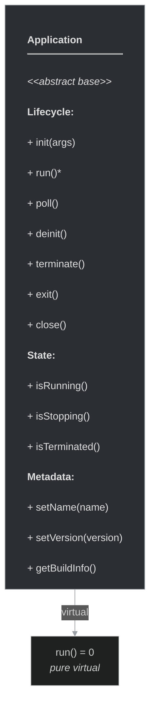
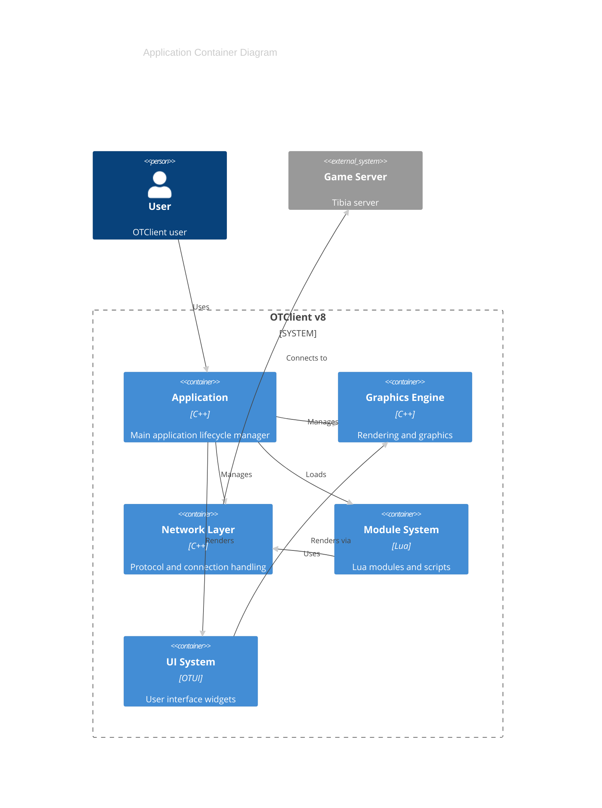
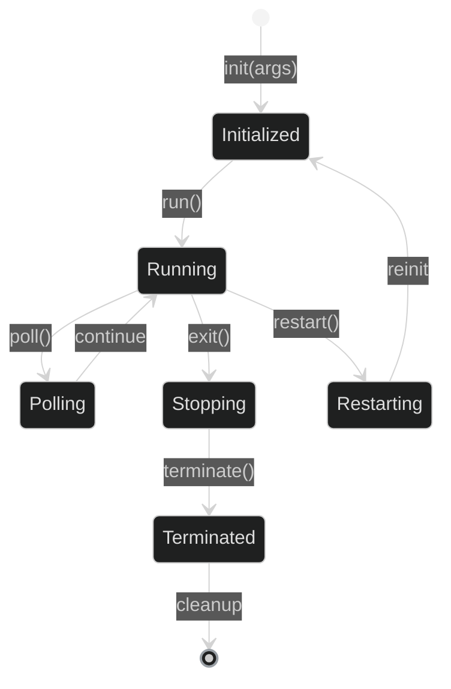

# framework/core/application.h

## Overview

Plik nagłówkowy C++ zawierający definicje dla modułu application.

## Classes/Structs

### Klasa: `Application`

| Member | Brief | Signature |
|--------|-------|-----------|
| `init` |  | `virtual void init(std::vector<std::string>& args)` |
| `deinit` |  | `virtual void deinit()` |
| `terminate` |  | `virtual void terminate()` |
| `run` |  | `virtual void run() = 0` |
| `poll` |  | `virtual void poll()` |
| `exit` |  | `virtual void exit()` |
| `quick_exit` |  | `virtual void quick_exit()` |
| `close` |  | `virtual void close()` |
| `restart` |  | `void restart()` |
| `restartArgs` |  | `void restartArgs(const std::vector<std::string>& args)` |
| `setName` |  | `void setName(const std::string& name) { m_appName = name; }` |
| `setCompactName` |  | `void setCompactName(const std::string& compactName) { m_appCompactName = compactName; }` |
| `setVersion` |  | `void setVersion(const std::string& version) { m_appVersion = version; }` |
| `isRunning` |  | `bool isRunning() { return m_running; }` |
| `isStopping` |  | `bool isStopping() { return m_stopping; }` |
| `isTerminated` |  | `bool isTerminated() { return m_terminated; }` |
| `getCharset` |  | `std::string getCharset() { return m_charset; }` |
| `getBuildCompiler` |  | `std::string getBuildCompiler() { return BUILD_COMPILER; }` |
| `getBuildDate` |  | `std::string getBuildDate() { return std::string(__DATE__); }` |
| `getBuildRevision` |  | `std::string getBuildRevision() { return std::to_string(BUILD_REVISION); }` |
| `getBuildCommit` |  | `std::string getBuildCommit() { return BUILD_COMMIT; }` |
| `getBuildType` |  | `std::string getBuildType() { return "FREE"; }` |
| `getBuildType` |  | `std::string getBuildType() { return "FULL"; }` |
| `getBuildArch` |  | `std::string getBuildArch() { return BUILD_ARCH; }` |
| `getAuthor` |  | `std::string getAuthor() { return "otclient.net"; }` |
| `getOs` |  | `std::string getOs()` |
| `getStartupOptions` |  | `std::string getStartupOptions() { return m_startupOptions; }` |
| `isMobile` |  | `bool isMobile()` |
| `m_mobile` |  | `return m_mobile` |
| `registerLuaFunctions` |  | `void registerLuaFunctions()` |
| `m_charset` |  | `std::string m_charset` |
| `m_appName` |  | `std::string m_appName` |
| `m_appCompactName` |  | `std::string m_appCompactName` |
| `m_appVersion` |  | `std::string m_appVersion` |
| `m_startupOptions` |  | `std::string m_startupOptions` |
| `m_running` |  | `stdext::boolean<false> m_running` |
| `m_stopping` |  | `stdext::boolean<false> m_stopping` |
| `m_terminated` |  | `stdext::boolean<false> m_terminated` |
| `m_mobile` |  | `stdext::boolean<false> m_mobile` |

## Functions

### `restart`

**Sygnatura:** `void restart()`

### `restartArgs`

**Sygnatura:** `void restartArgs(const std::vector<std::string>& args)`

### `setName`

**Sygnatura:** `void setName(const std::string& name) { m_appName = name; }`

### `setCompactName`

**Sygnatura:** `void setCompactName(const std::string& compactName) { m_appCompactName = compactName; }`

### `setVersion`

**Sygnatura:** `void setVersion(const std::string& version) { m_appVersion = version; }`

### `isRunning`

**Sygnatura:** `bool isRunning() { return m_running; }`

### `isStopping`

**Sygnatura:** `bool isStopping() { return m_stopping; }`

### `isTerminated`

**Sygnatura:** `bool isTerminated() { return m_terminated; }`

### `getCharset`

**Sygnatura:** `std::string getCharset() { return m_charset; }`

### `getBuildCompiler`

**Sygnatura:** `std::string getBuildCompiler() { return BUILD_COMPILER; }`

### `getBuildDate`

**Sygnatura:** `std::string getBuildDate() { return std::string(__DATE__); }`

### `getBuildRevision`

**Sygnatura:** `std::string getBuildRevision() { return std::to_string(BUILD_REVISION); }`

### `getBuildCommit`

**Sygnatura:** `std::string getBuildCommit() { return BUILD_COMMIT; }`

### `getBuildType`

**Sygnatura:** `std::string getBuildType() { return "FREE"; }`

### `getBuildType`

**Sygnatura:** `std::string getBuildType() { return "FULL"; }`

### `getBuildArch`

**Sygnatura:** `std::string getBuildArch() { return BUILD_ARCH; }`

### `getAuthor`

**Sygnatura:** `std::string getAuthor() { return "otclient.net"; }`

### `getOs`

**Sygnatura:** `std::string getOs()`

### `getStartupOptions`

**Sygnatura:** `std::string getStartupOptions() { return m_startupOptions; }`

### `isMobile`

**Sygnatura:** `bool isMobile()`

### `registerLuaFunctions`

**Sygnatura:** `void registerLuaFunctions()`

## Class Diagram

<!-- mermaid-diagram: generated-by=diagram-agent v1; source_sha=3ead5ec; generated_at=2025-01-27T00:00:00Z -->

<!-- /mermaid-diagram -->

## Diagram: Application Architecture (C4 Container)

<!-- mermaid-diagram: generated-by=diagram-agent v1; source_sha=3ead5ec; generated_at=2025-01-27T00:00:00Z -->

<!-- /mermaid-diagram -->

## Diagram: Application Lifecycle Flow

<!-- mermaid-diagram: generated-by=diagram-agent v1; source_sha=3ead5ec; generated_at=2025-01-27T00:00:00Z -->

<!-- /mermaid-diagram -->
