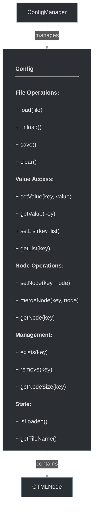

# framework/core/config.h

## Overview

Plik nagłówkowy C++ zawierający definicje dla modułu config.

## Classes/Structs

### Klasa: `Config`

| Member | Brief | Signature |
|--------|-------|-----------|
| `load` |  | `bool load(const std::string& file)` |
| `unload` |  | `bool unload()` |
| `save` |  | `bool save()` |
| `clear` |  | `void clear()` |
| `setValue` |  | `void setValue(const std::string& key, const std::string& value)` |
| `setList` |  | `void setList(const std::string& key, const std::vector<std::string>& list)` |
| `getValue` |  | `std::string getValue(const std::string& key)` |
| `getList` |  | `std::vector<std::string> getList(const std::string& key)` |
| `setNode` |  | `void setNode(const std::string& key, const OTMLNodePtr& node)` |
| `mergeNode` |  | `void mergeNode(const std::string& key, const OTMLNodePtr& node)` |
| `getNode` |  | `OTMLNodePtr getNode(const std::string& key)` |
| `getNodeSize` |  | `int getNodeSize(const std::string& key)` |
| `exists` |  | `bool exists(const std::string& key)` |
| `remove` |  | `void remove(const std::string& key)` |
| `getFileName` |  | `std::string getFileName()` |
| `isLoaded` |  | `bool isLoaded()` |
| `asConfig` |  | `ConfigPtr asConfig() { return static_self_cast<Config>(); }` |

## Functions

### `load`

**Sygnatura:** `bool load(const std::string& file)`

### `unload`

**Sygnatura:** `bool unload()`

### `save`

**Sygnatura:** `bool save()`

### `clear`

**Sygnatura:** `void clear()`

### `setValue`

**Sygnatura:** `void setValue(const std::string& key, const std::string& value)`

### `setList`

**Sygnatura:** `void setList(const std::string& key, const std::vector<std::string>& list)`

### `getValue`

**Sygnatura:** `std::string getValue(const std::string& key)`

### `getList`

**Sygnatura:** `std::vector<std::string> getList(const std::string& key)`

### `setNode`

**Sygnatura:** `void setNode(const std::string& key, const OTMLNodePtr& node)`

### `mergeNode`

**Sygnatura:** `void mergeNode(const std::string& key, const OTMLNodePtr& node)`

### `getNode`

**Sygnatura:** `OTMLNodePtr getNode(const std::string& key)`

### `getNodeSize`

**Sygnatura:** `int getNodeSize(const std::string& key)`

### `exists`

**Sygnatura:** `bool exists(const std::string& key)`

### `remove`

**Sygnatura:** `void remove(const std::string& key)`

### `getFileName`

**Sygnatura:** `std::string getFileName()`

### `isLoaded`

**Sygnatura:** `bool isLoaded()`

### `asConfig`

**Sygnatura:** `ConfigPtr asConfig() { return static_self_cast<Config>(); }`

## Class Diagram

<!-- mermaid-diagram: generated-by=diagram-agent v1; source_sha=3ead5ec; generated_at=2025-01-27T00:00:00Z -->

<!-- /mermaid-diagram -->
