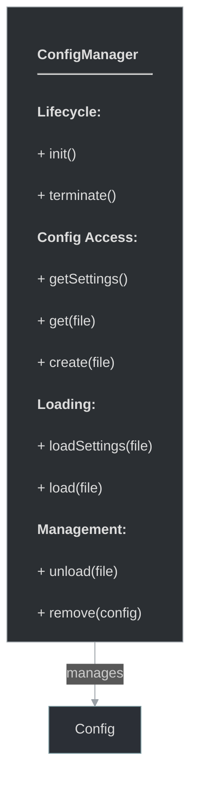

# framework/core/configmanager.h

## Overview

Plik nagłówkowy C++ zawierający definicje dla modułu configmanager.

## Classes/Structs

### Klasa: `ConfigManager`

| Member | Brief | Signature |
|--------|-------|-----------|
| `init` |  | `void init()` |
| `terminate` |  | `void terminate()` |
| `getSettings` |  | `ConfigPtr getSettings()` |
| `get` |  | `ConfigPtr get(const std::string& file)` |
| `create` |  | `ConfigPtr create(const std::string& file)` |
| `loadSettings` |  | `ConfigPtr loadSettings(const std::string file)` |
| `load` |  | `ConfigPtr load(const std::string& file)` |
| `unload` |  | `bool unload(const std::string& file)` |
| `remove` |  | `void remove(const ConfigPtr config)` |
| `m_settings` |  | `ConfigPtr m_settings` |

## Functions

### `init`

**Sygnatura:** `void init()`

### `terminate`

**Sygnatura:** `void terminate()`

### `getSettings`

**Sygnatura:** `ConfigPtr getSettings()`

### `get`

**Sygnatura:** `ConfigPtr get(const std::string& file)`

### `create`

**Sygnatura:** `ConfigPtr create(const std::string& file)`

### `loadSettings`

**Sygnatura:** `ConfigPtr loadSettings(const std::string file)`

### `load`

**Sygnatura:** `ConfigPtr load(const std::string& file)`

### `unload`

**Sygnatura:** `bool unload(const std::string& file)`

### `remove`

**Sygnatura:** `void remove(const ConfigPtr config)`

## Class Diagram

<!-- mermaid-diagram: generated-by=diagram-agent v1; source_sha=3ead5ec; generated_at=2025-01-27T00:00:00Z -->

<!-- /mermaid-diagram -->
