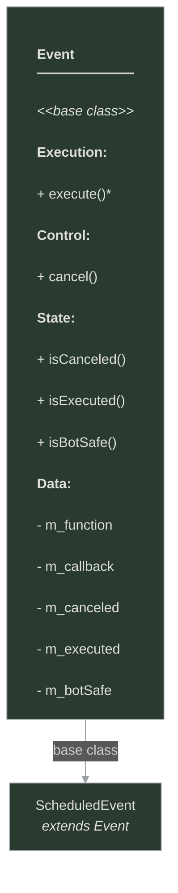

# framework/core/event.h

## Overview

Plik nagłówkowy C++ zawierający definicje dla modułu event.

## Classes/Structs

### Klasa: `Event`

| Member | Brief | Signature |
|--------|-------|-----------|
| `execute` |  | `virtual void execute()` |
| `cancel` |  | `void cancel()` |
| `isCanceled` |  | `bool isCanceled() { return m_canceled; }` |
| `isExecuted` |  | `bool isExecuted() { return m_executed; }` |
| `isBotSafe` |  | `bool isBotSafe() { return m_botSafe; }` |
| `m_function` |  | `std::string m_function` |
| `m_callback` |  | `std::function<void()> m_callback` |
| `m_canceled` |  | `bool m_canceled` |
| `m_executed` |  | `bool m_executed` |
| `m_botSafe` |  | `bool m_botSafe` |

## Functions

### `cancel`

**Sygnatura:** `void cancel()`

### `isCanceled`

**Sygnatura:** `bool isCanceled() { return m_canceled; }`

### `isExecuted`

**Sygnatura:** `bool isExecuted() { return m_executed; }`

### `isBotSafe`

**Sygnatura:** `bool isBotSafe() { return m_botSafe; }`

## Class Diagram

<!-- mermaid-diagram: generated-by=diagram-agent v1; source_sha=3ead5ec; generated_at=2025-01-27T00:00:00Z -->

<!-- /mermaid-diagram -->
