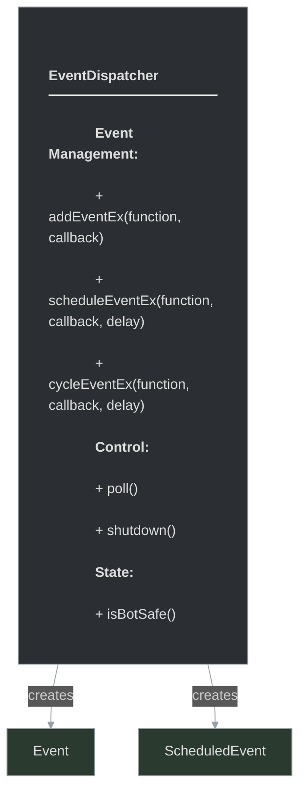

# framework/core/eventdispatcher.h

## Overview

Plik nagłówkowy C++ zawierający definicje dla modułu eventdispatcher.

## Classes/Structs

### Klasa: `EventDispatcher`

| Member | Brief | Signature |
|--------|-------|-----------|
| `shutdown` |  | `void shutdown()` |
| `poll` |  | `void poll()` |
| `addEventEx` |  | `EventPtr addEventEx(const std::string& function, const std::function<void()>& callback, bool pushFront = false)` |
| `scheduleEventEx` |  | `ScheduledEventPtr scheduleEventEx(const std::string& function, const std::function<void()>& callback, int delay)` |
| `cycleEventEx` |  | `ScheduledEventPtr cycleEventEx(const std::string& function, const std::function<void()>& callback, int delay)` |
| `isBotSafe` |  | `bool isBotSafe() { return m_botSafe; }` |

## Functions

### `shutdown`

**Sygnatura:** `void shutdown()`

### `poll`

**Sygnatura:** `void poll()`

### `addEventEx`

**Sygnatura:** `EventPtr addEventEx(const std::string& function, const std::function<void()>& callback, bool pushFront = false)`

### `scheduleEventEx`

**Sygnatura:** `ScheduledEventPtr scheduleEventEx(const std::string& function, const std::function<void()>& callback, int delay)`

### `cycleEventEx`

**Sygnatura:** `ScheduledEventPtr cycleEventEx(const std::string& function, const std::function<void()>& callback, int delay)`

### `isBotSafe`

**Sygnatura:** `bool isBotSafe() { return m_botSafe; }`

## Class Diagram

<!-- mermaid-diagram: generated-by=diagram-agent v1; source_sha=3ead5ec; generated_at=2025-01-27T00:00:00Z -->

<!-- /mermaid-diagram -->
