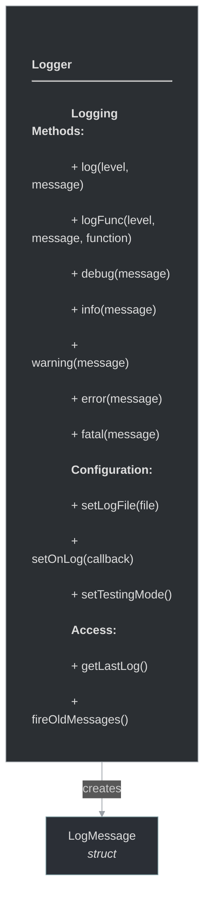

# framework/core/logger.h

## Overview

Plik nagłówkowy C++ zawierający definicje dla modułu logger.

## Classes/Structs

### Struktura: `LogMessage`

### Klasa: `Logger`

| Member | Brief | Signature |
|--------|-------|-----------|
| `log` |  | `void log(Fw::LogLevel level, const std::string& message)` |
| `logFunc` |  | `void logFunc(Fw::LogLevel level, const std::string& message, std::string prettyFunction)` |
| `debug` |  | `void debug(const std::string& what) { log(Fw::LogDebug, what); }` |
| `info` |  | `void info(const std::string& what) { log(Fw::LogInfo, what); }` |
| `warning` |  | `void warning(const std::string& what) { log(Fw::LogWarning, what); }` |
| `error` |  | `void error(const std::string& what) { log(Fw::LogError, what); }` |
| `fatal` |  | `void fatal(const std::string& what) { log(Fw::LogFatal, what); }` |
| `fireOldMessages` |  | `void fireOldMessages()` |
| `setLogFile` |  | `void setLogFile(const std::string& file)` |
| `setOnLog` |  | `void setOnLog(const OnLogCallback& onLog) { m_onLog = onLog; }` |
| `getLastLog` |  | `std::string getLastLog() {` |
| `m_lastLog` |  | `return m_lastLog` |
| `setTestingMode` |  | `void setTestingMode()` |

## Functions

### `log`

**Sygnatura:** `void log(Fw::LogLevel level, const std::string& message)`

### `logFunc`

**Sygnatura:** `void logFunc(Fw::LogLevel level, const std::string& message, std::string prettyFunction)`

### `debug`

**Sygnatura:** `void debug(const std::string& what) { log(Fw::LogDebug, what); }`

### `info`

**Sygnatura:** `void info(const std::string& what) { log(Fw::LogInfo, what); }`

### `warning`

**Sygnatura:** `void warning(const std::string& what) { log(Fw::LogWarning, what); }`

### `error`

**Sygnatura:** `void error(const std::string& what) { log(Fw::LogError, what); }`

### `fatal`

**Sygnatura:** `void fatal(const std::string& what) { log(Fw::LogFatal, what); }`

### `fireOldMessages`

**Sygnatura:** `void fireOldMessages()`

### `setLogFile`

**Sygnatura:** `void setLogFile(const std::string& file)`

### `setOnLog`

**Sygnatura:** `void setOnLog(const OnLogCallback& onLog) { m_onLog = onLog; }`

### `getLastLog`

**Sygnatura:** `std::string getLastLog() {`

### `setTestingMode`

**Sygnatura:** `void setTestingMode()`

## Types/Aliases

### `OnLogCallback`

**Typedef:** `std::function<void(Fw::LogLevel, const std::string&, int64)>`

## Class Diagram

<!-- mermaid-diagram: generated-by=diagram-agent v1; source_sha=3ead5ec; generated_at=2025-01-27T00:00:00Z -->

<!-- /mermaid-diagram -->
