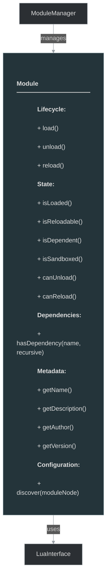

# framework/core/module.h

## Overview

Plik nagłówkowy C++ zawierający definicje dla modułu module.

## Classes/Structs

### Klasa: `Module`

| Member | Brief | Signature |
|--------|-------|-----------|
| `load` |  | `bool load()` |
| `unload` |  | `void unload()` |
| `reload` |  | `bool reload()` |
| `canUnload` |  | `bool canUnload() { return m_loaded && m_reloadable && !isDependent(); }` |
| `canReload` |  | `bool canReload() { return m_reloadable && !isDependent(); }` |
| `isLoaded` |  | `bool isLoaded() { return m_loaded; }` |
| `isReloadable` |  | `bool isReloadable() { return m_reloadable; }` |
| `isDependent` |  | `bool isDependent()` |
| `isSandboxed` |  | `bool isSandboxed() { return m_sandboxed; }` |
| `hasDependency` |  | `bool hasDependency(const std::string& name, bool recursive = false)` |
| `getSandbox` |  | `int getSandbox(LuaInterface *lua)` |
| `getDescription` |  | `std::string getDescription() { return m_description; }` |
| `getName` |  | `std::string getName() { return m_name; }` |
| `getAuthor` |  | `std::string getAuthor() { return m_author; }` |
| `getWebsite` |  | `std::string getWebsite() { return m_website; }` |
| `getVersion` |  | `std::string getVersion() { return m_version; }` |
| `isAutoLoad` |  | `bool isAutoLoad() { return m_autoLoad; }` |
| `getAutoLoadPriority` |  | `int getAutoLoadPriority() { return m_autoLoadPriority; }` |
| `asModule` |  | `ModulePtr asModule() { return static_self_cast<Module>(); }` |
| `discover` |  | `void discover(const OTMLNodePtr& moduleNode)` |

## Functions

### `load`

**Sygnatura:** `bool load()`

### `unload`

**Sygnatura:** `void unload()`

### `reload`

**Sygnatura:** `bool reload()`

### `canUnload`

**Sygnatura:** `bool canUnload() { return m_loaded && m_reloadable && !isDependent(); }`

### `canReload`

**Sygnatura:** `bool canReload() { return m_reloadable && !isDependent(); }`

### `isLoaded`

**Sygnatura:** `bool isLoaded() { return m_loaded; }`

### `isReloadable`

**Sygnatura:** `bool isReloadable() { return m_reloadable; }`

### `isDependent`

**Sygnatura:** `bool isDependent()`

### `isSandboxed`

**Sygnatura:** `bool isSandboxed() { return m_sandboxed; }`

### `hasDependency`

**Sygnatura:** `bool hasDependency(const std::string& name, bool recursive = false)`

### `getSandbox`

**Sygnatura:** `int getSandbox(LuaInterface *lua)`

### `getDescription`

**Sygnatura:** `std::string getDescription() { return m_description; }`

### `getName`

**Sygnatura:** `std::string getName() { return m_name; }`

### `getAuthor`

**Sygnatura:** `std::string getAuthor() { return m_author; }`

### `getWebsite`

**Sygnatura:** `std::string getWebsite() { return m_website; }`

### `getVersion`

**Sygnatura:** `std::string getVersion() { return m_version; }`

### `isAutoLoad`

**Sygnatura:** `bool isAutoLoad() { return m_autoLoad; }`

### `getAutoLoadPriority`

**Sygnatura:** `int getAutoLoadPriority() { return m_autoLoadPriority; }`

### `asModule`

**Sygnatura:** `ModulePtr asModule() { return static_self_cast<Module>(); }`

### `discover`

**Sygnatura:** `void discover(const OTMLNodePtr& moduleNode)`

## Class Diagram

<!-- mermaid-diagram: generated-by=diagram-agent v1; source_sha=3ead5ec; generated_at=2025-01-27T00:00:00Z -->

<!-- /mermaid-diagram -->
