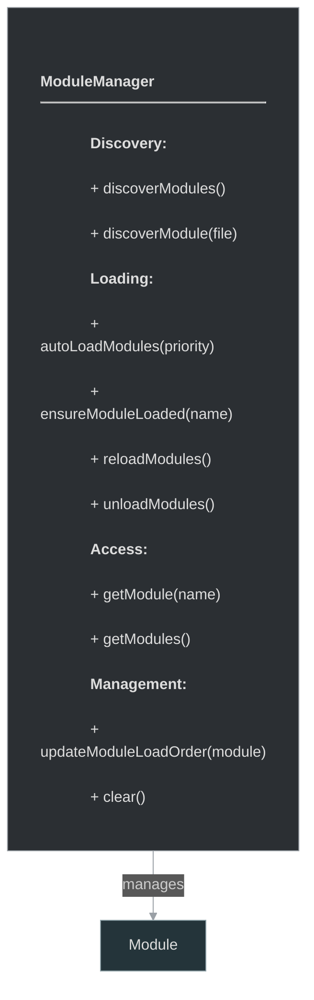
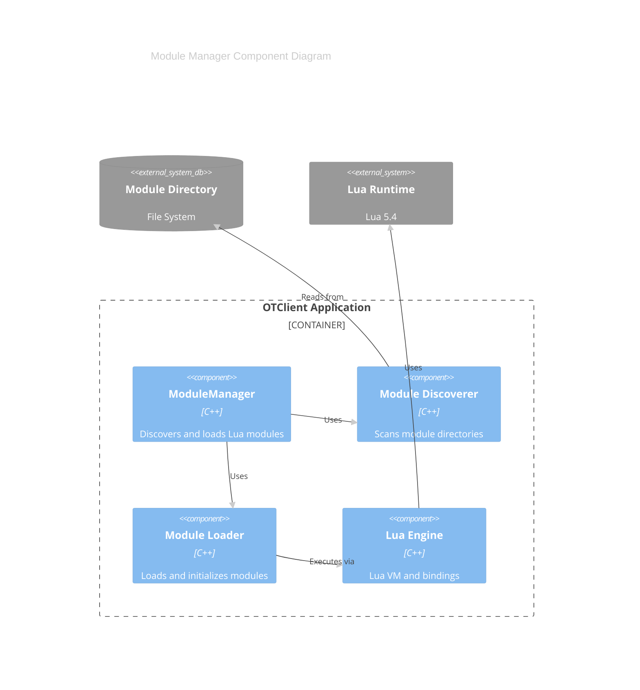
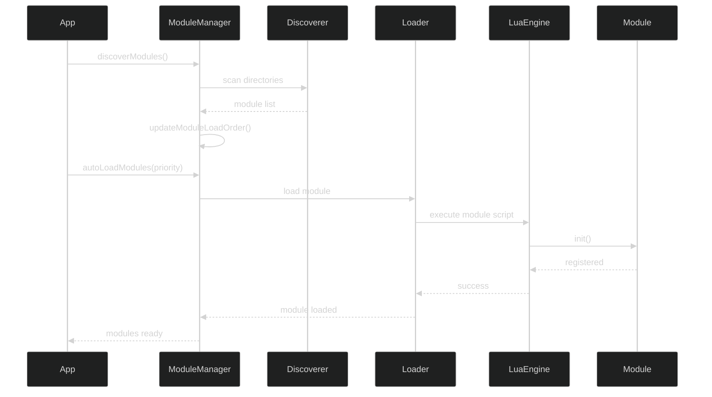

# framework/core/modulemanager.h

## Overview

Plik nagłówkowy C++ zawierający definicje dla modułu modulemanager.

## Classes/Structs

### Klasa: `ModuleManager`

| Member | Brief | Signature |
|--------|-------|-----------|
| `clear` |  | `void clear()` |
| `discoverModules` |  | `void discoverModules()` |
| `autoLoadModules` |  | `void autoLoadModules(int maxPriority)` |
| `discoverModule` |  | `ModulePtr discoverModule(const std::string& moduleFile)` |
| `ensureModuleLoaded` |  | `void ensureModuleLoaded(const std::string& moduleName)` |
| `unloadModules` |  | `void unloadModules()` |
| `reloadModules` |  | `void reloadModules()` |
| `getModule` |  | `ModulePtr getModule(const std::string& moduleName)` |
| `getModules` |  | `std::deque<ModulePtr> getModules() { return m_modules; }` |
| `updateModuleLoadOrder` |  | `void updateModuleLoadOrder(ModulePtr module)` |

## Functions

### `clear`

**Sygnatura:** `void clear()`

### `discoverModules`

**Sygnatura:** `void discoverModules()`

### `autoLoadModules`

**Sygnatura:** `void autoLoadModules(int maxPriority)`

### `discoverModule`

**Sygnatura:** `ModulePtr discoverModule(const std::string& moduleFile)`

### `ensureModuleLoaded`

**Sygnatura:** `void ensureModuleLoaded(const std::string& moduleName)`

### `unloadModules`

**Sygnatura:** `void unloadModules()`

### `reloadModules`

**Sygnatura:** `void reloadModules()`

### `getModule`

**Sygnatura:** `ModulePtr getModule(const std::string& moduleName)`

### `getModules`

**Sygnatura:** `std::deque<ModulePtr> getModules() { return m_modules; }`

### `updateModuleLoadOrder`

**Sygnatura:** `void updateModuleLoadOrder(ModulePtr module)`

## Class Diagram

<!-- mermaid-diagram: generated-by=diagram-agent v1; source_sha=3ead5ec; generated_at=2025-01-27T00:00:00Z -->

<!-- /mermaid-diagram -->

## Diagram: Module Loading Architecture (C4 Component)

<!-- mermaid-diagram: generated-by=diagram-agent v1; source_sha=3ead5ec; generated_at=2025-01-27T00:00:00Z -->

<!-- /mermaid-diagram -->

## Diagram: Module Loading Sequence

<!-- mermaid-diagram: generated-by=diagram-agent v1; source_sha=3ead5ec; generated_at=2025-01-27T00:00:00Z -->

<!-- /mermaid-diagram -->
