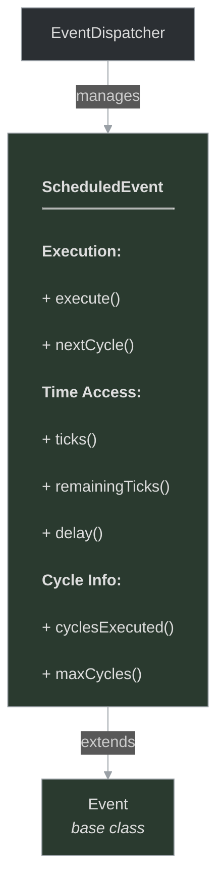
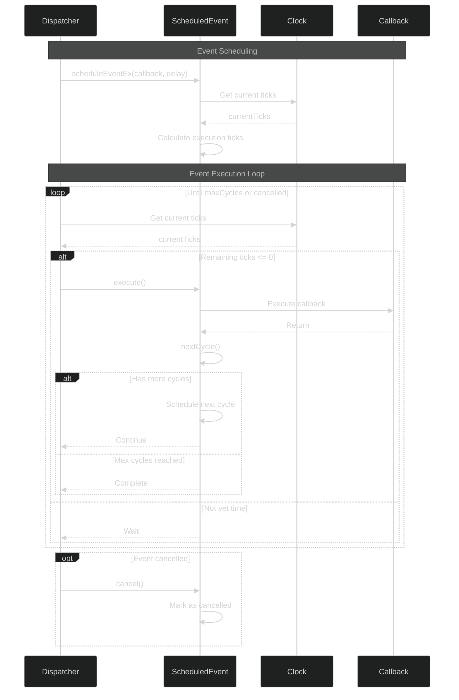

# framework/core/scheduledevent.h

## Overview

Plik nagłówkowy C++ zawierający definicje dla modułu scheduledevent.

## Classes/Structs

### Klasa: `ScheduledEvent`

| Member | Brief | Signature |
|--------|-------|-----------|
| `execute` |  | `void execute()` |
| `nextCycle` |  | `bool nextCycle()` |
| `ticks` |  | `int ticks() { return m_ticks; }` |
| `remainingTicks` |  | `int remainingTicks() { return m_ticks - g_clock.millis(); }` |
| `delay` |  | `int delay() { return m_delay; }` |
| `cyclesExecuted` |  | `int cyclesExecuted() { return m_cyclesExecuted; }` |
| `maxCycles` |  | `int maxCycles() { return m_maxCycles; }` |

### Struktura: `lessScheduledEvent`

## Functions

### `execute`

**Sygnatura:** `void execute()`

### `nextCycle`

**Sygnatura:** `bool nextCycle()`

### `ticks`

**Sygnatura:** `int ticks() { return m_ticks; }`

### `remainingTicks`

**Sygnatura:** `int remainingTicks() { return m_ticks - g_clock.millis(); }`

### `delay`

**Sygnatura:** `int delay() { return m_delay; }`

### `cyclesExecuted`

**Sygnatura:** `int cyclesExecuted() { return m_cyclesExecuted; }`

### `maxCycles`

**Sygnatura:** `int maxCycles() { return m_maxCycles; }`

### `operator`

**Sygnatura:** `bool operator()(const ScheduledEventPtr& a, const ScheduledEventPtr& b) {`

## Class Diagram

<!-- mermaid-diagram: generated-by=diagram-agent v1; source_sha=3ead5ec; generated_at=2025-01-27T00:00:00Z -->

<!-- /mermaid-diagram -->

## Diagram: Scheduled Event Lifecycle (Advanced Sequence)

<!-- mermaid-diagram: generated-by=diagram-agent v1; source_sha=3ead5ec; generated_at=2025-01-27T00:00:00Z -->

<!-- /mermaid-diagram -->
