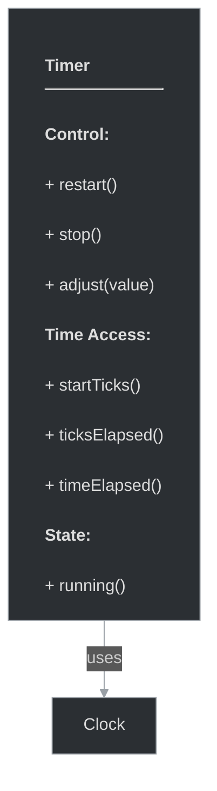

# framework/core/timer.h

## Overview

Plik nagłówkowy C++ zawierający definicje dla modułu timer.

## Classes/Structs

### Klasa: `Timer`

| Member | Brief | Signature |
|--------|-------|-----------|
| `restart` |  | `void restart()` |
| `stop` |  | `void stop() { m_stopped = true; }` |
| `adjust` |  | `void adjust(ticks_t value) { m_startTicks += value; }` |
| `startTicks` |  | `ticks_t startTicks() { return m_startTicks; }` |
| `ticksElapsed` |  | `ticks_t ticksElapsed()` |
| `timeElapsed` |  | `float timeElapsed() { return ticksElapsed()/1000.0f; }` |
| `running` |  | `bool running() { return !m_stopped; }` |

## Functions

### `restart`

**Sygnatura:** `void restart()`

### `stop`

**Sygnatura:** `void stop() { m_stopped = true; }`

### `adjust`

**Sygnatura:** `void adjust(ticks_t value) { m_startTicks += value; }`

### `startTicks`

**Sygnatura:** `ticks_t startTicks() { return m_startTicks; }`

### `ticksElapsed`

**Sygnatura:** `ticks_t ticksElapsed()`

### `timeElapsed`

**Sygnatura:** `float timeElapsed() { return ticksElapsed()/1000.0f; }`

### `running`

**Sygnatura:** `bool running() { return !m_stopped; }`

## Class Diagram

<!-- mermaid-diagram: generated-by=diagram-agent v1; source_sha=3ead5ec; generated_at=2025-01-27T00:00:00Z -->

<!-- /mermaid-diagram -->
