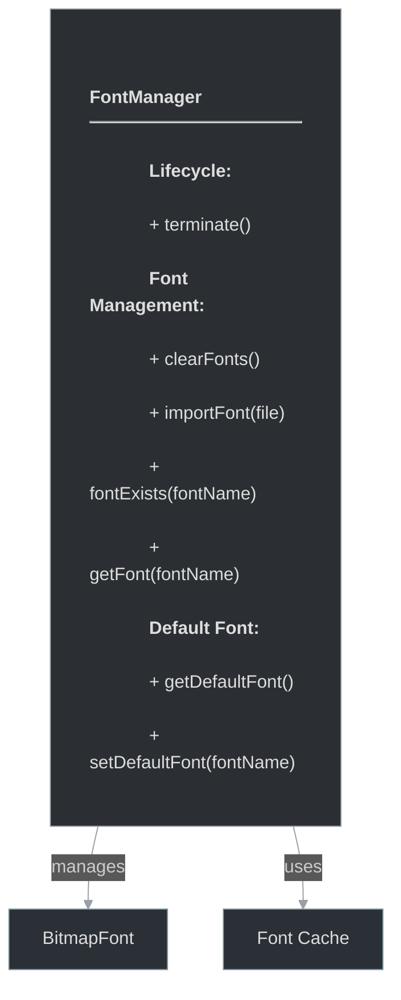

# framework/graphics/fontmanager.h

## Overview

Plik nagłówkowy C++ zawierający definicje dla modułu fontmanager.

## Classes/Structs

### Klasa: `FontManager`

| Member | Brief | Signature |
|--------|-------|-----------|
| `terminate` |  | `void terminate()` |
| `clearFonts` |  | `void clearFonts()` |
| `importFont` |  | `void importFont(std::string file)` |
| `fontExists` |  | `bool fontExists(const std::string& fontName)` |
| `getFont` |  | `BitmapFontPtr getFont(const std::string& fontName)` |
| `getDefaultFont` |  | `BitmapFontPtr getDefaultFont() { return m_defaultFont; }` |
| `setDefaultFont` |  | `void setDefaultFont(const std::string& fontName) { m_defaultFont = getFont(fontName); }` |

## Functions

### `terminate`

**Sygnatura:** `void terminate()`

### `clearFonts`

**Sygnatura:** `void clearFonts()`

### `importFont`

**Sygnatura:** `void importFont(std::string file)`

### `fontExists`

**Sygnatura:** `bool fontExists(const std::string& fontName)`

### `getFont`

**Sygnatura:** `BitmapFontPtr getFont(const std::string& fontName)`

### `getDefaultFont`

**Sygnatura:** `BitmapFontPtr getDefaultFont() { return m_defaultFont; }`

### `setDefaultFont`

**Sygnatura:** `void setDefaultFont(const std::string& fontName) { m_defaultFont = getFont(fontName); }`

## Class Diagram

<!-- mermaid-diagram: generated-by=diagram-agent v1; source_sha=3ead5ec; generated_at=2025-01-27T00:00:00Z -->

<!-- /mermaid-diagram -->
