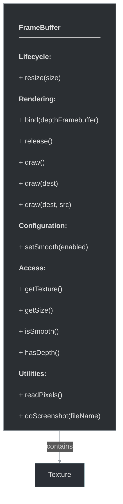

# framework/graphics/framebuffer.h

## Overview

Plik nagłówkowy C++ zawierający definicje dla modułu framebuffer.

## Classes/Structs

### Klasa: `FrameBuffer`

| Member | Brief | Signature |
|--------|-------|-----------|
| `resize` |  | `void resize(const Size& size)` |
| `bind` |  | `void bind(const FrameBufferPtr& depthFramebuffer = nullptr)` |
| `release` |  | `void release()` |
| `draw` |  | `void draw()` |
| `draw` |  | `void draw(const Rect& dest)` |
| `draw` |  | `void draw(const Rect& dest, const Rect& src)` |
| `setSmooth` |  | `void setSmooth(bool enabled)` |
| `getTexture` |  | `TexturePtr getTexture() { return m_texture; }` |
| `getSize` |  | `Size getSize()` |
| `isSmooth` |  | `bool isSmooth() { return m_smooth; }` |
| `getDepthRenderBuffer` |  | `uint getDepthRenderBuffer() { return m_depthRbo; }` |
| `hasDepth` |  | `bool hasDepth() { return m_depth; }` |
| `readPixels` |  | `std::vector<uint32_t> readPixels()` |
| `doScreenshot` |  | `void doScreenshot(std::string fileName)` |

## Functions

### `resize`

**Sygnatura:** `void resize(const Size& size)`

### `bind`

**Sygnatura:** `void bind(const FrameBufferPtr& depthFramebuffer = nullptr)`

### `release`

**Sygnatura:** `void release()`

### `draw`

**Sygnatura:** `void draw()`

### `draw`

**Sygnatura:** `void draw(const Rect& dest)`

### `draw`

**Sygnatura:** `void draw(const Rect& dest, const Rect& src)`

### `setSmooth`

**Sygnatura:** `void setSmooth(bool enabled)`

### `getTexture`

**Sygnatura:** `TexturePtr getTexture() { return m_texture; }`

### `getSize`

**Sygnatura:** `Size getSize()`

### `isSmooth`

**Sygnatura:** `bool isSmooth() { return m_smooth; }`

### `getDepthRenderBuffer`

**Sygnatura:** `uint getDepthRenderBuffer() { return m_depthRbo; }`

### `hasDepth`

**Sygnatura:** `bool hasDepth() { return m_depth; }`

### `readPixels`

**Sygnatura:** `std::vector<uint32_t> readPixels()`

### `doScreenshot`

**Sygnatura:** `void doScreenshot(std::string fileName)`

### `internalCreate`

**Sygnatura:** `void internalCreate()`

### `internalBind`

**Sygnatura:** `void internalBind()`

### `internalRelease`

**Sygnatura:** `void internalRelease()`

## Class Diagram

<!-- mermaid-diagram: generated-by=diagram-agent v1; source_sha=3ead5ec; generated_at=2025-01-27T00:00:00Z -->

<!-- /mermaid-diagram -->
