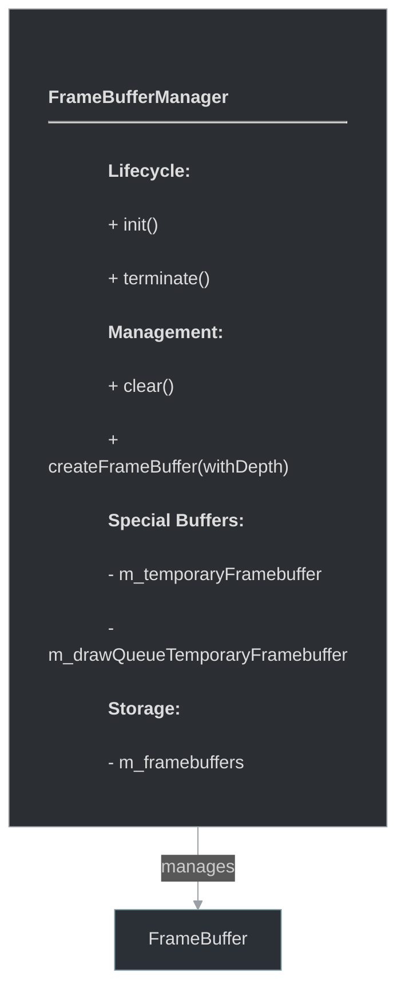
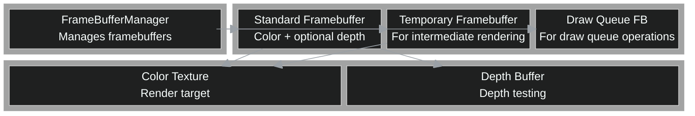

# framework/graphics/framebuffermanager.h

## Overview

Plik nagłówkowy C++ zawierający definicje dla modułu framebuffermanager.

## Classes/Structs

### Klasa: `FrameBufferManager`

| Member | Brief | Signature |
|--------|-------|-----------|
| `init` |  | `void init()` |
| `terminate` |  | `void terminate()` |
| `clear` |  | `void clear()` |
| `createFrameBuffer` |  | `FrameBufferPtr createFrameBuffer(bool withDepth = false)` |
| `m_temporaryFramebuffer` |  | `FrameBufferPtr m_temporaryFramebuffer` |
| `m_drawQueueTemporaryFramebuffer` |  | `FrameBufferPtr m_drawQueueTemporaryFramebuffer` |
| `m_framebuffers` |  | `std::vector<FrameBufferPtr> m_framebuffers` |

## Functions

### `init`

**Sygnatura:** `void init()`

### `terminate`

**Sygnatura:** `void terminate()`

### `clear`

**Sygnatura:** `void clear()`

### `createFrameBuffer`

**Sygnatura:** `FrameBufferPtr createFrameBuffer(bool withDepth = false)`

## Class Diagram

<!-- mermaid-diagram: generated-by=diagram-agent v1; source_sha=3ead5ec; generated_at=2025-01-27T00:00:00Z -->

<!-- /mermaid-diagram -->

## Diagram: Framebuffer System Block Diagram

<!-- mermaid-diagram: generated-by=diagram-agent v1; source_sha=3ead5ec; generated_at=2025-01-27T00:00:00Z -->

<!-- /mermaid-diagram -->
