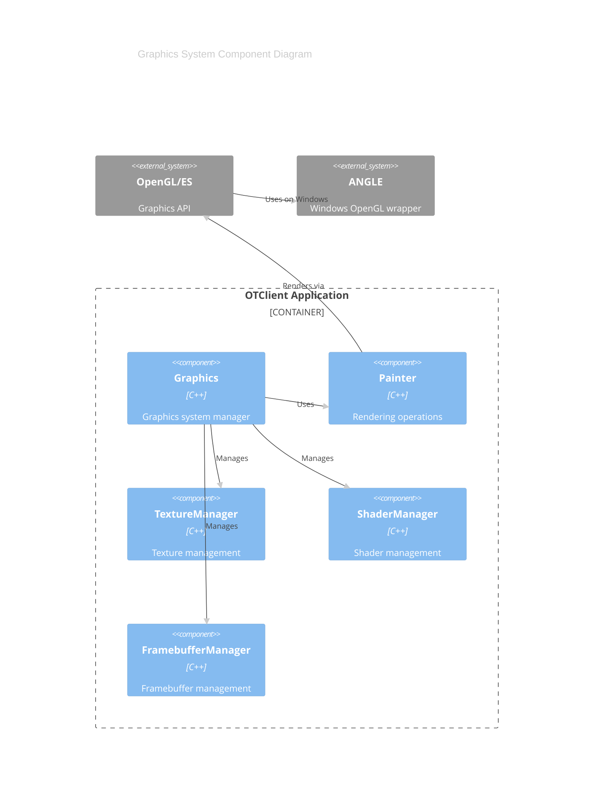

# framework/graphics/graphics.h

## Overview

Plik nagłówkowy C++ zawierający definicje dla modułu graphics.

## Classes/Structs

### Klasa: `Painter`

| Member | Brief | Signature |
|--------|-------|-----------|
| `init` |  | `void init()` |
| `terminate` |  | `void terminate()` |
| `resize` |  | `void resize(const Size& size)` |
| `checkDepthSupport` |  | `void checkDepthSupport()` |
| `getMaxTextureSize` |  | `int getMaxTextureSize() { return m_maxTextureSize; }` |
| `getVendor` |  | `std::string getVendor() { return m_vendor; }` |
| `getRenderer` |  | `std::string getRenderer() { return m_renderer; }` |
| `getVersion` |  | `std::string getVersion() { return m_version; }` |
| `getExtensions` |  | `std::string getExtensions() { return m_extensions; }` |
| `ok` |  | `bool ok() { return m_ok; }` |
| `checkForError` |  | `void checkForError(const std::string& function, const std::string& file, int line)` |

### Klasa: `Graphics`

| Member | Brief | Signature |
|--------|-------|-----------|
| `init` |  | `void init()` |
| `terminate` |  | `void terminate()` |
| `resize` |  | `void resize(const Size& size)` |
| `checkDepthSupport` |  | `void checkDepthSupport()` |
| `getMaxTextureSize` |  | `int getMaxTextureSize() { return m_maxTextureSize; }` |
| `getVendor` |  | `std::string getVendor() { return m_vendor; }` |
| `getRenderer` |  | `std::string getRenderer() { return m_renderer; }` |
| `getVersion` |  | `std::string getVersion() { return m_version; }` |
| `getExtensions` |  | `std::string getExtensions() { return m_extensions; }` |
| `ok` |  | `bool ok() { return m_ok; }` |
| `checkForError` |  | `void checkForError(const std::string& function, const std::string& file, int line)` |

## Functions

### `init`

**Sygnatura:** `void init()`

### `terminate`

**Sygnatura:** `void terminate()`

### `resize`

**Sygnatura:** `void resize(const Size& size)`

### `checkDepthSupport`

**Sygnatura:** `void checkDepthSupport()`

### `getMaxTextureSize`

**Sygnatura:** `int getMaxTextureSize() { return m_maxTextureSize; }`

### `getVendor`

**Sygnatura:** `std::string getVendor() { return m_vendor; }`

### `getRenderer`

**Sygnatura:** `std::string getRenderer() { return m_renderer; }`

### `getVersion`

**Sygnatura:** `std::string getVersion() { return m_version; }`

### `getExtensions`

**Sygnatura:** `std::string getExtensions() { return m_extensions; }`

### `ok`

**Sygnatura:** `bool ok() { return m_ok; }`

### `checkForError`

**Sygnatura:** `void checkForError(const std::string& function, const std::string& file, int line)`

### `checkDepthSupport`

**Sygnatura:** `void checkDepthSupport()`

## Class Diagram

```mermaid
%%{init: {'theme': 'dark', 'themeVariables': {'primaryTextColor': '#ddd', 'lineColor': '#9aa0a6'}, 'securityLevel': 'loose'}}%%
graph TD
    classDef core fill:#2b2f33,stroke:#9aa0a6,color:#ddd,stroke-width:1px;
    
    Graphics["
        <div style='text-align:left; padding:5px;'>
            <div style='font-size:16px; font-weight:bold;'>Graphics</div><hr/>
            <b>Initialization:</b><br/>
            + init()<br/>
            + terminate()<br/>
            <b>Configuration:</b><br/>
            + resize(size)<br/>
            + checkDepthSupport()<br/>
            <b>Information:</b><br/>
            + getMaxTextureSize()<br/>
            + getVendor()<br/>
            + getRenderer()<br/>
            + getVersion()<br/>
            + getExtensions()<br/>
            <b>State:</b><br/>
            + ok()<br/>
            + checkForError(function, file, line)
        </div>
    "]:::core;
    
    Painter["
        <div style='text-align:left; padding:5px;'>
            <div style='font-size:16px; font-weight:bold;'>Painter</div><hr/>
            <b>Initialization:</b><br/>
            + init()<br/>
            + terminate()<br/>
            <b>Configuration:</b><br/>
            + resize(size)<br/>
            + checkDepthSupport()<br/>
            <b>Information:</b><br/>
            + getMaxTextureSize()<br/>
            + getVendor()<br/>
            + getRenderer()<br/>
            + getVersion()<br/>
            + getExtensions()<br/>
            <b>State:</b><br/>
            + ok()<br/>
            + checkForError(function, file, line)
        </div>
    "]:::core;
    
    Graphics --> |"uses"| Painter
    
    classDef core fill:#2b2f33,stroke:#9aa0a6,color:#ddd,stroke-width:1px;
```

<!-- mermaid-diagram: generated-by=diagram-agent v1; source_sha=3ead5ec; generated_at=2025-01-27T00:00:00Z -->

<!-- /mermaid-diagram -->

## Diagram: Graphics System Architecture (C4 Component)

<!-- mermaid-diagram: generated-by=diagram-agent v1; source_sha=3ead5ec; generated_at=2025-01-27T00:00:00Z -->

<!-- /mermaid-diagram -->
