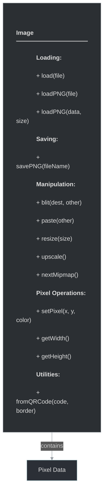

# framework/graphics/image.h

## Overview

Plik nagłówkowy C++ zawierający definicje dla modułu image.

## Classes/Structs

### Klasa: `Image`

| Member | Brief | Signature |
|--------|-------|-----------|
| `load` |  | `static ImagePtr load(std::string file)` |
| `loadPNG` |  | `static ImagePtr loadPNG(const std::string& file)` |
| `loadPNG` |  | `static ImagePtr loadPNG(const void* data, uint32_t size)` |
| `savePNG` |  | `void savePNG(const std::string& fileName)` |
| `blit` |  | `void blit(const Point& dest, const ImagePtr& other)` |
| `paste` |  | `void paste(const ImagePtr& other)` |
| `upscale` |  | `ImagePtr upscale()` |
| `resize` |  | `void resize(const Size& size) { m_size = size; m_pixels.resize(size.area() * m_bpp, 0); }` |
| `nextMipmap` |  | `bool nextMipmap()` |
| `setPixel` |  | `void setPixel(int x, int y, uint8 *pixel) { memcpy(&m_pixels[(y * m_size.width() + x) * m_bpp], pixel, m_bpp);}` |
| `setPixel` |  | `void setPixel(int x, int y, uint32_t argb) { setPixel(x, y, (uint8*)&argb); }` |
| `setPixel` |  | `void setPixel(int x, int y, const Color& color) {` |
| `getPixelCount` |  | `int getPixelCount() { return m_size.area(); }` |
| `getWidth` |  | `int getWidth() { return m_size.width(); }` |
| `getHeight` |  | `int getHeight() { return m_size.height(); }` |
| `getBpp` |  | `int getBpp() { return m_bpp; }` |
| `fromQRCode` |  | `static ImagePtr fromQRCode(const std::string& code, int border)` |

## Functions

### `load`

**Sygnatura:** `static ImagePtr load(std::string file)`

### `loadPNG`

**Sygnatura:** `static ImagePtr loadPNG(const std::string& file)`

### `loadPNG`

**Sygnatura:** `static ImagePtr loadPNG(const void* data, uint32_t size)`

### `savePNG`

**Sygnatura:** `void savePNG(const std::string& fileName)`

### `blit`

**Sygnatura:** `void blit(const Point& dest, const ImagePtr& other)`

### `paste`

**Sygnatura:** `void paste(const ImagePtr& other)`

### `upscale`

**Sygnatura:** `ImagePtr upscale()`

### `resize`

**Sygnatura:** `void resize(const Size& size) { m_size = size; m_pixels.resize(size.area() * m_bpp, 0); }`

### `nextMipmap`

**Sygnatura:** `bool nextMipmap()`

### `setPixel`

**Sygnatura:** `void setPixel(int x, int y, uint8 *pixel) { memcpy(&m_pixels[(y * m_size.width() + x) * m_bpp], pixel, m_bpp);}`

### `setPixel`

**Sygnatura:** `void setPixel(int x, int y, uint32_t argb) { setPixel(x, y, (uint8*)&argb); }`

### `setPixel`

**Sygnatura:** `void setPixel(int x, int y, const Color& color) {`

### `getPixelCount`

**Sygnatura:** `int getPixelCount() { return m_size.area(); }`

### `getWidth`

**Sygnatura:** `int getWidth() { return m_size.width(); }`

### `getHeight`

**Sygnatura:** `int getHeight() { return m_size.height(); }`

### `getBpp`

**Sygnatura:** `int getBpp() { return m_bpp; }`

### `fromQRCode`

**Sygnatura:** `static ImagePtr fromQRCode(const std::string& code, int border)`

## Class Diagram

<!-- mermaid-diagram: generated-by=diagram-agent v1; source_sha=3ead5ec; generated_at=2025-01-27T00:00:00Z -->

<!-- /mermaid-diagram -->
