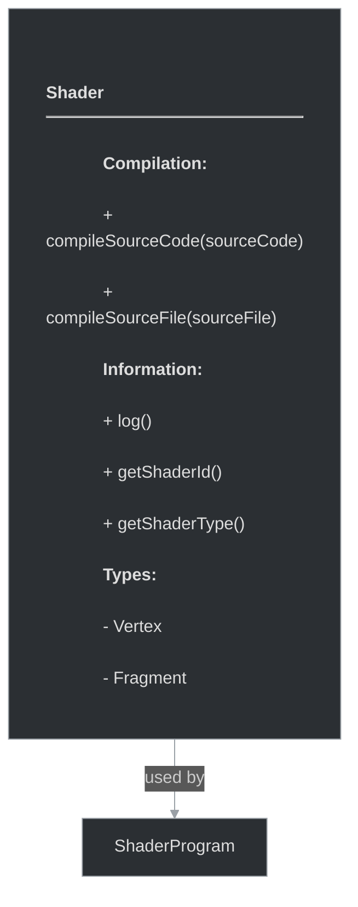

# framework/graphics/shader.h

## Overview

Plik nagłówkowy C++ zawierający definicje dla modułu shader.

## Classes/Structs

### Klasa: `Shader`

| Member | Brief | Signature |
|--------|-------|-----------|
| `compileSourceCode` |  | `bool compileSourceCode(const std::string& sourceCode)` |
| `compileSourceFile` |  | `bool compileSourceFile(const std::string& sourceFile)` |
| `log` |  | `std::string log()` |
| `getShaderId` |  | `uint getShaderId() { return m_shaderId; }` |
| `getShaderType` |  | `ShaderType getShaderType() { return m_shaderType; }` |

## Enums

### `ShaderType`

**Wartości:**

- `Vertex`
- `Fragment`

## Functions

### `compileSourceCode`

**Sygnatura:** `bool compileSourceCode(const std::string& sourceCode)`

### `compileSourceFile`

**Sygnatura:** `bool compileSourceFile(const std::string& sourceFile)`

### `log`

**Sygnatura:** `std::string log()`

### `getShaderId`

**Sygnatura:** `uint getShaderId() { return m_shaderId; }`

### `getShaderType`

**Sygnatura:** `ShaderType getShaderType() { return m_shaderType; }`

## Class Diagram

<!-- mermaid-diagram: generated-by=diagram-agent v1; source_sha=3ead5ec; generated_at=2025-01-27T00:00:00Z -->

<!-- /mermaid-diagram -->
