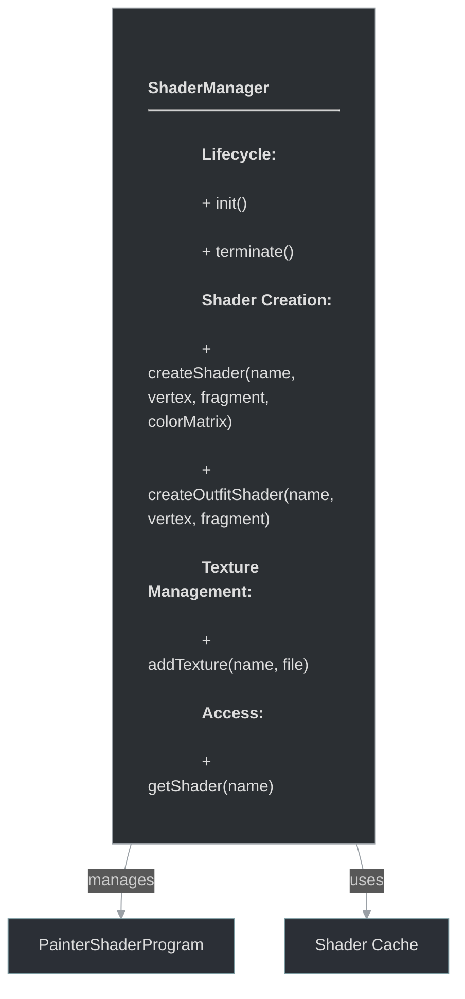
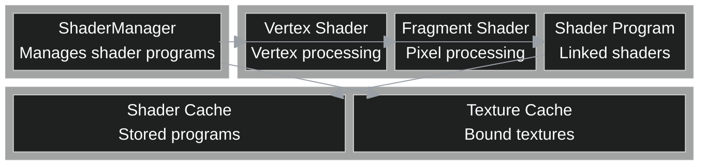

# framework/graphics/shadermanager.h

## Overview

Plik nagłówkowy C++ zawierający definicje dla modułu shadermanager.

## Classes/Structs

### Klasa: `ShaderManager`

| Member | Brief | Signature |
|--------|-------|-----------|
| `init` |  | `void init()` |
| `terminate` |  | `void terminate()` |
| `createShader` |  | `void createShader(const std::string& name, std::string vertex, std::string fragment, bool colorMatrix = false)` |
| `createOutfitShader` |  | `void createOutfitShader(const std::string& name, std::string vertex, std::string fragment)` |
| `createShader` |  | `return createShader(name, vertex, fragment, true)` |
| `addTexture` |  | `void addTexture(const std::string& name, const std::string& file)` |
| `getShader` |  | `PainterShaderProgramPtr getShader(const std::string& name)` |

## Functions

### `init`

**Sygnatura:** `void init()`

### `terminate`

**Sygnatura:** `void terminate()`

### `createShader`

**Sygnatura:** `void createShader(const std::string& name, std::string vertex, std::string fragment, bool colorMatrix = false)`

### `createOutfitShader`

**Sygnatura:** `void createOutfitShader(const std::string& name, std::string vertex, std::string fragment)`

### `createShader`

**Sygnatura:** `return createShader(name, vertex, fragment, true)`

### `addTexture`

**Sygnatura:** `void addTexture(const std::string& name, const std::string& file)`

### `getShader`

**Sygnatura:** `PainterShaderProgramPtr getShader(const std::string& name)`

## Class Diagram

<!-- mermaid-diagram: generated-by=diagram-agent v1; source_sha=3ead5ec; generated_at=2025-01-27T00:00:00Z -->

<!-- /mermaid-diagram -->

## Diagram: Shader System Block Diagram

<!-- mermaid-diagram: generated-by=diagram-agent v1; source_sha=3ead5ec; generated_at=2025-01-27T00:00:00Z -->

<!-- /mermaid-diagram -->
