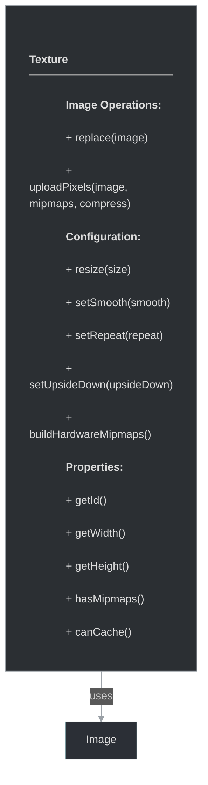

# framework/graphics/texture.h

## Overview

Plik nagłówkowy C++ zawierający definicje dla modułu texture.

## Classes/Structs

### Klasa: `Texture`

| Member | Brief | Signature |
|--------|-------|-----------|
| `replace` |  | `virtual void replace(const ImagePtr& image)` |
| `resize` |  | `void resize(const Size& size)` |
| `update` |  | `virtual void update()` |
| `setUpsideDown` |  | `virtual void setUpsideDown(bool upsideDown)` |
| `setSmooth` |  | `virtual void setSmooth(bool smooth)` |
| `setRepeat` |  | `virtual void setRepeat(bool repeat)` |
| `buildHardwareMipmaps` |  | `virtual bool buildHardwareMipmaps()` |
| `setTime` |  | `void setTime(ticks_t time) { m_time = time; }` |
| `setCanCache` |  | `void setCanCache(bool canCache)` |
| `getId` |  | `uint getId() { return m_id; }` |
| `getUniqueId` |  | `uint getUniqueId() { return m_uniqueId; }` |
| `getTime` |  | `ticks_t getTime() { return m_time; }` |
| `getWidth` |  | `int getWidth() { return m_size.width(); }` |
| `getHeight` |  | `int getHeight() { return m_size.height(); }` |
| `isEmpty` |  | `bool isEmpty() { return false; }` |
| `hasRepeat` |  | `bool hasRepeat() { return m_repeat; }` |
| `hasMipmaps` |  | `bool hasMipmaps() { return m_hasMipmaps; }` |
| `canCache` |  | `bool canCache() { return m_canCache; }` |
| `isAnimatedTexture` |  | `virtual bool isAnimatedTexture() { return false; }` |
| `uploadPixels` |  | `void uploadPixels(const ImagePtr& image, bool buildMipmaps = false, bool compress = false)` |
| `setupSize` |  | `void setupSize(const Size& size)` |
| `setupWrap` |  | `void setupWrap()` |
| `setupFilters` |  | `void setupFilters()` |
| `setupTranformMatrix` |  | `void setupTranformMatrix()` |
| `setupPixels` |  | `void setupPixels(int level, const Size& size, uchar *pixels, int channels = 4, bool compress = false)` |
| `m_id` |  | `uint m_id = 0` |
| `m_uniqueId` |  | `uint m_uniqueId = 0` |
| `m_time` |  | `ticks_t m_time = 0` |
| `m_size` |  | `Size m_size` |
| `m_transformMatrix` |  | `Matrix3 m_transformMatrix` |
| `m_hasMipmaps` |  | `bool m_hasMipmaps = false` |
| `m_smooth` |  | `bool m_smooth = false` |
| `m_upsideDown` |  | `bool m_upsideDown = false` |
| `m_repeat` |  | `bool m_repeat = false` |
| `m_buildHardwareMipmaps` |  | `bool m_buildHardwareMipmaps = false` |
| `m_needsUpdate` |  | `bool m_needsUpdate = false` |
| `m_canCache` |  | `bool m_canCache = true` |
| `m_image` |  | `ImagePtr m_image` |

## Functions

### `resize`

**Sygnatura:** `void resize(const Size& size)`

### `setTime`

**Sygnatura:** `void setTime(ticks_t time) { m_time = time; }`

### `setCanCache`

**Sygnatura:** `void setCanCache(bool canCache)`

### `getId`

**Sygnatura:** `uint getId() { return m_id; }`

### `getUniqueId`

**Sygnatura:** `uint getUniqueId() { return m_uniqueId; }`

### `getTime`

**Sygnatura:** `ticks_t getTime() { return m_time; }`

### `getWidth`

**Sygnatura:** `int getWidth() { return m_size.width(); }`

### `getHeight`

**Sygnatura:** `int getHeight() { return m_size.height(); }`

### `isEmpty`

**Sygnatura:** `bool isEmpty() { return false; }`

### `hasRepeat`

**Sygnatura:** `bool hasRepeat() { return m_repeat; }`

### `hasMipmaps`

**Sygnatura:** `bool hasMipmaps() { return m_hasMipmaps; }`

### `canCache`

**Sygnatura:** `bool canCache() { return m_canCache; }`

### `uploadPixels`

**Sygnatura:** `void uploadPixels(const ImagePtr& image, bool buildMipmaps = false, bool compress = false)`

### `setupSize`

**Sygnatura:** `void setupSize(const Size& size)`

### `setupWrap`

**Sygnatura:** `void setupWrap()`

### `setupFilters`

**Sygnatura:** `void setupFilters()`

### `setupTranformMatrix`

**Sygnatura:** `void setupTranformMatrix()`

### `setupPixels`

**Sygnatura:** `void setupPixels(int level, const Size& size, uchar *pixels, int channels = 4, bool compress = false)`

## Class Diagram

<!-- mermaid-diagram: generated-by=diagram-agent v1; source_sha=3ead5ec; generated_at=2025-01-27T00:00:00Z -->

<!-- /mermaid-diagram -->
