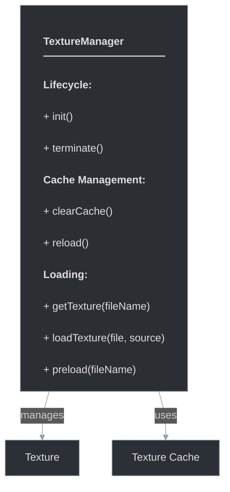

# framework/graphics/texturemanager.h

## Overview

Plik nagłówkowy C++ zawierający definicje dla modułu texturemanager.

## Classes/Structs

### Klasa: `TextureManager`

| Member | Brief | Signature |
|--------|-------|-----------|
| `init` |  | `void init()` |
| `terminate` |  | `void terminate()` |
| `clearCache` |  | `void clearCache()` |
| `reload` |  | `void reload()` |
| `preload` |  | `void preload(const std::string& fileName) { getTexture(fileName); }` |
| `getTexture` |  | `TexturePtr getTexture(const std::string& fileName)` |
| `loadTexture` |  | `TexturePtr loadTexture(std::stringstream& file, const std::string& source)` |

## Functions

### `init`

**Sygnatura:** `void init()`

### `terminate`

**Sygnatura:** `void terminate()`

### `clearCache`

**Sygnatura:** `void clearCache()`

### `reload`

**Sygnatura:** `void reload()`

### `preload`

**Sygnatura:** `void preload(const std::string& fileName) { getTexture(fileName); }`

### `getTexture`

**Sygnatura:** `TexturePtr getTexture(const std::string& fileName)`

### `loadTexture`

**Sygnatura:** `TexturePtr loadTexture(std::stringstream& file, const std::string& source)`

## Class Diagram

<!-- mermaid-diagram: generated-by=diagram-agent v1; source_sha=3ead5ec; generated_at=2025-01-27T00:00:00Z -->

<!-- /mermaid-diagram -->
