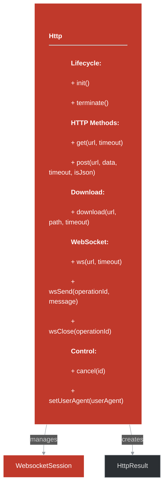
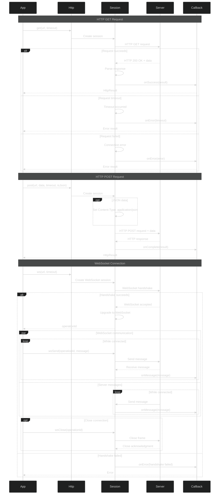

# framework/http/http.h

## Overview

Plik nagłówkowy C++ zawierający definicje dla modułu http.

## Classes/Structs

### Klasa: `WebsocketSession`

| Member | Brief | Signature |
|--------|-------|-----------|
| `init` |  | `void init()` |
| `terminate` |  | `void terminate()` |
| `get` |  | `int get(const std::string& url, int timeout = 5)` |
| `post` |  | `int post(const std::string& url, const std::string& data, int timeout = 5, bool isJson = false)` |
| `download` |  | `int download(const std::string& url, std::string path, int timeout = 5)` |
| `ws` |  | `int ws(const std::string& url, int timeout = 5)` |
| `wsSend` |  | `bool wsSend(int operationId, std::string message)` |
| `wsClose` |  | `bool wsClose(int operationId)` |
| `cancel` |  | `bool cancel(int id)` |
| `m_downloads` |  | `return m_downloads` |
| `clearDownloads` |  | `void clearDownloads() {` |
| `getFile` |  | `HttpResult_ptr getFile(std::string path) {` |
| `it` |  | `auto it = m_downloads.find(path)` |
| `nullptr` |  | `return nullptr` |
| `setUserAgent` |  | `void setUserAgent(const std::string& userAgent)` |

### Klasa: `Http`

## Functions

### `init`

**Sygnatura:** `void init()`

### `terminate`

**Sygnatura:** `void terminate()`

### `get`

**Sygnatura:** `int get(const std::string& url, int timeout = 5)`

### `post`

**Sygnatura:** `int post(const std::string& url, const std::string& data, int timeout = 5, bool isJson = false)`

### `download`

**Sygnatura:** `int download(const std::string& url, std::string path, int timeout = 5)`

### `ws`

**Sygnatura:** `int ws(const std::string& url, int timeout = 5)`

### `wsSend`

**Sygnatura:** `bool wsSend(int operationId, std::string message)`

### `wsClose`

**Sygnatura:** `bool wsClose(int operationId)`

### `cancel`

**Sygnatura:** `bool cancel(int id)`

### `clearDownloads`

**Sygnatura:** `void clearDownloads() {`

### `getFile`

**Sygnatura:** `HttpResult_ptr getFile(std::string path) {`

### `setUserAgent`

**Sygnatura:** `void setUserAgent(const std::string& userAgent)`

## Class Diagram

<!-- mermaid-diagram: generated-by=diagram-agent v1; source_sha=3ead5ec; generated_at=2025-01-27T00:00:00Z -->

<!-- /mermaid-diagram -->

## Diagram: HTTP Request Flow (Advanced Sequence)

<!-- mermaid-diagram: generated-by=diagram-agent v1; source_sha=3ead5ec; generated_at=2025-01-27T00:00:00Z -->

<!-- /mermaid-diagram -->
