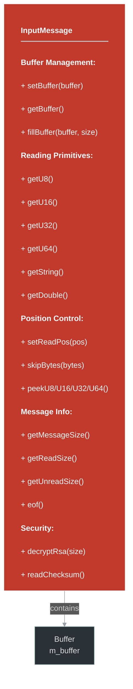

# framework/net/inputmessage.h

## Overview

Plik nagłówkowy C++ zawierający definicje dla modułu inputmessage.

## Classes/Structs

### Klasa: `InputMessage`

| Member | Brief | Signature |
|--------|-------|-----------|
| `setBuffer` |  | `void setBuffer(const std::string& buffer)` |
| `getBuffer` |  | `std::string getBuffer() { return std::string((char*)m_buffer + m_headerPos, m_messageSize); }` |
| `getBodyBuffer` |  | `std::string getBodyBuffer() { return std::string((char*)m_buffer + MAX_HEADER_SIZE, m_messageSize - getHeaderSize()); }` |
| `skipBytes` |  | `void skipBytes(uint32 bytes) { m_readPos += bytes; }` |
| `setReadPos` |  | `void setReadPos(uint32 readPos) { m_readPos = readPos; }` |
| `getU8` |  | `uint8 getU8()` |
| `getU16` |  | `uint16 getU16()` |
| `getU32` |  | `uint32 getU32()` |
| `getU64` |  | `uint64 getU64()` |
| `getString` |  | `std::string getString()` |
| `getDouble` |  | `double getDouble()` |
| `peekU8` |  | `uint8 peekU8() { uint8 v = getU8(); m_readPos-=1; return v; }` |
| `peekU16` |  | `uint16 peekU16() { uint16 v = getU16(); m_readPos-=2; return v; }` |
| `peekU32` |  | `uint32 peekU32() { uint32 v = getU32(); m_readPos-=4; return v; }` |
| `peekU64` |  | `uint64 peekU64() { uint64 v = getU64(); m_readPos-=8; return v; }` |
| `decryptRsa` |  | `bool decryptRsa(int size)` |
| `getHeaderPos` |  | `uint32 getHeaderPos() { return m_headerPos; }` |
| `getHeaderSize` |  | `uint32 getHeaderSize() { return (MAX_HEADER_SIZE - m_headerPos); }` |
| `getReadSize` |  | `int getReadSize() { return m_readPos - m_headerPos; }` |
| `getReadPos` |  | `int getReadPos() { return m_readPos; }` |
| `getUnreadSize` |  | `int getUnreadSize() { return m_messageSize - (m_readPos - m_headerPos); }` |
| `getMessageSize` |  | `uint32 getMessageSize() { return m_messageSize; }` |
| `eof` |  | `bool eof() { return (m_readPos - m_headerPos) >= m_messageSize; }` |
| `reset` |  | `void reset()` |
| `fillBuffer` |  | `void fillBuffer(uint8 *buffer, uint32 size)` |
| `setHeaderSize` |  | `void setHeaderSize(uint32 size)` |
| `setMessageSize` |  | `void setMessageSize(uint32 size) { m_messageSize = size; }` |
| `readSize` |  | `uint32 readSize(bool bigSize) { return bigSize ? getU32() : getU16(); }` |
| `readChecksum` |  | `bool readChecksum()` |
| `addZlibFooter` |  | `void addZlibFooter()` |

## Functions

### `setBuffer`

**Sygnatura:** `void setBuffer(const std::string& buffer)`

### `getBuffer`

**Sygnatura:** `std::string getBuffer() { return std::string((char*)m_buffer + m_headerPos, m_messageSize); }`

### `getBodyBuffer`

**Sygnatura:** `std::string getBodyBuffer() { return std::string((char*)m_buffer + MAX_HEADER_SIZE, m_messageSize - getHeaderSize()); }`

### `skipBytes`

**Sygnatura:** `void skipBytes(uint32 bytes) { m_readPos += bytes; }`

### `setReadPos`

**Sygnatura:** `void setReadPos(uint32 readPos) { m_readPos = readPos; }`

### `getU8`

**Sygnatura:** `uint8 getU8()`

### `getU16`

**Sygnatura:** `uint16 getU16()`

### `getU32`

**Sygnatura:** `uint32 getU32()`

### `getU64`

**Sygnatura:** `uint64 getU64()`

### `getString`

**Sygnatura:** `std::string getString()`

### `getDouble`

**Sygnatura:** `double getDouble()`

### `peekU8`

**Sygnatura:** `uint8 peekU8() { uint8 v = getU8(); m_readPos-=1; return v; }`

### `peekU16`

**Sygnatura:** `uint16 peekU16() { uint16 v = getU16(); m_readPos-=2; return v; }`

### `peekU32`

**Sygnatura:** `uint32 peekU32() { uint32 v = getU32(); m_readPos-=4; return v; }`

### `peekU64`

**Sygnatura:** `uint64 peekU64() { uint64 v = getU64(); m_readPos-=8; return v; }`

### `decryptRsa`

**Sygnatura:** `bool decryptRsa(int size)`

### `getHeaderPos`

**Sygnatura:** `uint32 getHeaderPos() { return m_headerPos; }`

### `getHeaderSize`

**Sygnatura:** `uint32 getHeaderSize() { return (MAX_HEADER_SIZE - m_headerPos); }`

### `getReadSize`

**Sygnatura:** `int getReadSize() { return m_readPos - m_headerPos; }`

### `getReadPos`

**Sygnatura:** `int getReadPos() { return m_readPos; }`

### `getUnreadSize`

**Sygnatura:** `int getUnreadSize() { return m_messageSize - (m_readPos - m_headerPos); }`

### `getMessageSize`

**Sygnatura:** `uint32 getMessageSize() { return m_messageSize; }`

### `eof`

**Sygnatura:** `bool eof() { return (m_readPos - m_headerPos) >= m_messageSize; }`

### `reset`

**Sygnatura:** `void reset()`

### `fillBuffer`

**Sygnatura:** `void fillBuffer(uint8 *buffer, uint32 size)`

### `setHeaderSize`

**Sygnatura:** `void setHeaderSize(uint32 size)`

### `setMessageSize`

**Sygnatura:** `void setMessageSize(uint32 size) { m_messageSize = size; }`

### `readSize`

**Sygnatura:** `uint32 readSize(bool bigSize) { return bigSize ? getU32() : getU16(); }`

### `readChecksum`

**Sygnatura:** `bool readChecksum()`

### `addZlibFooter`

**Sygnatura:** `void addZlibFooter()`

### `canRead`

**Sygnatura:** `bool canRead(int bytes)`

### `checkRead`

**Sygnatura:** `void checkRead(int bytes)`

### `checkWrite`

**Sygnatura:** `void checkWrite(int bytes)`

## Class Diagram

<!-- mermaid-diagram: generated-by=diagram-agent v1; source_sha=3ead5ec; generated_at=2025-01-27T00:00:00Z -->

<!-- /mermaid-diagram -->

## Diagram: InputMessage Packet Structure

<!-- mermaid-diagram: generated-by=diagram-agent v1; source_sha=3ead5ec; generated_at=2025-01-27T00:00:00Z -->

<!-- /mermaid-diagram -->
