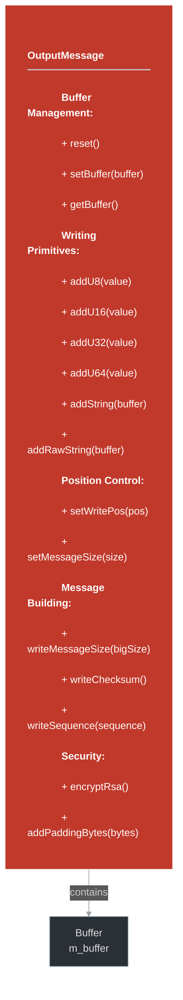

# framework/net/outputmessage.h

## Overview

Plik nagłówkowy C++ zawierający definicje dla modułu outputmessage.

## Classes/Structs

### Klasa: `OutputMessage`

| Member | Brief | Signature |
|--------|-------|-----------|
| `reset` |  | `void reset()` |
| `setBuffer` |  | `void setBuffer(const std::string& buffer)` |
| `getBuffer` |  | `std::string getBuffer() { return std::string((char*)m_buffer + m_headerPos, m_messageSize); }` |
| `addU8` |  | `void addU8(uint8 value)` |
| `addU16` |  | `void addU16(uint16 value)` |
| `addU32` |  | `void addU32(uint32 value)` |
| `addU64` |  | `void addU64(uint64 value)` |
| `addString` |  | `void addString(const std::string& buffer)` |
| `addRawString` |  | `void addRawString(const std::string& buffer)` |
| `addPaddingBytes` |  | `void addPaddingBytes(int bytes, uint8 byte = 0)` |
| `encryptRsa` |  | `void encryptRsa()` |
| `getWritePos` |  | `uint32 getWritePos() { return m_writePos; }` |
| `getMessageSize` |  | `uint32 getMessageSize() { return m_messageSize; }` |
| `setWritePos` |  | `void setWritePos(uint32 writePos) { m_writePos = writePos; }` |
| `setMessageSize` |  | `void setMessageSize(uint32 messageSize) { m_messageSize = messageSize; }` |
| `writeChecksum` |  | `void writeChecksum()` |
| `writeSequence` |  | `void writeSequence(uint32_t sequence)` |
| `writeMessageSize` |  | `void writeMessageSize(bool bigSize)` |

## Functions

### `reset`

**Sygnatura:** `void reset()`

### `setBuffer`

**Sygnatura:** `void setBuffer(const std::string& buffer)`

### `getBuffer`

**Sygnatura:** `std::string getBuffer() { return std::string((char*)m_buffer + m_headerPos, m_messageSize); }`

### `addU8`

**Sygnatura:** `void addU8(uint8 value)`

### `addU16`

**Sygnatura:** `void addU16(uint16 value)`

### `addU32`

**Sygnatura:** `void addU32(uint32 value)`

### `addU64`

**Sygnatura:** `void addU64(uint64 value)`

### `addString`

**Sygnatura:** `void addString(const std::string& buffer)`

### `addRawString`

**Sygnatura:** `void addRawString(const std::string& buffer)`

### `addPaddingBytes`

**Sygnatura:** `void addPaddingBytes(int bytes, uint8 byte = 0)`

### `encryptRsa`

**Sygnatura:** `void encryptRsa()`

### `getWritePos`

**Sygnatura:** `uint32 getWritePos() { return m_writePos; }`

### `getMessageSize`

**Sygnatura:** `uint32 getMessageSize() { return m_messageSize; }`

### `setWritePos`

**Sygnatura:** `void setWritePos(uint32 writePos) { m_writePos = writePos; }`

### `setMessageSize`

**Sygnatura:** `void setMessageSize(uint32 messageSize) { m_messageSize = messageSize; }`

### `writeChecksum`

**Sygnatura:** `void writeChecksum()`

### `writeSequence`

**Sygnatura:** `void writeSequence(uint32_t sequence)`

### `writeMessageSize`

**Sygnatura:** `void writeMessageSize(bool bigSize)`

### `canWrite`

**Sygnatura:** `bool canWrite(int bytes)`

### `checkWrite`

**Sygnatura:** `void checkWrite(int bytes)`

## Class Diagram

<!-- mermaid-diagram: generated-by=diagram-agent v1; source_sha=3ead5ec; generated_at=2025-01-27T00:00:00Z -->

<!-- /mermaid-diagram -->

## Diagram: OutputMessage Packet Structure

<!-- mermaid-diagram: generated-by=diagram-agent v1; source_sha=3ead5ec; generated_at=2025-01-27T00:00:00Z -->

<!-- /mermaid-diagram -->

## Diagram: Message Serialization Flow

<!-- mermaid-diagram: generated-by=diagram-agent v1; source_sha=3ead5ec; generated_at=2025-01-27T00:00:00Z -->

<!-- /mermaid-diagram -->
