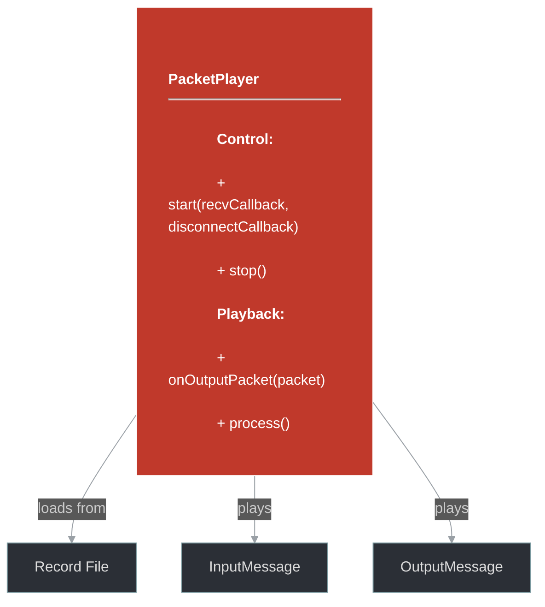
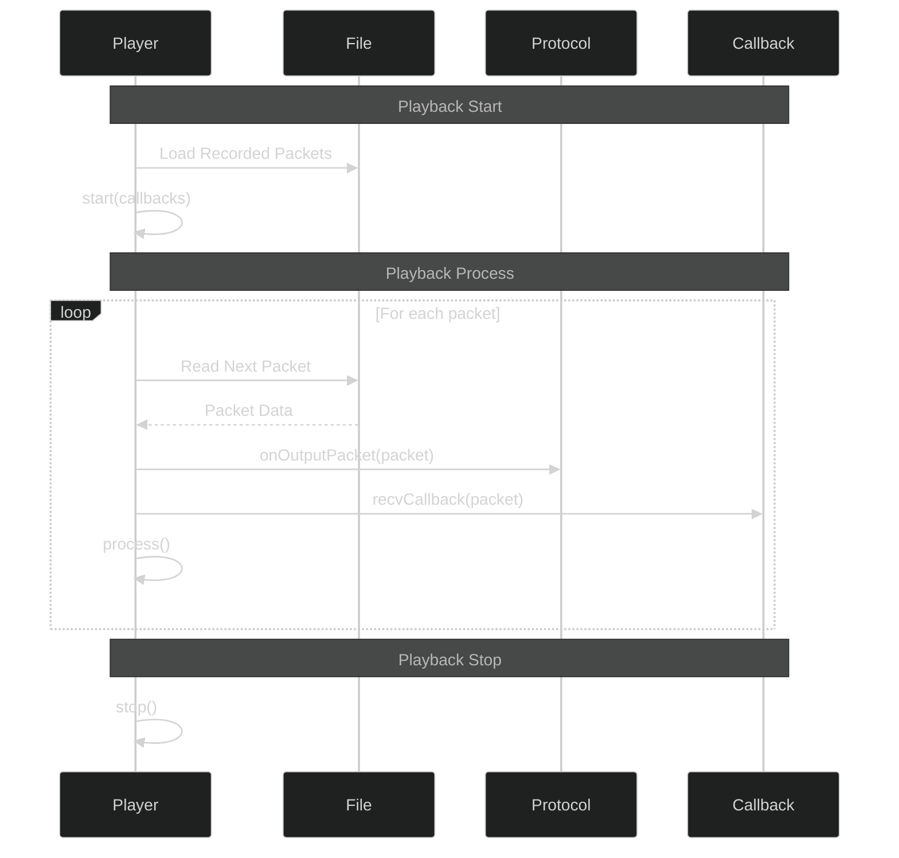

# framework/net/packet_player.h

## Overview

Plik nagłówkowy C++ zawierający definicje dla modułu packet_player.

## Classes/Structs

### Klasa: `PacketPlayer`

## Functions

### `start`

**Sygnatura:** `void start(std::function<void(std::shared_ptr<std::vector<uint8_t>>)> recvCallback, std::function<void(boost::system::error_code)> disconnectCallback)`

### `stop`

**Sygnatura:** `void stop()`

### `onOutputPacket`

**Sygnatura:** `void onOutputPacket(const OutputMessagePtr& packet)`

### `process`

**Sygnatura:** `void process()`

## Class Diagram

<!-- mermaid-diagram: generated-by=diagram-agent v1; source_sha=3ead5ec; generated_at=2025-01-27T00:00:00Z -->

<!-- /mermaid-diagram -->

## Diagram: Packet Playback Flow

<!-- mermaid-diagram: generated-by=diagram-agent v1; source_sha=3ead5ec; generated_at=2025-01-27T00:00:00Z -->

<!-- /mermaid-diagram -->
