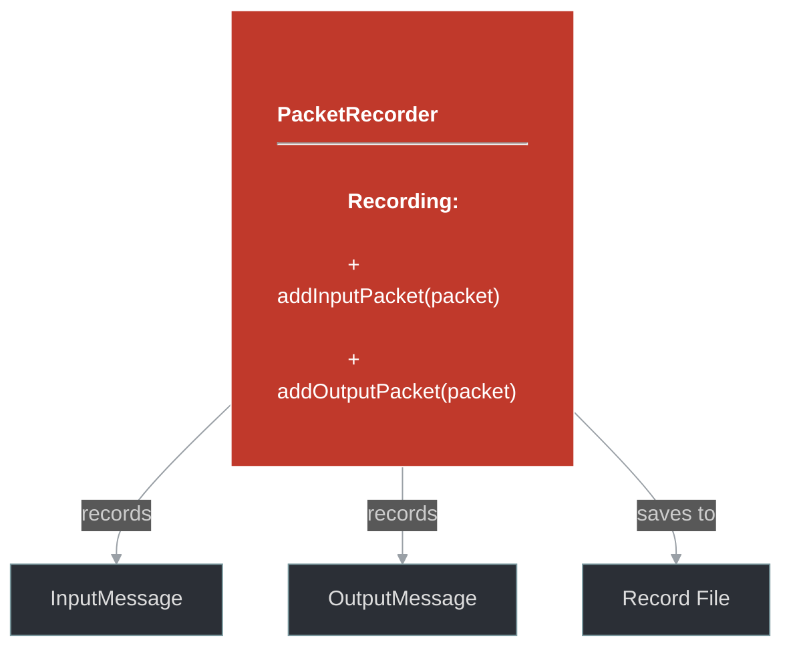
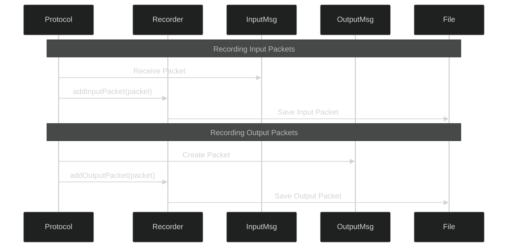

# framework/net/packet_recorder.h

## Overview

Plik nagłówkowy C++ zawierający definicje dla modułu packet_recorder.

## Classes/Structs

### Klasa: `PacketRecorder`

## Functions

### `addInputPacket`

**Sygnatura:** `void addInputPacket(const InputMessagePtr& packet)`

### `addOutputPacket`

**Sygnatura:** `void addOutputPacket(const OutputMessagePtr& packet)`

## Class Diagram

<!-- mermaid-diagram: generated-by=diagram-agent v1; source_sha=3ead5ec; generated_at=2025-01-27T00:00:00Z -->

<!-- /mermaid-diagram -->

## Diagram: Packet Recording Flow

<!-- mermaid-diagram: generated-by=diagram-agent v1; source_sha=3ead5ec; generated_at=2025-01-27T00:00:00Z -->

<!-- /mermaid-diagram -->
