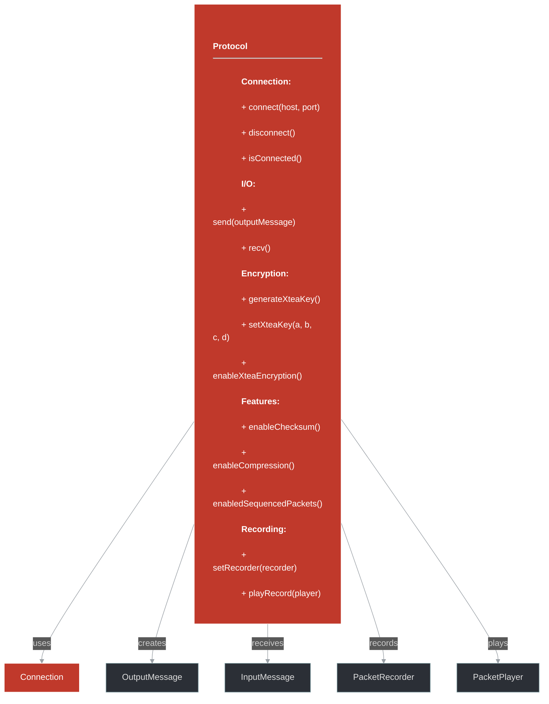
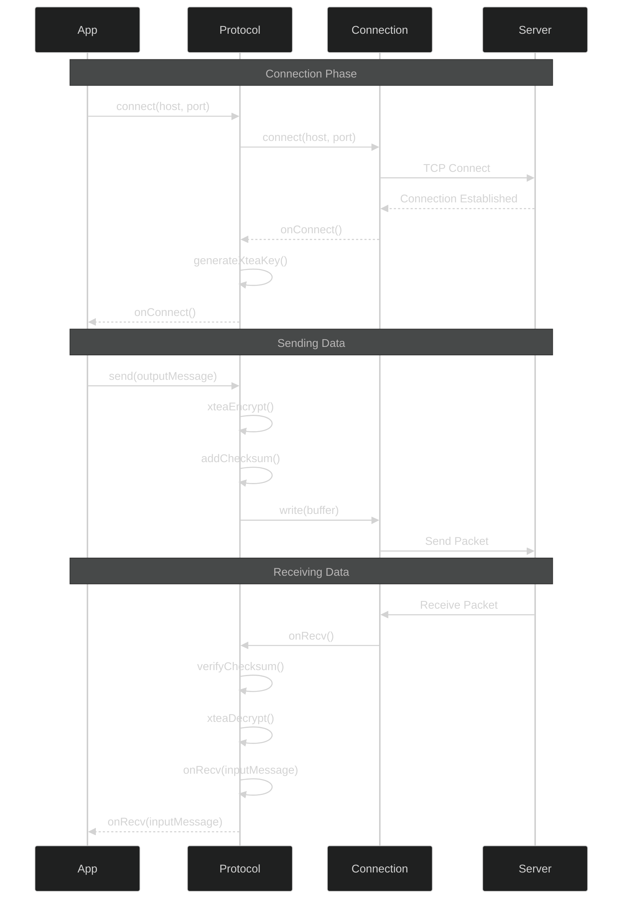

# framework/net/protocol.h

## Overview

Plik nagłówkowy C++ zawierający definicje dla modułu protocol.

## Classes/Structs

### Klasa: `Protocol`

| Member | Brief | Signature |
|--------|-------|-----------|
| `connect` |  | `void connect(const std::string& host, uint16 port)` |
| `disconnect` |  | `void disconnect()` |
| `setRecorder` |  | `void setRecorder(PacketRecorderPtr recorder)` |
| `playRecord` |  | `void playRecord(PacketPlayerPtr player)` |
| `isConnected` |  | `bool isConnected()` |
| `isConnecting` |  | `bool isConnecting()` |
| `getElapsedTicksSinceLastRead` |  | `ticks_t getElapsedTicksSinceLastRead() { return m_connection ? m_connection->getElapsedTicksSinceLastRead() : -1; }` |
| `getConnection` |  | `ConnectionPtr getConnection() { return m_connection; }` |
| `setConnection` |  | `void setConnection(const ConnectionPtr& connection) { m_connection = connection; }` |
| `generateXteaKey` |  | `void generateXteaKey()` |
| `setXteaKey` |  | `void setXteaKey(uint32 a, uint32 b, uint32 c, uint32 d)` |
| `getXteaKey` |  | `std::vector<uint32> getXteaKey()` |
| `enableXteaEncryption` |  | `void enableXteaEncryption() { m_xteaEncryptionEnabled = true; }` |
| `enableChecksum` |  | `void enableChecksum() { m_checksumEnabled = true; }` |
| `enabledSequencedPackets` |  | `void enabledSequencedPackets() { m_sequencedPackets = true; }` |
| `enableBigPackets` |  | `void enableBigPackets() { m_bigPackets = true; }` |
| `enableCompression` |  | `void enableCompression() { m_compression = true; }` |
| `send` |  | `virtual void send(const OutputMessagePtr& outputMessage, bool rawPacket = false)` |
| `recv` |  | `virtual void recv()` |
| `asProtocol` |  | `ProtocolPtr asProtocol() { return static_self_cast<Protocol>(); }` |
| `onConnect` |  | `virtual void onConnect()` |
| `onRecv` |  | `virtual void onRecv(const InputMessagePtr& inputMessage)` |
| `onError` |  | `virtual void onError(const boost::system::error_code& err)` |
| `onProxyPacket` |  | `void onProxyPacket(const std::shared_ptr<std::vector<uint8_t>>& packet)` |
| `onPlayerPacket` |  | `void onPlayerPacket(const std::shared_ptr<std::vector<uint8_t>>& packet)` |
| `onLocalDisconnected` |  | `void onLocalDisconnected(boost::system::error_code ec)` |
| `m_disconnected` |  | `bool m_disconnected = false` |
| `m_proxy` |  | `uint32_t m_proxy = 0` |
| `m_packetNumber` |  | `uint32 m_packetNumber` |
| `m_player` |  | `PacketPlayerPtr m_player` |
| `m_recorder` |  | `PacketRecorderPtr m_recorder` |

## Functions

### `connect`

**Sygnatura:** `void connect(const std::string& host, uint16 port)`

### `disconnect`

**Sygnatura:** `void disconnect()`

### `setRecorder`

**Sygnatura:** `void setRecorder(PacketRecorderPtr recorder)`

### `playRecord`

**Sygnatura:** `void playRecord(PacketPlayerPtr player)`

### `isConnected`

**Sygnatura:** `bool isConnected()`

### `isConnecting`

**Sygnatura:** `bool isConnecting()`

### `getElapsedTicksSinceLastRead`

**Sygnatura:** `ticks_t getElapsedTicksSinceLastRead() { return m_connection ? m_connection->getElapsedTicksSinceLastRead() : -1; }`

### `getConnection`

**Sygnatura:** `ConnectionPtr getConnection() { return m_connection; }`

### `setConnection`

**Sygnatura:** `void setConnection(const ConnectionPtr& connection) { m_connection = connection; }`

### `generateXteaKey`

**Sygnatura:** `void generateXteaKey()`

### `setXteaKey`

**Sygnatura:** `void setXteaKey(uint32 a, uint32 b, uint32 c, uint32 d)`

### `getXteaKey`

**Sygnatura:** `std::vector<uint32> getXteaKey()`

### `enableXteaEncryption`

**Sygnatura:** `void enableXteaEncryption() { m_xteaEncryptionEnabled = true; }`

### `enableChecksum`

**Sygnatura:** `void enableChecksum() { m_checksumEnabled = true; }`

### `enabledSequencedPackets`

**Sygnatura:** `void enabledSequencedPackets() { m_sequencedPackets = true; }`

### `enableBigPackets`

**Sygnatura:** `void enableBigPackets() { m_bigPackets = true; }`

### `enableCompression`

**Sygnatura:** `void enableCompression() { m_compression = true; }`

### `asProtocol`

**Sygnatura:** `ProtocolPtr asProtocol() { return static_self_cast<Protocol>(); }`

### `onProxyPacket`

**Sygnatura:** `void onProxyPacket(const std::shared_ptr<std::vector<uint8_t>>& packet)`

### `onPlayerPacket`

**Sygnatura:** `void onPlayerPacket(const std::shared_ptr<std::vector<uint8_t>>& packet)`

### `onLocalDisconnected`

**Sygnatura:** `void onLocalDisconnected(boost::system::error_code ec)`

### `internalRecvHeader`

**Sygnatura:** `void internalRecvHeader(uint8* buffer, uint32 size)`

### `internalRecvData`

**Sygnatura:** `void internalRecvData(uint8* buffer, uint32 size)`

### `xteaDecrypt`

**Sygnatura:** `bool xteaDecrypt(const InputMessagePtr& inputMessage)`

### `xteaEncrypt`

**Sygnatura:** `void xteaEncrypt(const OutputMessagePtr& outputMessage)`

## Class Diagram

<!-- mermaid-diagram: generated-by=diagram-agent v1; source_sha=3ead5ec; generated_at=2025-01-27T00:00:00Z -->

<!-- /mermaid-diagram -->

## Diagram: Protocol Communication Flow

<!-- mermaid-diagram: generated-by=diagram-agent v1; source_sha=3ead5ec; generated_at=2025-01-27T00:00:00Z -->

<!-- /mermaid-diagram -->
