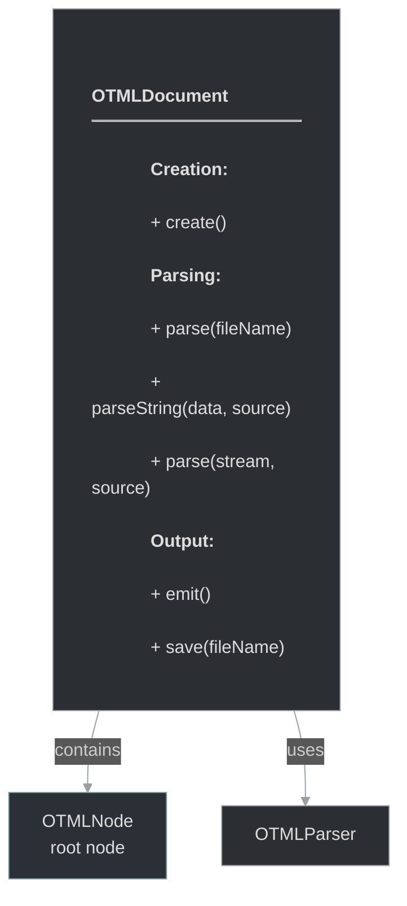

# framework/otml/otmldocument.h

## Overview

Plik nagłówkowy C++ zawierający definicje dla modułu otmldocument.

## Classes/Structs

### Klasa: `OTMLDocument`

| Member | Brief | Signature |
|--------|-------|-----------|
| `create` | Create a new OTML document for filling it with nodes | `static OTMLDocumentPtr create()` |
| `parse` | Parse OTML from a file | `static OTMLDocumentPtr parse(const std::string& fileName)` |
| `parseString` | Parse OTML from a string | `static OTMLDocumentPtr parseString(const std::string& data, const std::string& source)` |
| `parse` | Parse OTML from input stream @param source is the file name that will be used to show errors message | `static OTMLDocumentPtr parse(std::istream& in, const std::string& source)` |
| `emit` | Emits this document and all it's children to a std::string | `std::string emit()` |
| `save` | Save this document to a file | `bool save(const std::string& fileName)` |

## Functions

### `create`

Create a new OTML document for filling it with nodes

**Sygnatura:** `static OTMLDocumentPtr create()`

### `parse`

Parse OTML from a file

**Sygnatura:** `static OTMLDocumentPtr parse(const std::string& fileName)`

### `parseString`

Parse OTML from a string

**Sygnatura:** `static OTMLDocumentPtr parseString(const std::string& data, const std::string& source)`

### `parse`

Parse OTML from input stream @param source is the file name that will be used to show errors messages

**Sygnatura:** `static OTMLDocumentPtr parse(std::istream& in, const std::string& source)`

### `emit`

Emits this document and all it's children to a std::string

**Sygnatura:** `std::string emit()`

### `save`

Save this document to a file

**Sygnatura:** `bool save(const std::string& fileName)`

## Class Diagram

<!-- mermaid-diagram: generated-by=diagram-agent v1; source_sha=3ead5ec; generated_at=2025-01-27T00:00:00Z -->

<!-- /mermaid-diagram -->
