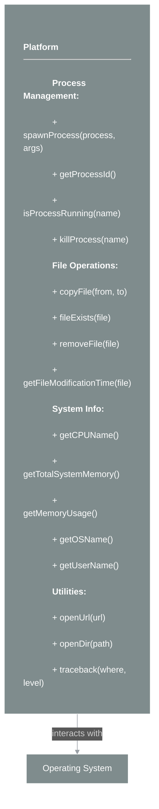
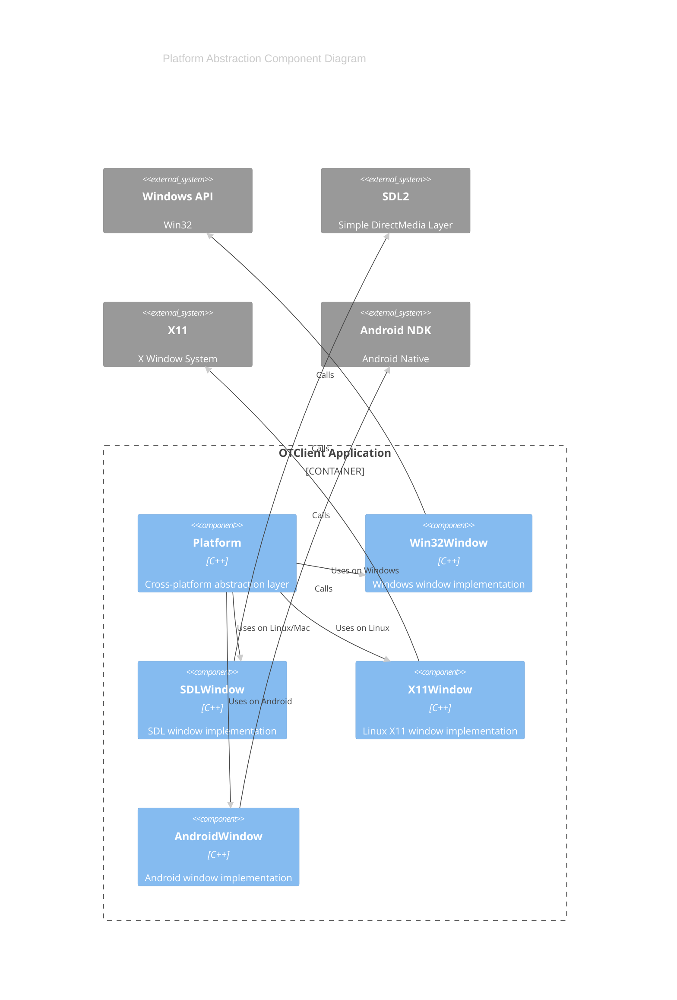

# framework/platform/platform.h

## Overview

Plik nagłówkowy C++ zawierający definicje dla modułu platform.

## Classes/Structs

### Klasa: `Platform`

| Member | Brief | Signature |
|--------|-------|-----------|
| `processArgs` |  | `void processArgs(std::vector<std::string>& args)` |
| `spawnProcess` |  | `bool spawnProcess(std::string process, const std::vector<std::string>& args)` |
| `getProcessId` |  | `int getProcessId()` |
| `isProcessRunning` |  | `bool isProcessRunning(const std::string& name)` |
| `killProcess` |  | `bool killProcess(const std::string& name)` |
| `getTempPath` |  | `std::string getTempPath()` |
| `getCurrentDir` |  | `std::string getCurrentDir()` |
| `copyFile` |  | `bool copyFile(std::string from, std::string to)` |
| `fileExists` |  | `bool fileExists(std::string file)` |
| `removeFile` |  | `bool removeFile(std::string file)` |
| `getFileModificationTime` |  | `ticks_t getFileModificationTime(std::string file)` |
| `openUrl` |  | `bool openUrl(std::string url, bool now = false)` |
| `openDir` |  | `bool openDir(std::string path, bool now = false)` |
| `getCPUName` |  | `std::string getCPUName()` |
| `getTotalSystemMemory` |  | `double getTotalSystemMemory()` |
| `getMemoryUsage` |  | `double getMemoryUsage()` |
| `getOSName` |  | `std::string getOSName()` |
| `traceback` |  | `std::string traceback(const std::string& where, int level = 1, int maxDepth = 32)` |
| `getMacAddresses` |  | `std::vector<std::string> getMacAddresses()` |
| `getUserName` |  | `std::string getUserName()` |
| `getDlls` |  | `std::vector<std::string> getDlls()` |
| `getProcesses` |  | `std::vector<std::string> getProcesses()` |
| `getWindows` |  | `std::vector<std::string> getWindows()` |

## Functions

### `processArgs`

**Sygnatura:** `void processArgs(std::vector<std::string>& args)`

### `spawnProcess`

**Sygnatura:** `bool spawnProcess(std::string process, const std::vector<std::string>& args)`

### `getProcessId`

**Sygnatura:** `int getProcessId()`

### `isProcessRunning`

**Sygnatura:** `bool isProcessRunning(const std::string& name)`

### `killProcess`

**Sygnatura:** `bool killProcess(const std::string& name)`

### `getTempPath`

**Sygnatura:** `std::string getTempPath()`

### `getCurrentDir`

**Sygnatura:** `std::string getCurrentDir()`

### `copyFile`

**Sygnatura:** `bool copyFile(std::string from, std::string to)`

### `fileExists`

**Sygnatura:** `bool fileExists(std::string file)`

### `removeFile`

**Sygnatura:** `bool removeFile(std::string file)`

### `getFileModificationTime`

**Sygnatura:** `ticks_t getFileModificationTime(std::string file)`

### `openUrl`

**Sygnatura:** `bool openUrl(std::string url, bool now = false)`

### `openDir`

**Sygnatura:** `bool openDir(std::string path, bool now = false)`

### `getCPUName`

**Sygnatura:** `std::string getCPUName()`

### `getTotalSystemMemory`

**Sygnatura:** `double getTotalSystemMemory()`

### `getMemoryUsage`

**Sygnatura:** `double getMemoryUsage()`

### `getOSName`

**Sygnatura:** `std::string getOSName()`

### `traceback`

**Sygnatura:** `std::string traceback(const std::string& where, int level = 1, int maxDepth = 32)`

### `getMacAddresses`

**Sygnatura:** `std::vector<std::string> getMacAddresses()`

### `getUserName`

**Sygnatura:** `std::string getUserName()`

### `getDlls`

**Sygnatura:** `std::vector<std::string> getDlls()`

### `getProcesses`

**Sygnatura:** `std::vector<std::string> getProcesses()`

### `getWindows`

**Sygnatura:** `std::vector<std::string> getWindows()`

## Class Diagram

<!-- mermaid-diagram: generated-by=diagram-agent v1; source_sha=3ead5ec; generated_at=2025-01-27T00:00:00Z -->

<!-- /mermaid-diagram -->

## Diagram: Platform Abstraction Architecture (C4 Component)

<!-- mermaid-diagram: generated-by=diagram-agent v1; source_sha=3ead5ec; generated_at=2025-01-27T00:00:00Z -->

<!-- /mermaid-diagram -->
