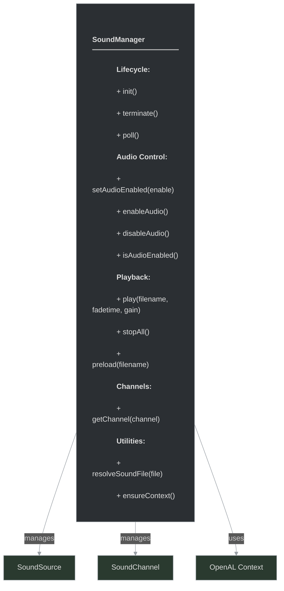
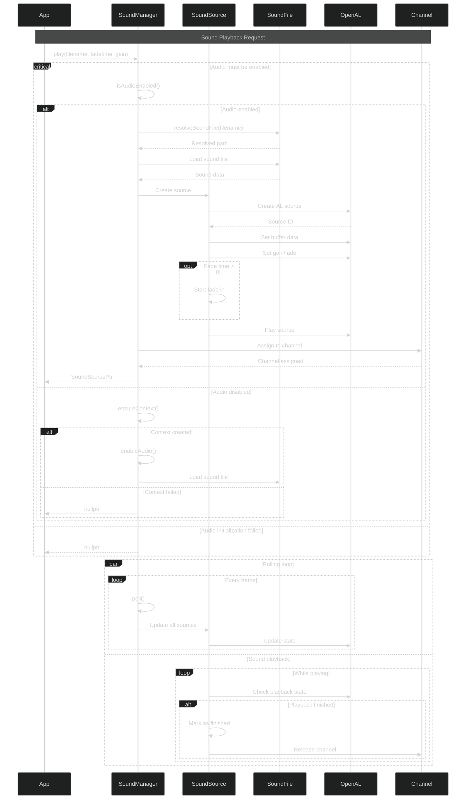

# framework/sound/soundmanager.h

## Overview

Plik nagłówkowy C++ zawierający definicje dla modułu soundmanager.

## Classes/Structs

### Klasa: `SoundManager`

| Member | Brief | Signature |
|--------|-------|-----------|
| `init` |  | `void init()` |
| `terminate` |  | `void terminate()` |
| `poll` |  | `void poll()` |
| `setAudioEnabled` |  | `void setAudioEnabled(bool enable)` |
| `isAudioEnabled` |  | `bool isAudioEnabled() { return m_device && m_context && m_audioEnabled ; }` |
| `enableAudio` |  | `void enableAudio() { setAudioEnabled(true); }` |
| `disableAudio` |  | `void disableAudio() { setAudioEnabled(true); }` |
| `stopAll` |  | `void stopAll()` |
| `preload` |  | `void preload(std::string filename)` |
| `play` |  | `SoundSourcePtr play(std::string filename, float fadetime = 0, float gain = 0)` |
| `getChannel` |  | `SoundChannelPtr getChannel(int channel)` |
| `resolveSoundFile` |  | `std::string resolveSoundFile(std::string file)` |
| `ensureContext` |  | `void ensureContext()` |

## Functions

### `init`

**Sygnatura:** `void init()`

### `terminate`

**Sygnatura:** `void terminate()`

### `poll`

**Sygnatura:** `void poll()`

### `setAudioEnabled`

**Sygnatura:** `void setAudioEnabled(bool enable)`

### `isAudioEnabled`

**Sygnatura:** `bool isAudioEnabled() { return m_device && m_context && m_audioEnabled ; }`

### `enableAudio`

**Sygnatura:** `void enableAudio() { setAudioEnabled(true); }`

### `disableAudio`

**Sygnatura:** `void disableAudio() { setAudioEnabled(true); }`

### `stopAll`

**Sygnatura:** `void stopAll()`

### `preload`

**Sygnatura:** `void preload(std::string filename)`

### `play`

**Sygnatura:** `SoundSourcePtr play(std::string filename, float fadetime = 0, float gain = 0)`

### `getChannel`

**Sygnatura:** `SoundChannelPtr getChannel(int channel)`

### `resolveSoundFile`

**Sygnatura:** `std::string resolveSoundFile(std::string file)`

### `ensureContext`

**Sygnatura:** `void ensureContext()`

### `createSoundSource`

**Sygnatura:** `SoundSourcePtr createSoundSource(const std::string& filename)`

## Class Diagram

<!-- mermaid-diagram: generated-by=diagram-agent v1; source_sha=3ead5ec; generated_at=2025-01-27T00:00:00Z -->

<!-- /mermaid-diagram -->

## Diagram: Sound Playback Flow (Advanced Sequence)

<!-- mermaid-diagram: generated-by=diagram-agent v1; source_sha=3ead5ec; generated_at=2025-01-27T00:00:00Z -->

<!-- /mermaid-diagram -->
