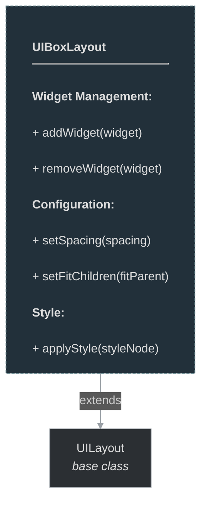

# framework/ui/uiboxlayout.h

## Overview

Plik nagłówkowy C++ zawierający definicje dla modułu uiboxlayout.

## Classes/Structs

### Klasa: `UIBoxLayout`

| Member | Brief | Signature |
|--------|-------|-----------|
| `applyStyle` |  | `void applyStyle(const OTMLNodePtr& styleNode)` |
| `addWidget` |  | `void addWidget(const UIWidgetPtr& widget) { update(); }` |
| `removeWidget` |  | `void removeWidget(const UIWidgetPtr& widget) { update(); }` |
| `setSpacing` |  | `void setSpacing(int spacing) { m_spacing = spacing; update(); }` |
| `setFitChildren` |  | `void setFitChildren(bool fitParent) { m_fitChildren = fitParent; update(); }` |
| `isUIBoxLayout` |  | `bool isUIBoxLayout() { return true; }` |
| `m_fitChildren` |  | `stdext::boolean<false> m_fitChildren` |
| `m_spacing` |  | `int m_spacing` |

## Functions

### `applyStyle`

**Sygnatura:** `void applyStyle(const OTMLNodePtr& styleNode)`

### `addWidget`

**Sygnatura:** `void addWidget(const UIWidgetPtr& widget) { update(); }`

### `removeWidget`

**Sygnatura:** `void removeWidget(const UIWidgetPtr& widget) { update(); }`

### `setSpacing`

**Sygnatura:** `void setSpacing(int spacing) { m_spacing = spacing; update(); }`

### `setFitChildren`

**Sygnatura:** `void setFitChildren(bool fitParent) { m_fitChildren = fitParent; update(); }`

### `isUIBoxLayout`

**Sygnatura:** `bool isUIBoxLayout() { return true; }`

## Class Diagram

<!-- mermaid-diagram: generated-by=diagram-agent v1; source_sha=3ead5ec; generated_at=2025-01-27T00:00:00Z -->

<!-- /mermaid-diagram -->
