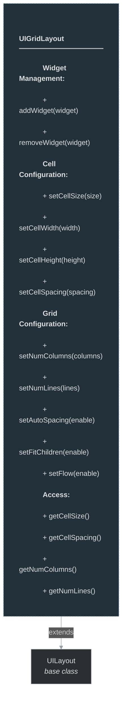

# framework/ui/uigridlayout.h

## Overview

Plik nagłówkowy C++ zawierający definicje dla modułu uigridlayout.

## Classes/Structs

### Klasa: `UIGridLayout`

| Member | Brief | Signature |
|--------|-------|-----------|
| `applyStyle` |  | `void applyStyle(const OTMLNodePtr& styleNode)` |
| `removeWidget` |  | `void removeWidget(const UIWidgetPtr& widget)` |
| `addWidget` |  | `void addWidget(const UIWidgetPtr& widget)` |
| `setCellSize` |  | `void setCellSize(const Size& size) { m_cellSize = size; update(); }` |
| `setCellWidth` |  | `void setCellWidth(int width) { m_cellSize.setWidth(width); update(); }` |
| `setCellHeight` |  | `void setCellHeight(int height) { m_cellSize.setHeight(height); update(); }` |
| `setCellSpacing` |  | `void setCellSpacing(int spacing) { m_cellSpacing = spacing; update(); }` |
| `setNumColumns` |  | `void setNumColumns(int columns) { m_numColumns = columns; update(); }` |
| `setNumLines` |  | `void setNumLines(int lines) { m_numLines = lines; update(); }` |
| `setAutoSpacing` |  | `void setAutoSpacing(bool enable) { m_autoSpacing = enable; update(); }` |
| `setFitChildren` |  | `void setFitChildren(bool enable) { m_fitChildren = enable; update(); }` |
| `setFlow` |  | `void setFlow(bool enable) { m_flow = enable; update(); }` |
| `getCellSize` |  | `Size getCellSize() { return m_cellSize; }` |
| `getCellSpacing` |  | `int getCellSpacing() { return m_cellSpacing; }` |
| `getNumColumns` |  | `int getNumColumns() { return m_numColumns; }` |
| `getNumLines` |  | `int getNumLines() { return m_numLines; }` |
| `isUIGridLayout` |  | `virtual bool isUIGridLayout() { return true; }` |
| `internalUpdate` |  | `bool internalUpdate()` |

## Functions

### `applyStyle`

**Sygnatura:** `void applyStyle(const OTMLNodePtr& styleNode)`

### `removeWidget`

**Sygnatura:** `void removeWidget(const UIWidgetPtr& widget)`

### `addWidget`

**Sygnatura:** `void addWidget(const UIWidgetPtr& widget)`

### `setCellSize`

**Sygnatura:** `void setCellSize(const Size& size) { m_cellSize = size; update(); }`

### `setCellWidth`

**Sygnatura:** `void setCellWidth(int width) { m_cellSize.setWidth(width); update(); }`

### `setCellHeight`

**Sygnatura:** `void setCellHeight(int height) { m_cellSize.setHeight(height); update(); }`

### `setCellSpacing`

**Sygnatura:** `void setCellSpacing(int spacing) { m_cellSpacing = spacing; update(); }`

### `setNumColumns`

**Sygnatura:** `void setNumColumns(int columns) { m_numColumns = columns; update(); }`

### `setNumLines`

**Sygnatura:** `void setNumLines(int lines) { m_numLines = lines; update(); }`

### `setAutoSpacing`

**Sygnatura:** `void setAutoSpacing(bool enable) { m_autoSpacing = enable; update(); }`

### `setFitChildren`

**Sygnatura:** `void setFitChildren(bool enable) { m_fitChildren = enable; update(); }`

### `setFlow`

**Sygnatura:** `void setFlow(bool enable) { m_flow = enable; update(); }`

### `getCellSize`

**Sygnatura:** `Size getCellSize() { return m_cellSize; }`

### `getCellSpacing`

**Sygnatura:** `int getCellSpacing() { return m_cellSpacing; }`

### `getNumColumns`

**Sygnatura:** `int getNumColumns() { return m_numColumns; }`

### `getNumLines`

**Sygnatura:** `int getNumLines() { return m_numLines; }`

### `internalUpdate`

**Sygnatura:** `bool internalUpdate()`

## Class Diagram

<!-- mermaid-diagram: generated-by=diagram-agent v1; source_sha=3ead5ec; generated_at=2025-01-27T00:00:00Z -->

<!-- /mermaid-diagram -->
