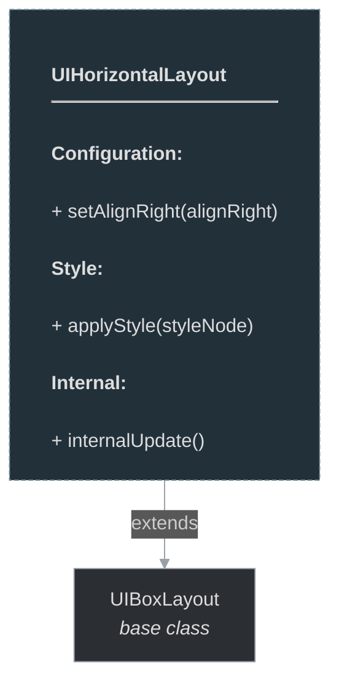

# framework/ui/uihorizontallayout.h

## Overview

Plik nagłówkowy C++ zawierający definicje dla modułu uihorizontallayout.

## Classes/Structs

### Klasa: `UIHorizontalLayout`

| Member | Brief | Signature |
|--------|-------|-----------|
| `applyStyle` |  | `void applyStyle(const OTMLNodePtr& styleNode)` |
| `setAlignRight` |  | `void setAlignRight(bool aliginRight) { m_alignRight = aliginRight; update(); }` |
| `isUIHorizontalLayout` |  | `bool isUIHorizontalLayout() { return true; }` |
| `internalUpdate` |  | `bool internalUpdate()` |
| `m_alignChidren` |  | `Fw::AlignmentFlag m_alignChidren` |
| `m_alignRight` |  | `stdext::boolean<false> m_alignRight` |

## Functions

### `applyStyle`

**Sygnatura:** `void applyStyle(const OTMLNodePtr& styleNode)`

### `setAlignRight`

**Sygnatura:** `void setAlignRight(bool aliginRight) { m_alignRight = aliginRight; update(); }`

### `isUIHorizontalLayout`

**Sygnatura:** `bool isUIHorizontalLayout() { return true; }`

### `internalUpdate`

**Sygnatura:** `bool internalUpdate()`

## Class Diagram

<!-- mermaid-diagram: generated-by=diagram-agent v1; source_sha=3ead5ec; generated_at=2025-01-27T00:00:00Z -->

<!-- /mermaid-diagram -->
