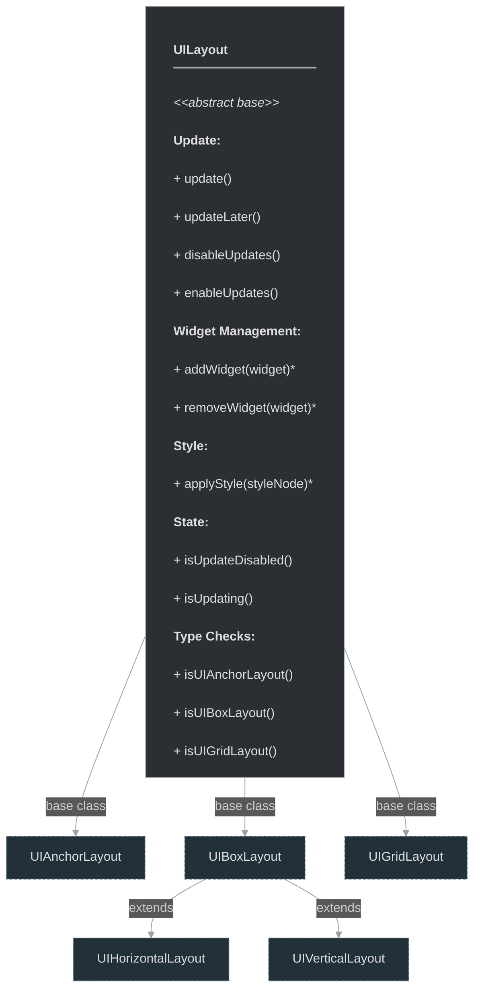

# framework/ui/uilayout.h

## Overview

Plik nagłówkowy C++ zawierający definicje dla modułu uilayout.

## Classes/Structs

### Klasa: `UILayout`

| Member | Brief | Signature |
|--------|-------|-----------|
| `update` |  | `void update()` |
| `updateLater` |  | `void updateLater()` |
| `applyStyle` |  | `virtual void applyStyle(const OTMLNodePtr& styleNode) { }` |
| `addWidget` |  | `virtual void addWidget(const UIWidgetPtr& widget) { }` |
| `removeWidget` |  | `virtual void removeWidget(const UIWidgetPtr& widget) { }` |
| `disableUpdates` |  | `void disableUpdates() { m_updateDisabled++; }` |
| `enableUpdates` |  | `void enableUpdates() { m_updateDisabled = std::max<int>(m_updateDisabled-1,0); }` |
| `setParent` |  | `void setParent(UIWidgetPtr parentWidget) { m_parentWidget = parentWidget; }` |
| `getParentWidget` |  | `UIWidgetPtr getParentWidget() { return m_parentWidget; }` |
| `isUpdateDisabled` |  | `bool isUpdateDisabled() { return m_updateDisabled > 0; }` |
| `isUpdating` |  | `bool isUpdating() { return m_updating; }` |
| `isUIAnchorLayout` |  | `virtual bool isUIAnchorLayout() { return false; }` |
| `isUIBoxLayout` |  | `virtual bool isUIBoxLayout() { return false; }` |
| `isUIHorizontalLayout` |  | `virtual bool isUIHorizontalLayout() { return false; }` |
| `isUIVerticalLayout` |  | `virtual bool isUIVerticalLayout() { return false; }` |
| `isUIGridLayout` |  | `virtual bool isUIGridLayout() { return false; }` |
| `internalUpdate` |  | `virtual bool internalUpdate() { return false; }` |
| `m_updateDisabled` |  | `int m_updateDisabled` |
| `m_updating` |  | `stdext::boolean<false> m_updating` |
| `m_updateScheduled` |  | `stdext::boolean<false> m_updateScheduled` |
| `m_parentWidget` |  | `UIWidgetPtr m_parentWidget` |

## Functions

### `update`

**Sygnatura:** `void update()`

### `updateLater`

**Sygnatura:** `void updateLater()`

### `disableUpdates`

**Sygnatura:** `void disableUpdates() { m_updateDisabled++; }`

### `enableUpdates`

**Sygnatura:** `void enableUpdates() { m_updateDisabled = std::max<int>(m_updateDisabled-1,0); }`

### `setParent`

**Sygnatura:** `void setParent(UIWidgetPtr parentWidget) { m_parentWidget = parentWidget; }`

### `getParentWidget`

**Sygnatura:** `UIWidgetPtr getParentWidget() { return m_parentWidget; }`

### `isUpdateDisabled`

**Sygnatura:** `bool isUpdateDisabled() { return m_updateDisabled > 0; }`

### `isUpdating`

**Sygnatura:** `bool isUpdating() { return m_updating; }`

## Class Diagram

<!-- mermaid-diagram: generated-by=diagram-agent v1; source_sha=3ead5ec; generated_at=2025-01-27T00:00:00Z -->

<!-- /mermaid-diagram -->
