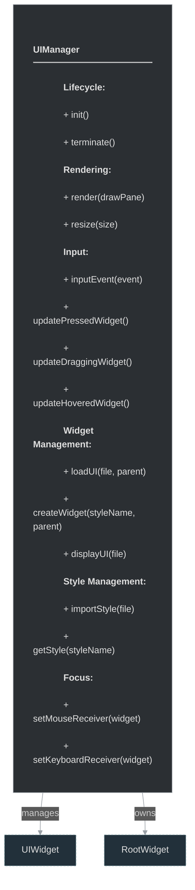
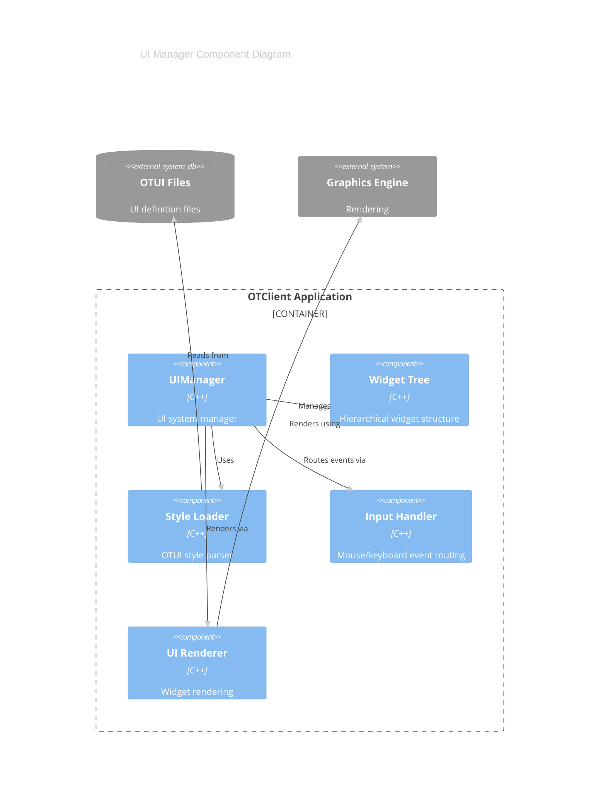

# framework/ui/uimanager.h

## Overview

Plik nagłówkowy C++ zawierający definicje dla modułu uimanager.

## Classes/Structs

### Klasa: `UIManager`

| Member | Brief | Signature |
|--------|-------|-----------|
| `init` |  | `void init()` |
| `terminate` |  | `void terminate()` |
| `render` |  | `void render(Fw::DrawPane drawPane)` |
| `resize` |  | `void resize(const Size& size)` |
| `inputEvent` |  | `void inputEvent(const InputEvent& event)` |
| `updatePressedWidget` |  | `void updatePressedWidget(const Fw::MouseButton button, const UIWidgetPtr& newPressedWidget, const Point& clickedPos = Point(), bool fireClicks = true)` |
| `updateDraggingWidget` |  | `bool updateDraggingWidget(const UIWidgetPtr& draggingWidget, const Point& clickedPos = Point())` |
| `updateHoveredWidget` |  | `void updateHoveredWidget(bool now = false)` |
| `clearStyles` |  | `void clearStyles()` |
| `importStyle` |  | `bool importStyle(std::string file)` |
| `importStyleFromString` |  | `bool importStyleFromString(std::string data)` |
| `importStyleFromOTML` |  | `void importStyleFromOTML(const OTMLNodePtr& styleNode)` |
| `getStyle` |  | `OTMLNodePtr getStyle(const std::string& styleName)` |
| `getStyleClass` |  | `std::string getStyleClass(const std::string& styleName)` |
| `loadUIFromString` |  | `UIWidgetPtr loadUIFromString(const std::string& data, const UIWidgetPtr& parent)` |
| `loadUI` |  | `UIWidgetPtr loadUI(std::string file, const UIWidgetPtr& parent)` |
| `displayUI` |  | `UIWidgetPtr displayUI(const std::string& file) { return loadUI(file, m_rootWidget); }` |
| `createWidget` |  | `UIWidgetPtr createWidget(const std::string& styleName, const UIWidgetPtr& parent)` |
| `createWidgetFromOTML` |  | `UIWidgetPtr createWidgetFromOTML(const OTMLNodePtr& widgetNode, const UIWidgetPtr& parent)` |
| `setMouseReceiver` |  | `void setMouseReceiver(const UIWidgetPtr& widget) { m_mouseReceiver = widget; }` |
| `setKeyboardReceiver` |  | `void setKeyboardReceiver(const UIWidgetPtr& widget) { m_keyboardReceiver = widget; }` |
| `setDebugBoxesDrawing` |  | `void setDebugBoxesDrawing(bool enabled) { m_drawDebugBoxes = enabled; }` |
| `resetMouseReceiver` |  | `void resetMouseReceiver() { m_mouseReceiver = m_rootWidget; }` |
| `resetKeyboardReceiver` |  | `void resetKeyboardReceiver() { m_keyboardReceiver = m_rootWidget; }` |
| `getMouseReceiver` |  | `UIWidgetPtr getMouseReceiver() { return m_mouseReceiver; }` |
| `getKeyboardReceiver` |  | `UIWidgetPtr getKeyboardReceiver() { return m_keyboardReceiver; }` |
| `getDraggingWidget` |  | `UIWidgetPtr getDraggingWidget() { return m_draggingWidget; }` |
| `getHoveredWidget` |  | `UIWidgetPtr getHoveredWidget() { return m_hoveredWidget; }` |
| `getPressedWidget` |  | `UIWidgetPtr getPressedWidget() { return m_pressedWidget[Fw::MouseLeftButton]; }` |
| `getRootWidget` |  | `UIWidgetPtr getRootWidget() { return m_rootWidget; }` |
| `isMouseGrabbed` |  | `bool isMouseGrabbed() { return m_mouseReceiver != m_rootWidget; }` |
| `isKeyboardGrabbed` |  | `bool isKeyboardGrabbed() { return m_keyboardReceiver != m_rootWidget; }` |
| `isDrawingDebugBoxes` |  | `bool isDrawingDebugBoxes() { return m_drawDebugBoxes; }` |
| `onWidgetAppear` |  | `void onWidgetAppear(const UIWidgetPtr& widget)` |
| `onWidgetDisappear` |  | `void onWidgetDisappear(const UIWidgetPtr& widget)` |
| `onWidgetDestroy` |  | `void onWidgetDestroy(const UIWidgetPtr& widget)` |

## Functions

### `init`

**Sygnatura:** `void init()`

### `terminate`

**Sygnatura:** `void terminate()`

### `render`

**Sygnatura:** `void render(Fw::DrawPane drawPane)`

### `resize`

**Sygnatura:** `void resize(const Size& size)`

### `inputEvent`

**Sygnatura:** `void inputEvent(const InputEvent& event)`

### `updatePressedWidget`

**Sygnatura:** `void updatePressedWidget(const Fw::MouseButton button, const UIWidgetPtr& newPressedWidget, const Point& clickedPos = Point(), bool fireClicks = true)`

### `updateDraggingWidget`

**Sygnatura:** `bool updateDraggingWidget(const UIWidgetPtr& draggingWidget, const Point& clickedPos = Point())`

### `updateHoveredWidget`

**Sygnatura:** `void updateHoveredWidget(bool now = false)`

### `clearStyles`

**Sygnatura:** `void clearStyles()`

### `importStyle`

**Sygnatura:** `bool importStyle(std::string file)`

### `importStyleFromString`

**Sygnatura:** `bool importStyleFromString(std::string data)`

### `importStyleFromOTML`

**Sygnatura:** `void importStyleFromOTML(const OTMLNodePtr& styleNode)`

### `getStyle`

**Sygnatura:** `OTMLNodePtr getStyle(const std::string& styleName)`

### `getStyleClass`

**Sygnatura:** `std::string getStyleClass(const std::string& styleName)`

### `loadUIFromString`

**Sygnatura:** `UIWidgetPtr loadUIFromString(const std::string& data, const UIWidgetPtr& parent)`

### `loadUI`

**Sygnatura:** `UIWidgetPtr loadUI(std::string file, const UIWidgetPtr& parent)`

### `displayUI`

**Sygnatura:** `UIWidgetPtr displayUI(const std::string& file) { return loadUI(file, m_rootWidget); }`

### `createWidget`

**Sygnatura:** `UIWidgetPtr createWidget(const std::string& styleName, const UIWidgetPtr& parent)`

### `createWidgetFromOTML`

**Sygnatura:** `UIWidgetPtr createWidgetFromOTML(const OTMLNodePtr& widgetNode, const UIWidgetPtr& parent)`

### `setMouseReceiver`

**Sygnatura:** `void setMouseReceiver(const UIWidgetPtr& widget) { m_mouseReceiver = widget; }`

### `setKeyboardReceiver`

**Sygnatura:** `void setKeyboardReceiver(const UIWidgetPtr& widget) { m_keyboardReceiver = widget; }`

### `setDebugBoxesDrawing`

**Sygnatura:** `void setDebugBoxesDrawing(bool enabled) { m_drawDebugBoxes = enabled; }`

### `resetMouseReceiver`

**Sygnatura:** `void resetMouseReceiver() { m_mouseReceiver = m_rootWidget; }`

### `resetKeyboardReceiver`

**Sygnatura:** `void resetKeyboardReceiver() { m_keyboardReceiver = m_rootWidget; }`

### `getMouseReceiver`

**Sygnatura:** `UIWidgetPtr getMouseReceiver() { return m_mouseReceiver; }`

### `getKeyboardReceiver`

**Sygnatura:** `UIWidgetPtr getKeyboardReceiver() { return m_keyboardReceiver; }`

### `getDraggingWidget`

**Sygnatura:** `UIWidgetPtr getDraggingWidget() { return m_draggingWidget; }`

### `getHoveredWidget`

**Sygnatura:** `UIWidgetPtr getHoveredWidget() { return m_hoveredWidget; }`

### `getPressedWidget`

**Sygnatura:** `UIWidgetPtr getPressedWidget() { return m_pressedWidget[Fw::MouseLeftButton]; }`

### `getRootWidget`

**Sygnatura:** `UIWidgetPtr getRootWidget() { return m_rootWidget; }`

### `isMouseGrabbed`

**Sygnatura:** `bool isMouseGrabbed() { return m_mouseReceiver != m_rootWidget; }`

### `isKeyboardGrabbed`

**Sygnatura:** `bool isKeyboardGrabbed() { return m_keyboardReceiver != m_rootWidget; }`

### `isDrawingDebugBoxes`

**Sygnatura:** `bool isDrawingDebugBoxes() { return m_drawDebugBoxes; }`

### `onWidgetAppear`

**Sygnatura:** `void onWidgetAppear(const UIWidgetPtr& widget)`

### `onWidgetDisappear`

**Sygnatura:** `void onWidgetDisappear(const UIWidgetPtr& widget)`

### `onWidgetDestroy`

**Sygnatura:** `void onWidgetDestroy(const UIWidgetPtr& widget)`

## Class Diagram

<!-- mermaid-diagram: generated-by=diagram-agent v1; source_sha=3ead5ec; generated_at=2025-01-27T00:00:00Z -->

<!-- /mermaid-diagram -->

## Diagram: UI Manager Architecture (C4 Component)

<!-- mermaid-diagram: generated-by=diagram-agent v1; source_sha=3ead5ec; generated_at=2025-01-27T00:00:00Z -->

<!-- /mermaid-diagram -->
