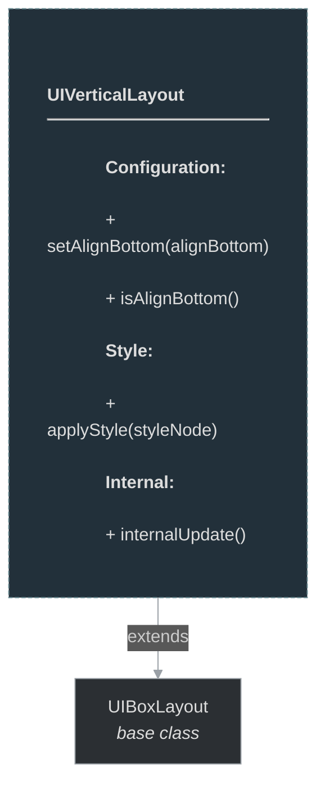

# framework/ui/uiverticallayout.h

## Overview

Plik nagłówkowy C++ zawierający definicje dla modułu uiverticallayout.

## Classes/Structs

### Klasa: `UIVerticalLayout`

| Member | Brief | Signature |
|--------|-------|-----------|
| `applyStyle` |  | `void applyStyle(const OTMLNodePtr& styleNode)` |
| `setAlignBottom` |  | `void setAlignBottom(bool aliginBottom) { m_alignBottom = aliginBottom; update(); }` |
| `isAlignBottom` |  | `bool isAlignBottom() { return m_alignBottom; }` |
| `isUIVerticalLayout` |  | `bool isUIVerticalLayout() { return true; }` |
| `internalUpdate` |  | `bool internalUpdate()` |
| `m_alignBottom` |  | `stdext::boolean<false> m_alignBottom` |

## Functions

### `applyStyle`

**Sygnatura:** `void applyStyle(const OTMLNodePtr& styleNode)`

### `setAlignBottom`

**Sygnatura:** `void setAlignBottom(bool aliginBottom) { m_alignBottom = aliginBottom; update(); }`

### `isAlignBottom`

**Sygnatura:** `bool isAlignBottom() { return m_alignBottom; }`

### `isUIVerticalLayout`

**Sygnatura:** `bool isUIVerticalLayout() { return true; }`

### `internalUpdate`

**Sygnatura:** `bool internalUpdate()`

## Class Diagram

<!-- mermaid-diagram: generated-by=diagram-agent v1; source_sha=3ead5ec; generated_at=2025-01-27T00:00:00Z -->

<!-- /mermaid-diagram -->
