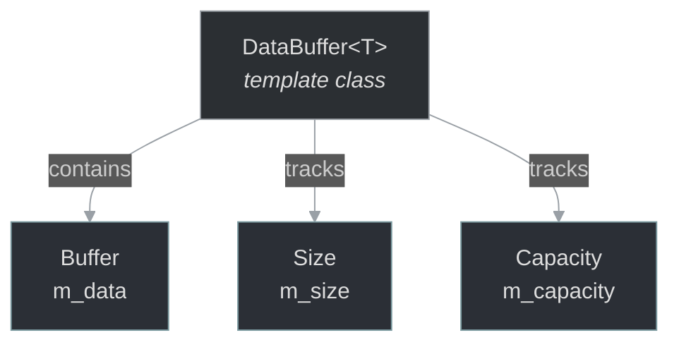

# framework/util/databuffer.h

## Overview

Plik nagłówkowy C++ zawierający definicje dla modułu databuffer.

## Classes/Structs

### Klasa: `DataBuffer`

**Szablon:** `template<class T>`

| Member | Brief | Signature |
|--------|-------|-----------|
| `reset` |  | `inline void reset() { m_size = 0; }` |
| `clear` |  | `inline void clear() {` |
| `empty` |  | `inline bool empty() const { return m_size == 0; }` |
| `size` |  | `inline uint size() const { return m_size; }` |
| `reserve` |  | `inline void reserve(uint n) {` |
| `resize` |  | `inline void resize(uint n, T def = T()) {` |
| `grow` |  | `inline void grow(uint n, bool precise = false) {` |
| `newcapacity` |  | `uint newcapacity = m_capacity` |
| `add` |  | `inline void add(const T& v) {` |

## Functions

### `reset`

**Sygnatura:** `inline void reset() { m_size = 0; }`

### `clear`

**Sygnatura:** `inline void clear() {`

### `empty`

**Sygnatura:** `inline bool empty() const { return m_size == 0; }`

### `size`

**Sygnatura:** `inline uint size() const { return m_size; }`

### `reserve`

**Sygnatura:** `inline void reserve(uint n) {`

### `resize`

**Sygnatura:** `inline void resize(uint n, T def = T()) {`

### `grow`

**Sygnatura:** `inline void grow(uint n, bool precise = false) {`

### `add`

**Sygnatura:** `inline void add(const T& v) {`

## Class Diagram

<!-- mermaid-diagram: generated-by=diagram-agent v1; source_sha=3ead5ec; generated_at=2025-01-27T00:00:00Z -->

<!-- /mermaid-diagram -->
