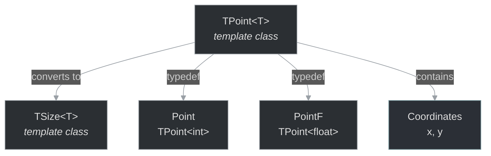

# framework/util/point.h

## Overview

Plik nagłówkowy C++ zawierający definicje dla modułu point.

## Classes/Structs

### Klasa: `TSize`

**Szablon:** `template<class T>`

| Member | Brief | Signature |
|--------|-------|-----------|
| `isNull` |  | `bool isNull() const { return x==0 && y==0; }` |
| `toSize` |  | `TSize<T> toSize() const { return TSize<T>(x, y); }` |
| `operator` |  | `bool operator==(const TPoint<T>& other) const { return other.x==x && other.y==y; }` |
| `length` |  | `float length() const { return sqrt((float)(x*x + y*y)); }` |
| `manhattanLength` |  | `T manhattanLength() const { return std::abs(x) + std::abs(y); }` |
| `distanceFrom` |  | `float distanceFrom(const TPoint<T>& other) const {` |

### Klasa: `TPoint`

**Szablon:** `template<class T>`

| Member | Brief | Signature |
|--------|-------|-----------|
| `isNull` |  | `bool isNull() const { return x==0 && y==0; }` |
| `toSize` |  | `TSize<T> toSize() const { return TSize<T>(x, y); }` |
| `operator` |  | `bool operator==(const TPoint<T>& other) const { return other.x==x && other.y==y; }` |
| `length` |  | `float length() const { return sqrt((float)(x*x + y*y)); }` |
| `manhattanLength` |  | `T manhattanLength() const { return std::abs(x) + std::abs(y); }` |
| `distanceFrom` |  | `float distanceFrom(const TPoint<T>& other) const {` |

## Functions

### `isNull`

**Sygnatura:** `bool isNull() const { return x==0 && y==0; }`

### `toSize`

**Sygnatura:** `TSize<T> toSize() const { return TSize<T>(x, y); }`

### `length`

**Sygnatura:** `float length() const { return sqrt((float)(x*x + y*y)); }`

### `manhattanLength`

**Sygnatura:** `T manhattanLength() const { return std::abs(x) + std::abs(y); }`

### `distanceFrom`

**Sygnatura:** `float distanceFrom(const TPoint<T>& other) const {`

## Types/Aliases

### `Point`

**Typedef:** `TPoint<int>`

### `PointF`

**Typedef:** `TPoint<float>`

## Class Diagram

<!-- mermaid-diagram: generated-by=diagram-agent v1; source_sha=3ead5ec; generated_at=2025-01-27T00:00:00Z -->

<!-- /mermaid-diagram -->
