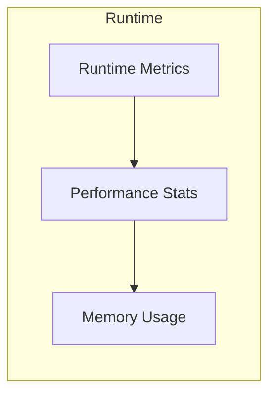
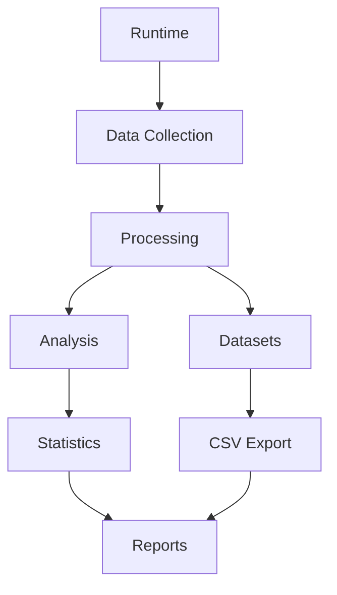

# Diagrams

## Diagrams

:caption: Architecture

```mermaid
graph LR
    subgraph Runtime
        E0[Runtime Metrics]
        E1[Performance Stats]
        E2[Memory Usage]
        E0 --> E1
        E1 --> E2
    end
```

:caption: Flow

```mermaid
graph TD
    A[Runtime] --> B[Data Collection]
    B --> C[Processing]
    C --> D[Datasets]
    C --> E[Analysis]
    D --> F[CSV Export]
    E --> G[Statistics]
    G --> H[Reports]
    F --> H
```
