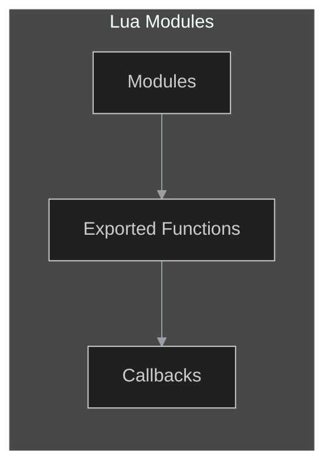
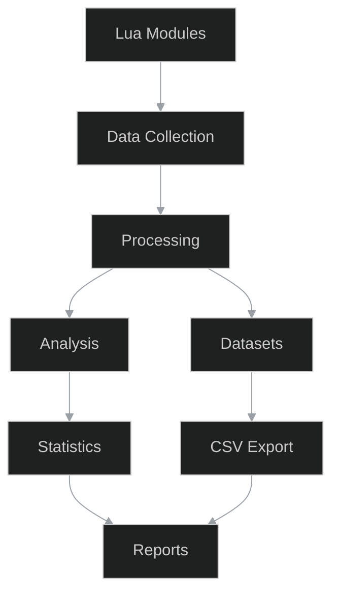
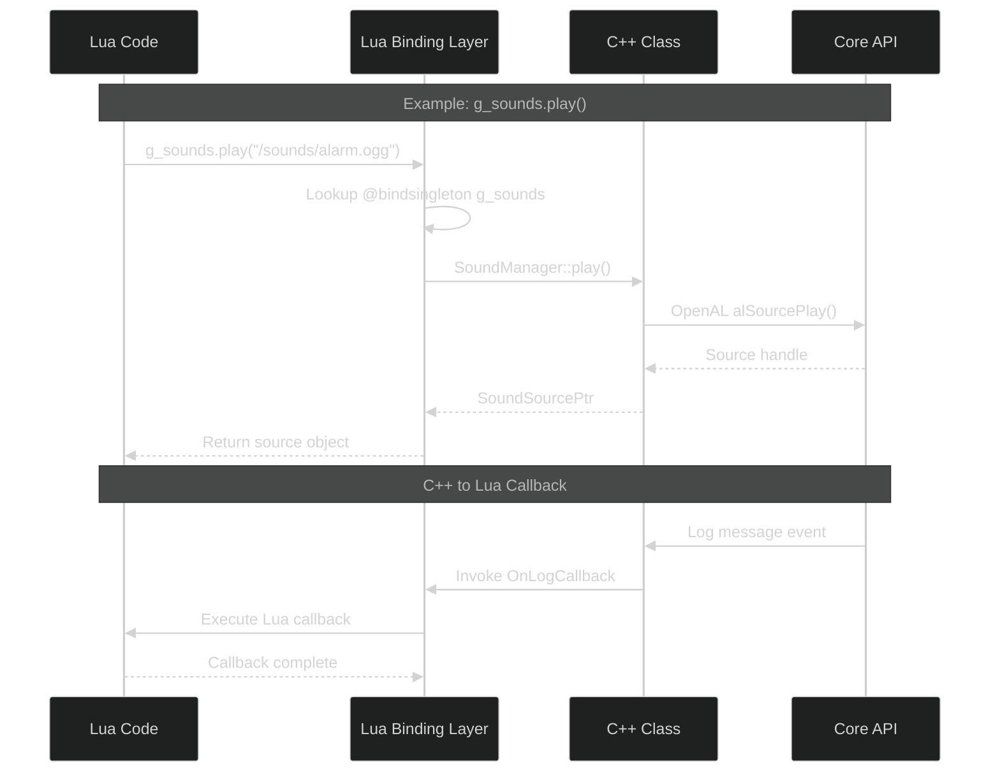
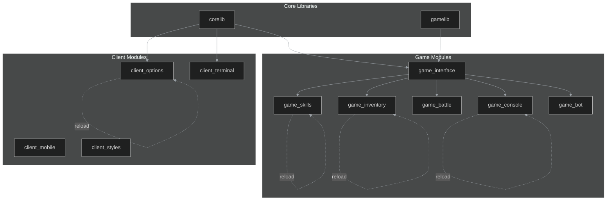
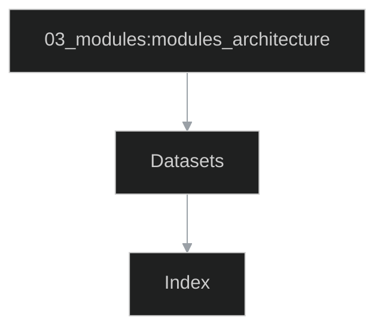
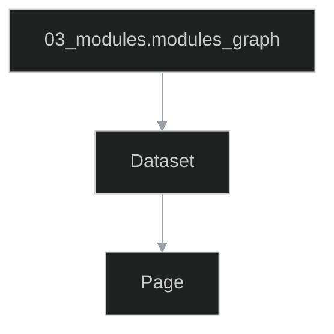
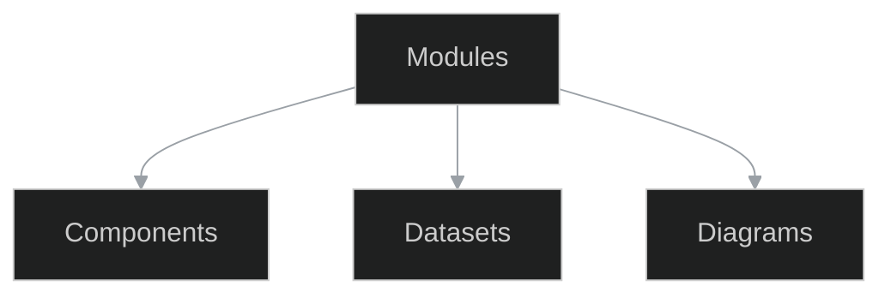

# 03_modules - Modules

```{contents} Table of contents
:depth: 2
:local:
```

## Datasets
### entities
*Facet:* [`03_modules.entities`](#facet-03_modules.entities)

```{csv-table} entities
:header-rows: 1
:file: ./datasets/entities.csv
:widths: auto
```

### hot_reload
*Facet:* [`03_modules.hot_reload`](#facet-03_modules.hot_reload)

```{csv-table} hot_reload
:header-rows: 1
:file: ./datasets/hot_reload.csv
:widths: auto
```

### lua_bindings_map
*Facet:* [`03_modules.lua_bindings_map`](#facet-03_modules.lua_bindings_map)

```{csv-table} lua_bindings_map
:header-rows: 1
:file: ./datasets/lua_bindings_map.csv
:widths: auto
```

### lua_exports
*Facet:* [`03_modules.lua_exports`](#facet-03_modules.lua_exports)

```{csv-table} lua_exports
:header-rows: 1
:file: ./datasets/lua_exports.csv
:widths: auto
```

### modules_index
*Facet:* [`03_modules.modules_index`](#facet-03_modules.modules_index)

```{csv-table} modules_index
:header-rows: 1
:file: ./datasets/modules_index.csv
:widths: auto
```

### summary
*Facet:* [`03_modules.summary`](#facet-03_modules.summary)

```{csv-table} summary
:header-rows: 1
:file: ./datasets/summary.csv
:widths: auto
```

## Diagrams
### architecture
*Facet:* [`03_modules.architecture`](#facet-03_modules.architecture)



### flow
*Facet:* [`03_modules.flow`](#facet-03_modules.flow)



### lua_cpp_binding_flow
*Facet:* [`03_modules.lua_cpp_binding_flow`](#facet-03_modules.lua_cpp_binding_flow)



### module_dependencies
*Facet:* [`03_modules.module_dependencies`](#facet-03_modules.module_dependencies)



### modules_architecture
*Facet:* [`03_modules.modules_architecture`](#facet-03_modules.modules_architecture)



### modules_graph
*Facet:* [`03_modules.modules_graph`](#facet-03_modules.modules_graph)



### overview
*Facet:* [`03_modules.overview`](#facet-03_modules.overview)



## Podkatalogi

```{toctree}
:maxdepth: 1
:titlesonly:
blueprints/index
lua/index
```

## Crosslinks

- **uses** → `04_ui.ui_widgets` (evidence: `docs/authoring/04_ui/datasets/ui_widgets.csv`)
- **handles** → `02_events.events_matrix` (evidence: `docs/authoring/02_events/datasets/events_matrix.csv`)
- **uses** → `09_logging.logging_categories` (evidence: `docs/authoring/09_logging/datasets/logging_categories.csv`)

## Appendix / Facets

(facet-03_modules.architecture)=
### Facet: `03_modules.architecture`
Type: diagram

(facet-03_modules.entities)=
### Facet: `03_modules.entities`
Type: dataset

(facet-03_modules.flow)=
### Facet: `03_modules.flow`
Type: diagram

(facet-03_modules.hot_reload)=
### Facet: `03_modules.hot_reload`
Type: dataset

(facet-03_modules.lua_bindings_map)=
### Facet: `03_modules.lua_bindings_map`
Type: dataset

(facet-03_modules.lua_cpp_binding_flow)=
### Facet: `03_modules.lua_cpp_binding_flow`
Type: diagram

(facet-03_modules.lua_exports)=
### Facet: `03_modules.lua_exports`
Type: dataset

(facet-03_modules.module_dependencies)=
### Facet: `03_modules.module_dependencies`
Type: diagram

(facet-03_modules.modules_architecture)=
### Facet: `03_modules.modules_architecture`
Type: diagram

(facet-03_modules.modules_graph)=
### Facet: `03_modules.modules_graph`
Type: diagram

(facet-03_modules.modules_index)=
### Facet: `03_modules.modules_index`
Type: dataset

(facet-03_modules.overview)=
### Facet: `03_modules.overview`
Type: diagram

(facet-03_modules.summary)=
### Facet: `03_modules.summary`
Type: dataset

