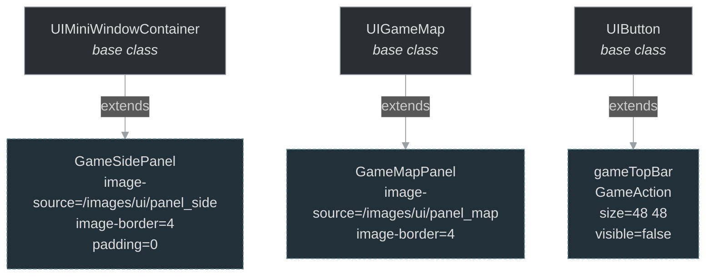
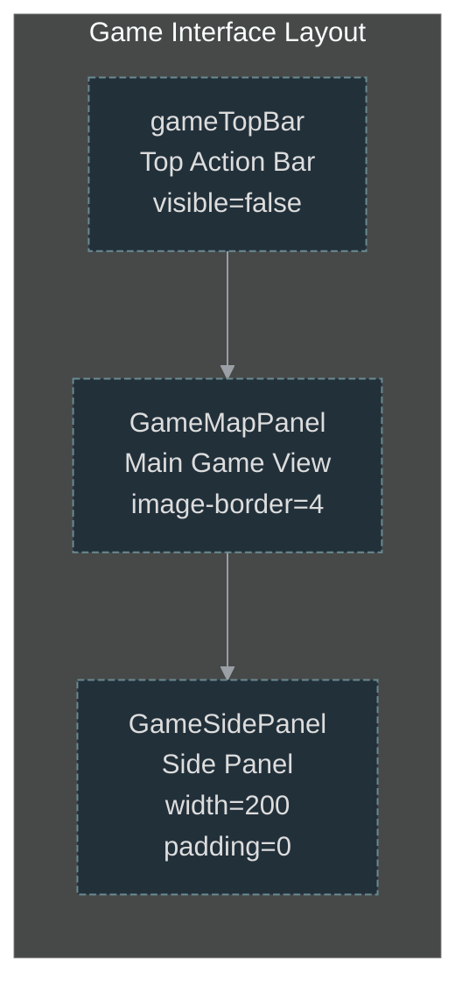

# game_interface/gameinterface.otui

## Overview

Plik OTUI definiujący interfejs użytkownika dla gameinterface.

## Widgets

| ID | Class | Parent | Key Properties |
|----|-------|--------|----------------|
| `GameSidePanel` | `GameSidePanel` | `UIMiniWindowContainer` | image-source=/images/ui/panel_side, image-border=4, padding=0 |
| `GameMapPanel` | `GameMapPanel` | `UIGameMap` | padding=0, image-source=/images/ui/panel_map, image-border=4 |
| `gameTopBar` | `GameAction` | `UIButton` | visible=false, size=48 48 |

## Widget Details

### `GameSidePanel`

- **Klasa:** `GameSidePanel`
- **Rodzic:** `UIMiniWindowContainer`
- **Właściwości:**
  - `image-source`: /images/ui/panel_side
  - `image-border`: 4
  - `padding`: 0
  - `padding-top`: 0
  - `width`: 200
  - `focusable`: false
  - `on`: true
  - `type`: verticalBox

### `GameMapPanel`

- **Klasa:** `GameMapPanel`
- **Rodzic:** `UIGameMap`
- **Właściwości:**
  - `padding`: 0
  - `image-source`: /images/ui/panel_map
  - `image-border`: 4

### `gameTopBar`

- **Klasa:** `GameAction`
- **Rodzic:** `UIButton`
- **Właściwości:**
  - `size`: 48 48
  - `phantom`: true
  - `id`: gameTopBar
  - `opacity`: 0.6
  - `background`: alpha
  - `focusable`: false
  - `width`: 0
  - `visible`: false
  - `type`: verticalBox
  - `fit-children`: true
  - `spacing`: -1
  - `margin-top`: 3
  - `height`: 0
  - `relative-margin`: bottom
  - `margin-bottom`: 150
  - `image-source`: /images/ui/panel_bottom2

## Hierarchy Diagram

<!-- mermaid-diagram: generated-by=diagram-agent v1; source_sha=3ead5ec; generated_at=2025-01-27T00:00:00Z -->

<!-- /mermaid-diagram -->

## Diagram: Game Interface Layout

<!-- mermaid-diagram: generated-by=diagram-agent v1; source_sha=3ead5ec; generated_at=2025-01-27T00:00:00Z -->

<!-- /mermaid-diagram -->
