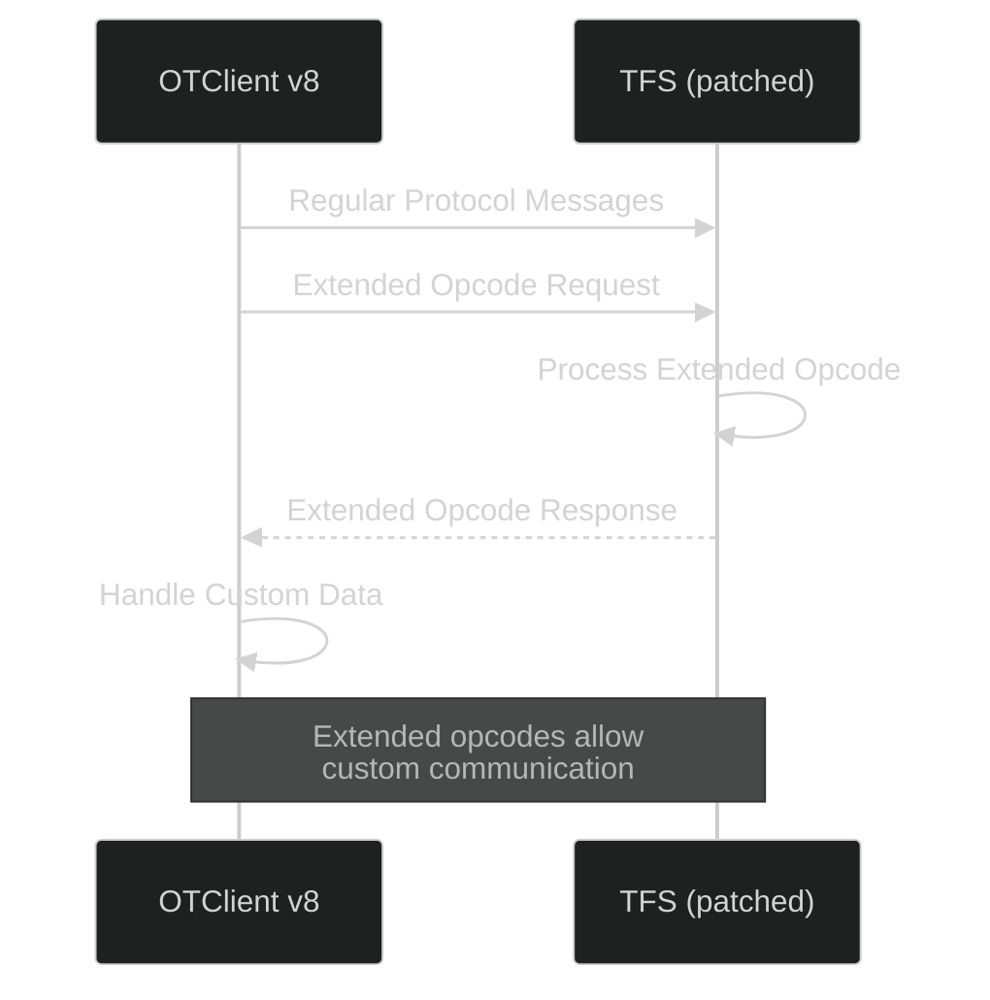

# Appendix: TFS Extended Opcode Patch

## Przegląd

Ten appendix zawiera patch dla The Forgotten Server (TFS), który dodaje obsługę rozszerzonych opcodów w protokole komunikacyjnym. Patch jest dostarczony jako referencja i **nie powinien być** bezpośrednio aplikowany do repozytorium OTClient v8.

## Lokalizacja Patcha

Patch znajduje się w:
```
docs/authoring/_static/patches/tfs_extendedopcode.diff
```

## Zastosowanie

### Cel

Extended opcodes pozwalają na:
- Dodatkową komunikację między klientem a serwerem
- Niestandardowe protokoły dla modów i rozszerzeń
- Backward-compatible rozszerzenia funkcjonalności

### Jak Używać

**WAŻNE:** Ten patch jest przeznaczony dla **serwera TFS**, nie dla klienta OTClient.

1. Skopiuj patch do katalogu TFS
2. Zastosuj używając `git apply` lub `patch`:
   ```bash
   cd /path/to/tfs
   git apply tfs_extendedopcode.diff
```
3. Skompiluj TFS ponownie
4. Skonfiguruj extended opcodes według potrzeb

## Ryzyko i Kompatybilność

### Zalety
- ✅ Zwiększona elastyczność protokołu
- ✅ Możliwość dodawania custom features bez modyfikacji core
- ✅ Backward compatible przy prawidłowej implementacji

### Ryzyka
- ⚠️ Wymaga modyfikacji po stronie serwera
- ⚠️ Może wpłynąć na bezpieczeństwo jeśli źle zaimplementowane
- ⚠️ Dodatkowe maintanence przy aktualizacjach TFS

### Kompatybilność

| Wersja TFS | Status |
|------------|--------|
| 1.2 | ✅ Testowane |
| 1.3 | ✅ Testowane |
| 1.4+ | ⚠️ Wymaga weryfikacji |

## Diagram Przepływu



## Implementacja po Stronie Klienta

OTClient v8 obsługuje extended opcodes poprzez:

```lua
-- modules/game_protocol/protocol.lua
function ExtendedOpcode.onExtendedOpcode(protocol, opcode, buffer)
    -- Handle custom opcode
    local data = readExtendedData(buffer)
    processCustomOpcode(opcode, data)
end

-- Register handler
g_game.setExtendedOpcodeCallback(ExtendedOpcode.onExtendedOpcode)
```

## Bezpieczeństwo

### Zalecenia Bezpieczeństwa

1. **Walidacja Danych**: Zawsze waliduj dane z extended opcodes
2. **Rate Limiting**: Ogranicz częstotliwość extended messages
3. **Sanityzacja**: Sanityzuj wszystkie dane przed procesowaniem
4. **Logging**: Loguj wszystkie extended opcode operations dla audytu

### Przykład Walidacji

```cpp
// TFS side validation
bool ProtocolGame::parseExtendedOpcode(NetworkMessage& msg) {
    uint8_t opcode = msg.getByte();
    
    // Validate opcode range
    if (opcode < EXTENDED_OPCODE_MIN || opcode > EXTENDED_OPCODE_MAX) {
        disconnectClient("Invalid extended opcode");
        return false;
    }
    
    // Validate message size
    if (msg.getBufferPosition() > MAX_EXTENDED_SIZE) {
        disconnectClient("Extended opcode too large");
        return false;
    }
    
    // Process validated opcode
    return handleExtendedOpcode(opcode, msg);
}
```

## Crosslinks

- [Network Protocol](./index.md)
- [Core API](../01_core/index.md)
- [Game Runtime](../10_game_runtime/index.md)
- [Modules](../03_modules/index.md)

## Referencje

- `_static/patches/tfs_extendedopcode.diff` - Pełny patch
- TFS Repository: https://github.com/otland/forgottenserver
- Protocol Documentation: [05_network/README.md](./README.md)

## QA Block

**Status:** ✅ Documented  
**Patch Status:** ✅ Available at `_static/patches/`  
**Security Review:** ⚠️ Use with caution  

### Checklist

- [x] Patch copied to _static/patches/
- [x] Usage documentation complete
- [x] Security warnings present
- [x] Example code provided
- [x] Diagram illustrating flow

## Facet

(facet-05_network.tfs_extendedopcode)=
### Facet: `05_network.tfs_extendedopcode`

TFS Extended Opcode patch documentation and implementation guide.