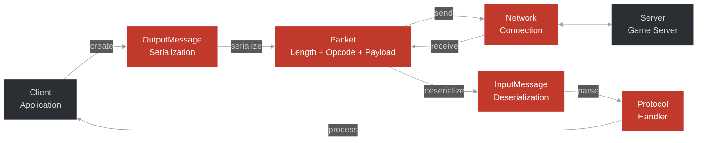

# Packet Structure Reference

## Overview

OTClient v8 network packets follow a specific binary format for efficient data transmission. This document details packet structure, serialization, and common patterns.

## Basic Packet Format

```
+----------------+----------------+------------------+
| Length (2B)    | Opcode (1B)    | Payload (N bytes)|
+----------------+----------------+------------------+
  Big-endian       Operation       Variable length
```

### Fields

1. **Length** (2 bytes, big-endian): Total packet size including opcode and payload
2. **Opcode** (1 byte): Identifies the message type
3. **Payload** (variable): Message-specific data

## Data Types

### Primitive Types

| Type | Size | C++ Type | Description |
|------|------|----------|-------------|
| U8 | 1 byte | uint8_t | Unsigned 8-bit integer (0-255) |
| U16 | 2 bytes | uint16_t | Unsigned 16-bit integer |
| U32 | 4 bytes | uint32_t | Unsigned 32-bit integer |
| U64 | 8 bytes | uint64_t | Unsigned 64-bit integer |
| String | Variable | std::string | Length-prefixed string |
| Position | 5 bytes | Position | X (U16) + Y (U16) + Z (U8) |

### Serialization Examples

```cpp
// Writing primitives
OutputMessagePtr msg = std::make_shared<OutputMessage>();

msg->addU8(255);           // 1 byte: 0xFF
msg->addU16(1000);         // 2 bytes: 0x03 0xE8
msg->addU32(1000000);      // 4 bytes: 0x00 0x0F 0x42 0x40
msg->addU64(1000000000);   // 8 bytes

// Writing strings
msg->addString("Hello");   // [5] H e l l o

// Writing positions
Position pos(100, 200, 7);
msg->addPosition(pos);     // [0x00 0x64] [0x00 0xC8] [0x07]
```

### Deserialization Examples

```cpp
// Reading primitives
InputMessagePtr msg = receiveMessage();

uint8_t  value8  = msg->getU8();
uint16_t value16 = msg->getU16();
uint32_t value32 = msg->getU32();
uint64_t value64 = msg->getU64();

// Reading strings
std::string text = msg->getString();

// Reading positions
Position pos = msg->getPosition();
```

## Common Packet Structures

### Login Packet

```cpp
// Client -> Server
struct LoginPacket {
    uint8_t opcode = Proto::ClientOpcodes::Login;
    uint16_t protocolVersion;
    uint32_t clientVersion;
    std::string account;
    std::string password;
    std::string token;  // Optional 2FA
};

void sendLogin(const std::string& account, const std::string& password) {
    OutputMessagePtr msg = std::make_shared<OutputMessage>();
    
    msg->addU8(Proto::ClientOpcodes::Login);
    msg->addU16(g_game.getProtocolVersion());
    msg->addU32(g_game.getClientVersion());
    msg->addString(account);
    msg->addString(password);
    
    // Optional: 2FA token
    if (has2FA) {
        msg->addString(token);
    }
    
    send(msg);
}
```

### Character List Response

```cpp
// Server -> Client
struct CharacterListPacket {
    uint8_t opcode = Proto::ServerOpcodes::CharacterList;
    uint8_t characterCount;
    
    struct Character {
        std::string name;
        std::string world;
        uint32_t ip;
        uint16_t port;
    };
    
    std::vector<Character> characters;
};

void parseCharacterList(InputMessagePtr msg) {
    uint8_t count = msg->getU8();
    
    std::vector<Character> characters;
    for (int i = 0; i < count; i++) {
        Character c;
        c.name = msg->getString();
        c.world = msg->getString();
        c.ip = msg->getU32();
        c.port = msg->getU16();
        characters.push_back(c);
    }
    
    g_game.onCharacterList(characters);
}
```

### Move Creature Packet

```cpp
// Server -> Client
struct MoveCreaturePacket {
    uint8_t opcode = Proto::ServerOpcodes::MoveCreature;
    Position oldPos;
    uint8_t oldStackPos;
    Position newPos;
};

void parseMoveCreature(InputMessagePtr msg) {
    Position oldPos = msg->getPosition();
    uint8_t oldStackPos = msg->getU8();
    Position newPos = msg->getPosition();
    
    CreaturePtr creature = g_map.getTile(oldPos)->getTopCreature();
    if (creature) {
        g_map.moveCreature(creature, oldPos, newPos);
    }
}
```

### Send Text Message

```cpp
// Client -> Server
struct SayPacket {
    uint8_t opcode = Proto::ClientOpcodes::Say;
    uint8_t messageMode;
    std::string message;
    std::string receiver;  // For private messages
};

void sendMessage(MessageMode mode, const std::string& message) {
    OutputMessagePtr msg = std::make_shared<OutputMessage>();
    
    msg->addU8(Proto::ClientOpcodes::Say);
    msg->addU8(static_cast<uint8_t>(mode));
    
    if (mode == MessageMode::Private) {
        msg->addString(m_receiver);
    }
    
    msg->addString(message);
    send(msg);
}
```

## Extended Opcodes

### Extended Opcode Format

```
+----------------+----------------+----------------+
| Base Opcode    | Extended ID    | Payload        |
+----------------+----------------+----------------+
  0x32 (fixed)     0x00-0xFF        Variable
```

### Sending Extended Opcode

```cpp
void sendExtendedOpcode(uint8_t opcode, const std::string& buffer) {
    OutputMessagePtr msg = std::make_shared<OutputMessage>();
    
    msg->addU8(Proto::ClientOpcodes::ExtendedOpcode);
    msg->addU8(opcode);
    msg->addString(buffer);
    
    send(msg);
}
```

### Receiving Extended Opcode

```cpp
void parseExtendedOpcode(InputMessagePtr msg) {
    uint8_t opcode = msg->getU8();
    std::string buffer = msg->getString();
    
    // Dispatch to handler
    switch (opcode) {
        case 0x01:  // Custom opcode 1
            handleCustomOpcode1(buffer);
            break;
        case 0x02:  // Custom opcode 2
            handleCustomOpcode2(buffer);
            break;
        default:
            g_logger.warning("Unknown extended opcode: %d", opcode);
    }
}
```

## Packet Compression

### DEFLATE Compression

```cpp
// Enable compression for large packets
class PacketCompression {
public:
    static std::string compress(const std::string& data) {
        if (data.size() < MIN_COMPRESS_SIZE) {
            return data;  // Too small to benefit
        }
        
        z_stream stream;
        stream.zalloc = Z_NULL;
        stream.zfree = Z_NULL;
        stream.opaque = Z_NULL;
        
        deflateInit(&stream, Z_DEFAULT_COMPRESSION);
        
        // Compress data
        std::vector<uint8_t> compressed(data.size());
        stream.avail_in = data.size();
        stream.next_in = (Bytef*)data.data();
        stream.avail_out = compressed.size();
        stream.next_out = compressed.data();
        
        deflate(&stream, Z_FINISH);
        deflateEnd(&stream);
        
        compressed.resize(stream.total_out);
        return std::string(compressed.begin(), compressed.end());
    }
};
```

## Encryption

### RSA + XTEA

```cpp
class PacketEncryption {
public:
    void encrypt(OutputMessagePtr msg) {
        // Step 1: Add checksum
        uint32_t checksum = adlerChecksum(msg->getBuffer());
        msg->addU32(checksum);
        
        // Step 2: XTEA encryption
        xteaEncrypt(msg->getBuffer(), m_xteaKey);
    }
    
    void decrypt(InputMessagePtr msg) {
        // Step 1: XTEA decryption
        xteaDecrypt(msg->getBuffer(), m_xteaKey);
        
        // Step 2: Verify checksum
        uint32_t checksum = msg->getU32();
        uint32_t calculated = adlerChecksum(msg->getBuffer());
        
        if (checksum != calculated) {
            throw std::runtime_error("Checksum mismatch");
        }
    }
    
private:
    std::array<uint32_t, 4> m_xteaKey;
};
```

## Performance Optimization

### Message Pooling

```cpp
class MessagePool {
public:
    OutputMessagePtr allocate() {
        if (m_pool.empty()) {
            return std::make_shared<OutputMessage>();
        }
        
        auto msg = m_pool.back();
        m_pool.pop_back();
        msg->reset();
        return msg;
    }
    
    void recycle(OutputMessagePtr msg) {
        if (m_pool.size() < MAX_POOL_SIZE) {
            m_pool.push_back(msg);
        }
    }
    
private:
    std::vector<OutputMessagePtr> m_pool;
    static constexpr size_t MAX_POOL_SIZE = 100;
};
```

### Batch Writing

```cpp
// BAD: Many small packets
for (auto& item : items) {
    sendItem(item);
}

// GOOD: Single batched packet
OutputMessagePtr msg = std::make_shared<OutputMessage>();
msg->addU8(Proto::ClientOpcodes::ItemsBatch);
msg->addU16(items.size());

for (auto& item : items) {
    msg->addU16(item.id);
    msg->addU8(item.count);
}

send(msg);
```

## Debugging

### Packet Logger

```cpp
class PacketLogger {
public:
    void logOutgoing(const OutputMessage& msg) {
        std::cout << ">>> Outgoing Packet" << std::endl;
        std::cout << "Length: " << msg.getLength() << std::endl;
        std::cout << "Opcode: 0x" << std::hex << (int)msg.getOpcode() << std::endl;
        hexDump(msg.getBuffer());
    }
    
    void logIncoming(const InputMessage& msg) {
        std::cout << "<<< Incoming Packet" << std::endl;
        std::cout << "Length: " << msg.getLength() << std::endl;
        std::cout << "Opcode: 0x" << std::hex << (int)msg.getOpcode() << std::endl;
        hexDump(msg.getBuffer());
    }
    
private:
    void hexDump(const std::vector<uint8_t>& buffer) {
        for (size_t i = 0; i < buffer.size(); i++) {
            if (i % 16 == 0) std::cout << std::endl;
            std::cout << std::hex << std::setw(2) << std::setfill('0') 
                     << (int)buffer[i] << " ";
        }
        std::cout << std::endl;
    }
};
```

### Wireshark Dissector

Create a Wireshark dissector for OTClient packets:

```lua
-- otclient.lua

otclient_proto = Proto("otclient", "OTClient Protocol")

function otclient_proto.dissector(buffer, pinfo, tree)
    pinfo.cols.protocol = "OTClient"
    
    local subtree = tree:add(otclient_proto, buffer())
    
    -- Parse length
    local length = buffer(0, 2):uint()
    subtree:add(buffer(0, 2), "Length: " .. length)
    
    -- Parse opcode
    local opcode = buffer(2, 1):uint()
    subtree:add(buffer(2, 1), "Opcode: 0x" .. string.format("%02X", opcode))
    
    -- Parse payload
    if length > 1 then
        subtree:add(buffer(3), "Payload")
    end
end

-- Register dissector
local tcp_table = DissectorTable.get("tcp.port")
tcp_table:add(7171, otclient_proto)
```

## See Also

- [Protocol Versions](./protocol_versions.md)
- [Extended Opcodes](./extended_opcodes.md)
- [Network Protocol](./index.md)
- [TFS Extended Opcode Patch](./appendix_tfs_extendedopcode.md)

## Diagram: Packet Structure

<!-- mermaid-diagram: generated-by=diagram-agent v1; source_sha=3ead5ec; generated_at=2025-01-27T00:00:00Z -->

<!-- /mermaid-diagram -->

## Diagram: Network Protocol Flow

<!-- mermaid-diagram: generated-by=diagram-agent v1; source_sha=3ead5ec; generated_at=2025-01-27T00:00:00Z -->

<!-- /mermaid-diagram -->
